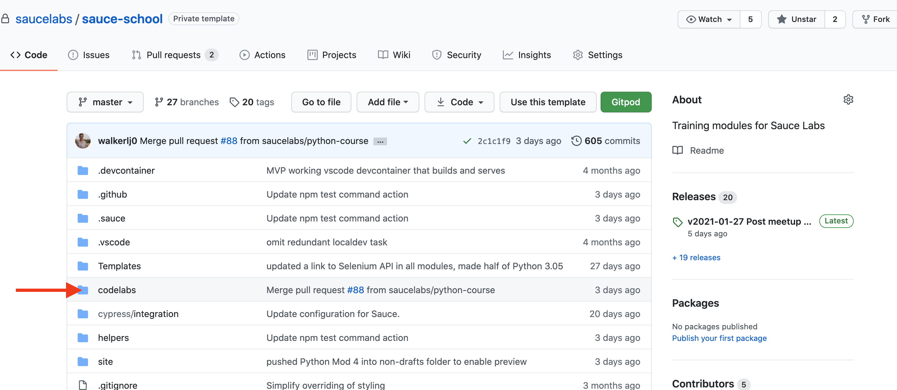
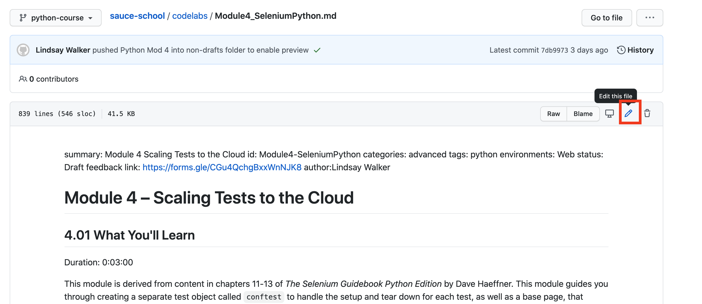
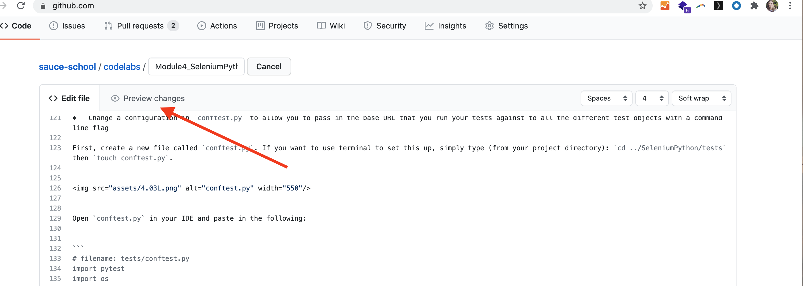
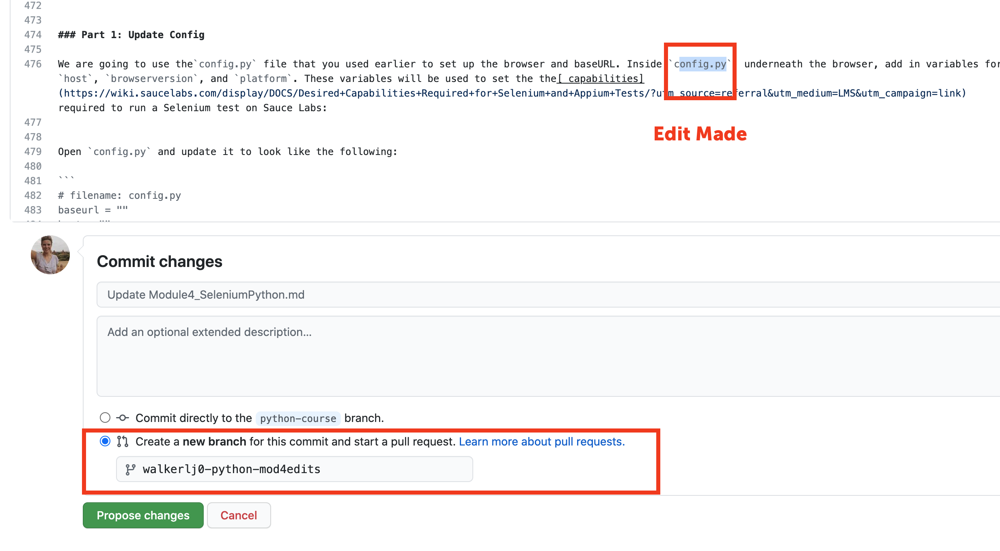
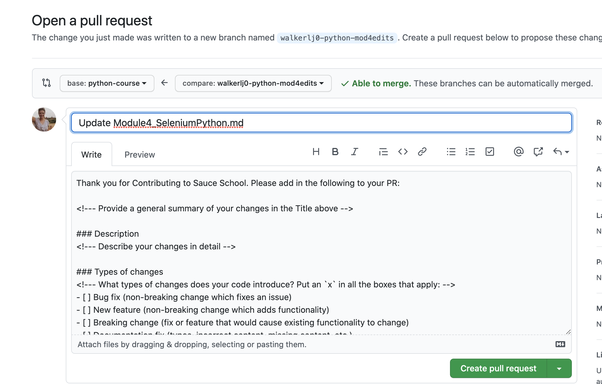
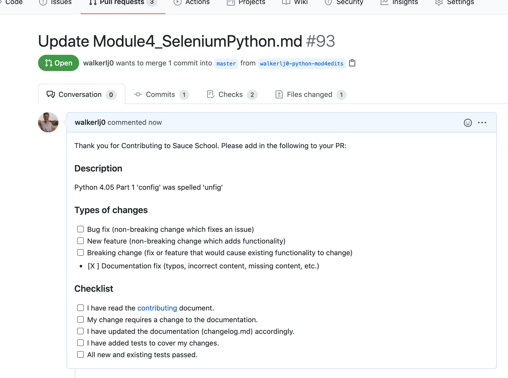

To make Edits to Sauce School modules, you can find the file, make edits, then submit a new branch, take the following steps on

**https://github.com/saucelabs/sauce-school**

**Note** – Each Module in sauce school is created in one markdown file. For example, 4.01, 4.02, 4.03 etc are all a part of the Module4_SeleniumPython.md file

1. Find the codelab module in the sauce-school repo. All modules are in the sauce-school/codelabs directory (some may be in sauce-school/codelabs/Drafts)

2. You can edit the file directly in Github, so you won’t have to bother pulling it down, using gulp serve to build, etc:

3. Make Edits in Raw mode and Preview the changes.

4. **!IMPORTANT** – If you are going to do it this way, when you finish making changes, please go to the bottom and create a new branch so I can review them before merge! Name them something that makes it obvious which module you made edits for and…

5. Make a PR!

Thanks! That’s what I ‘preciate about ya!
