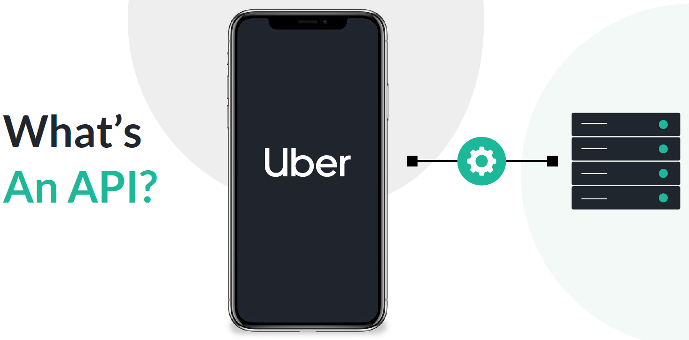
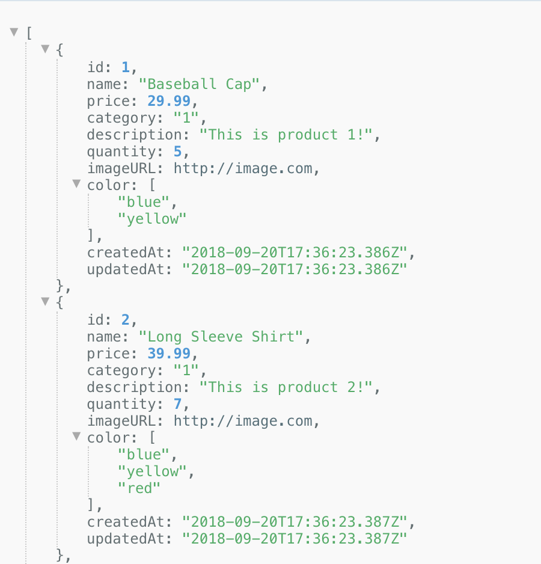

<!-- Copy this file into tools/site/coursenameFolder & start editing -->

summary: Module 1 of the API Testing course. Module 1 will give you a high level understanding of what an API is and why testing APIs is important. This course will guide you on all you need to know to get started with continuous API testing.
id: Module1-APITesting
categories: beginner
tags: api
environments: Web
status: One or more of (Draft, Published, Deprecated, Hidden)
feedback link: https://forms.gle/CGu4QchgBxxWnNJK8
author:Lindsay Walker
<!-- ------------------------ -->
# Module 1 – API Testing Basics

<!-- ------------------------ -->
## 1.01 What is an API?
Duration: 0:05:00

APIs are the term used to describe web services that connect different platforms or data services together. An example is the Uber application. The way that you search, book, and pay are all done through APIs.




APIs are not complicated, they are just data. When you search for vehicles in the Uber API, it makes this HTTP call:

```
https://api.uber.com/v1/products?server\_token=\[token\]&latitude=40.6797300818661&longitude=-73.9639477463489](https://api.uber.com/v1/products?server_token=[token]&latitude=40.6797300818661&longitude=-73.9639477463489)
```

The response is in JSON format and human readable. Here is a snippet:

```
{  
    "products":   
        {  
            "capacity": 2,  
            "product_id": "929fcc19-8cb4-4007-a54f-3ab34473700f",  
            "Price_details": {  
                "service_fees": \[\],  
                "cost_per_minute": 0.74,  
                "distance_unit": "mile",  
                "minimum": 8,  
                "cost_per_distance": 1.62,  
                "base": 0,  
                "cancellation_fee": 5,  
                "currency_code": "USD"  
            },  
            "Image": "https://d1a3f4spazzrp4.cloudfront.net/car-types/mono/mono-uberpool.png",  
            "cash_enabled": false,  
            "shared": true,  
            "short_description": "Pool",  
            "display_name": "UberPool",  
            "product_group": "rideshare",  
            "description": "Shared rides, door to door"  
        }  
}
```
You can see that number of people riding, the cost, and other relevant information about that product, or individual ride.

### Glossary

#### HTTP APIs

There are many different types of APIs, the term itself has become vague unfortunately. For our purposes we will always be talking about HTTP APIs. APIs that can be hit with an HTTP call.

There are two types of HTTP APIs, REST and SOAP. That is a huge topic, but from a very high level:

#### SOAP

This was the most commonly used format, but is now seen as a legacy technology. It’s advantage is that it’s simple and can return a bunch of data. The negative is that it is very poor for more interactive usage, like we see with mobile applications today.

#### REST

REST is the most common protocol we see today, and more robust overall. It’s specifically made for interactive usage, such as mobile applications.

#### GraphQL

A querying language gaining popularity and made by Facebook, that allows you to specify which data you want (and nothing you don't) returned by an API call in a single request.

The response of an API call can come in many different formats. Again, for simplicity we will just focus on the ones that apply to what API Fortress can test.

#### XML

This is a very straightforward format that can return in virtually any layout. An example:

```
<?xml version="1.0" encoding="UTF-8"?>
<XML>
   <note>
      <to>Patrick</to>
      <from>Mom</from>
      <subject>Reminder</subject>
      <body>We need milk</body>
   </note>
</XML>
```

#### JSON

This is the more commonly seen format in REST APIs today. The Uber example is in JSON. It’s more standardized and therefore cleaned for machines to understand.

#### Object

This is the item that has data associated with it. If you look at the Uber response again, `display_name`, `description`, and `Image` are examples of individual objects within the JSON file.

#### Assertion

A rule or specific test against a single object and/or piece of data. The API Fortress platform is powered by a proprietary XML language with over 70 assertions, that handle just about every scenario in a very quick and easy way to write.

<!-- ------------------------ -->
## 1.02 Isn't Testing the UI Enough?
Duration: 0:06:00

This is a fairly common misconception. While yes, UI testing does trigger API calls, it does nothing to test the API itself.

We have a PDF dedicated to this topic [here](https://drive.google.com/a/apifortress.com/file/d/1UfXIcdZQFDmbXO2n_NHACdpenI23BphC/view?usp=sharing).  

API failures are very difficult and nuanced, and because of this can last longer and cost you more money. Sometimes an API issue is actually a data issue, and that's another reason why we discuss dynamic data sources as a best practice later on.  

We obviously believe strongly in the value of API testing and automation, but we can also quote other experts. First, a quote from Forrester:

Negative
: "Modern applications require a shift of the current 80% UI automation... shifting about 80% of that test automation API test automation."  – Diego Lo Giudice, Forrester Wave 2017

Our next expert is Michael Cohn in his post about the “Test Automation Pyramid.”  

Negative
: “Where many organizations have gone wrong in their test automation efforts over the years has been in ignoring this whole middle layer of service testing. Although automated unit testing is wonderful, it can cover only so much of an application’s testing needs. Without service-level testing to fill the gap between unit and user interface testing, all other testing ends up being performed through the user interface, resulting in tests that are expensive to run, expensive to write, and brittle.” – Michael Cohn, [The Forgotten Layer of the Test Automation Pyramid](https://www.mountaingoatsoftware.com/blog/the-forgotten-layer-of-the-test-automation-pyramid)

Basically, APIs are at the core of modern platforms, and they are as susceptible to issues as the websites and mobile applications. In today's tech environment, everyone is looking to "innovate faster." Yes, it's a buzzword, but it's also a real thing.

Everyday we deal with huge enterprises transforming their legacy internal systems to APIs, and these APIs then power new mobile apps, internal platforms, partnerships, countless potential new revenue streams for any company. The world is built on REST APIs, and they require the same level of effort in terms of testing and monitoring.

<!-- ------------------------ -->
## 1.03 What is Continuous Testing
Duration: 0:04:00

API testing isn’t easy, and there are many different ways in which a bad API can cause catastrophic harm to an organization. We will dive into best practices and details a little later, but let’s quickly run through what we're talking about when it comes to continuous testing.

As a reference point, this is what a normal [HTTP based REST API](http://demoapi.apifortress.com/api/retail/product), with a JSON output looks like. Each of these types of testing are part of a continuous testing strategy. They cover a good amount, and we do our best to explain them, but keep in mind terminology and definitions are always evolving.

#### Functional Testing

Looking at the API above, you see a payload with various objects. The first item you should be testing is that the API responds as expected from a functional standpoint.



This means every object exists, and the responses are within expected ranges. For example the _quantity_ object should always be a whole number. There can't be .5 baseball caps.

#### Validating Business Logic

Imagine you are an ecommerce company with a product API, similar to the one we shared. First, you should be testing that each product has all the objects it expects.

The next layer is where skill and creativity in test creation are required. Let's say that you search for 'red' and you receive both shoes and pants. Now all products should contain a _size_ object, but they are very different size ranges. Adding the intelligence to a test that says, "If this is a pair of shoes, size should be between 4 and 17." That is business logic validation. This is where you need a skilled team that knows the expectations of the API, and how to manipulate and validate them.

#### End-to-End / Integration Testing

APIs are meant to interact with one another, and that flow has to work in its entirety. By creating proper integration tests you can validate flows that resemble actual users behaviors. For example, creating a single test that can:

_Search > Pick a Size > Add to Cart> Checkout_  

For many companies that entire flow can be done on the API level, and should be. This allows you to confirm that when you add a product to cart, it actually works.  

#### Monitoring

Monitoring is probably the most valuable, and yet underused, type of testing. APIs issues are often only found in live environments when using live data.

The goal of a proper monitoring strategy is to go beyond measuring uptime, but also measuring functional uptime. An API can return a statuscode of 200 and still be failing. We have even seen APIs built so that even when there is an error it returns as a 200. What's important to note is that you can use existing functional tests as your monitor. With the right platform choice, you can schedule them to run against live environments in certain intervals. Then use that monitoring to have a real-time status page across departments.

#### Load Testing

This is fairly easy to understand. Make sure your APIs perform when under the stress of a lot of users. This can help find memory leaks, or under performing databases.

It's also important, again, to use existing tests as your load tests. You will never have 10,000 concurrent users only performing a single call. They will perform different types of calls, or a series of calls with some randomness. Use existing functional and end-to-end tests.

#### A Summary

Ultimately, continuous testing means leveraging all of these types of tests, automatically. A constant series of functional and non-functional (performance) tests to constantly validate your APIs.

<!-- ------------------------ -->
## 1.04 Quiz
