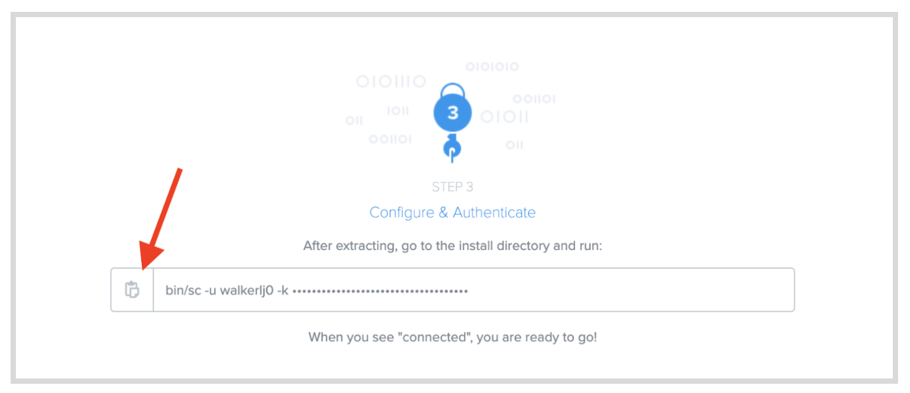
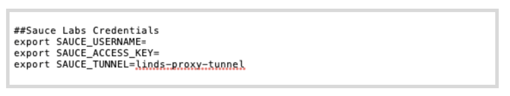

summary: Module 1 of the set of tutorials on Sauce Labs offerings and features.
id: Module1-SauceConnect
categories: beginner
tags: saucetools
environments: Web
status: Draft
feedback link: https://forms.gle/CGu4QchgBxxWnNJK8
analytics account: UA-86110990-1
author:Lindsay Walker
<!-- ------------------------ -->
# Tutorial 1 – Sauce Connect for Testers

<!-- ------------------------ -->
## 1.01 What You'll Learn
Duration: 0:01:00

This tutorial gives examples you can follow along with using a test suite written in Java, using the JUnit4 test runner, as well as the Maven build tool. If you would like to follow along, you can [download or fork and clone this project](https://github.com/walkerlj0/Selenium_Course_Example_Code)
* Look in the _/java/Mod4/4.06_ directory, and use the version of the test suite in 4.06 to start to make changes to your code.

### In This Tutorial
* Learn to download, setup,  and run the Sauce Connect software on your machine
* Learn to modify Java test code with JUnit4 test code to run automated tests on Sauce Labs using the secure Sauce Connect Proxy Tunnel
  * See how to add the tunnel name in your capabilities or configuration file
* Run a tunnel with common flags such as:
  * `-v` for verbose logging
  * `-i` for a tunnel identifier
* Find the log file & interpret the results
* Configure the domain (SSL bumping)


<!-- ------------------------ -->
## 1.02 Install and Setup Sauce Connect Proxy

[Sauce Connect Proxy](https://wiki.saucelabs.com/display/DOCS/Sauce+Connect+Proxy#:~:text=Sauce%20Connect%20Proxy%E2%84%A2%20is,or%20behind%20a%20corporate%20firewall.) is software that enables you to establish a secure connection between applications hosted on an internal server and the Sauce Labs virtual machines (such as Jenkins) or real devices that are used for testing. It also allows you to create a secure connection for uploading tests, application, and source code.

#### Video
[Set Up Sauce Connect Proxy](https://youtu.be/cpBcGeZ_wQU)

<video id="cpBcGeZ_wQU"></video>

In many cases, testers need to run their tests on internal sites. These can be dev/staging versions of their production site or actual internal sites only employees use. In either case, these sites are not available out in the open internet for sauce to access. The best, most secure option is to create a connection with Sauce Connect Proxy. Sauce Connect Proxy uses a proprietary [TLS protocol](https://www.cloudflare.com/learning/ssl/transport-layer-security-tls/) to encrypt traffic between Sauce Labs and your network and servers.


### Download Sauce Connect Proxy

The first step is to download The Sauce Connect Proxy software -- available on the **[Sauce Connect Proxy](https://wiki.saucelabs.com/display/DOCSDEV/Sauce+Connect+Proxy)** page in the Sauce Labs Cookbook -- and extract the contents of the **.zip** or **.gz** download package. You can also get the software on the [Sauce Labs](https://accounts.saucelabs.com/am/XUI/#login/?utm_source=referral&utm_medium=LMS&utm_campaign=link) platform under **Tunnels.**


Once you’ve extracted the contents, take the Sauce Connect Proxy folder and move it into another directory. In this example, the Sauce Connect software has been moved into the **Documents** folder.


### Set Sauce Labs Environment Variables
You will need to have environment variables set for Sauce Labs on your local machine or CI tool in order to run your tests.

 Watch [this video](https://drive.google.com/file/d/1qezKtvBpn94bBTJgbAd2MSx4ByNx7oaz/view?usp=sharing) to learn how to set up environment variables with your Sauce Labs credentials on a Mac, or view the [instructions for Windows](https://docs.google.com/document/d/1Cb27j6hgau5JHmAxGHPihd3V4Og3autPCei82_m1Ae8/edit?usp=sharing).

### Start The Tunnel

Go to the **Tunnels** tab in the Sauce Labs app.


You can copy the command that you will find at the bottom of the **Tunnels** page, and paste this into your terminal as well, instead of typing what is above. Once you paste, append the command line with `-i <Sauce tunnel name>`. In this example, I’ve called mine `linds-proxy-tunnel.`



Your command should look like this:


Navigate to the folder using the terminal where you saved the Sauce Connect download (this one is in **Documents/sc-4.6.2-osx**). Next, type and run the command below. Make sure to fill in your credentials (username after the `-u` command and access key after` -k`) and add your tunnel name (aka tunnel identifier) after the `-i `command.


```
bin/ sc -u <SAUCE_USERNAME> -k <SAUCE_ACCESS_KEY> -i <SAUCE_TUNNEL>
```


 Learn more about the other commands you can use to configure your tunnel at [Sauce Connect Proxy Command-Line Quick Reference Guide](https://wiki.saucelabs.com/display/DOCS/Sauce+Connect+Proxy+Command-Line+Quick+Reference+Guide). Hit enter and you should see your tunnel up and running.


### Shared Tunnels

 Many companies may also choose to have their organization set up _Shared Tunnels_ on Sauce Labs, which anyone in their organization can use without having to worry about configuring their own tunnel.

 To use a parent tunnel simply check the **Tunnels** tab on your Sauce Labs app to see your shared tunnels. You should be able to see the shared tunnel name, as well as an indication that it is in fact a shared tunnel, then use that ad the `tunnel-id` in your test suite:

 


<!-- ------------------------ -->
## 1.03 Run Tests Using Sauce Connect Proxy

Once your tunnel is up and running, (you should see the message Sauce Connect is up in terminal)  and you have updated your `config.java` and `BaseTest.java` files, you can run update your test code and run tests in Sauce Labs using Sauce Connect Proxy. Make sure your  `.bash_profile` (or `.zshrc`) has the `SAUCE_TUNNEL` environment variable (it must match the` tunnel id` you used to start the tunnel).




### Set Sauce Connect Tunnel Capabilities
This example shows how to set the capabilities in an example Java Test Suite, written with the JUnit4 test runner, and run and managed using Maven. [See the example suite this is created from](https://github.com/walkerlj0/Selenium_Course_Example_Code/tree/master/java/Mod5/5.03).


#### Update Test Code
This test is importing environment variables in the _tests/Config.java_ file, for your `SAUCE_USERNAME `and` SAUCE_ACCESS_KEY,` you will set up an environment variable for your` SAUCE_TUNNEL` here as well.This variable will store the tunnel identifier, so after you start up a Sauce Connect tunnel, you can run your tests using it.

Add the variable `sauceTunnel `in your `Config.java` file, at the bottom of the list of variables:


```
// filename: tests/Config.java
//...
    public static final String sauceTunnel = System.getenv("SAUCE_TUNNEL");
}

```


Next, in `BaseTest.Java`, you are going to add in a third, `else if `statement that accounts for when you are running a test with Sauce Connect. It’s almost exactly the same as the case when the host is` "saucelabs"` except you will be adding in the Sauce Option for the tunnel


```
// filename: tests/BaseTest.java
// ...
else if (host.equals("saucelabs-tunnel")) {
    MutableCapabilities sauceOptions = new MutableCapabilities();
    sauceOptions.setCapability("username", sauceUser);
    sauceOptions.setCapability("accessKey", sauceKey);
    sauceOptions.setCapability("name", testName);
    sauceOptions.setCapability("tunnelIdentifier", sauceTunnel);
    MutableCapabilities capabilities = new MutableCapabilities();
    capabilities.setCapability("browserName", browserName);
    capabilities.setCapability("browserVersion", browserVersion);
    capabilities.setCapability("platformName", platformName);
    capabilities.setCapability("sauce:options", sauceOptions);
    String sauceUrl = String.format("https://ondemand.saucelabs.com/wd/hub");
    driver = new RemoteWebDriver(new URL(sauceUrl), capabilities);
    sessionId = ((RemoteWebDriver) driver).getSessionId().toString();
    sauceClient = new SauceREST(sauceUser, sauceKey, DataCenter.US);
}

// ...
```


In this case, which you have named `saucelabs-tunnel`, when you run your test, you will set all the capabilities you did before, but notice how the `sauceTunnel` variable is being used by `setCapabilities`, right under where you set the `testName` capability. The reason that we need to create a whole new case is that the tests will error if they are given a tunnel identifier, and it is not used.


### Run Your Tests

You will want to restart your terminal and run `source ~/.bash_profile` so your machine looks for the new `SAUCE_TUNNEL` variable.  

Now try running the command in terminal:


```
mvn clean test -Dhost=saucelabs-tunnel
```


### NOTE

Negative
: You can also go to `Config.java`, change the host to `saucelabs-tunnel` instead of using the `-Dhost=` flag and just run  `mvn clean test`:


```
// filename: tests/Config.java
// ...
   public static final String host = System.getProperty("host", "saucelabs-tunnel");
// ...
```


You will run your test through the tunnel, and when you log into the SauceLabs UI, you should see the tests being run, and that there is an active tunnel:


You can see example code for this lesson [here.](https://github.com/walkerlj0/Selenium_Course_Example_Code/tree/master/java/Mod5/5.03)


### Final Code


<!-- ------------------------ -->
## Section X
Duration: 0:05:00


<!-- ------------------------ -->
## Section X
Duration: 0:05:00
