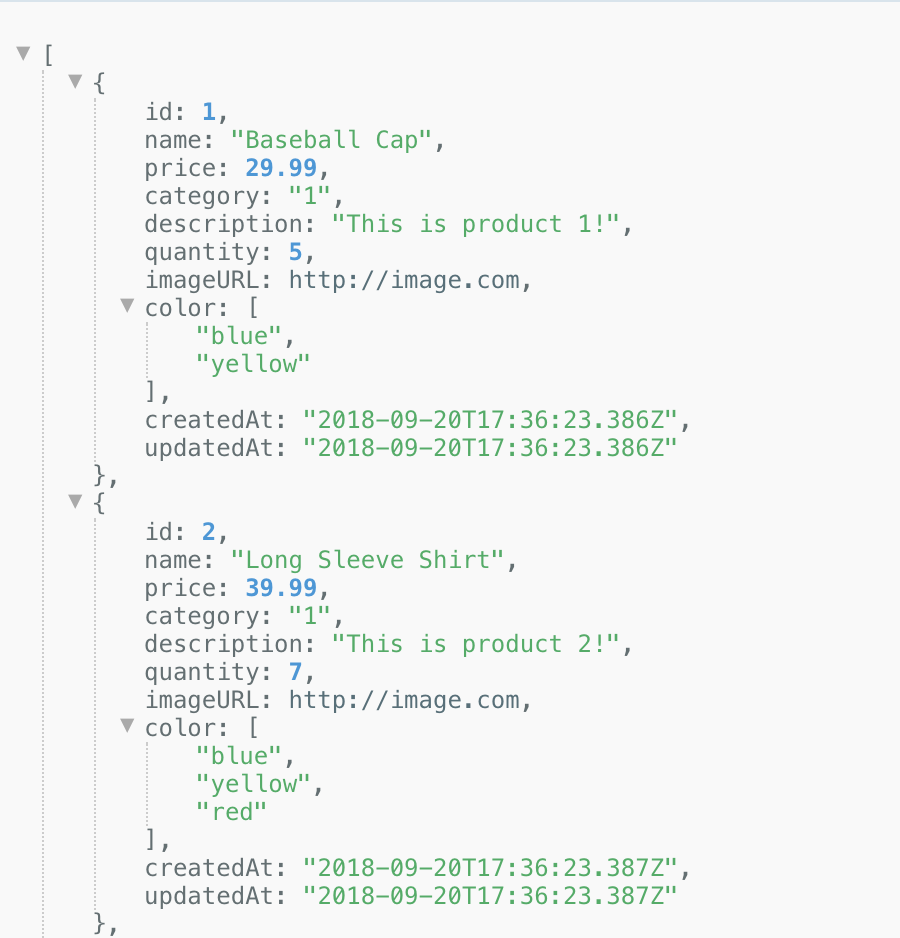

<!-- Copy this file into tools/site/coursenameFolder & start editing -->

summary: Module 2 of the API Testing course. Once you have completed module 1, jump into module 2 where you will learn some basic and more advances methodologies for creating good API tests.
id: Module2-APITesting
categories: beginner
tags: api
environments: Web
status: One or more of (Draft, Published, Deprecated, Hidden)
feedback link: https://forms.gle/CGu4QchgBxxWnNJK8
author:Lindsay Walker
<!-- ------------------------ -->
# Module 1 – API Testing Basics

<!-- ------------------------ -->
## 1.01 What is an API?
Duration: 0:05:00

<!-- ------------------------ -->
## 1.02 Title
Duration: 0:06:00

<!-- ------------------------ -->
## 1.03 Title
Duration: 0:04:00
