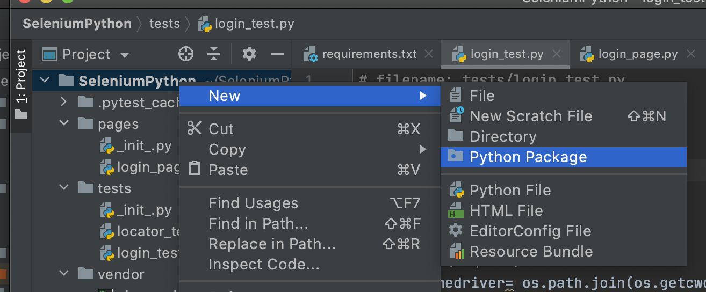
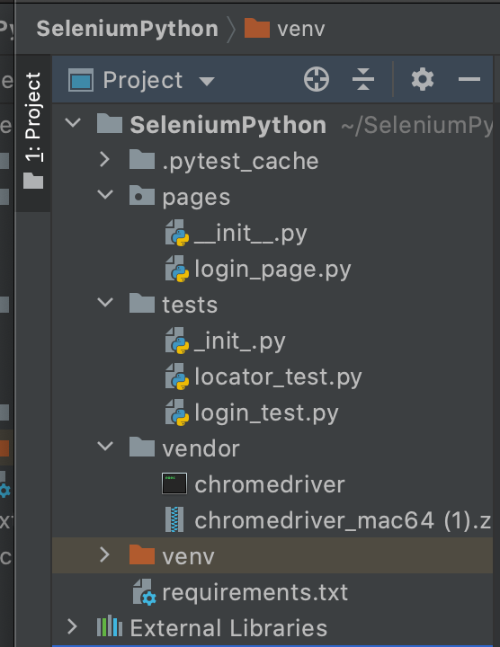
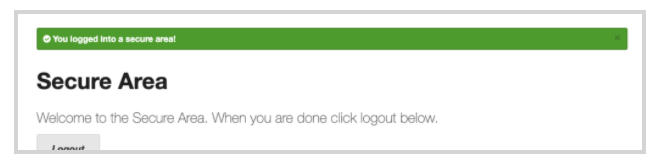

summary: Module 3 Writing Reusable Test Code
id: Module3-SeleniumJS
categories: advanced
tags: javascript
environments: Web
status: Published
authors: Lindsay Walker
Feedback Link: https://forms.gle/CGu4QchgBxxWnNJK8
analytics account: UA-6735579-1
author:Lindsay Walker

# Module 3 — Writing Reusable Test Code

<!--- ------------------------ -->

## 3.01 What You’ll Learn
Duration: 0:03:00

This module is derived from content in chapters 8-10 of _The Selenium Guidebook JavaScript Edition_ By Dave Haeffner. This module focuses on writing tests in Selenium that follow the Page Object Model (POM) for organizing test suites and abstracting imperative code into separate classes from the page and test classes. Add error handling to your test suit to detect and debug more easily, as well as learn about explicit and implicit waits and how they should be used.

### Objectives

*   Create a Base Page and use the simplified commands created with other pages to write code that is easier to read and maintain
*   Create tests that have separate code for the Page and Test Objects, with pages that draw on one or more tests to perform desired actions on that specific page
*   Add elements into your test suite for error handling, to alert test runner to common reasons for tests to fail, such as invalid credentials or failure of a page to load
*   Apply a `try...catch` statement in your code to allow all tests to run (without throwing an exceptions that stop your test suite)
*   Write code with explicit waits that are applied to individual actions, not entire functions or classes, and that doesn’t rely on implicit waits
*   Create a _facade layer_ that separates and defines simple commands that are used by all tests and page objects
*   Identify and fix problems in test suites such as poor locators, silent failures, and too much functionality in a single class
*   Choose and separate imperative language into separate objects and pages, and use the simplified commands created in that class with other tests to write code that is easier to read, maintain, and declarative in nature
*   Analyze and plan test suites, learning how to balance the size and maintainability (ability to check failed tests) against the amount of features you want to test, as well as the level of abstraction you want to use to make modular objects to use in your test suite
*   Use the Page Object Model and create separate directories and files that are for Page objects and Test objects, and understand how they work together to make a full test suite
*   Understand how the latency that naturally occurs when you test in the cloud can impact the usability of test suites, and what you can do to ensure your tests can be run in any environment
*   Understand what implicit and explicit waits are, and the effects that occur along with latency when test suites are moved from a local machine to the public cloud


### Base Code

If you skipped Modules 1 & 2, make sure you have a project folder set up and have created the following files, as well as have NodeJS installed and init for this project:

**[Final Module 2 Project Code](https://github.com/walkerlj0/Selenium_Course_Example_Code/tree/master/python/Mod2/2.07_solutions)**


### Use GitHub Repository (Optional)

If you are familiar with using GitHub to write your code, you can also clone or download the repository above to use as the base to write your test from.


## 3.02 The POM and Imperative vs. Declarative Tests
Duration: 0:08:00

The Page Object Model (POM) is a design pattern that can be used with Selenium with any kind of framework. Using this pattern for tests means that you create two separate types of classes; **Pages** and **Test Cases**. The **Page** classes set up and navigate items on the page, using variables to represent web elements, and **Test** classes perform the actual assertions and tests.


Rather than integrate the calls to Selenium directly into your test methods, you can create separate classes. The POM allows you to write your tests using user-centric language, rather than Selenium-centric language.

Some general guidelines for creating page objects ( classes) include:

*   The public methods represent the services that the page offers
*   Try not to expose the internals of the page
*   Generally don't make assertions
*   Methods return other PageObjects
*   Need not represent an entire page

(Source: [https://github.com/SeleniumHQ/selenium/wiki/PageObjects](https://github.com/SeleniumHQ/selenium/wiki/PageObjects))

Different results for the same action are modeled as different methods. Using strategies like this means that when your application changes and your tests break, you only have to update your page objects in one place in order to accommodate the changes. This gives us reusable functionality across our suite of tests, as well as more readable tests.

### Imperative vs. Declarative Test Language

_Imperative language_ is language that gives you the step-by-step directions for how to do something. As an example, instead of telling someone to make a peanut butter and jelly sandwich (which is a declarative statement), imperative language would tell you to lay down two pieces of bread, spread peanut butter on one, spread jelly on the other, then put the pieces together.

What is the problem with this? It doesn’t give a good sense of the purpose of the task. An alien from outer space may put the sandwich together with the jelly-side facing out, since they don’t know what the end result is supposed to be.

#### Video

Take a look at this snippet of a Sauce Labs meetup talk by Titus Fortner to see an example of imperative and declarative language.

[3.02_Imperative_Declarative](https://drive.google.com/file/d/1zq2JBVjFwupuq2NbsrkW5vHrIOFR3xer/view?usp=sharing)


## 3.03 Your First Page Object
Duration: 0:12:00

One of the biggest challenges with Selenium tests is that they can be brittle and challenging to maintain over time. This is largely due to the fact that things in the application you're testing change - like elements that appear on the screen or even the flow & layout of your website — causing your tests to break.

But the reality of a software project is that _change is a constant_. So you need to account for this reality somehow in our test code in order to be successful.

This is where page objects come in, to help reduce duplicate code, and make maintaining a test suite easier. Instead of writing the code to navigate the page and run a test in the same place, you can separate those two types of actions into page and test objects.

That way, if you have written several tests on the same page, you only have to change the code in one place.


#### Part 1: Create A Page Object

Let's take our login example from earlier, create a page object for it, and update our test suite structure.

First we'll need to create a new folder called `pages` in the root of our project directory.

In both the **tests** and **pages** directory, you will want to create a blank file called `_init_.py`. The purpose of this file is to let Python and Pycharm know that these directories should be treated as packages.
 * Right click on the top-level folder and choose **New > Directory**. Name the directory **pages**.
 

 * Right click on the **pages** package and create a file names **login_page.py**.

 * Within both the **pages** and **tests** directories, and add in a file that will remain blank, called **\_init_\.py**.
 

 * Once you are done, your directory structure should look like the following:
 


Open `login_page.py` in your text editor and add in the following code:
```
# filename: pages/login_page.py
from selenium.webdriver.common.by import By

class LoginPage():
    _username_input = {"by": By.ID, "value": "username"}
    _password_input = {"by": By.ID, "value": "password"}
    _submit_button = {"by": By.CSS_SELECTOR, "value": "button"}
    _success_message = {"by": By.CSS_SELECTOR, "value": ".flash.success"}
    _failure_message = {"by": By.CSS_SELECTOR, "value": ".flash.error"}

    def _init_(self, driver):
        self.driver = driver
        self.driver.get("http://the-internet.herokuapp.com/login")

    def with_(self, username, password):
        self.driver.find_element(self._username_input["by"],
                                 self._username_input["value"]).send_keys(username)
        self.driver.find_element(self._password_input["by"],
                                 self._password_input["value"]).send_keys(password)
        self.driver.find_element(self._submit_button["by"],
                                 self._submit_button["value"]).click()

    def success_message_present(self):
        return self.driver.find_element(
            self._success_message["by"], self._success_message["value"]).is_displayed()

    def failure_message_present(self):
        return self.driver.find_element(
            self._failure_message["by"], self._failure_message["value"]).is_displayed()

    def test_invalid_credentials(self, login):
        login.with_("tomsmith", "bad password")
        assert login.failure_message_present()
```

Notice how this new page object creates variables for all the elements you will interact with on the page, from the username files to the success message.

It also defines a constructor in `__init__` that will create a new instance of the page each time a test is run. (_Note the double underscore before and after \_\_init\_\__). The `self` parameters that you see in the functions are to let python know that it should use the attributes and methods defined in the method itself, as there is no way to define private methods & attributes with Python and you want to make sure your function is using the correct one.


The `with_` method contains the core functionality of entering the information and logging into the page. If the login flow changes, you would only have to change this method to be able to reflect that in all your tests.

Lastly, the different types of test methods are created at the bottom of the page in able to perform any checks you may with to perform. `success_message_present`, takes parameters for the type of locator and value of the locator (such as CSS selector) to check to see that the final success message is present on the screen after you log in.




#### Part 2: Update the Login Test to use the Page Object

Now open the file in the test folder named `login_test.py`. You will add a few things into the test so that it can work with the `-------` file you just created.

Under the `----------`, add


#### Final Code

Your new code in `LoginTest.js` should look like this:


Run `-----test` and you should get this success message:


See the complete [source code here]().

## 3.04 Writing Code with Error Handling
Duration: 0:10:00

When you write tests, you are checking for one specific thing to occur. In the last example, you were checking for a specific situation where the user logs onto the login page, enters their username and password, and then they get a message indicating their success.

There is more than one reason, however, why that test might fail. The test you wrote kind of assumes that the user and server for the website did everything right, and is testing to see if the app responds with a success message as expected. Some other reasons why the success message might not display include:

*   The user enters the wrong username and/or password
*   The page fails to load properly in the first place

The term _Error Handling_ refers to creating cases that check for predictable negative outcomes or conditions so when the test is run, it accounts for other possible errors or failure cases.

### Part 1: Test for Invalid Login Credentials

Creating a page object may feel like more work than what you started with initially, but it's well worth the effort. Now that you have the entire process for things like the `authenticate()` method which completes several actions with one method, you can use it over and over again in multiple tests, and only have to make changes in one place.

Let's add a test that checks for a failed login to demonstrate.

First, let's take a look at [the markup](https://the-internet.herokuapp.com/login) that renders when you provide invalid credentials:


We will use the `flash error` classes in our assertion. Open `------------`. .......

Run `------ test` and you should get this error message:


#### Final Code

The updated `-----` code should look like this:


### Part 2: Check the Page

Before you can call our page object complete, there's one more addition you should make.

#### Final Code

The code for the the `--------` should now look like this:


## 3.05  Common Issues with Test Code Reuse
Duration: 0:17:00

In the previous lesson, you stepped through creating a simple page object to capture the behavior of the page you were interacting with. While this is a good start, there's more you can do.

As our test suite grows, and you add more page objects, you will start to see common behavior that you will want to use over and over again throughout our suite. If you leave this unchecked you will end up with duplicative code which will slowly make our page objects harder to maintain.

Right now you are using Selenium actions directly in your page object. While on the face of it this may seem fine, it has some long term impacts, like:

*   It can slow page creation & rendering due to the way the JavaScript or other library loads things on the page
*   You may need to update your test code (added maintenance for each page) because of updates and changes to the [Selenium API](https://www.selenium.dev/selenium/docs/api/javascript/index.html)
*   The inability to swap out the driver for your tests. You may in the future, for instance, want to swap out commands in Selenium for commands in Appium (for mobile testing)

What you will do now is set up a Base Page that will create descriptive variables and methods, then use those created methods to interact with other pages. This way, if you need to swap out, say, a Selenium method for an Appium method, instead of having to do it in each and every page, you can change the BasePage.js methods to Appium-specific ones, and not have to change all of your other pages.


### Part 1: Create a Facade Layer

Creating a _facade layer_ involved creating a separate page or class from your test page, that helps you simplify the language to carry out simple commands like `-------`, as well as check an assertion after, and simplify this process into a single command like `type()` or `find()` so that these methods can be easily used by the rest of the test suite. In this lesson, you will create a simplified interface called `---------`, which you will then use within our `----------` class.

First let's add a new file
//...


### Deleting Tests

Even though you may have grown attached to test that you worked hard to create, it can often be a huge help to your testing suite to just delete tests that aren’t worth your time. Ask yourself the following questions:

*   How important is this test? (Do you really need to locate & return what that button says?)
*   How likely is this test to fail if the code changes? (High likelihood? Delete or refactor!)
*   How likely is this test due to fail if things run slowly?
*   How likely is this test to take up a lot of QA time figuring out why it failed?
*   How many individual pieces of functionality does this test actually check? (if it’s more than one it’s time to delete or refactor it into separate tests)

Too many tests can be an even bigger problem for a QA team than too few. Figuring out how and why a test fails takes up more time than it is worth, and impedes the feedback a dev team needs to push a feature into production. Take the time to consider the balance between `testAllTheThings()` and testing efficiently and effectively, and don’t be afraid to delete tests and or useless objects and start fresh.


Source: [Giphy](https://giphy.com/gifs/baby-bye-slide-m9eG1qVjvN56H0MXt8)

Since you are not really using `--------`, now would be a good time to delete that test before adding in the new classes in this module.

To delete `--------`, right click on it........


### Part 1 Create a Facade Layer

Next let's open `----- `in your IDE and insert the following code:
// ...


In this module, you declare a BasePage class along with methods for all of the common behavior you use with Selenium  (`visit`, `find`, `click`, `type`, and `isDisplayed`). // ...

Now open `LoginPage.js` from the same folder, and import the base page class you just created by putting ......

A few things have changed in our Login page object. We've imported the base page class you want to use, established inheritance between the two classes, and we've swapped out all of our Selenium commands with calls to the methods in the base page object (e.g., `this.visit, this.type, this.click`).

#### Final Code

Your final code at this stage should look like this:


### Part 2: Exception Handling........

##### Cheat Sheet

[3.04 Exception Handling Cheat Sheet]()

Next, in  `------` make a change

Now when you run your test (`-------` in terminal from your project folder), you should see one passing and one failing test. ........


Let's change the password back to `--------` and r

//...

When you run your test, you should get two success messages:


Review the [final code]() for the project in this lesson.

#### Final Code


Review the [complete source code]().

### Quiz


## 3.06  Resilient Test Code and Timing — Page with Explicit Waits
Duration: 0:12:00


Ideally you should be able to write your tests once and run them across all supported browsers. More often than not, however, you will run into unexpected problems running a test in all environments, and sometimes there may be a hack or two involved.

Choosing high quality locators will help with this, but there are still some issues to deal with; most notably, timing. This is especially true when working with dynamic, JavaScript-heavy pages, which is is something you will find with most web applications.

There is a simple way to design the bedrock of reliable and resilient Selenium tests — and that's how you wait for elements you want to interact with. The best way to do this is through the use of explicit waits.

### Explicit Waits

One important thing to understand with the Selenium framework is that each method you write requires a round-trip communication between the tests and the devices. When you use these tests on the cloud, and to test remote devices, the round trips can start to take a very long time.


A function like the `--------` function here has a total of ------ “round trips” to do.

```
-
```

In this example....

### Implicit vs. Explicit Waits

Explicit waits pause your test execution until a specified event triggers, which prevents errors due to lag. For example, you can ask your code to wait until something is clicked, until something loads on the page, and much more.

Implicit waits pause your test execution for a specified amount of time before continuing to the next function or class. You can also pause your test execution indefinitely (including any asynchronous commands within the program) with a `sleep` command, which would then require an additional command to "wake up" and continue.


Source: Kristin Schmit, Flickr ([https://www.flickr.com/photos/giraffecereal/5860286735](https://www.flickr.com/photos/giraffecereal/5860286735))

Explicit waits are applied to individual test actions. Each time you want to use one you specify an amount of time (in seconds) and the Selenium action you want to accomplish.

Implicit waits are generally not recommended, and also mixing explicit waits with implicit waits cause negative consequences. Many classes or functions have default timeouts, or the different waits may change or interfere with one another.

The only time you would want to use an implicit wait is to make sure your tests have enough time to run, especially when you move them to the cloud. When using waits, Selenium will repeatedly try an action until either it can be accomplished, or until the amount of time specified has elapsed. If the latter occurs, a timeout exception is thrown.

#### Cheat Sheet

[3.06 Waits Cheat Sheet]()


### Create a Page with Explicit Waits

We’re going to use this page as an example that demonstrates waits against [a dynamic page on the-internet.](http://the-internet.herokuapp.com/dynamic_loading/1) The functionality is pretty simple — there is a button, and when you click it, a loading bar appears for five seconds. After that, it disappears and is replaced with the text Hello World!


First we'll create a page object named `--------` in the pages directory.


Paste in the following code:

```
```
// ...

### Don’t Combine Explicit and Implicit Waits

The major benefit of explicit waits is that if the behavior on the page takes longer than you expect (e.g., due to slow load times, or a feature change), you can simply adjust a single wait time to fix the test — rather than increase a blanket, implicit wait time (which impacts every method of the test). And since the wait is dynamic, it won't take the full amount of time to complete (like a hard-coded sleep would).

If you're thinking about mixing explicit waits with an implicit wait, reconsider.  If you use both together you could run into issues later on due to inconsistent implementations of the implicit wait functionality across local and remote browser drivers. Long story short, you could end up with randomly failing tests that will be hard to debug. You can read more about the specifics [here](https://stackoverflow.com/questions/15164742/combining-implicit-wait-and-explicit-wait-together-results-in-unexpected-wait-ti#answer-15174978).

In this lesson you created `DynamicLoading-------`, but have yet to create a test you can run against it, which you will do in the next lesson.

You can see the [code examples here](h).

#### Final Code

The changes to the code at this point should look like this:


## 3.07  Testing with Explicit Waits
Duration: 0:08:00

Now that you have our new page object and an updated base page, it's time to write our test to use it.

### Part 1: Dynamic Loading Test

Let's create a new file called `DynamicLoadingTest.js` in the test directory.


The contents of this test file are similar to `LoginTest.js` with regards to its setup and structure. Open `DynamicLoadingTest-------` in your IDE and paste in the following:

```
```

In our test, `'hidden element'`,  you are visiting the first dynamic loading example and clicking the start button (which is accomplished in `dynamicLoading.loadExample('1');)`. We're then checking that the finish text gets displayed, and reporting an error if it doesn’t

#### NOTE

You have included the path variable in the test code, and commented out the code for the path because if you are using `---`, you don’t need it, but you will need it if you are managing dependencies yourself.

When you save this and run it with `---- test` from the command-line it will:

*   Launch a browser
*   Visit the page
*   Click the start button
*   Wait for the loading bar to complete
*   Find the finish text
*   Assert that it is displayed.
*   Close the browser


The `Login` test will be run as well.


### Part 2: Use the Test with Another Page

Let's step through one more example to see if our explicit wait holds up.


[The second dynamic loading example](http://the-internet.herokuapp.com/dynamic_loading/2) is laid out similarly to the last one. The difference is that it renders the final text after the progress bar completes (whereas the previous example had the element on the page but it was hidden until the progress bar finished). In other words, in the first test, the text was there but hidden, but in this test the text doesn’t even exist until after the loading image disappears.

Notice that it has the same start `<button>` element and `id='finished'` at the beginning and end of the test. Will our same test work for the second page?

Let's add a nearly identical second test // ...

//...

### Browser Timing

Using explicit waits gets you pretty far. But there are a few things you'll want to think about when it comes to writing your tests to work on various browsers.

Don't assume that tests that work in one browser will also work in other browsers. Often, different browsers operate at different speeds of execution and tests that pass on Firefox might fail on Chrome or Internet Explorer.

Chrome execution can sometimes be faster than Firefox, so you could see some odd timeout failures. This is an indicator that you need to add explicit waits to parts of your page objects that don't already have them. And the inverse is true when running things against Internet Explorer. This is an indicator that your explicit wait times are not long enough since the browser is taking longer to respond — so your tests timeout.

The best approach to solve this is an iterative one. Run your tests in a target browser and see which ones fail. Take each failed test, adjust your code as needed, and re-run it against the target browser until they all pass. Repeat for each browser you care about until everything is green.

### Closing Thoughts

By explicitly waiting to complete an action, our tests are in a much more resilient position because Selenium will keep trying for a reasonable amount of time rather than trying just once. And each action can be tuned to meet the needs of each circumstance. Couple that with the dynamic nature of explicit waits, and you have something that will work in a multitude of circumstances — helping you endure even the toughest of browsers to automate.

This is one of the most important concepts in testing with Selenium: _use explicits waits often._


#### Final Code


Run the test. This time you are going to use a different command that allows us to run specific test objects...


## 3.08 Quiz


