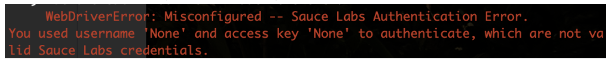

<!-- Copy this file into tools/site/coursenameFolder & start editing -->

summary: Module 4 Scaling Tests to the Cloud
id: Module4-SeleniumPython
categories: advanced
tags: python
environments: Web
status: Draft
feedback link: https://forms.gle/CGu4QchgBxxWnNJK8
author:Lindsay Walker
<!-- ------------------------ -->
# Module 4 – Scaling Tests to the Cloud
<!-- ------------------------ -->
## 4.01 What You'll Learn
Duration: 0:03:00

This module is derived from content in chapters 11-13 of _The Selenium Guidebook Python Edition_ By Dave Haeffner. This module guides you through creating a separate test object called `conftest`  ...... where ......, as well as a _Driver Factory_ which creates the `------------ `and `--------` functions used for each instance of a test.  Users will work through creating a `-------` file to store the environment variables for where (in which environment) your test is run on, and modify the DriverFactory to check & pull environment variables from `-------` Last but not least, add in some features to make your tests results easier to read and debug using the Sauce Labs platform


### Objectives


*  Analyze and plan test suites, learning how to balance the size and maintainability (ability to check failed tests) against the amount of features you want to test, as well as the level of abstraction you want to use to make modular objects to use in your test suite
*   Learn about the different categories and types of tests. Understand which types of functional tests one uses Selenium for and how the different types and categories of tests are related
*   Learn about Root Level Hooks that handle the universal methods `------- `and `------- `that all tests use, and that you can separate the common functionality that all test use with these methods in a separate file (such as`-------`) to be used with each test.
*   Understand how to create a file that configures a test environment, and how it is used with a `-------  `from a file such as`-------` to create a template that each test is built off of.
*   Identify and fix problems in test suites such as poor locators, silent failures, and too much functionality in a single class
*   Choose and separate imperative language into separate objects and pages, and use the simplified commands created in that class with other tests to write code that is easier to read, maintain, and declarative in nature
*   Create a_ Driver Factory _that creates all of the `------- ` and` ------- `functionality each test uses
*   Create a `-------` file that uses the _Driver Factory_ and works to set up each test, allowing tests to use the _Driver Factory _and a config file that specifies where and on which environment tests are run   
*   Set up a `-------` variable in `-------` that points to the app you are running tests on in the BasePage, and remove hard-coded URLs from other page objects, allowing you to specify just a sub-domain from page objects
*   Update your Sauce Labs credentials on your machine, then add functionality in your config file, using the sauce object in `-------`, to run your tests on Sauce Labs with the `--------------`.

<!-- ------------------------ -->
## 4.02 Types of Tests
Duration: 0:05:00

In testing, both automated and manual, there are several different types of tests. Not all types of tests are mutually exclusive. For example, when doing regression testing, you may use unit tests, and unit tests can be used as a piece for an integration test.


### Functional vs Non-Functional Tests

These two types of tests are ways to categorize tests by what they are testing. Functional tests check to see if a feature is or is not working, nothing more (e.g. did I log in or not log in?). Non-functional testing typically gives a value or amount that helps engineering and product teams do **performance testing** and understand and predict whether the software and features will work as expected, at scale. An example would be load testing, to see if the test runs as expected with many simultaneous users or volume testing. Sauce Labs does front-end

&lt;blockquote class="imgur-embed-pub" lang="en" data-id="Ksjm2D3">&lt;a href="//imgur.com/Ksjm2D3">DDoS Attack&lt;/a>&lt;/blockquote>&lt;script async src="//s.imgur.com/min/embed.js" charset="utf-8">&lt;/script>

(DDOS attack GIF on imgur: [https://imgur.com/Ksjm2D3](https://imgur.com/Ksjm2D3))

Selenium is most used for functional testing  Types of functional tests include unit testing, UI testing, regression testing, integration testing, and more.


### Unit Tests

Unit tests are the smallest, simplest possible type of a test you can do. They test one single action on one single page/ application, and nothing more. Often these tests are written and executed on your local machine to validate that each ‘piece’ of a more complex test works.

The typical structure for a unit test is


1. Set up the test data. (Given “x” condition”.)
2. Call the class you are testing (When “y” behavior happens.)
3. Assert that the expected results are returned. (Then “z” expected change is returned.)


### Integration Tests (Service Tests)

Much of the time, when you write test code, it’s not just one application you are testing, but many. As an example, if you were to sign up for Netflix, you would have to sign up on their website, send and receive information from their user management software (store user information to a database), as well as send and receive information from the software that processes their payments. Integration tests if and how these different services function together as a whole.

Many times integration tests can be formed from groups of unit tests. You can think of an integration as combining API tests with unit and UI tests to test how the entire service works.


### UI Tests

A UI Test is a test of the visual interface a human user would interact with. Selenium is very well suited to these kinds of tasks.  You can test the layout and behavior of a test easily, as well as track the usability of user flows. Many times the UI test can give insight into how well a test is functioning. As an example, if you see an ‘error message’ in the UI when you log in, you can tell that something went wrong when trying to submit the username and password for authentication.


### Regression Tests

A specific set of tests that verify that the changes being made (features) don’t break your application. Integration is more of a methodology than a specific way to write a test. These tests can include unit and integration tests, but the difference here is this set of tests is created with the purpose of checking to make sure a change doesn’t break the application.


### End-to-End Tests

Similar to system testing, can include just following a users’ workflow in a visual interface, or include everything that occurs in an application environment, doing a situation that mimics real-world use. This includes actions such as interacting with a database, using network communications, or interacting with other hardware, applications, or systems if appropriate along a specific user flow.


### Black Box vs. White Box Testing

White Box testing is a type of testing you do when you can see and understand all of the inner workings of an application and it’s source code. Black Box testing is testing that is done from the end-user perspective, without any knowledge of the internal structure of application code. A good example of this is testing a workflow on the user interface of a web application. It is reasonable to assume for a login test, that if you put the correct username and password, click submit, then get access to the platform that the code for making this happen on the back end is also working.


### [Headless Testing](https://saucelabs.com/blog/headless-browser-testing-101)

This type of testing refers to a code-based approach to testing web applications. When a human user is manually testing an application, they are looking at the visual browser interface with items you can see, click, and interact with. Headless testing is done by a robot that doesn’t use the visual component of a browser, and instead does all interactions through communication with the codebase and other services that make up an application. [Sauce Labs ](https://accounts.saucelabs.com/am/XUI/#login/?utm_source=referral&utm_medium=LMS&utm_campaign=link) also provides headless user testing .


## 4.03 Scaling your Tests

Now that we have some tests and page objects, we'll want to start thinking about how to structure our test code to be more flexible. Ensuring that our code is reusable, and can scale to as many tests as we need requires some additional elements & abstractions.


### Part 1: Global Setup & Teardown

We'll start by using a separate class for Selenium setup and teardown out of our tests, placing the file in a central directory.

We'll create three things.


*   A class that will contain the creation and destruction of our Selenium instances (known as a `-------`)
*   A helper that all tests will pull from to do the basic things each test should do such as `-------` and `-------`
*   Change a configuration in `------- `to `-------`


#### NOTE

If you want to use terminal to set this up, simply type (from your project directory):

```
cd ../SeleniumPython/tests
touch conftest.py
```


--

Open `-------` in your IDE and paste in the following:


```
// filename:

```


After requiring our requisite libraries, we declare a class along with two methods;


```
// filename:

```


// …


#### NOTE

Including the` quit() `function is extremely important for the speed & passability of your tests. Without the quit method, the test will keep running even once all other methods have been executed until the default timeout has expired. This will not only slow down your ability to run many parallel tests at once, it will also send timeout error messages that could abort the test build.  Configuring timeouts appropriately in the package.json file is important to ensure that all tests run correctly the first time and are returning valuable feedback.

--


### Root Level Hooks

In Mocha, when you specify before and after hooks outside of a test class they are used globally for all tests. These are referred to as root-level hooks. Every test that you write will use the `-------  `methods to perform the same set of actions to set up and tear down the test, so it makes sense to store these in one place so we can make changes in one place, instead of within each and every test.


#### Final Code

The two test classes should now look like this:

&lt;img src="assets/XXX.png" alt="Image Name" width="550"/>`


<!-- ------------------------ -->
## 4.04 Running Tests in Different Browsers
Duration: 0:05:00

### Abstraction and Non-Duplication

Thus far we have prepared our test suite well to be reusable. When you have things like the setup and teardown used for all tests in one place, making changes to this becomes a lot easier. Not duplicating (re-writing the same) code and abstracting into files like the ----------------------------------------------- mean that you won’t have to re-write that code each time you write a new page or test object, or go make changes to all those files when you need to modify something.


#### Video

Watch the video below, an excerpt from [Sauce Labs’ Tech Talk](https://www.youtube.com/watch?v=ZLS9sU2A9QA&t=24s) by Nikolay Advolodkin


### Part 1: Creating a Config File

The config file is an important part of any test suite. This file will specify things for your tests like what web address you test uses to perform the test, what browser it uses, and later on, will store methods for logging into the Sauce Labs grid, as well as instructions as to which environment you should run your tests in.

The whole point of setting up a test suite is that you can run your tests against different environments (e.g., localhost, test, staging, production, etc.).

So let's make it so you can specify a different base URL for our tests at runtime.

First, create a file called `conf.py` in the `tests` directory. You can use these commands from the project directory in your terminal:


```
cd SeleniumPython/tests
touch conftes.py
```


Your file directory should look like this:


Copy and paste the following code into `conftest.py`:

```
# filename: tests/conftest.py
import pytest
import os
from selenium import webdriver


@pytest.fixture
def driver(request):
    _chromedriver = os.path.join(os.getcwd(), 'vendor', 'chromedriver')
    if os.path.isfile(_chromedriver):
        driver_ = webdriver.Chrome(_chromedriver)
    else:
        driver_ = webdriver.Chrome()

    def quit():
        driver_.quit()

    request.addfinalizer(quit)
    return driver_
```
Now, since we have this created in a separate file, we can go in and delet everthing in the login method, and replace the `login(request)` parameter with `login(driver)` as well as all the login in the login method:


```
# filename: tests/login_test.py
# ...
@pytest.fixture
def login(request):
    return pages.login_page.LoginPage(driver
# ...
```

You will also delete the imports that arte now in `conftest.py` such as selenium, web driver and os, leaving you with simply:

```
# filename: tests/login_test.py
import pytest
from pages import login_page
# ...
```

Do the same with `dynamic_loading_test..py` and replace the request parameter with driver and the dynamic_loading method like so:

```
# filename: tests/dynamic_loading_test.py
# ...
@pytest.fixture
    def dynamic_loading(driver):
        return dynamic_loading_page.DynamicLoadingPage(driver)

    request.addfinalizer(quit)
    return dynamic_loading
```
Finally, update the imports in `dynamic_loading_test.py`:

```
# filename: tests/dynamic_loading_test.py
import pytest
from pages import dynamic_loading_page
# ...
```

#### Final Code


### Part 2: Create a Base URL

Next, what we will do is create a separate file for setting the URL that your test will run against, and store it in a variable called `baseurl` so you can easily change it to test against staging or production

Create a file called `config.py` in the **tests** directory. Inside of it, create the variable:


```
# filename: config.py
baseurl = ""
```


Next, above the test fixture in
///.....


### Remove URLs from Page Objects

In order to use our new `-----------`  file, add in the following at the top of your base page, it will apply to all other page objects:


```
// filename:
```


Now you need to go into the page objects (`-----------` and `-------------`) and take out the hard-coded URL inside the `------------ `method. Instead we will only have the sub-pages that will append on to the baseURL from the-internet [heroku app](https://the-internet.herokuapp.com/).


```
// filename:
```


```
// filename: pages/DynamicLoadingPage.js
```


Now when running our tests, we can specify a different base URL in `-----------` by providing some extra information at run-time, setting the variable `BASE_URL=--------------` Now we’re in a better position now with our setup and teardown abstracted into a central location.

Now we can easily extend our test framework to run our tests on other browsers.


#### Final Code

&lt;img src="assets/XXX.png" alt="Image Name" width="550"/>`


### Part 2: Running Different Browsers Locally

WebDriver works with each of the major browsers through a browser driver which is (ideally but not always) maintained by the browser creator such as Chrome or Firefox. It is an executable file (consider it a thin layer) that acts as a bridge between Selenium and the browser.

By using `------------- ` with the package.json file, the updated version ……..


### Running Tests in Different Browsers

The first thing we will do is set the browser with the `BROWSER `--------------


```
// filename:
```


//...

Run your code with ------------


#### Final Code

The new code should look like this:

the browser creator such as Chrome or Firefox.


### Quiz


1. Fill in the blanks with the best choice for the type of test. The tests that you create for Sauce Labs are typically ______________ tests, in how they test if a feature can or cannot do something (and not values for how much). Many of these tests are considered __________ tests because they have many pieces or services that are combined to do a certain thing.
    1. Headless, Unit
    2. Non-Functional, Headless
    3. UI, End-to-End
    4. Functional, Integration
2. Which object is responsible for the set-up and teardown of all your Selenium instances and tests?
    5. -----------
    6. -------------
    7. ------------
    8. -------
3. In this code sample from 4.03, why are we able to delete the After() method from `--------------`?
    9. Because
    10. Because we added all of the ‘teardown’ functionality to .---------------
    11. Because we set up our root-level hooks in--------------
    12. Because we deleted the timeout and added it in --------------


<!-- ------------------------ -->
## 4.05 Testing on Sauce Labs
Duration: 0:15:00

In this lesson you are going to learn how to move the test suite that you have written from your local machine onto the [Sauce Labs](https://accounts.saucelabs.com/am/XUI/#login/?utm_source=referral&utm_medium=LMS&utm_campaign=link) cloud provider. They maintain a set of real and virtual devices, as well as a Selenium grid that you can use to run your test in almost any environment. There are many reasons this is advantageous:


*   You can use virtual machines (without having to set it up on your own machine)
    *   To test older versions of operating systems
    *   Test browsers that only run on older operating systems.
*   You don’t have to provision all the different kinds of virtual machines you will need yourself.
*   You don’t have to set up and maintain the Selenium Grid that will coordinate the test across all of these different machines.


### Update Config

We are going to use the`----------- ` file that you used earlier to set up the browser and baseURL. Inside `--------------`, underneath the browser, add in the[ capabilities](https://wiki.saucelabs.com/display/DOCS/Desired+Capabilities+Required+for+Selenium+and+Appium+Tests/?utm_source=referral&utm_medium=LMS&utm_campaign=link) to set up the environment for your test:


Open `----` and update it to look like the following:


```
// filename:
```


Notice the new variables you have added:

*   `host `enables us to specify whether our tests run locally or on Sauce Labs. The others are stored under a key sauce key to make their use explicit.
*   The `sauce` object contains the information for each specific test. We assume you may pass in unique usernames and access keys
    *   `username` is the username you have created for Sauce Labs
    *   `accessKey` is generated (and can be regenerated) in your user settings
    * `platformName` specifies the operating system for a test.  
 * `sauce:options` contain capabilities with options for information you can pass to Sauce Labs
      * `browserName` specifies the browser for a test.
      * `browserVersion` specifies which version of the browser for a test


### Setting up your Sauce Labs Account

You'll need an account to use Sauce Labs. Their [free trial](https://accounts.saucelabs.com/am/XUI/#login/?utm_source=referral&utm_medium=LMS&utm_campaign=link) offers enough to get you started. And if you're signing up because you want to test an open source project, then be sure to check out their [Open Sauce account](https://saucelabs.com/open-source).

Visit [http://app.saucelabs.com/](https://accounts.saucelabs.com/am/XUI/#login/?utm_source=referral&utm_medium=LMS&utm_campaign=link). You can create a free trial account if you haven’t been assigned one.


Go to **Account> User Settings** to find your username and access key.


You will need to set up your username and access key on your machine’s environment variables either in your bash profile (Mac/Linux) or in the system properties (Windows).

To learn more about setting up environment variables, you can see the article [here](https://wiki.saucelabs.com/display/DOCS/Best+Practice%3A+Use+Environment+Variables+for+Authentication+Credentials#BestPractice:UseEnvironmentVariablesforAuthenticationCredentials-SettingUpEnvironmentVariablesonMacOSX/LinuxSystems).


#### Video

Watch This Video to See how to set up your Sauce Credentials as environment variables on MacOS [4.05 Sauce Credentials](https://drive.google.com/file/d/1RilJKEMT4sTkmglbwxOuqybg5X5CgBJi/view?usp=sharing)


### Set a Source for Sauce Credentials

IIf you get a failing test such as this, Sauce Labs doesn’t know to look at the updated SAUCE_USERNAME and SAUCE_ACCESS_KEY that you put in your .bash_profile. (First make sure`-----------` is correctly installed as well)





You can tell your machine (Mac only)  to look for the correct credentials and type in your terminal:


```
source ~/.bash_profile
```


Now, when you run a program it will have the updated username and access key. **IMPORTANT** you need to do this with any new project file you create, and also any time you update your bash profile.


### Update -------

Now we can update `-----------` to work with these new values and connect to [Sauce Labs](https://accounts.saucelabs.com/am/XUI/#login/?utm_source=referral&utm_medium=LMS&utm_campaign=link).


```
// filename:
```

You should also visit [http://app.saucelabs.com/](http://app.saucelabs.com/). Go to the left hand menu and choose **Automated → Test Results**. There you will see your tests with icons indicating they were run on the operating system & browser that you chose:


### NOTE

What did we do?


--

Complete course code can be found [here](https://github.com/walkerlj0/Selenium_Course_Example_Code/tree/master/javascript/Mod4/4.05).


#### Final Code

Your final code will look like this:


<!-- ------------------------ -->
## ## 4.06  Setup for Sauce Labs Reporting
Duration: 0:12:00

In this lesson you will add in some elements for better reporting to understand the status of test run on the[ Sauce Labs automated web testing platform](https://accounts.saucelabs.com/am/XUI/#login/?utm_source=referral&utm_medium=LMS&utm_campaign=link).

Now that your tests are up and running on the Sauce Labs platform, you’ll notice it’s hard to tell one apart from the other. The tests you should have run will show up as **Unnamed job** with a hash identifier- not easy to use for testing and debugging.


To fix this issue, you can pull in the name and the status from the test and send it to the [Sauce Labs dashboard ](https://accounts.saucelabs.com/am/XUI/#login/?utm_source=referral&utm_medium=LMS&utm_campaign=link)so we can use our tests to effectively debug and improve our application.

In addition, right now regardless of the outcome of a test, the job in Sauce Labs will register as **Finished.** Ideally we want to know if the job was a **Pass** or a **Fail**. That way we can tell at a glance if a test failed or not. With a couple of tweaks we can make this happen easily enough.


### Add a Test Name

It's great that our tests are running on Sauce Labs. But we're not done yet because the test name in each Sauce job is getting set to an unnamed job. This makes it extremely challenging to know what tests were run in each job. To remedy this we'll need to pass the test name to Sauce Labs.

.....


```
// filename:
```


### Add a Test Status

After adding a test name, we will add in an id and status for each unique test that you create.


You can see an example of the completed code[ here.](https://github.com/walkerlj0/Selenium_Course_Example_Code/tree/master/javascript/Mod4/4.06)

#### Final Code


<!-- ------------------------ -->
## 4.07 Quiz
Duration: 0:05:00

Fill in the blanks with the best choice for the type of test. A ______ test is measuring something with a value, that can give you an idea of how well something is performing. _______ testing is a type of test without a visual browser, tests are done with a robot who interacts with the codebase of a application.

Headless, Unit
Non-Functional, Headless
UI, End-to-End
Functional, Integration

Which Page Object is responsible for the set-up of all where & what your suite is testing?
--------------
----------
--------
-----------


Which of the following best describes how a test in the test folder uses the files ------------------------------------


Each test

Each test creates a new -------------, and that uses ---------- and ------------ to set up a ------------ and ---------- to create a before----() and after----() in each test.

Each test

Each test

What is the difference between ---------------- and ---------- ?
------------ defines the methods for the root-level hooks, and D------------- instantiates them.
------------- configures where the tests are hosted, and on what environment they are run, and ------------instantiates the test suite.
---------------- defines the methods for the root-level hooks, and ------------ instantiates them.
------------ configures where the tests are hosted, and on what environment they are run, and -------------- instantiates the test suite.


Which of the following is the most accurate description of what actions the quit() function in ------------- is performing?


It defines (creates) the variable ----------- in the-------------) method, which doesn’t exist unless all other test code has successfully completed.
It uses the variable ------------- defined (created) in ------------ that is only created in the afterEach function, which will only run once all other test code has successfully completed.
It uses the variable -----------which allows the creation of ------------ that can also only be created if all other test code has successfully completed.
It defines (creates) the variable --------after the ---------- method, which can’t be defined unless all other test code has successfully completed.
