summary: Module 1 of the API Testing course. Module 1 will give you a high level understanding of what an API is and why testing APIs is important. This course will guide you on all you need to know to get started with continuous API testing.
id: Module1-APITesting
categories: beginner
tags: zapi
environments: Web
status: One or more of (Draft, Published, Deprecated, Hidden)
feedback link: https://forms.gle/CGu4QchgBxxWnNJK8
analytics account: UA-86110990-1
author:Lindsay Walker
<!-- ------------------------ -->
# Module 1 – API Testing Basics

<!-- ------------------------ -->
## 1.01 What You'll Learn
* Web Service Basics
* API Types
* Authorization Basics
* The Sauce Labs API Testing Platform
Duration: 0:02:00

<!-- ------------------------ -->
## 1.02 Introduction to APIs
Duration: 0:06:00

Most companies are considered "tech" companies now. More specifically, companies invest a large amount of time, money, and technical resources into delivering digital services over the internet. So what exactly does a web service mean in terms of software development and how it relates to APIs?

### What is a Web Service?

First, let's take a step back and talk about we interact with applications and/or websites over the internet. When you use an app, either on a mobile device or in a web browser, you typically interact by clicking or tapping somewhere on the screen. 

This sort of user activity (clicking or tapping) is defined as user *input*. Input results in a system *output* response—either in the form of the expected result, or an error message. In order for this cycle to occur, a dedicated **web service** exists between you the user, and the data you want to access or manipulate. Here's a practical example:

Go visit [www.saucedemo.com](https://www.saucedemo.com), and the first page you see is the *Login Page*:

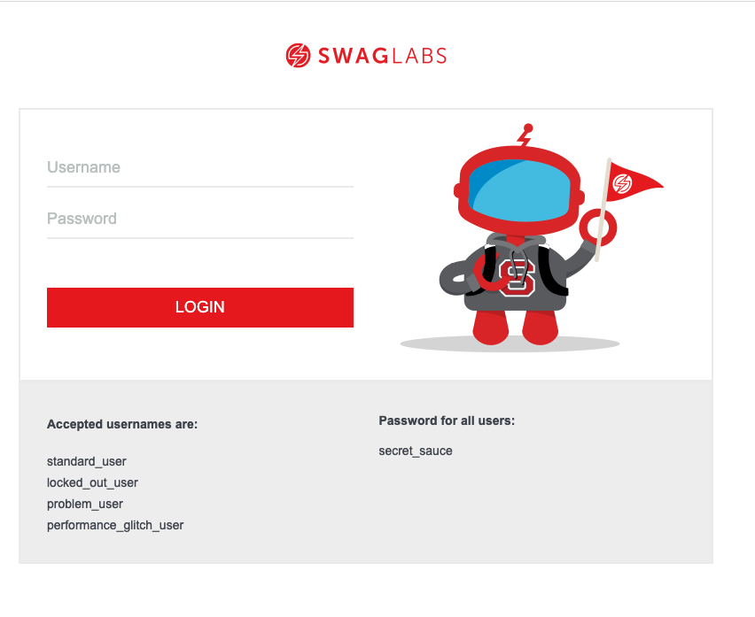

When you type in the `username` and `password`, and then select the **LOGIN** button, you're *inputting* data in an effort to receive a desired *output*; which in this case is gaining access to the site.

Now try and input the incorrect login credentials:
* Username: `locked_out_user`
* Password: `secret_sauce`

You should see this screen:

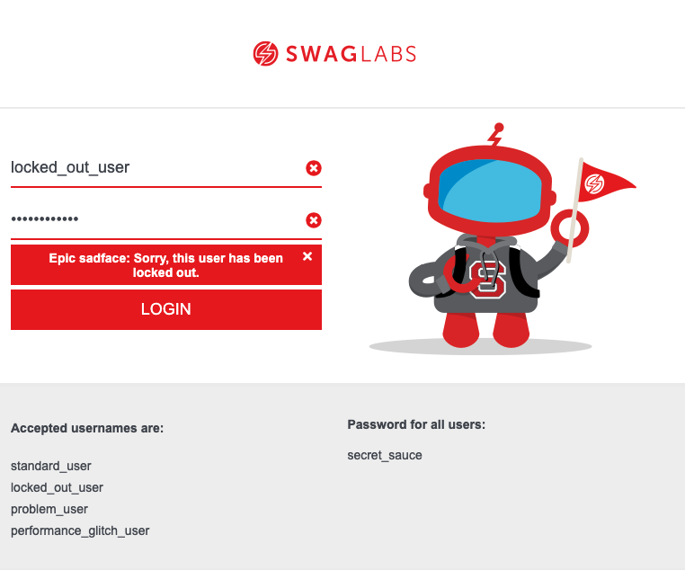

The site uses a login **web service** to determine the appropriate response based on the user *input*; in this case the error: 

> *Epic sadface: Sorry, this user has been locked out*.


### How Do APIs Fit In?

An API stands for **Application Programming Interface**. Think of the API as the language, or contract, of the user *input*. APIs allow a user to send commands to a web service in terms the service can understand in order to produce the desired output.

Here's a more complex example using the popular ride-share mobile application Uber:

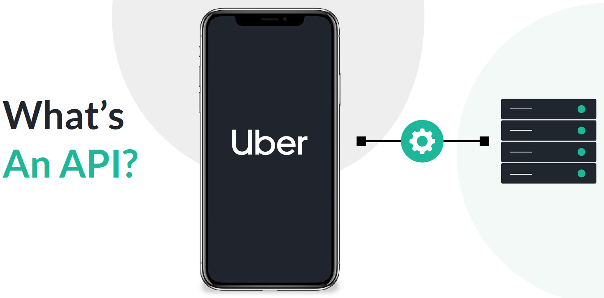

In this application the APIs communicate with multiple web services that in turn connect to different platforms and data services. Each action performed in the app equates to its own web service, and the way you communicate with said web service is via APIs. 

In other words, the way you search for a location, choose the type of ride you want, pay for the ride, and rate the driver are all separate web services communicated through APIs.

### So What Does an API Look Like? 

Let's consider a common use case for Uber.

You need to search for a vehicle in Uber. So you open the app, select a destination, and select 'search for ride'. Below is an example Uber API that makes an HTTP request after you input the data:

* `token`: your login access token that proves you are who you say you are
* `latitude`: the latitude of your current location
* `longitude`: the longitude of your current location

Here's what the formatted URL ends up looking like:

```http
https://api.uber.com/v1/products?server_token=[token]&latitude=40.6797300818661&longitude=-73.9639477463489
```

Uber then performs numerous calculations and actions and returns this **JSON** (JavaScript Object Notation) response to your phone:

```json
{
  "products": {
    "capacity": 2,
    "product_id": "929fcc19-8cb4-4007-a54f-3ab34473700f",
    "Price_details": {
      "service_fees": [],
      "cost_per_minute": 0.74,
      "distance_unit": "mile",
      "minimum": 8,
      "cost_per_distance": 1.62,
      "base": 0,
      "cancellation_fee": 5,
      "currency_code": "USD"
    },
    "Image": "https://d1a3f4spazzrp4.cloudfront.net/car-types/mono/mono-uberpool.png",
    "cash_enabled": false,
    "shared": true,
    "short_description": "Pool",
    "display_name": "UberPool",
    "product_group": "rideshare",
    "description": "Shared rides, door to door"
  }
}
```

You can see the max number of passengers (`capacity`), the cost (`Price_details`), and other relevant information. Usually as the user you won't see this raw data format, but this is essentially how your mobile app communicates with the necessary web services behind the scenes in order to display information on your phone's UI.

### Why is API Testing so important? 

Let's review how the process works:

* Web service takes in a command (*input*)
* Performs some action and returns a response (*output*)

We don't know the internal workings of how the service works, nor how it is implemented when we issue commands. The service itself is what's commonly referred to in the software testing world as a **Black Box**. So in order to test the system we must use the publicly exposed APIs in order to verify the system works as intended. Throughout this course we will conduct many types of [black box testing](https://en.wikipedia.org/wiki/Black-box_testing) techniques in order to verify the integrity of the web service or services.

### Types of APIs

You may have guessed but not all APIs are created equal. In fact there are many types and formats and over the years the term API itself is now somewhat vague. For the purposes this course we will always be talking about **HTTP APIs** (APIs that can be hit with an HTTP call). 

Below are some examples of API types.

#### HTTP APIs

There are two types of HTTP APIs, REST and SOAP. That is a huge topic, but from a very high level:

##### SOAP

This used to be the most commonly used format, but is now seen as a legacy technology. Its advantage is that it’s simple and can return a bunch of data. The negative is that it is very poor for more interactive usage, like you see with mobile applications today.

##### REST

REST is the most common protocol you see today, and more robust overall. It’s specifically made for interactive usage, such as mobile applications. You can transfer information through a REST API in a variety of formats. [Learn more about how they are structured](https://en.wikipedia.org/wiki/Representational_state_transfer).

#### GraphQL

A querying language made by Facebook that's gaining popularity. It allows you to specify which data you want (and nothing you don't) returned by an API call in a single request. The response of an API call can come in many formats.

<!--------------------------------------->

## 1.04 Requests and Responses
Duration: 0:04:00

There are commonly used terms when referring to APIs that will help us when we think about how to run our tests, such as **requests** and **responses**.

### Requests

These are the most common **API request methods**, sometimes referred to as API verbs, that dictate what type of interaction you want to perform.

<ul>
  <li><p class="api get">GET</p></li>
  <li><p class="api post">POST</p></li>
  <li><p class="api put">PUT</p></li>
  <li><p class="api delete">DELETE</p></li>
</ul>

You as the user use these methods to communicate with what's known as a **service endpoint** in order to make a change.

### Wait, What is a Service Endpoint?

A service endpoint is one end of a communication channel. It's typically a URL at which you, the user, can interact with using an API call. The API essentially acts as the language and contract for how the systems interact. For more information regarding the details

> **NOTE**: for the purposes of this course we will only refer to **web service endpoints**, meaning a service endpoint associated with a web-based application.

### GET

The <span class="api get">GET</span> method communicates with the service endpoint when you want to retrieve some data. This is the easiest API to use and understand. For example the [Sauce Labs get users API method](https://docs.saucelabs.com/dev/api/accounts#get-users).

### POST

The <span class="api post">POST</span> method communicates with the service endpoint in order to create something. An example of this is the [Sauce Labs create team API method](https://docs.saucelabs.com/dev/api/accounts#create-a-team).

### PUT

The <span class="api put">PUT</span> method communicates with the service endpoint in order to update an existing object or item. An example of this is the [Sauce Labs update team API method](https://docs.saucelabs.com/dev/api/accounts#update-a-team).

### DELETE

The <span class="api delete">DELETE</span> method communicates with the service endpoint in order to delete and object or item. An example of this is the [Sauce Labs delete team API method](https://docs.saucelabs.com/dev/api/accounts#delete-a-team).

These are the common response formats that a web service returns after receiving an HTTP API call.

### Responses

Below are some potential response data formats sent back to the user from the server.

#### XML

This is a very straightforward format that can return in virtually any layout. An example:

```
<?xml version="1.0" encoding="UTF-8"?>
<XML>
   <note>
      <to>Patrick</to>
      <from>Mom</from>
      <subject>Reminder</subject>
      <body>We need milk</body>
   </note>
</XML>
```

#### JSON

This is the more commonly seen format in REST APIs today. The Uber example is in JSON. It’s more standardized and therefore cleaned for machines to understand.

#### Object

This is the item that has data associated with it. If you look at the Uber response again, `display_name`, `description`, and `Image` are examples of individual objects within the JSON file.

#### Assertion

A rule or specific test against a single object and/or piece of data. The API testing platform is powered by a proprietary XML language with over 70 assertions, that handle just about every scenario in a very quick and easy way to write.

This is a fairly common misconception. While yes, UI testing does trigger API calls, it does nothing to test the API itself.

### Additional API Terminology

There are a few other terms that you should be aware of when thinking about API Testing responses.

#### Idempotency

**Idempotency** basically refers to an action that always results in the same server state, regardless of the amount of requests sent to the server. 

For example, let's say you have a collection of comic books that exist in a box. If you were to remove all the individual comics from the box, you still wouldn't change the *state* of the box. Even if you make an additional request for more comics when none exist the box still exist, just without comics.

This is a prime example of a <span class="api delete">DELETE</span> request method.

#### Safety

**Safety**, similar to idempotency, means that the request won't have any effect on the state. So going back to our comic book collection example, a *safe* request would be like flipping through the comics and reading the titles. 

We didn't remove or place any of the comics in a different order, so we didn't change the state of the comic book collection at all.

This is a prime example of a <span class="api delete">GET</span> request method—where you're not changing any of the items in the database/server, yet you want to read their information.

<!-- ------------------------ -->

## 1.05 API Test Preparation
Duration: 0:04:00

### Mapping the API
One of the most important prerequisites before you begin writing API tests is to understand their function. Here are a few ways to visualize your application under test and map out each API in order to inform how to write your API tests:

* [A Line / Flowchart Diagram](https://www.lucidchart.com/blog/why-you-should-create-an-api-diagram)
* [An API List / API Documentation](https://docs.saucelabs.com/dev/api)
* [A Mind Map](https://blogs.oracle.com/developers/api-design-mind-maps-surfing-v2)

API Documentation in particular is a great resource and source of information when trying to understand the layout and purpose of an application API. Take a moment to read through the [Sauce Labs `users` API](https://docs.saucelabs.com/dev/api/accounts#user-methods). 

> **NOTE**: Throughout this course we will use these service endpoints when writing our API Tests.

### Types of API Tests

API testing isn't easy, and there are different ways in which a bad API can cause catastrophic harm to an organization. A good [continuous testing](https://saucelabs.com/solutions/continuous-testing) strategy, where you automate testing at every stage of development (when merging a feature, in production, in production, and more) involves doing [API testing](https://saucelabs.com/platform/automation-tools/api-fortress) early and often.

By examining the fields of an API response, we can determine the items of consideration and what sort of tests we should write. Below is an example API JSON response:

```json
[
  {
    "id": 1,
    "name": "Baseball Cap",
    "price": 29.99,
    "category": "1",
    "description": "This is product 1!",
    "quantity": 5,
    "imageURL": "http://image.com",
    "color": [
      "blue",
      "yellow"
    ],
    "createAt": "2018-09-20T17:36:23.386Z",
    "updatedAt": "2018-09-20T17:36:23.386Z"
  },
  {
    "id": 2,
    "name": "Long Sleeve Shirt",
    "price": 39.99,
    "category": "1",
    "description": "This is product 2!",
    "quantity": 7,
    "imageURL": "http://image.com",
    "color": [
      "blue",
      "yellow",
      "red"
    ],
    "createAt": "2018-09-20T17:36:23.387Z",
    "updatedAt": "2018-09-20T17:36:23.387Z"
  }
]
```

#### Functional Testing

Looking at the API above, you see a payload with various objects. The first item you should be testing is that the API responds as expected from a functional standpoint.

This means every object exists, and the responses are within expected ranges. For example the quantity object should always be a whole number. There can't be .5 baseball caps.

#### Validating Business Logic

Imagine you are an ecommerce company with a product API, similar to the example shared above. First, you should be testing that each product has all the objects it expects.

The next layer is where skill and creativity in test creation are required. Let's say that you search for ‘red' and you receive both shoes and pants. Now all products should contain a size object, but they are very different size ranges. Adding the intelligence to a test that says, "If this is a pair of shoes, size should be between 4 and 17." That is business logic validation. This is where you need a skilled team that knows the expectations of the API, and how to manipulate and validate them.

#### End-to-End / Integration Testing

APIs are meant to interact with one another, and that flow has to work in its entirety. By creating proper integration tests you can validate flows that resemble actual users behaviors. For example, creating a single test that can:

**Search > Pick a Size > Add to Cart> Checkout**

For many companies that entire flow can be done on the API level, and should be. This allows you to confirm that when you add a product to cart, it actually works.

#### Monitoring

Monitoring is probably the most valuable, and yet underused, type of testing. APIs issues are often only found in live environments when using live data.

The goal of a proper monitoring strategy is to go beyond measuring uptime, but also measuring functional uptime. An API can return a statuscode of 200 and still be failing. Some APIs are built so that even when there is an error it returns as a 200. What's important to note is that you can use existing functional tests as your monitor. With the right platform choice, you can schedule them to run against live environments in certain intervals. Then use that monitoring to have a real-time status page across departments.

#### Load Testing

When you load test, you make sure your APIs perform when under the stress of a lot of users. This can help find memory leaks, or under performing databases.

It's also important, again, to use existing tests as your load tests. You will never have 10,000 concurrent users only performing a single call. They will perform different types of calls, or a series of calls with some randomness. Use existing functional and end-to-end tests.

### Summary

Ultimately, continuous testing means leveraging all of these types of tests, automatically. A constant series of functional and non-functional (performance) tests to constantly validate your APIs.

<!------------------------------>

## 1.06 Introduction to API Fortress
Duration: 0:04:00

[API Fortress]() is the API Testing Platform of Sauce Labs. We will use this platform throughout the remainder of this course. Some concepts we cover during this course require the API Fortress platform. 

However, you can try and follow along using other tools like [Postman](https://www.postman.com/), and then [import your requests later on](https://docs.saucelabs.com/api-testing/quick-start/importing-postman-collections).

### Getting Started with API Fortress

If you don't have an API Fortress account you can [visit the API Fortress home page](https://apifortress.com/), and select the **Free Trial** button at the top to request a 30-day free trial.

After you fill out the necessary fields, you then receive an email with your login credentials for the platform. 

> **NOTE**: If you don't receive an email confirmation, check your spam folder or please email [support@saucelabs.com](support@saucelabs.com) for assistance.


#### Create a Project

For this first test project we will test against the Sauce Labs API.

1. Log in to the platform
2. Select the **Create Project** button.
   
3. The **Add New Project** alert window appears.
   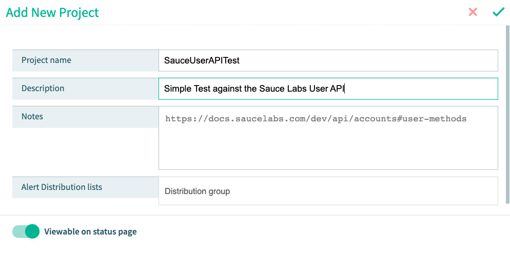
   Add the following for each category:
    * **Project Name**: `SauceUserAPITest`
    * **Description**: `Simple Test against the Sauce Labs User API`
    * **Notes**: `https://docs.saucelabs.com/dev/api/accounts#user-methods`
    * **Alert Distribution lists**: Leave blank
    
4. When you're finished, select the **green check mark**  at the top.
5. Find your project and select the **Project Dashboard button**.
   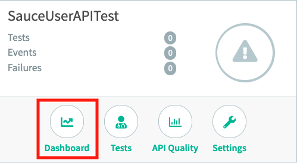

Upon finishing your project setup, you should see the Project Dashboard.

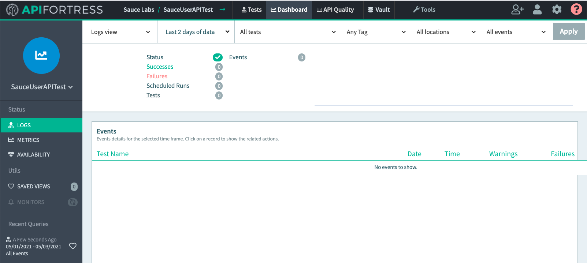

<!------------------------------>

## 1.07 Run Your First API Test
Duration: 0:08:00

We now have a project in which we can begin writing API Tests. Let's create the first API Test!


#### Create a Test

We're going to test against the [Sauce Labs GET user endpoint](https://docs.saucelabs.com/dev/api/accounts#get-users). In order to successfully create this test we need to complete the following steps using the [Visual Test Composer](https://docs.saucelabs.com/api-testing/learn-more/working-with-the-response-object/index.html#visual-composer-view) view:
* Send an example HTTP Request using the **HTTP Client**
* Add the **Basic Authorization Header** to our sample request
* **Generate a Test** based on the response payload.

From the project dashboard:

1. Select **Tests** at the top of the screen in order to navigate to the project test list
   
2. From the project test list, select **+New Test**
   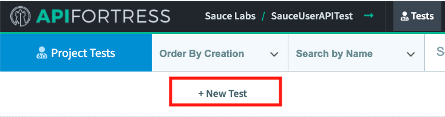
3. You should now see the new **Test Details** alert window
   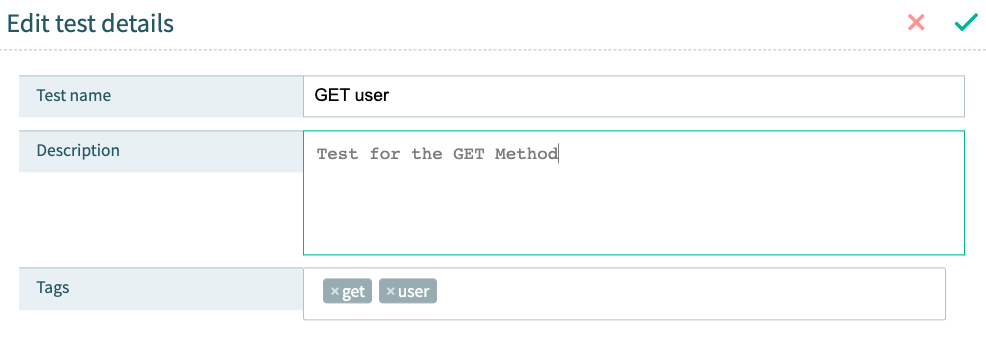
   Add the following for each category:
   * **Test Name**: `GET user`
   * **Description**: `Test for the GET Method`
   * **Tags**: `get`, `user`

4. When you're finished, select the **green check mark**  at the top.
5. Now you should see the **Test Status** / **Interstitial** page.
   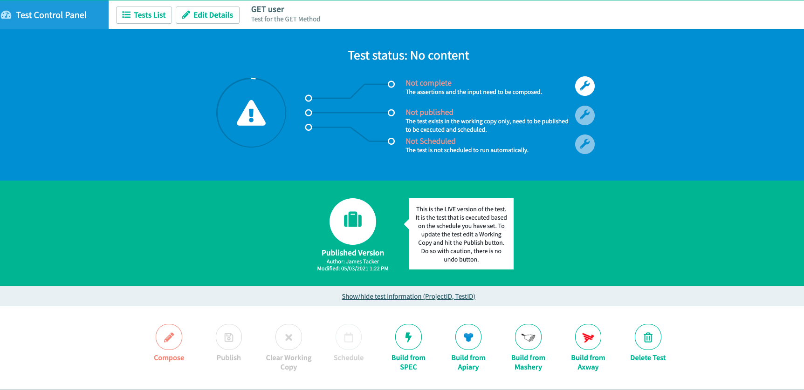
   
### Generate a Test

At the moment, the test content is empty, so we need to **generate a test**. From here there are two ways to generate a test:
* Generate a test manually with the HTTP Client
* Generate a test from a spec file.
  
For the purposes of this lesson, we will generate a test manually.

> **NOTE**: You must have a Sauce Labs account in order to follow along in this step. [Use this link](https://saucelabs.com/sign-up) to sign up for a free trial.

From the Intersitial page:

1. Select **Compose** at the bottom of the page.
   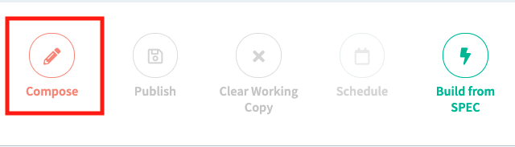
2. Now you arrive at the [Visual Test Composer](https://docs.saucelabs.com/api-testing/quick-start/composer) page.
   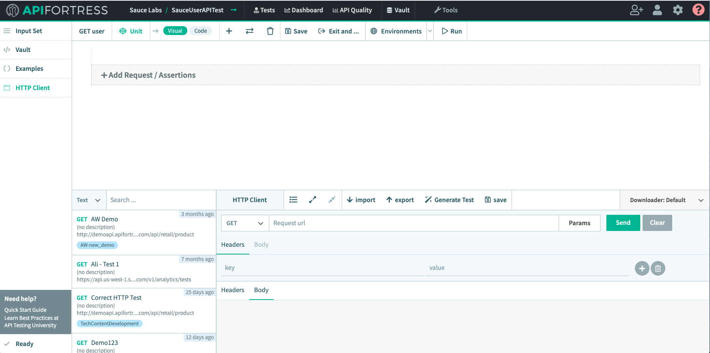
   In order to create tests we first need to submit a sample HTTP API request. 
   
3. At the bottom of the UI, enter the following URL where it says **Request url** in the **HTTP Client**:
   ```
   https://api.us-west-1.saucelabs.com/team-management/v1/users?limit=3
   ```
   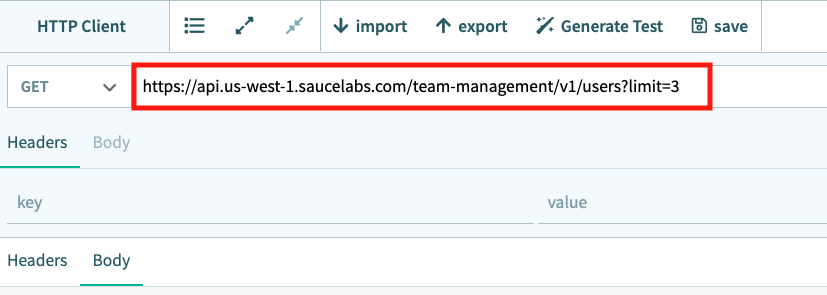
   
4. Select the **Send** button:
   
   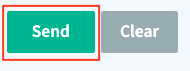
   
   You should receive the following error response:
   ```http request
   "HTTP Code 401: Authorization failed"
   ```
   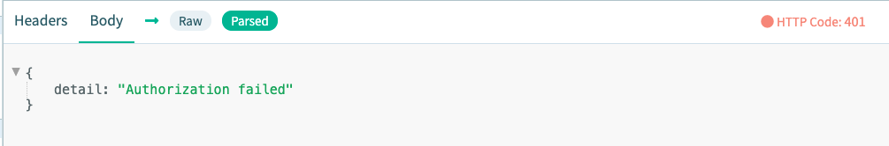
   > **NOTE**: To see the raw response body in the HTTP Client select **Body** and then either *Raw* or *Parsed*
   
### Adding a Test Component

In the previous step we encountered a common authentication error—[HTTP: 401](https://developer.mozilla.org/en-US/docs/Web/HTTP/Status/401). In order to fix this error we must add our [Sauce Labs Account Credentails](https://app.saucelabs.com/user-settings) as a [Basic Authentication Header](https://docs.saucelabs.com/api-testing/how-to/authorization-simple-oauth-etc/index.html#overview).

1. At the top of the Test Composer page, select the plus symbol to **add a new request component**:
   
   
2. From the dropdown list, select **GET**:
   
   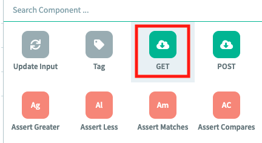
   
#### Create Example GET Component
1. In the next screen, recreate your HTTP Client request with the following information
   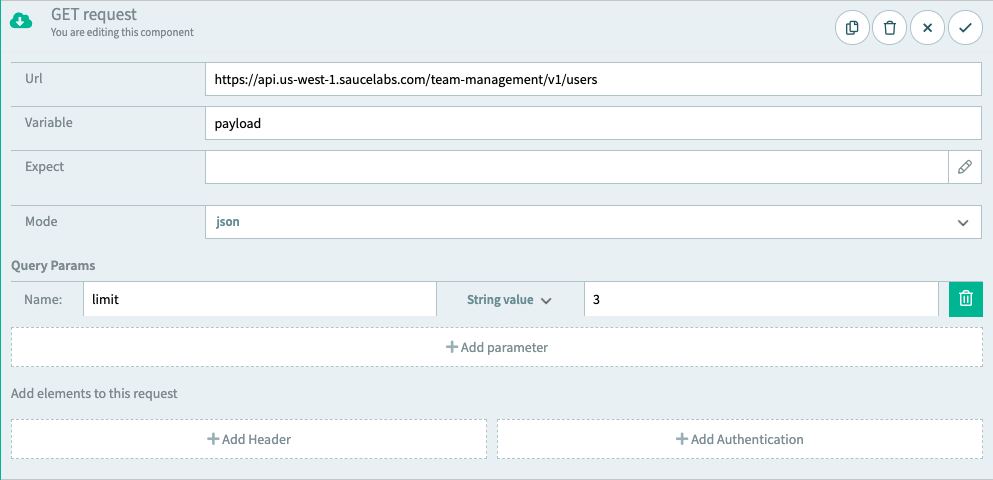
   * **Url**: `https://api.us-west-1.saucelabs.com/team-management/v1/users`
   * **Variable**: `payload`
   * **Expect**: Leave blank
   * **Mode**: `json`
   * **Query Params**: *Name*: `limit` *String value*: `3`
   
2. Then select **Add Authentication** at the bottom right.
   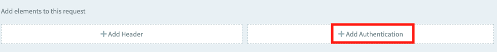
   
3. Select **Basic Authentication**, then add your [Sauce Labs Username and Access Key](https://app.us-west-1.saucelabs.com/user-settings) in the relevant fields.    When you're finished, select the **green check mark**  in the top right.

   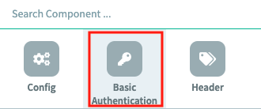
    
   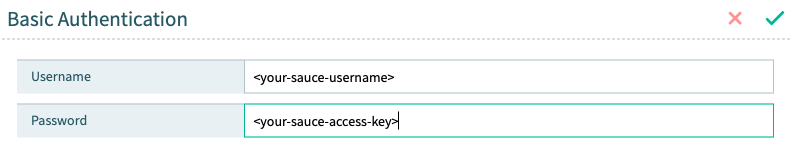
   
#### Copy and Paste the Enocded Auth Header
1. You'll notice that API Fortress automagically encodes and adds the Authorization header for you. Select the component to see the details:
   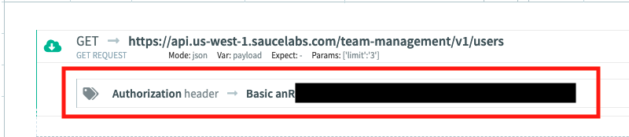
2. Copy and paste the details in your HTTP Client **Headers** section:
   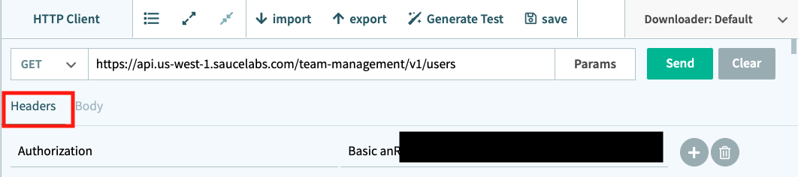
   
3. Select the **Send** button again, and you should see something similar to below in the response body:
   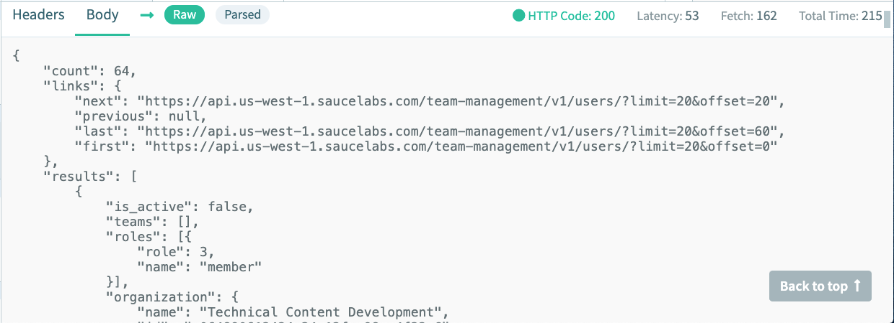
   
4. Next, select the **Generate Test** button and API Fortress automagically generates a sample test based on the request data.
   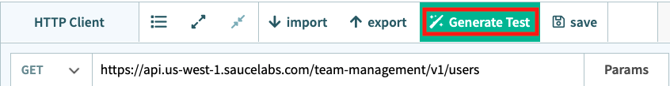
   
5. Click through the prompts, and you should now see many tests in the Visual Test Composer Window.
   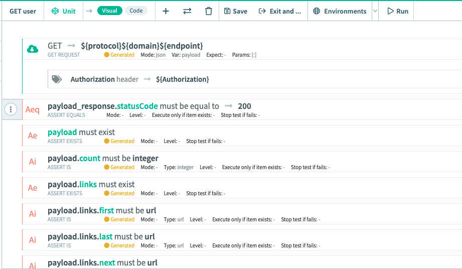
   
6. The final step is to run your tests. At the top of the Visual Test Composer, select **Run**
    

<!------------------------------>

## 1.08 View Test Results
Duration: 0:04:00

If your previous step ran without any errors you should see the following test results page:
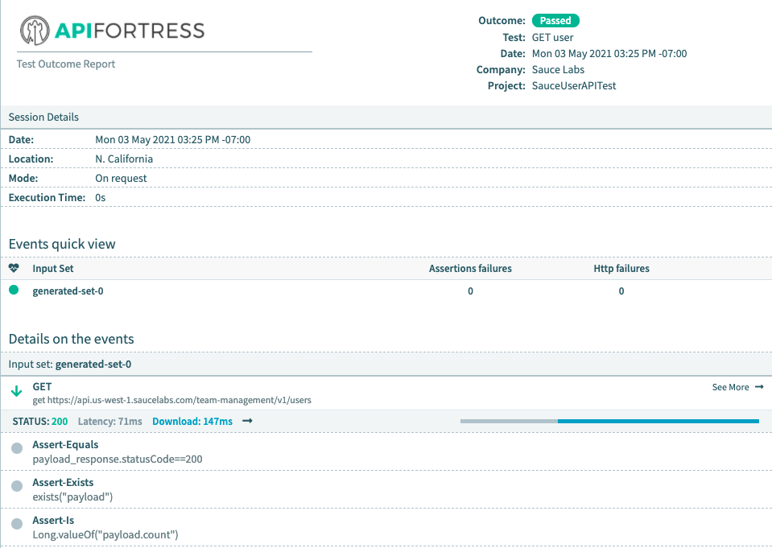

You can also view the specific response details by clicking on **See More** next to the input set details:


The next page displays all the request and response details, including the headers and raw body in JSON format:
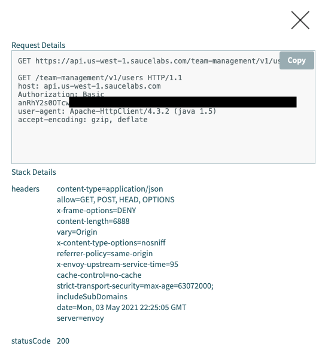

To see the response body select Load Source


This outputs the following:

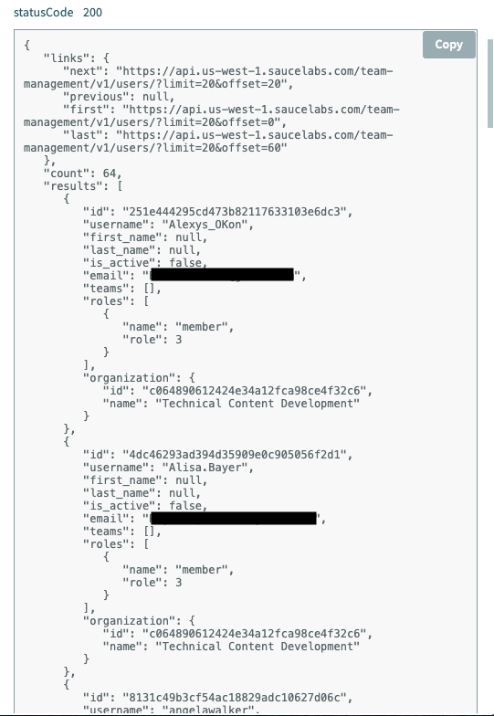

Congratulations on running your first API Test! In the next module you will learn how to both **Schedule** and **Publish** a test.


<!----------------------------->

## 1.09 Module 1 Quiz
Duration: 0:04:00
