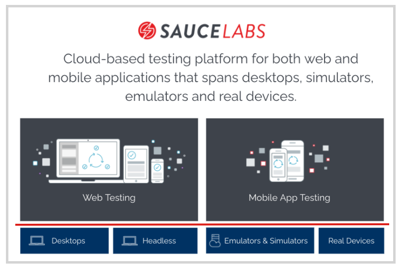

<!-- Copy this file into tools/site/coursenameFolder & start editing -->

summary: Module X of the course X. Learn to write Selenium tests in X programming language with X Test runner and X framework
id: ModuleX_SeleniumLang
categories: <enter a single category for drop-down filter>
tags: <enter Language names here from tools/site/app/views what is labeled in the view.json tag: attribute>  
environments: Web
status: One or more of (Draft, Published, Deprecated, Hidden)
feedback link: https://forms.gle/CGu4QchgBxxWnNJK8
analytics account: UA-6735579-1
author:Lindsay Walker
<!-- ------------------------ -->
# Module 1 - Sauce Labs Quickstart

<!-- ------------------------ -->
## 1.01 What You'll Learn
Duration: 0:02:00

In this module, you will get a demo of the most commonly used products by Sauce Labs to run automated tests on applications.

### Skills & Knowledge

In this Module you will learn:

*   The automated testing tools available to use with Sauce Labs
*   How you can use Sauce Labs to do mobile native application testing
*   How you can use Sauce Labs to do mobile browser testing
*   How you can use Sauce Labs to do native application testing on mobile devices
*   How to view test details to gain insight and information when tests fail
*   How you can Sauce Performance for actionable information on the front-end user experience
*   How Sauce Connect can help you set up a secure connection to you application under test
*   To use the main automation features of the Sauce Labs UI, including how to access the UI to use and view results of web browser tests, mobile browser tests, and mobile app tests
*   Use cases for Live testing for automation engineers
*   How to use the Sauce Labs Live testing interface to run mobile and web tests

<!-- ------------------------ -->
## 1.02 Sauce Labs Automated Testing
Duration: 0:09:00

You can categorize the types of tests run in two main categories- automated testing on desktop browsers, and automated testing on mobile devices.

### Desktop Testing

Sauce Labs enables automated testers to do [web application testing](https://wiki.saucelabs.com/display/DOCS/Web+Application+Testing/?utm_source=referral&utm_medium=LMS&utm_campaign=link) on all of the modern desktop operating system versions and the different browsers that run on them. [Headless ](https://wiki.saucelabs.com/display/DOCS/Getting+Started+with+Sauce+Headless//?utm_source=referral&utm_medium=LMS&utm_campaign=link )testing is available for chrome and firefox browsers for testers who want to run quick tests without having to lead and wait for visual components.

### Mobile Testing

[Sauce Labs provides mobile testing ](https://wiki.saucelabs.com/display/DOCS/Automated+Mobile+Application+Testing+with+Sauce+Labs/?utm_source=referral&utm_medium=LMS&utm_campaign=link)in two different types of environments. You can test mobile apps and browsers on emulators & simulators, and you can test using the devices on the Sauce Labs Real Device Cloud. Depending on what you would like to test, one or both of the plans may be right for you.

Whether you choose emulators and simulators, or the real device cloud, you can also use Sauce Labs to run tests on mobile web browsers. Learn more about [different plans and pricing ](https://saucelabs.com/pricing/?utm_source=referral&utm_medium=LMS&utm_campaign=link)on the Sauce Labs website

#### Video

<!-- ------------------------ -->
## 1.03 Mobile Application Testing
Duration: 0:08:00

Sauce Labs gives teams the ability to run tests on hundreds of different emulators, simulators, and real mobile devices.

[Appium ](http://appium.io/docs/en/about-appium/intro/)is an open-source tool for automating tests for native applications installed on a device, mobile web browsers, and hybrid applications on many platforms. Appium was created for tests on mobile applications, both web and native.

Though it was designed for mobile testing, Appium has the ability to let you create tests on almost any operating system (iOS, Android, Windows, Mac, Linux), using a REST API.

Other mobile testing frameworks supported by Sauce Labs include [XCUI Test](https://info.saucelabs.com/FY17-ADV-MobileAppTestingeBook_LP.html?gclid=CjwKCAiAtK79BRAIEiwA4OskBtI-iSaHXJ2EPMTaJXeM2gREFzcv1ikm5rKluqw7NCXgKuNZBBt9AxoCh_MQAvD_BwE) for IOS devices, and the [Espresso](https://developer.android.com/training/testing/espresso) Android test framework.

### Mobile Native App Testing

In order to test a native mobile application, you will need to upload your application to Sauce Labs storage (or another storage location), and indicate where the app is stored in your test code.

First run your application locally to verify the test code is working as anticipated. After that, you can upload the application package (and test code if you are using XCUI or Espresso) to online storage or Sauce Storage. After you upload your application file to Sauce, you can run it all on Sauce Labs.

#### Video

### Mobile Web Tests

Mobile web tests are similar to mobile application tests. Tests can be written with the Appium, Espresso, or XCUI framework, and they have similar capabilities that need to be set to set the environment the test is run on, and to communicate with Sauce Labs.

Mobile web tests, however, do not need to be uploaded to Sauce Labs, and are instead pointed at the URL where the site is hosted, with results being communicated to Sauce Labs.

Whether you choose to run your apps on real devices, virtual machines with emulators (Android) and simulators (IOS) Sauce Labs has an offering to help improve testing accuracy and efficiency.

<!-- ------------------------ -->
## 1.04 Automated Browser Testing
Duration: 0:05:00

The Selenium framework is typically used for desktop web browser tests. You can also use it to test some features of mobile browsers, although ideally, you would use the Appium mobile automation framework, as it gives you the ability to test interactions that occur on a mobile device, such as swiping and pinching.

One of the key features of Sauce Labs is the ability to run tests on a browser using hundreds of devices, emulators, and simulators.

### Desktop Browser Testing

For desktop applications you can choose hundreds of browsers on Mac, Windows, and Linux operating systems to test against, using the most recent versions of the web browsers available in those environments. [See what’s supported ](https://saucelabs.com/platform/supported-browsers-devices?utm_source=referral&utm_medium=LMS&utm_campaign=link)

#### Video

### Mobile Browser Testing

Sauce Labs allows you to run automated tests against web browsers in hundreds of mobile devices, both in an emulator or simulator environment, or on a device in the Sauce Labs Real Device Cloud.

Simply write your test with your chosen language bindings, framework, and Selenium or Appium, add in the capabilities to connect to Sauce Labs cloud, and you’re ready to test.

### Video

<!-- ------------------------ -->
## Section X
Duration: 0:05:00

<!-- ------------------------ -->
## Section X
Duration: 0:05:00
