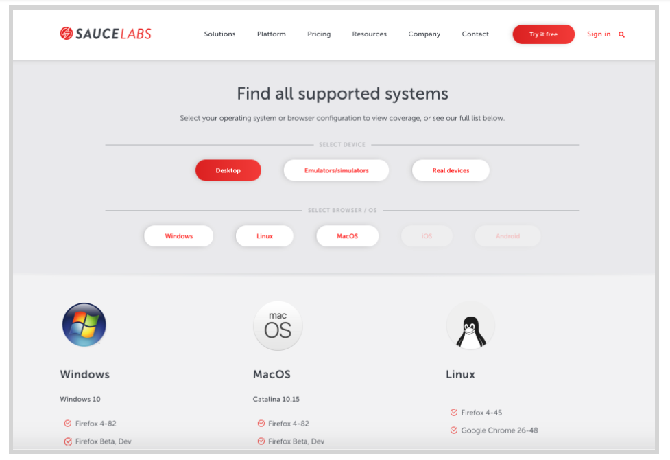

<!-- Copy this file into tools/site/coursenameFolder & start editing -->

summary: Module 1 of the Sauce Labs Quickstart, introducing the Sauce Labs UI for automated testers
id: Module1_Quickstart
categories: beginner
tags: quickstart
environments: Web
status: One or more of Draft
feedback link: https://forms.gle/CGu4QchgBxxWnNJK8
analytics account: UA-6735579-1
author:Lindsay Walker
<!-- ------------------------ -->
# Module 1 - Sauce Labs for Automated Testers

<!-- ------------------------ -->
## 1.01 What You'll Learn
Duration: 0:02:00

In this module, you will get a demo of the most commonly used products by Sauce Labs to run automated tests on applications.

### Skills & Knowledge

In this Module you will learn:

*   The automated testing tools available to use with Sauce Labs
*   How you can use Sauce Labs to do desktop browser testing
*   How you can use Sauce Labs to do mobile browser testing
*   How you can use Sauce Labs to do native application testing on mobile devices
*   How to view test details to gain insight and information when tests fail
*   How you can Sauce Performance for actionable information on the front-end user experience
*   How Sauce Connect can help you set up a secure connection to you application under test
*   The main automation features available in the Sauce Labs app
*   Use cases for Live testing for automation engineers
*   How to use the Sauce Labs Live testing interface to run mobile and web tests

<!-- ------------------------ -->
## 1.02 Sauce Labs Automated Testing
Duration: 0:09:00

You can categorize the types of tests run in two main categories- automated testing on desktop browsers, and automated testing on mobile devices.

### Desktop Testing

Sauce Labs enables automated testers to do [web application testing](https://wiki.saucelabs.com/display/DOCS/Web+Application+Testing/?utm_source=referral&utm_medium=LMS&utm_campaign=link) on all of the modern desktop operating system versions and the different browsers that run on them. [Headless ](https://wiki.saucelabs.com/display/DOCS/Getting+Started+with+Sauce+Headless//?utm_source=referral&utm_medium=LMS&utm_campaign=link )testing is available for chrome and firefox browsers for testers who want to run quick tests without having to lead and wait for visual components.

### Mobile Testing

[Sauce Labs provides mobile testing ](https://wiki.saucelabs.com/display/DOCS/Automated+Mobile+Application+Testing+with+Sauce+Labs/?utm_source=referral&utm_medium=LMS&utm_campaign=link)in two different types of environments. You can test mobile apps and browsers on emulators & simulators, and you can test using the devices on the Sauce Labs Real Device Cloud. Depending on what you would like to test, one or both of the plans may be right for you.

Sauce Labs also offers the option of testing mobile native apps, or testing on mobile web browsers. Learn more about [different plans and pricing ](https://saucelabs.com/pricing/?utm_source=referral&utm_medium=LMS&utm_campaign=link)on the Sauce Labs website

#### Video – Sauce Labs Intro

<!-- ------------------------ -->
## 1.03 Mobile Application Testing
Duration: 0:08:00

Sauce Labs gives teams the ability to run tests on hundreds of different emulators, simulators, and real mobile devices.

[Appium ](http://appium.io/docs/en/about-appium/intro/)is an open-source tool for automating tests for native applications installed on a device, mobile web browsers, and hybrid applications on many platforms. Appium was created for tests on mobile applications, both web and native.

Though it was designed for mobile testing, Appium has the ability to let you create tests on almost any operating system (iOS, Android, Windows, Mac, Linux), using a REST API.

Other mobile testing frameworks supported by Sauce Labs include [XCUI Test](https://info.saucelabs.com/FY17-ADV-MobileAppTestingeBook_LP.html?gclid=CjwKCAiAtK79BRAIEiwA4OskBtI-iSaHXJ2EPMTaJXeM2gREFzcv1ikm5rKluqw7NCXgKuNZBBt9AxoCh_MQAvD_BwE) for IOS devices, and the [Espresso](https://developer.android.com/training/testing/espresso) Android test framework.

### Mobile Native App Testing

In order to test a native mobile application, you will need to upload your application to Sauce Labs storage (or another storage location), and indicate where the app is stored in your test code.

First run your application locally to verify the test code is working as anticipated. After that, you can upload the application package (and test code if you are using XCUI or Espresso) to online storage or Sauce Storage. After you upload your application file to Sauce, you can run it all on Sauce Labs.

#### Video – Mobile Test

### Mobile Web Tests

Mobile web tests are similar to mobile application tests. Tests can be written with the Appium, Espresso, or XCUI framework, and they have similar capabilities that need to be set to set the environment the test is run on, and to communicate with Sauce Labs.

Mobile web tests, however, do not need to be uploaded to Sauce Labs, and are instead pointed at the URL where the site is hosted, with results being communicated to Sauce Labs.

Whether you choose to run your tests on real devices, virtual machines with emulators (Android) and simulators (IOS) Sauce Labs has an offering to help improve testing accuracy and efficiency.

<!-- ------------------------ -->
## 1.04 Automated Browser Testing
Duration: 0:10:00

The Selenium framework is typically used for desktop web browser tests. You can also use it to test some features of mobile browsers, although ideally, you would use the Appium mobile automation framework, as it gives you the ability to test interactions that occur on a mobile device, such as swiping and pinching.

One of the key features of Sauce Labs is the ability to run tests on a browser using hundreds of devices, emulators, and simulators.

### Desktop Browser Testing

For desktop applications you can choose hundreds of browsers on Mac, Windows, and Linux operating systems to test against, using the most recent versions of the web browsers available in those environments. [See what’s supported ](https://saucelabs.com/platform/supported-browsers-devices?utm_source=referral&utm_medium=LMS&utm_campaign=link)

#### Video – Desktop Browser Test

### Mobile Browser Testing

Sauce Labs allows you to run automated tests against web browsers in hundreds of mobile devices, both in an emulator or simulator environment, or on a device in the Sauce Labs Real Device Cloud.

Simply write your test with your chosen language bindings, framework, and Selenium or Appium, add in the capabilities to connect to Sauce Labs cloud, and you’re ready to test.

### Video – Mobile Browser Test

<!-- ------------------------ -->
## 1.05 Automated Test Results
Duration: 0:05:00

The test results dashboard is the automated tester’s key to understanding your automated tests.

If you click into any of the tests from the **Automated > Test Results** dashboard, you will be taken to the test details page.

### Test Detail page

This page allows you to peek into the value that Sauce Labs provides to a testing team, besides infrastructure. The test details page allows you to quickly gain insight into the test execution.

### Elements of the Page

**A –** View the details about the type of test such as whether or not performance is enabled for that test, an icon that indicates cloud or real devices, who has visibility, as well as test environment and when the test ran.

**B –** Video execution of a test, which can be costly and difficult to implement of your own.

**C –** The **Commands** panel makes it easier (and less costly) for your team to debug where issues occurred with the Selenium or Appium commands.

*   See step by step log of the interaction between test and browser where you can quickly jump ahead.
*   Automatic screenshots are taken where test interacts visibly with the UI (which can be turned off to speed up test execution)

**D –** The **View Logs** tab provides specific data that was passed from the browser, including the JavaScript console logs

**E –** The **Metadata** tab provides more detailed information about the test and environment, as well as access to download the screenshots and videos.

**F –** The **Network** tab highlights information about network requests and the resources a website used to load, giving information about what is causing delays or issues.

**G –** **Performance**  focuses on front-end experience metrics that impact the time it takes to render, load, and interact with a Chrome web application so that you can gain insight into how to speed up and therefore create an experience for customers that is flawless and efficient.

### The Front-End Performance Report

These ten metrics, which are collected over time,  give insight into patterns and trends are an important part of the shift right towards continuous testing.

Front-end performance metrics, which are typically not tested until an application is in production, gives teams important information about delays that drive customers away from an app, and allows you to do manual quick tests of features. Finding these issues earlier makes it easier, cheaper, and quicker to fix.

<!-- ------------------------ -->
## 1.06 Sauce Live Testing
Duration: 0:15:00

With our Live Testing solution, you can test your websites and mobile apps interactively on thousands of real mobile devices, virtual mobile devices (simulators and emulators), and desktop browser/OS/resolution combinations.

With these tools, developers have the ability to debug faster, facilitate collaboration, increase device coverage, and – especially when combined with Automated Testing – improve your speed-to-market.

Learn how to setup and use Live Testing features on the[ Sauce Labs Wiki](https://wiki.saucelabs.com/pages/viewpage.action?pageId=115061210&utm_source=referral&utm_medium=LMS&utm_campaign=link)

Download the demo mobile app and see features in the [Github repo](https://github.com/saucelabs/sample-app-mobile/#gestures).

### Use Cases for Automated Testers

Manual testing fills in the gaps and ensures that your final product works as intended. You’re stepping into the shoes of an actual user to test out your app’s functionality and features on mobile devices and websites in the Sauce Labs cloud, navigating with clicks and gestures as a user would.

Some ideal scenarios for live testing:

*   Exploratory tests
*   Test conditions that are subject to change
*   Tests that are run infrequently
*   Tests that are too complex to automate

### Debug Early and Often

By testing manually throughout your software development lifecycle, you can debug issues early to save time overall.  Don't wait until the end! Implement shift-left testing: start running your live tests in early development, so you can squash bugs sooner. You'll save time in the long run. More information: [Live Testing Overview: Web and Mobile Apps](https://saucelabs.com/solutions/live-testing?utm_source=referral&utm_medium=LMS&utm_campaign=link).

### Zero in on Automation Test Bugs

To get a closer look at bugs you uncover in automated tests, run a live test session to investigate it in more detail. One way to do this is by using your IDE or our JS executor to add a breakpoint in your code, and then take over the session. More information: [Annotating Tests with Selenium's JavaScript Executor](https://wiki.saucelabs.com/display/DOCS/Annotating+Tests+with+Selenium%27s+JavaScript+Executor?utm_source=referral&utm_medium=LMS&utm_campaign=link).

### Improve Collaboration and Productivity

Share live test results with your team/organization. When your team is working toward a shared common goal, clear communication and transparency are incredibly important, as is the ability to see the bigger project picture. Here are a couple of features to facilitate collaboration with your teammates.

Adjust your test results visibility permissions to include your team and/or specific people:

Invite someone to watch your Live Test session (while it’s running) to observe along with you. Click the **Share** icon (mobile) or **Invite** icon (desktop), copy the URL, and share it with your recipient:

### Video Demos

The following videos will give you a taste of the different testing capabilities. The types of live testing you can do are split into the following categories:

*   Desktop Browser Testing
*   Mobile Device Testing
    *   Mobile Browsers
    *   Mobile Native Apps

Watch the following videos to get a taste of what live testing has to offer.

#### Video – Live Desktop Browser Testing

#### Video – Live Mobile Browser Testing

#### Video – Live Mobile Native App Testing

**More on Sharing Test Results**

*   [Sharing the Results of Sauce Labs Tests](https://wiki.saucelabs.com/display/DOCS/Sharing+the+Results+of+Sauce+Labs+Tests?utm_source=referral&utm_medium=LMS&utm_campaign=link)
*   [Share Test Results in Slack](https://wiki.saucelabs.com/display/DOCS/Sharing+Test+Results+in+Slack?utm_source=referral&utm_medium=LMS&utm_campaign=link)
*   [Generate Shareable External Links to Test Results](https://wiki.saucelabs.com/display/DOCS/Building+Sharable+Links+to+Test+Results?utm_source=referral&utm_medium=LMS&utm_campaign=link)
*   [Viewing and Managing Test Results](https://wiki.saucelabs.com/display/DOCS/Viewing+and+Managing+Test+Results?utm_source=referral&utm_medium=LMS&utm_campaign=link)

Follow us on YouTube for more tips and demos: [Sauce Labs on YouTube](https://www.youtube.com/channel/UCzUaF3G8L5rfoh9xR6a51kg).
