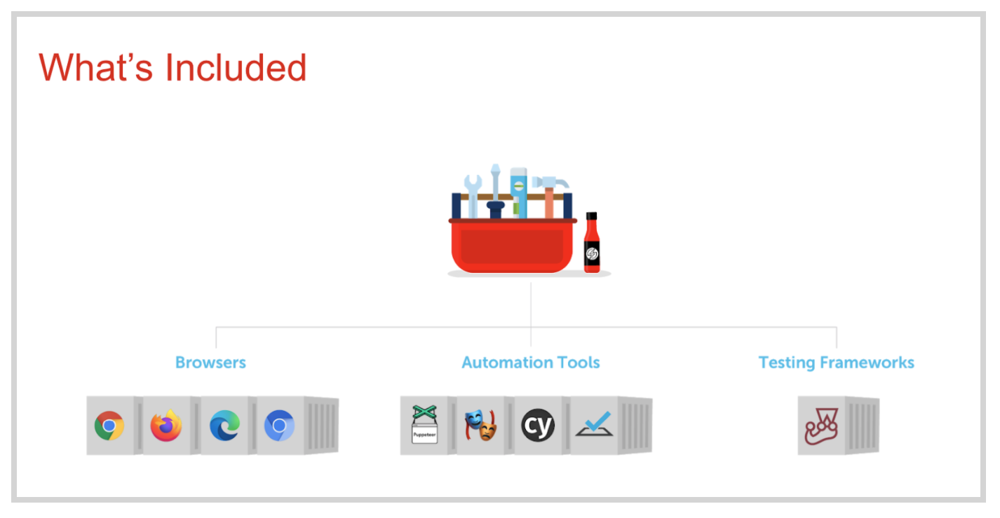
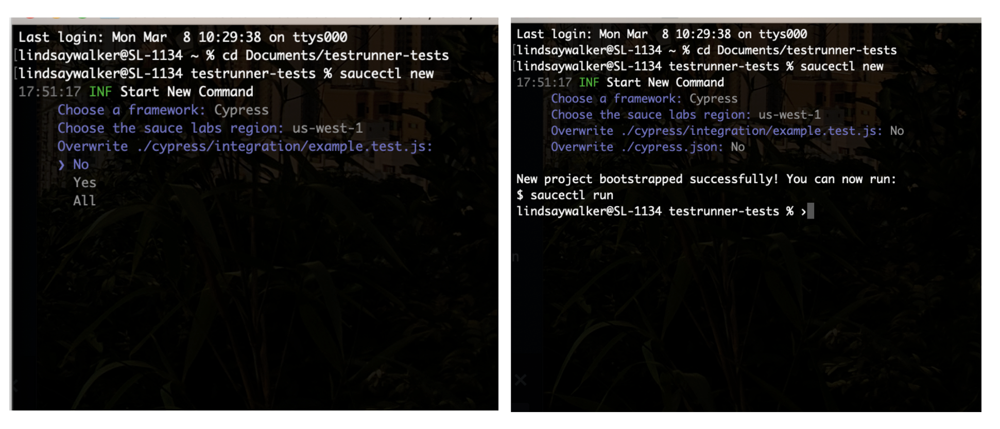
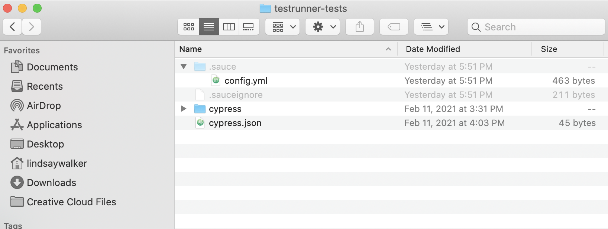
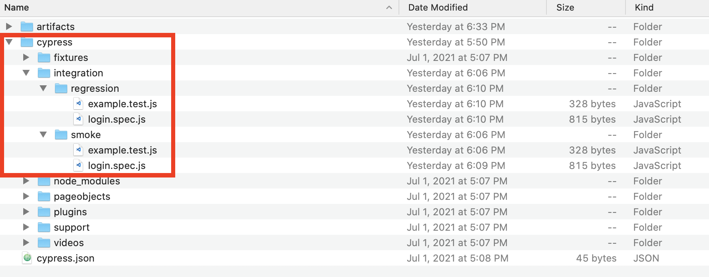
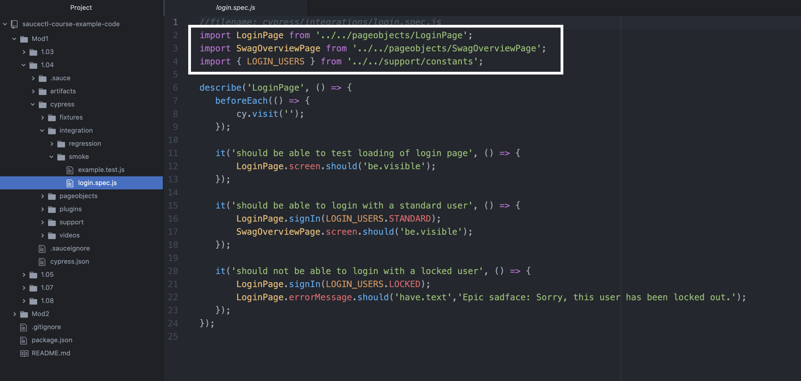
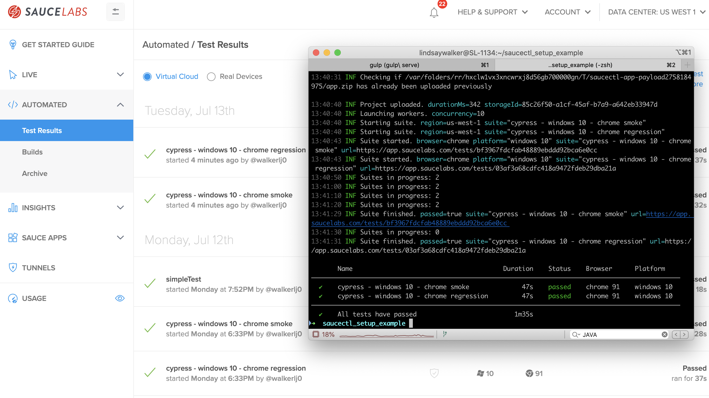
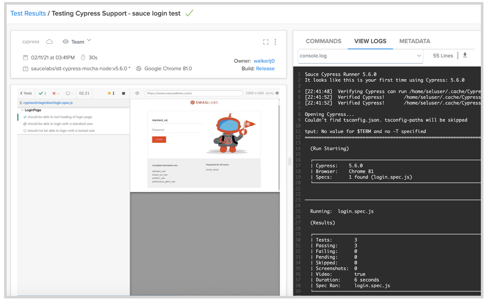
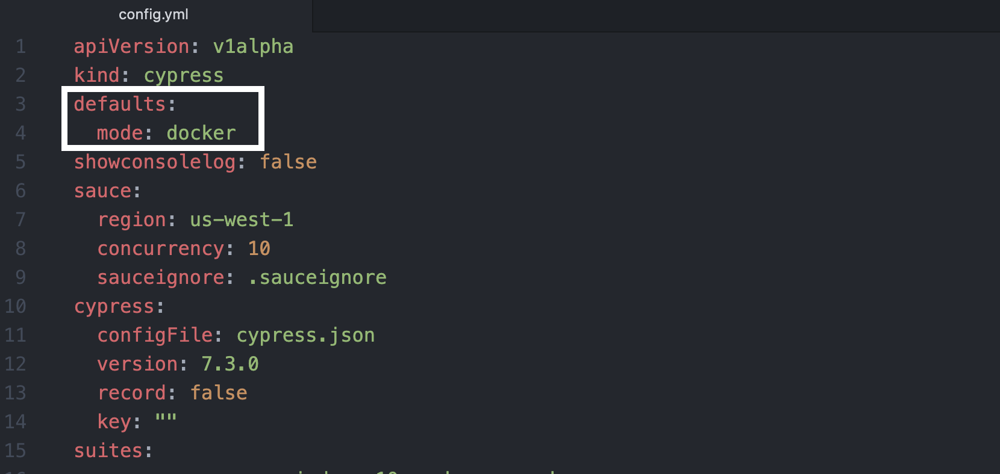
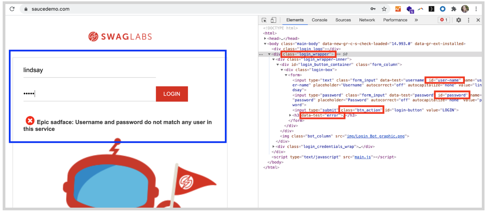

 summary: Module 1 of the Cypress on Sauce course will introduce you how to set up a Cypress test with saucectl on the Sauce Labs Cloud virtual machines, and use saucectl to run your automated tests creating artifacts to share and analyze. In this module, you can learn to create a basic Cypress test suite, or use your own Cypress test code to run tests with saucectl.
id: Module1-saucectl
categories: beginner
environments: Web
status: Published
feedback link: https://forms.gle/CGu4QchgBxxWnNJK8
analytics account: UA-86110990-1
tags: saucectl
authors: Lindsay Walker
<!-- ------------------------ -->
# Module 1 – Intro to saucectl with Cypress

<!-- ------------------------ -->
## 1.01 What You'll Learn
Duration: 0:01:00

### Skills & Knowledge

* How saucectl with the Sauce Labs platform is different than other automated test solutions that you can use with Sauce Labs

* Learn about the components of saucectl with the Sauce Labs platform, including the command line tool, Docker, and the Cypress.io client

* Set up the necessary components to run Cypress and saucectl with the Sauce Labs platform on your computer

* Understand the configuration files for Cypress on saucectl with the Sauce Labs platform and how to modify them

* Learn to run a Cypress Test on Sauce Labs with a Docker container and on Virtual Machines (VMs)

* Run a saucectl with the Sauce Labs platform Cypress Test with your test code locally with Cypress

* Learn basic JavaScript to write page object and test code that runs on Cypress and saucectl with the Sauce Labs platform (Optional)

### Note
<aside class="negative">
Developers that <strong>already have a test suite do not have to do Modules 1.07 - 1.09.</strong> If you have one, simply create a new saucectl project in the folder with your Cypress test suites to get started quickly, moving on to Module 2 after 1.06.
</aside>

#### Clone the Project
If you would like to follow along with the course, using the exact sample code, you can use the [example tests here](https://github.com/walkerlj0/saucectl-course-example-code/tree/main/Mod1/1.03).

<!-- ------------------------ -->
## 1.02 What Is saucectl?
Duration: 0:03:00

Sauce Labs has developed a set of tools in conjunction with a command line tool called `saucectl` to enable test developers to get setup quickly to scale up their testing to more browsers and devices using the Sauce Labs Cloud, and to be able to do this with a wider range of testing frameworks than ever before.

This is a testing solution for developers that simplifies user setup, speeds up test execution time, unifies test results, and supports new open source frameworks like Playwright, Cypress, TestCafe, Espresso, and XCUI for running end-to-end web & mobile tests.



#### Scalable Testing, Quickly
Installing with `saucectl` allows you to quickly and easily install all dependencies and start testing
* Test with JavaScript frameworks such as Cypress, PlayWright, and TestCafe
* Configure your test suite and credentials quickly
* Access Sauce Labs VMs with thousands of browser/ operating system combinations


### What can saucectl and the Sauce Labs Platform Do?

`saucectl` stands for Sauce Control, the command line interface for running non-Selenium tests such a Cypress, TestCafe, Espresso, and XCUITest. The toolkit includes `saucectl` commands that allow you to interface with Sauce Labs, as well as the tools necessary to record the output from tests on a Sauce Labs Virtual Machine, making it easy to interpret, share and analyze those test results.


### Why Use saucectl

Historically, most end-to-end testing consisted of various components such as Selenium, mocha-chai (test assertion frameworks), and other tools that are necessary to run, automate, and debug tests. Users would create a remote session to test a web application. With [Sauce Labs saucectl and Cypress](https://docs.saucelabs.com/testrunner-toolkit/configuration/cypress), you have an all-in-one test framework, runner, and assertion platform that doesn’t require the client to send commands and wait for a response in order to run.

In other words, saucectl with Cypress provides a powerful [clear-box testing](https://en.wikipedia.org/wiki/White-box_testing) tool that doesn’t require downloading and installing several tools and libraries:


Using Cypress alongside Sauce Labs also allow you to:


*   Run your tests using a containerized solution, to simplify setting up your environment and dependencies
*   Review, share, and evaluate your test assets, such as logs, test results, and test videos
*   Use our Insights feature to perform deeper analysis of test outcomes


### Two Ways to Run Tests

#### Sauce Mode
By default, when you use saucectl, it works by passing your entire test suite, including dependencies and configurations to Sauce Labs Cloud of Virtual Machines, where your tests will be executed as per your configurations. Use the command `saucectl run` or update `mode: sauce` in `config.yml`, to run your tests on Sauce Labs VMs.

#### Docker Mode
With saucectl, you can also install Docker and run a containerized version of your test environment, then pass the results to your Sauce Labs account, by setting `mode: docker` in `config.yml`.`


<!-- ------------------------ -->
## 1.03 Setup saucectl to Run Tests on Sauce Labs
Duration: 0:07:00

In this module, you will see how you can set up   saucectl on Sauce Labs VMs _or_ use saucectl along with Docker on your MacOS Computer. The basic steps include:

* Setup an [example Cypress project](https://github.com/saucelabs/saucectl-cypress-example)
* Install saucectl with `npm i -g saucectl`
* Set your Sauce username and access key with `saucectl configure`
* Update `.sauce/config.yml` with test suite information

_More detailed instructions are below_

<!-- Docker is software that allows you to create an isolated environment on your computer that is separate from your operating system, creating a lightweight environment built off a Linux kernel to do specific tasks. Learn more from the [Docker documentation](https://docs.docker.com/get-started/overview/). Each environment coupled with the software and setting packaged together to use in that environment is called an _image_. -->


<!-- In our case, we will use Docker engine, which is made up of:

*   A long-running server that runs a daemon process in the background. This process listens for REST API commands and allows you to run environments, including an isolated filesystem, separate from the operating system on your computer.
*   A Command Line Interface (CLI) which you use to interact with and give commands to Docker
*   A REST API you can use to send commands to the background process. -->


#### Video

[Cypress and saucectl Setup](https://www.youtube.com/watch?v=XCzmAbXyK-A&list=PL67l1VPxOnT7YTdCbpvSpJ8FF-sNxm8r-&index=1)

<video id="XCzmAbXyK-A"></video>


<aside class="negative">
Note that the config file in the video may be out of date, and the <a href="https://docs.staging.saucelabs.net/testrunner-toolkit/configuration/cypress"> correct configuration can be found in the documentation</a>. This video also doesn't include the <code>.sauceignore</code> file, where you can list the files & directories you don't want uploaded when you run your tests in <i>sauce mode</i>.
</aside>


### Download and Install saucectl

Next you need to download and install the saucectl Command Line Interface (CLI) that you will use to run Sauce Labs. This is a part of the Sauce Labs set of tools that allows you to set a configuration location & update the file in your local directory.  There are several options (https://docs.saucelabs.com/testrunner-toolkit/installation) for installing it, and in this tutorial we will use npm, which means you need to have [NodeJS installed on your machine](https://nodejs.org/en/download/).

It also allows you to run commands to run tests locally or remotely on the Sauce Labs platform.

First, anywhere on your machine install the saucectl tool globally, using this command `npm` to install the saucectl package:

`npm i -g saucectl`.


### Cypress Test Code

You want to fork, clone or download a .zip copy of the [example project](https://docs.saucelabs.com/testrunner-toolkit/installation), then place your tests in the **cypress** directory that contains your tests.

You have the following options to test out Cypress on Sauce:
* Use an existing project you have already (copy-paste in `/cypress` & `cypress.json`)
* Follow [lessons 1.07 - 1.08](https://training.saucelabs.com/codelabs/Module1-Testrunner/index.html?index=..%2F..testrunner#5) to write simple tests
* Clone or download [this example cypress test suite](https://github.com/saucelabs/saucectl)

Once you have a project directory containing cypress tests on your machine, navigate to the directory where the `cypress.json ` and `/cypress` directory are, you can update the configuration file to run your tests.

<!-- #### Note
Negative
: You will want to make sure your Cypress tests are (and the project structure) works with the same version that you have listed in the `.sauce/config.yml` file. If you are using `saucectl` in an existing project, make sure that in the setup workflow, you do not overwrite any of the existing files.  -->

### Set Sauce Username and Access Key

You can access your Sauce Username and Access Key under [**Account** > **User Settings**]((https://app.saucelabs.com/user-settings). There are three ways you can configure your credentials with saucectl:

* Set them as environment variables (saucectl will detect them)
* Enter them when you run `saucectl init`
* Use `saucectl configure`

To manually configure your usename and access key, simply type the command:

```
saucectl configure
```

This command prompts you to manually enter your credentials, and will generate a `credentials.yml` file in a `.sauce directory` where you installed saucectl initially (in your home folder).

To find `credentials.yml`, search for a file called `credentials.yml` in a hidden directory (Cntrl + Shit + .) called `.sauce`.


Visit [accounts.saucelabs.com](https://accounts.saucelabs.com/am/XUI/#login/?utm_source=referral&utm_medium=LMS&utm_campaign=link). You can create a free trial account if you haven’t been assigned one.


Watch [this video](https://www.youtube.com/watch?v=3K1Eu0eTha8&t=12s) to see how to set up your Sauce username and access key as environment variables on your machine, or use [the instructions here to set them up on Windows](https://docs.google.com/document/d/1Cb27j6hgau5JHmAxGHPihd3V4Og3autPCei82_m1Ae8/edit?usp=sharing).


### Initialize saucectl

Now that you have your Cypress test files set up in a directory, and your Sauce Labs username and access key setup globally with saucectl, you can initialize the test runner in order to run your Cypress tests on the Sauce Labs cloud.

From the folder where you should have placed `cypress.json`, and `/cypress` directory, and any other test files or assets, run the terminal command:

```
saucectl init
```

You will see a workflow appear allowing you to choose the data center you run tests in, the framework and version, configuration file, browser, platform, and options to download test assets.

Once you make all the choices in your workflow, you should be able to see the hidden `/.sauce` directory and the `.sauceignore` file in your project:


### The Configuration File

Once you have your project setup, open the project directory, take a look at the project files inside.



You will see a `cypress` folder containing the `/integrations` directory where all test files are stored, as well as a `cypress.json` file where you can set options such as reporters, the base URL that tests will be run against, and [more](https://docs.cypress.io/guides/references/configuration.html#Global).

Another part of the package that was installed when you ran `saucectl` new is the /`.sauce` directory. The /`.sauce` directory has a `.sauceignore` file where you can designate the files and directories you don't want uploaded to Sauce Labs, and the `config.yml` file in which you will see something like the following ([Config Docs](https://docs.saucelabs.com/testrunner-toolkit/configuration#basic-configuration)):

**[The Config File](https://github.com/saucelabs/saucectl/blob/main/.sauce/cypress.yml)**

```
apiVersion: v1alpha
kind: cypress
sauce:
  region: us-west-1
  concurrency: 10
  metadata:
    tags:
      - e2e
    build: "$BUILD_ID"
rootDir: tests/e2e/
docker:
  fileTransfer: mount
cypress:
  version: 7.3.0
  configFile: "cypress.json"
suites:
  - name: "saucy test in docker"
    mode: docker
    browser: "chrome"
    config:
      env:
        hello: world
      testFiles: [ "**/*.*" ]

  - name: "saucy test in sauce"
    browser: "chrome"
    platformName: "Windows 10"
    config:
      env:
        hello: world
      testFiles: [ "**/*.*" ]

artifacts:
  download:
    when: always
    match:
      - console.log
    directory: ./artifacts/
```

Take a look at the top of the config file. There are several important elements here that can be modified.
*   The `apiVersion` is the [saucectl API](https://github.com/saucelabs/saucectl) Version
*   The `kind` is the tesing framework
* The `defaults` allow you to configure various settings. You can set the mode (_Docker_ or _Sauce_) in `mode` at this level, or as a field that is a part of the `suites` below.
* If you are using _Docker mode_, you can `mount` or `copy` files
*   The `cypress` information tells your cypress tests where to look for the test configuration file, and which version of cypress you are running. Other file locations are relative to where `config.json` is place. See the docs for a [list of supported versions](https://docs.saucelabs.com/testrunner-toolkit)
* An optional setting is where the `rootDir` or root directory is placed
* The `sauce` information. Here is where you will put information that will be passed to sauce and can be used for debugging tests, such as the name, `build` number from your CI tool, and number of machines you would like to run concurrently
*   The `suites` information includes the name, browser, and the configuration for your test suites such as what types of file names to look for to run as tests, and other metadata that is passed to your Sauce Labs account for running tests and displaying results.
  * The `config: testFiles:` specify the directory relative to `cypress.json` or `rootDir` and the file names of your tests
*   The `artifact` information includes what assets (such as images and videos of your tests) are fetched and stored locally. The options for downloading assets include `always`, `never`, `pass`, `fail`.

#### .sauceignore

The `sauceignore` file that is essential to use to speed up your test runs. By default, everything that is in your project folder will be uploaded to Sauce Labs when you run your tests, however, it's important to include things like asset directories or other files that aren't necessary for a test run to this file.

**Example :**

```
cypress/videos/
cypress/results/
cypress/screenshots/
node_modules/
.git/
.github/
.DS_Store
__assets__
**/__assets__
```

### Install Docker (Optional)

If you would like to run your tests in a Docker container and pass the results to the Sauce Labs platform, visit the [docker download website ](https://docs.docker.com/get-docker/)and install the newest version of Docker on your machine.

Start up Docker to ensure it’s running properly on your machine, and follow the instructions in the next module to modify  `config.yml` to run tests in _Docker Mode_.

You can check to see if it’s running with the command `docker info`, and see which version you have with the command `docker -v`.  

See the next module for more about running tests with the command `saucectl run`

<!-- ------------------------ -->
## 1.04 Run Your Cypress Test on Sauce
Duration: 0:03:00

Running a Cypress test on sauce is easy. If you follow the configuration steps using `saucectl init` in the last module, all you need to do is run the command:

```
saucectl run
```

Specifying which tests you want to run in which environment can be configured in the `suites:` tab in the `.sauce/config.yml` file. This lesson will cover:

* Setting different directories
* Specifying certain test files
* Running in different web browsers
* Executing test in _Docker Mode_ or _Sauce Mode_
* View test results on Sauce Labs

Running tests using Cypress and saucectl allows you to run as many combinations of tests and environments as you would like.

#### Video

[Running Tests with Sauce and Cypress](https://www.youtube.com/watch?v=ofa9Y1u6RAc&list=PL67l1VPxOnT7YTdCbpvSpJ8FF-sNxm8r-&index=3)

<video id="ofa9Y1u6RAc"></video>

#### Example Cypress Code
For example Cypress tests, you can:
* Use the [simplified Cypress test code ](https://github.com/walkerlj0/saucectl-course-example-code/tree/main/Mod1)you can learn more about in 1.07-1.08 that goes along with the `suites` examples
* Use the [Sauce Labs Cypress Test Code](https://github.com/saucelabs/saucectl-cypress-example)
* Use your own Cypress tests


### Add and Run New Tests
As you grow your testing suite, you may want to add new tests to run, and you may want to have the option to run different specific groups of tests, and run on different browsers. The `config: testFiles:` objects under the `suites:` tag allow you to specify which tests are run, when:

If you used `saucectl init` the object test will automatically run any tests in the `cypress/integration` directory with a [supported Cypress test file type](https://docs.cypress.io/guides/core-concepts/writing-and-organizing-tests#Test-files) and look something like this:

```
suites:
- name: cypress - windows 10 - chrome
  browser: chrome
  platformName: windows 10
  config:
    testFiles:
    - '**/*.*'
  mode: sauce
rootDir: .
```

Lets create two directories within your `cypress/integration` directory so that you can learn to specify both directories and files. Create both a `/smoke` and a `/regression` directory, and paste copies of your tests in each.



You will want to modify any code that refers to the project structure that may change. In this example, you will want to update the imports in `login.spec.js` with an additional `../` to account for the re-organization:



Now you can modify your `config.yml` to run one test from each directory. You will need to create two `-name:` objects under the `suites:`;

```
suites:
- name: cypress - windows 10 - chrome smoke
  browser: chrome
  platformName: windows 10
  config:
    testFiles:
    - 'smoke/*.spec.*'
  mode: sauce
- name: cypress - windows 10 - chrome regression
  browser: chrome
  platformName: windows 10
  config:
    testFiles:
      ['regression/*.test.*']
```

#### Note

<aside class="negative">
 There are also two alternatives for listing the <code>testFiles:</code> in your suite, either in brackets <code>[]</code> like the example above, or underneath tabbed in, in front of a dash with a space: <code>-'**/login].spec.js'</code>.
</aside>


Now when you use the command `saucectl run` you should see both test suites, **chrome smoke** and **chrome regression** having run:



### Run Your Tests in Different Browsers

Sauce Labs supports running Cypress tests in the [environments that are supported](https://docs.saucelabs.com/testrunner-toolkit#supported-frameworks-in-sauce-cloud/) by the Cypress test runner. This means you can run using the Chrome, Microsoft Edge, and Firefox browsers.

### Run Your Tests in Different Modes

#### Run All Tests in One Mode

If you do not have the `mode:` specified anywhere in your `.sauce/config.yml` file, then, by default, all your tests will be bundled, and uploaded and run on the Sauce Labs Cloud of Virtual Machines.

If you would like to try running tests in Docker, you can set all your test suites to run, by default, in docker mode by setting the `defaults:` option:

```
apiVersion: v1alpha
kind: cypress
defaults:
  mode: docker
  # ...
```

You can change this setting back to default to _Sauce mode_ by changing `mode: sauce` or delete the `mode:` option.

Unless you specify a different mode in a suite, all tests will run in _Docker Mode_:

#### Note
<aside class="negative">
 Not all browsers may be supported in <i>Docker Mode</i>, see the <a href"https://github.com/saucelabs/sauce-cypress-runner/releases/tag/v7.1.0">release notes</a>.
</aside>


#### Run Certain Tests in Different Modes

You also have the ability to run some suites in _Docker Mode_, and some suites in _Sauce Mode_, all from the same test run, by setting individual suites to run in different modes.

To set the mode on the suite level, simply add the `mode:` option somewhere under your test suite `name;`

```
  suites:
    - name: saucy test suite
      mode: docker
```

The following settings in your `config.yml` file will run two of your tests in _Docker Mode_ (by default) and two of your tests in _Sauce Mode_:

```
suites:
- name: cypress - windows 10 - chrome smoke
  mode: sauce
  browser: chrome
  platformName: windows 10
  config:
    testFiles:
    - 'smoke/*.spec.*'
- name: cypress - windows 10 - chrome regression
  browser: chrome
  platformName: windows 10
  config:
    testFiles:
      ['regression/*.test.*']
- name: cypress - windows 10 - firefox - all
  browser: firefox
  browserVersion: 86.0
  platformName: windows 10
  config:
    testFiles:
      - '**/*.*'
- name: cypress - windows 10 - edge -all
  browser: microsoftedge
  browserVersion: 90.0
  platformName: windows 10
  config:
    testFiles:
      - '**/*.*'
  mode: sauce
```


Now, when you run the command `saucectl run`, you should see output like this in your console:


### View Your Test Results

If you go to [app.saucelabs.com](https://accounts.saucelabs.com/am/XUI/#login/&utm_source=referral&utm_medium=LMS&utm_campaign=link ), you should see the two tests on your automated test results dashboard:


If you click into the tests, you can see the video of the test running on the Cypress client, and a log you can easily share with others:



Once you have your tests running, learn more about what you can do with Sauce Labs and Cypress in [Module 2](https://training.saucelabs.com/codelabs/Module2-Testrunner/index.html?index=..%2F..testrunner#0)

#### Final Code
See an example of the test suite with [updated suites in `.sauce/config.yml`](https://github.com/walkerlj0/saucectl-course-example-code/tree/main/Mod1/1.04)




<!-- ------------------------ -->
## 1.05 Run Cypress Tests in Parallel
Duration: 0:03:00

Running Cypress tests in parallel on the Sauce Labs Cloud using the saucectl is as simple as updating a single field in your `.sauce/config.yml` file:


Inside of the `.sauce` data object, find the `concurrency` field, and change it from `1` to a larger number (`2` or `10`)

You are able to run suites of tests in parallel using the `concurrency` field in `config.yml`, running as many test suites in parallel as you would like (limited by the of virtual machines you have available on your Sauce Labs account).

<aside class="negative">
In order to run tests in parallel, you must have a paid account that has a concurrency of more than one. See the docs to learn more about concurrency, and check your concurrency  under <strong>User Settings</strong>.
</br> 
</aside>


### Run Parallel Tests in Multiple Browsers
Suites will automatically be run in parallel depending on your teams' allowed concurrency.

In this example, _Login Chrome_, _Login Edge_, and _Login  Firefox_ will have all the test files in each suite run in parallel on a different machine.

```
...
suites:
  # Chrome
  - name: "Login Chrome"
    browser: "chrome"
    platformName: "Windows 10"
    screenResolution: "1400x1050"
    config:
      testFiles: [ "**/login.*" ]
  # MicrosoftEdge
  - name: "Login MicrosoftEdge"
    browser: "edge"
    platformName: "Windows 10"
    screenResolution: "1400x1050"
    config:
      testFiles: [ "**/login.*" ]
 # Firefox
  - name: "Login Firefox"
    browser: "firefox"
    platformName: "Windows 10"
    screenResolution: "1400x1050"
    config:
      testFiles: [ "**/login.*" ]
```
To find out more about the names for the different browser and platform  (OS) combinations, visit the [platform configurator](https://saucelabs.com/platform/platform-configurator), and [documentation](https://docs.saucelabs.com/testrunner-toolkit/running-tests#cross-browser-tests) for the most up to date config.

#### Final Code
See [an example suite](https://github.com/walkerlj0/testrunner-course-example-code/blob/main/Mod1/1.05/.sauce/config.yml) set to run in parallel on multiple browsers.

<!-- ------------------------ -->
## 1.06 Module 1 Quiz
Duration: 0:02:00


<!--
1. What advantages do JavaScript Frameworks such a Cypress, paired with Sauce Labs Testrunner Toolkit provide?
a. You can easily take code from any framework and parse it into the Sauce Labs proprietary test framework language and run your tests more easily
b. You can quickly access a test environment that makes it easy to start running your Cypress (or other non-Webdriver based) tests on Sauce Labs*
c. You can quickly get sample code for a Cypress tests that will automatically be run on Sauce Labs without any setup
d. You can use any type of JavaScript testing framework, with any kinds of browser automation tools, and run them by simply adding your credentials to saucectl

*Sauce CTL allows you to run tests that are written using a non-webdriver based framework such as Cypress, and using only a couple commands and choosing a few options, run tests from that framework. It does not parse any test code from one framework to another, or create code for you, however it does offer you options to use a wider ranges of test frameworks.

2. Why does Sauce Labs' Testrunner Toolkit use Docker?
a. To allow you to write test code for any operating system on your own machine
b. To allow you to set a special environment to store your SAUCE_USERNAME and SAUCE_ACCESS_KEY in safely
c. To allow you to quickly set up an environment with all dependencies for your Cypress tests*
d. Its the only way to make API calls to Sauce Labs from an environment behind a firewall

*The purpose of the Docker container is to make it easy to use Sauce Labs without having to worry about setting up your environment. Though you can store your Sauce user name and access key within this image, it's not the purpose of it.

3. The file in the .sauce directory entitles config.yml allows you to set which of the following? Choose the answer that is the most correct:

a. The data center on Sauce Labs, the URL of the app you will run your tests against, and which test files will be run in a suite
b. The data center on Sauce Labs, the URL of the app you will run your tests against, and the name of the Cypress config file
c. The number of machines you want to run concurrently on Sauce Labs, the URL of the app you will run your tests against, and the name of the Cypress config file
d. The number of machines you want to run concurrently on Sauce Labs, which test files will be run in a suite, and the name of the Cypress config file*

* The .sauce/config.yml file allows you to set the data center, number of concurrent machines, which test files are run for different suites, and the name of the Cypress config file, however the URL of the app you are testing against can only be set in the cypress.json file
 -->
#### Go on to [Module 2](https://training.saucelabs.com/codelabs/Module2-Testrunner/index.html?index=..%2F..testrunner#0) if you have your Cypress Tests set up.
<!-- ------------------------ -->
## 1.07 Create Page Objects (Optional)
Duration: 0:05:00

Sauce Labs’ Testrunner Toolkit allows you to take existing Cypress test suites (or build a cypress test suite) and quickly run them on Sauce Labs. In this lesson, you will learn how to modify a couple settings in the `cypress.json` and `.sauce/config.yml` files, then write a basic test and run it on Sauce Labs.

#### Video

[Create Page Objects For a Cypress Test](https://www.youtube.com/watch?v=GTGlkiUCRLM&list=PL67l1VPxOnT7YTdCbpvSpJ8FF-sNxm8r-&index=3)

<video id="GTGlkiUCRLM"></video>

#### Note
<aside class="negative">
Different versions of Cypress will come with different pre-set project structures. If you have additional directories and files, you can keep them where they are, just make sure that you have the directories and files specified in this tutorial.
</aside>


### Test Configuration


#### Cypress.json

Inside your **testrunner-tests** project file that you created, you will notice the cypress.json file. This file is used to set [all kinds of options for your Cypress test](https://docs.cypress.io/guides/references/configuration.html). If you don’t set any options, Cypress will use a set of default values. You can pull in data from this file into your tests, to make it easier to preload data in your test.

First, you will need to add information for your tests about the URL of the app you are testing against. Add the following line to `cypress.json`, which you will use in your tests to pull in the site you are testing against.


```
//filename: testrunner-tests/cypress.json
{
 "baseUrl": "https://www.saucedemo.com/v1/"
}
```


#### Constants.js

Next, in the `cypress/support` directory (create the `cypress/support` directory if it doesn’t already exist) create a file called `constants.js`.

It’s good practice to store sensitive information like a username and a password in a separate file so you can use a .gitignore file to exclude it from Github repositories you will commit your project to.

Open `constants.js` and add the following objects to store different login credentials:


```
// filename: cypress/support/constants.js
export const LOGIN_USERS = {
   LOCKED: {
       username: 'locked_out_user',
       password: 'secret_sauce',
   },
   STANDARD: {
       username: 'standard_user',
       password: 'secret_sauce',
   },
};
```


Now you can use these objects to login in your tests by calling `LOGIN_USERS.LOCKED` or `LOGIN_USERS.STANDARD`.


### Create Page Objects Directory

After that Create a directory called `pageobjects` in the `cypress/` directory. Typically, when you write tests you separate your code into items that control interactions with the page, or _page objects, _ or code that specifies what to test, or _test objects._

You project should now look something like this:


### Create Login Page Object

Open the new  `pageobjects` directory and add a file named: `LoginPage.js`, then open `LoginPage.js` and add the following: \


In `LoginPage.js` you will create several get methods to locate elements on the page you will use in your test later on:


```
// filename: cypress/pageobjects/LoginPage.js
class LoginPage {
   get screen() {
       return cy.get('#login_button_container');
   }

   get username() {
       return cy.get('#user-name');
   }

   get password() {
       return cy.get('#password');
   }

   get loginButton() {
       return cy.get('.btn_action');
   }

   get errorMessage() {
       return cy.get('[data-test="error"]');
   }

// ...
```


Since you have baseUrl specified in `cypress.json`, your tests know to visit a page that looks like [https://www.saucedemo.com/v1/](https://www.saucedemo.com). The first `get` method locates the div in blue below, where the other elements are found.



You can also see the ids, classes, and `data-test` element that your tests’ `get` methods use to locate other elements on the page.

Next, below the get methods, add in the code to create your `signIn method`, and export the` LoginPage` class so it can be used by other classes (your test methods).


```
// filename: cypress/pageobjects/LoginPage.js
// ...


   signIn(userDetails) {
       const {password, username} = userDetails;

       if (username) {
           this.username.type(username);
       }
       if (password) {
           this.password.type(password);
       }

       this.loginButton.click();
   }
}

export default new LoginPage();

```


If you recall, in `const.js` there is a constant created called `LOGIN_USERS `which contains two objects, either `LOCKED` or `STANDARD`.

The `signIn()` method will allow you to pass either the `LOCKED` or `STANDARD` object in with the `username` and `password` values.

Later, when you call that method in your test, you will pass in the set of username and password fields from `const.js` depending on whether you call the method with `signIn(LOGIN_USERS.STANDARD)` or `signIn(LOGIN_USERS.LOCKED).`


### Create Inventory Page Object

You will also need to create a page object for the second page in the login flow, the Inventory Test.


Create a new file in the `cypress/pageobjects` directory called `SwagOverviewPage.js`. Your project structure should look something like this:


Open `SwagOverviewPage.js` and copy in the following code:


```
//filename: cypress/pageobjects/SwagOverviewPage.js
class SwagOverviewPage {
    get screen() {
        return cy.get('.inventory_list');
    }
}
export default new SwagOverviewPage();
```


 This will go to the sauce demo page that lists the products, and search for the div that contains the list of items with an id of `inventory_list`.

#### Final Code

 See a sample of the [project and code here.](https://github.com/walkerlj0/testrunner-course-example-code/tree/main/Mod1/1.07)


<!-- ------------------------ -->
## 1.08 Write Your First Test (Optional)
Duration: 0:04:00

Now that you have all the configuration files and page objects created, you can create your first test object to use all of these elements and run a test.


#### Video

[Write a Cypress Test](https://www.youtube.com/watch?v=0zYCOeATnnM&list=PL67l1VPxOnT7YTdCbpvSpJ8FF-sNxm8r-&index=4)

<video id="0zYCOeATnnM"></video>

### Write Your First Test

Now you will create a new test object In the `cypress/integration `directory, named `login.spec.js`. In accordance with [Page Object Model (POM) conventions](https://www.selenium.dev/documentation/en/guidelines_and_recommendations/page_object_models/), you are creating separate directories for page and test objects.

Open `login.spec.js` and create the `describe()` method to set up your test. The `cy.visit() `method contains an empty string because it will automatically pull the `baseUrl `from the `cypress.json` file:


```
//filename: cypress/integrations/login.spec.js
import LoginPage from '../pageobjects/LoginPage';
import SwagOverviewPage from '../pageobjects/SwagOverviewPage';
import { LOGIN_USERS } from '../support/constants';

describe('LoginPage', () => {
   beforeEach(() => {
       cy.visit('');
   });
// ...
```


Next, add in an `it()` method, which is a Mocha/ Cypress standard for declaring test methods. This will check to see that when you get onto the page, the `screen` (Defined in `LoginPage.js`) element which contains the login field is visible.:


```
//filename: cypress/integrations/login.spec.js
import LoginPage from '../pageobjects/LoginPage';
import SwagOverviewPage from '../pageobjects/SwagOverviewPage';
import { LOGIN_USERS } from '../support/constants';

describe('LoginPage', () => {
   beforeEach(() => {
       cy.visit('');
   });

   it('should be able to test loading of login page', () => {
       LoginPage.screen.should('be.visible');
   });
// ...
```


Next, add a test to check that the next page (where you can choose items for your cart.) is visible when you log in with valid user credentials:


```
//filename: cypress/integrations/login.spec.js
import LoginPage from '../pageobjects/LoginPage';
import SwagOverviewPage from '../pageobjects/SwagOverviewPage';
import { LOGIN_USERS } from '../support/constants';

describe('LoginPage', () => {
   beforeEach(() => {
       cy.visit('');
   });

   it('should be able to test loading of login page', () => {
       LoginPage.screen.should('be.visible');
   });

   it('should be able to login with a standard user', () => {
       LoginPage.signIn(LOGIN_USERS.STANDARD);
       SwagOverviewPage.screen.should('be.visible');
   });

// ...
```


Finally, add one last `it()` method to create a test that will login in with invalid user credentials, and verify that the error message shows up:


```
//filename: login.spec.js
import LoginPage from '../pageobjects/LoginPage';
import SwagOverviewPage from '../pageobjects/SwagOverviewPage';
import { LOGIN_USERS } from '../support/constants';

describe('LoginPage', () => {
   beforeEach(() => {
       cy.visit('');
   });

   it('should be able to test loading of login page', () => {
       LoginPage.screen.should('be.visible');
   });

   it('should be able to login with a standard user', () => {
       LoginPage.signIn(LOGIN_USERS.STANDARD);
       SwagOverviewPage.screen.should('be.visible');
   });

   it('should not be able to login with a locked user', () => {
              LoginPage.signIn(LOGIN_USERS.LOCKED);
       LoginPage.errorMessage.should('have.text','Epic sadface: Sorry, this user has been locked out.');
   });
});

```

<aside class="negative">
Once you finish, <strong>go back to <a href="https://training.saucelabs.com/codelabs/Module1-Testrunner/index.html?index=..%2F..testrunner#3">Module 1.04</a></strong> to see how to run your tests in sauce or docker mode.
</aside>


#### Final Code

See a sample of the [project and code here](https://github.com/walkerlj0/testrunner-course-example-code/tree/main/Mod1/1.08)


<!-- ------------------------ -->
## 1.09 Debugging Locally with Cypress (Optional)
Duration: 0:05:00

It often helps to debug on your local machine, and the Cypress client provides some additional debugging features if you install it locally.


#### Video

[Run and Debug A Cypress Test Locally](https://www.youtube.com/watch?v=0zYCOeATnnM&list=PL67l1VPxOnT7YTdCbpvSpJ8FF-sNxm8r-&index=4)

<video id="GBgJR-w2Kew"></video>

### Install npm Packages

Install node package manager (`npm`) in the project folder by navigating to your project directory and running `npm init` to initialize it in your project.

What this does is install node package manager, which will allow you to install cypress on your machine so you can try running the tests locally first. When you do this, you will see a file called `package.json`, which you will need to update.

To install cypress locally, add `dependencies: {}` with `cypress:"x.x.x"` to the `package.json` file that was added:


```
{
  "name": "cypress-examples",
  "version": "1.0.0",
  "description": "",
  "main": "index.js",
  "scripts": {
    "test": "echo \"Error: no test specified\" && exit 1"
  },
  "keywords": [],
  "author": "Your Name",
  "license": "ISC",
  "dependencies": {
    "cypress": "5.6.0",
  }
}

```


#### Note

<aside class="negative">
You will want to check <code>.sauce/config.yml</code> to see which version of cypress you are running in saucectl and match the version here. You can also use a newer version of Cypress, however you will want to check to make sure your project structure stays the same, as well as your files. If saucectl asks to overwrite files when it installs the new version, choose <strong>No</strong> in the npm workflow.
</aside>

Now run `npm install` again to install the extra dependencies specified in `package.json`. Now in your folder you should see:


### Run Cypress on Your Computer

Now you can save and run a local cypress test from your project directory in terminal using:
`npx cypress open`

A new window will open on your machine, and you will see the Cypress client open up. You should see the tests from your `cypress/integrations` directory open up.


Click on `login.spec.js`, and you will see your tests run in a new window. Notice that if you make changes and save them to your code, your test window will update in real time.


