 summary: Module 1 of the Native Apps on Sauce Labs course will should you how to user the saucectl set of tools to run your XCUI iOS tests on the Sauce Labs Cloud of virtual machines. You will use saucectl to upload your app, run your automated tests creating artifacts to share and analyze.
id: Module1-saucectl-native
categories: beginner
environments: Web
status: Published
feedback link: https://forms.gle/CGu4QchgBxxWnNJK8
analytics account: UA-86110990-1
tags: saucectl-native
authors: Lindsay Walker
<!-- ------------------------ -->
# Module 1 – Intro to saucectl with XCUI

<!-- ------------------------ -->
## 1.01 What You'll Learn
Duration: 0:01:00

### Skills & Knowledge

* Understand how saucectl with the Sauce Labs platform is different than other automated test solutions that you can use with Sauce Labs

* Learn about the components of saucectl with the Sauce Labs platform, including the command line tool, Docker, the Sauce Labs 'My Demo' app, and a demo app test.

* Set up the necessary components to run an XCUI test with saucectl on the Sauce Labs platform

* Understand the configuration files for an XCUI test on saucectl with the Sauce Labs platform and how to modify them

* Learn to run an XCUI test on Sauce Labs on Virtual Machines (VMs)

* Run a saucectl with the Sauce Labs platform Cypress Test with your test code locally with Cypress

#### Clone the Project
If you would like to follow along with the course, you can use the sample code and examples [example in the `saucectl-xcuitest-example` repository](https://github.com/saucelabs/saucectl-xcuitest-example).

<!-- ------------------------ -->
## 1.02 What Is saucectl?
Duration: 0:03:00

Sauce Labs has developed a set of tools in conjunction with a command line tool called `saucectl` to enable test developers to get setup quickly to scale up their testing to more browsers and devices using the Sauce Labs Cloud, and to be able to do this with a wider range of testing frameworks than ever before.

This is a testing solution for developers that simplifies user setup, speeds up test execution time, unifies test results, and supports new open source frameworks like Playwright, Cypress, TestCafe, Espresso, and XCUI for running end-to-end web & mobile tests.

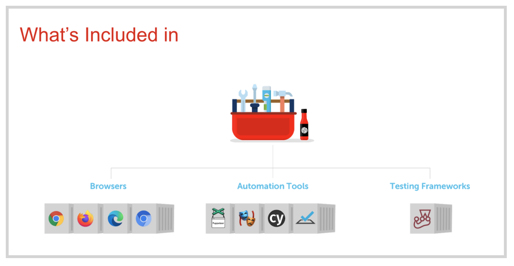

### Native Testing


#### Scalable Testing, Quickly
Installing with `saucectl` allows you to quickly and easily install all dependencies and start testing
* Test with JavaScript frameworks such as xCUITest, Espresso, and Cypress
* Configure your test suite and credentials quickly
* Access Sauce Labs VMs with thousands of browser/ operating system combinations


### What can saucectl and the Sauce Labs Platform Do?

`saucectl` stands for Sauce Control, the command line interface for running non-Selenium/ Appium tests such as and XCUITest, Espresso Cypress, TestCafe, and more . The toolkit includes [`saucectl` commands](https://docs.saucelabs.com/testrunner-toolkit/installation/#installing-saucectl) that allow you to interface with Sauce Labs, as well as the tools necessary to record the output from tests on a Sauce Labs Virtual Machine, making it easy to interpret, share and analyze those test results.


### Why Use saucectl

Appium can be a great solution for automating mobile tests, however there are cases where using a native framework, with test code alongside the application code, is better suited to your testing needs.

Using XCUI along with Sauce Labs also allows you to:

*   Run your tests using either a Sauce Labs VM or Docker container
*   All you need to run a test is an application file and a test file, eliminating the need for setting up an environment and dependencies
*   Review, share, and evaluate your test assets, such as logs, test results, and test videos
*   Use our Insights feature to perform deeper analysis of test outcomes


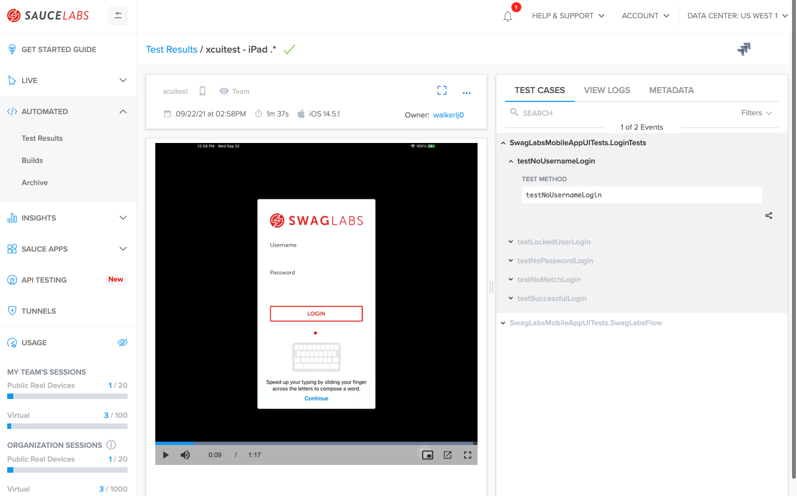

### Two Ways to Run Tests

#### Sauce Mode
By default, when you use saucectl, it works by passing your entire test suite, including dependencies and configurations to Sauce Labs Cloud of Virtual Machines, where your tests will be executed as per your configurations. Use the command `saucectl run` or update `mode: sauce` in `config.yml`, to run your tests on Sauce Labs VMs.

#### Docker Mode
With saucectl, you can also install Docker and run a containerized version of your test environment, then pass the results to the Sauce Labs Dashboard , by setting `mode: docker` in `config.yml`.


<!-- ------------------------ -->
## 1.03 Setup saucectl to Run Tests on Sauce Labs
Duration: 0:07:00

In this module, you will see how you can set up   saucectl on Sauce Labs VMs _or_ use saucectl along with Docker on your MacOS Computer. The basic steps include:

* Grab an [example XCUITest project](https://github.com/saucelabs/saucectl-xcuitest-example)
* Install saucectl with `sudo sh -c 'curl -L ...'`
* Set your Sauce username and access key with `saucectl configure`
* Update `.sauce/config.yml` with test suite information

_More detailed instructions are below_


#### Video

<!-- [XCUI and saucectl Setup]()

<video id=""></video> -->


Negative
: To customize your test, you need to update the `.sauce/config.yml` file. See the most up-to-date [configuration in the documentation.](https://docs.saucelabs.com/testrunner-toolkit/configuration/xcuitest/).

### Download and Install saucectl

First, you need to download and install the saucectl tools and Command Line Interface (CLI) that you will use to run Sauce Labs. This is a part of the Sauce Labs set of tools that allows you to set a configuration location & update the file in your local directory.  There are several [options for installing](https://docs.saucelabs.com/testrunner-toolkit/installation) it, and in this tutorial we will use a `cURL` command to install saucectl on your MacOS or Linux machine:

```
sudo sh -c 'curl -L https://saucelabs.github.io/saucectl/install | bash -s -- -b /usr/local/bin'
```

This package allows you to use a [simple set of `saucectl` commands](https://docs.saucelabs.com/testrunner-toolkit/running-tests/) to run your test suite on the Sauce Labs platform.


### XCUI Test Code

You have two options for setting up your tests to run on Sauce Labs

* Use the `saucectl init` command as outlined in the section below
* Clone or Fork the [example project](https://github.com/saucelabs/saucectl-xcuitest-example) then update the configuration file in `./sauce/config.yml` to customize your test run


Another option, If you have your own app and test files, is to copy the sample project, and place your tests in the **/apps** directory, replacing the example app & test files.


### Initialize saucectl

Now that you have your Cypress test files set up in a directory, and your Sauce Labs username and access key setup globally with saucectl, you can initialize a saucectl project in order to run your Cypress tests on the Sauce Labs Cloud.

From the folder where you should have placed you app files test files or assets (with the sample, navigate to the `apps` directory), run the terminal command:

```
saucectl init
```

You will see a workflow appear allowing you to choose the data center you run tests in, the framework and version, configuration file, browser, platform, and options to download test assets.

Once you make all the choices in your workflow, you should be able to see the hidden `/.sauce` directory and the `.sauceignore` file in your project:

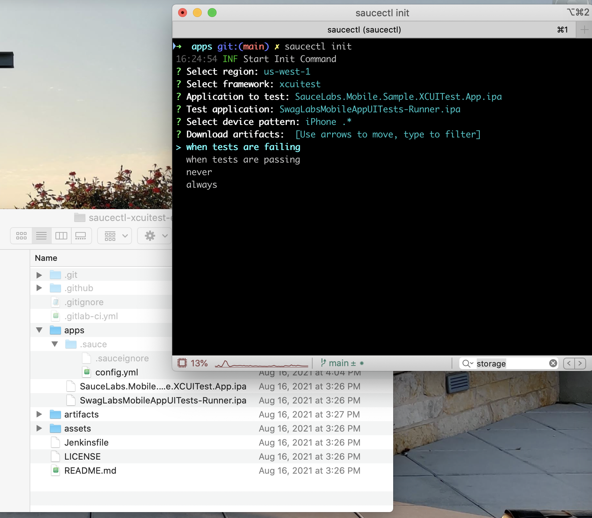

### Set Sauce Username and Access Key

You can access your Sauce Username and Access Key on the [Sauce Labs App](https://app.saucelabs.com/user-settings) and go to **Account > User Settings** . There are three ways you can configure your credentials with saucectl:

* Set them as environment variables (saucectl will detect them)
* Enter them when you run `saucectl init`
* Use `saucectl configure`

To manually configure your usename and access key, simply type the command:

```
saucectl configure
```

This command prompts you to manually enter your credentials, and will generate a `credentials.yml` file in a `.sauce directory` where you installed saucectl initially (in your home folder).

To find `credentials.yml`, search for a file called `credentials.yml` in a hidden directory (Cntrl + Shit + .) called `.sauce`.

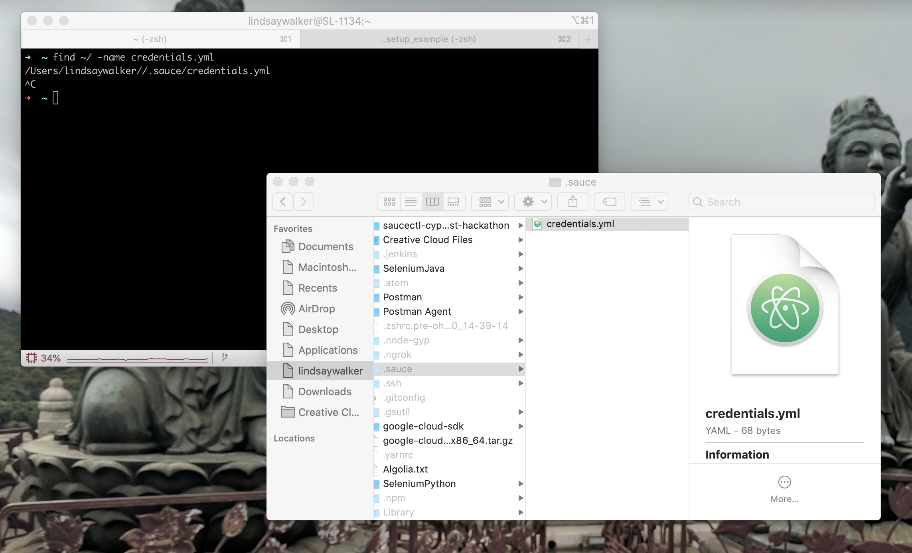

Visit [accounts.saucelabs.com](https://accounts.saucelabs.com/am/XUI/#login/?utm_source=referral&utm_medium=LMS&utm_campaign=link). You can create a free trial account if you haven’t been assigned one.


Watch [this video](https://www.youtube.com/watch?v=3K1Eu0eTha8&t=12s) to see how to set up your Sauce username and access key as environment variables on your machine, or use [the instructions here to set them up on Windows](https://docs.google.com/document/d/1Cb27j6hgau5JHmAxGHPihd3V4Og3autPCei82_m1Ae8/edit?usp=sharing).


<!-- ------------------------ -->
## 1.04 The Configuration File

Once you have your project setup, open the project directory, take a look at the project files inside.

<!-- 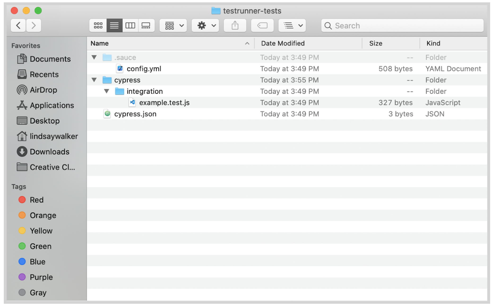

You will see a `cypress` folder containing the `/integrations` directory where all test files are stored, as well as a `cypress.json` file where you can set options such as reporters, the base URL that tests will be run against, and [more](https://docs.cypress.io/guides/references/configuration.html#Global).

Another part of the package that was installed when you ran `saucectl` new is the /`.sauce` directory. The /`.sauce` directory has a `.sauceignore` file where you can designate the files and directories you don't want uploaded to Sauce Labs, and the `config.yml` file in which you will see something like the following ([Config Docs](https://docs.saucelabs.com/testrunner-toolkit/configuration#basic-configuration)):

**[The Config File](https://github.com/saucelabs/saucectl/blob/main/.sauce/cypress.yml)**

```
apiVersion: v1alpha
kind: cypress
sauce:
  region: us-west-1
  concurrency: 10
  metadata:
    tags:
      - e2e
    build: "$BUILD_ID"
rootDir: tests/e2e/
docker:
  fileTransfer: mount
cypress:
  version: 7.3.0
  configFile: "cypress.json"
suites:
  - name: "saucy test in docker"
    mode: docker
    browser: "chrome"
    config:
      env:
        hello: world
      testFiles: [ "**/*.*" ]

  - name: "saucy test in sauce"
    browser: "chrome"
    platformName: "Windows 10"
    config:
      env:
        hello: world
      testFiles: [ "**/*.*" ]

artifacts:
  download:
    when: always
    match:
      - console.log
    directory: ./artifacts/
```

Take a look at the top of the config file. There are several important elements here that can be modified.
*   The `apiVersion` is the [saucectl API](https://github.com/saucelabs/saucectl) Version
*   The `kind` is the tesing framework
* The `defaults` allow you to configure various settings. You can set the mode (_Docker_ or _Sauce_) in `mode` at this level, or as a field that is a part of the `suites` below.
* If you are using _Docker mode_, you can `mount` or `copy` files
*   The `cypress` information tells your cypress tests where to look for the test configuration file, and which version of cypress you are running. Other file locations are relative to where `config.json` is place. See the docs for a [list of supported versions](https://docs.saucelabs.com/testrunner-toolkit)
* An optional setting is where the `rootDir` or root directory is placed
* The `sauce` information. Here is where you will put information that will be passed to sauce and can be used for debugging tests, such as the name, `build` number from your CI tool, and number of machines you would like to run concurrently
*   The `suites` information includes the name, browser, and the configuration for your test suites such as what types of file names to look for to run as tests, and other metadata that is passed to your Sauce Labs account for running tests and displaying results.
  * The `config: testFiles:` specify the directory relative to `cypress.json` or `rootDir` and the file names of your tests
*   The `artifact` information includes what assets (such as images and videos of your tests) are fetched and stored locally. The options for downloading assets include `always`, `never`, `pass`, `fail`.

#### .sauceignore

The `sauceignore` file that is essential to use to speed up your test runs. By default, everything that is in your project folder will be uploaded to Sauce Labs when you run your tests, however, it's important to include things like asset directories or other files that aren't necessary for a test run to this file.

**Example :**

```
cypress/videos/
cypress/results/
cypress/screenshots/
node_modules/
.git/
.github/
.DS_Store
__assets__
**/__assets__
```

### Install Docker (Optional)

If you would like to run your tests in a Docker container and pass the results to the Sauce Labs platform, visit the [docker download website ](https://docs.docker.com/get-docker/)and install the newest version of Docker on your machine.

Start up Docker to ensure it’s running properly on your machine, and follow the instructions in the next module to modify  `config.yml` to run tests in _Docker Mode_.

You can check to see if it’s running with the command `docker info`, and see which version you have with the command `docker -v`.   -->

See the next module for more about running tests with the command `saucectl run`


<!-- ------------------------ -->
## 1.05 Customize Your Test Runs
Duration: 0:03:00

text

<!-- ### The Configuration File

Once you have your project setup, open the project directory, take a look at the project files inside.


You will see a `cypress` folder containing the `/integrations` directory where all test files are stored, as well as a `cypress.json` file where you can set options such as reporters, the base URL that tests will be run against, and [more](https://docs.cypress.io/guides/references/configuration.html#Global).

Another part of the package that was installed when you ran `saucectl` new is the /`.sauce` directory. The /`.sauce` directory has a `.sauceignore` file where you can designate the files and directories you don't want uploaded to Sauce Labs, and the `config.yml` file in which you will see something like the following ([Config Docs](https://docs.saucelabs.com/testrunner-toolkit/configuration#basic-configuration)):

**[The Config File](https://github.com/saucelabs/saucectl/blob/main/.sauce/cypress.yml)**

```
apiVersion: v1alpha
kind: cypress
sauce:
  region: us-west-1
  concurrency: 10
  metadata:
    tags:
      - e2e
    build: "$BUILD_ID"
rootDir: tests/e2e/
docker:
  fileTransfer: mount
cypress:
  version: 7.3.0
  configFile: "cypress.json"
suites:
  - name: "saucy test in docker"
    mode: docker
    browser: "chrome"
    config:
      env:
        hello: world
      testFiles: [ "**/*.*" ]

  - name: "saucy test in sauce"
    browser: "chrome"
    platformName: "Windows 10"
    config:
      env:
        hello: world
      testFiles: [ "**/*.*" ]

artifacts:
  download:
    when: always
    match:
      - console.log
    directory: ./artifacts/
```

Take a look at the top of the config file. There are several important elements here that can be modified.
*   The `apiVersion` is the [saucectl API](https://github.com/saucelabs/saucectl) Version
*   The `kind` is the tesing framework
* The `defaults` allow you to configure various settings. You can set the mode (_Docker_ or _Sauce_) in `mode` at this level, or as a field that is a part of the `suites` below.
* If you are using _Docker mode_, you can `mount` or `copy` files
*   The `cypress` information tells your cypress tests where to look for the test configuration file, and which version of cypress you are running. Other file locations are relative to where `config.json` is place. See the docs for a [list of supported versions](https://docs.saucelabs.com/testrunner-toolkit)
* An optional setting is where the `rootDir` or root directory is placed
* The `sauce` information. Here is where you will put information that will be passed to sauce and can be used for debugging tests, such as the name, `build` number from your CI tool, and number of machines you would like to run concurrently
*   The `suites` information includes the name, browser, and the configuration for your test suites such as what types of file names to look for to run as tests, and other metadata that is passed to the Sauce Labs dashboard for running tests and displaying results.
  * The `config: testFiles:` specify the directory relative to `cypress.json` or `rootDir` and the file names of your tests
*   The `artifact` information includes what assets (such as images and videos of your tests) are fetched and stored locally. The options for downloading assets include `always`, `never`, `pass`, `fail`.

#### .sauceignore

The `sauceignore` file that is essential to use to speed up your test runs. By default, everything that is in your project folder will be uploaded to Sauce Labs when you run your tests, however, it's important to include things like asset directories or other files that aren't necessary for a test run to this file.

**Example :**

```
cypress/videos/
cypress/results/
cypress/screenshots/
node_modules/
.git/
.github/
.DS_Store
__assets__
**/__assets__
```

### Install Docker (Optional)

If you would like to run your tests in a Docker container and pass the results to the Sauce Labs platform, visit the [docker download website ](https://docs.docker.com/get-docker/)and install the newest version of Docker on your machine.

Start up Docker to ensure it’s running properly on your machine, and follow the instructions in the next module to modify  `config.yml` to run tests in _Docker Mode_.

You can check to see if it’s running with the command `docker info`, and see which version you have with the command `docker -v`.  

See the next module for more about running tests with the command `saucectl run` -->

<!-- ------------------------ -->
## 1.05 Run Your XCUI Test on Sauce
Duration: 0:03:00

text

<!-- Running a Cypress test on sauce is easy. If you follow the configuration steps using `saucectl init` in the last module, all you need to do is run the command:

```
saucectl run
```

Specifying which tests you want to run in which environment can be configured in the `suites:` tab in the `.sauce/config.yml` file. This lesson will cover:

* Setting different directories
* Specifying certain test files
* Running in different web browsers
* Executing test in _Docker Mode_ or _Sauce Mode_
* View test results on the Sauce Labs App

Running tests using Cypress and saucectl allows you to run as many combinations of tests and environments as you would like.

#### Video

[Running Tests with Sauce and Cypress](https://www.youtube.com/watch?v=ofa9Y1u6RAc&list=PL67l1VPxOnT7YTdCbpvSpJ8FF-sNxm8r-&index=3)

<video id="ofa9Y1u6RAc"></video>

#### Example Cypress Code
For example Cypress tests, you can:
* Use the [simplified Cypress test code ](https://github.com/walkerlj0/saucectl-course-example-code/tree/main/Mod1)you can learn more about in 1.07-1.08 that goes along with the `suites` examples
* Use the [Sauce Labs Cypress Test Code](https://github.com/saucelabs/saucectl-cypress-example)
* Use your own Cypress tests


### Add and Run New Tests
As you grow your testing suite, you may want to add new tests to run, and you may want to have the option to run different specific groups of tests, and run on different browsers. The `config: testFiles:` objects under the `suites:` tag allow you to specify which tests are run, when:

If you used `saucectl init` the object test will automatically run any tests in the `cypress/integration` directory with a [supported Cypress test file type](https://docs.cypress.io/guides/core-concepts/writing-and-organizing-tests#Test-files) and look something like this:

```
suites:
- name: cypress - windows 10 - chrome
  browser: chrome
  platformName: windows 10
  config:
    testFiles:
    - '**/*.*'
  mode: sauce
rootDir: .
```

Lets create two directories within your `cypress/integration` directory so that you can learn to specify both directories and files. Create both a `/smoke` and a `/regression` directory, and paste copies of your tests in each.

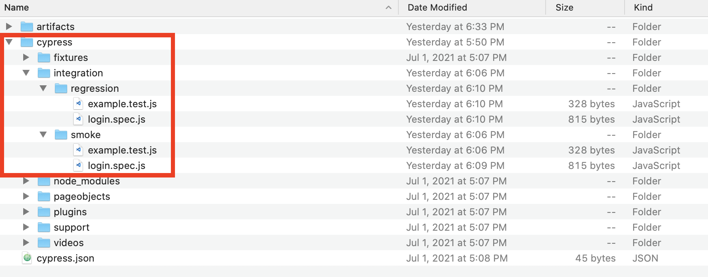

You will want to modify any code that refers to the project structure that may change. In this example, you will want to update the imports in `login.spec.js` with an additional `../` to account for the re-organization:

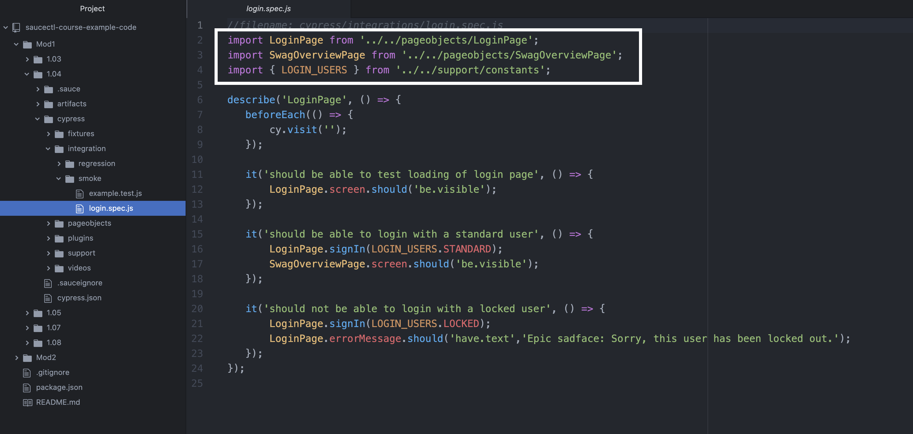

Now you can modify your `config.yml` to run one test from each directory. You will need to create two `-name:` objects under the `suites:`;

```
suites:
- name: cypress - windows 10 - chrome smoke
  browser: chrome
  platformName: windows 10
  config:
    testFiles:
    - 'smoke/*.spec.*'
  mode: sauce
- name: cypress - windows 10 - chrome regression
  browser: chrome
  platformName: windows 10
  config:
    testFiles:
      ['regression/*.test.*']
```

#### Note

Negative
: There are also two alternatives for listing the `testFiles;` in your suite, either in brackets `[]` [like the example here](https://docs.saucelabs.com/testrunner-toolkit/configuration/cypress#suites/&utm_source=referral&utm_medium=LMS&utm_campaign=link), or underneath tabbed in, in front of a dash with a space: `-'**/login].spec.js' `

Now when you use the command `saucectl run` you should see both test suites, **chrome smoke** and **chrome regression** having run:

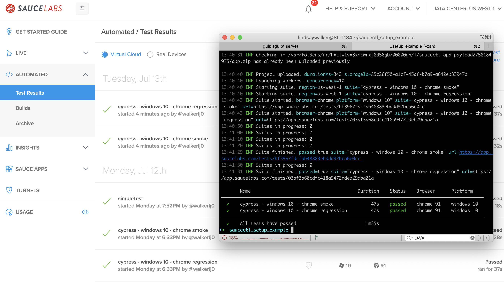

### Run Your Tests in Different Browsers

Sauce Labs supports running Cypress tests in the [environments that are supported](https://docs.saucelabs.com/testrunner-toolkit#supported-frameworks-in-sauce-cloud/) by the Cypress test runner. This means you can run using the Chrome, Microsoft Edge, and Firefox browsers.

### Run Your Tests in Different Modes

#### Run All Tests in One Mode

If you do not have the `mode:` specified anywhere in your `.sauce/config.yml` file, then, by default, all your tests will be bundled, and uploaded and run on the Sauce Labs Cloud of Virtual Machines.

If you would like to try running tests in Docker, you can set all your test suites to run, by default, in docker mode by setting the `defaults:` option:

```
apiVersion: v1alpha
kind: cypress
defaults:
  mode: docker
  # ...
```

You can change this setting back to default to _Sauce mode_ by changing `mode: sauce` or delete the `mode:` option.

Unless you specify a different mode in a suite, all tests will run in _Docker Mode_:

#### Note
Negative
: Not all browsers may be supported in _Docker Mode_, see the [release notes](https://github.com/saucelabs/sauce-cypress-runner/releases/tag/v7.1.0).

#### Run Certain Tests in Different Modes

You also have the ability to run some suites in _Docker Mode_, and some suites in _Sauce Mode_, all from the same test run, by setting individual suites to run in different modes.

To set the mode on the suite level, simply add the `mode:` option somewhere under your test suite `name;`

```
  suites:
    - name: saucy test suite
      mode: docker
```

The following settings in your `config.yml` file will run two of your tests in _Docker Mode_ (by default) and two of your tests in _Sauce Mode_:

```
suites:
- name: cypress - windows 10 - chrome smoke
  mode: sauce
  browser: chrome
  platformName: windows 10
  config:
    testFiles:
    - 'smoke/*.spec.*'
- name: cypress - windows 10 - chrome regression
  browser: chrome
  platformName: windows 10
  config:
    testFiles:
      ['regression/*.test.*']
- name: cypress - windows 10 - firefox - all
  browser: firefox
  browserVersion: 86.0
  platformName: windows 10
  config:
    testFiles:
      - '**/*.*'
- name: cypress - windows 10 - edge -all
  browser: microsoftedge
  browserVersion: 90.0
  platformName: windows 10
  config:
    testFiles:
      - '**/*.*'
  mode: sauce
```


Now, when you run the command `saucectl run`, you should see output like this in your console:

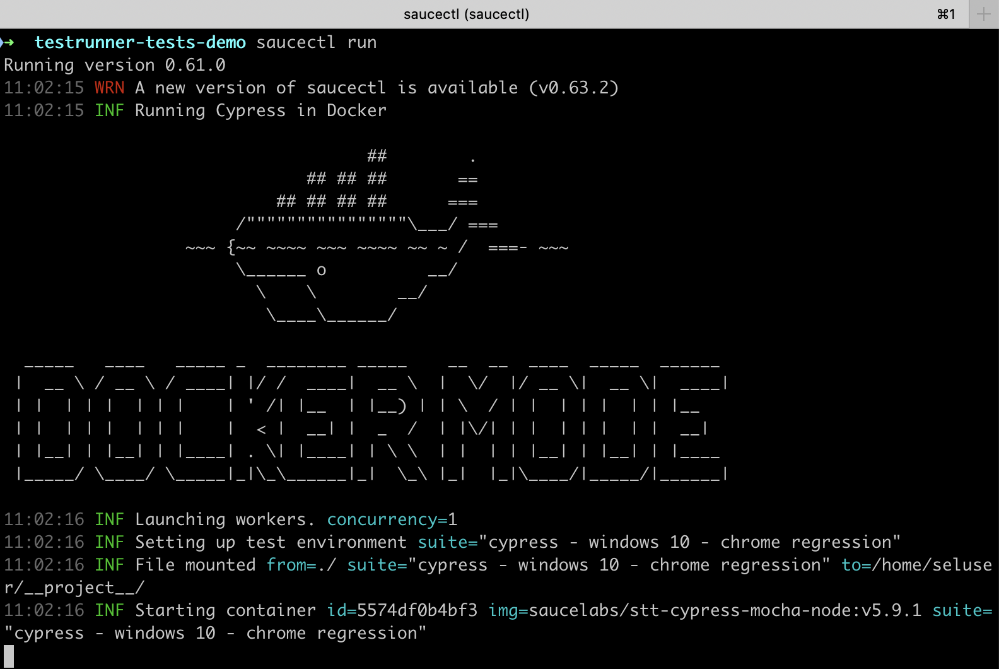

### View Your Test Results

If you go to [app.saucelabs.com](https://accounts.saucelabs.com/am/XUI/#login/&utm_source=referral&utm_medium=LMS&utm_campaign=link ), you should see the two tests on your automated test results dashboard:

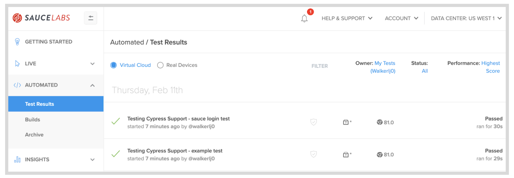

If you click into the tests, you can see the video of the test running on the Cypress client, and a log you can easily share with others:

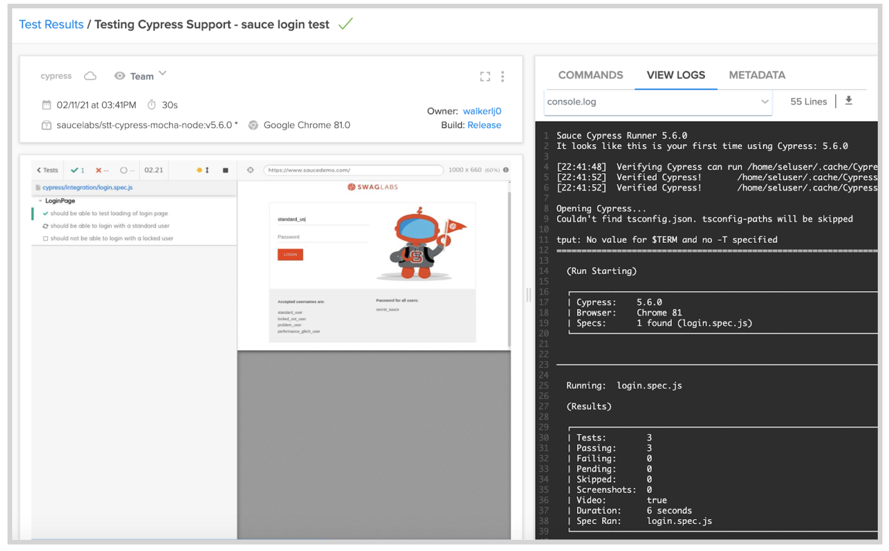

Once you have your tests running, learn more about what you can do with Sauce Labs and Cypress in [Module 2](https://training.saucelabs.com/codelabs/Module2-Testrunner/index.html?index=..%2F..testrunner#0)

#### Final Code
See an example of the test suite with [updated suites in `.sauce/config.yml`](https://github.com/walkerlj0/saucectl-course-example-code/tree/main/Mod1/1.04)

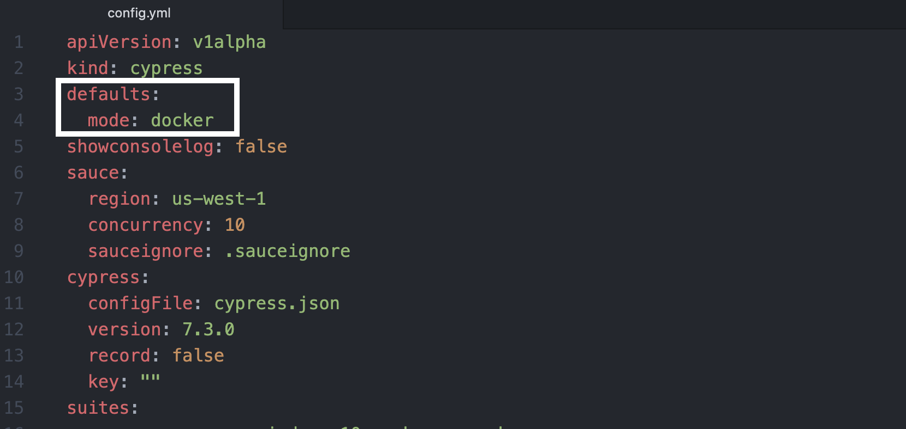


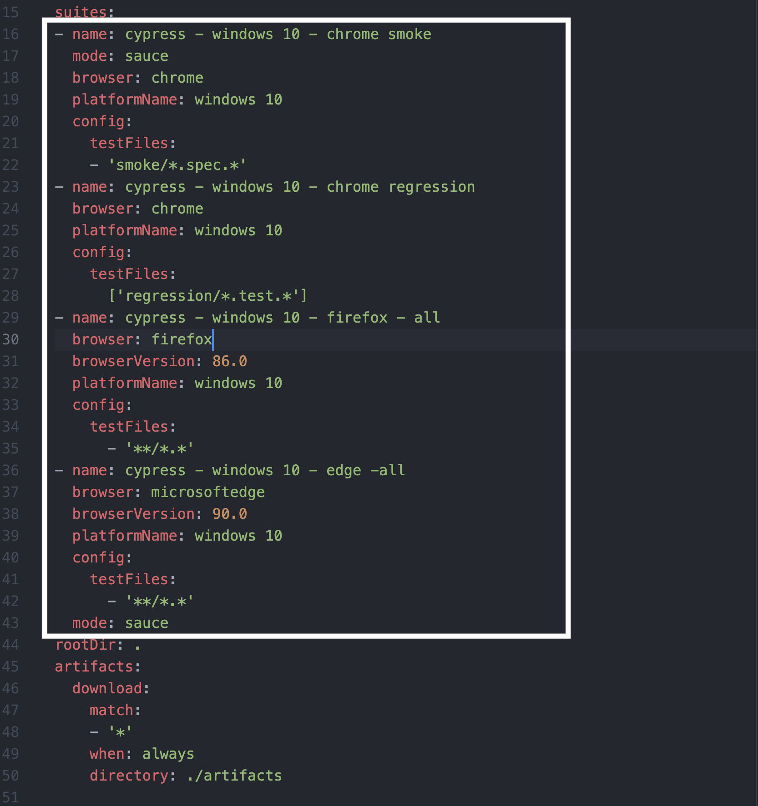 -->

<!-- ------------------------ -->
## 1.06 Run Cypress Tests in Parallel
Duration: 0:03:00

text

<!-- Running Cypress tests in parallel on the Sauce Labs Cloud using the saucectl is as simple as updating a single field in your `.sauce/config.yml` file:


Inside of the `.sauce` data object, find the `concurrency` field, and change it from `1` to a larger number (`2` or `10`)

You are able to run suites of tests in parallel using the `concurrency` field in `config.yml`, running as many test suites in parallel as you would like (limited by the of virtual machines you have available on your Sauce Labs account).

Negative
: In order to run tests in parallel, you must have a paid account that has a concurrency of more than one. See the docs to learn more about concurrency, and check your concurrency  under **User Settings**. 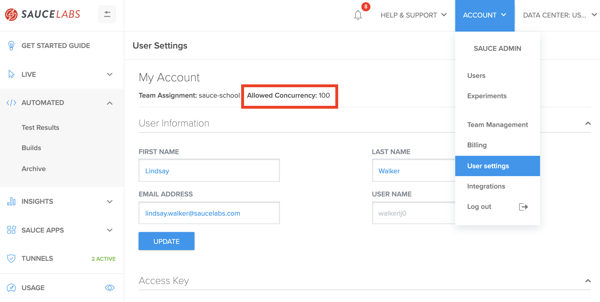


### Run Parallel Tests in Multiple Browsers
Suites will automatically be run in parallel depending on your teams' allowed concurrency.

In this example, _Login Chrome_, _Login Edge_, and _Login  Firefox_ will have all the test files in each suite run in parallel on a different machine.

```
...
suites:
  # Chrome
  - name: "Login Chrome"
    browser: "chrome"
    platformName: "Windows 10"
    screenResolution: "1400x1050"
    config:
      testFiles: [ "**/login.*" ]
  # MicrosoftEdge
  - name: "Login MicrosoftEdge"
    browser: "edge"
    platformName: "Windows 10"
    screenResolution: "1400x1050"
    config:
      testFiles: [ "**/login.*" ]
 # Firefox
  - name: "Login Firefox"
    browser: "firefox"
    platformName: "Windows 10"
    screenResolution: "1400x1050"
    config:
      testFiles: [ "**/login.*" ]
```
To find out more about the names for the different browser and platform  (OS) combinations, visit the [platform configurator](https://saucelabs.com/platform/platform-configurator), and [documentation](https://docs.saucelabs.com/testrunner-toolkit/running-tests#cross-browser-tests) for the most up to date config.

#### Final Code
See [an example suite](https://github.com/walkerlj0/testrunner-course-example-code/blob/main/Mod1/1.05/.sauce/config.yml) set to run in parallel on multiple browsers. -->

<!-- ------------------------ -->
## 1.08 Check `config.yml` Syntax
Duration: 0:02:00

Lesson about installing and using JSON schema

<!-- ------------------------ -->
## 1.09 Setup the Slack Plugin
Duration: 0:02:00

text

<!-- ------------------------ -->
## 1.10 Module 1 Quiz
Duration: 0:02:00

text

<!--  -->
