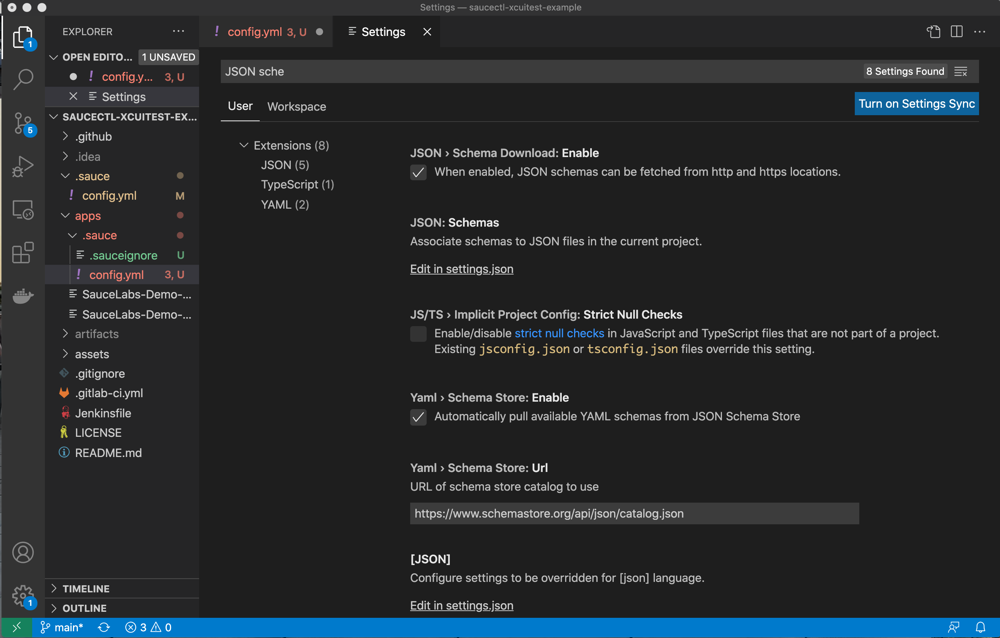
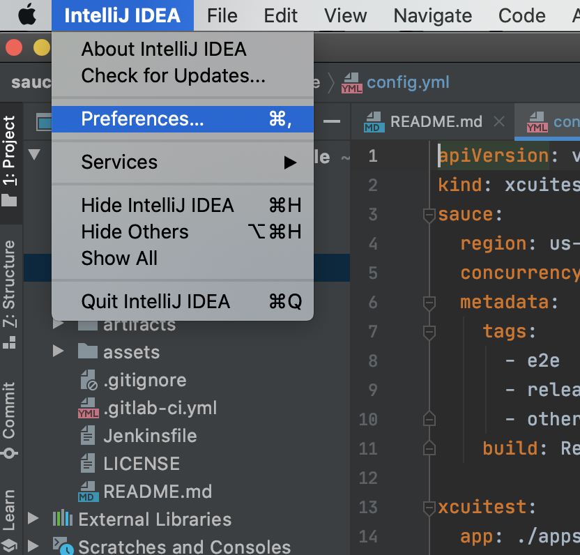

 summary: Module 1 of the Native Apps on Sauce Labs course will should you how to user the saucectl set of tools to run your XCUI iOS tests on the Sauce Labs Cloud of virtual machines. You will use saucectl to upload your app, run your automated tests creating artifacts to share and analyze.
id: Module1-saucectl-Native
categories: beginner
environments: Web
status: Published
feedback link: https://forms.gle/CGu4QchgBxxWnNJK8
analytics account: UA-86110990-1
tags: saucectl-native
authors: Lindsay Walker
<!-- ------------------------ -->
# Module 1 – Intro to saucectl with XCUI

<!-- ------------------------ -->
## 1.01 What You'll Learn
Duration: 0:01:00

### Skills & Knowledge

* Understand how saucectl with the Sauce Labs platform is different than other automated test solutions that you can use with Sauce Labs

* Learn about the components of saucectl with the Sauce Labs platform, including the command line tool, Docker, the Sauce Labs 'My Demo' app, and a demo app test.

* Set up the necessary components to run an XCUI test with saucectl on the Sauce Labs platform

* Understand the configuration files for an XCUI test on saucectl with the Sauce Labs platform and how to modify them

* Learn to run an XCUI test on Sauce Labs on Virtual Machines (VMs)

* Learn to run test suites and classes in parallel, using the `concurrency` option

### What You Will Need

* The IntelliJ IDE (free Community Edition is fine)
* Download the sample code and test example [in the `saucectl-xcuitest-example` repository](https://github.com/saucelabs/saucectl-xcuitest-example).
* Take a look at the [source code for the app & tests](https://github.com/saucelabs/my-demo-app-ios/releases)
* Get the [JSON Schema Validator](https://www.schemastore.org/json/) for your IDE called **SauceCTL Configuration**

<!-- ------------------------ -->
## 1.02 What Is saucectl?
Duration: 0:03:00

Sauce Labs has developed a set of tools in conjunction with a command line tool called `saucectl` to enable test developers to get setup quickly to scale up their testing to more browsers and devices using the Sauce Labs Cloud, and to be able to do this with a wider range of testing frameworks than ever before.

#### Video
[Testing Native Apps on Sauce Labs]()

<video id=""></video>

### Native Testing

This is a testing solution for developers that simplifies user setup, speeds up test execution time, unifies test results, and supports non-Selenium or Appium Frameworks like Espresso, XCUITest, Cypress, and more.


#### Scalable Testing, Quickly
Installing with `saucectl` allows you to quickly and easily install all dependencies and start testing
* Test with JavaScript frameworks such as xCUITest, Espresso, and Cypress
* Configure your test suite and credentials quickly
* Access Sauce Labs VMs with thousands of browser/ operating system combinations


### What can saucectl and the Sauce Labs Platform Do?

`saucectl` stands for Sauce Control, the command line interface for running non-Selenium/ Appium tests such a Espresso, XCUITest, Cypress, TestCafe, and more . The toolkit includes [`saucectl` commands](https://docs.saucelabs.com/testrunner-toolkit/installation/#installing-saucectl) that allow you to interface with Sauce Labs, as well as the tools necessary to record the output from tests on a Sauce Labs Virtual Machine, making it easy to interpret, share and analyze those test results.


### Why Use saucectl

Appium can be a great solution for automating mobile tests, however there are cases where using a native framework, with test code alongside the application code, is better suited to your testing needs.

Using XCUI along with Sauce Labs also allows you to:

*   Run your tests using either a Sauce Labs VM or Docker container
*   All you need to run a test is an application file and a test file, eliminating the need for setting up an environment and dependencies
*   Review, share, and evaluate your test assets, such as logs, test results, and test videos
*   Use our Insights feature to perform deeper analysis of test outcomes


### Run Tests with saucectl

When you use saucectl, it works by passing your entire test suite, including dependencies and configurations to Sauce Labs Cloud of Virtual Machines, where your tests will be executed as per your configurations.

In the next two sections, you will learn to use the command `saucectl init` to configure your test to run on Sauce Labs Emulators and Real Devices, and see how they are run quickly and easily using `saucectl run`.


<!-- ------------------------ -->
## 1.03 Run XCUI Tests on Sauce Labs
Duration: 0:07:00

In this module, you will see how you can set up saucectl on Sauce Labs VMs _or_ use saucectl along with Docker on your MacOS Computer. The basic steps include:

* Grab an [example XCUITest project](https://github.com/saucelabs/saucectl-xcuitest-example)
* Install saucectl with `sudo sh -c 'curl -L ...'`
* Configure your test to run with `saucectl init`
* Set your Sauce username and access key with `saucectl configure`
* Run your tests with `saucectl run`

_More detailed instructions are below_


#### Video

<!-- [XCUI and saucectl Setup]()

<video id=""></video> -->


Negative
: To customize your test, you need to update the `.sauce/config.yml` file. See the most up-to-date [configuration in the documentation.](https://docs.saucelabs.com/testrunner-toolkit/configuration/xcuitest/).

### Download and Install saucectl

First, you need to download and install the saucectl tools and Command Line Interface (CLI) that you will use to run Sauce Labs. This is a part of the Sauce Labs set of tools that allows you to set a configuration location & update the file in your local directory.  There are several [options for installing](https://docs.saucelabs.com/testrunner-toolkit/installation) it, and in this tutorial we will use a `cURL` command to install saucectl on your MacOS or Linux machine:

```
sudo sh -c 'curl -L https://saucelabs.github.io/saucectl/install | bash -s -- -b /usr/local/bin'
```

This package allows you to use a [simple set of `saucectl` commands](https://docs.saucelabs.com/testrunner-toolkit/running-tests/) to run your test suite on the Sauce Labs platform.


### XCUI Test Code

You have two options for setting up your tests to run on Sauce Labs

* Use the `saucectl init` command as outlined in the section below
* Clone or Fork the [example project](https://github.com/saucelabs/saucectl-xcuitest-example) then update the configuration file in `./sauce/config.yml` to customize your test run


Another option, If you have your own app and test files, is to copy the sample project, and place your tests in the **/apps** directory, replacing the example app & test files.


### Initialize saucectl

Now that you have your Cypress test files set up in a directory, and your Sauce Labs username and access key setup globally with saucectl, you can initialize a saucectl project in order to run your Cypress tests on the Sauce Labs Cloud.

From the folder where you should have placed you app files test files or assets (with the sample, navigate to the `apps` directory), run the terminal command:

```
saucectl init
```

You will see a workflow appear allowing you to choose the data center you run tests in, the framework and version, configuration file, browser, platform, and options to download test assets.

Once you make all the choices in your workflow, you should be able to see the hidden `/.sauce` directory and the `.sauceignore` file in your project:


### Set Sauce Username and Access Key

You can access your Sauce Username and Access Key on the [Sauce Labs App](https://app.saucelabs.com/user-settings) and go to **Account > User Settings** . There are three ways you can configure your credentials with saucectl:

* Set them as environment variables (saucectl will detect them)
* Enter them when you run `saucectl init`
* Use `saucectl configure`

To manually configure your username and access key, simply type the command:

```
saucectl configure
```

This command prompts you to manually enter your credentials, and will generate a `credentials.yml` file in a `.sauce directory` where you installed saucectl initially (in your home folder).

To find `credentials.yml`, search for a file called `credentials.yml` in a hidden directory (Cntrl + Shit + .) called `.sauce`.


Visit [accounts.saucelabs.com](https://accounts.saucelabs.com/am/XUI/#login/?utm_source=referral&utm_medium=LMS&utm_campaign=link). You can create a free trial account if you haven’t been assigned one.


Watch [this video](https://www.youtube.com/watch?v=3K1Eu0eTha8&t=12s) to see how to set up your Sauce username and access key as environment variables on your machine, or use [the instructions here to set them up on Windows](https://docs.google.com/document/d/1Cb27j6hgau5JHmAxGHPihd3V4Og3autPCei82_m1Ae8/edit?usp=sharing).

### Run Your Tests

Now that you have setup your config file and credentials, all you need to do to launch your test suite is run the command:

```
saucectl run
```

You will see output like so in your console with details about the run on Sauce Labs:


<!-- ------------------------ -->
## 1.04 Set Up and Configure XCUI Tests

In this lesson, you will learn how to configure a custom setup your test suite.
* Understand the configuration files that were installed with saucectl
* Learn how to update `.sauce/config.yml` with test suite information
* Exclude files from being uploaded to Sauce (and slowing down your test run) in the `.sauce/.sauceignore` file

Once you have your project setup, open the project directory, take a look at the project files inside.


You will see a `apps` folder containing the `.ipa` (or `.app`) files where the app and test file packages are stored. These should be [bundles built by the app developer](https://developer.apple.com/documentation/xcode/preparing-your-app-for-distribution).


### Configuration Files

Another part of the package that was installed when you ran `saucectl` new is the /`.sauce` directory. The /`.sauce` directory has a `.sauceignore` file where you can designate the files and directories you don't want uploaded to Sauce Labs, and the `config.yml` file in which you will see something like the following:

**[The Config File](https://docs.saucelabs.com/testrunner-toolkit/configuration/xcuitest/)**


```
apiVersion: v1alpha
kind: xcuitest
sauce:
  region: us-west-1
  concurrency: 1
  metadata:
    tags:
      - e2e
      - release team
      - other tag
    build: Release $CI_COMMIT_SHORT_SHA

xcuitest:
  app: ./apps/SauceLabs-Demo-App.ipa
  testApp: ./apps/SauceLabs-Demo-App-Runner.XCUITest.ipa

suites:
  - name: "saucy xcuitest"
  #  testOptions:
  #    class: ["My_Demo_AppUITests.My_Demo_AppUITests/testNavigateToCart"]
    devices:
      # If set, only device by ID will be queried.
      #- id: <rdc_device_id>
      - name: "iPhone.*"
        platformVersion: "14.6"
        options:
          # If set, only devices with a SIM card will be queried.
          carrierConnectivity: false
          # Possible values [ANY,PHONE,TABLET]
          deviceType: PHONE
          # If set, only private devices will be queried.
          private: false

artifacts:
  download:
    when: always
    match:
      - "*.junit.xml"
    directory: ./artifacts/
```

Take a look at the top of the config file. There are several important elements here that can be modified.
*   The `apiVersion` is the [saucectl API](https://github.com/saucelabs/saucectl) Version
*   The `kind` is the testing framework being used
* The `sauce` options allow you to set the datacenter, and other information that will be passed to sauce and can be used for debugging tests, such as the name, `build` number from your CI tool, and number of machines you would like to run concurrently.
*   The `xcuitest` information specifies the name and location of the app and test packages
*   The `suites` information includes the name, browser, and the configuration for your test suites such as what types of file names to look for to run as tests, and other metadata that is passed to your Sauce Labs account for running tests and displaying results.
  * `TestOptions` allows you to specify which test classes and methods will be run in that suite
  * The `devices` and option specifies which real device you will use. Setting an `id` lets you choose a single device, or you can use `name` with [dynamic device allocation](https://docs.saucelabs.com/mobile-apps/automated-testing/appium/real-devices/#dynamic-device-allocation).
  <!-- * The `devices` and `emulators` options specify which real device or emulator on a virtual machine you will use. See the [platform configurator](https://saucelabs.com/platform/platform-configurator) for emulator options, and how to [specify Real Devices](https://docs.saucelabs.com/mobile-apps/automated-testing/appium/real-devices/#dynamic-device-allocation). -->
*   The `artifacts` information includes what assets (such as images and videos of your tests) are fetched and stored locally. The options for downloading assets include `always`, `never`, `pass`, `fail`.

#### .sauceignore

The `sauceignore` file that is essential to use to speed up your test runs. By default, everything that is in your project folder will be uploaded to Sauce Labs when you run your tests, however, it's important to include things like asset directories or other files that aren't necessary for a test run to this file.

**Example :**

```
# This file instructs saucectl to not package any files mentioned here.
.git/
.github/
.DS_Store
.hg/
.vscode/
.idea/
.gitignore
.hgignore
.gitlab-ci.yml
.npmrc
*.gif
```

<!-- ------------------------ -->
## 1.05 Run Custom XCUI Test Suites
Duration: 0:03:00

Running different sets of tests in different environments on Sauce Labs is easy. If you follow the configuration steps using `saucectl init` in the last module, all you need to do is run the command:

```
saucectl run
```

In this lesson, you will learn to specify which tests you want to run in which environment by configuring the properties under `suites:` in the `.sauce/config.yml` file. This lesson will cover:

* Using JSON Schema validation with VSCode
* Specifying certain test classes and methods
* Running tests on different devices
* View test results on the Sauce Labs App

#### Video

[Run Custom XCUI Tests on Sauce Labs]()

<video id=""></video>

### Setup JSON Validation in VSCode

In order to make it easy for users to validate that the properties in their `config.yml` file are correct, and to  make it easy to see what properties you can set, using auto complete, we will use the [SauceCTL Configuration from the JSON Schema Store](https://www.schemastore.org/json/s) with VSCode.

To set this up in VSCode, follow these steps:

1. Install the [Yaml support extension for Visual Studio](https://marketplace.visualstudio.com/items?itemName=redhat.vscode-yaml)
</br>
 

2. You should see a notification on any `config.yml` page in a `.sauce directory` within the IDE that the saucectl Runner Configuration is being used, and when you add valid options, it should auto-complete for you.
</br>
 

3. If you don't have auto-completion working, go to **Code > Preferences > Settings** and make sure that the **JSON > Scema Download** is set to enabled:
</br>
 

<!-- ### Setup JSON Validation in IntelliJ IDEA

In order to make it easy for users to validate that the properties in their `config.yml` file are correct, and to  make it easy to see what properties you can set, using auto complete, we will use the [SauceCTL Configuration from the JSON Schema Store](https://www.schemastore.org/json/s) with IntelliJ Idea.

To set this up, Make sure you have IntelliJ Community Edition and follow these steps:
1. Go to **Preferences** from the IntelliJ Menu
</br>
 
2. In the Preferences, find **Languages and Frameworks > Schemas and DTDs > JSON Schema Mappings**. Click the plus sign to add a new schema:
</br>

3. Create a new one named **saucectl configuration** and add the URL `https://raw.githubusercontent.com/saucelabs/saucectl/main/api/v1alpha/generated/saucectl.schema.json`
</br>

4. CLick **Apply** and **OK** to exit the preferences dialogue box.
5. Now click to choose a schema at the bottom right of the IntelliJ IDE:
</br>

6. Choose the **saucectl configuration** schema you just added.
</br>
 -->

<aside class="negative">
<strong>Example XCUI App & Test</strong>
</br>
Download the <a href="https://github.com/saucelabs/saucectl-xcuitest-example">sample code and test example</a> in the `saucectl-xcuitest-example` repository.
</br>
Take a look at the <a href="https://github.com/saucelabs/my-demo-app-ios/releases">source code for the app & tests</a>

</aside>


### Specify Test Classes and Methods
As you grow your testing suite, you may want to add new tests to run, and you will have different test classes and methods. If you look at the [source code](https://github.com/saucelabs/my-demo-app-ios) for this test, you can see the [different test methods that exist in your test](https://github.com/saucelabs/my-demo-app-ios/blob/main/My%20Demo%20AppUITests/My_Demo_AppUITests.swift).

Lets go into the `apps/config.yml` that was created when you ran `saucectl init` and update the name of the suite, as well as add `testOptions` that specify certain test methods by creating two new suites:

```
suites:
- name: xcuitest - iPad .* Navigate and Add to Cart
testOptions:
  class:  
    - "My_Demo_AppUITests.My_Demo_AppUITests/navigateToCart"
    - "My_Demo_AppUITests.My_Demo_AppUITests/testAddToCart"
  devices:
  - name: iPad .*
- name: xcuitest - iPad .* Test Prod Details and Price
  testOptions:
    class:  
      - "My_Demo_AppUITests.My_Demo_AppUITests/testProductListingPageDefault"
      - "My_Demo_AppUITests.My_Demo_AppUITests/testProductDetailsPrice"
  devices:
  - name: iPad .*

```


Now when you run `saucectl run` you should see two different suites run, and only of the methods will run. You can use this to create several suites


Now when you use the command `saucectl run` you should see...

//ADD IMAGE OF DIFFERENT SUITE RUNS

### Run Your Tests on Different Devices

Sauce Labs [supports running](https://docs.saucelabs.com/testrunner-toolkit/configuration/xcuitest/) XCUITest tests in the Sauce Labs Real Device Cloud. You can see the different devices available on the [Real Device Live Testing Dashboard](https://app.saucelabs.com/live/web-testing/device) and see the individual device ID by clicking on **Details**.


Now, lets try modifying the device that each suite is running on

### View Your Test Results

If you go to [app.saucelabs.com](https://accounts.saucelabs.com/am/XUI/#login/&utm_source=referral&utm_medium=LMS&utm_campaign=link ), you should see the two tests on your automated test results dashboard:

<!--  -->

If you click into the tests, you can see the video of the test running on **//** , and a log you can easily share with others:

<!--
 -->


#### Final Code
See an example of the test suite with [updated suites in `.sauce/config.yml`](https://github.com/walkerlj0/saucectl-course-example-code/tree/main/Mod1/1.04)


<!-- ------------------------ -->
## 1.06 Run XCUI Tests in Parallel
Duration: 0:03:00

text

<!-- Running Cypress tests in parallel on the Sauce Labs Cloud using the saucectl is as simple as updating a single field in your `.sauce/config.yml` file:


Inside of the `.sauce` data object, find the `concurrency` field, and change it from `1` to a larger number (`2` or `10`)

You are able to run suites of tests in parallel using the `concurrency` field in `config.yml`, running as many test suites in parallel as you would like (limited by the of virtual machines you have available on your Sauce Labs account).

Negative
: In order to run tests in parallel, you must have a paid account that has a concurrency of more than one. See the docs to learn more about concurrency, and check your concurrency  under **User Settings**. 


### Run Parallel Tests in Multiple Browsers
Suites will automatically be run in parallel depending on your teams' allowed concurrency.

In this example, _Login Chrome_, _Login Edge_, and _Login  Firefox_ will have all the test files in each suite run in parallel on a different machine.

```
...
suites:
  # Chrome
  - name: "Login Chrome"
    browser: "chrome"
    platformName: "Windows 10"
    screenResolution: "1400x1050"
    config:
      testFiles: [ "**/login.*" ]
  # MicrosoftEdge
  - name: "Login MicrosoftEdge"
    browser: "edge"
    platformName: "Windows 10"
    screenResolution: "1400x1050"
    config:
      testFiles: [ "**/login.*" ]
 # Firefox
  - name: "Login Firefox"
    browser: "firefox"
    platformName: "Windows 10"
    screenResolution: "1400x1050"
    config:
      testFiles: [ "**/login.*" ]
```
To find out more about the names for the different browser and platform  (OS) combinations, visit the [platform configurator](https://saucelabs.com/platform/platform-configurator), and [documentation](https://docs.saucelabs.com/testrunner-toolkit/running-tests#cross-browser-tests) for the most up to date config.

#### Final Code
See [an example suite](https://github.com/walkerlj0/testrunner-course-example-code/blob/main/Mod1/1.05/.sauce/config.yml) set to run in parallel on multiple browsers. -->

<!-- ------------------------ -->
## 1.07 Check `config.yml` Syntax
Duration: 0:02:00

Lesson about installing and using JSON schema

<!-- ------------------------ -->
## 1.08 Setup the Slack Plugin
Duration: 0:02:00

text

<!-- ------------------------ -->
## 1.10 Module 1 Quiz
Duration: 0:02:00

text

<!--  -->
