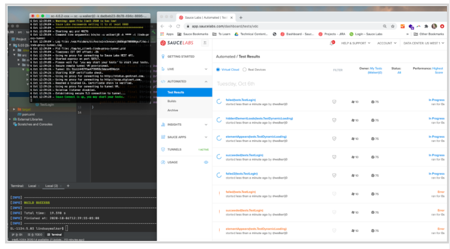
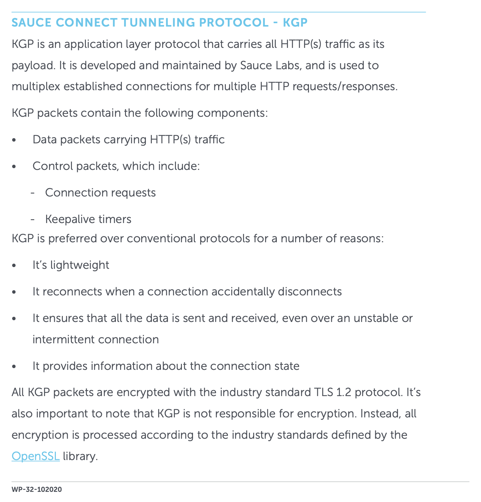
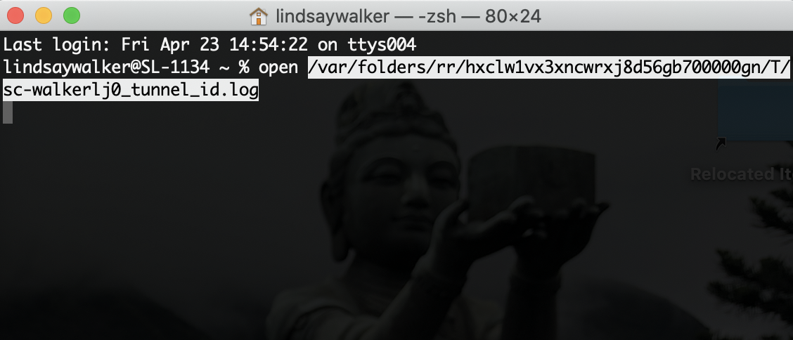

summary: Module 1 of the set of tutorials on Sauce Labs offerings and features.
id: Module1-SauceConnect
categories: beginner
tags: saucetools
environments: Web
status: Draft
feedback link: https://forms.gle/CGu4QchgBxxWnNJK8
analytics account: UA-86110990-1
author: Lindsay Walker, Evelyn Coleman
<!-- ------------------------ -->
# Tutorial 1 – Sauce Connect for Testers

<!-- ------------------------ -->
## 1.01 What You'll Learn
Duration: 0:01:00

This tutorial gives examples you can follow along with using a test suite written in Java, using the JUnit4 test runner, as well as the Maven build tool. If you would like to follow along, you can [download or fork and clone this project](https://github.com/walkerlj0/Selenium_Course_Example_Code)
* Look in the _/java/Mod4/4.06_ directory, and use the version of the test suite **in 4.06** to work from.
* If you don't have Java and Maven set up on your machine to run test code, [follow this lesson](https://training.saucelabs.com/codelabs/Module1-SeleniumJava/index.html?index=..%2F..SeleniumJava#4).

### In This Tutorial
* Learn to download, setup,  and run the Sauce Connect software on your machine
* Learn to modify Java with JUnit4 test code to run automated tests on Sauce Labs using the secure Sauce Connect Proxy Tunnel
  * See how to add the tunnel name in your capabilities or configuration file
* Run a tunnel with common flags such as:
  * `-v` for verbose logging
  * `-i` for a tunnel identifier
* Locate the log file & interpret the results
* Configure a domain for special flags such as SSL Bumping


<!-- ------------------------ -->
## 1.02 Setup and Run Sauce Connect Proxy

[Sauce Connect Proxy](https://wiki.saucelabs.com/display/DOCS/Sauce+Connect+Proxy#:~:text=Sauce%20Connect%20Proxy%E2%84%A2%20is,or%20behind%20a%20corporate%20firewall.) is software that enables you to establish a secure connection between applications hosted on an internal server and the Sauce Labs virtual machines (such as Jenkins) or real devices that are used for testing.

#### Video
[Set Up Sauce Connect Proxy](https://youtu.be/cpBcGeZ_wQU)

<video id="cpBcGeZ_wQU"></video>

In many cases, testers need to run their tests on internal sites. These can be dev/staging versions of their production site or actual internal sites only employees use. In either case, these sites are not available out in the open internet for sauce to access.

The option shown here is using Sauce Connect Proxy which uses a proprietary [TLS protocol](https://www.cloudflare.com/learning/ssl/transport-layer-security-tls/) to encrypt traffic between Sauce Labs and your network and servers. [Learn more about Sauce Connect in the whitepaper](https://saucelabs.com/resources/white-papers/sauce-connect-proxy-security-overview).  


### Download Sauce Connect Proxy

The first step is to download The Sauce Connect Proxy software -- available on the **[Sauce Connect Proxy](https://docs.saucelabs.com/secure-connections/index.html)** page in the Sauce Labs Docs -- and extract the contents of the **.zip** or **.gz** download package. You can also get the software on the [Sauce Labs](https://accounts.saucelabs.com/am/XUI/#login/?utm_source=referral&utm_medium=LMS&utm_campaign=link) platform under **Tunnels.**


Once you’ve extracted the contents, take the Sauce Connect Proxy folder and move it into another directory. In this example, the Sauce Connect software has been moved into the **Documents** folder.


### Set Sauce Labs Environment Variables
You will need to have environment variables set for Sauce Labs on your local machine or CI tool in order to run your tests.

 Watch [this video](https://drive.google.com/file/d/1qezKtvBpn94bBTJgbAd2MSx4ByNx7oaz/view?usp=sharing) to learn how to set up environment variables with your Sauce Labs credentials on a Mac, or view the [instructions for Windows](https://docs.google.com/document/d/1Cb27j6hgau5JHmAxGHPihd3V4Og3autPCei82_m1Ae8/edit?usp=sharing).

### Start The Tunnel

Go to the **Tunnels** tab in the Sauce Labs app.


You can copy the command that you will find at the bottom of the **Tunnels** page, and paste this into your terminal as well, instead of typing what is above. Once you paste, append the command line with `-i <Sauce tunnel name>`. In this example, I’ve called mine `linds-proxy-tunnel.`


Your command should look like this:


Navigate to the folder using the terminal where you saved the Sauce Connect download (this one is in **Documents/sc-4.6.2-osx**). Next, type and run the command below. Make sure to fill in your credentials (username after the `-u` command and access key after` -k`) and add your tunnel name (aka tunnel identifier) after the `-i `command. Hit enter and you should see your tunnel up and running.


```
bin/ sc -u <SAUCE_USERNAME> -k <SAUCE_ACCESS_KEY> -i <SAUCE_TUNNEL_NAME>
```
### Stop the Tunnel

You can stop any tunnel that you have running by hitting `cntrl` + `c`
* Once will stop the tunnel after your tests have finished running
* Hitting it twice will stop all tunnels & tests immediately


 Learn more about the other commands you can use to configure your tunnel at [Sauce Connect Proxy Command-Line Quick Reference Guide](https://docs.saucelabs.com/dev/cli/sauce-connect-proxy/index.html#sauce-connect-proxy-command-line-options).


#### Note
Negative
: If you have trouble running your tunnel, you may need to update your firewall settings to [allow outbound traffic on port 443](https://docs.saucelabs.com/secure-connections/sauce-connect/faq/index.html#what-outbound-ports-do-i-need-open-for-sauce-connect-proxy) or configure Sauce Connect Proxy with a proxy that can reach the `saucelabs.com` domain, using the --proxy or --pac command line options

### Shared Tunnels

 Many companies may also choose to have their organization set up _Shared Tunnels_ on Sauce Labs, which anyone in their organization can use without having to worry about configuring their own tunnel.

 To use a shared tunnel simply check the **Tunnels** tab on your Sauce Labs app to see your shared tunnels you have access to. You should be able to see the shared tunnel name, the name of the owner of the tunnel as well, as an indication that it is a shared tunnel, then use the `tunnelIdenifier` and the `parentTunnel` in your test suites' capabilities:

 

 


<!-- ------------------------ -->
## 1.03 Run a Java Test Using Sauce Connect Proxy
This video is intended to show an example for how to update your test capabilities, using [this example test written](https://github.com/walkerlj0/Selenium_Course_Example_Code/tree/master/java/Mod4/4.06) in Java, JUnit4, with Maven and InteliiJ. Basically, in this lesson you will:
* Start your tunnel (you should see the message Sauce Connect is up in terminal
* Update your `config.java` and `BaseTest.java` files
* Run the updated test code in Sauce Labs using Sauce Connect Proxy.

#### Video
[Run a Test with Sauce Connect Proxy](https://youtu.be/8ZJWuIWz1Q0)

<video id="8ZJWuIWz1Q0"></video>

#### Note
Negative
: Make sure your  `.bash_profile` (or `.zshrc`) has the `SAUCE_TUNNEL` environment variable (it must match the tunnel name you used to start the tunnel). 

### Set Sauce Connect Tunnel Capabilities
This example shows how to set the capabilities in an example Java Test Suite, written with the JUnit4 test runner, and run and managed using Maven. [See the example suite this is created from](https://github.com/walkerlj0/Selenium_Course_Example_Code/tree/master/java/Mod5/5.03).


#### Update Test Code
This test is importing environment variables in the _tests/Config.java_ file, using the`SAUCE_USERNAME `and` SAUCE_ACCESS_KEY` you have set up on your machine or CI tool. You will set up an environment variable for your `SAUCE_TUNNEL` evnvironment variable as well. This variable will store the tunnel identifier, so after you start up a Sauce Connect tunnel, you can run your tests using it.

Add the variable `sauceTunnel `in your `Config.java` file, at the bottom of the list of variables:


```
// filename: tests/Config.java
//...
    public static final String sauceTunnel = System.getenv("SAUCE_TUNNEL");
}

```


Next, in `BaseTest.Java`, you are going to add in a third, `else if `statement that accounts for when you are running a test with Sauce Connect. It’s almost exactly the same as the case when the host is` "saucelabs"` except you will be adding in the Sauce Option for the tunnel


```
// filename: tests/BaseTest.java
// ...
else if (host.equals("saucelabs-tunnel")) {
    MutableCapabilities sauceOptions = new MutableCapabilities();
    sauceOptions.setCapability("username", sauceUser);
    sauceOptions.setCapability("accessKey", sauceKey);
    sauceOptions.setCapability("name", testName);
    sauceOptions.setCapability("tunnelIdentifier", sauceTunnel);
    MutableCapabilities capabilities = new MutableCapabilities();
    capabilities.setCapability("browserName", browserName);
    capabilities.setCapability("browserVersion", browserVersion);
    capabilities.setCapability("platformName", platformName);
    capabilities.setCapability("sauce:options", sauceOptions);
    String sauceUrl = String.format("https://ondemand.saucelabs.com/wd/hub");
    driver = new RemoteWebDriver(new URL(sauceUrl), capabilities);
    sessionId = ((RemoteWebDriver) driver).getSessionId().toString();
    sauceClient = new SauceREST(sauceUser, sauceKey, DataCenter.US);
}

// ...
```


In this case, which you have named `saucelabs-tunnel`, when you run your test, you will set all the capabilities you did before, but notice how the `sauceTunnel` variable is being used by `setCapabilities`, right under where you set the `testName` capability. The reason that we need to create a whole new case is that the tests will error if they are given a tunnel identifier, and it is not used.


### Run Your Tests

You will want to restart your terminal and run `source ~/.bash_profile` so your machine looks for the new `SAUCE_TUNNEL` variable.  

Now try running the command in terminal:


```
mvn clean test -Dhost=saucelabs-tunnel
```





### Note

Negative
: You can also go to `Config.java`, change the host to `saucelabs-tunnel` instead of using the `-Dhost=` flag and just run  `mvn clean test` :

```
// filename: tests/Config.java
// ...
   public static final String host = System.getProperty("host", "saucelabs-tunnel");
// ...
```


You will run your test through the tunnel, and when you log into the SauceLabs UI, you should see the tests being run, and that there is an active tunnel:


You can see example code for this lesson [here.](https://github.com/walkerlj0/Selenium_Course_Example_Code/tree/master/java/Mod5/5.03)


#### Sauce Connect Architecture
To learn more about what is happening when you use Sauce Connect tunnel, see the documentation about how network traffic flows through a [Sauce Connect Tunnel](https://docs.saucelabs.com/secure-connections/sauce-connect/setup-configuration/basic-setup#sauce-connect-communication-when-test-is-running)

### Final Code


<!-- ------------------------ -->
## 1.04 Troubleshooting Sauce Connect
Duration: 0:05:00

The first thing you may need to do is check that the machine where you installed the Sauce Connect proxy will allow you to access to Sauce Labs.

For example, if you installed Sauce Connect on a virtual machine that has a firewall or is in a DMZ, you may have issues communicating with Sauce Labs.

### Common Tunnel Issues
When you have issues with starting a tunnel, and you have verified a firewall isn't an issue, there are several reasons that you might see an error like this:


#### Check Network Connectivity
One of the most common problems that users have with connecting to a Sauce Connect Proxy tunnel is that their own firewall settings are preventing communication. If you are unable to start a tunnel, try checking whether you can communicate with saucelabs.com and the app you are testing.

#### Check Communication With Sauce Connect
From the machine you wish to run the Sauce Connect proxy from, use `ping` to check that you machine can communicate with Sauce Connect:
```
ping saucelabs.com
```


_[See other commands you can use](https://wiki.saucelabs.com/display/DOCS/Sauce+Connect+Proxy+Troubleshooting)_

#### Check Communication With App Under Test
From the machine you wish to run the Sauce Connect proxy from, you also want to check and make sure you can communicate with the application you are testing against. Again, use `ping` to check that your machine can communicate with the example site (like saucedemo.com)
```
ping saucedemo.com
```


Logically, if the environment your tests are on cannot communicate with both of these, then your tests will not work. If the testing connection fails, your terminal should return a message such as:
 ```
 cannot resolve thisshouldntwork.saucelabs.com: Unknown host
 ```

 Some other options for troubleshooting include:
 * Try accessing SauceLabs from your own (local) machine
 * Turn your VPN on (or off)
 * If these don't surface issues, talk to your network administrators about
    * Allowing outbound traffic on port 443
    * Allowing you access to `*saucelabs.com`
    * Allowing you access to the app you are testing
    * Making sure Sauce Labs' KGP protocol isn't causing issues with HTTP traffic

Negative
: **More About the KGP Protocol** 


#### Wrong Username or Access Key
If you are using the wrong `SAUCE_USERNAME` or `SAUCE_ACCESS_KEY`. Check that your environment variables are named correctly, and that you haven't regenerated your access key.


#### Tunnel Collision
Sometimes more than one tunnel is created with the same name, which is known as a 'collision'. What will likely happen is that the first tunnel will stop running, and the new one will start up with the same name


#### Generate Logs
If you are having issues with your Sauce Connect Tunnel, you know your network connection is not the issue, and you have tried all of the above, generating logs as described in the next lesson.


<!-- ------------------------ -->
## 1.05 Sauce Connect Options
Duration: 0:05:00

There are a [lot of different options](https://docs.saucelabs.com/dev/cli/sauce-connect-proxy/index.html#sauce-connect-proxy-command-line-options) you can use to change the settings and options for your Sauce Connect Tunnel. This lesson will cover the most commonly use options for a typical user.

### Generate Verbose Logs
If you are having trouble running your tests, and were not able to get it working with troubleshooting in the previous lessons, verbose logs will provide mode information that can help give you hints as to what is going wrong.

To generate a verbose log, try to start your tunnel adding in the `-v` flag for verbose logging:

```
bin/ sc -u your-username -k your-accesskey -i your-tunnelname -v
```
When the CLI outputs information about your sauce tunnel, you will see a file location for your logs:

 

Thi log will genreate a temporary file, which you can `open` with your terminal (cut and paste the log file location):

 


<!-- ------------------------ -->
## Section X
Duration: 0:05:00
