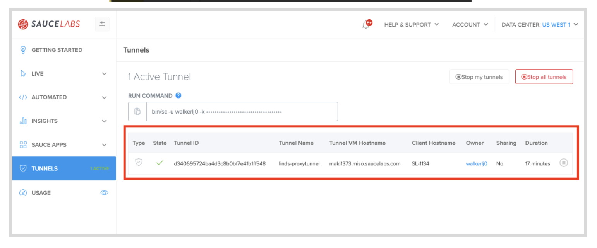
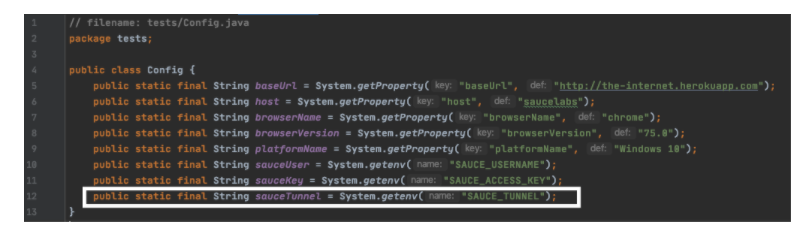
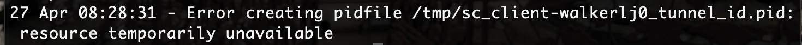

summary: Module 1 of the set of tutorials on Sauce Labs offerings and features.
id: Module1-SauceConnect
categories: intermediate
tags: saucetools
environments: Web
status: Draft
feedback link: https://forms.gle/CGu4QchgBxxWnNJK8
analytics account: UA-86110990-1
author: Lindsay Walker, Evelyn Coleman
<!-- ------------------------ -->
# Tutorial 1 – Sauce Connect for Testers

<!-- ------------------------ -->
## 1.01 What You'll Learn
Duration: 0:01:00

This tutorial gives examples you can follow along with using a test suite written in Java, using the JUnit4 test runner, as well as the Maven build tool. If you would like to follow along, you can [download or fork and clone this project](https://github.com/walkerlj0/Selenium_Course_Example_Code)
* Look in the _/java/Mod4/4.06_ directory, and use the version of the test suite **in 4.06** to work from.
* If you don't have Java and Maven set up on your machine to run test code, [follow this lesson](https://training.saucelabs.com/codelabs/Module1-SeleniumJava/index.html?index=..%2F..SeleniumJava#4).

### In This Tutorial
* Learn to download, setup,  and run the Sauce Connect software on your machine
* Learn to modify Java with JUnit4 test code to run automated tests on Sauce Labs using the secure Sauce Connect Proxy Tunnel
  * See how to add the tunnel name in your capabilities or configuration file
* Run a tunnel with common flags such as:
  * `-v` for verbose logging
  * `--version` to check Sauce Connect version
  * `-i` for a tunnel identifier (name)
* Locate and change the directory of the log file
* Specify which data center you want to run Sauce Connect with
* Disable SSL Bumping

To find out more about Sauce Connect and the architecture, [see the whitepaper](https://saucelabs.com/resources/white-papers/sauce-connect-proxy-security-overview).

<!-- ------------------------ -->
## 1.02 Setup and Run Sauce Connect Proxy

[Sauce Connect Proxy](https://wiki.saucelabs.com/display/DOCS/Sauce+Connect+Proxy#:~:text=Sauce%20Connect%20Proxy%E2%84%A2%20is,or%20behind%20a%20corporate%20firewall.) is software that enables you to establish a secure connection between applications hosted on an internal server and the Sauce Labs virtual machines or real devices that are used for testing. In this lesson you will learn to:
* Download and start a proxy tunnel
* Stop a running proxy tunnel
* Understand how shared tunnels are used
* Learn how to do a Manual (Live) test with Sauce Connect

#### Video
[Set Up Sauce Connect Proxy](https://youtu.be/cpBcGeZ_wQU)

<video id="cpBcGeZ_wQU"></video>

In many cases, testers need to run their tests on internal sites. These can be dev/staging versions of their production site or actual internal sites only employees use. In either case, these sites are not available out in the open internet for sauce to access.

The option shown here is using Sauce Connect Proxy which uses a proprietary [TLS protocol](https://www.cloudflare.com/learning/ssl/transport-layer-security-tls/) to encrypt traffic between Sauce Labs and your network and servers. [Learn more about Sauce Connect in the whitepaper](https://saucelabs.com/resources/white-papers/sauce-connect-proxy-security-overview).  


### Download Sauce Connect Proxy

The first step is to download The Sauce Connect Proxy software -- available on the **[Sauce Connect Proxy](https://docs.saucelabs.com/secure-connections/index.html)** page in the Sauce Labs Docs -- and extract the contents of the **.zip** or **.gz** download package. You can also get the software on the [Sauce Labs](https://accounts.saucelabs.com/am/XUI/#login/?utm_source=referral&utm_medium=LMS&utm_campaign=link) platform under **Tunnels.**


Once you’ve extracted the contents, take the Sauce Connect Proxy folder and move it into another directory. In this example, the Sauce Connect software has been moved into the **Documents** folder.


### Set Sauce Labs Environment Variables
You will need to have environment variables set for Sauce Labs on your local machine or CI tool in order to run your tests.

 Watch [this video](https://drive.google.com/file/d/1qezKtvBpn94bBTJgbAd2MSx4ByNx7oaz/view?usp=sharing) to learn how to set up environment variables with your Sauce Labs credentials on a Mac, or view the [instructions for Windows](https://docs.google.com/document/d/1Cb27j6hgau5JHmAxGHPihd3V4Og3autPCei82_m1Ae8/edit?usp=sharing).

### Start The Tunnel

Sauce Connect Tunnels are initiated from the client side to allow applications behind a firewall to communicate and test on the Sauce Labs Cloud. Start by going to the **Tunnels** tab in the Sauce Labs app.


You can copy the command that you will find at the bottom of the **Tunnels** page, and paste this into your terminal as well, instead of typing what is above. Once you paste, append the command line with `-i <Sauce tunnel name>`. In this example, I’ve called mine `linds-proxy-tunnel.`


Your command should look like this:


Navigate to the folder using the terminal where you saved the Sauce Connect download (this one is in **Documents/sc-4.6.2-osx**). Next, type and run the command below. Make sure to fill in your credentials (username after the `-u` command and access key after` -k`) and add your tunnel name (aka tunnel identifier) after the `-i `command. Hit enter and you should see your tunnel up and running.

```
bin/ sc -u <SAUCE_USERNAME> -k <SAUCE_ACCESS_KEY> -i <SAUCE_TUNNEL_NAME>
```

You should see the output in the terminal, lett you know Sauce Connect Proxy is up and running:


### Stop the Tunnel

You can stop any tunnel that you have running by hitting `cntrl` + `c`
* Once will stop the tunnel after your tests have finished running
* Hitting it twice will stop all tunnels & tests immediately


 Learn more about the other commands you can use to configure your tunnel at [Sauce Connect Proxy Command-Line Quick Reference Guide](https://docs.saucelabs.com/dev/cli/sauce-connect-proxy/index.html#sauce-connect-proxy-command-line-options).




#### Note
Negative
: If you have trouble running your tunnel, you may need to update your firewall settings to [allow outbound traffic on port 443](https://docs.saucelabs.com/secure-connections/sauce-connect/faq/index.html#what-outbound-ports-do-i-need-open-for-sauce-connect-proxy) or configure Sauce Connect Proxy with a proxy that can reach the `saucelabs.com` domain, using the --proxy or --pac command line options

### Live (Manual) Tests with Sauce Connect
You can easily run any manual tests that you do with Sauce Connect proxy. Simply go to the **Live**, **Cross Browser** testing dashboard, and choose to use any proxy tunnel that is available to you for your manual tests.


<!-- ------------------------ -->
## 1.03 Run a Java Test Using Sauce Connect Proxy
This video is intended to show an example for how to update your test capabilities, using [this example test written](https://github.com/walkerlj0/Selenium_Course_Example_Code/tree/master/java/Mod4/4.06) in Java, JUnit4, with Maven and InteliiJ. Basically, in this lesson you will:
* Start your tunnel
* Update Sauce Environment Variables
* Update your `config.java` and `BaseTest.java` files
* Run the updated test code in Sauce Labs using Sauce Connect Proxy.

#### Video
[Run a Test with Sauce Connect Proxy](https://youtu.be/u1kijdRTSv8)

<video id="u1kijdRTSv8"></video>

### Start Your Tunnel
Navigate in terminal to the location where you saved the `sc-x.x.x-osx` file, then run the command that you copied from the **Tunnels** tab in the saucelabs dashboards

```
bin/sc -u your-username -k ******************** -i your_tunnel_id
```

#### Note
Negative
: Make sure your  `.bash_profile` (or `.zshrc`) has the `SAUCE_TUNNEL` environment variable (it must match the tunnel name you used to start the tunnel). 

### Set Sauce Connect Tunnel Capabilities
This example shows how to set the capabilities in an example Java Test Suite, written with the JUnit4 test runner, and run and managed using Maven. [See the example suite this is created from](https://github.com/walkerlj0/Selenium_Course_Example_Code/tree/master/java/Mod5/5.03).


### Update Test Code
This test is importing environment variables in the _tests/Config.java_ file, using the`SAUCE_USERNAME `and` SAUCE_ACCESS_KEY` you have set up on your machine or CI tool. You will set up an environment variable for your `SAUCE_TUNNEL` evnvironment variable as well. This variable will store the tunnel identifier, so after you start up a Sauce Connect tunnel, you can run your tests using it.

Add the variable `sauceTunnel `in your `Config.java` file, at the bottom of the list of variables:


```
// filename: tests/Config.java
//...
    public static final String sauceTunnel = System.getenv("SAUCE_TUNNEL");
}

```


Next, in `BaseTest.Java`, you are going to add in a third, `else if `statement that accounts for when you are running a test with Sauce Connect. It’s almost exactly the same as the case when the host is` "saucelabs"` except you will be adding in the Sauce Option for the tunnel


```
// filename: tests/BaseTest.java
// ...
else if (host.equals("saucelabs-tunnel")) {
    MutableCapabilities sauceOptions = new MutableCapabilities();
    sauceOptions.setCapability("username", sauceUser);
    sauceOptions.setCapability("accessKey", sauceKey);
    sauceOptions.setCapability("name", testName);
    sauceOptions.setCapability("tunnelIdentifier", sauceTunnel);
    MutableCapabilities capabilities = new MutableCapabilities();
    capabilities.setCapability("browserName", browserName);
    capabilities.setCapability("browserVersion", browserVersion);
    capabilities.setCapability("platformName", platformName);
    capabilities.setCapability("sauce:options", sauceOptions);
    String sauceUrl = String.format("https://ondemand.saucelabs.com/wd/hub");
    driver = new RemoteWebDriver(new URL(sauceUrl), capabilities);
    sessionId = ((RemoteWebDriver) driver).getSessionId().toString();
    sauceClient = new SauceREST(sauceUser, sauceKey, DataCenter.US);
}

// ...
```


In this case, which you have named `saucelabs-tunnel`, when you run your test, you will set all the capabilities you did before, but notice how the `sauceTunnel` variable is being used by `setCapabilities`, right under where you set the `testName` capability. The reason that we need to create a whole new case is that the tests will error if they are given a tunnel identifier, and it is not used.


### Run Your Tests

You will want to restart your terminal and run `source ~/.bash_profile` so your machine looks for the new `SAUCE_TUNNEL` variable.  

Now try running the command in terminal:


```
mvn clean test -Dhost=saucelabs-tunnel
```


### Note

Negative
: You can also go to `Config.java`, change the host to `saucelabs-tunnel` instead of using the `-Dhost=` flag and just run  `mvn clean test`: 


You will run your test through the tunnel, and when you log into the SauceLabs UI, you should see the tests being run, and that there is an active tunnel:


You can see example code for this lesson [here.](https://github.com/walkerlj0/Selenium_Course_Example_Code/tree/master/java/Mod5/5.03)


#### Sauce Connect Architecture
To learn more about what is happening when you use Sauce Connect tunnel, see the documentation about how network traffic flows through a [Sauce Connect Tunnel](https://docs.saucelabs.com/secure-connections/sauce-connect/setup-configuration/basic-setup#sauce-connect-communication-when-test-is-running)

### Shared Tunnels

 Many companies may also choose to have their organization set up _Shared Tunnels_ on Sauce Labs, which anyone in their organization can use without having to worry about configuring their own tunnel.

 To use a shared tunnel simply check the **Tunnels** tab on your Sauce Labs app to see your shared tunnels you have access to. You should be able to see the shared tunnel name, the name of the owner of the tunnel as well, as an indication that it is a shared tunnel, then use the `tunnelIdenifier` and the `parentTunnel` in your test suites' capabilities:

 

 

### Final Code





<!-- ------------------------ -->
## 1.04 Troubleshooting Sauce Connect
Duration: 0:05:00

This lesson will walk you through the basic things you will need to do if you are having issues connecting and running a Sauce Connect Proxy Tunnel. These steps include:
* Checking to see if your network allows you to communicate with both Sauce Labs and the App under test
* Double-checking that your Sauce Username and Access Key
* Making sure you don't have colliding tunnels

#### Video
[User Troubleshooting with Sauce Connect](https://youtu.be/Jx6ED1dNJEA)

<video id="Jx6ED1dNJEA"></video>

### Find Out About Your Network
The first thing you may need to do is check that the machine where you installed the Sauce Connect proxy will allow you to access Sauce Labs and your app. For example, if you installed Sauce Connect on a virtual machine that has a firewall or is in a DMZ, you may have issues communicating.

If you are unable to start a tunnel, try checking whether you can communicate with saucelabs.com and the app you are testing.

#### Check Communication With Sauce Connect
From the machine you wish to run the Sauce Connect proxy from, use `ping` to check that you machine can communicate with Sauce Labs Server:
```
ping saucelabs.com
```


_[See other commands you can use](https://wiki.saucelabs.com/display/DOCS/Sauce+Connect+Proxy+Troubleshooting)_

#### Check Communication With App Under Test
From the machine you wish to run the Sauce Connect proxy from, you also want to check and make sure you can communicate with the application you are testing against. Again, use `ping` to check that your machine can communicate with the example site (like [saucedemo.com](https://www.saucedemo.com/))
```
ping saucedemo.com
```


Logically, if the environment your tests are on cannot communicate with both of these, then your tests will not work. If the testing connection fails, your terminal should return a message such as:
 ```
 cannot resolve thisshouldntwork.saucelabs.com: Unknown host
 ```

 Some other options for troubleshooting include:
 * Try accessing SauceLabs from your own (local) machine
 * Turn your VPN on (or off)
 * If these don't surface issues, talk to your network administrators about
    * Allowing outbound traffic on port 443
    * Allowing you access to `*saucelabs.com`
    * Allowing you access to the app you are testing
    * Making sure Sauce Labs' KGP protocol isn't causing issues with HTTP traffic

Negative
: **More About the KGP Protocol** 

### Other Common Tunnel Issues
When you have issues with starting a tunnel, and you have verified a firewall isn't an issue, there are several reasons that you might see an error like this:


#### Wrong Username or Access Key
If you are using the wrong `SAUCE_USERNAME` or `SAUCE_ACCESS_KEY`. Check that your environment variables are named correctly, and that you haven't regenerated your access key.


#### Tunnel Collision
Sometimes more than one tunnel is created with the same name, which is known as a 'collision'. What will likely happen is that the first tunnel will stop running, and the new one will start up with the same name. You will get an error like this:



This is an error creating the process id file (pidfile) which should be unique to each tunnel, but cannot be created if there are two tunnels running with the same name


#### Generate Logs
If you are having issues with your Sauce Connect Tunnel, you know your network connection is not the issue, and you have tried all of the above, generating logs as described in the next lesson.


<!-- ------------------------ -->
## 1.05 Sauce Connect Options
Duration: 0:05:00

There are a many options you can use to change the settings and options for your Sauce Connect Tunnel. This lesson will cover the most commonly needed options for a typical user. In this lesson you will learn to:

* Check which version of Sauce Connect you are running
* Generate a log file to get more information to send to [Sauce Labs Support](https://support.saucelabs.com/hc/en-us)
* Generate a log file in a specified location
* Run Sauce Connect Proxy with a specific Sauce Labs Data Center


You can find all the flags that you can use when running Sauce Connect in the [Sauce Connect CLI documentation](https://docs.saucelabs.com/dev/cli/sauce-connect-proxy)

#### Video
[Sauce Connect Options](https://youtu.be/D7pfJfHe29k)

<video id="D7pfJfHe29k"></video>

### Check Your Sauce Connect Version
Sometimes it's important to see if you have the most up to date [version of Sauce Connect](https://docs.saucelabs.com/secure-connections/sauce-connect/installation/index.html#downloading-sauce-connect-proxy) so you can use the latest features & functionality using the sauce connect `--version` flag:

```
bin/ sc -u your-username -k your-accesskey -i your-tunnelname --version
```
#### Note
Negative
: If you use the `--version` flag with your tunnel, it will print out the information, then immediately exit, so you will have to start your tunnel again to use it.

### Generate Verbose Logs
If you are having trouble running your tests, and were not able to get it working with troubleshooting in the previous lessons, verbose logs will provide mode information that can help give you hints as to what is going wrong.

To generate a verbose log, try to start your tunnel adding in the `-v` flag for verbose logging:

```
bin/ sc -u your-username -k your-accesskey -i your-tunnelname -v
```
When the CLI outputs information about your sauce tunnel, you will see a file location for your logs:

 

Thi log will genrate a temporary file, which you can `open` with your terminal (cut and paste the log file location):

 

 Most often this file will be used to sent to [Sauce Labs Support](https://support.saucelabs.com/hc/en-us) (or email help@saucelabs.com) so they can help you troubleshoot your issues.

### Output Your Log Files to a Certain Location.
If you want to dictate where log files will be stored, yoiu can add the flag `--logfile /filepath/to/logs` to the command when you run Sauce Connect.

For example, if you created a directory called _logfiles_ in your _Documents_ folder to store your files, start Sauce Connect and create a new log called `log1` in that directory.

```
bin/ sc -u your-username -k your-accesskey -i your-tunnelname -v --logfile ../logfiles/logfile-name
```
and if you check you should see *Documents/logfiles/log1*.

 


### Specify the Sauce Data Center
Depending which data center (*us-west-1*, *eu-central-1*, etc.) you are running your tests in, you may want to change which data center your tunnel is running through (default *us-west-1*). [See the list of Sauce Connect endpoints](https://wiki.saucelabs.com/display/DOCS/Data+Center+Endpoints#DataCenterEndpoints-EUDataCenter)

Simply add a flag for the [data center endpoint](https://docs.saucelabs.com/dev/cli/sauce-connect-proxy#data-center-endpoint) like `-x https://data-center-1.saucelabs.com/rest/v1` when you launch your tunnel:

```
bin/ sc -u your-username -k your-accesskey -i your-tunnelname -x https://eu-central-1.saucelabs.com/rest/v1
```
 

<!-- ------------------------ -->
## 1.06 SSL Bumping
Duration: 0:05:00

### SSL Bumping

When users communicate with applications over the internet, they use TLS (successor of SSL) protocol to make sure they are communicating securely. One part of this protocol requires that the app the user is communicating with provides a secure 'certificate' to help verify the identity of server it is sending information to.

#### Video
[SSL Bumping with Sauce Connect](https://youtu.be/Bpayic1W514)

<video id="Bpayic1W514"></video>

When developers create and test an app, they typically use self-signed (considered invalid SSL certificates), which are not trusted by stock browsers, such as those installed on the Sauce Labs infrastructure. This means that when you are running Selenium tests, the communication with the browser may be interrupted with security warnings that can't be dismissed by Selenium.

 


When developers test an internal app they are developing, or one used in a staging environment, often they won't have a publicly-signed network certificate for that app, which means that most likely security warning from the browser will cause your tests to fail.

To combat test failures caused by websites without valid SSL/ TSL certificates, Sauce Connect Proxy has a security feature called SSL Bumping that automatically re-signs certificates to allow network traffic, when they are run through a Sauce Connect Tunnel.

### Disable SSL Bumping

If you have a valid certificate for your application, you don't need to use SSL bumping. There are also cases where SSL bumping doesn't help avoid security warnings that will cause tests to fail and you will want to disable it.

To disable SSL bumping, you would want to add the `-B all`, `-B domain1.com, domain2.com` or `--no-ssl-bump-domain.com` flag when you start your tunnel, like so:

```
bin/ sc -u your-username -k your-accesskey -i your-tunnelname -B all
```

#### Situations To Disable SSL Bumping
If you have a certificate that is recognized by Sauce Labs devices, and one of the following is true about your application, you would want to use the `-B all` flag to disable SSL bumping:

* If you are using a WebSocket connection for traffic, which won’t work if the traffic to them has been altered, which Sauce Connects' SSL bumping will do.
* With certain types of self-signed Android tests that don't check the system's list of trusted TLS certificates.
  * If you are testing with Android Version 7 & up on Sauce Labs Emulators (you need to [add a self-signed network cert](https://support.saucelabs.com/hc/en-us/articles/360005488513-Unable-to-Connect-to-https-Site-with-Sauce-Connect-and-Android-7-0-on-Native-Applications) into the app code)
  * If you are testing a native app on Android in the Real Device Cloud (you need to [add a self-signed network cert](https://support.saucelabs.com/hc/en-us/articles/360005488513-Unable-to-Connect-to-https-Site-with-Sauce-Connect-and-Android-7-0-on-Native-Applications) into the app code)
  * Any time you are testing a web app on the Real Device Cloud (cannot be tested with a non-valid cert)

<!--
### Errors with CORS-Enabled Sites
[Cross-Origin Resource Sharing (CORS)](https://wiki.saucelabs.com/display/DOCS/Sauce+Connect+Proxy+Troubleshooting ) errors could be caused by a variety of reasons. We recommend the following solutions:

//what is CORS?

Make sure that the ulimit/open file limit of your machine is at least 8000, which is the recommend value for Sauce Connect Proxy use
// How is this done
Start a Sauce Connect Proxy instance using the -B all and -N flags. For more information about what these flags do for your tunnel, please see Sauce Connect Proxy Command-Line Quick Reference Guide. -->
<!-- ------------------------ -->
## 1.07 Quiz
Duration: 0:05:00


<!--
1. Which of the following is NOT a use case for Sauce Connect Proxy?
a. You would like to run tests on an app hosted on a local machine that is behind a firewall on the Sauce Labs Real Device Cloud
b. You would like to run tests on a publicly hosted app on the Sauce Labs Real Deice Cloud *
c. You would like to run tests on an app hosted on a local machine that is behind a firewall on the Sauce Labs Cloud of Virtual Machines
d. You would like to do a manual (live) test of an app that is hosted on a secure server.

*Sauce Connect is useful for testing apps that are hosted on a secure server (behind a firewall) with the Sauce Labs Cloud of Virtual Machines, Real Device Cloud. This is true for both automated app tests and manual app tests, but it isn't always necessary, especially if you are testing against a publicly hosted app

2. Which of the following is the capability you have to updated in your test code specifically to run your tests through a shared tunnel?
a. The sharedTunnel capability
b. The platformName capability
c. The tunnelIdentifier capability
d. The parentTunnel capability

*The name for the capability for running through a shared (aka 'parent') tunnel is the parentTunnel capability. Though you will also have to set the platformName and tunnelIdentifier capabilities to run your tests on Sauce Labs, that parentTunnel capability is the one required for shared tunnels specifically.

3. Which of the following are a good basic set of things to check when troubleshooting Sauce Connect Tunnel issues?
a. That your Username and Access Key are correct, and that you are able to communicate with both your app and Sauce Labs *
b. That your capabilities haven't changed, and that you are able to communicate with both your app and Sauce Labs
c. That your Username and Access Key are correct, and that you have set the flag to avoid colliding tunnels.
d. That you have set the flag to avoid colliding tunnels, and that you are able to communicate with both your app and Sauce Labs

* Though capabilities may be an issue, usually those things would be found if you run your tests locally. It is also an option to add a flag to avoid tunnel collision, however the most common issues are an inability for your tests to communicate with your app as well as Sauce Labs, and issues with your Username and Access Key (the latter of which can be regenerated & changed)

4. Which of the following is a reason you may want to disable SSL bumping with Sauce Connect Proxy?
a. You are not using a TLS protocol to send your traffic
b. Your app is hosted in a secure environment such as a DMZ or behind a firewall
c. You are using a HTTPS connection for network traffic
d. You are testing a native Android app, and have already added a certificate. *

* All traffic, whether over HTTPs or websockets should use a TLS protocol, and the whole point of Sauce Connect is to test secured apps. HTTPS traffic typically works well with Sauce Connects' SSL bumping, but there are many cases when testing Native Android apps that you may want to disable SSL bumping.

-->
