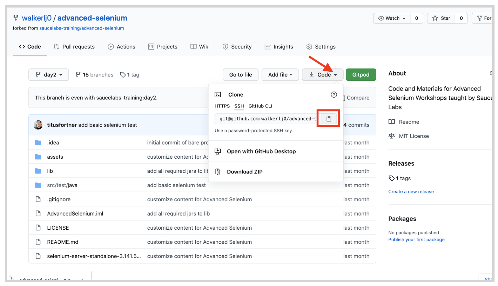

summary: In this first Module, you will set up a basic test using Sauce Bindings, Java, JUnitx and
id: Module1-Selenium4
categories: selenium4
tags: advancedjava  
environments: Web
status: Draft
feedback link: https://forms.gle/CGu4QchgBxxWnNJK8
author:Lindsay Walker
<!-- ------------------------ -->
# Module 1 – Advanced Selenium with Java

<!-- ------------------------ -->
## 1.01 What You'll Learn
Duration: 0:01:00

In this module...

<!-- ------------------------ -->
## 1.02 Quality and Continuous Testing
Duration: 002:00

<!-- ### Manual to Automated Testing

Manual testing involves taking the click-and-check that a manual tester would do in one environment at a time, and automating it with test automation code. By using automation, we no longer rely on a human to test every single situation- You can run these tests at all times of the day.

In addition, with a well designed automation suite, you can start running tests in parallel, running several tests at the same time, and even run tests on multiple browsers and devices simultaneously.

A well designed testing solution can also test at different points in the testing cycle (not just when a product is about to be pushed into production) to find issues earlier and make debugging easier.


### Challenges and Drawbacks

Finding good test automation engineers, or training manual testers is a difficult process. Some developers may be able to write their own tests, however scaling these up to a solution that does a good job of testing an application in its entirety requires a skilled test engineer.

There are hundreds of different combinations of tools, frameworks, and libraries to do this with, and understand the capabilities and limitations of each is a challenge itself.

In addition, understanding the differences between what a human can test, and how to write instructions in test code in a way so computers can run a test requires a shift in understanding, and careful structuring and designing of a testing framework. A well designed framework uses abstraction and sophisticated programming methods, and takes into account that a computer cannot adapt to new conditions the way that a human could.


_Source:_ _[Alexy Litvinenko](https://www.dreamstime.com/sonar512_info)_


### Continuous Testing

Continuous testing is a shift-left journey towards earlier and more frequent testing as well as a shift-right towards testing your product as a whole as new features are committed and merged.


The biggest transition your team will have to make is evolving the frequency of testing, and setting up practices and pipelines that trigger tests to run on a more frequent basis be it running daily tests, testing with every build, or even with every commit. The biggest factor of the maturity of the testing initiative is looking at how frequently tests are run.  

The companies who are early in the path to continuous testing only run their tests at release, perhaps at a scheduled interval. As your path to continuous testing evolves, changes are tested any time a single feature is built, or even with each code commit, using a truly atomic testing suite.

You have to have a reliable testing suite in order to do this kind of testing, as well as a suite well designed to test individual features, that is well named, organized, and created through collaboration across engineering and testing teams.
 -->

<!-- ------------------------ -->
## 1.02 Test Suite Setup
Duration: 0:05:00

This course will guide you through creating a new test suite from a simple starter test


### Install Software

In this module we will walk you through getting the repository of files from Github. In order to have this set up, you should have:
*   A Github account
*   Git installed on your computer
*   A Java SDK ([Version 8 used in this example](https://www.oracle.com/java/technologies/javase/javase-jdk8-downloads.html))
*   An IDE ([IDEA Community Edition](https://www.jetbrains.com/idea/download/))


### Required Dependencies

In order to get your test files set up you should have some basic software already installed. The rest will be provided as `.jar` files as a part of the repository you will download. In this course, we will be using tools included in the IntelliJ IDE to manage which branch of test code you are looking at.

To download the base project, including the set of .jar files with dependencies, visit the **new_base** branch of the advanced-selenium course here: [https://github.com/saucelabs-training/advanced-selenium/tree/new_base](https://github.com/saucelabs-training/advanced-selenium/tree/new_base)


If you are familiar with using GitHub, you can fork the project, then use `git clone <URL to repo>` in the directory you wish to store it.


*   First, login to your Git account and make sure you have it downloaded on your computer. For the easiest workflow, [set up SSH](https://docs.github.com/en/free-pro-team@latest/github/authenticating-to-github/connecting-to-github-with-ssh) so you don’t have to enter your password for many of the git actions.
*   Next, fork the repo to create your own version that you can commit to. Click the icon to fork the branch and place it in your personal account.


*   In Terminal, run the command git clone &lt;your git branch> to create a local version of the repository. Copy the link from the repository you just created.




#### Note
Negative
: If you do not want to work with Git and would instead prefer to simply download the project content, simply download the .zip file wherever you would like to create your project. If you are still using source control, you will need to extract the file, then open it and run `git init` to create a repository to commit to GitHub. 


*  Now, open your project with IntelliJ. Open the IntelliJ IDE, choose **Open **and navigate to where you created your local repository.

You should see a project with the following structure. Ensure that you are on the branch **new_base:**


Next, we will add our first elements for a test that can run both locally, and on Sauce Labs.


### Managing Drivers

There are three ways to manage a test. You can either check the version of the browser that you have on your machine (e.g. Chrome 86) then manually find and install the compatible driver. Doing it this way, you have to create either a Path variable (Option 1) or set the location to this driver in the code and place your driver there (Option 2) You will be using a third option.


```
// Option 1
    // Download Driver & Add to PATH Environment Variable
        for (String a : System.getenv("PATH").split(":"))
            System.out.println(a);

// Option 2
// Download manually and explicitly specify location:
        String location = System.getProperty("user.home") + "/.webdrivers/chromedriver";
        System.setProperty("webdriver.chrome.driver", location)
```


In this example, you are going to use a module called [WebDriver Manager](https://github.com/bonigarcia/webdrivermanager) which takes care of all this for you. Your Selenium Test should start out with the following code:


```
//filename: SeleniumTest
package test.java.com.saucelabs.advancedselenium;

import io.github.bonigarcia.wdm.WebDriverManager;
import org.junit.jupiter.api.Test;
import org.openqa.selenium.chrome.ChromeDriver;
import org.openqa.selenium.remote.RemoteWebDriver;

public class SeleniumTest {

    @Test
    public void openBrowser() {
        // Let WebDriverManager handle drivers
        WebDriverManager.chromedriver().setup();

        // Start session & open browser
        RemoteWebDriver driver = new ChromeDriver();

        // Quit session (closes browser)
        driver.quit();
    }
}

```


Notice the imports at the top. WebDriverManager helps you install and run the correct browser driver for the browser on your machine. It will detect which browser you have on your machine, download the correct driver, and then make sure your tests use that driver to execute tests

Run this first simple test by right clicking the green arrow that appears next to the test name, and selecting **Run ‘openBrowser()''**  in the menu that appears. You should see one test run successfully if you click on the **Run** menu in the bottom menu.


#### Final Code

You can see the code that you should have run passing with one passed test. You can see an example of the project you should have created [in this repo](https://github.com/walkerlj0/Selenium_Course_Example_Code/tree/master/advanced-selenium/Mod1/1.03).

<!-- ------------------------ -->
## 1.04  Run Local & Remote Tests
Duration: 0:04:00

One important and basic thing that you need to be able to learn how to do is to create a test that can run using WebDriver Manager locally, or run on Sauce Labs. First you will need to create a new Java class (right click on the package **test.java.com.saucelabs.advancedselenium** and choose **New > Java Class)** called `SauceLabsTest.java`.


We are going to create a test that will allow you to switch between running locally and running on Sauce Labs, as well as use some features of the Sauce Bindings that will make it easy to set up and configure your tests.


### Create a Test with Sauce Bindings

First, import all the packages we will use with this test, including the JUnit5 classes, and create null `driver` and `session` variables using [RemoteWebDriver](https://www.selenium.dev/documentation/en/remote_webdriver/remote_webdriver_client/) and [SauceSession](https://github.com/saucelabs/sauce_bindings/blob/master/java/src/main/java/com/saucelabs/saucebindings/SauceSession.java):


```
package test.java.com.saucelabs.advancedselenium;

import com.saucelabs.saucebindings.JobVisibility;
import com.saucelabs.saucebindings.SauceOptions;
import com.saucelabs.saucebindings.SauceSession;
import io.github.bonigarcia.wdm.WebDriverManager;
import org.junit.jupiter.api.AfterEach;
import org.junit.jupiter.api.Assertions; //added with test
import org.junit.jupiter.api.BeforeEach;
import org.junit.jupiter.api.Test;
import org.openqa.selenium.By;
import org.openqa.selenium.WebElement;
import org.openqa.selenium.chrome.ChromeDriver;
import org.openqa.selenium.chrome.ChromeOptions;
import org.openqa.selenium.remote.RemoteWebDriver;
import org.openqa.selenium.support.ui.ExpectedConditions;
import org.openqa.selenium.support.ui.WebDriverWait;

import java.util.Collections;

public class SauceLabsTest {
    RemoteWebDriver driver = null;
    SauceSession session = null;
}
```


The SauceSession class is a part of [Sauce Bindings](https://github.com/saucelabs/sauce_bindings) which allow you to start a session easily on Sauce Labs. In other words, it sends your request with default capabilities (or capabilities you provide) to the Sauce server, Sauce parses the capabilities to see what VM to start.

It then starts the VM, sends the capabilities to the Selenium server or driver directly (in the case of Chrome) and then returns the driver's reply to the user's code.

Next, within the SauceLabsTest class, add in three annotations, the `@BeforeEach,` the `@Test`, and the `@AfterEach`. Each one has a method inside of it:


```
//filename test.java/SauceLabsTest.java
//...
public class SauceLabsTest {
    RemoteWebDriver driver = null;
    SauceSession session = null;

    @BeforeEach
    public void togglePlatform() {

    }
   @Test
        public void exampleTest() {
    }
    @AfterEach
    public void endSession() {
   }


}
```


You can add as many `@Test` annotations as you would like, and for every test that is run, whatever is inside of `@BeforeEach` will run before, and whatever you declare in `@AfterEach` will run after that test. [Learn more about the different JUnit5 test annotations](https://junit.org/junit5/docs/snapshot/user-guide/index.html).


### Update the @BeforeEach Annotation

Now, if the `@BeforeEach` annotation, you will add in a method that will be used to set up each test you create, that allows you to switch between running your test locally, or on Sauce Labs. Create new `ChromeOptions`, then add an `if, elseif, else` statement:


```
//filename test.java/SauceLabsTest.java
//...
public class SauceLabsTest {
# ...

    @BeforeEach
    public void togglePlatform() {
        ChromeOptions chromeOptions = new ChromeOptions();
        if () {
        } else if () {

        }
        else {

        }
    }
#...

}
```


First, lets add the conditions for if This will check first to see if your `SELENIUM_PLATFORM `variable is `null`, and create a new driver instance using a local ChromeDriver:


```
//filename test.java/SauceLabsTest.java
//...
public class SauceLabsTest {
# ...

    @BeforeEach
    public void togglePlatform() {
        ChromeOptions chromeOptions = new ChromeOptions();
        if ((System.getProperty("SELENIUM_PLATFORM") == null)) {
            WebDriverManager.chromedriver().setup();
            driver = new ChromeDriver(chromeOptions);

        } else if () {

        }
        else {

        }
    }
#...

}
```


Next, if your variable `SELENIUM_PLATFORM` is set to `SAUCE`, then it will use SauceOptions to set up a test on Sauce Labs.


```
//filename test.java/SauceLabsTest.java
//...
public class SauceLabsTest {
# ...

    @BeforeEach
    public void togglePlatform() {
        ChromeOptions chromeOptions = new ChromeOptions();
        if ((System.getProperty("SELENIUM_PLATFORM") == null)) {
            WebDriverManager.chromedriver().setup();
            driver = new ChromeDriver(chromeOptions);

        } else if (System.getProperty("SELENIUM_PLATFORM").equals("SAUCE")) {
            SauceOptions sauceOptions = new SauceOptions(chromeOptions);
            SauceSession sauceSession = new SauceSession(sauceOptions);
            driver = sauceSession.start();

        }
        else {

        }
    }
#...

}
```


The nice thing about Sauce Options is it will guide you in what your options are for configuring your test for Sauce Labs. In this example, it sets the `JobVisibility`, in other words, who can see the test on the Sauce Labs dashboard, to public.


```
//filename test.java/SauceLabsTest.java
//...
public class SauceLabsTest {
# ...

    @BeforeEach
    public void togglePlatform() {
        ChromeOptions chromeOptions = new ChromeOptions();
        if ((System.getProperty("SELENIUM_PLATFORM") == null)) {
            WebDriverManager.chromedriver().setup();
            driver = new ChromeDriver(chromeOptions);

        } else if (System.getProperty("SELENIUM_PLATFORM").equals("SAUCE")) {
            SauceOptions sauceOptions = new SauceOptions(chromeOptions);
            sauceOptions.setJobVisibility(JobVisibility.PUBLIC);// added
            SauceSession sauceSession = new SauceSession(sauceOptions);
            driver = sauceSession.start();

        }
        else {

        }
    }
#...

}
```


The last thing to do in the `else` part of the `@BeforeEach` annotation is to throw an exception if the program cannot find a variable `SELENIUM_PLATFORM`, or it is set to something it cannot recognize:


```
//filename test.java/SauceLabsTest.java
//...
public class SauceLabsTest {
# ...

    @BeforeEach
    public void togglePlatform() {
        System.setProperty("SELENIUM_PLATFORM", "SAUCE");
        ChromeOptions chromeOptions = new ChromeOptions();
        if ((System.getProperty("SELENIUM_PLATFORM") == null)) {
            WebDriverManager.chromedriver().setup();
            driver = new ChromeDriver(chromeOptions);

        } else if (System.getProperty("SELENIUM_PLATFORM").equals("SAUCE")) {
            SauceOptions sauceOptions = new SauceOptions(chromeOptions);
            SauceSession sauceSession = new SauceSession(sauceOptions);
            driver = sauceSession.start();

        }
        else {
           throw new RuntimeException("You have no environment variable set that specifies the local or remote host");
        }
    }
#...

}
```


#### NOTE
Negative
: **System Property – Platform**  Notice how in this example you are setting which platform you are running your test in (either locally or on Sauce Labs) using a system property, which you set at the beginning of the `togglePlatform()` method.  For now, since we aren’t using a build tool, we will do it this way. You can also set this as an environment variable, which is useful if you are using a CI tool like Jenkins, however we can’t add an environment variable in test code.  

Negative
: If you are using Maven, you can also set this property by adding a system property as well:
```
[filename pom.xml]
[...]
<project>
[...]
    <build>
        <plugins>
            <plugin>
                 <groupId>org.apache.maven.plugins</groupId>                                                         
                 <artifactId>maven-surefire-plugin</artifactId>        
                 <version>2.5</version>
                  <configuration> <systemPropertyVariables>                  
                      <propertyName>propertyValue</propertyName>
                      <buildDirectory>${project.build.directory}</buildDirectory>
                         [...]
```


### Update the @Test Annotation

Now you will put a simple test inside the method in the test annotation. Using this annotation means the JUnit test runner will recognize these methods as a test, allowing you to use other annotations (such as `@BeforeEach` and `@AfterEach`) to orchestrate test execution.


```
//filename test.java/SauceLabsTest.java
//...
public class SauceLabsTest {
# ...
         @Test
            public void exampleTest() {
            driver.get("https://www.saucedemo.com");
            By locator = By.className("btn_action");
            WebDriverWait wait = new WebDriverWait(driver, 30);
   }

#...

}
```


You have used the driver to get the website you are testing against, defined the element you are going to locate, and used the implicit [WebDriverWait](https://www.selenium.dev/documentation/en/webdriver/waits/) command to wait up to 30 seconds for the driver to instantiate before running the test.

Next add in the logic to make sure your locator is present, find the locator (`"btn-action"`) that you defined, click on it, and check to see what you expected to be there (the title `"Swag Labs"`)  is there.


```
//filename test.java/SauceLabsTest.java
//...
public class SauceLabsTest {
# ...
         @Test
            public void exampleTest() {
            driver.get("https://www.saucedemo.com");
            By locator = By.className("btn_action");
            WebDriverWait wait = new WebDriverWait(driver, 30);
            wait.until(ExpectedConditions.visibilityOfAllElementsLocatedBy(locator));
            WebElement element = driver.findElement(locator);
            element.click();
            Assertions.assertEquals("Swag Labs", driver.getTitle());

   }

#...

}
```


### Update the @AfterEach Annotation

Now that you have set up and defined a test, you will need to update the `@AfterEach` annotation to end the driver session that was created for the test. Each time a `@Test` annotation is run, the code in this annotation will be run after.


```
//filename test.java/SauceLabsTest.java
//...
public class SauceLabsTest {
# ...
        @AfterEach
        public void endSession() {
            if (session != null) { // null if local
                session.stop(true);
            } else if (driver != null) { // null if driver not initialized
                driver.quit();
            }
        }

}
```


Notice it checks for two things. The first, is if there is no session (this happens when the test is run locally. If it is not run locally, then it will stop the session. If the driver is null, in other words the driver was successfully initialized, it will quit.

All you need to do to modify this code for your own test is to modify what is in the @Test annotation to apply to your code. You can see all the[ available assertions here.](https://junit.org/junit5/docs/current/api/org.junit.jupiter.api/org/junit/jupiter/api/Assertions.html)


#### Final Code

See an example of what your test should look like [in this repository](https://github.com/walkerlj0/Selenium_Course_Example_Code/blob/master/advanced-selenium/Mod1/1.04/src/test/java/com/saucelabs/advancedselenium/SauceLabsTest.java).


<!-- ------------------------ -->
## 1.05  Maintenance and Base Tests
Duration: 0:06:00

It’s a delicate balance to create a testing suite that is truly useful. It’s a balancing act between being able to test enough to ensure your app is functioning as it should, and making sure that you don’t have such an extensive, flaky, or brittle testing suite that most of your teams’ time is spent on debugging.


### Types of Maintenance Costs


#### Video

Watch this excerpt from a talk by Titus Forner on [Test Maintenance](https://drive.google.com/file/d/1Wd6K5X4VRCtx1DuSgDXPbezOTCEWzeUg/view?usp=sharing).


In an ideal world, tests would pass when a feature was working correctly, and tests would fail when they aren’t working correctly.  In reality, a test suite is something that needs attention and maintenance, the same as application code.

If your tests are passing, but your application isn’t working, you’ve got some real issues. This is why it’s important to test your tests on an intentionally erroneous version of the app before you add it to your suite.

You will also frequently have tests that don’t pass, even though everything is okay in your application, and this means that your test code needs some attention. The tests could be **brittle**, where intentional minor changes to an application (movement of an element, etc.) cause the test to fail.

**Flaky** tests cause issues when they fail during some runs, and not in others. These issues can be caused by timing issues, where code is executed before the system is ready for it, or the test being interdependent on one another.


There are also maintenance costs to debugging tests that fail when they should. One of the most common Selenium Errors is ‘elementNotFound’, which can happen for any number of reasons that occur because the element didn’t appear.


### Create a Base Test

One of the most important things to do to help reduce maintenance tests is create a suite that is easy to debug.

The first thing we will do is remove some elements from the Sauce Labs Test and place it in a separate class called SauceTestBase. First, create a new Java class called SauceTestBase in your project directory:


You will pull out all of the information from your test that can be reused with every test-- the setup in the `@BeforeEach` annotation, and the tear down in the `@AfterEach` annotation. Remove these annotations and the code they contain from the `SauceLabsTest.java` file, then paste them within the new class, along with the declaration of the session and driver variables.

The SauceTestBase class should contain the following. IntelliJ should [auto-import if you have that option set](https://www.jetbrains.com/help/idea/creating-and-optimizing-imports.html), otherwise, copy and paste the following imports at the top along with the code:


```
// Filename: SauceTestBase
package test.java.com.saucelabs.advancedselenium;

import com.saucelabs.saucebindings.JobVisibility;
import com.saucelabs.saucebindings.SauceOptions;
import com.saucelabs.saucebindings.SauceSession;
import io.github.bonigarcia.wdm.WebDriverManager;
import org.junit.jupiter.api.AfterEach;
import org.junit.jupiter.api.BeforeEach;
import org.openqa.selenium.chrome.ChromeDriver;
import org.openqa.selenium.chrome.ChromeOptions;
import org.openqa.selenium.remote.RemoteWebDriver;

import java.util.Collections;

public class SauceTestBase {

    RemoteWebDriver driver = null;
    SauceSession session = null;

    @BeforeEach
    public void setUp() {
        ChromeOptions chromeOptions = new ChromeOptions();
        if (System.getProperty("SELENIUM_PLATFORM") == null) { // run on local chromedriver- default
            WebDriverManager.chromedriver().setup();
            driver = new ChromeDriver(chromeOptions);
        } else if (System.getProperty("SELENIUM_PLATFORM").equals("SAUCE")) {
            SauceOptions sauceOptions = new SauceOptions(chromeOptions);
            SauceSession sauceSession = new SauceSession(sauceOptions);
            driver = sauceSession.start();
        }
        else {
            throw new RuntimeException("You have no environment variable set that specifies the local or remote host");
        }
    }


    @AfterEach
    public void endSession() {
        if (session != null) { // this will be null if you run locally
            session.stop(true);
        } else if (driver != null) { // this is null if there was a problem initializing the driver
            driver.quit();
        }
    }
}

```


We will also changes the name of the `togglePlatform()` method to be called `setup()`, since that is what we will be using this method to do from here on out:


```
// Filename: SauceTestBase
package test.java.com.saucelabs.advancedselenium;
// ...

    @BeforeEach
    public void setUp() {
        ChromeOptions chromeOptions = new ChromeOptions();
        // ...

```


Now, `SauceLabsTest.java` should have a shorter list of imports and only the `@Test `annotation (delete any grey imports) and look like this:


Notice how the `driver` keyword is in red- this is because you pulled the code to instantiate a new driver into a separate class. In order to use the code you will want to inherit from the base test, by making `SauceLabsTest` extend `SauceTestBase` in your class declaration:


```
package test.java.com.saucelabs.advancedselenium;

import org.junit.jupiter.api.Assertions;
import org.junit.jupiter.api.Test;
import org.openqa.selenium.By;
import org.openqa.selenium.WebElement;
import org.openqa.selenium.support.ui.ExpectedConditions;
import org.openqa.selenium.support.ui.WebDriverWait;


public class SauceLabsTest extends SauceTestBase {

    @Test
    // ...

```

Make sure you deleted the `@BeforeEach` and `@AfterEach` test annotations, because you will be utilizing the ones in the base test.


### Easier Maintenance

Now that you have your code for setting up and tearing down your tests in a separate class, it will be easy to add several more test classes, and make changes in one place. For example, if you made 5 more test classes, and then decided that you didn’t want to make all the jobs run on Sauce Labs public, you would simply have to update the  `setJobVisibility sauceOption` in `SauceTestBase.java `for all your tests.


#### Final Code

You can see the source code and project that you should have [in this sample](https://github.com/walkerlj0/Selenium_Course_Example_Code/tree/master/advanced-selenium/Mod1/1.05)


### Quiz
<!--
1. What is the advantage of using Sauce Bindings with your test suite?
    1. It includes classes that make it easy to do things like detect flaky or brittle tests early on
    2. It allows you to use annotations like @BeforeEach and @AfterEach, as well as orchestrate test executions.
    3. If allows you to create a base test that has the setup and tear down for each test
    4. It includes classes that make it easy to set your capabilities and start a session on Sauce Labs
        1. ** Sauce Bindings doesn’t create annotations (that’s JUnit5), nor is it necessary for setup and tear down. Though some features may help with flaky and brittle tests, one of the things it does best is make it easy to set capabilities and start as session on Sauce Labs
2. Which of the following features does the testing framework JUnit feature?
    5. The @BeforeEach and @AfterEach test annotations to create the setup and break down of tests
    6. The ability to control interactions with the browser
    7. The @BeforeEach and @AfterEach test annotations for controlling the order of tests ran
    8. It adds the ability to create private, static classes
        2. The JUnit5 framework helps you execute & manage how your tests are run, however the annotations like @BeforeEach and @AfterEach create the setup and break down of each test.
3. What does WebDriverManager do?
    9. It gives you the ability to execute tests on a browser, helping your test framework communicate with the browser
    10. It will detect the browser you have on the machine where the test is being run, download it, and allows you to execute tests using that driver
    11. It is something that you need to download with chromedriver (or another browser driver) in order for your test framework to be able to communicate with the browser
    12. It helps you install Selenium on your machine, and allows your Selenium commands to be communicated to the browser
        3. WebDriverManager makes getting the correct browser driver (such as Chromedriver) that supports the version of chrome you are testing against, and makes it so you don’t have to add any extra code to use the correct driver.
-->

<!-- ------------------------ -->
## 1.06  Add Test Name and Status
Duration: 0:07:00

<!-- ------------------------ --
## Section 1
Duration: 0:10:00


<!-- ------------------------ --
## Section 1
Duration: 0:10:00

-->
