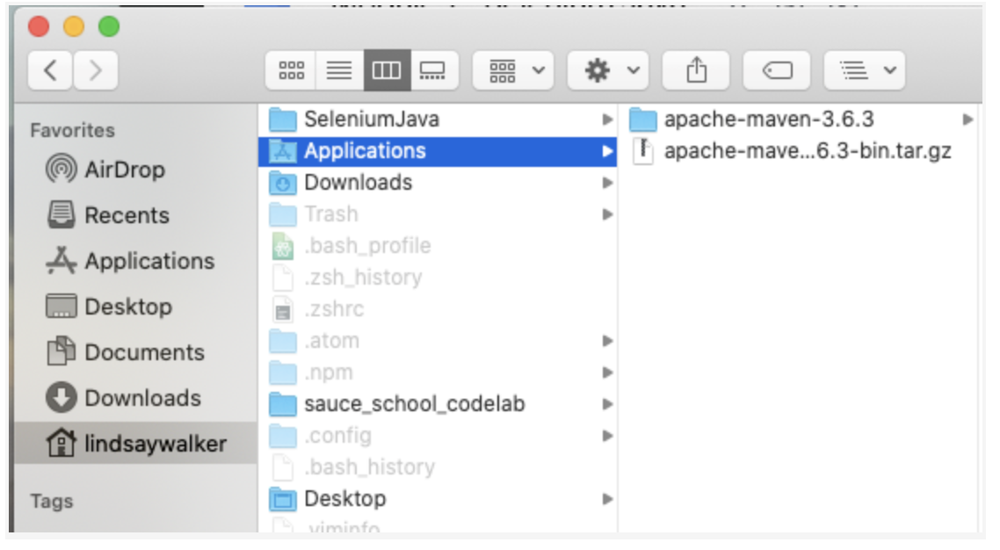
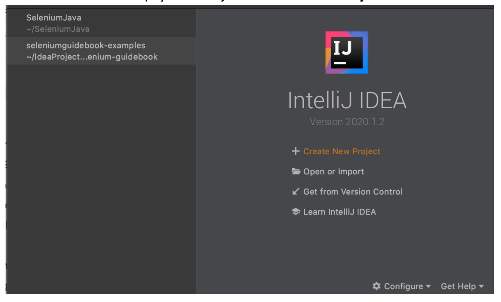

author:Lindsay Walker
summary: Module 1 of the Selenium Java Test Automation. Learn to write Selenium tests in Java language using the JUnit framework, IntelliJ, and Jenkins.
id: Module1-SeleniumJava
categories: beginner
tags: java
environments: Web
status: Published
feedback link: https://forms.gle/CGu4QchgBxxWnNJK8
author: Lindsay Walker

<!-- ------------------------ -->
# Module 1- Introduction to Selenium with Java

<!-- ------------------------ -->
## 1.01 What You'll Learn
Duration: 0:03:00

*   Learn to install and use Selenium WebDriver in conjunction with Java tools (IntelliJ and Maven) to write tests.  
*   Use Maven and IntelliJ to compile and run tests and manage dependencies on your machine
*   Use the Selenium WebDriver in conjunction with a Java test runner (JUnit4) to write tests
*   Understand what the Selenium WebDriver is and the basics of how it is used to automate testing
*   Understand the role a test runner, such as JUnit4, plays in creating tests
*   Differentiate between the Selenium language bindings and the web drivers for different browsers
*   Know how Maven manages and updates packages and tools used for Selenium testing in Java
*   Explain how Selenium bindings, web drivers, and JUnit4 work together to create tests and test suites
*   Understand that good tests are atomic: They have tests grouped by functionality and are named descriptively. Good tests also use test runners, and are maintained in version control systems.

<!-- ------------------------ -->
## 1.02 What is Selenium?
Duration: 0:05:00

Selenium is an open source tool used for automating testing of web applications. Without  automated testing, each time a web application was updated, a human would have to go onto the website and try various combinations of clicks, interactions, and submissions. If you  automate your testing with a tool like Selenium, when an update is made, you can write and run tests with the “robot” that is Selenium, which performs programmed sets of interactions for you to
test new features and functionality before an updated version of a web app is released into the wild.


Selenium is a robotic testing tool, not a framework. It expresses no judgement, nor does it help you test. In order to orchestrate how tests are run, and report on the things that Selenium does, you need a framework, which will be covered later on.


### The Seven Basic Steps of Selenium Tests

There are seven basic elements of a Selenium test script, which apply to any test case and any application under test (AUT):


1. Create a WebDriver instance.
2. Navigate to a Web page.
3. Locate an HTML element on the Web page.
4. Perform an action on the HTML element.
5. Anticipate the browser response to the action.
6. Run tests and record test results using a test framework.
7. Conclude the test.

The Selenium Grid allows you to run parallel tests on multiple combinations of machines (Mac, Windows, or Unix-based systems) using multiple web browsers (versions of Chrome, Edge, Firefox, or Safari). These different machines can exist virtually on a server in a cloud environment, or as a network of real devices. JSON is used to communicate test requirements and route those requirements to different nodes, which have different environments to test on.


The [Sauce Labs](https://saucelabs.com/?utm_source=referral&utm_medium=LMS&utm_campaign=link) platform enables you to use a Selenium Grid at scale to run thousands of tests at once, on our suite of different test environments in the cloud. Sauce also has a robust dashboard for easy viewing of test outcomes and increased velocity of debugging tests. This dashboard includes tracking of errors and even a visual record of what occurred in different environments.

As your test suite grows, your test runs will take longer to complete. To speed them up, you will want to run them in parallel, which is where the benefit of having your own servers or using a cloud provider comes in -- that, and the ability to have numerous browser and operating system combinations to run your tests on.

This course focuses on the fourth version of Selenium, which supports communication via the W3C WebDriver protocol. All modern web browsers are also built in compliance with this protocol (a set of rules on how to communicate), which means Selenium 4 can be used with any programming language and any browser and OS combination in your environment. With the W3C protocol, you can discover and manipulate elements on a page in order to test their functionality.

Selenium is really good at a specific set of things. If you know what those are and stick to them, then you can easily write reliable, scalable, and maintainable tests that you and your team can trust.


### What Selenium Is and Is Not Good At

Selenium is built to automate browsers and human interaction with them. This can include things like navigating to pages, clicking on elements, typing text into input fields, etc.

It is less ideal for checking lower-level functionality, like HTTP status codes or HTTP headers. While you can use Selenium this way, it requires third-party tools.

<!-- ------------------------ -->
## 1.03 What is the W3C WebDriver Protocol?
Duration: 0:05:00

The WebDriver protocol consists of rules for communication between the client on the local end, -- which uses languages and libraries like Java, Ruby, or JavaScript -- and a web browser. The local end (your computer) communicates with the remote end node on the server side. The web driver defines how the remote end can behave, and the method for how the remote end receives information. As an example, the Selenium WebDriver provides instructions to the browser on how to click or type into elements on a page. This is then communicated to specific browser drivers, such as Chromedriver (for the Chrome browser) or Geckodriver (for the Firefox browser) and the commands are carried out.

The code that Selenium provides to you as a developer (the libraries) is called a Selenium language binding. It binds together the Java code you write for actions and tests with things that WebDriver can understand.


`

Java uses the driver method to interact with Selenium. When you use it, you instantiate a web driver, and then you have access to methods allowed by the web driver. Selenium uses the driver to automate and manipulate elements in the browser. Some examples of drivers include Chromedriver for the Chrome browser or Geckodriver for the Firefox browser.

JUnit4 is a Java library/package that allows you to communicate with Selenium and run unit tests. It also helps orchestrate test execution. This Java language binding (Selenium WebDriver methods written in Java) allows you to leverage the features specified by the W3C WebDriver protocol.


#### Quiz


<!-- ------------------------ -->
## 1.04 Test Frameworks and Dependencies
Duration: 0:05:00

A test framework includes code libraries as well as rules and conventions for setting up tests. When it comes to testing frameworks, there are three basic pieces that go into creating a framework.

**Test Runner –** A library or tool that takes the tests you write, along with settings you have configured in your tests, and executes them. It orchestrates the execution of the tests, controlling what is run when and in what order. For this course, we will be using the JUnit4 test runner.

**Robot –** Performs the actual actions on the browser. In this case, Selenium is the robot used to perform the interactions. It is a protocol that tells the browser to locate elements and perform actions on a page.

**Reporting –** This is the mechanism for providing information to the humans who have run the automated tests. It provides a summary of test activities and results.

A good framework combines best practices for structuring and writing code, along with structure for how data is handled and stored, enabling you to write test code that is reusable and will have less need for maintenance.

Frameworks provide both tools and guidelines for creating and designing test suites. They can include coding standards, test-data handling methods, Page Object Models, processes for storing test results, and information on how to access external resources.

So far, you’ve learned a bit about how the code on your end communicates with the W3C WebDriver using Selenium. This isn’t the whole picture, however. There are other tools that enable you to write and implement test code. Usually, runners and frameworks are used alongside the base programming language that help give structure, create commands, manage and organize files, store data, and more. In this course, we will use JUnit4 annotations and methods with Java and Selenium to write our tests.


Above is an example of how you might connect a framework with the Selenium grid that then executes tests with the Selenium WebDriver.

In the exercises that follow, you will learn more about the different tools you use when you write code, and the roles that the different elements play in your test suites and the execution of tests will become more clear.


<!-- ------------------------ -->
## 1.05  Installing Dependencies
Duration: 0:15:00

In order to run a Java test code suite on your local machine, you will need a few dependencies, which include software, tools, and code libraries, before you can write your first test code. You will need the Java Development Kit to write the Java Code, JUnit to write the test commands, Maven to manage the other dependencies that you need for a test suite, and IntelliJ IDE to edit and run all these things together.


**Java –** Java is a high-level, statically typed language that needs to be compiled to machine language before you are able to run Selenium tests locally or in the cloud. The Java Development Kit (JDK) includes both the Java Runtime Environment (JRE) which creates and runs a virtual machine where java programs can run, as well as other tools and tools necessary to write Java code. It’s important to make sure that as a developer, you install the JDK and not just the JRE.

**Maven –** Manages other required dependencies, as well as builds any application code you create. Maven helps organize and perform the tasks needed to build and execute your test suite.

**JUnit4 –** An open-source, Java-based framework used primarily to create unit tests. This tool includes an assertion library used to write tests, as well as annotations that allow you to run test methods (instead of building them out yourself).

**IntelliJ IDE & Debugger –** This tool helps with the writing, debugging, and organization of your code. This includes features that make your code easier to read and organize. IntelliJ  provides  an interface where you can interact with other tools, such as Maven and JUnit4, as well as test and debug code.


Negative
: Even though you can use Maven and Java from within IntelliJ without installing it on your machine, you should install Maven and Java on your machine so that you can run tests you write outside of IntelliJ.

### Environment Setup

#### Windows Setup
Follow [these instructions](https://docs.google.com/document/d/1herzHbTJdQpa-hAIR5llTfbbw20PeM99-BAoVTeuC8U/edit?usp=sharing) to install and set up a JDK, Maven, and IntelliJ on Windows 10.

#### Mac OS Setup

Check and see if you have a JDK (Java Development Kit) installed on your computer by opening terminal and typing `echo $JAVA_HOME.`

If no file path is shown, you need to install Java and set the environment variable with the file path to access it.

Go to [the JDK downloads](https://www.oracle.com/technetwork/java/javase/downloads/index.html) page, locate the latest release, select the download button for the .dmg file.


Open the file then unzip it


*   Once the file is  double clicked & open, then follow the installation instructions.


#### Install Maven

Download the latest version of the` .tar.gz` file from here: ([https://maven.apache.org/download.cgi](https://maven.apache.org/download.cgi))

Move the zipped file to your Applications folder.



In terminal, open the file in your downloads directory in terminal and run the command:


    `tar xzvf apache-maven-3.6.3-bin.tar.gz`.

(Replace `maven-3.6.3-bin.tar.gz` with the version you downloaded.)  This will unzip the project file.

Next, you will need to [update your bash profile](https://medium.com/macoclock/how-to-create-delete-update-bash-profile-in-macos-5f99999ed1e7) to tell your computer where to look for files that you will need to run your test (Maven and Java).

Open your `.bash_profile `in your user directory (if you are running MacOS Catalina 10 or above, update the` .zshrc`), and add in the following environment variables.


```
//filename: userdirectory/.bash_profile
##Java Home path
export JAVA_HOME=$(/usr/libexec/java_home)

##Maven Env Variables
export M2_HOME=$HOME/Applications/apache-maven-<version>
export M2=$M2_HOME/bin

##Add to PATH variable
export PATH=$M2:$JAVA_HOME/bin:$PATH
```


#### Note
Negative
: The version of the apache-maven variable needs to reflect which version you downloaded. For example, if you downloaded maven version 3.6.3, it would read `export M2_HOME=$HOME/Applications/apache-maven-3.6.3`


From the terminal, inside of your project folder (or in the IntelliJ IDEA),run the command `source ~/.bash_profile` (if you are running MacOS Catalina 10 or above, run `source  ~/.zshrc`) from the terminal inside of your project folder (or in the IntelliJ IDEA) so your machine knows to look at the .`bash_profile `for where to access Java and Maven (setting the `HOME `variables)


#### Install IntelliJ

On the [IntelliJ page](https://www.jetbrains.com/idea/download/#section=mac), download the IntelliJ IDEA community edition.


Open the .msi  or .dmg file, and then install it as an application.  


### Create a New Project Directory with IntelliJ

Use IntelliJ to create a new project directory. Click on **Create New Project.**



In the left panel, select **Maven** as your build tool.


We will download JDK (Java Development Kit) and choose the latest version. This will download that JDK in the IntelliJ environment.


If you leave the **Location** blank, it will create this project in the root user folder. You can add in another directory name if you wish.  Our project will be called SeleniumJava.


If you look in the project file, you should notice that there is a **pom.xml** file in the directory, the `pom.xml `file is used with Maven to configure dependencies and project features.


### The pom.mxl File

The `pom.xml` file is what Maven uses to identify which dependencies to install and update. To start off, you will updated `pom.xml` with your dependencies. Maven will install and use these dependencies alongside the test code. Note that the versions may be out of date and you may want to use a more updated version of JUnit4, Selenium, or Selenium drivers.


```
?xml version="1.0" encoding="UTF-8"?>
<project xmlns="http://maven.apache.org/POM/4.0.0"
         xmlns:xsi="http://www.w3.org/2001/XMLSchema-instance"
         xsi:schemaLocation="http://maven.apache.org/POM/4.0.0 http://maven.apache.org/xsd/maven-4.0.0.xsd">
    <modelVersion>4.0.0</modelVersion>
    <groupId>org.example</groupId>
    <artifactId>SeleniumJava</artifactId>
    <version>1.0-SNAPSHOT</version>
    <packaging>jar</packaging>
    <name>SeleniumJava Course Code</name>
    <description>An example project to be used along with the Sauce labs Selenium with Java course using IntelliJ IDE, JUnit test runner.
    </description>

    <properties>
        <maven.compiler.source>1.8</maven.compiler.source>
        <maven.compiler.target>1.8</maven.compiler.target>
    </properties>

    <dependencies>

        <dependency>
            <groupId>junit</groupId>
            <artifactId>junit</artifactId>
            <version>4.12</version>
            <scope>test</scope>
        </dependency>

        <dependency>
            <groupId>org.seleniumhq.selenium</groupId>
            <artifactId>selenium-java</artifactId>
            <version>4.0.0-alpha-1</version>
        </dependency>

        <dependency>
            <groupId>org.seleniumhq.selenium</groupId>
            <artifactId>selenium-chrome-driver</artifactId>
            <version>3.141.59</version>
            <scope>test</scope>
        </dependency>

    </dependencies>

    <build>
        <plugins>
            <plugin>
                <artifactId>maven-compiler-plugin</artifactId>
                <version>3.0</version>
                <configuration>
                    <source>1.9</source>
                    <target>1.9</target>
                </configuration>
            </plugin>
            <plugin>
                <groupId>org.apache.maven.plugins</groupId>
                <artifactId>maven-surefire-plugin</artifactId>
                <configuration>
                    <parallel>methods</parallel>
                    <threadCount>40</threadCount>
                </configuration>
                <version>2.22.0</version>
            </plugin>
        </plugins>
    </build>

</project>
```


This sets up all the dependencies, however, you may need to research to make sure you have the most updated or correct version of these dependencies. Each dependency's `version` may need to be updated. See the section below for more details.


### Note

Negative
: How to Find Dependencies Using IntelliJ Video:
 If your .pom file doesn’t have all the dependencies that you need, or if those dependencies are an older version and you are unable to run your test code, the IntelliJ IDE has features that will help you out.

 Negative
: * Hover over a red word in IDE

Negative
: * Click the red light bulb to import maven dependencies.

Negative
: * Click the Maven tab and refresh.

Negative
: * Check the .pom file to make sure the updated version was added.

Negative
: * Words should no longer appear red in the test.java file.


#### Video

[1.05_IntelliJ_Dependencies ](https://drive.google.com/file/d/1Xg9Rn-R5Y-924yEpA6GW5YzB_-dxzS3x/view?usp=sharing)– Using IntelliJ to install dependencies and update the .pom file


#### Cheat Sheet


### Use GitHub Repository (Optional)

If you are familiar with using GitHub to write your code, you can also fork/ branch this repository here for the first set of code:

**[Module 1 Project Folder](https://github.com/walkerlj0/Selenium_Course_Example_Code/blob/master/java/Mod1/1.06/src/test/java/companyname/TestLogin.java)**

<!-- ------------------------ -->
## 1.06 Editing Code and Java Summary
Duration: 0:10:00

Take a look at the first test code we will be creating in the next module. There are several things at play:

**[Module 1 Project Folder](https://github.com/walkerlj0/Selenium_Course_Example_Code/blob/master/java/Mod1/1.06/src/test/java/companyname/TestLogin.java)**


### Java Methods

**public class**– A command that instantiates a Java Class.

**private** – A command used to declare a variable whose scope is to be used only within the class or method it is defined within.

**public void** – A command used to declare a method accessible to other objects in your test suite, that also does not return a value.

**Import** – A command used to allow your code to communicate with the dependencies needed.


### JUnit4 Annotations

**[@Before ](https://www.lambdatest.com/blog/tutorial-on-junit-annotations-in-selenium-with-examples/#:~:text=Automation%20%E2%80%A2%20Selenium%20Tutorial%20%E2%80%A2,your%20code%20runs%20as%20intended.) –** Used to initialize any object (test, page, etc.) and set up the test environment.

**@Test –** Communicates with the public void() method and tells it that the following statements can be run as a test case.

**@After –** The annotation that is used to tear down a test case, used at the end of every case, along with the @Before annotation.

**assertTrue(failureMessage, condition) –** JUnit method that checks if something is true and throws an error message (passed as first parameter) if the following command returns false (second parameter).


### Selenium Elements

**driver** variable with **driver.get(), driver.findElement, driver –** The driver variable instantiates a WebDriver session/ object, and then you can use Java commands for that driver.

**[Driver.quit](https://artoftesting.com/difference-between-driver-close-and-driver-quit-command-in-selenium-webdriver) –** An important Selenium command to use within **@After** annotations, this closes any browser windows that may be open and terminates the WebDriver session.

You can see an example of the project we will begin to be setting up in the next module [here.](https://github.com/walkerlj0/Selenium_Course_Example_Code/tree/master/java/Mod1/SeleniumJava%20copy/src/test/java/companyname)

<!-- ------------------------ -->

## 1.07 Module 1 Quiz
Duration: 0:03:00


