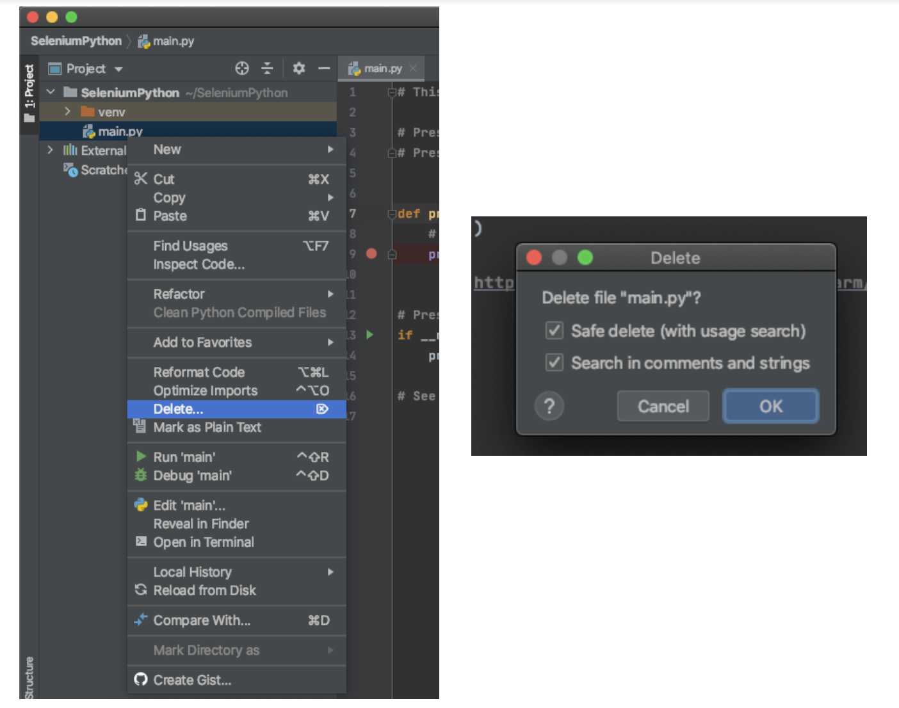
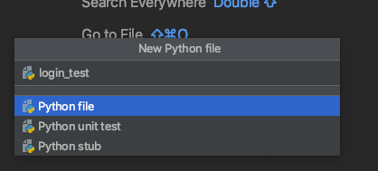
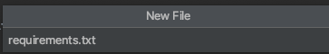

summary: Module 1 Introduction to Selenium with Python
id: Module1-SeleniumPython
categories: beginner
tags: python  
environments: Web
status: Published
feedback link: https://forms.gle/CGu4QchgBxxWnNJK8
analytics account: UA-6735579-1
author:Lindsay Walker

<!-- ------------------------ -->
# Module 1- Introduction to Selenium with Python

<!-- ------------------------ -->
## 1.01 What You'll Learn
Duration: 0:03:00

*   Learn to install and use Selenium WebDriver in conjunction with Python tools (pip3, Pytest, and Pycharm) to write tests.  
*   Use Pycharm and Pip3 to set up, run tests, and manage dependencies on your machine
*   Use the Selenium WebDriver in conjunction with a Pytest test runner to write tests
*   Understand what the Selenium WebDriver is and the basics of how it is used to automate testing
*   Understand the role a test runner, such as Pytest, plays in creating tests
*   Differentiate between the Selenium language bindings and the web drivers for different browsers
*   Know how Pip3 manages and updates packages and tools used for Selenium testing in Python.
*   Explain how Selenium bindings, web drivers, and Pytest work together to create tests and test suites
*   Understand that good tests are atomic: They have tests grouped by functionality and are named descriptively. Good tests also use test runners, and are maintained in version control systems.

<!-- ------------------------ -->
## 1.02 What is Selenium?
Duration: 0:05:00

Selenium is an open source tool used for automating testing of web applications. Without  automated testing, each time a web application was updated, a human would have to go onto the website and try various combinations of clicks, interactions, and submissions. If you  automate your testing with a tool like Selenium, when an update is made, you can write and run tests with the “robot” that is Selenium, which performs programmed sets of interactions for you to
test new features and functionality before an updated version of a web app is released into the wild.


Selenium is a robotic testing tool, not a framework. It expresses no judgement, nor does it help you test. In order to orchestrate how tests are run, and report on the things that Selenium does, you need a framework, which will be covered later on.


### The Seven Basic Steps of Selenium Tests

There are seven basic elements of a Selenium test script, which apply to any test case and any application under test (AUT):


1. Create a WebDriver instance.
2. Navigate to a Web page.
3. Locate an HTML element on the Web page.
4. Perform an action on the HTML element.
5. Anticipate the browser response to the action.
6. Run tests and record test results using a test framework.
7. Conclude the test.

The Selenium Grid allows you to run parallel tests on multiple combinations of machines (Mac, Windows, or Unix-based systems) using multiple web browsers (versions of Chrome, Edge, Firefox, or Safari). These different machines can exist virtually on a server in a cloud environment, or as a network of real devices. JSON is used to communicate test requirements and route those requirements to different nodes, which have different environments to test on.


The [Sauce Labs](https://saucelabs.com/?utm_source=referral&utm_medium=LMS&utm_campaign=link) platform enables you to use a Selenium Grid at scale to run thousands of tests at once, on our suite of different test environments in the cloud. Sauce also has a robust dashboard for easy viewing of test outcomes and increased velocity of debugging tests. This dashboard includes tracking of errors and even a visual record of what occurred in different environments.

As your test suite grows, your test runs will take longer to complete. To speed them up, you will want to run them in parallel, which is where the benefit of having your own servers or using a cloud provider comes in -- that, and the ability to have numerous browser and operating system combinations to run your tests on.

This course focuses on the fourth version of Selenium, which supports communication via the W3C WebDriver protocol. All modern web browsers are also built in compliance with this protocol (a set of rules on how to communicate), which means Selenium 4 can be used with any programming language and any browser and OS combination in your environment. With the W3C protocol, you can discover and manipulate elements on a page in order to test their functionality.

Selenium is really good at a specific set of things. If you know what those are and stick to them, then you can easily write reliable, scalable, and maintainable tests that you and your team can trust.


### What Selenium Is and Is Not Good At

Selenium is built to automate browsers and human interaction with them. This can include things like navigating to pages, clicking on elements, typing text into input fields, etc.

It is less ideal for checking lower-level functionality, like HTTP status codes or HTTP headers. While you can use Selenium this way, it requires third-party tools.

<!-- ------------------------ -->
## 1.03 What is the W3C WebDriver Protocol?
Duration: 0:05:00

The WebDriver protocol consists of rules for communication between the client on the local end, -- which uses languages and libraries like Java, Ruby, Python, or JavaScript -- and a web browser. The local end (your computer) communicates with the remote end node on the server side. The web driver defines how the remote end can behave, and the method for how the remote end receives information. As an example, the Selenium WebDriver provides instructions to the browser on how to click or type into elements on a page. This is then communicated to specific browser drivers, such as Chromedriver (for the Chrome browser) or Geckodriver (for the Firefox browser) and the commands are carried out.

The code that Selenium provides to you as a developer (as libraries) is called a Selenium language binding. It binds together the Python code you write for actions and tests with things that WebDriver can understand.


`

Python uses the driver method to interact with Selenium. When you use it, you instantiate a web driver, and then you have access to methods allowed by the web driver. Selenium uses the driver to automate and manipulate elements in the browser. Some examples of drivers include Chromedriver for the Chrome browser or Geckodriver for the Firefox browser.

The Pytest dependencies are a set of Python library/package that allow you to communicate with Selenium and run unit tests. It also helps orchestrate test execution. The [Python language binding](https://selenium-python.readthedocs.io/installation.html#downloading-python-bindings-for-selenium), which are Selenium WebDriver methods written in python, allow you to leverage the features specified by the W3C WebDriver protocol.


#### Quiz


<!-- ------------------------ -->
## 1.04 Test Frameworks and Dependencies
Duration: 0:05:00

A test framework includes code libraries as well as rules and conventions for setting up tests. When it comes to testing frameworks, there are three basic pieces that go into creating a framework.

**Test Runner –** A library or tool that takes the tests you write, along with settings you have configured in your tests, and executes them. It orchestrates the execution of the tests, controlling what is run when and in what order. For this course, we will be using the Pytest test runner.

**Robot –** Performs the actual actions on the browser. In this case, Selenium is the robot used to perform the interactions. It is a protocol that tells the browser to locate elements and perform actions on a page.

**Reporting –** This is the mechanism for providing information to the humans who have run the automated tests. It provides a summary of test activities and results.

A good framework combines best practices for structuring and writing code, along with structure for how data is handled and stored, enabling you to write test code that is reusable and will have less need for maintenance.

Frameworks provide both tools and guidelines for creating and designing test suites. They can include coding standards, test-data handling methods, Page Object Models, processes for storing test results, and information on how to access external resources.

So far, you’ve learned a bit about how the code on your end communicates with the W3C WebDriver using Selenium. This isn’t the whole picture, however. There are other tools that enable you to write and implement test code. Usually, runners and frameworks are used alongside the base programming language that help give structure, create commands, manage and organize files, store data, and more. In this course, we will use Python and methods with -------- and Selenium to write our tests.


Above is an example of how you might connect a framework with the Selenium grid that then executes tests with the Selenium WebDriver.

In the exercises that follow, you will learn more about the different tools you use when you write code, and the roles that the different elements play in your test suites and the execution of tests will become more clear.


<!-- ------------------------ -->
## 1.05  Installing Dependencies
Duration: 0:15:00


You will need several dependencies dependencies in order for our test to run as planned, and now we will get set up to do that. In this module, you’re going to install a program called Homebrew, which will help install Python version 3 and manage it's dependencies.

If you are installing Python on a Widows or Linux machine, you can follow the instructions found on [_The Hitchikers Guide to Python_](https://docs.python-guide.org/starting/installation/).


#### NOTE

The easiest way to install Python dependencies on Mac is to enlist the help of another tool called [Homebrew](https://brew.sh/). Homebrew makes it easier to install and keep other files and software up to date on your machine. To install brew, copy and paste the command on there into your terminal:


```
/bin/bash -c "$(curl -fsSL https://raw.githubusercontent.com/Homebrew/install/master/install.sh)"
```


If you type `brew info` in your terminal, and you have homebrew installed correctly, you should see something like this:


The Homebrew installation should also update the PATH variable when you install it, so other programs on your computer know how to access `brew` commands

--

### Install Python

Once you have [Homebrew](https://brew.sh/) installed, it's easy to install python by typing this command into your terminal:

```
$ brew install python
```

The nice thing about Homebrew is that it will automatically download the the latest version of Python, as well as update dependencies for Python 2.7, which is automatically installed on Mac. You shouldn't, however use Python version 2.7 for your test code as it's no longer supported.


Homebrew may have updated several versions of Python. You can check which version you are using by typing

 ```
 python --version
 ```


Since you may have other versions on your machine, you will want to specify which version to use with your tests, you will want to type in the command to get :
```
python3
```
This will take you into the interface that will allow you to interact and write programs on the Python interpreter.


You can exit the python interpreter by typing _control + D_  or typing in your terminal:

```
quit()
```

Next, create a project folder and install pip3so that later on we can install other dependencies. The dependencies include the Selenium Webdriver, web drivers that communicate with different browsers (such as chromium), as well as other frameworks and libraries.


### Install PyCharm
In order to write and edit your test code, you will need an  **I**ntegrated **D**evelopment **E**nvironments (IDE) to edit code and manage your project. [Pycharm](https://www.jetbrains.com/pycharm/) is a good option for this. Download and install the community version for this project.

`


### Install Pip

The first thing you will need is the standard package manager for Python. It allows you to install and manage tools and libraries that don't come with the regular Python package you installed. When you installed the python package above, a version of pip, called `pip3` was installed. Check that you have it on your machine by typing:

```
pip3 --versions

```

You should see an output like this:

 

 #### NOTE
 If you don't have pip3 installed, or you are using an older version of Python, you may want to check to see if you have pip3installed by typing `pip3--version` into your terminal. You can also [use this website](https://pip.pypa.io/en/latest/installing/)  get get pip3installed. It's not recommended that you use Python 2.7 and pip, as it's not supported, but it may be a reason `pip3`  isn't working.

 --

### Install Libraries from PyPI

While the Python standard library come well equipped with many of the things you will need, the Python community is constantly adding new and useful tools which can be found in the Python Package Index, or [PyPI](https://pypi.org/). We will install the following libraries by typing each of the following into your terminal:

```
pip3 install pytest
```
```
pip 3 install pytest-randomly
```
```
pip3 install pytest-xdist
```
```
pip3 install Selenium
```

For each of these installs you should see the processes processing an output on the terminal, and a success message for each:

 


### Install A Virtual Environment

Since there may be more than one version of Python on your machine (being used by different software for different purposes) we want to create a sandbox environment where you can run your tests written for the latest version of Python where you can set up all the dependencies use with that version of Python.

You can install the virtual environment by typing the following command into your terminal:

```
python3 -m venv venv3
```

Next, run the command to start the virtual environment:

```
source venv3/bin/activate
```

In your terminal, you should see the following to indicate that the venv3 environment is running. This environment allows you to run Python 3 and the related dependencies, without the problems of getting mixed up with dependencies meant for other versions of Python.


If you type in `python --version` you will now see that you have Python 3 running on your machine, in the virtual environemtn.


You will have to run the command `source venv3/bin/activate` run the command to start your virtual environment any time you would like to run tests outside of the PyCharm IDE. You can then enter the directory your test suite is kept, and run the command `pytest`.

 To exit the virtual environment in your terminal, type `deactivate`.


### Dependency Overview
**Python–** A dynamically-typed, interpreted language used in conjunction with libraries like Pytest that allow you to run tests on all parts of an application.

**Pip3 Package Manager –** Manages other required dependencies, installing and managing tools and libraries from cloud repositories like [PiPY](https://pypi.org/).

**Pytest Test Runner –** An open-source tool that executes the test with commands that allow you to do things like run tests in parallel, run specific sets of tests, and more.

**PyCharm IDE –** This tool helps with the writing, debugging, and organization of your code. It includes features that make your code easier to read and organize, start a virtual environment, as well as update dependencies and run test all in one tool.

<!-- ------------------------ -->

## 1.06 Project Directory Setup


### Create a Project Directory

If you have never used an IDE like Pycharm, I highly recommend you read the docs, and [take a look](https://www.jetbrains.com/help/pycharm/quick-start-guide.html#ui) at what the different tools are that exist in the window.


The first thing we will need to do is create a project directory. Open up PyCharm and choose the location on your local machine for your project. Name the project folder **SeleniumPython**


You will want to make sure you have the following options chosen:
  1. You have chosen the **Location** on you Machines file directory and typed **SeleniumPython** at the end for the name of you Python Test suite.
  2. You chose a **New environment using Virtualenv**, located within the **SeleniumPython** directory you just created.
  3. Check the box to **Inherit global site-packages**.

It's up to you if you want to create a `main.py` welcome script, you will delete it later.

Click **Create** and you should see a project like this:


If you have a `main.py` file, then right click on it in the Projects tool window, choose delete and perform a safe delete



Right click on the main Seleniun Python project folder and choose **New > DIrectory** Name it `tests`.


Right click on the `tests` directory you created and choose **New > Python File**. Name the file `login_test`.




Last, you are going to add a requirements file that woeks with `pip3` install, update, and manage the dependencies. In the top level **SeleniumJava** directory right click and choose **New > File** and name it `requirements.txt`




Double click to open this file in the editor window, and copy-paste in the following:

```
selenium==3.14.0
sauceclient>=0.2.1
pytest==4.4.0
pytest-xdist
pytest-randomly
```

 You should now have a project directory that looks like this:

 

### The Requirements File
 This repository contains a file called [requirements.txt](https://github.com/walkerlj0/Selenium_Course_Example_Code/blob/master/python/Mod1/1.05/requirements.txt) that can be used in the PyCharm IDE to automatically install the dependencies from the previous lesson, and make sure they are available in this particular virtual environment. All you need to do is open the terminal in the PyCharm IDE and type in the command:

 ```
 pip3install -r requirements.txt
 ```
 Some of the dependencies, such as pytest might need updating to the latest version.

 

### Use GitHub Repository (Optional)

If you are familiar with using GitHub to write your code, you can fork/ branch this repository here for the first set of code:

**[Module 1 Project Directory](https://github.com/walkerlj0/Selenium_Course_Example_Code/tree/master/python/Mod1/1.05)**


<!-- ------------------------ -->
## 1.07 Editing Code and Python Summary
Duration: 0:10:00

Take a look at the first test code we will be creating in the next module inside the file `test-login.py`. There are several things at play:

```
# filename: tests/login_test.py
import pytest
import os
from selenium import webdriver
from selenium.webdriver.common.by import By

@pytest.fixture
def driver(request):
    _chromedriver= os.path.join(os.getcwd(), 'vendor', 'chromedriver')
    if os.path.isfile(_chromedriver):
        driver_ = webdriver.Chrome(_chromedriver)

    else:
        driver_ = webdriver.Chrome()

    def quit():
        driver_.quit()

    request.addfinalizer(quit)
    return driver_


def test_valid_credentials(driver):
    driver.get("http://the-internet.herokuapp.com/login")
    driver.find_element(By.ID, "username").send_keys("tomsmith")
    driver.find_element(By.ID, "password").send_keys("SuperSecretPassword!")
    driver.find_element(By.CSS_SELECTOR, "button").click()

```


### Python Methods


**os** – The imported [`os` module](https://docs.python.org/3/library/os.html) allows Python to interact with the operating system that the tests are running on. In this case getting the filepath (`os.path`) from the current working directory and appending `/vendor/chromedriver` to provide a path to the Chromedriver file that will instantiate a webdriver for the test.

**def** – The keyword that defines a function in Python.


### Pytest Methods

**[test_*]–** By naming the [method test_*](https://docs.pytest.org/en/stable/), Pytest will know it's a test method and execute it accordingly. The current code only contains Selenium commands to locate elements on the page, but Pytest also provides `assertions`.

**Fixture** – The [fixture](https://www.tutorialspoint.com/pytest/pytest_fixtures.htm) is a type of function are run before a test, and provides input, or data to the test you choose to run(`test_valid_credentials`). In this case it is providing the information about the driver to the `driver` method. Fixtures help define when you should (and should not) use certain methods defined in a function by passing the fixture function in as a parameter.

**Assert** – Not used yet in this code sample, however [assertions](https://docs.pytest.org/en/3.0.2/assert.html) are important to check is elements are present (`assert true' or 'false`), or if the outcome to a certain action has a certain value. (`assert a == b`)


### Selenium Elements

**Driver** – To create an instance of Selenium we call `webdriver.Chrome()` and store the response in a variable. Since the name of the method is already driver, we refer to this variable as `driver_`.

**driver.get(), driver.findElement, etc. –** The driver variable instantiates a WebDriver session/ object, and you can combine Python commands with these driver commands.

**[Driver.quit](https://artoftesting.com/difference-between-driver-close-and-driver-quit-command-in-selenium-webdriver) –** An important Selenium command to use within **quit()** annotations, this closes any browser windows that may be open and terminates the WebDriver session.

You can see an example of the project we will begin to be setting up in the next module [here.](https://github.com/walkerlj0/Selenium_Course_Example_Code/blob/master/python/Mod2/2.05/tests/login_test.py)

<!-- ------------------------ -->

## 1.08 Module 1 Quiz
Duration: 0:03:00

