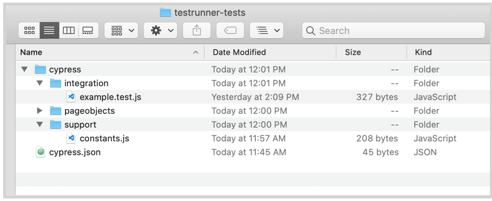
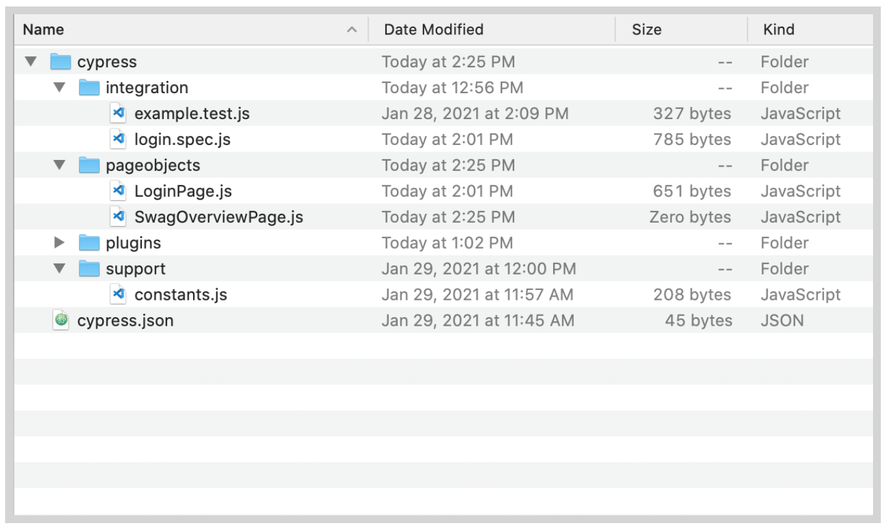
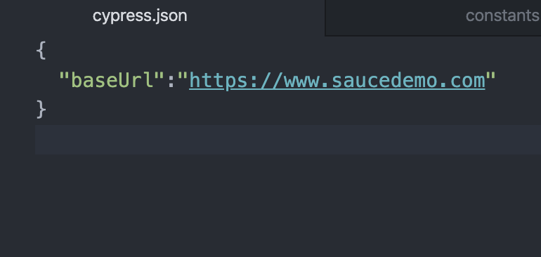
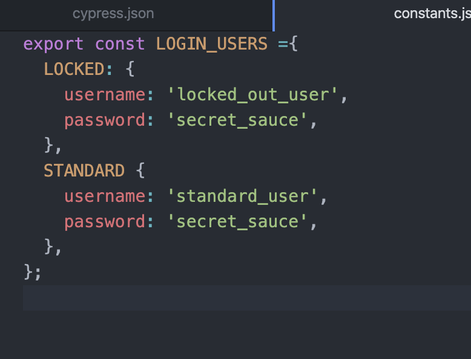
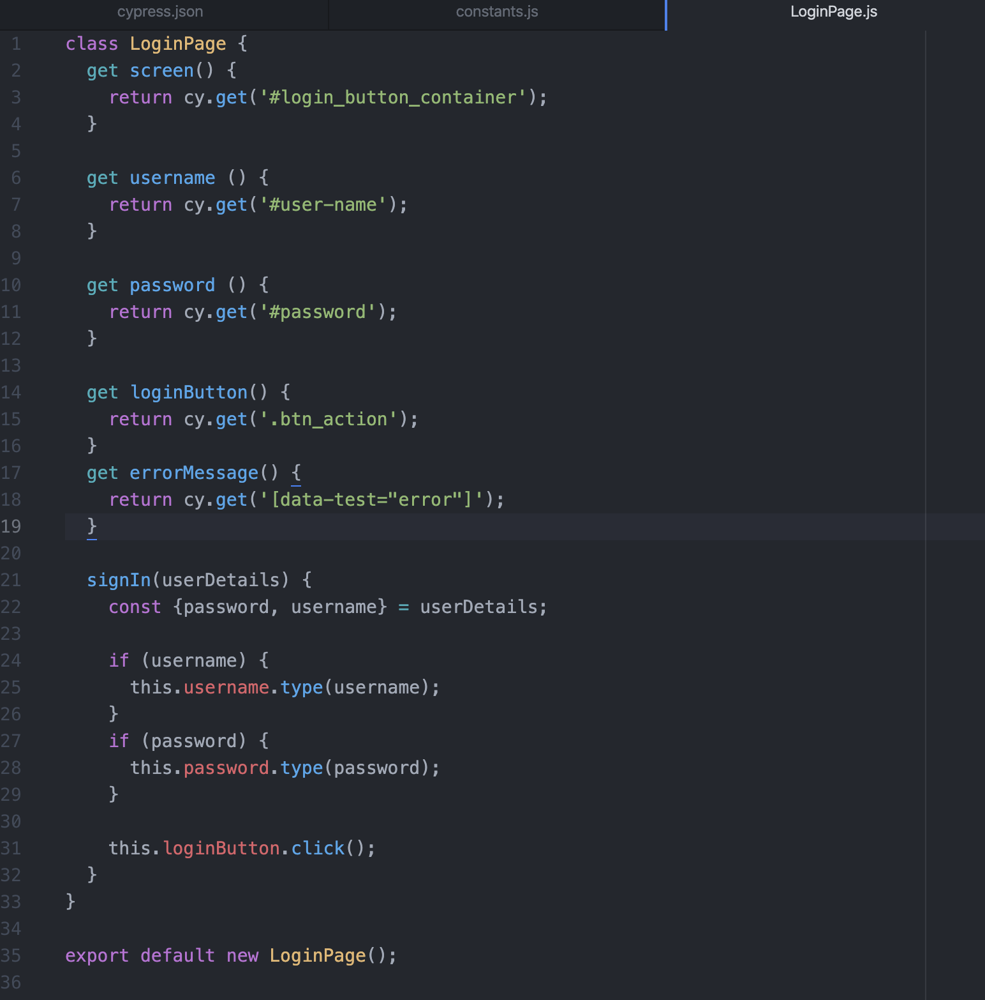

<!-- Copy this file into tools/site/coursenameFolder & start editing -->

summary: Module 1 of the TestRunner Toolkit course, introducing how to set up a Cypress test with TestRunner toolkit and Sauce Labs.
id: Module1-TestRunner
categories: beginner
tags: testrunner  
environments: Web
status: Draft
feedback link: https://forms.gle/CGu4QchgBxxWnNJK8
author:Lindsay Walker
<!-- ------------------------ -->
# Module 1 – Intro to TestRunner Toolkit with Cypress

<!-- ------------------------ -->
## 1.01 What You'll Learn
Duration: 0:01:00

* How is TestRunner Toolkit different than other automated test solutions that you can use with Sauce Labs

* Learn about the components of TestRunner toolkit, including the command line tool, Docker, and the Cypress.io client

* Set up the necessary components to run Cypress and TestRunner toolkit on your computer

* Understand the configuration files for Cypress on TestRunner Toolkit and how to modify them

* Learn basic JavaScript to write page object and test code that runs on Cypress and Sauce TestRunner Toolkit

* Learn to run a Cypress Test on Sauce Labs with a Docker container and on Virtual Machines (VMs)

* Run Testrunner Toolkit Cypress Test through a Sauce Connect Tunnel


<!-- ------------------------ -->
## 1.02 What Is TestRunner Toolkit
Duration: 0:03:00

TestRunner toolkit was designed to enable test developers to write code that communicates with the browser using JavaScript framework that can send updates to the browser and DOM in real-time. The TestRunner toolkit makes it quick an easy to install all the dependencies needed to start writing tests.

Unlike Selenium, the Cypress framework can make API calls, modify the web app code in real-time, and has access to all the tools that the browser’s Dev Tools provide.


#### Video

[Test Runner Intro](https://drive.google.com/file/d/1yXQTWNc2IRGnNC2G6CkUzYMWFT5KWphK/view?usp=sharing)


### What are SauceCTL and TestRunner Toolkit?

SauceCTL stands for Sauce Control, the command line interface for the Sauce TestRunner toolkit. The toolkit includes SauceCTL that allows you to interface with testrunner toolkit through command line, as well as the tools necessary to record the output from tests run on cypress in dockers, and send the data to Sauce Labs, making it easy to interpret, share an analyze those test results.


### Why Use TestRunner Toolkit

Historically, most end-to-end testing consisted of various components such as [Selenium](https://www.selenium.dev/documentation/en/), <code>[mocha-chai](https://www.codecademy.com/articles/bapi-testing-intro#:~:text=Mocha%20and%20Chai%20are%20two,results%20to%20the%20terminal%20window.)</code> (test assertion frameworks), and other tools that are necessary to run, automate, and debug tests. Users would create a remote session to test a web application. With Sauce Labs Testrunner Toolkit and Cypress, you have an all-in-one test framework, runner, and assertion platform that doesn’t require the client to send commands and wait for a response in order to run.

In other words, Testrunner Toolkit with Cypress provides a powerful [clear-box testing](https://en.wikipedia.org/wiki/White-box_testing) tool that doesn’t require downloading and installing several tools and libraries:


Using Cypress alongside Sauce Labs also allow you to:


*   Run your tests using a containerized solution, to simplify setting up your environment and dependencies
*   Review, share, and evaluate your test assets, such as logs, test results, and test videos
*   Use our Insights feature to perform deeper analysis of test outcomes


### What is a Containerized Solution?

By using Docker, you are using a simple virtual environment that includes an OS, all the software you would need to run the test, as well as test libraries and dependencies. This means that you, the user, doesn’t have to worry about installing and setting these things up on your machine.


<!-- ------------------------ -->
## 1.03 Set Up the TestRunner Toolkit Environment
Duration: 0:07:00

In this module, you will see how you can set up the Sauce Testrunner Toolkit along with Docker on your computer MacOS Computer.

Docker is software that allows you to create an isolated environment on your computer that is separate from your operating system, creating a lightweight environment that runs a Linux kernel to do specific tasks. Learn more from the [Docker documentation](https://docs.docker.com/get-started/overview/). Each environment coupled with the software and setting packaged together to use in that environment is called an **image**.

In our case, we will use Docker engine, which is made up of:


*   A long-running server that runs a daemon process in the background. This process listens for REST API commands and allows you to run environments, including an isolated filesystem, separate from the operating system on your computer.
*   A Command Line Interface (CLI) which you use to interact with and give commands to Docker
*   A REST API you can use to send commands to the background process.


#### Video

[SauceCTL Introduction](https://drive.google.com/file/d/14C7X0F98dflgYQDgCnD-H3yXuO1ABqka/view?usp=sharing)


Negative
: Note that the config file here may be out of date, and the [correct configuration can be found in the documentation.](https://docs.staging.saucelabs.net/testrunner-toolkit/configuration/cypress)


### Install Docker

The first thing you need to do visit the [docker download website ](https://docs.docker.com/get-docker/)and install the correct version on your machine.

Start up docker to ensure it’s running properly on your machine. Most likely, Docker will be set up to start once you have logged on. You can check to see if it’s running with the command `docker info`, and see which version you have with the command `docker -v`.  


#### Note

Negative
: Typically, one would need to import a docker image, however since we are also installing SauceCTL, the image will be specified in the config file for SauceCTL and imported for you.


### Download and Install SauceCTL

Next you need to download and install the Sauce Command Line Tool (CTL) that you will use to run the TestRunner Toolkit. This is a part of the TestRunner Toolkit that allows you to set a configuration location & update the file in your local directory.  There are several options (*Insert link) for installing it, and in this tutorial we will use npm, which means you need to have [NodeJS installed on your machine](https://nodejs.org/en/download/).

It also allows you to run commands to run tests locally or remotely on the Sauce Labs platform.

First, anywhere on your machine install the SauceCTL tool globally, using this command NPM to install the SauceCTL package:

`npm i -g saucectl`.

Next, create a project directory on your machine. You can use the command


```
mkdir testrunner-tests
```


To start the toolkit, run the command `saucectl new,` then choose the Cypress framework.  Choose the region nearest to you, and you should have the SauceCTL client up and running.


### Create Sauce Labs Environment Variables  

Watch the video to see how to [Set Sauce Credentials](https://drive.google.com/file/d/1qezKtvBpn94bBTJgbAd2MSx4ByNx7oaz/view?usp=sharing) on MacOS or [follow the steps in this tutorial](https://docs.google.com/document/d/1Cb27j6hgau5JHmAxGHPihd3V4Og3autPCei82_m1Ae8/edit?usp=sharing) to set them up on Windows.


### Create a Configuration File

Once you have SauceCTL running, open the project directory that you created for your TestRunner project. Take a look at the project files inside.


Any time you install Cypress, which was one of the things installed when you ran the command `saucectl new`, you will see a `cypress` folder containing the `/integrations` directory where all test files are stored, as well as a `cypress.json` file where you can set options reporters, the base URL that tests will be run against, and [more](https://docs.cypress.io/guides/references/configuration.html#Global).

Another part of the package that was installed when you ran `saucectl `new is the /`.sauce` directory. The /`.sauce` directory was created with a `config.yml` file inside which you will see the following:


```
// filename: .sauce/config.yml
apiVersion: v1alpha
kind: cypress
showconsolelog: false
sauce:
  region: us-west-1
  metadata:
    name: Testing Cypress Support
    tags:
    - e2e
    - release team
    - other tag
    build: "Cypress Sample Test Build - $DATE"
  concurrency: 1
cypress:
  configFile: cypress.json
  version: 5.6.0
suites:
- name: saucy test chrome
  browser: chrome
  config:
    testFiles:
        - '**/*.*'
docker:
  fileTransfer: mount
  image: saucelabs/stt-cypress-mocha-node:v5.6.0
```


Take a look at the top of the config file. There are several important elements here that can be modified.


*   The `apiVersion` is the SauceCTL API Version
*   The `sauce` information. Here is where you will put information that will be passed to sauce and can be used for debugging tests, such as the name, `build` number from your CI tool, and number of machines you would like to run concurrently
*   The `cypress` information tells your cypress tests where to look for the test configuration file, and which version of cypress you are running
*   The `suites` information includes the name, browser, and the configuration for your test suites such as what types of file names to look for to run as tests, and other metadata that is passed to the Sauce Labs dashboard for running tests and displaying results.
*   The `docker` information includes, in this case, instructions to [mount files], (https://docs.docker.com/storage/bind-mounts/) (how to send files to be used by the docker image) and the docker image name and version that installed by SauceCTL. Note that the version of the image at the end of the image name should match


<!-- ------------------------ -->
## 1.04 Create Page Objects
Duration: 0:05:00

Sauce Labs’ TestRunner Toolkit allows you to take existing Cypress test suites (or build a cypress test suite) and quickly run it on Sauce Labs. In this lesson, you will learn how to modify a couple settings in the `cypress.json` and `.sauce/config.ym`l files, then write a basic test and run it on Sauce Labs.

#### Video
[Page Objects Setup](https://drive.google.com/file/d/1C2k_gs8Q-hXT5sU59yM8KU3gdkrUcxfl/view?usp=sharing)


#### Note
Negative
: Different versions of Cypress will come with different pre-set project structures. If you have additional directories and files, you can keep them where they are, just make sure that you have the directories and files specified in this tutorial.


### Test Configuration


#### Cypress.json

The inside your testrunner-tests project file that you created, you will notice the cypress.json file. This file is used to set [all kinds of options for your Cypress test](https://docs.cypress.io/guides/references/configuration.html). If you don’t set any options, Cypress will use a set of default values. You can pull in data from this file into your tests, to make it easier to preload data in your test.

First, you will need to add information for your tests about the URL of the app you are testing against. Add the following line to `cypress.json`, which you will use in your tests to pull in the site you are testing against. \


```
//filename: cypress/cypress.json
{
 "baseUrl": "https://www.saucedemo.com"
}

```


#### Constants.js

Next, in the `cypress/support` directory (create the `cypress/support` directory if it doesn’t already exist) create a file called `constants.js`.

It’s good practice to store sensitive information like a username and a password in a separate file so you can use a .gitignore file to exclude it from Github repositories you will commit your project to.

Open `constants.js` and add the following objects to store different login credentials:


```
export const LOGIN_USERS = {
   LOCKED: {
       username: 'locked_out_user',
       password: 'secret_sauce',
   },
   STANDARD: {
       username: 'standard_user',
       password: 'secret_sauce',
   },
};

```


Now you can use these objects to login in your tests by calling `LOGIN_USERS.LOCKED` or `LOGIN_USERS.STANDARD`.


### Create Page Objects Directory

After that Create a directory called `pageobjects` in the `cypress/` directory. Typically, when you write tests you separate your code into items that control interactions with the page, or _page objects, _ or code that specifies what to test, or _test objects._

You project should now look something like this:





### Create Login Page Object

Open the new  `pageobjects` directory and add a file named: `LoginPage.js`, then open `LoginPage.js` and add the following: \


In `LoginPage.js` you will create several get methods to locate elements on the page you will use in your test later on:


```
// filename: cypress/pageobjects/LoginPage.js
class LoginPage {
   get screen() {
       return cy.get('#login_button_container');
   }

   get username() {
       return cy.get('#user-name');
   }

   get password() {
       return cy.get('#password');
   }

   get loginButton() {
       return cy.get('.btn_action');
   }

   get errorMessage() {
       return cy.get('[data-test="error"]');
   }

// ...
```


Since you have baseUrl specified in `cypress.json`, your tests know to visit [https://www.saucedemo.com](https://www.saucedemo.com). The first `get` method locates the div in blue below, where the other elements are found.


You can also see the ids, classes, and `data-test` element that your tests’ `get` methods use to locate other elements on the page.

Next, below the get methods, add in the code to create your `signIn method`, and export the LoginPage class so it can be used by other classes (your test methods).


```
// filename: cypress/pageobjects/LoginPage.js
// ...


   signIn(userDetails) {
       const {password, username} = userDetails;

       if (username) {
           this.username.type(username);
       }
       if (password) {
           this.password.type(password);
       }

       this.loginButton.click();
   }
}

export default new LoginPage();

```


If you recall, in `const.js` there is a constant created called `LOGIN_USERS `which contains two objects, either `LOCKED` or `STANDARD`.

The `signIn()` method will allow you to pass either the `LOCKED` or `STANDARD` object in with the `username` and `password` values.

Later, when you call that method in your test, you will pass in the set of username and password fields from `const.js` depending on whether you call the method with `signIn(LOGIN_USERS.STANDARD)` or `signIn(OGIN_USERS.LOCKED).`


### Create Inventory Page Object

You will also need to create a page object for the second page in the login flow, the Inventory Test.


Create a new file in the `cypress/pageobjects` directory called `SwagOverviewPage.j`s. Your project structure should look something like this:





Open `SwagOverviewPage.js` and copy in the following code:


```
//filename: cypress/pageobjects/SwagOverviewPage.js
class SwagOverviewPage {
    get screen() {
        return cy.get('.inventory_list');
    }
}
export default new SwagOverviewPage();
```


 This will go to the sauce demo page that lists the products, and search for the div that contains the list of items with an id of `inventory_list`.

 #### Final Code

 See a sample of the [project and code here](https://github.com/walkerlj0/testrunner-course-example-code/tree/main/Mod1/1.04)







<!-- ------------------------ -->
## Section 5
Duration: 0:05:00


<!-- ------------------------ -->
## Section 6
Duration: 0:05:00


<!-- ------------------------ -->
## Section 7
Duration: 0:05:00
