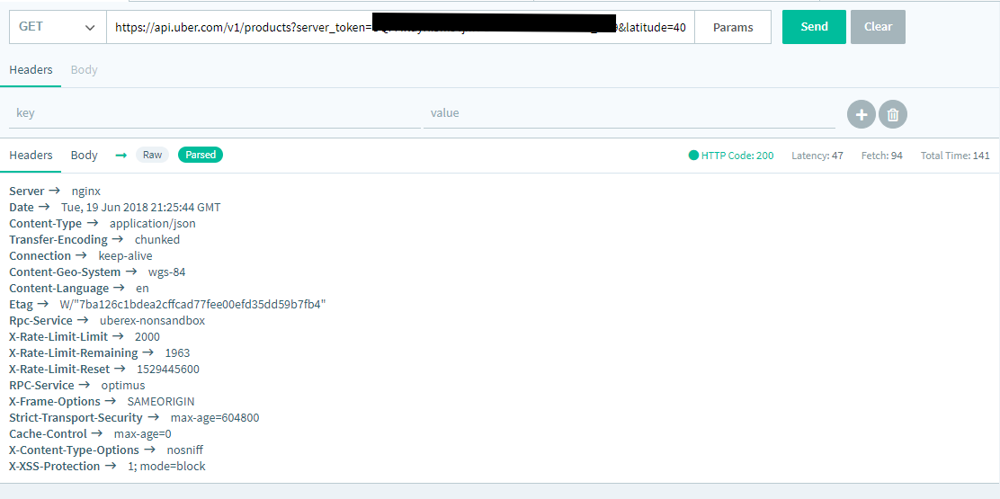
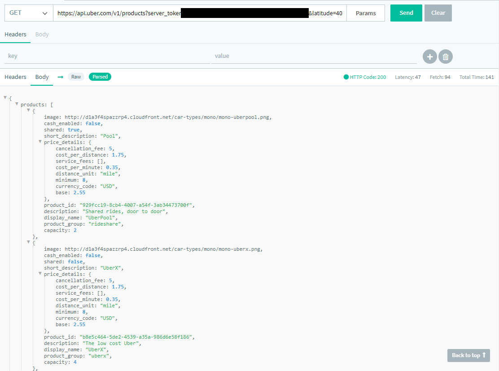

<!-- Copy this file into tools/site/coursenameFolder & start editing -->

summary: Module 2 of the API Testing course. Once you have completed module 1, jump into module 2 where you will learn some basic and more advances methodologies for creating good API tests.
id: Module2-APITesting
categories: beginner
tags: api
environments: Web
status: One or more of (Draft, Published, Deprecated, Hidden)
feedback link: https://forms.gle/CGu4QchgBxxWnNJK8
author:Lindsay Walker
<!-- ------------------------ -->
# Module 2 – API Test Best Practices

<!-- ------------------------ -->
## 2.01 Basic Best Practices
Duration: 0:05:00

### Test Every Endpoint

Every endpoint is an integral part of an API program, and that means validating each one works as expected. This even means testing endpoints that add items into a database like Create User. A smart platform allows you to create tests that can add users, validate they were properly entered, and if it's a success then the user is deleted.

### Test Everything

API payloads are filled with information. You should not only be testing every _object_, but the header also contains vital information. _Response-Type_, _Statuscode_, _Content-Type_, every piece of information in an API call is important to validate.

### Test Objects Thoroughly

When testing an API you should make sure all the objects exist, but that is only the first step. You should also be validating the objects have data associated that is within an expected range.

For example, in the below Uber payload you'll see that

- **_image_** should always be a properly formatted URL
- **_shared_** should be boolean (true or false)
- **_display\_name_** should be UberPool, UberX, UberSUV, UberEats, and whatever other products they have available in that city.

Test objects thoroughly, not only checking if they exist but that they are of the right type.

### Test & Project Organization

Before you begin creating tests for your API program, you should first consider how you want to organize them now and in the future. You may choose to create unique projects for different use cases, or tag the tests thoroughly using a system you create to separate tests that work for version 1 but not version 2. Come up with an organization plan that takes into consideration...

- Expected Audience
- Integration Test vs Simple Endpoint Test
- Versioning
- Legacy vs New APIs

### Monitor Your APIs

Again, monitoring is the most useful and yet underused form of testing. You need to know more about an API than if it's up or down, you need to validate it's functioning correctly.

Schedule your existing functional and integration tests against the live environment to truly understand how your APIs are working in the real world. Every API program should have a status page. [Learn about how to monitor AIPS](https://docs.saucelabs.com/api-testing/quick-start/easy-monitoring/index.html)

### Automate!

The key to delivering new and updated APIs quickly, and with confidence of their quality, is with test execution automation. This is particularly important for organization using CI/CD platforms like Jenkins, TravisCI, Bamboo, Azure DevOps, and more. Add your test suite to your pipelines as soon as you can. [Learn more about integrating CI/CD](https://docs.saucelabs.com/api-testing/quick-start/integrate-with-your-cicd)

<!-- ------------------------ -->
## 2.02 Advanced Best Practices
Duration: 0:04:00

### Variablize for Test Reuse

Domain, endpoints, and data sets are some of the parts of a test that should be easy to change quickly. You should never have to duplicate a test to execute it against a new staging environment. If you are doing that than your system needs to be reconsidered.

As much as possible aim to have only a single test of a certain type. If you built a partner API, then try to have a single detailed test that can be a regression test during a CI pipeline, and then also used to monitor the live environment. [Learn More](https://docs.saucelabs.com/api-testing/quick-start/flexible-variables-for-flexible-environments/index.html)

### Business Logic Validating

As described in Course 1, it is important to go beyond the technical facts of a payload. You should also have knowledge as to the business objects. This means that if the Uber payload includes a reference to _UberSidecar_, but Uber hasn't announced a _[Sidecar](https://en.wikipedia.org/wiki/Sidecar#/media/File:NSU_601_OSL_Steib.jpg)_ product yet, this is a major issue for them from a technical and business secrets perspective.

Perhaps they have a major advertising initiative to announce the ability to order a ride in the sidecar of a motorcycle, and this would undermine that. It's important that your tests are knowledgeable about the goal of the APIs technically, as well as from a business perspective.

### Using Lots of Data

One of the most common errors seen with testing is using the same small set of data for every test. A CSV with 50 product IDs is a good start, but now that you can automate this work there is no reason to not write a much more comprehensive test that can validate hundreds of product IDs. You must break free from using small CSV files for datasets.

If you are already using databases or APIs that’s great! If not, start this process as now. A test is only as good as the amount of information it is testing against.  
_Learn More [Using Files](https://docs.saucelabs.com/api-testing/how-to/github-for-datasets)_

### Integration / End-to-End Test

Most API programs are a collection of APIs that are meant to interact with each other. Therefore, it is important to create tests that do exactly that. A singular test that goes through a series of calls and validates the responses at each stage. This is what is called an integration test, although it is also called an end-to-end test.  

This means writing detailed tests that reproduce normal user flows. For example, if one is talking about an e-commerce platform, a normal user flow would be:

**_Search > View Product Details Page > Add to Cart > Checkout_**

A functional test for just the _Search_ API is a great start, but the entire flow also needs to be validated. You should have as many integration tests as there are expected user flows. [Learn more about integration tests](https://docs.saucelabs.com/api-testing/quick-start/introduction-to-integration-testing)

### Confirm Response Matches Request

This is in the same thinking as the above, but with that advent of PSD2 and Open Banking it's worth mentioning on its own. When you are requesting information, such as your personal banking history, it is important to make sure only your information is returned. It is also important to validate you can do wildcard searches and get the results of other.

That is exactly the sort of functional error that causes a huge vulnerability for large organizations like the [example here from United States Post Office](https://apifortress.com/usps-api-security-vulnerabilities-caused-by-functional-errors/).

**Integrations Galore**

Every company has an existing workflow, and it's important to choose a platform that helps keep those integrations seamless. In the basics this course talked about integrating with your CI pipeline, but it's also useful to have notifications and data in one place. If your organization has a lot invested in Slack, Kibana, and TestRail (for example) than having API test notifications and results in one place is imperative. [Learn more about connectors](https://docs.saucelabs.com/api-testing/quick-start/setup-connectors)

<!-- ------------------------ -->
## 2.03 Optional Best Practices
Duration: 0:02:00

### Integrate with your CI/CD

Integrating your API testing into your existing CI/CD flow is key if you are trying to keep all of your deployments quick and frequent. Kicking off a test or suite of tests during the build process allows you to build your new deployment and test it all at once.

### Integrate Notification/Data Analysis Systems

Set up notifications to alert you via email, slack, and more when tests fail.

Do you already use a platform to analyze all your data, well you can send all your API test data out to those platforms as well. Now all of your data can live in one place, making it easy to pull and analyze all project data.

### Integrate with Test Case Managers

Integrating with your Test Case Manager and communicating the results of tests is important. Having all of your information in your test case manager including test result data makes it easy to understand the entire project. Connectors can be setup to automatically send test results to your test case manager upon completion of scheduled tests.

<!-- ------------------------ -->
## 2.04 Module 2 Quiz

