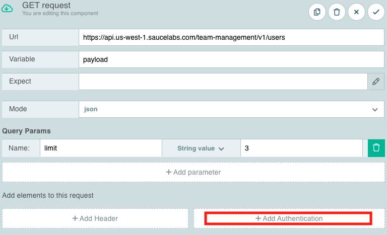
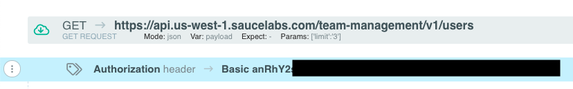
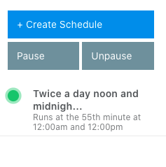

<!-- Copy this file into tools/site/coursenameFolder & start editing -->

summary: Once you have completed module 1, jump into module 2 where you will learn how to use the API Fortress Platform.
id: Module2-APITesting
categories: beginner
tags: zapi
environments: Web
status: One or more of (Draft, Published, Deprecated, Hidden)
feedback link: https://forms.gle/CGu4QchgBxxWnNJK8
analytics account: UA-86110990-1
author: James Tacker & Lindsay Walker
<!-- ------------------------ -->
# Module 2 – Run an API Fortress Test

<!------------------------------>

## 2.01 What You'll Learn
Duration: 0:02:00

**Introduction to the API Fortress Platform and Visual Test Composer**
* Create a project & test file
* Use the **HTTP Client** to generate a GET request
* Use the **Test Component Library** to create a request
* Add authorization credentials to a request
* Generate a test from a valid GET request
* View the test results
* Publish and schedule a test run

### What You'll Need
* A Sauce Labs account
* Access to the API Testing Dashboard. E-mail support.saucelabs.com or [submit a support request](https://support.saucelabs.com/hc/en-us)

<!------------------------------>
## 2.02 Introduction to API Fortress
Duration: 0:04:00

[API Fortress](https://apifortress.com/) is the API Testing Platform of Sauce Labs. We will use this platform throughout the remainder of this course. Some concepts we cover during this course require the API Fortress platform.

However, you can try and follow along using other tools like [Postman](https://www.postman.com/), and then [import your requests later on](https://docs.saucelabs.com/api-testing/quick-start/importing-postman-collections).

### Getting Started with API Fortress

If you don't have an API Fortress account, you can [create a Sauce Labs account](https://saucelabs.com/sign-up/) and get started with a free trial. You can now access [API testing](https://app.saucelabs.com/api-testing).


> **NOTE**: If you don't receive an email confirmation, check your spam folder or please email [support@saucelabs.com](mailto:support@saucelabs.com) for assistance.


#### Create a Project

For this first test project, we will test against the Sauce Labs API.

1. Log in to Sauce Labs, then click **API TESTING** > **Get Started**.
2. From the API Testing page, select the **Create Project** button.

   

3. The **New Project** pop-up window will appear.
   
   <br/>
   Input the following for each category:
    * **Create from**: select **Blank Project**
    * **Project Name**: Test Project
    * **Project Description**: Simple Test against the Sauce Labs User API
    * **Project Notes**: `https://docs.saucelabs.com/dev/api/accounts#user-methods`

4. Click **Save**.

5. This will take you to the **Tests** page of your project.

<!------------------------------>

## 2.03 Create the API Test
Duration: 0:04:00

We now have a project in which we can begin writing API Tests. Let's create the first API Test.


#### Create a Test File

We're going to test against the [Sauce Labs GET user endpoint](https://docs.saucelabs.com/dev/api/accounts/#get-users). In order to successfully create this test, we'll need to complete the following steps using the Visual Editor:
* Send an example HTTP Request using the **HTTP Client**.
* Add the **Basic Authorization Header** to our sample request.
* **Generate a Test** based on the response payload.

From the project:

1. Log in to Sauce Labs, then click [**API TESTING**](https://app.saucelabs.com/api-testing) > **Get Started**.
2. Go to your project, then select **Tests** at the top navigation bar to see the project test list.
3. From the project test list, select **+ Create Test**.
   

4. You should now see the **New Test** popup window.

   <br/><br/>

   Input the following for each category:
    * **Test Name**: `GET User Info`
    * **Test Description**: `Test for /team-management/users method`
    * **Insert a Tag**: `GET`, `user`, `team-management`

5. Now your test should appear in the project **Tests** page.

   

#### Note:

<aside class="negative">
Enter tags individually and then press Enter to submit the tag. These will be helpful down the road when you want to search or query test results by tag name.
</aside>


<!------------------------------>

## 2.04 Generate a Test
Duration: 0:04:00  

At the moment, the test content is empty. So from here, we can generate a test with the following options:
* Generate a test manually with the HTTP Client.
* Generate a test from a spec file.

For the purposes of this lesson, we will generate a test manually with the HTTP Client.

From the **Tests** page:

1. From the navigation, select **HTTP Client**.

   

2. In the empty **Enter Request url** field, input `https://api.us-west-1.saucelabs.com/team-management/v1/users?limit=3` and click **Send**.<br/>

   

You should receive the following error response to the right of the request input:
```http request
"HTTP Code 401: Authorization failed"
```


You are getting this error because you need to send an authorization header, identifying who you are in order to get a response from the GET request.

We will use this request, however, to generate a test in the next section.

#### Note:

<aside class="negative">
To try out a response that you can see (which doesn't require authorization) simply copy-paste the following into the GET request: <code>saucelabs.com/rest/v1/public/tunnels/info/versions</code>
</br>

</br>
</aside>

## 2.05 Generate a Test from GET

Lets use the test creation feature to get an authorization header that you can then add to an HTTP request to generate a test with that HTTP request.

Start with the HTTP call to the team management endpoint URL:

`https://api.us-west-1.saucelabs.com/team-management/v1/users?limit=3`


### Adding a Test Component

In the previous step, we encountered a common authentication error, **[HTTP: 401](https://developer.mozilla.org/en-US/docs/Web/HTTP/Status/401)**, because we didn't send the `username` and `accesskey` that Sauce Labs requires to communicate with their API.

To fix this error, we'll need to add our [Sauce Labs Account Credentials](https://app.saucelabs.com/user-settings) as a [Basic Authentication Header](https://developer.mozilla.org/en-US/docs/Web/HTTP/Authentication).

1. Navigate back to the **Tests** page and click to edit .
   

2. Select **+ Add Request / Assertions**.
   

3. From the dropdown list, select **GET**.<br/>

   


### Create a GET Component
1. In the next screen, recreate your **HTTP Client** request by inputting the following information:
    * **Url**: `https://api.us-west-1.saucelabs.com/team-management/v1/users`, the URL that you are retrieving data from.
    * **Variable**: `payload`, the variable where the response to GET is stored
    * **Expect**: Leave blank
    * **Mode**: `json`, the format of the information from the GET call
    * **Query Params**: under *Name*, put `limit`; under *String value*, put `3`. This sets the number of responses to a limit of 3, so that your test doesn't take too long to complete.

2. Scroll to the bottom of the window and click **Add Authentication**.
   


3. Select **Basic Authentication**.

  

4. Input your [Sauce Labs Username and Access Key](https://app.saucelabs.com/user-settings) in the relevant fields.    When you're finished, select the **green check mark** .

   


#### Note

<aside class="negative">
<strong>Your Tests will not auto-save</strong> It's important to save each time you make a change to your test and/or an HTTP Request, and it is important to <strong>click the save button each time</strong>
</br>
  
</aside>


### Copy and Paste the Encoded Auth Header

1. You'll notice that API Fortress automatically encodes and adds the [Base64 Authorization header](https://developer.mozilla.org/en-US/docs/Glossary/Base64) for you. Double-click the component to see the details:
   

2. Copy the `base64` Basic Authorization value (e.g., `Basic anRhY2s0Oxxxxxxxxxxxxxxxxxxxxxxxx==`) to your clipboard.

3. Return to the HTTP Client tab in your project.

4. Paste the `base64` Basic Authorization value into your HTTP Client **Headers** section and type `Authorization` into the _Key_ field. Also, make sure the endpoint URL (`https://api.us-west-1.saucelabs.com/team-management/v1/users?limit=3`) is still there:
   


5. Save your HTTP request in your project to use later. Name it whatever you'd like (here, it's named `GET 3 Users`):
   


6. Back in the _HTTP Client_, click the **Send** button again. To the right, you should see a `200` response code and something similar in the response headers:
   


7. Next, click the **Generate Test** button and API Fortress automagically generates a sample test based on the request data.
   

8. Enter the test details (a name such as `First GET Test` and a description), click **Save**, and then click through the prompts. You should now see a full test back in the **Tests** page.
   


9. The final step is to run your tests. From the toolbar, select **Save**, then **Run**.
   

<!------------------------------>

## 2.08 View Test Results
Duration: 0:01:00

To view your test results:

1. Look for **TEST RUNS** in the right-hand nav.

2. To open the report, you can either double-click on your test name &#8212; or &#8212; hover your mouse over your test, then click **Open report document**.

  

  

3. Review your results. Any errors encountered will show in the test results report.

  

### Troubleshooting API Test Errors

If you are getting an API test error and want to find out more about what an HTTP call you are making is returning, the **HTTP Client** (accessible from your project dashboard) can be a useful tool.

You can use the **HTTP Client** to send a request and even add in headers, such as authorization credentials, or other information.


<!-- ------------------------ -->

## 2.07 Schedule and Publish a Test
Duration: 0:04:00

If you navigate back to the **Tests** page, you may see an **Unpublished changes** message in the right-hand nav.


There's either one of two reasons for this:

* The test wasn't *published*.
* The test isn't *scheduled*.

### Publish the Working Copy
All the work we previously completed only exists as a **Working Copy**. It's basically still in *rough draft* form, and we need to publish the test in order to actually use it in production.

From the Test editing page, hover over the **Unpublished changes** message, then select the **Publish** button to publish the working copy.


Immediately, the **Publish** button turns green to indicate your test is ready for a scheduled a test run. Save your test.


### Schedule a Test

Scheduling a test basically means we can set up a recurring job (sort of like a [`cron` job](https://www.hostinger.com/tutorials/cron-job)) that can run our published tests at a specific time, along with other test parameters.

If you look on the project page where your tests are listed, you'll see a test that is published, but not scheduled, indicated by a `-` underneath the **Schedules** tab:


Below are the steps to schedule a test.

1. From the page where your projects' tests are listed, select the **Schedule Test** button. This will bring up the **Test Scheduler**.

   

2. Next, select **Create Schedule**.
   
3. In the next page, you can set the test run parameters and scheduling details, such as when and how often tests run.
   
4. Enter the desired details and when you're finished, click **Save**. Below is an example of a schedule that runs on the 55th minute at noon and midnight, during every day of every month.
   

<br/>
<br/>

If everything worked correctly:
* You should see the following status on the **Schedule** page.<br/>

  

* You will see the following on the page where the tests for your project are listed.<br/>

  


Congratulations on running, publishing, and scheduling your first API Test!

In the next module, we will take a step back and dive deeper into the API Fortress Test Component Library, where we cover such topics as:

* Adding **Assertions**
* Working with **Variables** and **Input Sets**
* Using the **The Vault**
* and more!

<!-- ------------------------ -->
## 2.07 Module 2 Quiz


