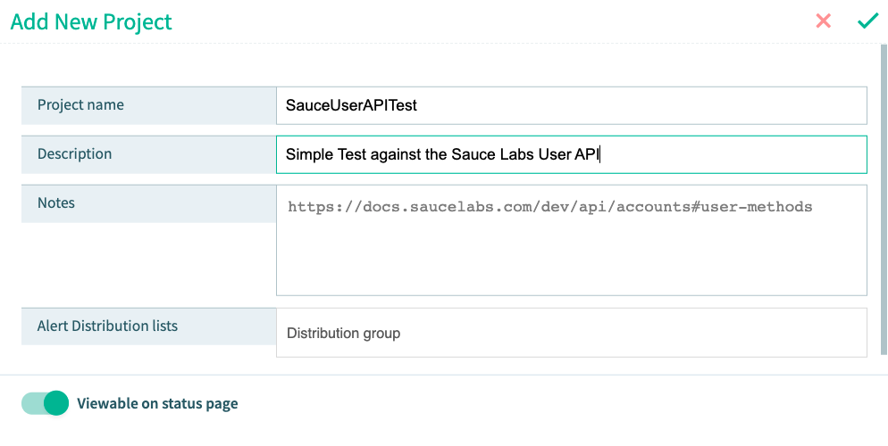
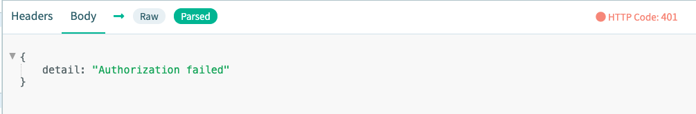
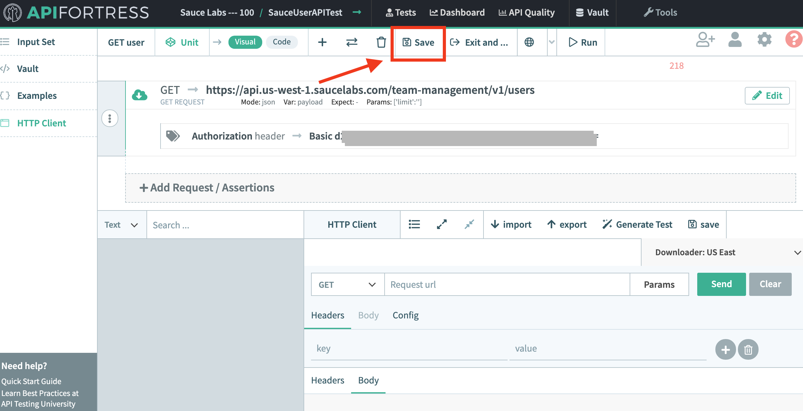

<!-- Copy this file into tools/site/coursenameFolder & start editing -->

summary: Once you have completed module 1, jump into module 2 where you will learn how to use the API Fortress Platform.
id: Module2-APITesting
categories: beginner
tags: zapi
environments: Web
status: One or more of (Draft, Published, Deprecated, Hidden)
feedback link: https://forms.gle/CGu4QchgBxxWnNJK8
analytics account: UA-86110990-1
author: James Tacker & Lindsay Walker
<!-- ------------------------ -->
# Module 2 – Run an API Fortress Test

<!------------------------------>

## 2.01 What You'll Learn
Duration: 0:02:00

1. **Introduction to the API Fortress Platform and Visual Test Composer**
   * Create a project & test file
   * Use the **HTTP Client** to generate a GET request
   * Use the **Test Component Library** to create a request
   * Add authorization credentials to a request
   * Generate a test from a valid GET request
   * View the test results
   * Publish and schedule a test run

<!------------------------------>
## 2.02 Introduction to API Fortress
Duration: 0:04:00

[API Fortress](https://apifortress.com/) is the API Testing Platform of Sauce Labs. We will use this platform throughout the remainder of this course. Some concepts we cover during this course require the API Fortress platform.

However, you can try and follow along using other tools like [Postman](https://www.postman.com/), and then [import your requests later on](https://docs.saucelabs.com/api-testing/quick-start/importing-postman-collections).

### Getting Started with API Fortress

If you don't have an API Fortress account you can [visit the API Fortress home page](https://apifortress.com/), and select the **Free Trial** button at the top to request a 30-day free trial.

After you fill out the necessary fields, you then receive an email with your login credentials for the platform.

> **NOTE**: If you don't receive an email confirmation, check your spam folder or please email [support@saucelabs.com](support@saucelabs.com) for assistance.


#### Create a Project

For this first test project we will test against the Sauce Labs API.

1. Log in to the platform
2. Select the **Create Project** button.
   
3. The **Add New Project** alert window appears.
   
   Add the following for each category:
    * **Project Name**: `SauceUserAPITest`
    * **Description**: `Simple Test against the Sauce Labs User API`
    * **Notes**: `https://docs.saucelabs.com/dev/api/accounts#user-methods`
    * **Alert Distribution lists**: Leave blank

4. When you're finished, select the **green check mark**  at the top.
5. Find your project and select the **Project Dashboard button**.
   

Upon finishing your project setup, you should see the Project Dashboard.


<!------------------------------>

## 2.03 Create an API Test File
Duration: 0:04:00

We now have a project in which we can begin writing API Tests. Let's create the first API Test!

#### Note:
Negative
: You must have an [API Fortress account](https://apifortress.com/) in order to follow along in this step. [Use this link](https://saucelabs.com/sign-up) to sign up for a free trial. If you have an account, [Sign In](https://mastiff.apifortress.com/app/web/login/auth).


#### Create a Test File

We're going to test against the [Sauce Labs GET user endpoint](https://docs.saucelabs.com/dev/api/accounts#get-users). In order to successfully create this test we need to complete the following steps using the [Visual Test Composer](https://docs.saucelabs.com/api-testing/learn-more/working-with-the-response-object/index.html#visual-composer-view) view:
* Send an example HTTP Request using the **HTTP Client**
* Add the **Basic Authorization Header** to our sample request
* **Generate a Test** based on the response payload.

From the project dashboard:

1. Select **Tests** at the top of the screen in order to navigate to the project test list
   


2. From the project test list, select **+New Test**
   


3. You should now see the new **Test Details** alert window
   
   Add the following for each category:
    * **Test Name**: `GET user`
    * **Description**: `Test for the GET Method`
    * **Tags**: `get`, `user`


4. When you're finished, select the **green check mark**  at the top.


5. Now you should see the **Test Status** / **Interstitial** page.
   

<!------------------------------>

## 2.04 Generate a Test
Duration: 0:04:00  

At the moment, the test content is empty, so we need to [generate a test](https://docs.saucelabs.com/api-testing/quick-start#step-3-create-an-http-request). From here there are two ways to generate a test:
* Generate a test manually with the HTTP Client
* Generate a test from a spec file.

For the purposes of this lesson, we will generate a test manually.

From the Interstitial page:

1. Select **Compose** at the bottom of the page.
   


2. Now you arrive at the [Visual Test Composer](https://docs.saucelabs.com/api-testing/quick-start/composer) page.
   
   In order to create tests we first need to submit a sample HTTP API request.


3. At the bottom of the UI, enter the following URL where it says **Request url** in the **HTTP Client**:
   ```
   https://api.us-west-1.saucelabs.com/team-management/v1/users?limit=3
   ```
   


4. Select the **Send** button:

   

   You should receive the following error response:
   ```http request
   "HTTP Code 401: Authorization failed"
   ```
   


#### Note:

Negative
: To see the raw response body in the HTTP Client select **Body** and then either *Raw* or *Parsed*

### Adding a Test Component
Lets add a GET component that makes a successful API call against the Sauce Labs REST API.

In the previous step we encountered a common authentication error, **[HTTP: 401](https://developer.mozilla.org/en-US/docs/Web/HTTP/Status/401)**, because you didn't send the `username` and `accesskey` that Sauce Labs requires to communicate with their API. In order to fix this error we must add our [Sauce Labs Account Credentials](https://app.saucelabs.com/user-settings) as a [Basic Authentication Header](https://docs.saucelabs.com/api-testing/how-to/authorization-simple-oauth-etc/index.html#overview).

1. At the top of the Test Composer page, select the plus symbol to **add a new request component**:
   


2. From the dropdown list, select **GET**:

   


### Create A GET Component
1. In the next screen, recreate your HTTP Client request with the following information
   
    * **Url**: `https://api.us-west-1.saucelabs.com/team-management/v1/users` – The URL that you are retrieving data from
    * **Variable**: `payload` - The variable where the response to GET is stored
    * **Expect**: Leave blank
    * **Mode**: `json` - The format of the information from the GET call
    * **Query Params**: *Name*: `limit` *String value*: `3` – Sets the number of responses to a limit of 3 so your test doesn't take too long

2. Then select **Add Authentication** at the bottom right.
   


3. Select **Basic Authentication**, then add your [Sauce Labs Username and Access Key](https://app.us-west-1.saucelabs.com/user-settings) in the relevant fields.    When you're finished, select the **green check mark**  in the top right.

   

   


#### Note
Negative
: It's important to save each time you make a change to your test.   


### Copy and Paste the Enocded Auth Header
1. You'll notice that API Fortress automagically encodes and adds the Authorization header for you. Double-click the component to see the details:
   


2. Copy and paste the details in your HTTP Client **Headers** section, and make sure the endpoint URL `https://api.us-west-1.saucelabs.com/team-management/v1/users` is still there:
     


3. Select the **Send** button again, and you should see something similar to below in the response body:
   


4. Next, select the **Generate Test** button and API Fortress automagically generates a sample test based on the request data.
   


5. Click through the prompts, and you should now see many tests in the Visual Test Composer Window.
   


6. The final step is to run your tests. At the top of the Visual Test Composer, select **Save** then **Run**
   

<!------------------------------>

## 2.05 View Test Results
Duration: 0:04:00

If your previous step ran without any errors you should see the following test results page:


You can also view the specific response details by clicking on **See More** next to the input set details:


The next page displays all the request and response details, including the headers and raw body in JSON format:


To see the response body select Load Source


This outputs the following:


<!-- ------------------------ -->

## 2.06 Schedule and Publish a Test
Duration: 0:04:00

If you navigate back to the Test Status / Intersitial page, you may notice that Test Status is not complete. There's either one of two reasons for this:

* The test wasn't *published*
* The test isn't *scheduled*

### Publish the Working Copy
All the work we previously completed only exists as a **Working Copy**. It's basically still in *rough draft* form, and we need to publish the test in order to actually use it in production.

From the Intersitial page, select the **Publish** button to publish the working copy.


Immediately, both the Publish button adn the Clear Working Copy button become greyed out. The next step is to schedule a test run.

### Schedule a Test

Scheduling a test basically means we can set up a recurring job (sort of like a [`cron` job](https://www.hostinger.com/tutorials/cron-job)) that can run our published tests at a specific time, along with other test parameters. A test that is published but not scheduled is indicated on the Intersitial page with the following icon:


Below are the steps to schedule a test.

From the Intersitial page, select the **Schedule** button:

   

You should now see the **Test Scheduler**:

1. Next select **Create New Run**
   
3. From this page, you can set the test run parameters and scheduling details such as when and how often the test runs. For this example we've set the test to run twice a day, every other day, for each month. We've also indicated that if a test failure occurs to try again after 2 minutes and 30 seconds.
   
4. When you're finished, select **Save Run** in the upper right corner:

   

If everything worked correctly, you should see the following status on the Intersitial page for your test:


#### Note:
Negative
: You may see the notification that you "**won't be notified when a test failure occurs**". If you want to correct this issue feel free to read the documentation for [setting up alert notifications](https://docs.saucelabs.com/api-testing/quick-start/dashboard/index.html#set-alerts).

Congratulations on running, publishing, and scheduling your first API Test!

In the next module, we will take a step back and dive deeper into the API Fortress Test Component Library where we cover such topics as:

* Adding **Assertions**
* Working with **Variables** and **Input Sets**
* Using the **The Vault**
* and more!

<!-- ------------------------ -->
## 2.07 Module 2 Quiz


