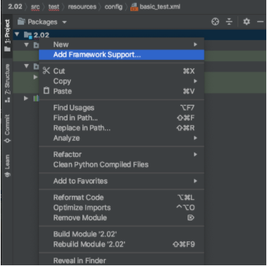
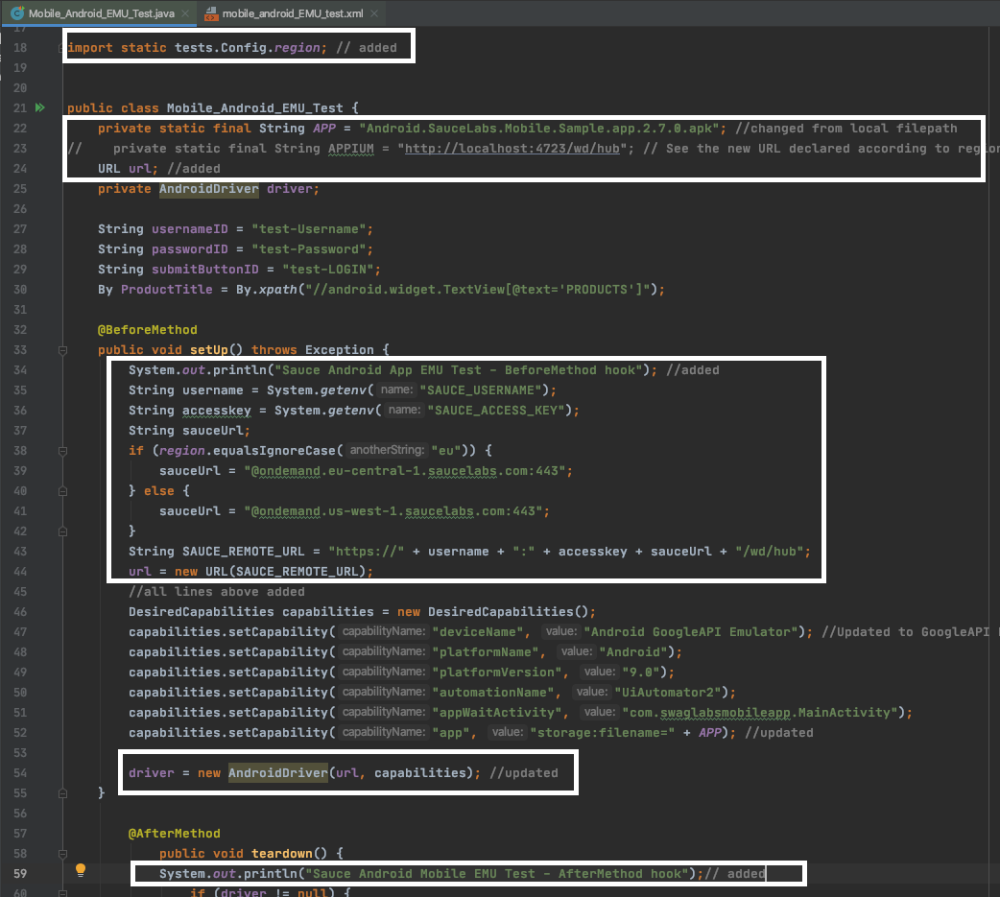
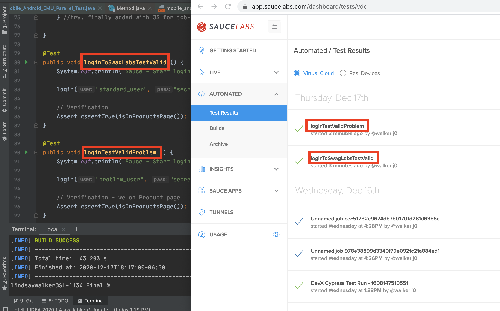

<!-- Copy this file into tools/site/coursenameFolder & start editing -->

summary: Module 2 of the Sauce Labs Quickstart, this section on Android Mobile Emulator Tests goes over how to test Android mobile apps and browsers with the Appium test runner on Sauce Labs virtual machines.
id: Module2_Quickstart
categories: intermediate
tags: quickstart
environments: Web
status: Draft
feedback link: https://forms.gle/CGu4QchgBxxWnNJK8
author:Lindsay Walker, Eyal Yovel
<!-- ------------------------ -->
# Module 2 – Android Mobile Emulator Tests

<!-- ------------------------ -->
## 2.01 What You’ll Learn
Duration: 0:01:00

There are many possibilities for testing in[ Sauce Labs](http://app.saucelabs.com/?utm_source=referral&utm_medium=LMS&utm_campaign=link), and in this module we will cover two specific cases: Testing an Android mobile application, and testing an Android mobile  web application on the Sauce Labs Emulators. Both of these tests will be created using the Appium driver, Java, and the TestNG testing library, and will be run against virtual devices and browsers on Sauce Labs. IOS is not covered in this module, nor are tests written in Espresso, as you need a different environment to test locally, and would need to upload your project file Sauce Labs in a different way.


### Skills & Knowledge

* Learn about how to set up your environment to set up an Appium Mobile App test on your machine using Appium and Android Studio, among other tools.
* Understand the elements of an Appium Android mobile app test suite and run it locally, understanding how all the elements of code in a simple test suite interact
* Learn about how an Appium test suite is written with the TestNG testing framework and run tests using Maven and TestNG `xml` files.
* Update the configuration to run an Appium Android Mobile app test suite on Sauce Labs by uploading your app, and adding the information to run your test including app name or URL, `SAUCE_USERNAME`, and `SAUCE_ACCESS_KEY`
* Update capabilities and test code to run both an Appium Android mobile app test and an Appium Android mobile browser test on Sauce Labs.
* Add features to your test suite using the Sauce Options (capabilities) that allow you to add names, session IDs, and pass fail conditions
* Add in the capabilities `extendedDebugging` and `capturePerformance == "true"`, then use Sauce Performance to view resources that are loaded with the network tab in automated test results.
* Add in features to the test code and TestNG `xml` file, and set your test to run tests in parallel for Android Appium app test.

<!-- ------------------------ -->
## 2.02 Set Up a Local Android Test Environment
Duration: 0:010:00

This module is created to walk you through the steps you need to take to get a test running on [Sauce Labs.](http://app.saucelabs.com/?utm_source=referral&utm_medium=LMS&utm_campaign=link) You will start with a local test running on the Appium Server, using the Android Studio device emulator. If you would like to follow along, you can start here with the example application and Appium Test code to run on your local machine, or skip ahead to the next module to start running tests on Sauce Labs.


### Resources
Download the following resources on your computer:
<<<<<<< HEAD
* [Android Test Code](https://github.com/walkerlj0/Quickstart_Android). See the _/Mod2/2.03_ folder to follow along starting on the next module.
=======
* [Android Test Code](https://github.com/walkerlj0/Quickstart_Android). See the _/Mod2/2.03_ to follow along starting on the next module.
>>>>>>> master
* Swag Labs [Android Native Demo App](https://github.com/saucelabs/sample-app-mobile/releases)
    * Scroll down and find the **Android.SauceLabs.Mobile.Sample.app.x.x.x.apk** file. Choose the latest version you can find.


#### Note
Negative
: These instructions are not intended to show you how to write Android applications or Appium test code. The exercises here are intended to give instructions on how to start with test code written in Appium and Java, run it locally, and configure those same tests to run on Sauce Labs. If you would like to learn more about writing Appium tests, the course on [Mobile Testing with Appium](https://www.linkedin.com/learning/mobile-testing-with-appium) by Jonathan Lipps is a great place to start.

#### Video
**[Android Appium Project Setup](https://drive.google.com/file/d/1zPv5ljFd-EM6-_CjB79h4uzwDgG1xre1/view?usp=sharing)**


### Dependencies

To run a local test, you will need to set up and install the following:


* Appium
    * [Appium Desktop App](https://github.com/appium/appium-desktop/releases) or
    * Appium Server: [Set it up ](https://www.swtestacademy.com/how-to-install-appium-on-mac/)with Android Studio
* JDK 8 or higher
* [Android Studio](https://developer.android.com/studio)
* [Appium Doctor](https://github.com/appium/appium-doctor)
    * `npm install appium-doctor -g`
* [Maven build tool](https://maven.apache.org/)
* An IDE to edit test code like [IntelliJ Community Edition](https://www.jetbrains.com/idea/download/)

If you would like step-by-step instructions to help with the dependencies above, there are lessons in the Selenium Java Course:


* [How to set up your environment ](https://training.saucelabs.com/codelabs/Module1-SeleniumJava/index.html?index=..%2F..SeleniumJava#4)with Java, Maven, and IntelliJ
* [Create your first project file in IntelliJ](https://training.saucelabs.com/codelabs/Module2-SeleniumJava/index.html?index=..%2F..SeleniumJava#5)

See instructions for [setting up your Windows environment here](https://docs.google.com/document/d/1herzHbTJdQpa-hAIR5llTfbbw20PeM99-BAoVTeuC8U/edit?usp=sharing).


### Appium

Appium was built off of the Selenium library to extend testing capabilities to include things you can only do on a mobile device or application. With Appium you are able to do more, with capabilities like pinching and zooming the way you would on a mobile device screen, and scanning a QR code with a native mobile application.

You can see Appium commands within the BasicTest.java class, such as


```
WebElement passwordEdit = driver.findElementByAccessibilityId(passwordID);
    passwordEdit.click();
    passwordEdit.sendKeys(pass);
```


Notice how in this example, you find an element by the accessibility ID, which is a unique locator for Appium.

Appium is also using the new W3C WebDriver Protocol (changed from the JSON Wire Protocol) This is an agreed-upon protocol to support web automation that means that commands sent will be implemented in the same way for different browsers. It also makes it easier to use Appium because a new set of functionality such as multi-touch actions and zooming are supported.


### Getting It Running

To run an app on your local machine, first install all the dependencies above and download the resources. If you are unfamiliar with using Appium and Android Studio to create an emulator and environment to run your tests against, use the following cheat sheet.


#### Cheat Sheet

[Quickstart – Android Studio and Appium Environment Setup](https://docs.google.com/document/d/1Q1b744PYJs7aMmpiUfgHPpnjB5SKG3nMKqWx8bYfEUs/edit?usp=sharing)


#### Appium Doctor

Appium Doctor is a useful tool for checking to make sure that the dependencies and necessary variables are set correctly for your native test to run. Simply install it and run the command `appium-doctor. `


Check to make sure all your dependencies for Appium are installed, such as `NodeJS `and the `ANDROID_HOME` and` JAVA_HOME` variables are correct. In this example, the` xcrun` dependency isn’t installed, which is a necessary dependency for iOS tests.


### Basic Local Run Steps

Once you have everything downloaded and installed, you need to do the following before you can run your code:

Open **Android Studio** and start an emulator.


* Go to **Tools > AVD Manager**


* In the AVD manager window, click on the green run arrow next to one of the emulators you have set up. Note the version of Android in the **Target** column.


* Open Appium and make sure you have the `JAVA_HOME` and `ANDROID_HOME` paths set.
* Click the **Start Server** button on Appium Desktop.

Now you are ready to get your first local test running for an Android test.

<!-- ------------------------ -->
## 2.03 Basic Test Code Overview
Duration: 0:10:00

### Test Suite Components

The local Appium test is made up of a few basic files. We will use and edit all of them as we add capabilities to the Android app tests. This example uses the Java programming language, the TestNG testing framework, Appium commands, and the Maven resource manager. You will need to update code` tests/BasicTest.java`, `pom.xml`, and `/resources/config/basic_test.xml `to get your tests started.


### Test Code Overview
You can see an [example of the project code here.](https://github.com/walkerlj0/Quickstart_Android/tree/master/Mod2/2.03)

The first thing you need to know is which capabilities are required to run a test using Appium and a local Android Device:


* `PlatformName `(Android)
* `PlatformVersion `(‘9.0’)
* `deviceName `(Android Emulator or ‘Pixel 4’)
* `app` (path to where app is stored)
* `automationName` (which driver you are using to run the test)


#### Video

**[BasicTest Overview](https://drive.google.com/file/d/1JWkb9BjqoHpGbXerTko48EHYWXAI-8fZ/view?usp=sharing)**


#### Note
Negative
: React Native apps (which is the type of app you are using in this example) also require the `appWaitActivity `or `appActivity` set to the the name of the first activity (the “screen” or class that is invoked when the app is started) that your application lands on. With this capability your app knows which view should be loaded before initializing the test, which is not always communicated with React applications.

You can use the **Start Inspector Session** button to test your capabilities in Appium Desktop.


**pom.xml –** This file contains the libraries and configurations used by Maven to build the project. The versions for important dependencies, such as Appium, TestNG, logging, and Sauce Labs are included in this file. Any dependency you want to import in your project classes are specified here. You can easily update the variable with the version number in the `properties` tag at the top.


**mobile_native_local_test.xml –** This is a file used by the TestNG framework to organize how tests are executed, and which tests in your suite are run.  With this file you can set the order of tests run, add parallelization, reporting, [and more](https://www.softwaretestinghelp.com/testng-example-to-create-testng-xml/#:~:text=xml%3F-,TestNG.,it%20under%20one%20XML%20file.).  

**Mobile_Native_Local_Test.java –** This is the main test file where all capabilities are set. Although it is not good practice, for the sake of a simple example, this includes all capabilities that communicate information about where and how the test is run, as well as all test method declaration and implementation.

Access the Base Code in this [GitHub repo](https://github.com/walkerlj0/Quickstart_Android), or create a new Maven project like the one pictured below. Note that `/test/java/tests/config` will be added to later. If you are using IntelliJ to set up your project, `pom.xml` should be created for you.


### Create Your Project

This course will demonstrate using the IntelliJ IDEA code editor, which allows you to set up a project using Maven and JDK 1.8. If you are setting up a new project, and copying and pasting the code, you will need to choose Maven as a build tool and choose a Java SDK you have as you set up the project.


### Final Code

You can see an [example of the project code here.](https://github.com/walkerlj0/Quickstart_Android/tree/master/Mod2/2.03)


#### Note
Negative
: If you are cloning a project, follow these steps (after you have uploaded `pom.xml`):

Negative
: * Right-click on the project name and choose **Add Framework Support**. 

Negative
: * Choose **Maven** as a build tool.

Negative
: * Go to **File > Project Structure**.

Negative
: * Select a JDK that you have installed on your machine.

Negative
: * Choose **File > Invalidate Caches and Restart** so the changes can take effect. 

Negative
: Once you have all your directories and files set up, add the following code to your test files.

### Update pom.xml
Add your configuration into `pom.xml`. You may need to invalidate and restart again to activate the imports:


```
// filename: pom.xml
// ...
<?xml version="1.0" encoding="UTF-8"?>
<project xmlns="http://maven.apache.org/POM/4.0.0"
         xmlns:xsi="http://www.w3.org/2001/XMLSchema-instance"
         xsi:schemaLocation="http://maven.apache.org/POM/4.0.0 http://maven.apache.org/xsd/maven-4.0.0.xsd">
    <modelVersion>4.0.0</modelVersion>

    <groupId>org.example</groupId>
    <artifactId>SauceAppiumSample</artifactId>
    <version>1.0-SNAPSHOT</version>

    <properties>
        <testngXmlDir>src/test/resources/config</testngXmlDir>
        <testngXmlFile>basic_test.xml</testngXmlFile>
        <testng.version>6.14.3</testng.version>
        <commons-logging.version>1.2</commons-logging.version>
        <selenium.version>3.141.59</selenium.version>
        <maven-failsafe-plugin.version>2.19.1</maven-failsafe-plugin.version>
        <sauce.version>1.0.44</sauce.version>
        <appium.version>7.2.0</appium.version>
    </properties>

    <dependencies>

        <dependency>
            <groupId>org.testng</groupId>
            <artifactId>testng</artifactId>
            <version>${testng.version}</version>
        </dependency>

        <!-- Selenium -->
        <dependency>
            <groupId>org.seleniumhq.selenium</groupId>
            <artifactId>selenium-api</artifactId>
            <version>${selenium.version}</version>
        </dependency>

        <dependency>
            <groupId>org.seleniumhq.selenium</groupId>
            <artifactId>selenium-java</artifactId>
            <version>${selenium.version}</version>
        </dependency>

        <!-- Apache Commons Logging -->
        <dependency>
            <groupId>commons-logging</groupId>
            <artifactId>commons-logging</artifactId>
            <version>${commons-logging.version}</version>
        </dependency>

        <dependency>
            <groupId>org.hamcrest</groupId>
            <artifactId>hamcrest-core</artifactId>
            <version>1.3</version>
        </dependency>

        <dependency>
            <groupId>log4j</groupId>
            <artifactId>log4j</artifactId>
            <version>1.2.17</version>
        </dependency>

        <dependency>
            <groupId>org.assertj</groupId>
            <artifactId>assertj-core</artifactId>
            <version>3.10.0</version>
        </dependency>

        <dependency>
            <groupId>com.saucelabs</groupId>
            <artifactId>saucerest</artifactId>
            <version>${sauce.version}</version>
        </dependency>

        <dependency>
            <groupId>io.appium</groupId>
            <artifactId>java-client</artifactId>
            <version>${appium.version}</version>
        </dependency>

    </dependencies>

    <build>
        <plugins>
            <plugin>
                <groupId>org.apache.maven.plugins</groupId>
                <artifactId>maven-surefire-plugin</artifactId>
                <version>3.0.0-M4</version>
                <configuration>
                    <suiteXmlFiles>
                        <suiteXmlFile>${testngXmlDir}/${testngXmlFile}</suiteXmlFile>
                    </suiteXmlFiles>
                </configuration>
            </plugin>
            <plugin>
                <artifactId>maven-compiler-plugin</artifactId>
                <version>3.0</version>
                <configuration>
                    <source>1.8</source>
                    <target>1.8</target>
                </configuration>
            </plugin>
        </plugins>
    </build>

</project>

```


### Update Test Files

Add the following to `BasicTest.java`: under the APP variable, and add the absolute file path to where the `.apk` file for the Swag Labs App is stored on your local machine.


```
// filename: /test/java/tests/BasicTest.java
// ...
package tests;

import io.appium.java_client.MobileBy;
import io.appium.java_client.android.AndroidDriver;
import org.openqa.selenium.By;
import org.openqa.selenium.TimeoutException;
import org.openqa.selenium.WebElement;
import org.openqa.selenium.remote.DesiredCapabilities;
import org.openqa.selenium.support.ui.ExpectedConditions;
import org.openqa.selenium.support.ui.WebDriverWait;
import org.testng.Assert;
import org.testng.annotations.AfterMethod;
import org.testng.annotations.BeforeMethod;
import org.testng.annotations.Test;

import java.net.URL;


public class BasicTest {

    private static final String APP = "/Users/lindsaywalker/Documents/Example_Tests/Android.SauceLabs.Mobile.Sample.app.2.7.0.apk";
    private static final String APPIUM = "http://localhost:4723/wd/hub";

    private String sessionId;
    private AndroidDriver driver;

    String usernameID = "test-Username";
    String passwordID = "test-Password";
    String submitButtonID = "test-LOGIN";
    By ProductTitle = By.xpath("//android.widget.TextView[@text='PRODUCTS']");

    @BeforeMethod
    public void setUp() throws Exception {
        DesiredCapabilities capabilities = new DesiredCapabilities();
        capabilities.setCapability("deviceName", "Android Emulator"); //This will change to type of device e.g. Pixel 4 on Saucelabs
        capabilities.setCapability("platformName", "Android");
        capabilities.setCapability("platformVersion","9.0" ); //add platformVersion
        capabilities.setCapability("automationName", "UiAutomator2");
        capabilities.setCapability("appWaitActivity", "com.swaglabsmobileapp.MainActivity");
        capabilities.setCapability("app", APP);


        driver = new AndroidDriver(new URL(APPIUM), capabilities);

    }

    @AfterMethod
    public void tearDown() {
        if (driver != null) {
            driver.quit();
        }

    }

    @Test
    public void loginToSwagLabsTestValid() {
        System.out.println("Sauce - Start loginToSwagLabsTestValid test");

        login("standard_user", "secret_sauce");

        // Verification
        Assert.assertTrue(isOnProductsPage());
    }

    @Test
    public void loginTestValidProblem() {
        System.out.println("Sauce - Start loginTestValidProblem test");

        login("problem_user", "secret_sauce");

        // Verification - we on Product page
        Assert.assertTrue(isOnProductsPage());
    }

    public void login(String user, String pass){

        WebDriverWait wait = new WebDriverWait(driver, 5);
        final WebElement usernameEdit = wait.until(ExpectedConditions.visibilityOfElementLocated(new MobileBy.ByAccessibilityId(usernameID)));

            usernameEdit.click();
            usernameEdit.sendKeys(user);

        WebElement passwordEdit = driver.findElementByAccessibilityId(passwordID);
            passwordEdit.click();
            passwordEdit.sendKeys(pass);

        WebElement submitButton = driver.findElementByAccessibilityId(submitButtonID);
            submitButton.click();
    }

    public boolean isOnProductsPage() {
        //Create an instance of a Appium explicit wait so that we can dynamically wait for an element
        WebDriverWait wait = new WebDriverWait(driver, 5);

        //wait for the product field to be visible and store that element into a variable
        try {
            wait.until(ExpectedConditions.visibilityOfElementLocated(ProductTitle));
        } catch (TimeoutException e){
            System.out.println("*** Timed out waiting for product page to load.");
            return false;
        }
        return true;
    }
}

```


Add the following to `basic_test.xml`:


```
// filename: basic_test.xml
// ...
<!DOCTYPE suite SYSTEM "http://testng.org/testng-1.0.dtd">
<suite name="Android Mobile Demo Suite">

    <test name="Simple execution tests Android">
        <classes>
            <class name="tests.BasicTest"/>
        </classes>
    </test>
</suite>


```


Once you have the first project configured, you can start Appium desktop and an Android emulator and run your test, using the command `mvn clean test.`


<!-- ------------------------ -->
## 2.04 Android Emulator Test on Sauce Labs
Duration: 0:20:00

The first thing you will do with your BasicTest is to add the configurations and capabilities to run that test on a Sauce Labs emulator.

To do this tutorial, start with the **[Basic Test](https://github.com/walkerlj0/Quickstart_Android/blob/master/Mod2/2.04/src/test/java/tests/BasicTest.java)** and follow along to make the changes.


#### Video
**[Sauce Labs Mobile App Emulator Test](https://drive.google.com/file/d/1-bZbImCfdiuvGJxlLEtTG8C3_Fc7qEw4/view?usp=sharing)**


### Create Environment Variables for Sauce Labs

The first thing you should do when creating a test is set up environment variables on your local machine in the (.zshrc or .bash profile). It is important to save your Sauce username and access key as environment variables, instead of coding them into your test, so that when you share your tests or upload them to Github, your private access keys aren’t shared.

It will also make transitioning to a continuous integration pipeline easier, since they will use the same environment variables.  Watch [this video](https://drive.google.com/file/d/1qezKtvBpn94bBTJgbAd2MSx4ByNx7oaz/view?usp=sharing) to learn how to set up environment variables with your Sauce Labs credentials on a Mac, or view the [instructions for Windows](https://docs.google.com/document/d/1Cb27j6hgau5JHmAxGHPihd3V4Og3autPCei82_m1Ae8/edit?usp=sharing).

### Upload the .apk File to Mobile-Apps

To upload the `.apk` project file, you simply have to visit the [Sauce Labs dashboard,](http://app.saucelabs.com/?utm_source=referral&utm_medium=LMS&utm_campaign=link) click on **Live > Mobile APP**, and then click the **App Upload** button.


In the dropdown that appears, click and drag the `.apk` file for your mobile test.


Once you have uploaded the .apk file, you can hover over it in the list below and then click **Settings**.


Here you can see the ID for the app, which can be used in your test code to identify the app, though you can also use the name of the file that you uploaded.


### Create a New Test

First, we will create a separate test file, based on `BasicTest.java`. The first thing you need to do is create a new class and a new xml file. Name the test `Mobile_Android_EMU_Test.java` (create a new Java class) within the config folder. The EMU stands for emulator, which is what we will be running our test on (as opposed to a real device). Name the TestNG xml file `mobile_android_EMU_test.xml`.


Lastly, update the `pom.xml` in the `properties` tag where you see the `<testNGxml file> `tag to say `mobile_android_EMU_test.xml`. Now, TestNG will run that test when you run the `mvn clean test` command in terminal.


### Copy Code

Now, you will copy the code from the original `BasicTest` and the TestNG XML file, and update it to work for the new test. Copy all the code inside `basic_test.xml`, and paste it inside `mobile_android_EMU_test.xml`

Inside the `mobile_android_EMU_text.xml` file in the class name tag, edit the test name to be your new test name:


```
// filename resources/config/mobile_android_EMU_text.xml
<!DOCTYPE suite SYSTEM "http://testng.org/testng-1.0.dtd">
<suite name="Android Mobile Demo Suite">

    <test name="Simple Emulator Test Android" >
        <classes>
            <class name="tests.Mobile_Android_EMU_Test"/>
        </classes>
    </test>
</suite>

```


Next, copy all the code inside public class BasicTest, and paste it inside public class `Mobile_Android_EMU_Test.java `(everything should be the same except for the class name):


```
// filename test/java/tests/Mobile_Android_EMU_Test.java
package tests;

import io.appium.java_client.MobileBy;
import io.appium.java_client.android.AndroidDriver;
import org.openqa.selenium.By;
import org.openqa.selenium.TimeoutException;
import org.openqa.selenium.WebElement;
import org.openqa.selenium.remote.DesiredCapabilities;
import org.openqa.selenium.support.ui.ExpectedConditions;
import org.openqa.selenium.support.ui.WebDriverWait;
import org.testng.Assert;
import org.testng.annotations.AfterMethod;
import org.testng.annotations.BeforeMethod;
import org.testng.annotations.Test;

import java.net.URL;


public class Mobile_Android_EMU_Test {

    private static final String APP = "/Users/lindsaywalker/Documents/Example_Tests/Android.SauceLabs.Mobile.Sample.app.2.7.0.apk";
    private static final String APPIUM = "http://localhost:4723/wd/hub";

    private AndroidDriver driver;

// ...

```


 Now we will add some elements to our test so it can run on [Sauce Labs](http://app.saucelabs.com/?utm_source=referral&utm_medium=LMS&utm_campaign=link).


### Configure for Sauce Labs

One important thing that you need to add to this is the data center that your test is going to run on. If you log into the [Sauce Labs dashboard](https://accounts.saucelabs.com/?utm_source=referral&utm_medium=LMS&utm_campaign=link), you will see there are different options for where to run your test.


We will add these options in the `test/Config.java` file first to set it to run in the US:


```
// filename test/java/tests/Config.java
package tests;

public class Config {
    public static final String region = System.getProperty("region", "us");

}

```


Next, in `Mobile_Android_EMU_Test.java `under `import java.net.URL`, add in the following:


```
// filename test/java/tests/Mobile_Android_EMU_Test.java
//...
import java.net.URL;

import static tests.Config.region; // added

public class Mobile_Android_EMU_Test {
// ...
```


Later on, in the `@BeforeMethod` annotation, we will set up the `url` to point to the correct region.

Next you are going to change the variables `APP` and `APPIUM`. You will no longer need the `APPIUM` link, since we will be connecting to Sauce Labs and constructing the URL in the `@BeforeMethod`. We will change the `APP` variable to simply read the name of the app that you uploaded to Sauce Lab. The first four lines of the class should now look like this:


```
// filename test/java/tests/Mobile_Android_EMU_Test.java
//...
public class Mobile_Android_EMU_Test {
    private static final String APP = "Android.SauceLabs.Mobile.Sample.app.2.7.0.apk"; // changed from local
    URL url; //added, deleted APPIUM
    private AndroidDriver driver;
// ...
```


Note that your app name may be different. Check to see what the name of it is when you upload it to Sauce Labs.

Next you will update the `@BeforeMethod `with some information to print to the console with the `System.out.println()`method and configurations to connect to Sauce Labs. In the `setup()` method, add in the following, above the `DesiredCapabilities`:


```
// filename test/java/tests/Mobile_Android_EMU_Test.java
//...
    public void setUp () throws Exception {
        System.out.println("Sauce Android EMU App Test - Parallel - BeforeMethod hook");       
        String username = System.getenv("SAUCE_USERNAME"); // added
        String accesskey = System.getenv("SAUCE_ACCESS_KEY"); /added
        String sauceUrl;
            if (region.equalsIgnoreCase("eu")) {
                sauceUrl = "@ondemand.eu-central-1.saucelabs.com:443";
            } else {
                sauceUrl = "@ondemand.us-west-1.saucelabs.com:443";
            }
        String SAUCE_REMOTE_URL = "https://" + username + ":" + accesskey + sauceUrl + "/wd/hub"; // if else statement added
        url = new URL(SAUCE_REMOTE_URL); /added
// ...
```


Notice how in the variable `SAUCE_REMOTE_URL` the username, access key, and sauceURL are all put together to create the access point, and then how a `url` is instantiated using `SAUCE_REMOTE_URL` for each test. After you set the correct capabilities for Sauce Labs, you will use the `url` variable when we instantiate a driver for the test.


### Capabilities

The capabilities that you have in `BasicTest.java` are very similar to the capabilities you need to run an Android emulator test on Sauce Labs. Not much has changed, since you were essentially running the same thing on your computer.

Update the `DesiredCapabilities` in the `before()` method to edit the following two things:


```
// filename test/java/tests/Mobile_Android_EMU_Test.java
//...
  DesiredCapabilities capabilities = new DesiredCapabilities();
        capabilities.setCapability("deviceName", "Android GoogleAPI Emulator"); //Changed to GoogleAPI Emu
        capabilities.setCapability("platformName", "Android");
        capabilities.setCapability("platformVersion", "8.0");
        capabilities.setCapability("automationName", "UiAutomator2");
        capabilities.setCapability("appWaitActivity", "com.swaglabsmobileapp.MainActivity");
        capabilities.setCapability("app", "storage:filename=" + APP); //changed
        driver = new AndroidDriver(url, capabilities); // changed, removed APPIUM and replaced with url

// ...
```


*   The `"app"` capability has changed to add in the sterling `"Storage:filename="` and concatenates together with the `APP` variable. Secondly, the driver instantiation has changed from `driver = new AndroidDriver(new URL(APPIUM), capabilities)`; to `driver = new AndroidDriver(url, capabilities);`.
*   The driver is now created for each, and instead of having to declare a new <code>[URL class](https://docs.oracle.com/javase/7/docs/api/java/net/URL.html)</code>, we can use the url variable that creates a new <code>SAUCE_REMOTE_URL.</code>
*   The capabilities <code>"deviceName"</code>, <code>"platformName</code>”, and <code>"platformVersion</code>” are the other required capabilities.


### Add Test Log Information

The last thing you will do is add some simple outputs for when your test is run, and help you debug. This way you will know if your `before()` and `after()` methods are being run for each test, and give you some feedback to help you debug.


At the beginning of your `setup()` method, add in a `println()` like so:


```
// filename test/java/tests/Mobile_Android_EMU_Test.java
//...
     public void setUp () throws Exception {
        System.out.println("Sauce Android Mobile - BeforeMethod hook"); //added

// ...
```


Do the same for your `teardown()` method:


```
// filename test/java/tests/Mobile_Android_EMU_Test.java
//...
    public void teardown() {
            System.out.println("Sauce Android Mobile EMU Test - AfterMethod hook");// added

// ...
```


Now you can run your tests in the terminal using `mvn clean test `and login to the [Sauce Labs Automated Test Results dashboard](https://app.saucelabs.com/dashboard/tests/vdc/?utm_source=referral&utm_medium=LMS&utm_campaign=link) and see the results.


#### Final Code

You can see an [example of the project code here.](https://github.com/walkerlj0/Quickstart_Android/tree/master/Mod2/2.04)




### Quiz


<!-- ------------------------ -->
## 2.05 Android Web Browser Test on Sauce Labs
Duration: 0:15:00

Configuring and running a local test to run as an Android web browser test is very similar to running a mobile test on the [Sauce Labs](http://app.saucelabs.com/?utm_source=referral&utm_medium=LMS&utm_campaign=link) emulator platform. The only difference here is that we will run the test in the browser instead of on an app that you install.

To do this tutorial, start with the **[Basic Test](http://BasicTestLink.com)** and follow along to make the changes.


#### Video

[Sauce Labs Mobile Browser Test](https://drive.google.com/file/d/1-M-S3lMh1Jvs__DPMvOlnzWW_-QLLxqa/view?usp=sharing)


#### Note
Negative
: If you are simply modifying an Appium test that is already configured to run on an Emulator on Sauce Labs, all you need to do is remove the `"app" `and `"appWaitActivity" `capabilities, then add in a `mobile_android_browser_test.xml` file and update the `pom.xml `to run based on that file.


### Create Environment Variables for Sauce Labs

Before you can run your test you have to make sure that you have Set up environment variables for your [Sauce Labs](http://app.saucelabs.com/?utm_source=referral&utm_medium=LMS&utm_campaign=link) username and access key.  Watch [this video](https://drive.google.com/file/d/1qezKtvBpn94bBTJgbAd2MSx4ByNx7oaz/view?usp=sharing) to learn how to set up environment variables with your Sauce Labs credentials on a Mac, or view the [instructions for Windows](https://docs.google.com/document/d/1Cb27j6hgau5JHmAxGHPihd3V4Og3autPCei82_m1Ae8/edit?usp=sharing).


### Create a New Test

First, we will create a separate test file, based on `BasicTest.java`. The first thing you need to do is create a new class and a new xml file. Name the test `Mobile_Android_Browser_Test.java` (create a new Java class) within the config folder. You will also need to create an xml file in the `/resources/config` directory named `mobile_android_browser_test.xml`.


### Copy Code

Now, you will copy the code from the original `BasicTest` and the TestNG XML file, and update it to work for the new test. Copy all the code inside `basic_test.xml`, and paste it inside `mobile_android_browser_test.xml`

In the `mobile_android_browser_text.xml` file, inside the class name, edit the `test name` to be your new test name:


```
// filename resources/config/mobile_android_browser_text.xml
<!DOCTYPE suite SYSTEM "http://testng.org/testng-1.0.dtd">
<suite name="Android Demo Suite">

    <test name="Simple Emulator Test Android" >
        <classes>
            <class name="tests.Mobile_Android_Browser_Test"/>
        </classes>
    </test>
</suite>

```


Copy the code (except for the class name) from `BasicTest.java` and paste it inside of `Mobile_Android_Browser_Test.java`:


```
// filename test/java/tests/Mobile_Android_EMU_Test.java
package tests;

import io.appium.java_client.MobileBy;
import io.appium.java_client.android.AndroidDriver;
import org.openqa.selenium.By;
import org.openqa.selenium.TimeoutException;
import org.openqa.selenium.WebElement;
import org.openqa.selenium.remote.DesiredCapabilities;
import org.openqa.selenium.support.ui.ExpectedConditions;
import org.openqa.selenium.support.ui.WebDriverWait;
import org.testng.Assert;
import org.testng.annotations.AfterMethod;
import org.testng.annotations.BeforeMethod;
import org.testng.annotations.Test;

import java.net.URL;


public class Mobile_Android_Browser_Test {

    private static final String APP = "/Users/lindsaywalker/Documents/Example_Tests/Android.SauceLabs.Mobile.Sample.app.2.7.0.apk";
    private static final String APPIUM = "http://localhost:4723/wd/hub";

    private AndroidDriver driver;

// ...

```


### Configure for Sauce Labs

One important thing that you need to add to this is the data center that your test is going to run on. If you log into the [Sauce Labs dashboard](https://accounts.saucelabs.com/?utm_source=referral&utm_medium=LMS&utm_campaign=link), you will see there are different options for where to run your test.


We will add these options in the `test/Config.java` file first to set it to run in the US:


```
// filename test/java/tests/Config.java
package tests;

public class Config {
    public static final String region = System.getProperty("region", "us");

}

```


Next, in `Mobile_Android_Browser_Test.java `under `import java.net.URL`, add in the following:


```
// filename test/java/tests/Mobile_Android_Browser_Test.java
//...
import java.net.URL;

import static tests.Config.region; // added

public class Mobile_Android_EMU_Test {
// ...
```


Later on, in the `@BeforeMethod` annotation, we will set up the url to point to the correct region.

Next you are going to delete the variables `APP` and `APPIUM`. You will no longer need these since you will be testing an app at a URL, since we will be connecting to Sauce Labs and constructing the URL in the `@BeforeMethod`. We will also instantiate the url variable


```
// filename test/java/tests/Mobile_Android_Browser_Test.java
//...
public class Mobile_Android_EMU_Test {
    // Deleted APP and APPIUM
    String appUrl = "https://www.saucedemo.com/"; //added
    private AndroidDriver driver;
// ...
```


Since you are now testing on a bowser application, you will need to create a new variable called `appUrl` that points to the app you will be testing against.

Next you will update the `@BeforeMethod `with some information to print to the console with the `System.out.println()`method and configurations to connect to Sauce Labs. In the `setup()` method, add in the following, above the `DesiredCapabilities`:


```
// filename test/java/tests/Mobile_Android_Browser_Test.java
//...
    public void setUp () throws Exception {
        System.out.println("Sauce Android Mobile Browser EMU - BeforeMethod hook"); //added       
        String username = System.getenv("SAUCE_USERNAME"); // added
        String accesskey = System.getenv("SAUCE_ACCESS_KEY"); /added
        String sauceUrl;
            if (region.equalsIgnoreCase("eu")) {
                sauceUrl = "@ondemand.eu-central-1.saucelabs.com:443";
            } else {
                sauceUrl = "@ondemand.us-west-1.saucelabs.com:443";
            }
        String SAUCE_REMOTE_URL = "https://" + username + ":" + accesskey + sauceUrl + "/wd/hub"; // if else statement added
        url = new URL(SAUCE_REMOTE_URL); /added
// ...
```


Notice how in the variable `SAUCE_REMOTE_URL` the username, access key, and sauceURL are all put together to create the access point, and then how a `url` is instantiated using `SAUCE_REMOTE_URL` for each test. After you set the correct capabilities for Sauce Labs, you will use the `url` variable when we instantiate a driver for the test.


### Capabilities

The capabilities that you have in `BasicTest.java` use some of the same variables to run a mobile browser test on Sauce Labs.

Update the `DesiredCapabilities` in the `before()` method to edit the following two things:


```
// filename test/java/tests/Mobile_Android_Browser_Test.java
//...
  DesiredCapabilities capabilities = new DesiredCapabilities();
        capabilities.setCapability("deviceName", "Android Emulator"); // added
        capabilities.setCapability("platformName", "Android");
        capabilities.setCapability("platformVersion","8.0" );
        capabilities.setCapability("automationName", "UiAutomator2");
//        capabilities.setCapability("appWaitActivity", "com.swaglabsmobileapp.MainActivity"); //removed
        capabilities.setCapability("browserName", "Chrome");// added
//        driver = new AndroidDriver(new URL(APPIUM), capabilities); //removed
        driver = new AndroidDriver(url, capabilities); //added


// ...
```


*   Remove the `"AppWaitActivity"` capability, you will be testing in a browser, not an app, so there is no need for it.
*   Remove the `"app"` capability, again don’t want to specify it since you will be testing in a browser.
*   Add the `"browserName" `capability, since you are testing in a browser you will need it. For now you can set it to chrome.


### Edit Locators and Test Methods

The way that Selenium locates element for app tests and mobile browser tests are very different, even though it’s the same app, so you will have to change a few things:

At the top of the Method, change the variables that we use to locate items on the page:


```
// filename test/java/tests/Mobile_Android_Browser_Test.java
// ...
public class Mobile_Android_Browser_Test {
     URL url; //added

    private AndroidDriver driver;

    By usernameInput = By.id("user-name");
    By passwordInput = By.id("password");
    By submitButton = By.className("btn_action");
    By productTitle = By.className("product_label");
```


The username, input, and submit button, and product page locators all have new variables declared for them, and they will be located by either ID or className.


### Update Test Methods

Next, you will modify the tests you have. Since Appium is an extension of Selenium with specific methods added on to test against mobile apps, the locators and methods that you use for your tests are completely different.

The library of commands that you use in an Appium test on an app are different that you would use for a browser test. Essentially, the commands for a mobile browser are not much different than Selenium commands.

Replace the `login() `and `loginToSwagLabsTestValid() `methods with the following:


```
// filename test/java/tests/Mobile_Android_Browser_Test.java
// ...
public void login(String user, String pass){
        driver.get(appUrl);
        driver.findElement(usernameInput).sendKeys(user);
        driver.findElement(passwordInput).sendKeys(pass);

        driver.findElement(submitButton).click();

    }

    public boolean isOnProductsPage() {

        return driver.findElement(productTitle).isDisplayed();
    }
// ...
```


#### Note
Negative
: Since you are using different methods, many of the methods you imported will no longer be used, and will be grey in the imports list. You can remove those now.  


### Add Test Log Information

The last thing you will do is add some simple outputs for when your test is run, and help you debug. This way you will know if your `before()` and `after()` methods are being run for each test, and give you some feedback to help you debug.


At the beginning of your `setup(`) method, add in a `println()` like so:


```
// filename test/java/tests/Mobile_Android_EMU_Test.java
//...
     public void setUp () throws Exception {
        System.out.println("Sauce Android Mobile Browser EMU Test - AfterMethod Hook"); //added

// ...
```


Do the same for your `teardown()` method:


```
// filename test/java/tests/Mobile_Android_EMU_Test.java
//...
    public void teardown() {
            System.out.println("Sauce Android Mobile Browser EMU Test - AfterMethod Hook");// added

// ...
```


Now you should be able to run your tests by either updating the `testngXmlFile` tag in your `pom.xml `to read:


```
// filename pom.xml
// ...
      <properties>
          <testngXmlFile>mobile_android_browser_test.xml</testngXmlFile>
// ..
```


Another option is to run the command `mvn clean test -DtestngXmlFile `to run the Android mobile browser test from the terminal without having to update `pom.xml`


#### Final Code

You can see an [example of the project code here.](https://github.com/walkerlj0/Quickstart_Android/tree/master/Mod2/2.05)


<!-- ------------------------ -->
## 2.06 Test Reporting
Duration: 0:12:00

This module will use the test code from the [Mobile_Android_EMU_Test.java](https://github.com/walkerlj0/Quickstart_Android/blob/master/Final/src/test/java/tests/Mobile_Android_EMU_Test.java). You can also add the same features to your `Mobile_Android_Browser_Test.java`, however, and get the same reporting on [Sauce Labs](http://app.saucelabs.com/?utm_source=referral&utm_medium=LMS&utm_campaign=link).

One of the most important things you need to do when running a test, especially on a cloud provider, is to add a name and a pass-fail status. Without it is hard to view your test results on the dashboard, and also impossible to know whether or not the test code you wrote detected a failure or problem with the app.



By using a reflection and an interface with your test methods, you will be able to


*   Pass the `name` as a c[apability to Sauce Labs](https://wiki.saucelabs.com/display/DOCS/Best+Practice%3A+Use+Build+IDs%2C+Tags%2C+and+Names+to+Identify+Your+Tests/?utm_source=referral&utm_medium=LMS&utm_campaign=link)
*   [Send a pass or fail status](https://wiki.saucelabs.com/display/DOCS/Setting+Test+Status+to+Pass+or+Fail/?utm_source=referral&utm_medium=LMS&utm_campaign=lin) using the [Sauce Labs REST API](https://wiki.saucelabs.com/display/DOCS/Annotating+Tests+with+the+Sauce+Labs+REST+API/?utm_source=referral&utm_medium=LMS&utm_campaign=link) using JavaScript

Without a **Pass** or **Fail** status, you simply see whether or not the test was able to complete without showing an exception (**Complete** or **Error **on Sauce Labs). Without a name, it’s very difficult to understand which test you are debugging.

To follow along with this course, you can use the [Mobile_Android_EMU_Test](https://github.com/walkerlj0/Quickstart_Android/blob/master/Mod2/2.05/src/test/java/tests/Mobile_Android_EMU_Test.java) from the last module – you can use it with the [Mobile_Android_Browser_Test](https://github.com/walkerlj0/Quickstart_Android/blob/master/Mod2/2.05/src/test/java/tests/Mobile_Android_Browser_Test.java) as well


#### Video

[Sauce Labs Reporting Appium Test](https://drive.google.com/drive/folders/1lBCuWGb0kG5tsEG0Gz-e2rV8S_R9mo7y)


### Pass the Test Name

The parameter `Method method` allows you to use reflection and gather information when your test methods are passed to `setUp()` at the beginning of each test, which you will later use to pass the `"name" capability`. First, add the `Method method` parameters to the `setUp` class to use reflection on the [Java Method](https://docs.oracle.com/javase/8/docs/api/java/lang/reflect/Method.html) class:


```
// filename test/java/tests/Mobile_Android_EMU_Test.java
//...
    @BeforeMethod
    public void setUp (Method method) throws Exception {

// ...
```


You will also need to add `java.lang.reflect.Method` to the imports:


```
// filename test/java/tests/Mobile_Android_EMU_Test.java
//...
import java.lang.reflect.Method; //added
// ...
```


Declare the variable `methodName` near the top of the `setUp()` method to use the Java Method class reflection:


```
// filename test/java/tests/Mobile_Android_EMU_Test.java
//...
    public void setUp (Method method) throws Exception {
            System.out.println("Sauce Android EMU App Test with Reporting - BeforeMethod hook");
            String methodName = method.getName(); //added

// ...
```


Next, use the `Method` to pass the `testName` for the test annotation as a capability:


```
// filename test/java/tests/Mobile_Android_EMU_Test.java
//...
    capabilities.setCapability("name", methodName); //Method added as parameter
        driver = new AndroidDriver(url, capabilities);
    }

// ...
```


This way, when you run your test, the method names will show up on your Sauce Labs Test dashboard.


### Get the Test Status

In order to retrieve the test result status, you will use the <code>[ITestresult Java interface](https://www.javadoc.io/doc/org.testng/testng/6.8.21/org/testng/ITestResult.html)</code>. When the test method is passed into ITestResult, you can gather the pass or fail status of the test. First, use <code>ITestResult </code>when you pass in the test method to the `tearDown()` method:


```
// filename test/java/tests/Mobile_Android_EMU_Test.java
//...
@AfterMethod
    public void teardown(ITestResult result) {

// ...
```


Make sure you import the `ITestResult` interface is in the list of `imports` at the top of the page:


```
// filename test/java/tests/Mobile_Android_EMU_Test.java
//...
import org.testng.ITestResult; //added
// ...
```


Next, we will add a simple bit of validation to make sure we have a driver instantiated.  After the `println()` for the **AfterMethod hook**, create a `try, finally` statement, placing the `if (driver != null) `check inside the try statement, and the `driver.quit()` method inside of the `finally` statement:


```
// filename test/java/tests/Mobile_Android_EMU_Test.java
//...
@AfterMethod
        public void tearDown(ITestResult result) {
            System.out.println("Sauce Android App EMU Test - AfterMethod hook");               
        try {
            if (driver != null) {
                // ...
            }
        }finally {
             driver.quit
        }
     }
// ...
```


Add in a `System.out.println("Sauce- release driver")` inside of the `finally` statement so we can see a log if a driver was successfully created and quit. You should also update the `println() `for the `AfterMethod hook `to add in the world `Reporting`.

```
// filename test/java/tests/Mobile_Android_EMU_Test.java
//...
@AfterMethod
    public void teardown(ITestResult result) {
        System.out.println("Sauce Android Mobile EMU Reporting Test - AfterMethod hook"); // added
        try {
            if (driver != null) {
                //...    
            }
        }finally {
            System.out.println("Sauce - released driver");
            driver.quit();
        }
    }


// ...
```


Last, we will add in  `JavaScriptExecutor` [to pass in the sauce:job-result](https://wiki.saucelabs.com/display/DOCS/Annotating+Tests+with+Selenium%27s+JavaScript+Executor/?utm_source=referral&utm_medium=LMS&utm_campaign=link)` `to the Sauce Rest API:


```
// filename test/java/tests/Mobile_Android_EMU_Test.java
//...
@AfterMethod
    public void teardown(ITestResult result) {
        System.out.println("Sauce - AfterMethod hook");
        try {
            if (driver != null) {
                ((JavascriptExecutor) driver).executeScript("sauce:job-result=" + (result.isSuccess() ? "passed" : "failed"));
            }
        }finally {
            System.out.println("Sauce - release driver");
            driver.quit();
        }
    }

// ...
```


#### Note
Negative
: You need to have the SauceREST API specified in your `pom.xml` file so that you can access the endpoint, so make sure you have the following dependency with an updated version included in your dependencies:

```
// filename pom.xml
//...
    <dependency>
        <groupId>com.saucelabs</groupId>
        <artifactId>saucerest</artifactId>
        <version>${sauce.version}</version>
    </dependency>

// ...
```


Now to run your test, creating a new TestNG xml file entitled `mobile_android_EMU_reporting_test.xml` :


```

<!DOCTYPE suite SYSTEM "http://testng.org/testng-1.0.dtd">
<suite name="Android Mobile Demo Suite">

    <test name="Simple Emulator Test Android" >
        <classes>
            <class name="tests.Mobile_Android_EMU_Reporting_Test"/>
        </classes>
    </test>
</suite>

```

Then update your `pom.xml` with `<testngXmlFile>mobile_android_EMU_reporting_test.xml<testngXmlFile> `

#### Note
Negative
: As an alternative to updating your `pom.xml` with a new TestNG `xml` file each time, you can use a flag to run a certain TestNG `xml` file in terminal: run `mvn clean test -DtestngXmlFile=mobile_android_EMU_reporting_test.xml` in terminal.

Now when you run your tests, you will see the test names as well as a passing or failing status:


#### Final Code

You can see an [example of the project code here.](https://github.com/walkerlj0/Quickstart_Android/tree/master/Mod2/2.06)


<!-- ------------------------ -->
## 2.07 Run Tests in Parallel
Duration: 0:10:00

The last thing we will do in this module is show you how to modify your TestNG test so that it can be run in parallel. To do this, we will add a couple elements to your TestNG xml file, as well as refactor the driver instantiation for each test so each test can run in it’s own thread.

To follow along, you can make a copy of the [Mobile_Android_EMU_Reporting_Test.java](https://github.com/walkerlj0/Quickstart_Android/blob/master/Mod2/2.06/src/test/java/tests/Mobile_Android_EMU_Reporting_Test.java) and rename the class to `Mobile_Android_EMU_Parallel_Test.java`, and do the same with the` mobile_android_EMU_parallel_test.xml `file:


#### Video
[Sauce Labs Parallel Appium Test](https://drive.google.com/file/d/1Kg6ZXa9h4oX1zsJ5Qjy4GxPHke0kqwgd/view?usp=sharing)


```
// filename test/java/tests/Mobile_Android_EMU_Parallel_Test.java
package tests;

// ...

import java.lang.reflect.Method;
import java.net.URL;

import static tests.Config.region;


public class Mobile_Android_EMU_Parallel_Test {
    private static final String APP = "Android.SauceLabs.Mobile.Sample.app.2.7.0.apk";
// ...
```


Next, make a copy of any of the TestNG xml files, and name this one `mobile_android_EMU_parallel_test.xml`, then update it so that it runs the new class you created :


```
// filename test/java/resources/mobile_android_EMU_parallel_test.xml
<!DOCTYPE suite SYSTEM "http://testng.org/testng-1.0.dtd">
<suite name="Android Mobile Demo Suite">

    <test name="Simple Emulator Test Android">
        <classes>
            <class name="tests.Mobile_Android_EMU_Parallel_Test"/>
        </classes>
    </test>
</suite>

```


### Update the TestNG xml File

The first thing you will need to do is update the TestNg xml file to enable your tests to run in parallel. Inside of the `<suite>` tag you will add three fields, `parallel="methods"` to enable you to run the methods in parallel threads, `thread-count="10`” to run 10 threads at once, and `verbose="1"` to run the lowest level of reporting. This allows you to run up to 10 methods in your test suite at once in parallel.


```
// filename test/java/resources/mobile_android_EMU_parallel_test.xml
<!DOCTYPE suite SYSTEM "http://testng.org/testng-1.0.dtd">
<suite name="Android Mobile Demo Suite" parallel="methods" thread-count="10" verbose="1">

    <test name="Simple Emulator Test Android">
        <classes>
            <class name="tests.Mobile_Android_EMU_Parallel_Test"/>
        </classes>
    </test>
</suite>

```


TestNG allows you to output report files to be used with other tools to send information when a test fails, however since you are using Sauce Labs for reporting, we won’t cover this in detail.

Next you want to add in the fields `parallel="methods"` and `enabled="true"` to the `<test>` tag so that you can run methods within the same test class in parallel. This is a bit redundant as we are only running one suite at first, but can come in handy later.


```
// filename test/java/resources/mobile_android_EMU_parallel_test.xml
<!DOCTYPE suite SYSTEM "http://testng.org/testng-1.0.dtd">
<suite name="Android Mobile Demo Suite" parallel="methods" thread-count="10" verbose="0">

    <test name="Simple Emulator Test Android" parallel="methods" enabled="true">
        <classes>
            <class name="tests.Mobile_Android_EMU_Parallel_Test"/>
        </classes>
    </test>
</suite>

```


Once you start to build out your test, you can add different `<tests>` containing multiple `<classes>` and use `enabled="true"` to run them, or switch certain tests off by setting `enabled="false"`.

You can also run [classes](https://www.seleniumeasy.com/testng-tutorials/parallel-execution-of-classes-in-testng), [tests](https://www.seleniumeasy.com/selenium-tutorials/testing-in-multiple-browsers), and [suites](https://howtodoinjava.com/testng/testng-executing-parallel-tests/#parallel_test_suite) in parallel using TestNG.


### Create Threads for Each Test

Since TestNG is not thread safe, you need to instantiate a new driver in a separate thread for each test you run. This will require some refactoring of your test code.

If you try to run more than one test in the same thread, multiple tests will try to access the same driver, and your tests will error and fail, since TestNG isn’t thread safe. In order to make it possible to run tests in parallel, we will need to add ThreadLocal.

First, you will replace the driver instantiation with a new one using the Java ThreadLocal object:


```
// filename test/java/tests/Mobile_Android_EMU_Parallel_Test.java
//...
public class  Mobile_Android_EMU_Parallel_Test {

    private static final String APP = "Android.SauceLabs.Mobile.Sample.app.2.7.0.apk";
    URL url;
    private static ThreadLocal<AndroidDriver> androidDriver = new ThreadLocal<AndroidDriver>(); //added
//    private AndroidDriver driver; //deleted

//...
```


Next, you need to go in, and in the `setUp() `method where you instantiated a driver with the `driver = new` keyword, you need to replace it with a with `androidDriver.set(new AndroidDriver(url, capabilities));`


```
// filename test/java/tests/Mobile_Android_EMU_Parallel_Test.java
//...
 @BeforeMethod
    public void setUp (Method method) throws Exception {
// ...

        androidDriver.set(new AndroidDriver(url, capabilities));// updated
    }
//...
```


In the `teardown()` method you will need to replace the use of all the diver keywords with `androidDriver.get()` methods to access the androidDriver thread that was created and set with values in the` setUp ()` method.. This is allowing you to get the instance of the Android driver the thread is running on.


```
// filename test/java/tests/Mobile_Android_EMU_Parallel_Test.java
//...
 @AfterMethod
        public void tearDown(ITestResult result) {
            System.out.println("Sauce Android Mobile EMU Reporting Test - AfterMethod hook"); // added
            try {
                if (androidDriver.get() != null) { //updated
                    ((JavascriptExecutor) androidDriver.get()).executeScript("sauce:job-result=" + (result.isSuccess() ? "passed" : "failed")); //updated
                }
            }finally {
                System.out.println("Sauce- released driver");
                androidDriver.get().quit(); //updated
            }
        }

//...
```


Replace the `driver` keyword in the `login()` method with `androidDriver.get()`:


```
// filename test/java/tests/Mobile_Android_EMU_Parallel_Test.java
//...
public void login (String user, String pass){

            WebDriverWait wait = new WebDriverWait(androidDriver.get(), 5); //updated
            final WebElement usernameEdit = wait.until(ExpectedConditions.visibilityOfElementLocated(new MobileBy.ByAccessibilityId(usernameID)));

            usernameEdit.click();
            usernameEdit.sendKeys(user);

            WebElement passwordEdit = androidDriver.get().findElementByAccessibilityId(passwordID); //updated
            passwordEdit.click();
            passwordEdit.sendKeys(pass);

            WebElement submitButton = androidDriver.get().findElementByAccessibilityId(submitButtonID); //updated
            submitButton.click();
        }

//...
```


And lastly, change the `driver` keyword in the `lisOnProductsPage()` method with `androidDriver.get()`:


```
// filename test/java/tests/Mobile_Android_EMU_Parallel_Test.java
//...
public boolean isOnProductsPage () {
            //Create an instance of a Appium explicit wait so that we can dynamically wait for an element
            WebDriverWait wait = new WebDriverWait(androidDriver.get(), 5); //updated

            //wait for the product field to be visible and store that element into a variable
            try {
                wait.until(ExpectedConditions.visibilityOfElementLocated(ProductTitle));
            } catch (TimeoutException e) {
                System.out.println("*** Timed out waiting for product page to load.");
                return false;
            }
            return true;
        }

//...
```


### Update Reporting

Now so you can make sure you are running the correct test, update the annotation in the `setUp() `and `tearDown()` methods to reflect the new parallel test name:


```
// filename test/java/tests/Mobile_Android_EMU_Parallel_Test.java
//...
 @BeforeMethod
    public void setUp (Method method) throws Exception { //updated
        System.out.println("Sauce Android App EMU Parallel Test - BeforeMethod hook"); //updated

//...
```


```
// filename test/java/tests/Mobile_Android_EMU_Parallel_Test.java
//...
@AfterMethod
        public void tearDown(ITestResult result) {
            System.out.println("Sauce Android Mobile EMU Parallel Test - AfterMethod hook"); // added

//...
```


Update the `pom.xml `file with the new TestNG xml file name or run the command mvn clean test `-DtestngXmlFile=mobile_android_EMU_parallel_test.xml. `If you login to [Sauce Labs](https://app.saucelabs.com/dashboard/tests/vdc/?utm_source=referral&utm_medium=LMS&utm_campaign=link  ), you should see both tests running at once.


If you would like, you can copy paste the two `@Test` annotations, renaming them to see what running more than two tests at once looks like, and even adding some elements to them:


```
// filename test/java/tests/Mobile_Android_EMU_Parallel_Test.java
//...
  @Test
    public void loginToSwagLabsTestValid2 () {
        System.out.println("Sauce - Start loginToSwagLabsTestValid2 test");

        login("standard_user", "secret_sauce");

        // Verification
        Assert.assertTrue(isOnProductsPage());
    }

    @Test
    public void loginTestValidProblem2 () {
        System.out.println("Sauce - Start loginTestValidProblem2
        login("problem_user", "secret_sauce");

        // Verification - we on Product page
        Assert.assertTrue(isOnProductsPage());
    }

//...
```


#### Final Code
You can see an [example of the project code here.](https://github.com/walkerlj0/Quickstart_Android/tree/master/Mod2/2.07)


<!-- ------------------------ -->
## 2.08 Quiz
Duration: 0:10:00


