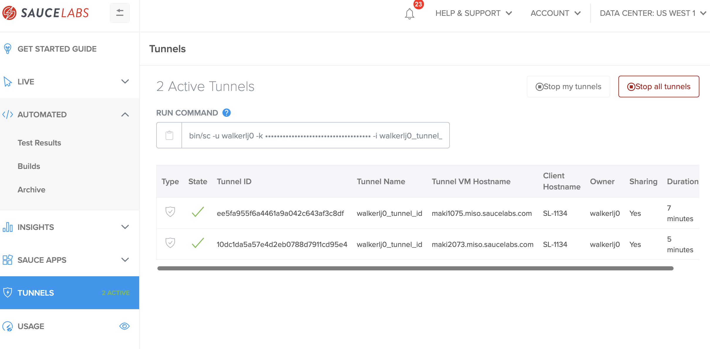
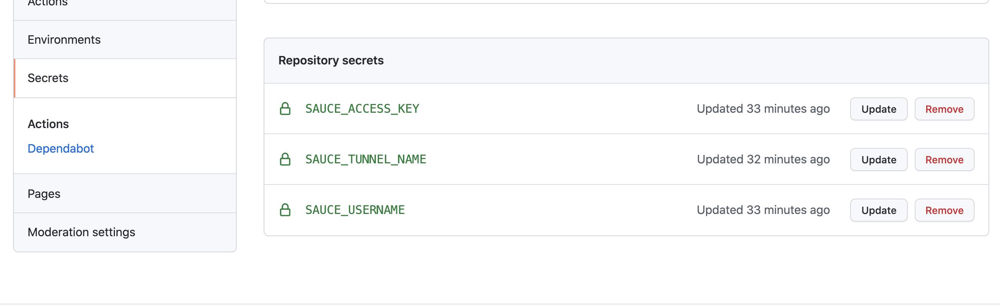

summary: Module 2 ....
id: Module2-SauceConnect
categories: intermediate
tags: saucetools
environments: Web
status: Draft
feedback link: https://forms.gle/CGu4QchgBxxWnNJK8
analytics account: UA-86110990-1
author: Lindsay Walker, Evelyn Coleman

<!-- ------------------------ -->
# Module 2 – Sauce Connect for Admins

<!-- ------------------------ -->
## 2.01 What You'll Learn
Duration: 0:01:00

### What You'll Need
In order to follow along with the course, you will need a few things set up ahead of time:

* A Sauce [Username and Access Key](https://app.saucelabs.com/user-settings)
* The [Tunnel Name](https://app.saucelabs.com/tunnels) of a running tunnel
* A copy of [Sauce Connect](https://docs.saucelabs.com/secure-connections/sauce-connect/installation/)
* Example [Selenium Java test code](https://github.com/walkerlj0/sauceconnect-github-actions/tree/main/java_tests)
* A computer with unrestricted access to saucelabs.com

This tutorial gives examples written in Java, using the JUnit4 test runner, as well as the Maven build tool. If you would like to follow along, you can [download or fork and clone this project](https://github.com/walkerlj0/sauceconnect-github-actions).

### Skills & knowledge
*


<!-- ------------------------ -->
## 2.02 Shared Tunnels
Duration: 0:06:00

In this section, you will learn about using shared tunnels, and edit the code to run a test using the tunnel and [this example test written](https://github.com/walkerlj0/Selenium_Course_Example_Code/tree/master/java/Mod4/4.06) in Java, JUnit4, with Maven and InteliiJ. This lesson covers:

* The different permissions for Sauce Labs accounts, and how they affect tunnels
* How to start a shared tunnel that others can use
* How to update Java test code to run your test through a shared tunnel by updating the `parentTunnel` capability.

#### Video


#### Note
Negative
: If you clone & fork or download [the example repo called Selenium_Course_Example_Code](https://github.com/walkerlj0/Selenium_Course_Example_Code/tree/master/java/Mod4/4.06), make sure you navigate to the _java/Mod4/4.06_ directory and open and run your tests from there. Learn more about [setting up a Java test environment](https://training.saucelabs.com/codelabs/Module1-SeleniumJava/index.html?index=..%2F..SeleniumJava#4).

Shared tunnels are tunnels that are started by one person in an organization, that can be used by other inidividuals within that organization. Though anyone can run the `-s` flag, tunnels are only shared with others if you are and Admin or Team Admin in your Sauce Labs account.

### Sauce Labs Account Access
There are different roles that individuals in an organization can have within Sauce Labs. The most common ones include:

#### Org Admin
This is the highest level of access for a Sauce Labs Account. These user can:
* See all tests and Sauce Connect tunnels (in any team)
* Can manage account, and add and move members between teams
* Can promote peoples' access rights to Team or Org Admins
* Can create shared tunnels to be used by anyone in the organization
* Can stop all tunnels in their organization

#### Team Admins
* See all tests and Sauce Connect tunnels in their team
* Can manage accounts on their team, and add people to their team, and move members from the _default_ team
* Can create shared tunnels to be used by anyone on their team

#### Team Member
* Can run tests on their own tunnels or on tunnels that are shared with them
* Can manage their own account
* Can see team members' tests (if that is available for their organization)
* Can start tunnels that others in their team can use


### Start a Shared Tunnel

Starting a shared tunnel is as easy as adding a flag when you run your tunnel, [like you did earlier](https://training.saucelabs.com/codelabs/Module1-SauceConnect/index.html?index=..%2F..sauceconnect#start-the-tunnel). The basic steps include:

* Navigate to the folder where you have the Sauce Connect Software downloaded
* Start a tunnel with the command, adding the `-s` flag to the end:

```
bin/sc -u Lindsayw34 -k xxxxxxxxxx-xxxxxxx-xxxx -i Lindsayw34_tunnel_id -s
```


Now on the Sauce Labs dashboard, under the **Tunnels** tab, you can see a shared tunnel on your dashboard:


#### Tunnel Information
In order for other users in your organization to utilize your test, they will need two pieces of information, the **Tunnel Name** and **Owner**

In this example, the tunnel name is `walkerlj_tunnel_id` and the owner is `walkerlj`.

### Using a Shared Tunnel with a Java Test
Using a shared tunnel to run your test is done in a very similar way, you simply need to add an extra capabilities.

To use a shared tunnel create or copy [this example test written](https://github.com/walkerlj0/Selenium_Course_Example_Code/tree/master/java/Mod4/4.06) in Java, JUnit4, with Maven and InteliiJ.

#### Update `BaseTest.java`
To run a test through this login to a user account that is different than the use who is running the test, and check the **Tunnels** dashboard to find the the **Tunnel Name** and **Owner** for the tunnel:


Now open your copy of the [example test](https://github.com/walkerlj0/Selenium_Course_Example_Code/tree/master/java/Mod4/4.06).

Navigate to the directory _src/test/java_ and look in the `tests` directory to open `BaseTest.java`. Find the set of capabilities in the `before()` method for for `(host.equals("saucelabs")) {`:


  ```
  @Override
        protected void before() throws Exception {
            if (host.equals("saucelabs")) {
                MutableCapabilities sauceOptions = new MutableCapabilities();
                sauceOptions.setCapability("username", sauceUser);
                sauceOptions.setCapability("accessKey", sauceKey);
                sauceOptions.setCapability("name", testName);
                MutableCapabilities capabilities = new
                // add tunnel capabilities
                MutableCapabilities();
                capabilities.setCapability("browserName", browserName);
                capabilities.setCapability("browserVersion", browserVersion);
                capabilities.setCapability("platformName", platformName);
                capabilities.setCapability("sauce:options", sauceOptions);
                String sauceUrl = String.format("https://ondemand.saucelabs.com/wd/hub");
                driver = new RemoteWebDriver(new URL(sauceUrl), capabilities);
                sessionId = ((RemoteWebDriver) driver).getSessionId().toString();
                sauceClient = new SauceREST(sauceUser, sauceKey, DataCenter.US);

            }
  ```

At the bottom of the list of `sauceOptions`, underneath the `sauceOptions.setCapability("name", testName)` add in two more capabilities; `tunnelIdentifier` (for **Tunnel Name**) and 'parentTunnel' (for **Owner**):

```
    sauceOptions.setCapability("tunnelIdentifier", "walkerlj_tunnel_id"     
    sauceOptions.setCapability("parentTunnel", "walkerlj");
```

Now you can run `mvn clean test` to run the test on Sauce Labs.

Negative
: Make sure you have [Sauce Labs Credentials](https://training.saucelabs.com/codelabs/Module1-SauceConnect/index.html?index=..%2F..sauceconnect#set-sauce-labs-environment-variables) set up

#### Final Code


<!-- ------------------------ -->
## 2.03 High Availability Tunnels
Duration: 0:05:00


In this section, you will learn about using **high availability tunnels**. These are persistent tunnels that are always available to an organization or team (they are't stopped after a test).

This lesson covers:

* How to start a new shared tunnel alongside an existing tunnel, with the same name
* How to update Java test code to run your test through a shared tunnel by updating the `--no-remove-colliding-tunnels` capability.

Typically, instances of the high availability tunnel are created and spun up with the same name (on the same server or different servers) as a shared tunnel so users in an organization can access tunnels as needed without having to start their own.

To follow along, edit the code to run a test using [this example test written](https://github.com/walkerlj0/sauceconnect-github-actions) in Java, JUnit4, with Maven and InteliiJ. (Copy the tests in `/java/Mod4/4.06` and run your tests from there).

### Start High Availability Tunnels

To start a high-availability tunnel and create a resilient system for your team to run tests in, simply start a test as you normally with a `-s` flag for a shared tunnel and `--no-remove-colliding-tunnels` with Sauce Connect 4.6.5 +, like so:

```
bin/sc -u your-username -k ******************** -i your_tunnel_id -s --no-remove-colliding-tunnels
```
Typically when you start a tunnel somewhere, you have tunnel that is running 24/7, however if you or someone in your organization were to start two tunnels with the same name on the same server, they would 'collide' and stop running.

#### Start a Second Tunnel

Now, to illustrate how high-availability tunnels work, we will start another tunnel with the same name (in a new terminal):

```
bin/sc -u your-username -k ******************** -i your_tunnel_id -s --no-remove-colliding-tunnels
```

Since you have more than one tunnel with the same name, when others in your organization use that tunnel, the traffic will be balanced across these tunnels, and if one tunnel goes down, you will still be able to run tests without having to change the tunnel name.



### Adding Resiliency
There are two ways that your automated test runs may fail when using Sauce Connect, since they do not self-heal or restart automatically:

1. A tunnel could fail
2. Your server hosting the tunnel crashes and your connection is severed

To protect against tunnnel unavailability, you should start more than one tunnel, hosted on more than one server:


#### Restarting Tunnels
It's important to setup your tunnels to restart every 24 hours in order to improve resiliency. There are many services available to schedule a task such as stopping and restarting your Sauce Connect Tunnels. If you are using a Unix system (Mac or Linux) you can use a [Cron  daemon](https://kb.iu.edu/d/afiz).

## 2.04 Create Bash Scripts to Restart Tunnels

One way you can automatically restart a tunnel is to create bash scripts to start and stop a sauce connect tunnel, and run these automatically every day.
In this lesson, you will learn to:

* Create scripts to:
  * [Start]() multiple tunnels
  * [Kill all]() your running tunnels
* Create [`crontab` jobs]() to run the start & kill your tunnels every 24 hours

In order to kick off a script that will execute the starting and stopping of Sauce Labs tunnels, you can use the `crontab` command to create a file that will start the scripts.

### Create Script Files
First, create two bash scripts on your computer, one named `start.sh` and the other called `kill.sh`. You can create these files with the `touch` command like so:

```
touch kill.sh
```
```
touch start.sh
```

### Add Code to `kill.sh`

The `kill.sh` script will kill any existing tunnels you have running. In this script, update the `tunnelname` variable with the name you plan on using for your high-availability tunnels.

```
#!/bin/bash
#Kill  tunnels with a -SIGINT hard kill.  Will cause jobs in tunnel to error.

tunnelname=your_tunnel_id

echo "Killing $tunnelname processes"
for x in $(ps aux | grep "\s$tunnelname\s" | grep -v grep | awk '{ print $2 }' );
do
  kill -SIGINT $x
  echo "$tunnelname tunnel with PID $x was sent kill -SIGINT"
done

echo "all $tunnelname tunnels given the kill signal"
```

### Add Code to `start.sh`
To restart the tunnel, create the `start.sh` script that will start a pool of tunnels. For the variables `user=`, `key=`you will need to add you Sauce username and access key.

For `tunnelname=`, and `sc-path=` you will need to add the name you will use for your high availability tunnels, and the path to where you installed Sauce Connect (and the correct version) on your machine. You will also want to make sure `sc_path=` lists the latest version of [Sauce Connect](https://docs.saucelabs.com/secure-connections/sauce-connect/installation/index.html) (also should be installed on your machine):

```
#!/bin/bash
# DO NOT ATTEMPT TO DERIVE MEANING FROM THESE TUNNEL NAMES!!
# Each tunnel pool gets 10 ports

user=your_username
key=xxxxxxxxx-xxxx-xxxx-xxxx-xxxxxxxxxxxx
tunnelname=your_tunnel_id
tunnels=3
tunnel_port_num=5000
sc_path=/Users/youruser/Documents/sc-4.x.x-operatingsystem/bin/sc

for tunnel in $(seq 1 $tunnels);
do
    if [[ ! $(ps aux | grep sc_$tunnelname-$tunnel_port_num | grep -v grep | awk '{ print $2 }') ]]; then
        $sc_path -u $user -k $key --tunnel-identifier $tunnelname --no-remove-colliding-tunnels -d /tmp/sc_$tunnelname-$tunnel_port_num -s -v --extra-info '{"inject_job_id":true}' &
        sleep 5
    fi

    tunnel_port_num=$((tunnel_port_num+1))
done
```

Test our your scripts by running them on your machine. Start with the `chmod` command to give the permission these two bash scripts to execute on your machine:

### Update Permissions To Run `bash` Scripts

When you create bash scripts, you need to let your system know what permission those script have in terms of changing files, directories, settings, and more. The `chmod` command allows you to set those permissions for each script.

For each of the scripts you created, [set the permissions](https://linuxcommand.org/lc3_lts0090.php) to read write, and execute as needed:

```
chmod 754 start.sh
```
```
chmod 754 kill.sh
```
### Run Your Scripts
Before you rely on the cron tab to run your scripts, you will probably want to test them out. navigate to the folder where you saved the scripts, and run the command:

```
sudo bash ./start.sh
```
You should see three Sauce Connect tunnel start in your console and on the [Sauce Labs app](https://app.saucelabs.com/tunnels).


Once you have verification that your script is running, try out the kill command:

```
sudo bash ./kill.sh

```
You should see a verification on your console that the tunnels have been shut down, as well as on the Sauce Labs [tunnels page](https://app.saucelabs.com/tunnels).


### Using Cron with Sauce Connect `bash` Scripts

Next Create a crontab file with the command `crontab -e`.

Use [vim](https://www.cyberciti.biz/faq/how-do-i-save-changes-in-vim/) to insert and save the timing for when you want to run your files, and the path to the bash script it will execute.

This will execute the `start.bash` script every hour, which will check if you have a tunnel up, and if not, start one:
```
0 * * * * /Users/yourusername/Documents/start.bash
```
This will execute the `kill.bash` script at 1 am every day, then execute the `start.bash` script at 1:15 am to start 3 new tunnels:

```
0 1 * * * /Users/yourusername/Documents/kill.bash
15 1 * * * /Users/yourusername/Documents/start.bash
```

#### Note
Negative
: You can use [`crontab guru`](https://crontab.guru/examples.html) to configure how frequently your bash script will run. Any time you want to access all cron jobs, simply use the command `crontab -e`


<!--
 #### Note
Negative
: **Use systemd to Manage Tunnels – **
[systemd](https://www.freedesktop.org/wiki/Software/systemd/) is a system and service manager for Linux that, among other things, can be used to control the starting and stopping of services. For instructions on how to set up systemd, check the `sc-x.x.x-osx` package that you installed, inside the `/config-examples/systemd` folder, and open the `README`. This contains instructions for setting up Sauce Connect with systemd on your Linux machine. 
-->


#### Run Tests with High Availability Tunnels

Once you have several tunnels configured to restart on more than one machine, and have several tunnels up and running with the same tunnel id (name) you can [run any of your tests the same way you would with any parent tunnel](https://training.saucelabs.com/codelabs/Module2-SauceConnect/index.html?index=..%2F..sauceconnect#1),

You have now set up resilient, secure testing infastructure with the Sauce Labs Cloud, which comes with the peace of mind that if a single tunnel or server fails, your tests will still run and you can deliver digital confidence.

<!-- ------------------------ -->
## 2.05 Set Up Sauce Connect with Github Actions
Duration: 0:07:00

In this lesson you will be creating a repo in GitHub actions that includes a Selenium Java test and a workflow that can run a Sauce Connect tunnel in Github actions, and test against the [Sauce Labs Demo app](https://www.saucedemo.com/).

* See what you'll need
* Create a GitHub Repo for your action & tests
* Create GitHub Secrets

Though this app is publicly hosted and doesn't require a secure tunnel to be accessed, this tutorial will walk you through the steps to access test the app with GitHub Actions using a Sauce Connect tunnel as an example of what you would do to test a restricted app.

### What You'll Need
* [GitHub Account](https://github.com/join)
* [Sauce Labs Account](https://saucelabs.com/sign-up)
* [Tests](https://github.com/walkerlj0/sauceconnect-github-actions/tree/main/java_tests) for the Sauce Labs Demo App (www.saucedemo.com)
* The following permissions in GitHub:
    * The ability to create and manage workflows
    * The ability to create and store [GitHub secrets](https://docs.github.com/en/free-pro-team@latest/actions/reference/encrypted-secrets)

_Learn more at the [Github Actions Homepage](https://github.com/features/actions)._
### Set Up Your Project

#### Create a Project for Your Action and Tests
First, you will need to create a repo where you will put your tests. Name it whatever you wish.


We will set up our test to run on every push request made to the main branch of a repository

### Run the Tests Locally (Optional)

If you would like to poke around the code

### Create GitHub Secrets

The first order of business is to export your [Sauce Labs account credentials](https://app.saucelabs.com/user-settings) and store them as GitHub Secrets.

1. Navigate to your project repository and select the __settings__ icon


2. Select __Secrets__
3. Click the __New secret__ button
4. Add the following:
    * Name: `SAUCE_USERNAME`
    * Value: `your-sauce-username`
5. Click __Add secret__ to finish.
6. Repeat the same steps above for your `SAUCE_ACCESS_KEY`, and make up a value for `SAUCE_TUNNEL_NAME` (Not sure where to find `SAUCE_USERNAME` and `SAUCE_ACCESS_KEY` in Sauce Labs? They're [here](https://app.saucelabs.com/user-settings)).



#### Create YAML File

In your project file (in this example we will use the Swag Labs web app you downloaded) create a directory called `.github`, then within that, create a directory called `workflows`.

We will need to create a new `.yml` file [like this example](https://github.com/saucelabs-training/demo-sauce-connect/blob/main/ci-examples/githubActionsExample.yml) that is used to give instructions to Github Actions.

This file will define the test jobs that will run on certain triggers called [events](https://docs.github.com/en/actions/reference/events-that-trigger-workflows).

Create a new file called `sc-actions-demo.yml`:


In the `sc-actions-demo.yml` file, use vim to or an IDE to copy and paste in the following:

//Stopped here. Time to break it dowwwwn.
```
# This workflow uses the Sauce Labs Sauce Connect Github action to create an instance of Sauce Connect.
# This example specifies the name and version of the requested tunnel.

name: Swag Labs Sample App Workflow

on:
  push:
    branches:
      - main
  pull_request:

jobs:
  build:
    runs-on: ubuntu-18.04
    defaults:
      run:
        working-directory: ./
    env:
      BUILD_PREFIX: true
      IS_MAIN: ${{ github.ref == 'refs/heads/main' }}
      SAUCE_USERNAME: ${{ secrets.SAUCE_USERNAME }}
      SAUCE_ACCESS_KEY: ${{ secrets.SAUCE_ACCESS_KEY }}
```


<!-- ------------------------ -->
## Section 1
Duration: 0:10:00

<!-- ------------------------ -->
## Section 1
Duration: 0:10:00
