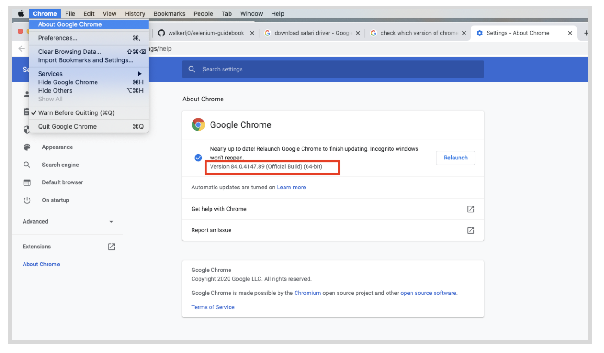
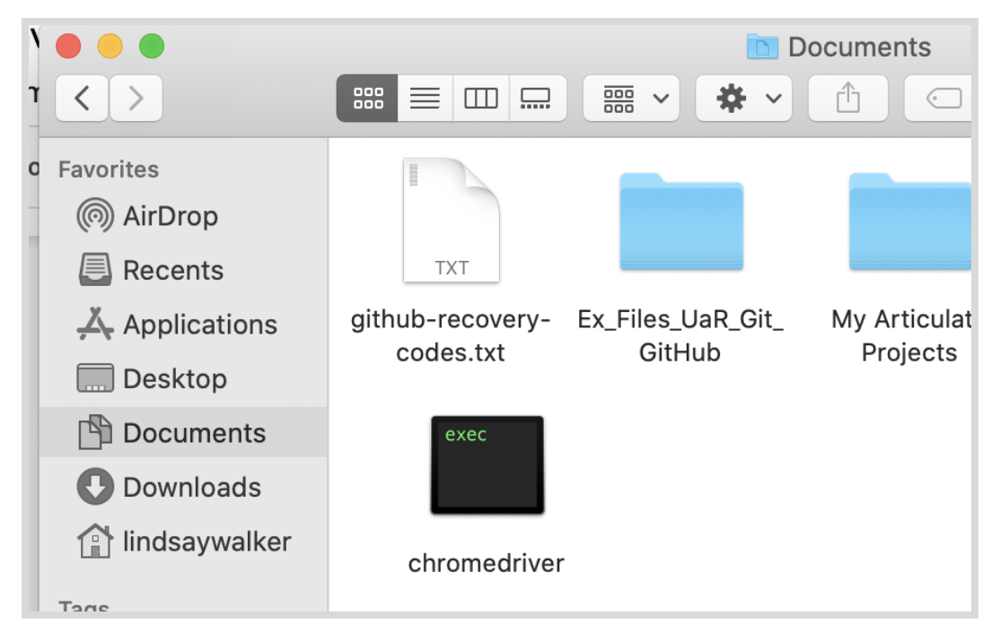
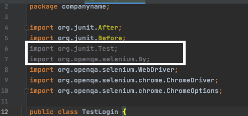
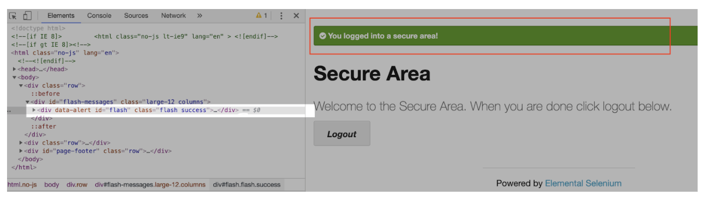
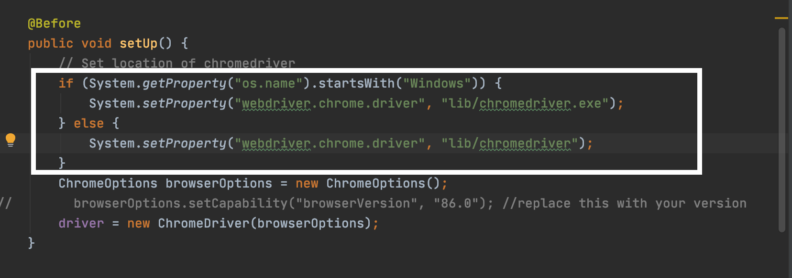
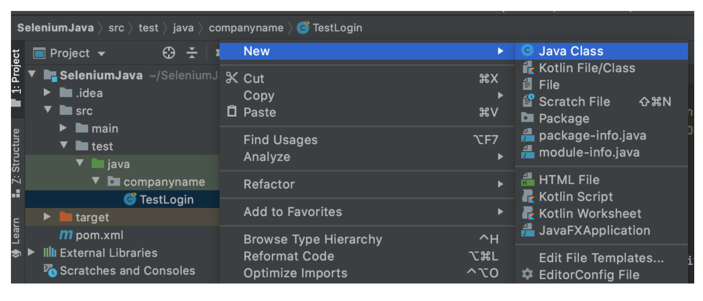
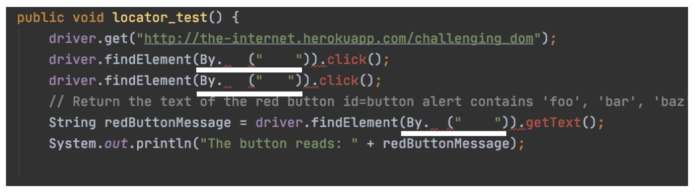

summary: Module 2 of the Selenium Java course. Learn to write Selenium tests in Java using the JUnit4 framework, Maven, and the IntelliJ IDE.
id: Module2-SeleniumJava
categories: intermediate
tags: java
environments: Web
status: Published
feedback link: https://forms.gle/CGu4QchgBxxWnNJK8
analytics account: UA-86110990-1
author: Lindsay Walker
<!-- ------------------------ -->

# Module 2 — Run Your First Selenium Java Test
<!-- ------------------------ -->

## 2.01 What You’ll Learn
Duration: 0:05:00

This module is derived from content in chapters 6-7 of _The Selenium Guidebook_ _Java Edition_ By Dave Haeffner. This module will touch lightly on how to write a basic test, and teach users about how to set up a project, as well as learn about how Selenium locates and interacts with elements on a “page”, which can be any view or even object within a webpage.


### Objectives

*  Use Maven along with IntelliJ to run local tests and manage dependencies on your machine
* Understand that good tests are atomic: Tests are grouped by functionality and are named descriptively. Good * tests also use test runners, and are maintained in version control systems
* Be able to define a test strategy and use a testing strategy like BDD and TDD to create test cases
* Use the browser dev tools console to test locators on the page using elements such as class, id, XPath, and more
* Choose and verify locators for a test class and write code that successfully uses the locators
* Write a test case with @Before, @After annotations from the JUnit4 library, and an @Test assertion, then run it successfully on your local machine
* Write and validate tests that can both succeed and fail, while accounting for different possible failure scenarios. Write versions of tests with methods and configurations that intentionally generate error messages.
* Analyze and plan test suites, learning how to balance the size and maintainability (ability to update and modify testst) against the amount of features you want to test, as well as the level of abstraction you want to use to make modular objects to use in your test suite


### Base Code

If you skipped Module 1, make sure you have a project folder set up and have created the following files, as well as have IntelliJ, Maven, and a `pom.xml` installed and included in your test code. ([See 1.05](https://training.saucelabs.com/codelabs/Module1-SeleniumJava/index.html?index=..%2F..SeleniumJava#4) for pom.xml content)


<!--  -->


### Use GitHub Repository (Optional)

If you are familiar with using GitHub to write your code, you can also fork/ branch this repository here for the first set of code:

**[Module 1 Project Folder](https://github.com/walkerlj0/Selenium_Course_Example_Code/blob/master/java/Mod1/1.06/src/test/java/companyname/TestLogin.java)**

<!-- ------------------------ -->
## 2.02 Writing Good Acceptance Tests
Duration: 0:10:00

Acceptance tests are an important final step to take when releasing anything you may have designed, to make sure that the software you have created meets the requirements and specifications laid out when your designed and planned your application or platform. Automated testing is an integral tool to use to efficiently and accurately test your product for release.

 In order to write automated web tests that are easy to maintain, perform well, and are ultimately resilient, there are some simple guidelines to follow:

 *   Write atomic and autonomous tests
 *   Group like tests together in small batches
 *   Be descriptive
 *   Use a Test Runner
 *   Store tests in a Version Control System

### Atomic & Autonomous Tests

 Each test needs to be concise (e.g., testing a single feature rather than multiple features) and be capable of being run independently (e.g., sets up its own data rather than relying on a previous test to do it). Learn more [here](https://community.saucelabs.com/unit-testing-friends-6/best-practices-use-small-atomic-autonomous-tests-154).

Doing this may require a mental shift, discipline, and more upfront effort, but it will make a dramatic impact on the quality, effectiveness, and maintainability of your tests, especially when you get into parallel test execution.


Image Source: [Medium Article](https://medium.com/swlh/creating-fast-reliable-focused-ui-automation-with-atomic-tests-582e4318c0bb)

### Grouping Tests
As your test suite grows, you will have numerous test files. Each file contains a group of tests that have similar functions. For example, you would have one directory for the files that are designed to locate and interact with the page, and another directory for files that perform tests (test to check if something does or does not happen when you interact).

### Being Descriptive
<!--  -->
A test file should have a high level name that describes what the group of tests within it are doing. Each individual test with the test files should also have an informative name to describe the action each test is taking. In this case, descriptive names are better than concise names. Also, each test or grouping of tests should include some helpful tags or categories, which can provide additional information about the test as well as enable flexible test execution. This way, you can run all or part of your test suite, and the results will inform the tester what is being tested, as well as accurately identify what goes wrong.


<!--  -->

This also enables developers to run a subset of tests to exercise functionality they just modified and enable you to use  a Continuous Integration (CI) server to run the right groups of tests at the right time for fast and dynamic feedback. It is helpful to be able to identify which tests you run when you only make changes to certain parts of an application. You may also want to have a subset of tests that is run regularly, on a nightly or weekly basis, to verify performance regularly, so using a certain category of tests for a regular test deployment can be helpful.

### Test Runners
At the heart of every test suite is some kind of a test runner like Mocha that does a lot of the heavy lifting such as test execution, centralized configuration, and test output. In this course, we will be using the Mocha test runner. Rather than reinvent the wheel, you can use one of the many test runners that exist today. With it you can bolt on third party libraries to extend its functionality if there's something missing.

### Version Control
In order to effectively collaborate with other testers and developers on your team, your test code must live in a version control system. Look to see what your development team uses and add your code to it. In the examples in this course, we will be providing code samples from GitHub.

### [BDD and TDD](https://saucelabs.com/blog/a-two-minute-bdd-overview)
<!--  -->
Behavior Driven Development and Test Driven Development are two important strategies to help you understand how to write effective tests. [BDD](https://cucumber.io/blog/bdd/bdd-is-not-test-automation/) is a collaborative process that focuses on starting with a business value or need. It’s a feature and epic-centric development strategy to create a requirements analysis. With both BDD and TDD, you plan to write the code for the test first (application code comes later).


<!--  -->

[TDD](https://saucelabs.com/blog/the-state-of-test-driven-development) is a more granular step that should be taken after a BDD plan is created. The general process involves writing a failing test for particular features (determined previously with the BDD process), then the developer writes the code to lead to a successful run of this test. The goal is to be able to write failing tests that can be turned into a passing test with minimal code modification, and no change to dependencies, base pages, or configuration files.


<!-- ------------------------ -->

## 2.03 Defining a Test Strategy and Picking a Framework.
Duration: 0:05:00

A great way to increase your chances of success with automated web testing is to first map out a testing strategy. The best way to do it is to answer these four questions:


*   _How does your business make money?_
*   _What features in your application are being used?_
*   _What browsers are your users using?_
*   _What things have broken in the application before?_


### What to Do with the Answers

After answering these questions, you should end up with a prioritized punch list or backlog of test automation tasks that you can choose tasks from, and track progress against.


#### Question 1: What is the Value?

Every company's application makes money (or generates value) through core functionality that is defined by a series of increasingly-valuable user interactions known as a "funnel". Your answers to this question will help you determine what your funnel is.

These items will be your highest priority for automation. Start an automation backlog to keep track of them.


#### Question 2: What Does Usage Data Say?

Odds are your application offers a robust set of functionality well beyond your funnel. Your answers to this question will help highlight what it is. And if you're basing these answers on usage data like those obtained from Google Analytics, then you can see which features and functionality are more frequently used than others.

When your data shows certain functions, features, and flows are frequently used, consider adding them as a priority for your automated testing suite.


#### Question 3: Which Browsers?

Now that you know what functionality is business critical and widely adopted by your users, you need to determine what browsers to focus your automated web testing efforts on. Your usage data will tell you this as well. It will help you determine which browsers you can reasonably avoid testing in (based on non-existent or low usage numbers).

Note the top 2 (or 3 depending on your numbers), but focus on the top 1 for now. This is the browser you will start using for automation.


#### Question 4: What are the Risky Bits?

To round out the strategy, it is also best to think about what things have broken in the application before. To answer this question, it's best to check your defect/bug tracker (if you have one) and to ask your team. What you end up with may read like a laundry list of browser specific issues or functionality that has been flaky or forgotten about in the past. But it's all useful information.

Be sure to check this list against your automation backlog. If something's not there, add it to the bottom of the backlog. If it is there, make a note in the backlog item that it has been an issue in the past.

If the issue has happened numerous times and has the potential to occur again, move the item up in the backlog. And if issues keep cropping up that are related to a specific browser, compare this browser to your short list of browsers from question \#3. If it's a browser that's not in your list but it's still important (e.g., a small pocket of influential users), track it on the backlog, but put it at the bottom.


### Now You are Ready

Having answered these questions, you should now have a prioritized backlog of critical business functionality, a short list of browsers to focus on, and an understanding of the risky parts of your application to watch out for. With it, you're on the right track — focusing on things that matter for your business and its users.

<!-- ------------------------ -->

## 2.04 Finding & Testing Selenium Locators in the Browser
Duration: 0:15:00


### How to Find Locators

The simplest way to find locators is to inspect the elements on a page. The best way to do this is from within your web browser. Fortunately, popular browsers come pre-loaded with development tools that make this simple to accomplish.

When viewing the page, right-click on the element you want to interact with and click **Inspect Element**. This will bring up a small window with all of the markup for the page but zoomed into your highlighted selection. From here, you can see if there are unique or descriptive attributes you can work with.


If you're fortunate enough to be working with unique IDs and classes, then you're usually all set. But when you have to handle more complex actions like traversing a page, or you need to run down odd test behavior, it can be a real challenge to verify that you have the right locators to accomplish what you want.


#### Video

Watch [Finding Locators with Dev tools](https://www.youtube.com/watch?v=l_oOa7LeHqI) on using locators and follow along in your browser.

<video id="l_oOa7LeHqI"></video>

Use the following notes to help you use the inspector to test elements. Later you will test elements with your code. You can use the webpage here to follow along:

**[https://www.saucedemo.com/](https://www.saucedemo.com/)**


#### Locator Strategies


Find more on [XPath here](https://yizeng.me/2014/03/23/evaluate-and-validate-xpath-css-selectors-in-chrome-developer-tools/)

### How to Find Quality Elements

You want to find an element that is unique, descriptive, and unlikely to change.

Ripe candidates for this are `id` and `class `attributes. Whereas text (e.g., the text of a link) is less ideal since it is more apt to change. If the elements you are attempting to work with don't have unique `id` or `class` attributes directly on them, look at the element that houses them (a.k.a. the parent element). Oftentimes the parent element has a unique element that you can use to start with and walk down to the child element you want to use.

When you can't find any unique elements have a conversation with your development team letting them know what you are trying to accomplish. It's typically a trivial thing for them to add helpful semantic markup to a page to make it more testable. This is especially true when they know the use case you're trying to automate. The alternative can be a lengthy and painful process which might yield working test code but it will be brittle and hard to maintain.

Once you've identified the target elements and attributes you'd like to use for your test, you’ll need to craft locators using one of Selenium's strategies.

Selenium is able to find and interact with elements on a page by way of various locator strategies. The list includes (sorted alphabetically):


*   Class  in the HTML
*   CSS Selector
*   ID
*   Link Text
*   Name
*   Partial Link Text
*   Tag Name
*   XPath


### Quiz


<!-- ------------------------ -->

## 2.05 Setting Up Your First Java Test
Duration: 0:15:00

### Project Setup

Open up the [IntelliJ IDE](https://www.google.com/search?q=download+intellij+idea&oq=download+IntelliJ+IDe&aqs=chrome.0.0j69i57j0l3j69i64l3.6131j0j7&sourceid=chrome&ie=UTF-8) and create a new project using Maven and your JDK (1.8 is recommended)

 

Choose which directory you want to store your project in, and give it a name such as **SeleniumJava**:


In order to run your you will also need to install a driver that can communicate with the version of the browser (Chrome, Firefox, etc) you have on your local machine.

### Installing Chromedriver
In order for your test to run on a browser on your local machine, you need to install the driver for the browser, and update your code. A similar set of steps can be followed for any browser.

First, check which version of chrome you are using by opening Chrome on your machine and checking the version.  



Next, [download Chromedriver](https://chromedriver.chromium.org/). You can also download [Geckodriver](https://github.com/mozilla/geckodriver) for Chrome browser or [any other driver.](https://automationintesting.com/selenium/java/lessons/drivers.html) you will need for popular browsers The driver version should match the version of the browser you have on your machine.


#### Cheat Sheet

[Driver Configuration Cheat Sheet](https://docs.google.com/document/d/1FTSxen0sm_3pXERqfVb3txc5f22HyclKeTbeFFbhM9M/edit?usp=sharing)

Download the file, then unzip it and move it somewhere outside of your downloads folder. Here, I chose to move it inside of the Documents folder.



#### Note

Negative
: Often, web drivers are what is known as an ‘unsigned’ executable. This means that your operating system doesn’t recognize it as a trusted piece of software. In this situation, you need to manually set your operating system. To do this on a Mac, first open a terminal, and type in the command `sudo spctl --master-disable` to [disable Gatekeeper](https://osxdaily.com/2015/05/04/disable-gatekeeper-command-line-mac-osx/).

Negative
: Next, you need to allow app downloads from anywhere. Go to **System Preferences** on your Mac **> Security & Privacy**, then under the **General** tab after unlocking the settings, choose the radio button to Allow apps downloaded from App Store and identified developers. 

Negative
: On Windows, you can allow unidentified apps using [these instructions](https://support.microsoft.com/en-gb/help/4046851/windows-10-allow-blocked-app-windows-security). Another option you have is to find the driver you downloaded in the file directory and double-click to open the **chromedriver** or **geckodriver** manually.
Once you have allowed this, find the Chromedriver in your file directory, double click on it, and force terminal to open it.

#### Note
Negative
: If you are a first-time user of IntelliJ with Java, I highly recommend checking out the YouTube channel by JetBrains. [This is a great first video.](https://www.youtube.com/watch?v=H_XxH66lm3U)


### Copy the Project Code (Optional)

The next tutorial will show you how to write the code, step by step, but you also have the option to fork & clone, or download the project files:

**[Selenium Course Example Code](https://github.com/walkerlj0/Selenium_Course_Example_Code/tree/master/java/Mod2/2.05)**

### Troubleshoot

#### Update Drivers
This sample of test code is not using [WebDriver Manager](https://github.com/bonigarcia/webdrivermanager) or other similar tool (though it is recommended), and if you want to test out running this locally, make sure that you have downloaded the drivers compatible with the versions of the browsers on you machine, and update the test code to reference those drivers:


#### Update `pom.xml`
Add your configurations into `pom.xml` [like the project here](https://github.com/walkerlj0/Selenium_Course_Example_Code/blob/master/java/Mod4/4.05/pom.xml). You may need to invalidate caches and restart IntelliJ IDE again to activate the imports specified in `pom.xml`. You can also search for the [latest Maven package versions](https://mvnrepository.com/).

#### Project Setup

If your test isn't running, try the following to troubleshoot to get the tests running locally:

* Right-click on the project name and choose **Add Framework Support**. 
* Choose **Maven** as a build tool.
* Go to **File > Project Structure**. Select a JDK that you have installed on your machine.
* Choose **File > Invalidate Caches and Restart** so the changes can take effect. 


<!-- --------------- -->
## 2.06 Create Your Java Test Code
Duration: 0:15:00

First you will need to create a new project directory called `SeleniumJava` (your main project directory), and navigate into the `src/test/java` inside that project directory. This is where we will place our Selenium Java Tests.

Inside of your Java file create a package. This example is named **tests.** Inside of that create a file called **TestLogin.java**.


### What Are You Testing?
We will be testing the login page for an example app on [the-internet](http://the-internet.herokuapp.com/login).


Take a look at the markup for this page:

```
<form name="login" id="login" action="/authenticate" method="post">
     <div class="row">
          <div class="large-6 small-12 columns">
              <label for="username">Username</label>
              <input type="text" name="username" id="username">
          </div>
     </div>

    <div class="row">
        <div class="large-6 small-12 columns">
            <label for="password">Password</label>
            <input type="password" name="password" id="password"> </div>
        </div>
            <button class="radius" type="submit"><i class="icon-2x    
             icon-signin"> Login</i>
            </button>
</form>


```


Notice the element attributes on the form. The username input field has a unique` id `, as does the password input field. The submit button doesn't, but it's the only button on the page so we can easily find it and click it.

Let's put these elements to use in our first test.


### Add the Filepath to Chromedriver


Copy and paste the following code into the file You will have to **Add your own filepath in the setUp() method** where you stored your chromedriver:


```
//filename: tests/TestLogin.java
package tests;

import org.junit.After;
import org.junit.Before;
import org.junit.Test;
import org.openqa.selenium.By;
import org.openqa.selenium.WebDriver;
import org.openqa.selenium.chrome.ChromeDriver;
import org.openqa.selenium.chrome.ChromeOptions;

import static org.junit.Assert.assertTrue;

public class TestLogin {

    private WebDriver driver;

    @Before
    public void setUp() {
        System.setProperty("webdriver.chrome.driver",  "<insert filepath to chromedriver here>");
        ChromeOptions browserOptions = new ChromeOptions();
        driver = new ChromeDriver(browserOptions);
    }

    @Test
    public void succeeded() {
        driver.get("http://the-internet.herokuapp.com/login");
        driver.findElement(By.id("username")).sendKeys("tomsmith");
        driver.findElement(By.id("password")).sendKeys("SuperSecretPassword!");
        driver.findElement(By.cssSelector("button")).click();
    }

    @After
    public void tearDown() {
        driver.quit();
    }
}


```

### Note
Negative
: The two imported classes may delete themselves or turn grey – the IntelliJ IDE will intentionally clean up code and remove the import of unnecessary classes to speed up the running of your code.


### Test Code Overview

The top of the file is where the dependencies go. In order for the instantiation of Selenium to work with Firefox, we need to specify the path to the Chromedriver we downloaded into the vendor directory.

Here you will notice JUnit4 annotations being imported, as well as the Selenium and Chrome drivers.

After importing the drivers and tools classes for JUnit4 and Selenium we create a class, `public class TestLogin {}`,  and declare a field variable to store and reference an instance of Selenium WebDriver, `private WebDriver driver;`.


#### @Before and @After Annotations

After creating the class, we add setup and teardown methods using what is known as annotations, using `@Before` and `@After`. In them we're creating an instance of Selenium (storing it in driver) and closing it with `driver.quit();`. Thanks to the `@Before` annotation, the` public void setUp()` method will load before the test and the `@After` annotation will make the `public void tearDown()` method load after the test.

This abstraction using the JUnit4 annotations library enables us to write our test with behavior we want to exercise in the browser, rather than clutter it up with setup and teardown details written in Java.


#### Note

Negative
: **How to Find Dependencies Using IntelliJ**:
 If your test file doesn’t have all the dependencies that you need, or if those dependencies are an older version and you are unable to run your test code, the IntelliJ IDE has features that will help you out. See the video [IntelliJ_Dependencies ](https://youtu.be/PDPl_pHo0K0) on using IntelliJ to install dependencies and update the .pom file <video id="PDPl_pHo0K0"></video>


### Run a Test with IntelliJ

IntelliJ is a comprehensive tool that allows you to work with Maven, JUnit4, Github, and many other dependencies all from the same window. It allows you to debug and run portions of a test, see which branch you are on in Github, manage project files, and much more. If you aren’t familiar, you can [learn more here](https://www.jetbrains.com/help/idea/guided-tour-around-the-user-interface.html).


#### Video- How to Run a Test

Follow the instructions here in [2.05_IntelliJ_Tests](https://youtu.be/qWi8Rk1R4Gw) to learn how to run a test with the IntelliJ UI

<video id="qWi8Rk1R4Gw"></video>

Negative
: **Check driver path and browser version–** If your tests aren't running correctly, double check that the `System.setProperty("webdriver.chrome.driver")` has the full path to where you installed the chromedriver, and that the version of the Chromedriver you installed matches the browser version on your computer.


<!-- ------------------------ -->

## 2.07 Add a Test Assertion
Duration: 0:10:00

Assertions are statements that are used at a certain point in the test code (usually following a certain sequence of events) that check to see if some condition is true or false. The test code you created thus far simply tells your test what elements to look for on the page, and what to do with those elements.


### Add an Assertion

Now it’s time to add in an assertion to see if your actions had the desired effect. We want to check that the div that pops up when you have successfully logged in with the `class = "flash_success" `does in fact appear after you enter the login credentials.




Start by opening the blank `TestLogin.java` file you created in the `tests` directory.

Copy and paste the following code into your program file, in the last line of the `@Test`Assertion (after `driver.findElement(By.cssSelector("button")).click();`).


```
//filename: tests/TestLogin.java
package tests;

import static org.junit.Assert.assertTrue;

//...
public class TestLogin {
    private WebDriver driver;
    @Before
// ...
    @Test
// ...
        assertTrue("success message not present",
                driver.findElement(By.cssSelector(".flash.success")).isDisplayed());
    }

    @After
//...

```


### Note

Negative
: When using the IntelliJ IDE, classes and libraries must be instantiated within the code before they can be added to the list of imported elements at the top. Watch this video to see how this is done.


#### Video
Watch this [video](https://youtu.be/w3XcmSJxqcg) to understand importing classes and methods with IntelliJ

<video id="https://youtu.be/w3XcmSJxqcg"></video>

### Code Summary

Our test contains a method, `public void succeeded()`. JUnit4 knows this is a test because of the `@Test` annotation it is inside of. In this test we're visiting the login page by it's URL with `driver.get(); `,finding the input fields by their ID with `driver.findElement(By.id()`), sending them text with `.sendKeys(); , `and submitting the form by clicking the submit button `with By.cssSelector("button")).click();`.

First, we had to import the JUnit4 assertion class. By importing it as static we're able to reference the assertion methods directly (without having to prepend Assert.). Next we add an assertion to the end of our test.

With `assertTrue` we are checking for a true (Boolean) response. If one is not received, a failure will be raised and the text we provided (`"success message not present"`) will be displayed in the failure output. With Selenium we are seeing if the success message is displayed with `.isDisplayed()`. This Selenium command returns a true or false value. So if the element is visible in the browser, true will be returned, and our test will pass.


### Video

Watch [Run Your Test with Maven](https://youtu.be/qWi8Rk1R4Gw) to learn the steps for running a test using the IntelliJ IDE and Maven.
<video id="qWi8Rk1R4Gw"></video>

#### Note
Negative
: If you had difficulty before getting your test to run because your test had trouble locating chromedriver, you can create a `/lib` directory in the root of the project folder, and place the extracted chromedriver there.  

Negative
: If you do change the location of the chromedriver, you can modify your `system.setProperty` to the following:  ```  // Set location of chromedriver
        if (System.getProperty("os.name").startsWith("Windows")) {
            System.setProperty("webdriver.chrome.driver", "lib/drivers/chromedriver.exe");
        } else {
            System.setProperty("webdriver.chrome.driver", "lib/drivers/chromedriver");
        }```

### Test Your Code with a Failure

Just to make certain that this test is doing what we think it should, let's change the assertion to force a failure and run it again. A simple fudging of the locator will suffice.


```
      assertTrue("success message not present",
                driver.findElement(By.cssSelector(".flash.NOTsuccessas")).isDisplayed());


```


If it fails, then we can feel confident that it's doing what we expect, and can change the assertion back to normal before committing our code. If it doesn’t fail, it could mean a successful test is a ‘false positive’ where our test will indicate, say successful location of an element, even if that element wasn’t located.

This is a key debugging strategy, and for each test you create, you should check to make sure you can run a failed test each time by entering unexpected or incorrect values.

#### Cheat Sheet
To learn more about locators you can use with Selenium and Java, see the [Selenium Actions Cheat Sheet](https://docs.google.com/document/d/1tDS_M9ltC73Ghii1WdKzuH2PAAAo0kLk1JsGuyqJjNA/edit?usp=sharing)

#### Final Code


<!-- ------------------------ -->

## 2.08 Verifying Locators with Selenium
Duration: 0:15:00

Selenium uses locators to find elements on the page and interact with them.  

Instead of the painful and tedious process of trying out various locators in your tests until you get what you're looking for, try verifying them in the browser instead.

Once you have identified a class, id, name, link text, Xpath, etc. for an element, you can use the Selenium `findElement() `method along with the driver object in your Java test code.

In this exercise we can create a similar test using another page from the [the-internet app](https://the-internet.herokuapp.com/) called **[Challenging DOM](https://github.com/walkerlj0/Selenium_Course_Example_Code/tree/master/java/Mod2/2.07)**

You can get the [test code that you will be adding to from the Github repo](https://github.com/walkerlj0/Selenium_Course_Example_Code/blob/master/java/Mod2/2.07/src/test/java/companyname/TestLocator.java)

Next, we will create a new test file, named `TestLocator.java.` Place it in the same ‘test’ folder as the other test we created:


#### Note

Negative
: This can be done in IntelliJ by right clicking within the **companyname** folder in the project window and creating a **New → Java Class** then naming it **TestLocator.**

Negative
: 


Negative
: 


Copy and paste the code below into your test file.  Above the `public class {}` declaration, you will `import` all of your dependencies. You will also instantiate the driver, then create the code to set up, test, then tear down your test within the `@Before, @Test, and @After `code.


```
// filename: test/TestLocator.java

package tests;

import org.junit.After;
import org.junit.Before;
import org.junit.Test;
import org.openqa.selenium.By;
import org.openqa.selenium.WebDriver;
import org.openqa.selenium.chrome.ChromeDriver;
import org.openqa.selenium.chrome.ChromeOptions;

public class TestLocator {

    private WebDriver driver;

    @Before
    public void setUp() {
        System.setProperty("webdriver.chrome.driver", "/Users/lindsaywalker/Documents/chromedriver");
        ChromeOptions browserOptions = new ChromeOptions();
        driver = new ChromeDriver(/*browserOptions*/);
    }

    @Test
    public void locator_test() {
        driver.get("http://the-internet.herokuapp.com/challenging_dom");
//        driver.findElement(By.id("    ")).click(); //add here
//        driver.findElement(By.id("")).click(); //add here

        // Return the text of the red button id=button alert contains 'foo', 'bar', 'baz', or 'qux'
        String redButtonMessage = driver.findElement(        ).getText(); //add here
        System.out.println("The button reads: " + redButtonMessage);

}

    @After
    public void tearDown() {
        driver.quit();
    }
}
```


Your challenge, should you choose to accept it, is to add the locator


* Navigate to [https://the-internet.herokuapp.com/challenging_dom](https://the-internet.herokuapp.com/challenging_dom) and right click on a button to open the inspector.
* Use the inspector to locate and test finding elements. In this test we are going to click the green button, then the blue button, and then check to see what is on the red button at the end.

#### Video
Watch the [video](https://youtu.be/1-vK-djB6oo) below to understand how the LocatorTest works:

<video id="1-vK-djB6oo"></video>


#### Cheat Sheet

[2.08 Selenium Locators Cheat Sheet](https://docs.google.com/document/d/1M0_TKpk_N3U3OOB3EUHEsxRC1TJQPPYwLfA0ZmohqcU/edit?usp=sharing)


* Your test should test clicking first the green button, then the blue button, then check to make sure both have been clicked (Check CSS/ id). Using the code above, complete and run the test.  This is not a typical functional test, as there is no assertion, but we do return a value.
* Use the documentation here on using the[ By Selenium class ](https://github.com/saucelabs-training/advanced-selenium/blob/charlotte/src/docs/locators.md)to figure out how to complete the code. You can also use the [Cheat Sheet](https://docs.google.com/document/d/1tDS_M9ltC73Ghii1WdKzuH2PAAAo0kLk1JsGuyqJjNA/edit?usp=sharing) to help.



* If you were successful, you should see both the locator and login tests (both are in the test folder) run, and below your locator, you should see the text that appeared on the red button when it was run:


See the complete [source code here](https://github.com/walkerlj0/Selenium_Course_Example_Code/tree/master/java/Mod2/2.07_solution).


<!-- ------------------------ -->

## 2.09 Module 2 Quiz
Duration: 0:05:00


