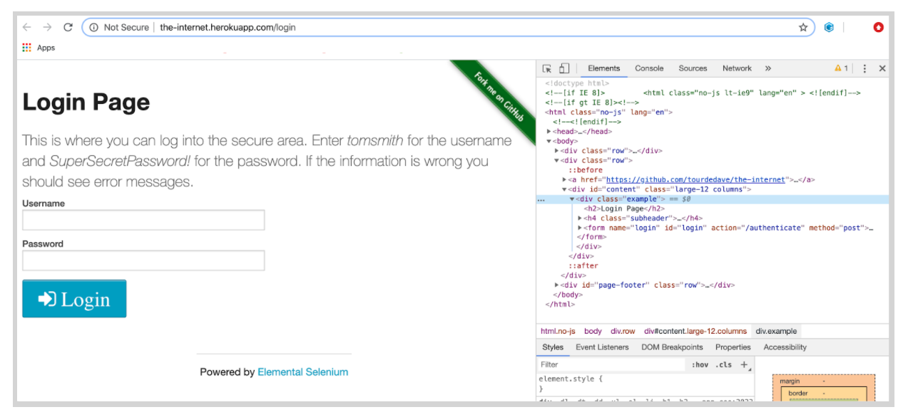
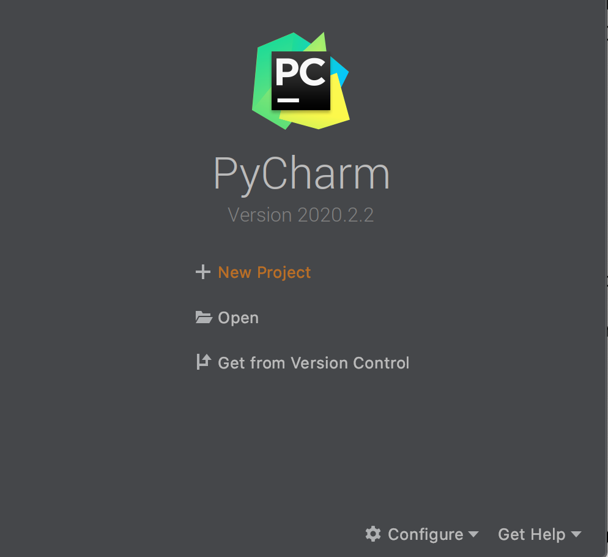
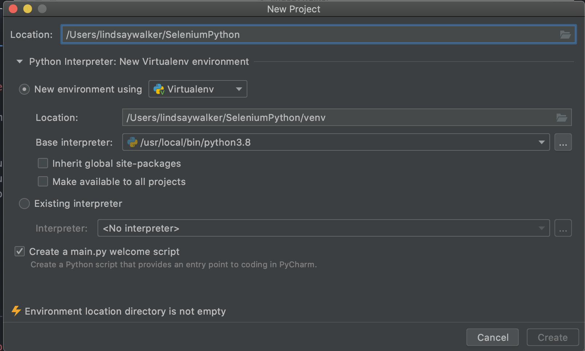
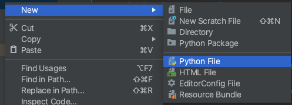
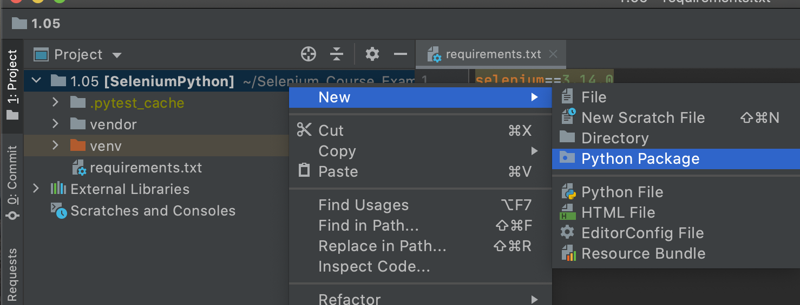
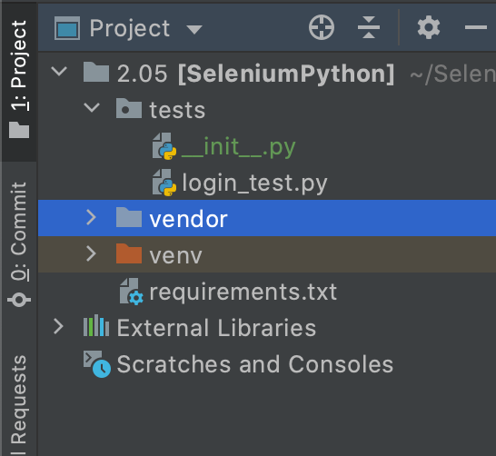
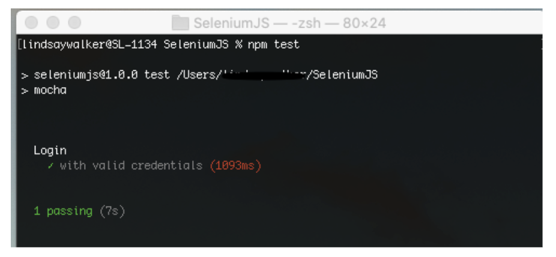
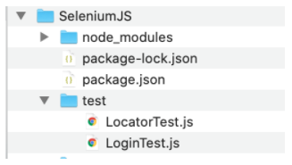

summary: Module 2 of the Selenium Python Course using pip3 with Pytest.
id: ../site/codelabs/Module2-SeleniumPython
categories: intermediate
tags: python
environments: Web
status: Hidden
feedback link: https://forms.gle/CGu4QchgBxxWnNJK8
analytics account: Google Analytics ID
author:Lindsay Walker
<!-- ------------------------ -->


# Module 2 — Locators and Python Tests
<!-- ------------------------ -->

## 2.01 What You’ll Learn
Duration: 0:05:00

This module is derived from content in chapters 6-7 of _The Selenium Guidebook_ _JavaScript Edition_ By Dave Haeffner. This module will touch lightly on how to write a basic test, and teach users about how to set up a project, as well as learn about how Selenium locates and interacts with elements on a “page”, which can be any view or even object within a webpage.


### Objectives


*   Use _____ along with Pip3 and Python to run local tests and manage dependencies on your machine
*   Understand that good tests are atomic: They have test grouped by functionality, and are named descriptively. Good tests also use test runners, and are maintained in version control systems
*   Create and maintain a project folder with your test suite & dependencies, with separate folders for page and test classes
*   Be able to define a test strategy and use a testing strategy like BDD and TDD to create test cases
*   Use the browser dev tools console to test locators on the page using elements such as class, id, XPath, and more
*   Demonstrate the ability to choose and verify locators for a test class and write code that successfully uses the locators
*   Write a test case with `-----------` and `--------` ---------- and an --------, then run it successfully on your local machine
*   Write and validate tests that can both succeed and fail, while planning for different failure scenarios (and methods that generate error messages) for those different scenarios
*   Analyze and plan test suites, learning how to balance the size and maintainability (ability to check failed tests) against the amount of features you want to test, as well as the level of abstraction you want to use to make modular objects to use in your test suite


### Base Code

If you skipped Module 1, make sure you have a project folder set up and have created the following files, as well as have NodeJS installed and init for this project:


-


### Use GitHub Repository (Optional)

If you are familiar with using GitHub to write your code, you can also fork/ branch this repository here for the first set of code:

**[Module 1 Project Folder](http://example.com)**

<!-- ------------------------ -->
## 2.02 Writing Good Acceptance Tests
Duration: 0:10:00

Acceptance tests are an important final step to take when releasing anything you may have designed, to make sure that the software you have created meets the requirements and specifications laid out when you designed and planned your application or platform. Automated testing is an integral tool to use to efficiently and accurately test your product for release.

 In order to write automated web tests that are easy to maintain, perform well, and are ultimately resilient, there are some simple guidelines to follow:

 *   Write atomic and autonomous tests
 *   Group like tests together in small batches
 *   Be descriptive
 *   Use a Test Runner
 *   Store tests in a Version Control System

### Atomic & Autonomous Tests

 Each test needs to be concise (e.g., testing a single feature rather than multiple features) and be capable of being run independently (e.g., sets up its own data rather than relying on a previous test to do it). [Learn more in the Sauce Cookbook](https://wiki.saucelabs.com/display/DOCS/Best+Practices%3A+Use+Small%2C+Atomic%2C+Autonomous+Tests?utm_source=referral&utm_medium=LMS&utm_campaign=link).

Doing this may require a mental shift, discipline, and more upfront effort, but it will make a dramatic impact on the quality, effectiveness, and maintainability of your tests, especially when you get into parallel test execution.


Image Source: [Medium Article](https://medium.com/swlh/creating-fast-reliable-focused-ui-automation-with-atomic-tests-582e4318c0bb)

### Grouping Tests
As your test suite grows, you will have numerous test files. Each file contains a group of tests that have similar functions. For example, you would have one directory for the files that are designed to locate and interact with the page, and another directory for files that perform tests (test to check if something does or does not happen when you interact).

### Being Descriptive
<!--  -->
A test file should have a high level name that describes what the group of tests within it are doing. Each individual test with the test files should also have an informative name to describe the action each test is taking. In this case, descriptive names are better than concise names. Also, each test or grouping of tests should include some helpful tags or categories, which can provide additional information about the test as well as enable flexible test execution. This way, you can run all or part of your test suite, and the results will inform the tester what is being tested, as well as accurately identify what goes wrong.


<!--  -->

This also enables developers to run a subset of tests to exercise functionality they just modified and enable you to use  a Continuous Integration (CI) server to run the right groups of tests at the right time for fast and dynamic feedback. It is helpful to be able to identify which tests you run when you only make changes to certain parts of an application. You may also want to have a subset of tests that is run regularly, on a nightly or weekly basis, to verify performance regularly, so using a certain category of tests for a regular test deployment can be helpful.

### Test Runners
At the heart of every test suite is some kind of a test runner like Mocha that does a lot of the heavy lifting such as test execution, centralized configuration, and test output. In this course, we will be using the Mocha test runner. Rather than reinvent the wheel, you can use one of the many test runners that exist today. With it you can bolt on third party libraries to extend its functionality if there's something missing.

### Version Control
In order to effectively collaborate with other testers and developers on your team, your test code must live in a version control system. Look to see what your development team uses and add your code to it. In the examples in this course, we will be providing code samples from GitHub.

### [BDD and TDD](https://saucelabs.com/blog/a-two-minute-bdd-overview)
<!--  -->
Behavior Driven Development and Test Driven Development are two important strategies to help you understand how to write effective tests. [BDD](https://cucumber.io/blog/bdd/bdd-is-not-test-automation/) is a collaborative process that focuses on starting with a business value or need. It’s a feature and epic-centric approach to create a requirements analysis. With both BDD and TDD, you plan to write the code for the test first (application code comes later).


<!--  -->

[TDD](https://saucelabs.com/blog/the-state-of-test-driven-development) is a more granular step that should be taken after a BDD plan is created. The general process involves writing a failing test for particular features (determined previously with the BDD process), then the developer writes the code to lead to a successful run of this test. The goal is to be able to write failing tests that can be turned into a passing test with minimal code modification, and no change to dependencies, base pages, or configuration files.


<!-- ------------------------ -->

## 2.03 Defining a Test Strategy and Picking a Framework.
Duration: 0:05:00

A great way to increase your chances of success with automated web testing is to first map out a testing strategy. The best way to do it is to answer these four questions:


*   _How does your business make money?_
*   _What features in your application are being used?_
*   _What browsers are your users using?_
*   _What things have broken in the application before?_


<!--  -->

### What to Do with the Answers

After answering these questions, you should end up with a prioritized punch list or backlog of test automation tasks that you can choose tasks from, and track progress against.


#### Question 1: What is the Value?

Every company's application makes money (or generates value) through core functionality that is defined by a series of increasingly-valuable user interactions known as a "funnel". Your answers to this question will help you determine what your funnel is.

These items will be your highest priority for automation. Start an automation backlog to keep track of them.


#### Question 2: What Does Usage Data Say?

Odds are your application offers a robust set of functionality well beyond your funnel. Your answers to this question will help highlight what it is. And if you're basing these answers on usage data like those obtained from Google Analytics, then you can see which features and functionality are more frequently used than others.

When you data shows certain functions, features, and flows are frequently used, consider adding them as a priority for your automated testing suite.


#### Question 3: Which Browsers?

Now that you know what functionality is business critical and widely adopted by your users, you need to determine what browsers to focus your automated web testing efforts on. Your usage data will tell you this as well. It will help you determine which browsers you can reasonably avoid testing in (based on non-existent or low usage numbers).

Note the top 2 (or 3 depending on your numbers), but focus on the top 1 for now. This is the browser you will start using for automation.


#### Question 4: What are the Risky Bits?

To round out the strategy, it is also best to think about what things have broken in the application before. To answer this question, it's best to check your defect/bug tracker (if you have one) and to ask your team. What you end up with may read like a laundry list of browser specific issues or functionality that has been flaky or forgotten about in the past. But it's all useful information.

Be sure to check this list against your automation backlog. If something's not there, add it to the bottom of the backlog. If it is there, make a note in the backlog item that it has been an issue in the past.

If the issue has happened numerous times and has the potential to occur again, move the item up in the backlog. And if issues keep cropping up that are related to a specific browser, compare this browser to your short list of browsers from question \#3. If it's a browser that's not in your list but it's still important (e.g., a small pocket of influential users), track it on the backlog, but put it at the bottom.


### Now You are Ready

Having answered these questions, you should now have a prioritized backlog of critical business functionality, a short list of browsers to focus on, and an understanding of the risky parts of your application to watch out for. With it, you're on the right track — focusing on things that matter for your business and its users.

<!-- ------------------------ -->

## 2.04 Finding & Testing Locators in the Browser
Duration: 0:15:00


### How to Find Locators

The simplest way to find locators is to inspect the elements on a page. The best way to do this is from within your web browser. Fortunately, popular browsers come pre-loaded with development tools that make this simple to accomplish.

When viewing the page, right-click on the element you want to interact with and click **Inspect Element**. This will bring up a small window with all of the markup for the page but zoomed into your highlighted selection. From here, you can see if there are unique or descriptive attributes you can work with.


If you're fortunate enough to be working with unique IDs and classes, then you're usually all set. But when you have to handle more complex actions like traversing a page, or you need to run down odd test behavior, it can be a real challenge to verify that you have the right locators to accomplish what you want.


#### Video

Watch [Finding Locators with Dev tools](https://www.youtube.com/watch?v=l_oOa7LeHqI&feature=youtu.be) on using locators and follow along in your browser.

 

Use the following notes to help you use the inspector to test elements. Later you will test elements with your code. You can use the webpage here to follow along:

**[https://www.saucedemo.com/](https://www.saucedemo.com/)**


#### Locator Strategies


Find more on [XPath here](https://yizeng.me/2014/03/23/evaluate-and-validate-xpath-css-selectors-in-chrome-developer-tools/)

### How to Find Quality Elements

You want to find an element that is unique, descriptive, and unlikely to change.

Ripe candidates for this are `id` and `class `attributes. Whereas text (e.g., the text of a link) is less ideal since it is more apt to change. If the elements you are attempting to work with don't have unique `id` or `class` attributes directly on them, look at the element that houses them (a.k.a. the parent element). Often times the parent element has a unique element that you can use to start with and walk down to the child element you want to use.

When you can't find any unique elements have a conversation with your development team letting them know what you are trying to accomplish. It's typically fairly simple to add markup to a page to make it more testable. This is especially true when they know the use case you're trying to automate.

Once you've identified the target elements and attributes you'd like to use for your test, you’ll need to craft locators using one of Selenium's strategies.

Selenium is able to find and interact with elements on a page by way of various locator strategies. The list includes (sorted alphabetically):


*   Class  in the HTML
*   CSS Selector
*   ID
*   Link Text
*   Name
*   Partial Link Text
*   Tag Name
*   XPath


### Quiz


<!-- ------------------------ -->

## 2.05 Setting Up Your First Test
Duration: 0:10:00

Here's the markup for a standard login form (pulled from the login example app on [the-internet](http://the-internet.herokuapp.com/login).




```
<form name="login" id="login" action="/authenticate" method="post">
     <div class="row">
          <div class="large-6 small-12 columns">
              <label for="username">Username</label>
              <input type="text" name="username" id="username">
          </div>
     </div>

    <div class="row">
        <div class="large-6 small-12 columns">
            <label for="password">Password</label>
            <input type="password" name="password" id="password"> </div>
        </div>
            <button class="radius" type="submit"><i class="icon-2x    
             icon-signin"> Login</i>
            </button>
</form>


```


Notice the element attributes on the form. The username input field has a unique` id `, as does the password input field. The submit button doesn't, but it's the only button on the page so we can easily find it and click it.

Let's put these elements to use in our first test.

### Setup Your Project File

First we will need to create a new project directory called `SeleniumPython` (your main project directory), and inside create a folder named `test` inside that project directory. This is a default folder that Mocha will know to look for.


You can see all of the files here. It is recommended that you follow the steps in this module to correctly configure your test in PyCharm if you don't have experience setting up this type of project before.

**_[Selenium_Course_Example_Code ](http://example.com)_**

When you Open PyCharm, choose New project



In the next window, name the project **SeleniumJava**, choose which directory you want to store it in (the example is in **Users/lindsaywalker**), and create a **new environment using Virtualenv**. Make sure you uncheck **create a main.py welcome script** then click **Create**.




Virtualenv will create a 'sandbox' virtual environment for your project with only Python version 3 and the dependencies that go with it.

Right click in the top-level folder and create a **New > Directory**. name the director **tests**.


Next, right click on the **tests** folder and create a **New > Python File**. name the director **login_test**.



Last, right click in the top-level folder and create a **New > File**. Name is **requirements.txt**. This file will contain the instructions for the dependencies that will be installed in your virtual environment.



### Test and Requirements

Go into the SeleniumJava (your main project) directory using your terminal, then open up the `requirements.txt` and `login_test.py` files by double clicking on them. Copy and paste the following into requirements.txt:

```
selenium==3.14.0
sauceclient>=0.2.1
pytest==4.4.0
pytest-xdist
pytest-randomly

```

After you add those files, PyCharm will prompt you to install the plugins and requirements - click on the links to install the dependencies listed.


Next, you will set up the base for your first test. In `login_test.py` copy and paste the following (you will have to install requirements in this file as well):

```
# filename: tests/login_test.py
import pytest
import os
from selenium import webdriver
from selenium.webdriver.common.by import By

@pytest.fixture
def driver(request):
    _chromedriver= os.path.join(os.getcwd(), 'vendor', 'chromedriver')
    if os.path.isfile(_chromedriver):
        driver_ = webdriver.Chrome(_chromedriver)

    else:
        driver_ = webdriver.Chrome()

    def quit():
        driver_.quit()

    request.addfinalizer(quit)
    return driver_


def test_valid_credentials(driver):
    driver.get("http://the-internet.herokuapp.com/login")
    driver.find_element(By.ID, "username").send_keys("tomsmith")
    driver.find_element(By.ID, "password").send_keys("SuperSecretPassword!")
    driver.find_element(By.CSS_SELECTOR, "button").click()
```

Essentially, Selenium works with two pieces of information, the element on page you will use and what you want to do with it.

Notice how your test method starts with the word `test_` (that's how pytest knows it's a test) and it has two parameters (`self` and `driver`). `driver` accesses the driver instantiated for this test at the top of the class.

 Since it returns a browser instance we can reference this variable directory to use Selenium commands.

In this example test you will login to the app, find the username and password fields (and fill them in),and click the login button.

In a later module you will add an assertion that things went as expected.

### Install Chromedriver
Before you can run this test code, you will need to install the Chromedriver so that your test code can communicate with the browser.

Start by creating a new directory in the top level folder by right clicking on it and choosing **New > Directory**.  Name that directory **vendor**:



In order for your test to run on a browser on your local machine, you need to install the driver for the browser, and update your code. A similar set of steps can be followed for any browser.

First, check which version of chrome you are using by opening Chrome on your machine and checking the version.  


Next, [download the Chromedriver](https://chromedriver.chromium.org/downloads). If you want to test on a different browser, you can also download [Geckodriver](https://github.com/mozilla/geckodriver) for Firefox, or [any other driver here](https://automationintesting.com/selenium/java/lessons/drivers.html). The driver version should match the version of the browser you have on your machine. In this example, you would need to download version 84 of the Chromedriver, since you have version 84 of Chrome on your machine.

#### Cheat Sheet


### NOTE
Negative
: If you are testing on an older version of Firefox (e.g., 47 or earlier) then you don't need to download Geckodriver. You will be able to use the legacy FirefoxDriver implementation. To do that you just need to disable Marionette (the new Firefox WebDriver implementation that Geckodriver connects to) which would look like this:
`System.setProperty("webdriver.firefox.marionette", "false");`

--


Download the file, move it into the **vendor directory**, and double-click to expand the file.


#### NOTE

Negative
: Often, web drivers are what is known as an ‘unsigned’ executable. This means that your operating system doesn’t recognize it as a trusted piece of software. In this situation, you need to manually set your operating system. To do this on a Mac, go to **System Preferences** on your Mac **> Security & Privacy**, then under the **General** tab after unlocking the settings, choose the radio button to Allow apps downloaded from App Store and identified developers.

Negative
: 

Negative
: On Windows, you can allow unidentified apps using [these instructions](https://support.microsoft.com/en-gb/help/4046851/windows-10-allow-blocked-app-windows-security). Another option you have is to find the driver you downloaded in the file directory and double-click to open the **chromedriver** or **geckodriver** manually.

Negative
: Once you have allowed this, find the Chromedriver in your file directory, double click on it, and force terminal to open it.

--

### Run Your Tests
Strictly speaking, this isn't a test yet, since you haven't used an assertion, however we can still run your file and see it interact with the browser, if everything has been installed correctly.

At the bottom of the PyCharm IDE, you should see a button labeled **Terminal**. CLick to open it, then in the terminal, type the command `pytest` to run your suite.


If your code is correct, you driver has been given permission to open, you should see an output similar to what is above. You have successfully ran your first test!


<!-- ------------------------ -->

## 2.06 Writing & Configuring Your First Test
Duration: 0:10:00

Start by opening the blank ...

// ..


//....

### Breaking Down the Elements

At the top of the file, we import some dependencies. ...

// ...

// ...
#### **NOTE**

If you used

// ...

// ...
--

// ...


### Test Your Code with XXX

// ...

<!-- ------------------------ -->

## 2.07 Adding an XXX (Assertion?)
Duration: 0:08:00

Assertions are ...

// ...

### Add an XX (Assertion?)

Now it’s time to add in an ..
// ...


//...

The code should look like this:


// ...


<!--  -->


### Double Check

If your test passed, we want to double check and make sure it is in fact checking what it is supposed to be checking (the `flash.success` class), and see if we get a failed test if we do locate the `flash.success` class on the page.

// ...


// ...
<!-- ------------------------ -->

## 2.08 Verifying Locators with Selenium
Duration: 0:15:00

Selenium uses locators to find elements on the page and interact with them.  

Instead of the painful and tedious process of trying out various locators in your tests until you get what you're looking for, try verifying them in the browser instead.

Once you have identified a class, id, name, link text, Xpath, etc. for an element, you can use the Selenium findElement() method along with the driver object in your JavaScript test code.

In this exercise we can create a similar test using another page from the _the-internet _app called

**[Challenging DOM](https://the-internet.herokuapp.com/challenging_dom)**

Next, we will create a new test file, named ....


<!--  -->


Next, enter the following starter code ...

```
// ...
```

Navigate to [https://the-internet.herokuapp.com/challenging_dom](https://the-internet.herokuapp.com/challenging_dom) and right click on a button to open the inspector.

Use the inspector to locate and test finding elements. In this test we are going to click the green button, then the blue button, and then check to make sure that both buttons have been clicked.


#### Video

Watch [2.08 Locator Test](?) to help you understand how this test works.


#### Cheat Sheet

[2.08 Selenium Locators Cheat Sheet](?)

Our test should test clicking first the green button, then the blue button, the see check to make sure both have been clicked (Check CSS/ id) Using the code above, complete and run the test.  This is not your typical test, as there is no assertion but we do return a value.


Use the documentation here on using the[ By Selenium class ](https://www.selenium.dev/selenium/docs/api/javascript/module/selenium-webdriver/index_exports_By.html)to figure out how to complete the code. You can also use the **[Cheat Sheet](?)** to help.

If you were successful, you should see both the locator and login tests (both are in the test folder) run, and below your locator, you should see the text that appeared on the red button when it was run:


<!--  -->


See the complete [source code here](?).

<!-- ------------------------ -->

## 2.09 Module 2 Quiz
Duration: 0:05:00


