<!-- Copy this file into tools/site/coursenameFolder & start editing -->

summary: Module 2 of the Cypress on Sauce course ...
id: Module2-Testrunner
categories: beginner
tags: testrunner  
environments: Web
status: Draft
feedback link: https://forms.gle/CGu4QchgBxxWnNJK8
author:Lindsay Walker
<!-- ------------------------ -->
# Module 2 –

<!-- ------------------------ -->
## 2.01 What You'll Learn
Duration: 0:01:00

### Skills & Knowledge

* How to install and set up Sauce Connect Proxy Tunnel on your machine
* Run a Cypress test through the Sauce Connect Proxy
* Set up and test a local app with SauceCTL
  * On Sauce Labs VM (in _Sauce Mode_)
  * On Docker, passing results to Sauce Labs (in _Docker Mode_)
* Set up your Cypress tests and App in a CI tool (GitHub Actions) Passing information to Sauce labs
* Create test jobs to run in Github Actions to run with Sauce Labs


<!-- ------------------------ -->
## 2.02 Set Up Sauce Connect
Duration: 0:03:00

[Sauce Connect Proxy](https://wiki.saucelabs.com/display/DOCS/Sauce+Connect+Proxy#:~:text=Sauce%20Connect%20Proxy%E2%84%A2%20is,or%20behind%20a%20corporate%20firewall.) is software that enables you to establish a secure connection between applications hosted on an internal server, or other location that is behind a firewall, and the Sauce Labs virtual machines that are used for testing. To use Sauce Connect you  simple need to:
* Install the Sauce Connect Software
* Start a tunnel from Terminal
* Run your tests with the flag `-i sauce-tunnel-name`  

#### Video


Sauce Connect Proxy also allows you to create a secure connection for uploading tests, application, and source code. Sauce Connect Proxy uses a proprietary [TLS protocol](https://www.cloudflare.com/learning/ssl/transport-layer-security-tls/) to encrypt traffic between Sauce Labs and your network and servers. You will need to use Sauce Connect with Testrunner toolkit if:


### Download Sauce Connect Proxy

The first step is to download The Sauce Connect Proxy software -- available on the **[Sauce Connect Proxy](https://wiki.saucelabs.com/display/DOCSDEV/Sauce+Connect+Proxy)** page in the Sauce Labs Cookbook -- and extract the contents of the **.zip** or **.gz** download package. You can also get the software on the [Sauce Labs](https://accounts.saucelabs.com/am/XUI/#login/?utm_source=referral&utm_medium=LMS&utm_campaign=link) platform under **Tunnels.**


Extracted the contents into another folder besides your **Dowloads** folder (take the Sauce Connect Proxy folder and move it into another directory). In this example, I moved mine into the **Documents** folder.


### Set Up Your Tunnel

Go to the **Tunnels** tab in the [Sauce Labs app](https://accounts.saucelabs.com/am/XUI/#login/?utm_source=referral&utm_medium=LMS&utm_campaign=link).


Navigate to the folder using the terminal where you saved the Sauce Connect download (this one is in **Documents/sc-4.6.2-osx**). Next, type and run the command below. Make sure to fill in your credentials (username after the `-u` command and access key after` -k`) and add your tunnel name (aka tunnel identifier) after the `-i `command.


```
bin/ sc -u <SAUCE_USERNAME> -k <SAUCE_ACCESS_KEY> -i <SAUCE_TUNNEL>
```

In this example, my tunnel name is `linds-proxy-tunnel.`


###Note
Negative
: **Create Environment Variables for Sauce Labs –** The first thing you should do when creating a test is set up environment variables on your local machine or environment for your `SAUCE_USERNAME` and `SAUCE_ACCESS_KEY`. It is important to save your Sauce username and access key as environment variables, instead of coding them into your test.  It will also make transitioning to a continuous integration pipeline easier, since they will use the same environment variables.  Watch [this video](https://drive.google.com/file/d/1qezKtvBpn94bBTJgbAd2MSx4ByNx7oaz/view?usp=sharing) to learn how to set up environment variables with your Sauce Labs credentials on a Mac, or view the [instructions for Windows](https://docs.google.com/document/d/1Cb27j6hgau5JHmAxGHPihd3V4Og3autPCei82_m1Ae8/edit?usp=sharing).

You also have the option to copy the command that you will find at the bottom of the **Tunnels** tab in the [Sauce Labs app](https://accounts.saucelabs.com/am/XUI/#login), and paste this into your terminal as well, instead of typing what is above. Once you paste, you can change the tunnel name after the `-i` flag:
```
-i sauce_connect_tunnel_name
```

Your copied command will look like this:

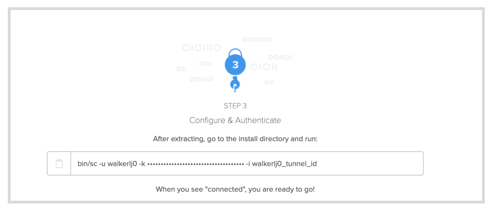

After `-u` you see your username and after `-k` you have your access key, and `-i` add the name you made up for your tunnel. Learn more about the other flags you can use to configure your tunnel at [Sauce Connect Proxy Command-Line Quick Reference Guide](https://wiki.saucelabs.com/display/DOCS/Sauce+Connect+Proxy+Command-Line+Quick+Reference+Guide). Hit enter and you should see your tunnel up and running:


### Use Cases for Sauce Connect with Testrunner

* You are running your tests in `docker` mode with a [Continuous Integration (CI) tool like Jenkins or Github Actions](https://docs.saucelabs.com/testrunner-toolkit/running-tests#run-tests-in-docker-mode-and-send-results-to-sauce-labs) and you need to communicate with an app that’s running locally in CI (i.e. tests and app both run in the same pipeline)
* You are running your tests and you need to communicate with an app that’s running behind a network firewall or on a local app server


<!-- ------------------------ -->
## 2.03 Run Your Cypress Test with Sauce Connect
Duration: 0:04:00

With Testrunner toolkit you can use Sauce Connect Proxy to run your Cypress tests thorugh a secure proxy tunnel when you run tests the Sauce Labs cloud of virtual machines (in the `sauce` `test-env`)

First, make sure that your Sauce Connect tunnel is currently running, as per the instructions in the last module. Now you can make a simple change to `.sauce/config.yml` and run your Cypress test

#### Video

### Start the Tunnel
If your tunnel is not already running, simply copy the command that you will find at the bottom of the **Tunnels** tab in the [Sauce Labs app](https://accounts.saucelabs.com/am/XUI/#login), navigate to the folder using the terminal where you saved the Sauce Connect download , and paste this into your terminal.

### Run a Test With a Tunnel

#### Find the Tunnel ID
You will need to take a look at the tunnel id that you have up and running. You can look on the [Sauce Labs app](https://accounts.saucelabs.com/am/XUI/#login) in the **Tunnels** tab and note the **Tunnel Name** (which is the `tunnel-id`), or use the one you entered to start Sauce Connect.

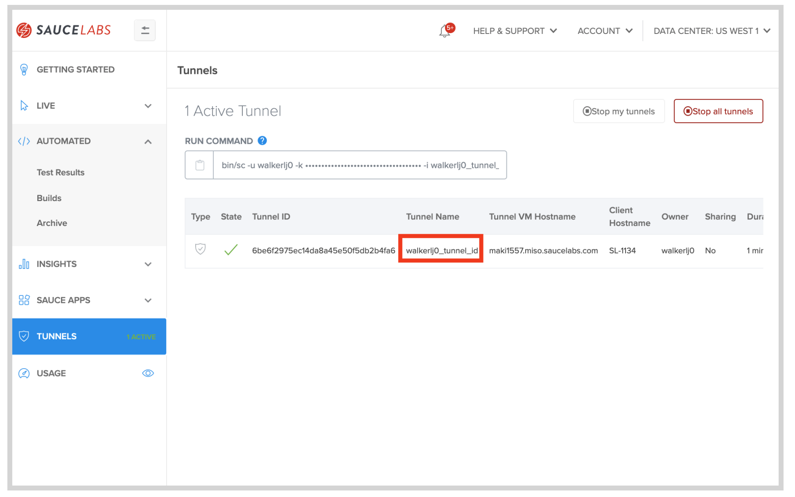

#### Use a Flag
The easiest way to run your existing tests through a tunnel is to use the command line with a `--tunnel-id` flag, also using the **Tunnel Name** from the **Tunnels** dashboard. Simply navigate to the test project and use the command

```
saucectl run --test-env sauce --tunnel-id your-tunnel-id
```

#### Update the Tunnel ID in Config

Open `.sauce/config.yml` in your test project file, and add or update the `tunnel: id:` under the `sauce:` configurations:

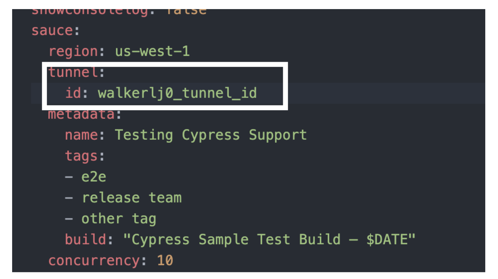

See the most up to date [configuration in the docs](https://docs.saucelabs.com/testrunner-toolkit/configuration/cypress).

### Parent Tunnels
Many companies may also choose to have their organization set up _Shared Tunnels_ on Sauce Labs, which anyone in their organization can use without having to worry about configuring their own tunnel.

To use a parent tunnel simply check the **Tunnels** tab on your Sauce Labs app to see your shared tunnels. You should be able to see the shared tunnel name, as well as an indication that it is in fact a shared tunnel, then use that ad the `tunnel-id` in your test suite:


<!-- ------------------------ -->
## 2.04 Test a Local App With Sauce Labs
Duration: 0:05:00

Cypress on Sauce with Testrunner Toolkit allows you to perform tests on an app that you have on your local machine (or other non-public environments), then test it against the wide variety of devices available on Sauce Labs.

In this example, we will be downloading the Swag Labs web app, and running it locally.

#### Video

### Download Swag Labs (Optional)

If you would like to follow along, download or fork the [example web app](https://github.com/saucelabs/sample-app-web). You can follow the [ReadMe](https://github.com/saucelabs/sample-app-web) and get it running locally. The basic steps are:
* Fork or download a copy of the project
* Use `npm install` to install dependencies
* Start the app with `npm run start`

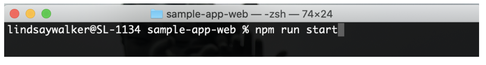

Once you have an app running on your machine, you will need to make changes to your test.

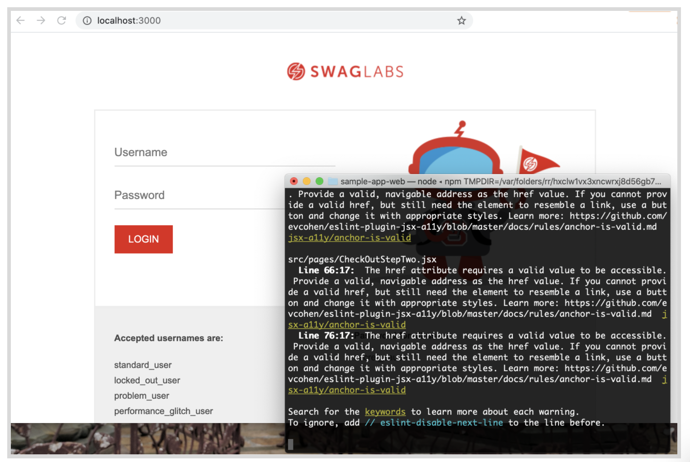

### Test a Local App With Sauce VMs
You can easily test your local app using _Sauce mode_ by setting up a Sauce Connect tunnel and using it with your Cypress Test to run a test agains an app running on your local machine

#### Start Sauce Connect
If your tunnel is not already running, open a new terminal window, and simply copy the command that you will find at the bottom of the **Tunnels** tab in the [Sauce Labs app](https://accounts.saucelabs.com/am/XUI/#login), navigate to the folder using the terminal where you saved the Sauce Connect software, and paste this into your terminal.

#### Update the Test URL
Go into the `cypress.json` file to update the `baseURL` that your tests will be running against.

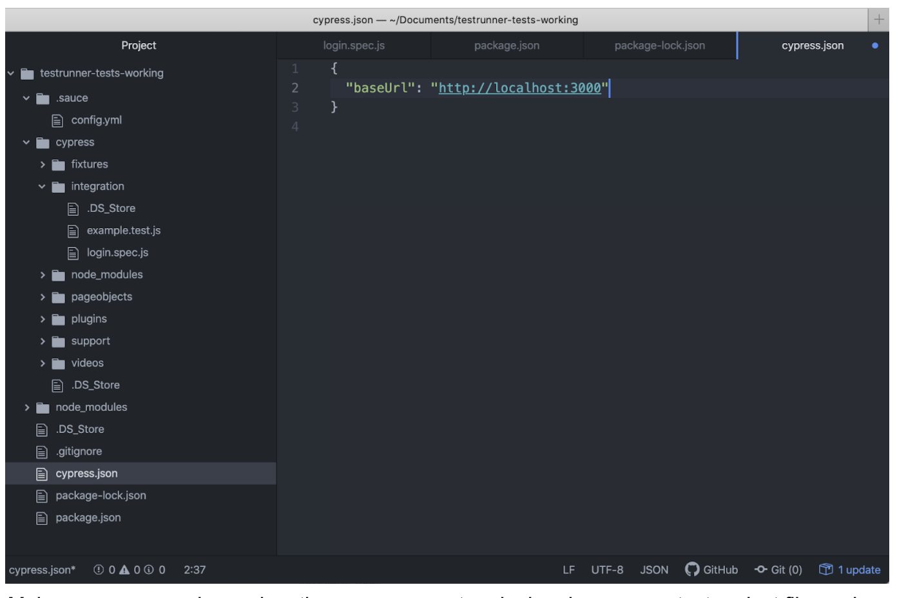


#### Run Your Test in Sauce Mode
Make sure your app and Sauce Connect are both running, then open a new terminal and open your test project file, and start the test using:

```
cd <your-project file>
saucectl run --test-env sauce
```
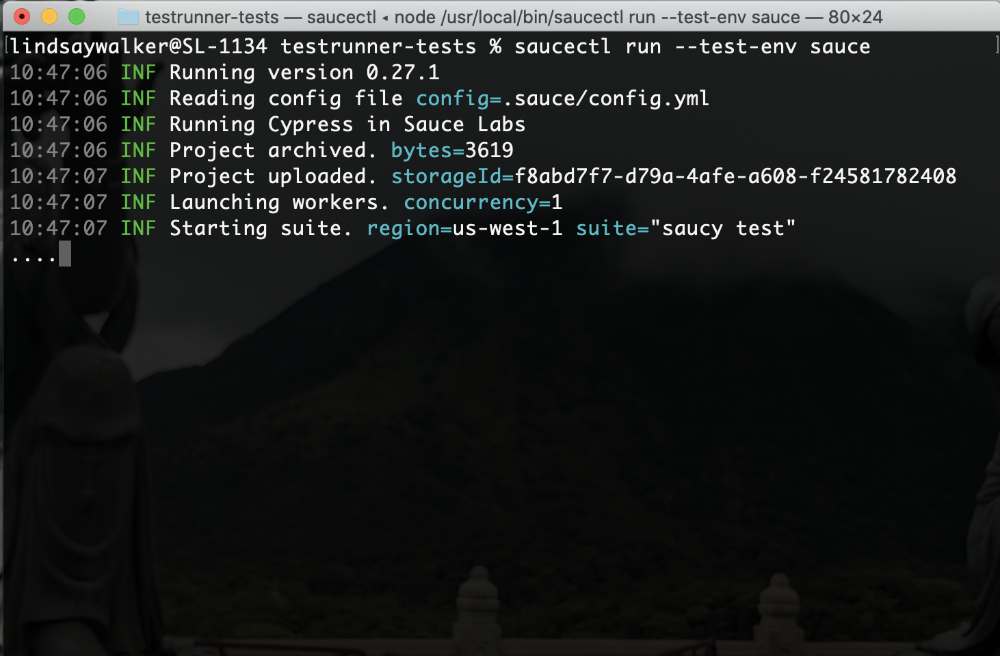

### Test a Local App in Docker Mode

To connect your tests run in a Docker container and pass the test results to Sauce Labs, you can do so without having a Sauce Connect tunnel running.

#### Update the Test URL

First, update the BaseURL in your `cypress.json` file to `http://host.docker.internal:3000` so Testrunner Toolkit will look for the app running on port 3000 on your local machine:

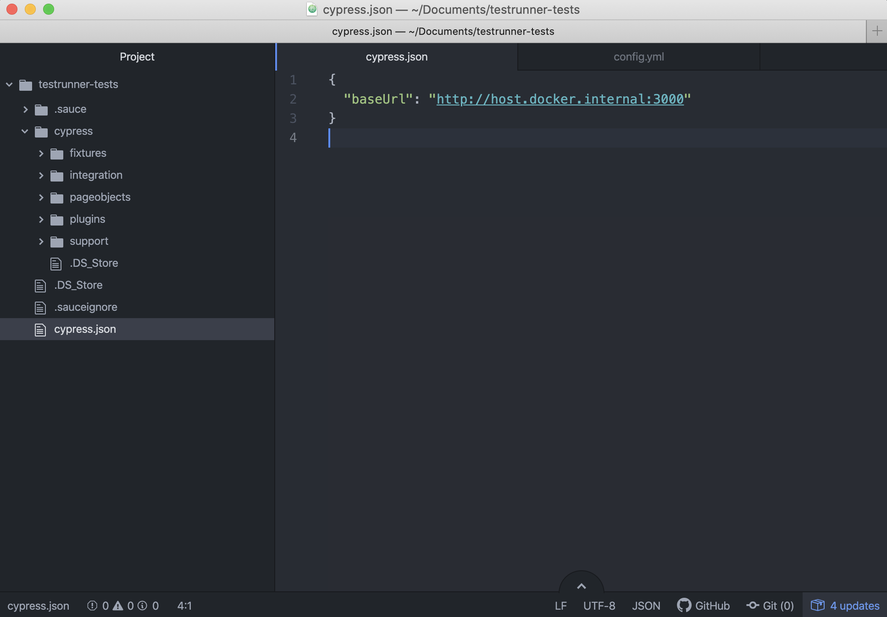

#### Run Your Test in Docker Mode
Now, you simply need to ensure your app is running on your local machine, and runt he command:

```
saucectl run
```

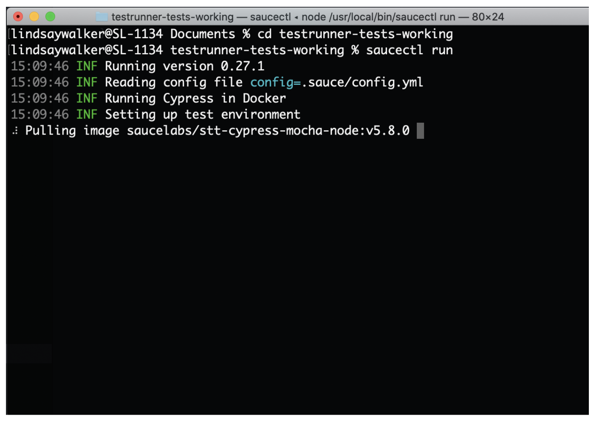

<!-- ------------------------ -->
## 2.05 Setup Your Cypress Test in GitHub Actions
Duration: 0:07:00

In this lesson you will learn how to set up everything you need to run the example Swag Labs app with Github Actions. If you already have a pipeline set up in GitHub actions, you can quickly set things up using the [page in docs](https://docs.saucelabs.com/testrunner-toolkit/integrations/github-actions).

Now that you have a test run on Sauce Connect, and have run a test against a locally hosted app, you are ready to set up your test in a Continuous Integration (CI) tool run through Sauce Connect.

#### Video

In this example we will be using Github Actions, but you can use another CI tool such as [Jenkins](https://docs.saucelabs.com/testrunner-toolkit/integrations/jenkins).

If you already have a Github account, you can get starte by visiting the [Github Actions Homepage](https://github.com/features/actions).

### What You'll Need
* [GitHub Account](https://github.com/join)
* [Sauce Labs Account](https://saucelabs.com/sign-up)
* The following permissions in GitHub:
    * The ability to create and manage workflows
    * The ability to create and store [GitHub secrets](https://docs.github.com/en/free-pro-team@latest/actions/reference/encrypted-secrets)
* The command used to launch the build of your app

### Set Up Your Project

#### Create or Fork a GitHub Repository for Your App
If you are following along with the Swag Labs app, create a new private fork for your version of the app:

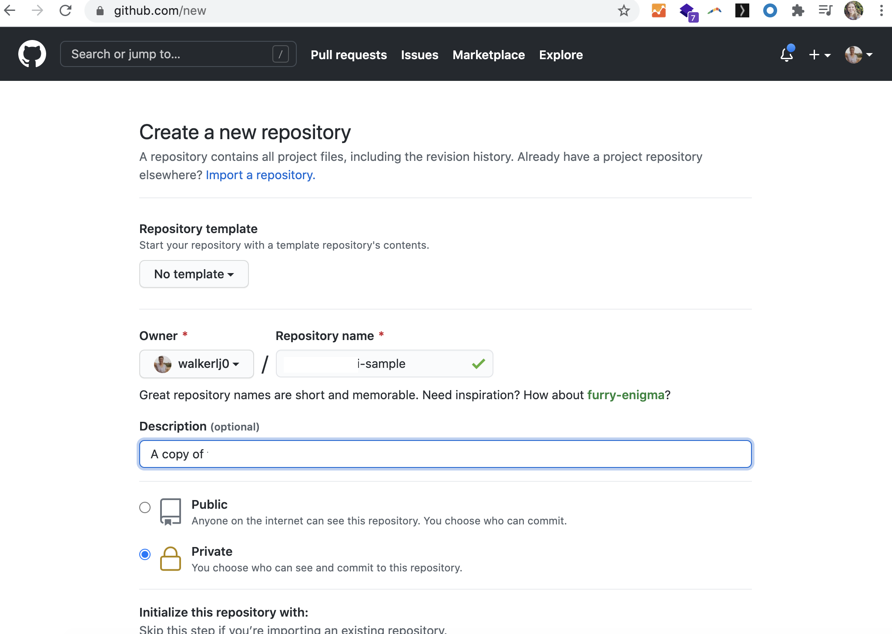

#### Note
Negative
: To follow along, fork then download a copy of the [example web app](https://github.com/saucelabs/sample-app-web). find a place to store it on your computer, and use `git clone your-forked-repo` to make a local copy, then `git add .`, `commit -m "initial commit"` and `git push` to push your local changes.


We will set up our test to run on every pull request made to a code repository.

#### Copy Your Cypress Tests Into Your Project

In your new repository, take a copy of the `cypress.json` and `/cypress` directory from the test code you had earlier, and add copies to your application.

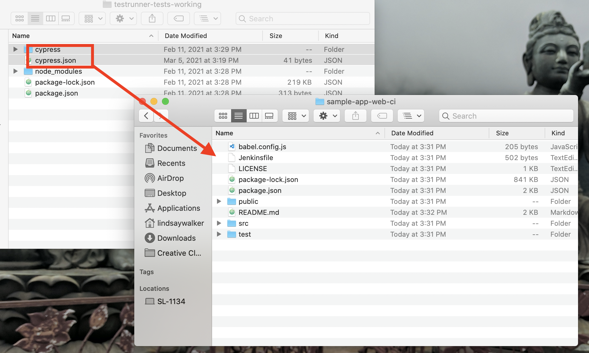

### Create GitHub Secrets

The first order of business is to export your [Sauce Labs account credentials](https://app.saucelabs.com/user-settings) and store them as GitHub Secrets.

1. Navigate to your project repository and select the __settings__ icon


2. Select __Secrets__
3. Click the __New secret__ button
4. Add the following:
    * Name: `SAUCE_USERNAME`
    * Value: `your-sauce-username`
5. Click __Add secret__ to finish.
6. Repeat the same steps above for your `SAUCE_ACCESS_KEY` (Not sure where to find `SAUCE_USERNAME` and `SAUCE_ACCESS_KEY` in Sauce Labs? They're [here](https://app.saucelabs.com/user-settings)).


#### Create YAML File

In your project file (in this example we will use the Swag Labs web app you downloaded) create a directory called `.github`, then within that, create a directory called `workflows`.

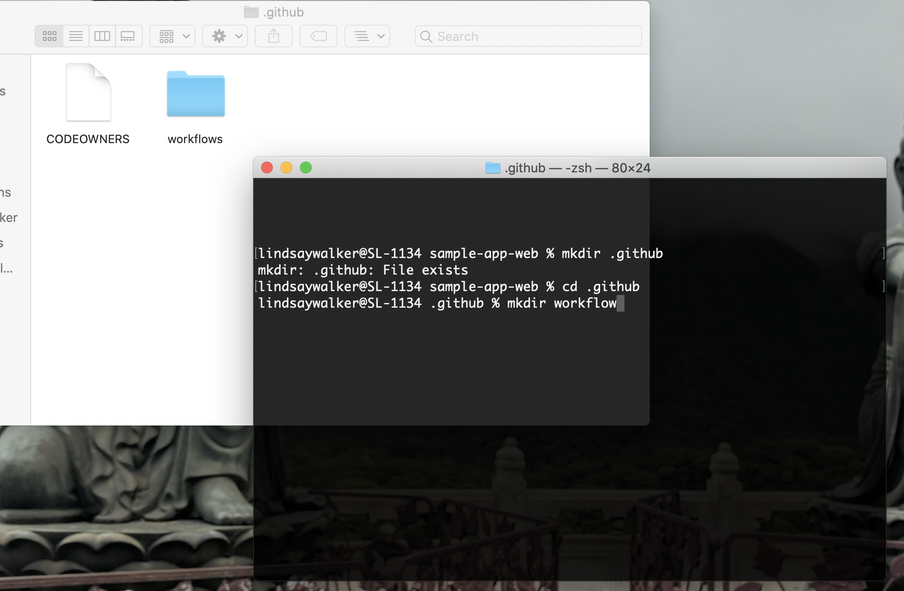

We will need to create a [new `.yml` file](https://docs.github.com/en/actions/quickstart) that is used to give instructions to Github Actions. This file will define the test jobs that will run on certain triggers called [events](https://docs.github.com/en/actions/reference/events-that-trigger-workflows).
Create a new file called `testrunner.yml`:


In the `testrunner.yml` file, copy and paste in the following:


```yaml
name: Sauce Cypress Pipeline Demo Tests

on:
  pull_request:
  push:
    branches:
      - master

env:
  SAUCE_ACCESS_KEY: ${{secrets.SAUCE_ACCESS_KEY}}
  SAUCE_USERNAME: ${{secrets.SAUCE_USERNAME}}

jobs:
```
The `on:` object allows you to specify [events](https://docs.github.com/en/actions/reference/events-that-trigger-workflows) that occur in a workflow, such as tests run against your repository. in this case the run on every pull request, and with every push to the `master` branch.

The `env:` object allows you to specify environment variables, which are stored as [Github secrets](https://docs.github.com/en/actions/reference/encrypted-secrets), for use in your tests. The `jobs:` object allows you to specify a group of individual actions that occur each time your app, in this case, has a pull request or push to master. Jobs are covered in the next module.


#### Note
Negative
: Setting `env` variable \s at the top of the file enables it globally, so all jobs in the workflow have access to these variables, so all jobs can use these variables, without specifying it in each job.


<!-- ------------------------ -->
## 2.06 Create the Github Actions Test Job
Duration: 0:02:00


In the examples below, we illustrate the different run modes that `saucectl` has: __Docker__ and the __Sauce Cloud__— both determine where tests execute. Docker refers to executing tests locally in a container, while Sauce refers to executing tests on Sauce Cloud (i.e. Sauce Labs infrastructure).
If you run your tests on the Sauce Cloud, you will likely require a tunnel back to where your application is running. A tunnel enables the remote browser to access your local network.
For this, we are going to use [Sauce Connect](/secure-connections/sauce-connect).

> For more detailed information on setting event-driven actions and jobs, please visit the [GitHub Action documentation](https://docs.github.com/en/free-pro-team@latest/actions/learn-github-actions/introduction-to-github-actions#the-components-of-github-actions).

```yaml reference
https://github.com/saucelabs/testrunner-toolkit/blob/master/.github/workflows/tests.yml#L93-L114
```

</TabItem>
<TabItem value="Sauce Cloud">

```yaml reference
https://github.com/saucelabs/sauce-docs/blob/master/.github/workflows/deploy.yml#L79-L93
```

<!-- ------------------------ -->
## 2.0X Module 2 Quiz
Duration: 0:02:00


<!--
1. What

a. You
b. You
c. You
d. You

*Sauce CTL...

2. Why does
a. To
b. To  
c. To
d. Its

*The purpose t.

3. The file ? Choose the answer that is the most correct:

a. The
b. The
c. The
d. The

* The .sauce/config.yml file ...
