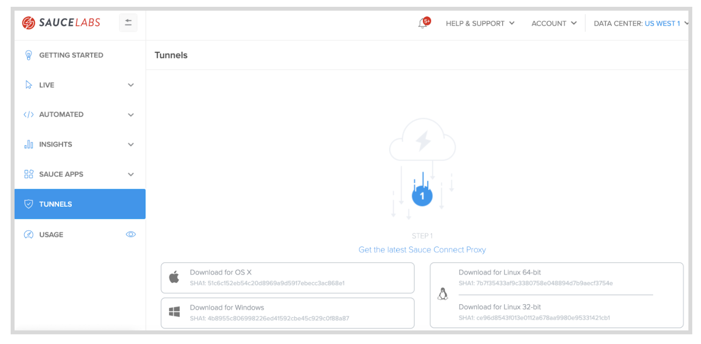
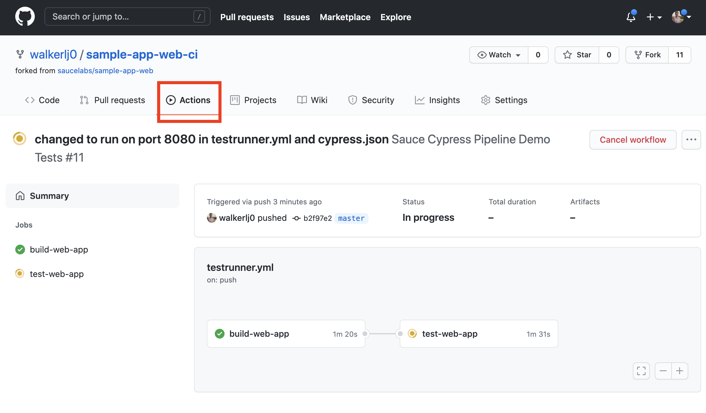

<!-- Copy this file into tools/site/coursenameFolder & start editing -->

summary: Module 2 of the Cypress on Sauce course ...
id: Module2-Testrunner
categories: beginner
tags: saucectl  
environments: Web
status: Draft
feedback link: https://forms.gle/CGu4QchgBxxWnNJK8
analytics account: UA-86110990-1
author:Lindsay Walker
<!-- ------------------------ -->
# Module 2 – Continuous Integration with Cypress and Sauce

<!-- ------------------------ -->
## 2.01 What You'll Learn
Duration: 0:01:00

### Skills & Knowledge

* How to install and set up Sauce Connect Proxy Tunnel on your machine
* Run a Cypress test through the Sauce Connect Proxy
  * Using your own tunnel you set up
  * Using a parent tunnel
* Configure and test a local app with SauceCTL
  * On Sauce Labs VM (in _Sauce Mode_)
  * On Docker, passing results to Sauce Labs (in _Docker Mode_)
* Setup your Cypress tests and app code in a CI tool (GitHub Actions) passing information to Sauce Labs
* Create and run a workflow with jobs that build and test an example app using GitHub Actions


<!-- ------------------------ -->
## 2.02 Set Up Sauce Connect
Duration: 0:03:00

[Sauce Connect Proxy](https://wiki.saucelabs.com/display/DOCS/Sauce+Connect+Proxy#:~:text=Sauce%20Connect%20Proxy%E2%84%A2%20is,or%20behind%20a%20corporate%20firewall.) is software that enables you to establish a secure connection between applications hosted on an internal server, or other location that is behind a firewall, and the Sauce Labs virtual machines that are used for testing. To use Sauce Connect you  simply need to:
* Install the Sauce Connect Software
* Start a tunnel from Terminal
* Run your tests with the flag `-i sauce-tunnel-name`  

#### Video

**[Setup Sauce Connect for Saucectl](https://youtu.be/tz1GPfFUxz0)**

<video id="tz1GPfFUxz0"></video>


Sauce Connect Proxy also allows you to create a secure connection for uploading tests, application, and source code. Sauce Connect Proxy uses a proprietary [TLS protocol](https://www.cloudflare.com/learning/ssl/transport-layer-security-tls/) to encrypt traffic between Sauce Labs and your network and servers. You will need to use Sauce Connect with Testrunner Toolkit if you are trying to test an application behind a firewall or other type of secured environment.


### Download Sauce Connect Proxy

The first step is to download The Sauce Connect Proxy software -- available on the **[Sauce Connect Proxy](https://wiki.saucelabs.com/display/DOCSDEV/Sauce+Connect+Proxy)** page in the Sauce Labs Cookbook -- and extract the contents of the **.zip** or **.gz** download package. You can also get the software on the [Sauce Labs](https://accounts.saucelabs.com/am/XUI/#login/?utm_source=referral&utm_medium=LMS&utm_campaign=link) platform under **Tunnels.**





Extracted the contents into another folder besides your **Dowloads** folder (take the Sauce Connect Proxy folder and move it into another directory). In this example, I moved mine into the **Documents** folder.


### Set Up Your Tunnel

Go to the **Tunnels** tab in the [Sauce Labs app](https://accounts.saucelabs.com/am/XUI/#login/?utm_source=referral&utm_medium=LMS&utm_campaign=link).


Navigate to the folder using the terminal where you saved the Sauce Connect download (this one is in **Documents/sc-4.6.2-osx**). Next, type and run the command below. Make sure to fill in your credentials (username after the `-u` command and access key after` -k`) and add your tunnel name (aka tunnel identifier) after the `-i `command.


```
bin/ sc -u <SAUCE_USERNAME> -k <SAUCE_ACCESS_KEY> -i <SAUCE_TUNNEL>
```

In this example, my tunnel name is `linds-proxy-tunnel.`


###Note
Negative
: **Create Environment Variables for Sauce Labs –** The first thing you should do when creating a test is set up environment variables on your local machine or CI tool for your `SAUCE_USERNAME` and `SAUCE_ACCESS_KEY`. It is important to save your Sauce username and access key as environment variables, instead of coding them into your test.  It will also make transitioning to a continuous integration pipeline easier, since they will use the same environment variables.  Watch [this video](https://drive.google.com/file/d/1qezKtvBpn94bBTJgbAd2MSx4ByNx7oaz/view?usp=sharing) to learn how to set up environment variables with your Sauce Labs credentials on a Mac, or view the [instructions for Windows](https://docs.google.com/document/d/1Cb27j6hgau5JHmAxGHPihd3V4Og3autPCei82_m1Ae8/edit?usp=sharing).

You also have the option to copy the command that you will find at the bottom of the **Tunnels** tab in the [Sauce Labs app](https://accounts.saucelabs.com/am/XUI/#login), and paste this into your terminal as well, instead of typing what is above. Once you paste, you can change the tunnel name after the `-i` flag:
```
-i sauce_connect_tunnel_name
```

Your copied command will look like this:


After `-u` you see your username and after `-k` you have your access key, and `-i` add the name you made up for your tunnel. Learn more about the other flags you can use to configure your tunnel at [Sauce Connect Proxy Command-Line Quick Reference Guide](https://wiki.saucelabs.com/display/DOCS/Sauce+Connect+Proxy+Command-Line+Quick+Reference+Guide). Hit enter and you should see your tunnel up and running:


### Use Cases for Sauce Connect with Testrunner

* You are running your tests in `docker` mode with a [Continuous Integration (CI) tool like Jenkins or Github Actions](https://docs.saucelabs.com/testrunner-toolkit/running-tests#run-tests-in-docker-mode-and-send-results-to-sauce-labs) and you need to communicate with an app that’s running locally in CI (i.e. tests and app both run in the same pipeline)
* You are running your tests and you need to communicate with an app that’s running behind a network firewall or on a local app server


<!-- ------------------------ -->
## 2.03 Run Your Cypress Test with Sauce Connect
Duration: 0:04:00

With Sauce Control and Testrunner Toolkit, you can use Sauce Connect Proxy to run your Cypress tests thorugh a secure proxy tunnel when you run tests the Sauce Labs cloud of virtual machines (in `--test-env sauce`) or in Docker, passing the data to Sauce Labs.

Negative
: First, make sure that your Sauce Connect tunnel is currently running, as per the instructions in the last module. Now you can make a simple change to `.sauce/config.yml` and run your Cypress test

#### Video
**[Run a Cypress Test With Sauce Connect](https://www.youtube.com/watch?v=AO3CavnpKq8)**

<video id="AO3CavnpKq8"></video>

### Start the Tunnel
If your tunnel is not already running, simply copy the command that you will find at the bottom of the **Tunnels** tab in the [Sauce Labs app](https://accounts.saucelabs.com/am/XUI/#login), navigate to the folder using the terminal where you saved the Sauce Connect download , and paste this into your terminal.

### Run a Test With a Tunnel

#### Find the Tunnel ID
You will need to take a look at the tunnel id that you have up and running. You can look on the [Sauce Labs app](https://accounts.saucelabs.com/am/XUI/#login) in the **Tunnels** tab and note the **Tunnel Name** (which is the `tunnel-id`), or use the one you entered to start Sauce Connect.


#### Use a Flag
The easiest way to run your existing tests through a tunnel is to use the command line with a `--tunnel-id` flag, also using the **Tunnel Name** from the **Tunnels** dashboard. Simply navigate to the test project and use the command

```
saucectl run --tunnel-id your-tunnel-id
```

#### Update the Tunnel ID in Config

Open `.sauce/config.yml` in your test project file, and add or update the `tunnel: id:` under the `sauce:` configurations:


See the most up to date [configuration in the docs](https://docs.saucelabs.com/testrunner-toolkit/configuration/cypress).

### Shared Tunnels

 Many companies may also choose to have their organization set up _Shared Tunnels_ on Sauce Labs, which anyone in their organization can use without having to worry about configuring their own tunnel.

 To use a shared tunnel simply check the **Tunnels** tab on your Sauce Labs app to see your shared tunnels you have access to. You should be able to see the shared tunnel name, the name of the owner of the tunnel as well, as an indication that it is a shared tunnel, then use the `tunnel-id` and the `tunnel-parent` in `.saucel/config.yml` or use a flag:

 

```
saucectl run --tunnel-id walkerlj0_shared_tunnel --tunnel-parent walkerlj0
```
#### Final Code
See the [example project](https://github.com/walkerlj0/testrunner-course-example-code/tree/main/Mod2/2.03) to see how the `tunnel` field is modified in `config.yml`.

<!-- ------------------------ -->
## 2.04 Test a Local App With Sauce Labs
Duration: 0:05:00

Cypress on Sauce with Testrunner Toolkit allows you to perform tests on an app that you have on your local machine (or other non-public environments), then test it against the wide variety of devices available on Sauce Labs.

In this example, we will be downloading the [Swag Labs web app](https://github.com/saucelabs/sample-app-web), and running it locally.

#### Video
**[Test a Local App With Saucectl](https://www.youtube.com/watch?v=N2qUff6KZ-M)**

<video id="N2qUff6KZ-M"></video>

Negative
: This video shows the workflow for testing in Sauce Mode, which requires Sauce Connect Tunnel to be open so Sauce Labs can access the app you are running on your local machine.

### Download Swag Labs (Optional)

If you would like to follow along, download or fork the [example web app](https://github.com/saucelabs/sample-app-web). You can follow the [README](https://github.com/saucelabs/sample-app-web) and get it running locally. The basic steps are:
* Fork or download a copy of the project
* Use `npm install` to install dependencies
* Start the app with `npm run start`


Once you have an app running on your machine, you will need to make changes to your test.


### Test a Local App With Sauce VMs
You can easily test your local app using _Sauce mode_ by setting up a Sauce Connect tunnel and using it with your Cypress Test to run a test agains an app running on your local machine

#### Start Sauce Connect
If your tunnel is not already running, open a new terminal window, and simply copy the command that you will find at the bottom of the **Tunnels** tab in the [Sauce Labs app](https://accounts.saucelabs.com/am/XUI/#login), navigate to the folder using the terminal where you saved the Sauce Connect software, and paste this into your terminal.

#### Update the Test URL
Go into the `cypress.json` file to update the `baseURL` that your tests will be running against.


#### Run Your Test in Sauce Mode
Make sure your app (and Sauce Connect if you are using it) are both running, then open a new terminal and open your test project file, and start the test using:

```
cd <your-project file>
saucectl run
```


### Test a Local App in Docker Mode

To run tests in _Docker mode_ (test are running in a Docker container) against an app running on your local machine, and pass the test results to Sauce Labs, you can stop any Sauce Connect tunnels you have running, then update the BaseURL variable.

#### Update the Test URL

First, update the BaseURL in your `cypress.json` file to `http://host.docker.internal:3000` so Testrunner Toolkit will run against the app running on port 3000 on your local machine:


#### Run Your Test in Docker Mode
Now, you simply need to ensure your app is running on your local machine, and run the command:

```
saucectl run --test-env docker
```


#### Final Code
[See the example project](https://github.com/walkerlj0/testrunner-course-example-code/tree/main/Mod2/2.04) with the swag labs app set to run locally, testing on Sauce Labs' VM


<!-- ------------------------ -->
## 2.05 Setup Your Cypress Test in GitHub Actions
Duration: 0:07:00

In this lesson you will learn how to set up everything you need to run the example Swag Labs app with Github Actions. If you already have a pipeline set up in GitHub actions, you can quickly set things up using the [page in docs](https://docs.saucelabs.com/testrunner-toolkit/integrations/github-actions).

#### Video
[Set up a Cypress Test Project with Github Actions](https://youtu.be/JIPH-43KuxQ)

<video id="JIPH-43KuxQ"></video>

Now that you know how to run a test against a locally hosted app, as well as use Sauce Connect, you are ready to set up your test in a Continuous Integration (CI) tool using Saucectl and Sauce Connect. You can follow along using the same _Swag Labs_ app you used in the previous module.

In this example we will be using Github Actions, but you can use another CI tool such as [Jenkins](https://docs.saucelabs.com/testrunner-toolkit/integrations/jenkins).


### What You'll Need
* [GitHub Account](https://github.com/join)
* [Sauce Labs Account](https://saucelabs.com/sign-up)
* The following permissions in GitHub:
    * The ability to create and manage workflows
    * The ability to create and store [GitHub secrets](https://docs.github.com/en/free-pro-team@latest/actions/reference/encrypted-secrets)
* The command used to launch the build of your app

_Learn more at the [Github Actions Homepage](https://github.com/features/actions)._
### Set Up Your Project

#### Create a Copy of the App
If you are following along with the [Swag Labs app](https://github.com/saucelabs/sample-app-web), create a new private fork, or download a version of the app:


#### Note
Negative
: To follow along, fork then download a copy of the [example web app](https://github.com/saucelabs/sample-app-web). Find a directory to store it on your computer, and use `git clone your-forked-repo` to make a local copy, then `git add .`, `commit -m "initial commit"` and `git push` to push your local changes.


We will set up our test to run on every pull request made to a code repository.

### Copy Your Cypress Tests Into Your Project

In your new repository, take a copy of the `cypress.json` and `/cypress` directory from the test code you had earlier, and add copies to your application.


### Initialize a SauceCTL Project in Your App
Now that you have a copy of your Cypress test files in your app. This can be done two ways:
* Run `saucectl new` and update the `.sauce/config.yml` file to contain the same thing as the one in your other test directory.
* Copy `.sauce/config.yml` and `.sauceignore`, as well as the `cypress` and `cypress.json` files from your test project into your app file.


#### Note
Negative
: If you are using the sample app, you will want to make it so the workflows from the other `.yml` files included in this app don't run (in the directory `.github/workflow`) by appending `.bak` on the end, this way the other workflows in the app won't run when you commit or push. 

### Create GitHub Secrets

The first order of business is to export your [Sauce Labs account credentials](https://app.saucelabs.com/user-settings) and store them as GitHub Secrets.

1. Navigate to your project repository and select the __settings__ icon


2. Select __Secrets__
3. Click the __New secret__ button
4. Add the following:
    * Name: `SAUCE_USERNAME`
    * Value: `your-sauce-username`
5. Click __Add secret__ to finish.
6. Repeat the same steps above for your `SAUCE_ACCESS_KEY` (Not sure where to find `SAUCE_USERNAME` and `SAUCE_ACCESS_KEY` in Sauce Labs? They're [here](https://app.saucelabs.com/user-settings)).


#### Create YAML File

In your project file (in this example we will use the Swag Labs web app you downloaded) create a directory called `.github`, then within that, create a directory called `workflows`.


We will need to create a [new `.yml` file](https://docs.github.com/en/actions/quickstart) that is used to give instructions to Github Actions. This file will define the test jobs that will run on certain triggers called [events](https://docs.github.com/en/actions/reference/events-that-trigger-workflows).
Create a new file called `testrunner.yml`:


In the `testrunner.yml` file, copy and paste in the following:


```
name: Sauce Cypress Pipeline Demo Tests

on:
  pull_request:
  push:
    branches:
      - master

env:
  SAUCE_ACCESS_KEY: ${{secrets.SAUCE_ACCESS_KEY}}
  SAUCE_USERNAME: ${{secrets.SAUCE_USERNAME}}
  SAUCECTL_VERSION: "0.34.1"
  BUILD_PREFIX: true

jobs:
```


The `on:` object allows you to specify [events](https://docs.github.com/en/actions/reference/events-that-trigger-workflows) that occur in a workflow, such as tests run against your repository. in this case the run on every pull request, and with every push to the `master` branch.

The `env:` object allows you to specify environment variables, which are stored as [Github secrets](https://docs.github.com/en/actions/reference/encrypted-secrets), for use in your tests setting it at the top allows all actions to run using these variables.

The `jobs:` object allows you to specify a group of individual actions that occur each time your app, in this case, has a pull request or push to master. Jobs are covered in the next module.


#### Note
Negative
: The `SAUCECTL_VERSION` variable should be set to the [latest release version listed](https://github.com/saucelabs/saucectl).

#### Final Code
[See an example](https://github.com/walkerlj0/testrunner-course-example-code/tree/main/Mod2/2.06) of how the app code & workflow file is set up with Cypress tests.


<!-- ------------------------ -->
## 2.06 Create and Run a Github Actions Test Job
Duration: 0:08:00

Github Actions is a community that has [a collection of repositories](https://github.com/actions) that allows you to automate tasks such as testing, publishing, and deploying your projects that you have published on Github. Github actions works by creating a virtual environment where you will build and test the app (e.g. the code you have committed to your repo), and running jobs in that environment.

#### Video

[Create and Run Jobs with a Cypress Test in GitHub Actions](https://youtu.be/6NViGmm4baY)

<video id="6NViGmm4baY"></video>

In this lesson, you are going to use actions to create two jobs:
* **build-web-app**
  * Do a check to make sure you can build your web app
* **test-web-app**
  * Use the [action](https://github.com/actions/setup-python) to install Python to the environment where your tests are run
  * Use the [action](https://github.com/actions/checkout) to checkout the code for the web app from your repo
  * Install `npm` dependencies
  * Build your app (again) to test against
  * Use the [action](https://github.com/saucelabs/sauce-connect-action) to setup Sauce Connect Tunnel
  * Use the [action](https://github.com/marketplace/actions/saucectl-run-action) to install & use `saucectl` to run your tests


### Create a Job to Build Your App

The first thing you will need to do is create a job that will quickly build your app to test and make sure it can be built successfully, before running the next action that builds and run the tests.
```
jobs:
  build-web-app:
    runs-on: ubuntu-latest
    steps:
      - uses: actions/checkout@v2
      - uses: actions/setup-node@v1
        with:
          node-version: 12.x
      - name: Install Dependencies
        run: |
          npm install
      - name: Run Build
        env:
          CI: false
        run: |
          npm run build
```
### Create a Job to Test the App
Now that you have the test build job created, you can create another job that will test the web app. At the same level as the **build-web-app**, create a **test-web-app** job:

```
name: Sauce Cypress Pipeline Demo Tests

on:
  pull_request:
  push:
    branches:
      - master

env:
  SAUCE_ACCESS_KEY: ${{secrets.SAUCE_ACCESS_KEY}}
  SAUCE_USERNAME: ${{secrets.SAUCE_USERNAME}}
  SAUCECTL_VERSION: "0.34.1"
  BUILD_PREFIX: true

jobs:
  build-web-app:
    runs-on: ubuntu-latest
    steps:
      - uses: actions/checkout@v2
      - uses: actions/setup-node@v1
        with:
          node-version: 12.x
      - name: Install Dependencies
        run: |
          npm install
      - name: Run Build
        env:
          CI: false
        run: |
          npm run build
  test-web-app:
```
 Add in the **runs-on**, **needs**, and **steps** fields:

 ```
   test-web-app:
    runs-on: ubuntu-latest
    needs: build-web-app
    steps:
 ```

This test job **needs** the `build-web-app` job to run first, and that the names of these should match. The **runs-on** specifies the virtual environment that GitHub Actions runs the app and tests in (an Ubuntu container).

#### Note
Negative
: The variable `CI` is one recognized by CI tools, and if it's set to the default `true`, that may in fact cause [errors when running a build](https://dev.to/kapi1/solved-treating-warnings-as-errors-because-of-process-env-ci-true-bk5) of your app.

#### Install Python
Python is used within the virtual Ubuntu environment to serve the app you are testing, (A NodeJS server is running your tests, and we don't want them to have race conditions) so when you run the test-web-app job, install Python first:

```
steps:
  - name: Install Python
    uses: actions/setup-python@v2
    with:
      python-version: 3.7
```

#### Checkout Code

 Underneath the Python installation action, you will add in the command so your workflow (`testrunner.yml`) can access your repository code in a specific point in time.

This action checks out your repository code, based on the latest commit on your working branch, and stores it in the variable `$GITHUB_WORKSPACE`.


```
steps:
  ...
  - name: Checkout Github App Code
    uses: actions/checkout@v2
```

#### Install Dependencies
The tests are run using a NodeJS server within the GitHub Ubuntu environment, and Node Package Manager (`npm`) is used to update and install the related dependencies

```
steps:
  ...
  - name: Install Dependencies
    run: |
      npm install
```

#### Build Your App
Here your workflow will build your app again, preparing it to be tested against.

```
steps:
  ...
  - name: Run Build
    env:
      CI: false
    run: |
      npm run build
```

#### Set Up Sauce Connect
This action uses the Sauce Connect Action which will downoload the Sauce Connect proxy software to the virtual Ubuntu environment tho commands:
* Sets your environment to exit the process if there is an error running the tunnel
* Install Sauce Connect
* Start the Sauce Connect Proxy Tunnel

under the `Run Build` step, add in:

```
steps:
  ...
  - name: Download & Use Sauce Connect Tunnel
    run: |
      set -e
      curl -L -s https://saucelabs.com/downloads/sc-4.6.4-linux.tar.gz | sudo tar -xvz
      sc-4.6.4-linux/bin/sc -u $SAUCE_USERNAME -k $SAUCE_ACCESS_KEY -i proxy-tunnel-$GITHUB_RUN_ID &
```

Note that in this case the flag -`i proxy-tunnel-$GITHUB_RUN_ID` spins up (& tears down) a new tunnel each time the workflow is run.

Negative
: Make sure you have GitHub secrets set up for your SAUCE_USERNAME and SAUCE_ACCESS_KEY.

#### Use SauceCTL to Run Tests
Use the action to install Sauce Control, then run the tests by building on `port 8000` and running the tests:

```
steps:
  ...
  - name: Install saucectl
    run: |
      curl -L -s https://github.com/saucelabs/saucectl/releases/download/v${SAUCECTL_VERSION}/saucectl_${SAUCECTL_VERSION}_linux_64-bit.tar.gz | sudo tar -xvz -C /usr/bin/
  - name: saucectl run
    run: |
      # Expose website
      cd build/ && python3 -m http.server 8000 &
      saucectl run -c ./.sauce/config.yml --tunnel-id proxy-tunnel-$GITHUB_RUN_ID --test-env sauce


```

### Update BaseURL
In the `cypress.json` (or wherever else you reference the URL of the app you are testing against), set up the tests to run against port 8000:

```
{
  "baseUrl": "http://localhost:8000"
}
```

### Commit Your Changes
Now that you have the `jobs:` set up in `.github/workflows/config.yml` the workflow should kick off when you push your changes to your GitHub (remote) repo.



#### Final Code
See [the example of the testrunner.yml file](https://github.com/walkerlj0/testrunner-course-example-code/blob/main/Mod2/2.06/.github/workflows/testrunner.yml) to compare and copy.  


<!-- ------------------------
## Module 2 Quiz


<!--
1. What

a. You
b. You
c. You
d. You

*Sauce CTL...

2. Why does
a. To
b. To  
c. To
d. Its

*The purpose t.

3. The file ? Choose the answer that is the most correct:

a. The
b. The
c. The
d. The

* The .sauce/config.yml file ...
-->
