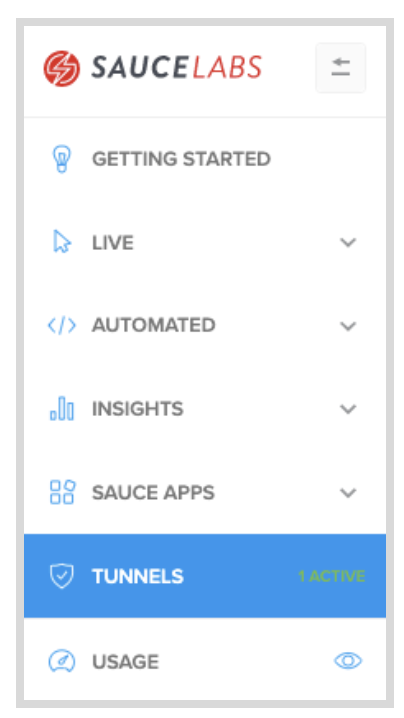

<!-- Copy this file into tools/site/coursenameFolder & start editing -->

summary: Module 2 of the Cypress on Sauce course ...
id: Module2-Testrunner
categories: beginner
tags: testrunner  
environments: Web
status: Draft
feedback link: https://forms.gle/CGu4QchgBxxWnNJK8
author:Lindsay Walker
<!-- ------------------------ -->
# Module 2 –

<!-- ------------------------ -->
## 2.01 What You'll Learn
Duration: 0:01:00

### Skills & Knowledge

* How


<!-- ------------------------ -->
## 2.02 Set Up Sauce Connect
Duration: 0:03:00

[Sauce Connect Proxy](https://wiki.saucelabs.com/display/DOCS/Sauce+Connect+Proxy#:~:text=Sauce%20Connect%20Proxy%E2%84%A2%20is,or%20behind%20a%20corporate%20firewall.) is software that enables you to establish a secure connection between applications hosted on an internal server and the Sauce Labs virtual machines (such as Jenkins) or real devices that are used for testing. It also allows you to create a secure connection for uploading tests, application, and source code.

In many cases, testers need to run their tests on internal sites. These can be dev/staging versions of their production site or actual internal sites only employees use. In either case, these sites are not available out in the open internet for sauce to access. The best, most secure option is to create a connection with Sauce Connect Proxy. Sauce Connect Proxy uses a proprietary [TLS protocol](https://www.cloudflare.com/learning/ssl/transport-layer-security-tls/) to encrypt traffic between Sauce Labs and your network and servers.


### Download Sauce Connect Proxy

The first step is to download The Sauce Connect Proxy software -- available on the **[Sauce Connect Proxy](https://wiki.saucelabs.com/display/DOCSDEV/Sauce+Connect+Proxy)** page in the Sauce Labs Cookbook -- and extract the contents of the **.zip** or **.gz** download package. You can also get the software on the [Sauce Labs](https://accounts.saucelabs.com/am/XUI/#login/?utm_source=referral&utm_medium=LMS&utm_campaign=link) platform under **Tunnels.**


Once you’ve extracted the contents, take the Sauce Connect Proxy folder and move it into another directory. In this example, I moved mine into the **Documents** folder.


### Set Up Your Tunnel

Go to the **Tunnels** tab in the Sauce Labs app.





Navigate to the folder using the terminal where you saved the Sauce Connect download (this one is in **Documents/sc-4.6.2-osx**). Next, type and run the command below. Make sure to fill in your credentials (username after the `-u` command and access key after` -k`) and add your tunnel name (aka tunnel identifier) after the `-i `command.


```
bin/ sc -u <SAUCE_USERNAME> -k <SAUCE_ACCESS_KEY> -i <SAUCE_TUNNEL>
```

###Note
Negative
: **Create Environment Variables for Sauce Labs –** The first thing you should do when creating a test is set up environment variables on your local machine in the (.zshrc or .bash profile) for your `SAUCE_USERNAME` and `SAUCE_ACCESS_KEY`. It is important to save your Sauce username and access key as environment variables, instead of coding them into your test, so that when you share your tests or upload them to Github, your private access keys aren’t shared.   It will also make transitioning to a continuous integration pipeline easier, since they will use the same environment variables.  Watch [this video](https://drive.google.com/file/d/1qezKtvBpn94bBTJgbAd2MSx4ByNx7oaz/view?usp=sharing) to learn how to set up environment variables with your Sauce Labs credentials on a Mac, or view the [instructions for Windows](https://docs.google.com/document/d/1Cb27j6hgau5JHmAxGHPihd3V4Og3autPCei82_m1Ae8/edit?usp=sharing).

You can copy the command that you will find at the bottom of the **Tunnels** page, and paste this into your terminal as well, instead of typing what is above. Once you paste, append the command line with `-i <Sauce tunnel name>`:. In this example, I’ve called mine `linds-proxy-tunnel.`


Your command should look like this:


After `-u` you will see your username and after` -k `you will have your access key, and `-i  `prepend the name you made up for your tunnel. Learn more about the other commands you can use to configure your tunnel at [Sauce Connect Proxy Command-Line Quick Reference Guide](https://wiki.saucelabs.com/display/DOCS/Sauce+Connect+Proxy+Command-Line+Quick+Reference+Guide). Hit enter and you should see your tunnel up and running.


<!-- ------------------------ -->
## 2.0x Title
Duration: 0:01:00

<!-- ------------------------ -->
## 2.0x Title
Duration: 0:01:00

<!-- ------------------------ -->
## 2.0x Title
Duration: 0:01:00

<!-- ------------------------ -->
## 2.0X Module 2 Quiz
Duration: 0:02:00


<!--
1. What

a. You
b. You
c. You
d. You

*Sauce CTL...

2. Why does
a. To
b. To  
c. To
d. Its

*The purpose t.

3. The file ? Choose the answer that is the most correct:

a. The
b. The
c. The
d. The

* The .sauce/config.yml file ...
