summary: Module 3 of the API Testing course. Now that you have learned the basics of API Testing and the API Fortress Interface, let's dive deeper into the test component library.
id: Module3-APITesting
categories: beginner
tags: zapi
environments: Web
status: One or more of (Draft, Published, Deprecated, Hidden)
feedback link: https://forms.gle/CGu4QchgBxxWnNJK8
analytics account: UA-86110990-1
author: James Tacker
<!-- ------------------------ -->
# Module 3 – Test Component Library

<!------------------------------>

## 3.01 What You'll Learn
Duration: 0:02:00

Below are the primary learning objectives for this module:

**Assertions and Request Components**
* Determine the different types of assertions and requests you can use with your API test
* Understand the different types of output when adding assertions to an a API test
* Understand the various use cases for adding a request component to an API test.

**Variables**
* Understand the difference between global variables and input sets
* Demonstrate how to store sensitive variable data and/or secrets in the Vault

<!------------------------------>
## 3.02 Component Library
Duration: 0:03:00

The test component library contains many useful test components that can enrich and add further validity to your API Tests.

To access the component library:

* Open a test
* Select the `+` symbol at the top of the Test Composer

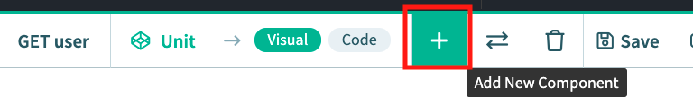

All available test components, as well as a search bar, appears on the next screen.

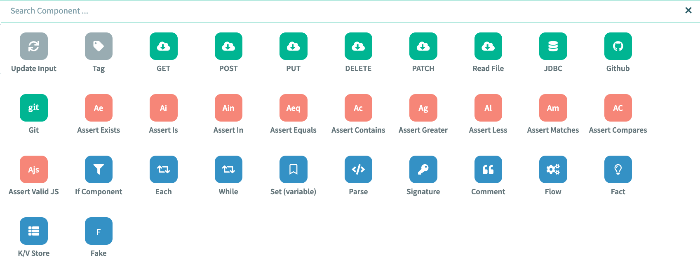

#### Example

If you select the **Tag** component at the top, it will automatically add this component to the bottom of your test like in this image:

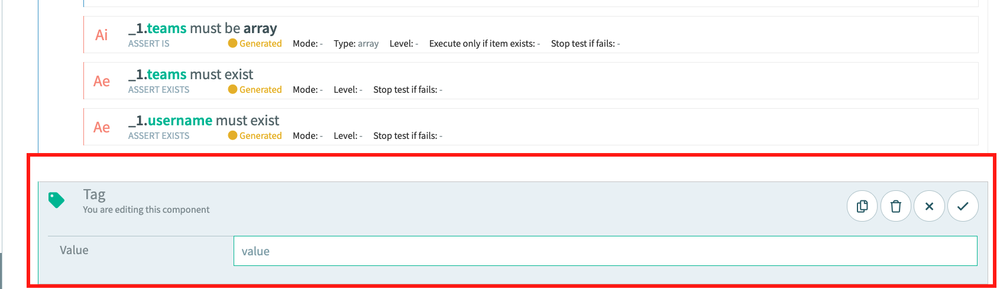

You can add any of the following components to your test, depending on your use case. For example:

* **Update Input**: Store and/or updates a variable in an _input set_
* **JDBC**: Connect this request to a database using a [JDBC API](https://en.wikipedia.org/wiki/Java_Database_Connectivity#).
* **K/V Store**: Store and retrieve ephemeral data from a `key:value` store.

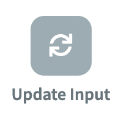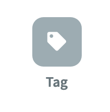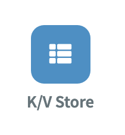

There are many components you can play around with, and hover over them to see what they do, but next you will focus on **Request**, the building block of every API test.

<!-- ------------------------ -->

## 3.03 Request Component
Duration: 0:04:00

A **Request** component is the foundation for creating a new test in API Fortress. Whether you wish to test a chain of multiple requests, or a single request, the request component is where your test should begin. The available request components are:

* GET
* POST
* PUT
* DELETE
* PATCH

Refer to the [API Testing Basics](https://training.saucelabs.com/codelabs/Module1-APITesting/#3) module for further details about API request methods.

### Note:
Negative
: In the previous module, [_Introduction to API Fortress_](https://training.saucelabs.com/codelabs/Module2-APITesting/index.html#0), we used the **Generate Test** button. This button automagically generates the HTTP request, assertions, and other test elements so that you can focus on the more intricate and tricky parts of your tests. In this module we will build a test from scratch to build understanding of the importance of assertions, but refer back to that test for inspiration and ideas on how to design your assertions.

### Exercise: Add a GET Request Component

1. Open your project and create a new test:
   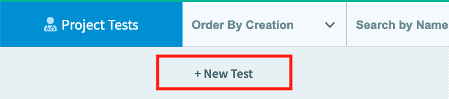
1. Name it **AssertionTest** (we cover _assertions_ in the next module):
   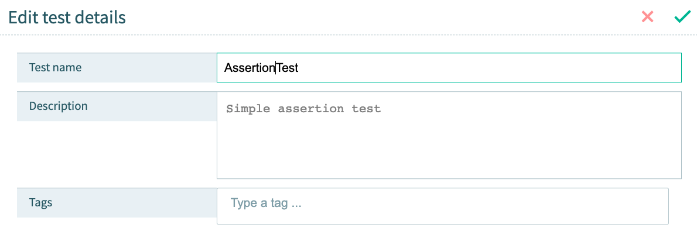
1. Select **Compose**, then select **+Add Request/Assertions** in the Test Composer.
   
1. Select the **GET Request** component and add the following data:
   * url: `https://saucelabs.com/versions.json`
   * var: `payload`
     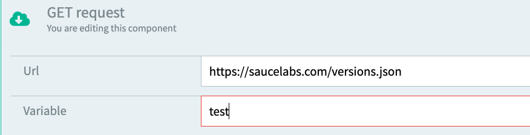
1. This is what the finished result should look like:
   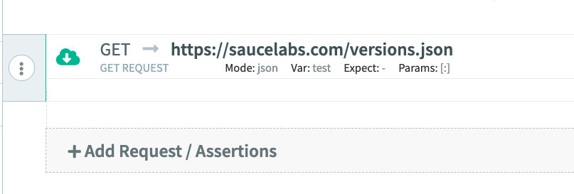

In the next section you will work with  **Assertion** components, learning how they are a vital part of your API tests.

<!-- ------------------------ -->

## 3.04 Assertion Component
Duration: 0:04:00

There's a common phrase in the automated testing space: "If there is **no assertion**, it **isn't a test**." The previous sentence demonstrates a common [testing anti-pattern](http://www.everydayunittesting.com/2017/03/unit-testing-anti-pattern-not-asserting.html); even if your code doesn't throw an errors or crash, it doesn't mean it's a valid test.

In order to validate an API endpoint works properly, you must _assert_ whether the API's expected output is correct or incorrect.

There are several assertions to choose from and below are a few examples, along with the accompanying documentation:

* **[Assert Exists](https://docs.saucelabs.com/api-testing/assertion-components/assert-exists)**: Checks whether an item exists or not
* **[Assert Contains](https://docs.saucelabs.com/api-testing/assertion-components/assert-contains)**: Checks an item has a specific substring (e.g. test the word _Uber_ for product names like: _UberX_, _UberBlack_, etc.)
* **[Assert Is](https://docs.saucelabs.com/api-testing/assertion-components/assert-is)**: Checks whether the value of an item is correctly defined (e.g. _url_, _boolean_, _integer_, etc.)

### Exercise: Add an Assertion

1. Open the previous test  you created, called **AssertionTest**.
1. Select **+Add Request/Assertions**, and select **Assert Exists** with the following data:
   * Expression: `payload['Sauce Connect']`
   * Mode: `one`
   * Click the check mark to save
1. Next, select **+Add Request/Assertions** again. This time select **Assert Is**, and add the following data:
   * Expression: `payload['Sauce Connect'].download_url`
   * Type: `url`
   * Click the check mark to save
1. Here's what the final result should look like:
   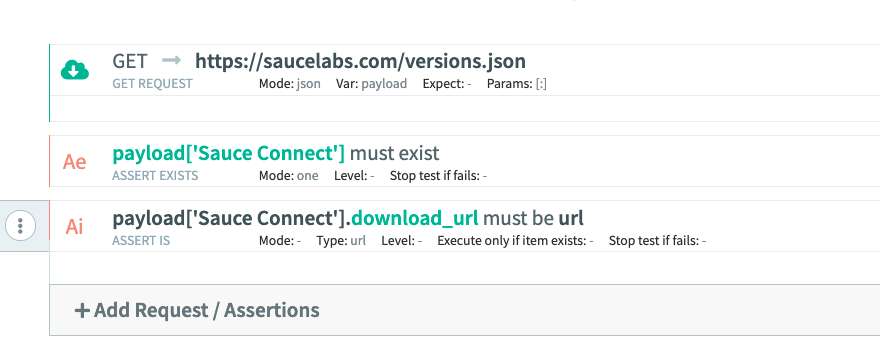
1. Click **Save** to save your test, then select **Run > Default Downloader**. The test results should look like this:
   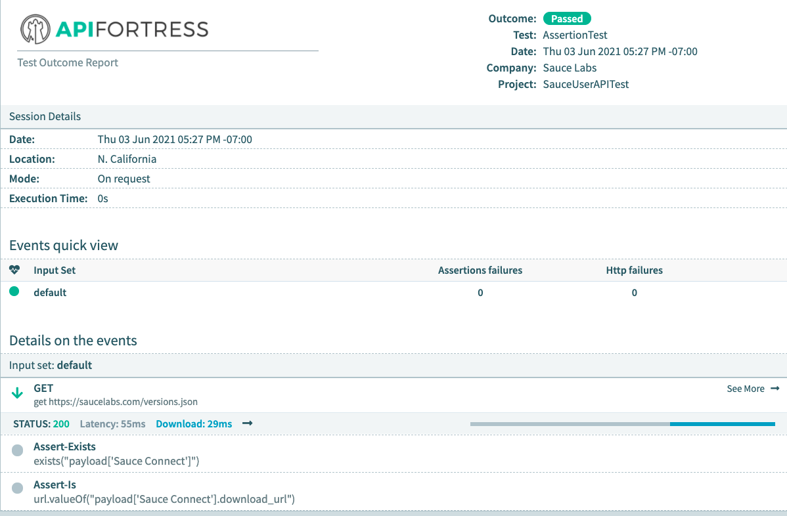

### Recap
* We created a **GET** request in the previous module that returned a JSON object
* We created an **Assertion** to validate the "Sauce Connect" object existed
* We created another **Assertion** to verify that the object field "download_url" was indeed a `url`

In the next section we will cover how to store information as a **Global Variable**, or an **Input Set**.

<!-- ------------------------ -->

## 3.05 Global Variables vs. Input Sets
Duration: 0:04:00

As the complexity and number of tests in your test suite increase, it's a best practice to parametrize test details and data to allow more flexibility. There are generally two ways to store data within API Fortress:

* **Global Variables**
* **Input Set**

### Global Variables

The global variables (referred to as **parameters** in the API Fortress interface), are usually common variables designed to run with an entire test such as authentication API Key, or a domain name. Global variables can be used across different tests in a project.

To add a global variable/parameter select the **Input Set** tab to the right of the interface, and select **Add Global Param**.

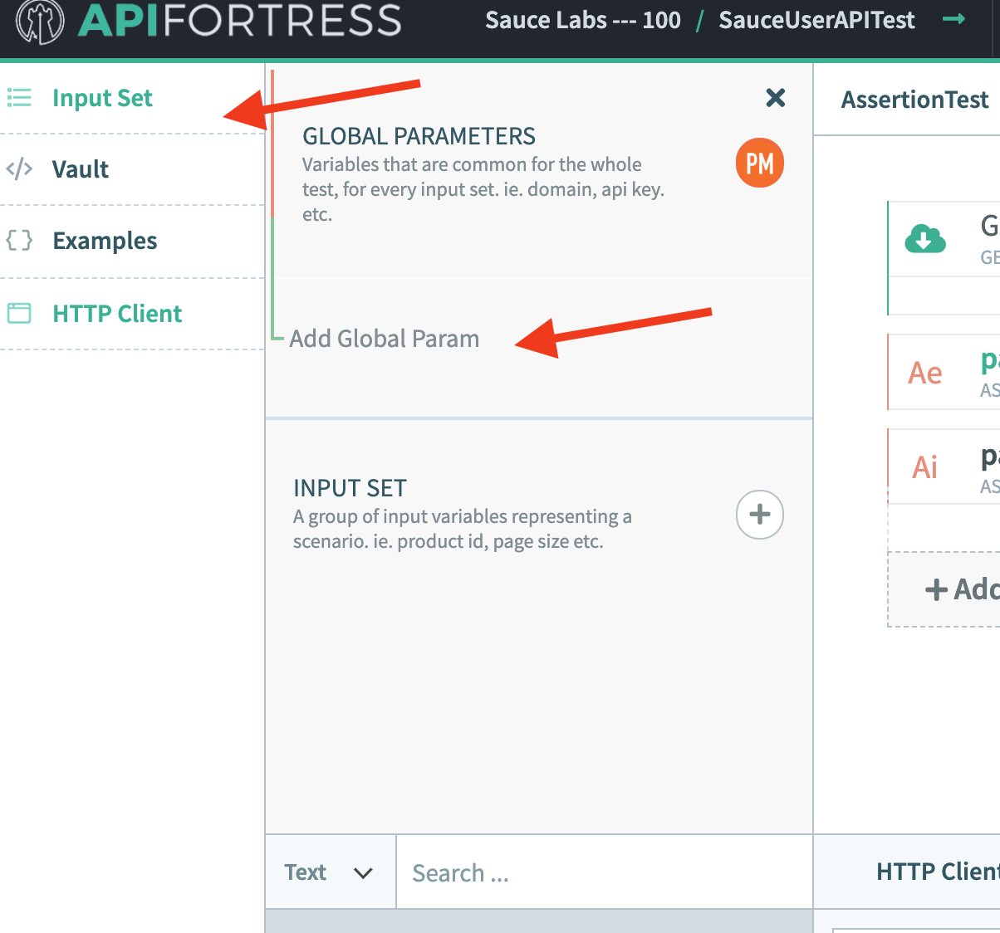

### Input Sets

An input set differs from a global parameter in that it is usually a group of input variables related to a specific scneario or contextual use case—for example a list of relevant product ids returned from a product API endpoint. Input sets are used within a single test.

To add an input set select the **Input Set** tab to the right of the interface, and select **Input Set**.

### Create Global Parameters

Navigate and select the Input Set tab on the left side of the interface to begin the exercise.

   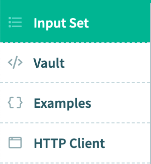

1. Select **Add Global Parameters** in the _Global Parameters_ section
   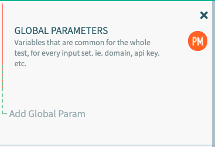
1. Add the following data to the global parameter:
   * Name: `domain`
   * Value: `saucelabs.com`
   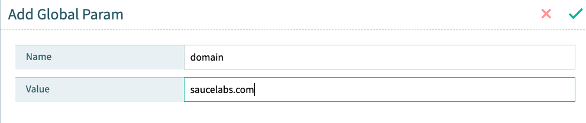

Next we need to substitute the `domain` value in the current GET request:
1. In the menu to the left of the **GET** request component, select **Edit component**
   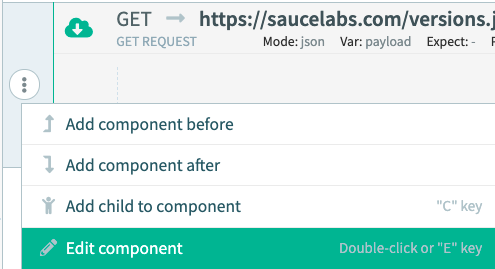
1. Substitute `saucelabs.com` with the `${domain}` global parameter:
   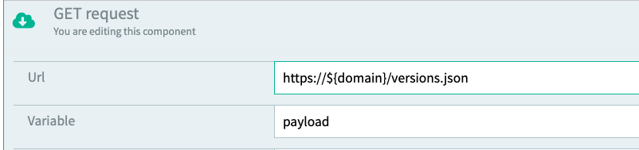
1. Run the test again to ensure the test still passes with the same result.
1. Create `protocol` and `uri` global parameters. The values should `https://` and `/versions.json` respectively
1. Add  Below is what the finished result should look like:
   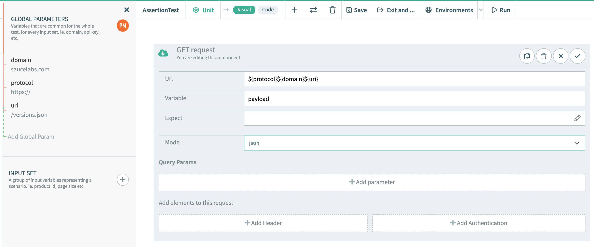

### Note:
Negative
: Please refer to the documentation for further information on [using variables](https://docs.saucelabs.com/api-testing/quick-start/flexible-variables-for-flexible-environments).

In the next section we will discover how to store some of the information we created in the [Vault](https://docs.saucelabs.com/api-testing/quick-start/the-vault#vault-overview).

<!-- ------------------------ -->
## 3.06 The Vault
Duration: 0:07:00

The Vault is a unique feature of the API Fortress platform that allows you to store information for use across all projects. while Input Sets are typically only used within the same test or project, the vault allows you to store things that can be used across any project.

The Vault allow you to save more than just variables, with the vault you can save, edit, and reuse almost anything including:

* Variables
* Code snippets (think reused authentication flows)
* Any assertions and code elements

In the Vault, you can store data at three different levels: scope, project, and global. At the project level the vault will allow you to reuse those values across any test within that project scope. Similarly, the global level allows use of stored values across any test within any project.

#### Note:
Negative
: If you plan on re-using code snippets from the Vault, make sure those variables remain consistent across each test. Also note that if you set an input set or global parameter with the same name, those values will override what is saved in the Vault.

### Exercise: Use the Vault to Store a Snippet
To add a snippet to your account.
1. Select the elements you wish to store (hold **SHIFT** and click _first and last elements_ to select a range).
1. Open the Vault side Menu. Then select the `+` icon next to **Snippets**:
   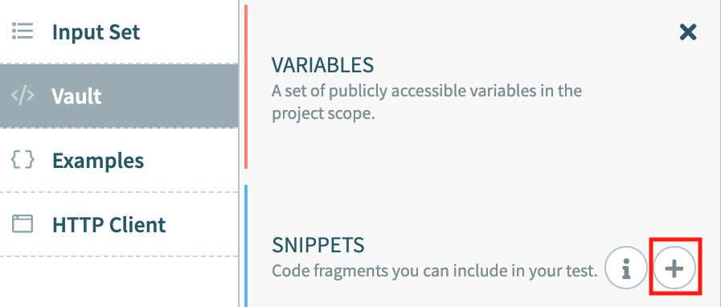
1. Fill in the following details for the snippet:
   * Name: `QuickAssertionSnippet`
   * Description: `quick test to store snippet in the vault`
   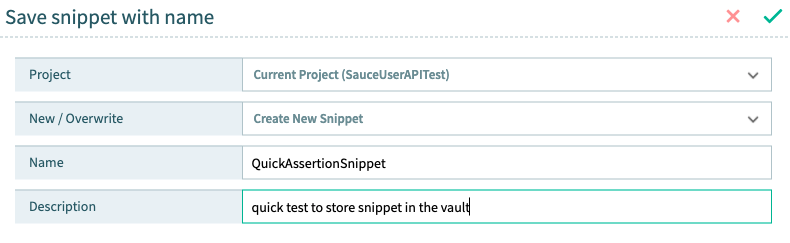
1. Save the snippet. It should now appear in the Snippets section of the vault:
   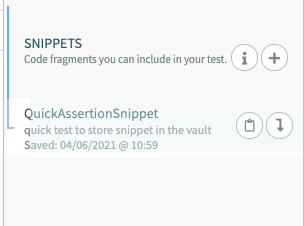

#### Note
Negative
: In order to delete a snippet, select **Vault** in the top menu, find the project where the snippet is stored, and click on the snippet to access the trash can icon. 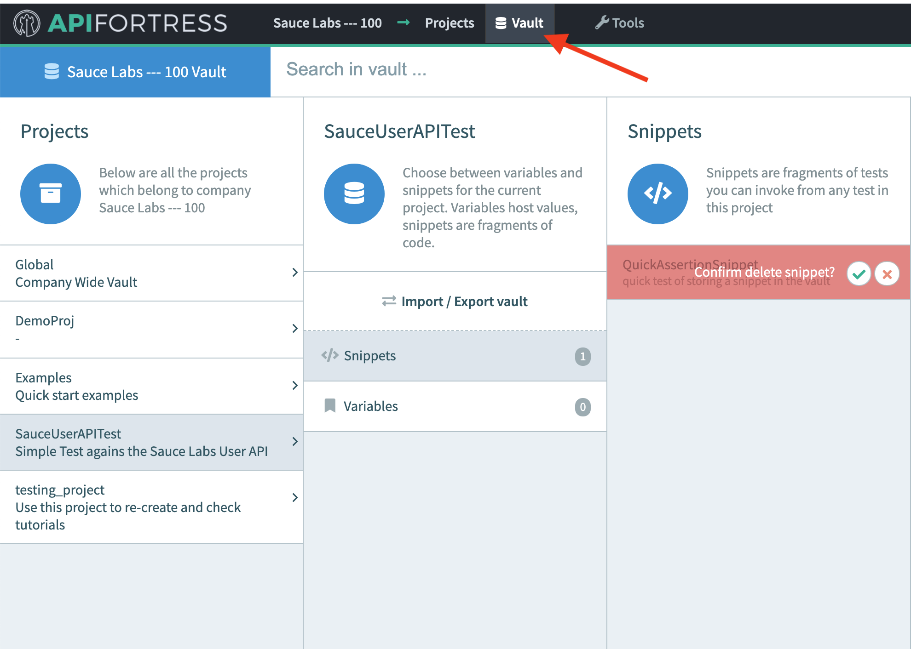

### Using a Snippet
If you wish to re-use this snippet in a different project, create a new empty test, and open up the **Vault** menu on the side. Choose the bottom element in your test, and click the arrow to either invoke the snippet, or to copy and paste the component:

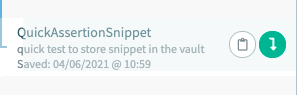

Now you just need to make sure variables are aligned:

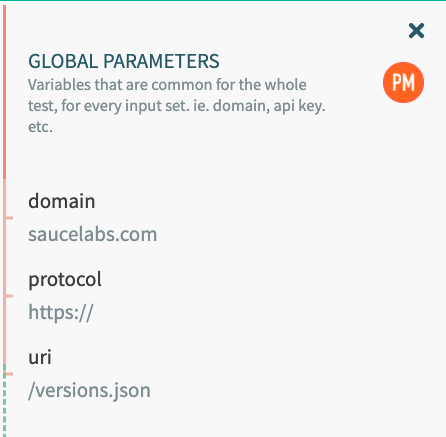

The finished result should be identical to your previous test:

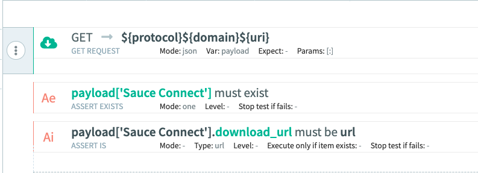

This approach is much easier than recreating the entire test from scratch! Run your test to see the report.

### Adding and Editing Variables in the Vault

Access the Vault and add variables and code snippets by first clicking on the **Vault** in the main menu.

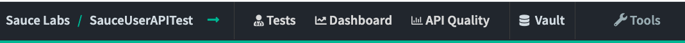

From here you can access and edit code for snippets:

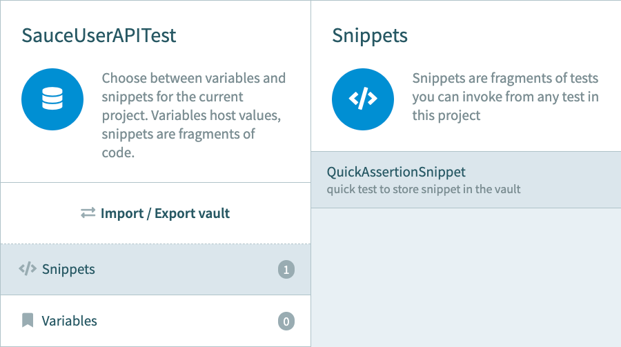

Or access and edit variables for both global project-specific snippets and variables.

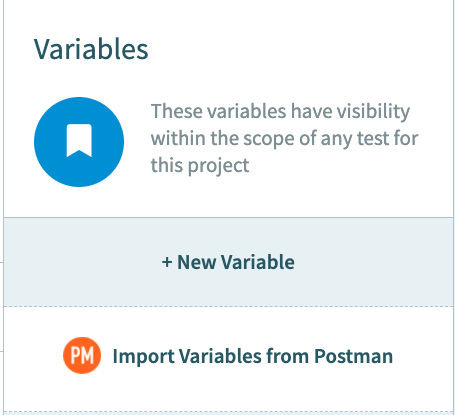

To learn more about The Vault and Environments see below links: [Learn the Basics](https://docs.saucelabs.com/api-testing/quick-start/the-vault/index.html), [Environments Basics](https://apifortress.com/doc/environments-vault-and-overrides-magic/), [Using Variables](https://docs.saucelabs.com/api-testing/quick-start/flexible-variables-for-flexible-environments)

<!-- ------------------------ -->

## 3.07 Module 3 Quiz
Duration: 0:03:00
