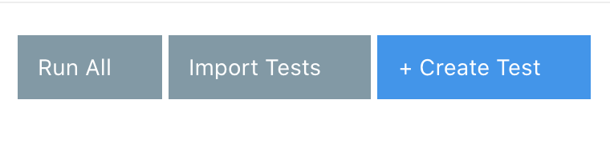

summary: Module 3 of the API Testing course. In this module you will learn about the components you can add to a test, and practice creating a test using assertion components, request components, global variables, input sets, and the vault.
  
id: Module3-APITesting
categories: intermediate
tags: zapi
environments: Web
status: One or more of (Draft, Published, Deprecated, Hidden)
feedback link: https://forms.gle/CGu4QchgBxxWnNJK8
analytics account: UA-86110990-1
author: James Tacker
<!-- ------------------------ -->
# Module 3 – Create a Test Using Components

<!------------------------------>

## 3.01 What You'll Learn
Duration: 0:02:00

In this module, you will be learning to create your own test from scratch with test components, using requests (such as GET or POST), assertions that check if data exists, and use variables, input sets, and the Vault to store and reuse elements of your tests.

**Assertions and Request Components**
* Determine the different types of assertions and requests you can use with your API test.
* Understand the different types of output when adding assertions to an a API test.
* Understand when and why you want to use certain request components in an API test.

**Variables**
* Understand the difference between global variables and input sets.
* Learn about how and when to use Input Sets and Variables.
* Demonstrate how to store sensitive variable data and/or secrets in the Vault.


<!------------------------------>
## 3.02 Component Library
Duration: 0:03:00

The test component library contains many useful test components that can enrich and add further validity to your API Tests. This level covers the basics of components you can add to your API test.

### Experiment with Components

To access the component library:

1. Open a new blank test.
2. Select the `+` symbol at the top of the Test Composer.


All available test components, as well as a search bar, will appear on the next screen.


#### Example

If you select the **Tag** component at the top, it will automatically add this component to the bottom of your test, like in this image:


You can add any of the following components to your test, depending on your use case. For an example some examples in the screenshot below:

* **Update Input**: Store and/or updates a variable in an _input set_.
* **JDBC**: Connect this request to a database using a [JDBC API](https://en.wikipedia.org/wiki/Java_Database_Connectivity#).
* **K/V Store**: Store and retrieve ephemeral data from a `key:value` store.
* **Fake**: Generates fake data for your test, particularly for `POST` and `PUT` requests.


There are many components you can play around with, and hover over them to see what they do, but next you will focus on **Request**, the building block of every API test.

<!-- ------------------------ -->

## 3.03 Request Component
Duration: 0:04:00

In this lesson, you will learn to add a GET request component in a test.

### Types of Requests

A **Request** component is the foundation for creating a new test in API Fortress. Whether you wish to test a chain of multiple requests, or a single request, the request component is where your test should begin. The available request components are:

* GET
* POST
* PUT
* DELETE
* PATCH

Refer to the [API Testing Basics](https://training.saucelabs.com/codelabs/Module1-APITesting/#3) module for further details about API request methods.

### Note:
Negative
: In the previous module, [_Introduction to API Fortress_](https://training.saucelabs.com/codelabs/Module2-APITesting/index.html#0), we used the **Generate Test** button. This button automatically generates the HTTP request, assertions, and other test elements so that you can focus on the more intricate and tricky parts of your tests. In this module, we will build a test from scratch in order to understand the importance of assertions, but refer back to that test for inspiration and ideas on how to design your assertions.

### Add a GET Request Component

* Open your project and create a new test.<br/>

   

* Name it **Sauce_Connect_Test** (This example is named **AssertionTest**).<br/>

   

* Select **+Add Request/Assertions** in the Tests page.<br/>

   

* Select the **GET Request** component and add the following data:

   * url: `https://api.us-west-1.saucelabs.com/rest/v1/public/tunnels/info/versions`
   * var: `payload`

   


This is what the finished result should look like:

   

In the next section, you will work with **Assertion** components, learning how they are a vital part of your API tests.

<!-- ------------------------ -->

## 3.04 Assertion Component
Duration: 0:04:00

There's a common phrase in the automated testing space: "If there is **no assertion**, it **isn't a test**." In this lesson, you will add an assertion after the GET request in the **Sauce_Connect_Test** you created in the last lesson.

### Why Assertions?

This sentence demonstrates a common [testing anti-pattern](http://www.everydayunittesting.com/2017/03/unit-testing-anti-pattern-not-asserting.html); even if your code doesn't throw errors or crash, it doesn't mean it's a valid test.

In order to validate an API endpoint works properly, you must _assert_ whether the API's expected output is correct or incorrect.

There are several assertions to choose from and below are a few examples, along with the accompanying documentation:

* **[Assert Exists](https://docs.saucelabs.com/api-testing/mark2/assertion-components/assert-exists/)**: Checks whether an item exists or not.
* **[Assert Contains](https://docs.saucelabs.com/api-testing/mark2/assertion-components/assert-contains/)**: Checks an item has a specific substring (e.g., test the word _Uber_ for product names like: _UberX_, _UberBlack_).
* **[Assert Is](https://docs.saucelabs.com/api-testing/mark2/assertion-components/assert-is/)**: Checks whether the value of an item is correctly defined (e.g., _url_, _boolean_, _integer_).

In this example, you will be checking that when you ping the endpoint `https://api.us-west-1.saucelabs.com/rest/v1/public/tunnels/info/versions` that a payload is return (it exists) and the one of the fields, the `"info_url"` is in fact a url.

If you check the **HTTP Client** tool, you should see the elements we are checking for:


### Add an Assertion

1. Open the previous test you created, called **Sauce_Connect_Test**.
2. Select **+Add Request/Assertions**, and select **Assert Exists** with the following data:
   * Expression: `payload['downloads']`
   * Mode: `one`
   * Click the check mark to save

     

3. Next, select **+Add Request/Assertions** again. This time select **Assert Is**, and add the following data:
   * Expression: `payload['info_url`]
   * Type: `url`
   * Click the green checkmark to save.

     

4. Here's what the final result should look like.

   

5. Click **Save** to save your test, then select **Run**. The test results should show up in the UI.

   


### Recap
* We created a **GET** request in the previous module that returned a JSON object.
* We created an **Assertion** to validate the "Sauce Connect" object existed.
* We created another **Assertion** to verify that the object field "download_url" was indeed a `url`.

In the next section, we will cover how to store information as a **Global Variable**.

<!-- ------------------------ -->

## 3.05 Global Variables
Duration: 0:04:00

As the complexity and number of tests in your test suite increase, it's a best practice to name and store test details such as common variables or data sets to allow more flexibility. There are three ways to store data within the API Testing platform:

* **Global Variables**
* **Input Sets**
* **The Vault**

This lesson covers how to use Global Variables.

#### Video
**[API Testing – Global Variables](https://youtu.be/feiL0CKWFhU)**

<video id="feiL0CKWFhU"></video>

### Global Variables

The global variables (referred to as **parameters** in our API Testing interface), are usually common variables designed to run with an entire test such as authentication API Key, or a domain name. Global variables can be used across different tests in a project.

To add a global variable/parameter, select the **Input** tab in the top left, and select **Add Global Param**.


### Create Global Parameters

To begin the exercise, open your **Sauce_Connect_Test**, navigate to the **Input** tab on the left side of the interface, and select it.

   

Select **Add Global Param** in the _Global Parameters_ section.

Add the following data to the global parameter:
   * Name: `domain`
   * Value: `api.us-west-1.saucelabs.com`

   

   The parameter now appears in the **Global Parameters** section.

   

Next, we need to substitute the `domain` value in the current GET request:
* To get back to our test code, select **Unit** in the tab at the top.

   

* Select the ellipsis to the left of the **GET** request component, then select **Edit component**.

   

* Substitute `saucelabs.com` with the `${domain}` global parameter:

   

* Run the test again to ensure the test still passes with the same result.

* Repeat steps 1-3 above and create `protocol` and `endpoint` global parameters. The values for the respective params should be `https://` and `/rest/v1/public/tunnels/info/versions`, respectively.

The finished result should look like this:


### Note:
Negative
: Please refer to the documentation for further information on [creating variables](https://docs.saucelabs.com/api-testing/vault/) and [managing variables](https://docs.saucelabs.com/api-testing/variables-environment-overrides/).


In the next section, we will cover how to store information as an **Input Set**.

<!-- ------------------------ -->
## 3.06 Input Sets
Duration: 0:07:00

### Input Sets
An input set is an object (usually a group of input variables related to a specific scenario or use case), For example a list of relevant product ids returned from a product API endpoint. In this lesson you will:

* Create Input Sets
* Add information about Sauce Connect Tunnels to an Input Set
* Use Input Sets with a GET component
* Create and run tests with Input Sets

#### Video
**[API Testing – Input Sets](https://youtu.be/5aUNzcabivs)**

<video id="5aUNzcabivs"></video>

When you add and use an Input Set, it means you will run a separate instance of your tests for each Input Set created. For example, if you created three Input Sets for `username` and `password`, your tests would be run three times, using each set of credentials. Input Sets are used within a single test.

To add an input set, select the **Input** tab in the top left. If there is a default input set, you will want to edit or delete it before creating your own.

### Create Input Sets

First, click on the **Input** button on the top left hand side of the test page. Under the **Input Set** section you create two Input Sets called `tunnel_owner_1` and `tunnel_owner_2`.


In each of the input sets, add in the following sets of variables:

```bash
tunnel_owner_1

owner
xxxxx

tunnel_id
xxxx

tunnel_owner_2

owner
xxxxx

tunnel_id
xxxx

```

You will replace the `x`s with values once you get owner and tunnel ids form the Sauce Labs Tunnels dashboard.

### Get Information About Sauce Connect Tunnels
For this course, we will be using Sauce Connect Tunnels. To learn how to start a tunnel, see our [Sauce Connect Setup video on YouTube](https://www.youtube.com/watch?v=cpBcGeZ_wQU&t=9s) or [Module 1 of our Sauce Connect course](https://training.saucelabs.com/codelabs/Module1-SauceConnect/index.html?index=..%2F..sauceconnect#1). You should use tunnels that you own, or shared tunnels you have access to start and stop.

Start at least two tunnels, then go to the [Sauce Labs Tunnels page](https://app.saucelabs.com/tunnels). Get the values for the **Tunnel ID** and **Owner**, and replace those values in the **Input Sets** you created on the API Testing dashboard.


### Add Parameters to the Input Sets

Now, you should have values like this, which match the values on your Tunnels page:


### Create a New GET Component with Input Sets
Now, you will create another GET component in your **Sauce_Connect_Test** that will use the input sets you just created.

This request will use the Sauce Connect API Call to [GET Tunnel Information](https://docs.saucelabs.com/dev/api/connect/#get-tunnel-information). Add a GET component to your test.
 * In the **Url** field, add `https://api.us-west-1.saucelabs.com/rest/v1/${owner}/tunnels/${tunnel_id}`.
 * In the **Variable** field, add `scpayload`, where the response will be stored.

 

 You will also need to add a **Add Authentication** (Basic) with a Sauce username and access key  for a user who has access to both the tunnels you used in your Input Set.


### Use Input Sets in a Test

Now, lets add two simple checks after this get request. Add in two components:

* An **Assert Exists**, checking that there is in face, an `scpayload` variable with the response.
* Use the `owner` variable in an **Assert Equals** component, one that checks that the owner retrieved from the GET request matches the owner your set for that tunnel.


The test should now look like this:


Now, once you save and **Run** your test, the test will be run one for the input set `tunnel_owner1` and once for the input set `tunnel_owner2`, a total of four GET commands, since there are two GET commands in each tests.


#### Recap

To summarize, we have created a test that:
* Checks to make sure that the endpoint where you download the Sauce Connect software is working
* Checks to see that the tunnels running for as many sets of user/tunnel id combinations as you would like.

In the next section, we will discover how to store some of the information we created in the Vault.

<!-- ------------------------ -->
## 3.07 The Vault
Duration: 0:07:00

The [Vault](https://docs.saucelabs.com/api-testing/vault/) is a unique feature of the API Fortress platform that allows you to store information for use across all projects or tests.

#### Video
**[API Testing – The Vault](https://youtu.be/kjdZWpxHH1c)**

<video id="kjdZWpxHH1c"></video>

### The Vault vs. Inputs

While Input Sets are typically only used within a given test, the vault allows you to store inputs and parameters that can be used across multiple test in your project. This is known as your **Project Vault**. In this lesson, you will learn how to:

* Save code Snippets (or Variables) to a project vault
* Use Snippets (or Variables) across tests in a project
* Save a Variable (or Snippet) in a company Vault
* Use  Variables (or Snippets) across tests in different projects

The **Project Vault** allows you to save more than just variables; you can also save, edit, and reuse almost anything, including:

* Variables
* Code snippets (think reused authentication flows)
* Any assertions and code elements

#### Note:
Negative
: A quick note on "Vault Scope." There is a key difference between the **Project Vault** vs. the **Company Vault**. In general, whatever you store in the Company Vault can be used across all project tests, but if there exists a similar value in your _Project Vault_, that value wins and overrides the value in the _Company Vault_. [More on this later](#company-vault).


### Exercise: Use the Vault to Store a Snippet

First, what is a **Code Snippet**? A snippet is a fragment of a test, stored in the Vault, that can be reused. For example if you want to re-use an authentication header, or perhaps there's a `POST` body value you wish to re-use in multiple requests.

For this example, we don't need both the GET methods in the same test since the first one only needs to be run once (and not for every input set) we will store and re-use this part of the test.

To add the snippet to your project Vault:
1. Open your test.

2. Select all the elements (hold **SHIFT** and click the _first and last elements_ to select a range).

3. Select the **Export to Snippet** icon from the toolbar.

   

3. Fill in the following details for the snippet:

   * Name: `SC_Download_Snippet`

4. Select **Save Snippet**.

The snippet now appears in the Snippets section of the project vault. To get back to the vault, go to the **Project** where your tests are listed and select **Vault** in the toolbar, then the **Code Snippets** radial button:
   

#### Note
Negative
: There are two ways to delete a snippet:
   * **Option 1**: Select the checkbox next to the snippet, then select **Delete Selected**. 
   * **Option 2**: Hover over the snippet, then select the trash icon to the right that states **Delete**. 


### Using a Snippet
If you wish to re-use this snippet in a different project/test, there are two options: **Invoke a Snippet** or **Insert a Snippet**. Invoking a snippet doesn't actually modify your test components, instead it makes an API call to the Vault, which inserts the snippet at test runtime. In contrast, inserting a snippet literally inserts the code into your existing test.

Let's try adding a snippet to an empty test:
1. Create an empty test (call it whatever you want)

2. Select the **Invoke Snippet** icon:
   

3. Hover over the snippet, and select **Open**:

4. Select either **Invoke Snippet** or **Insert Snippet**, below are examples screenshots of both:

   

#### Invoked Snippet


#### Inserted Snippet


You can now remove the first **GET** component and related checks from the **Sauce_Connect_Test**.

### Company Vault
Now you just need to make sure variables are aligned. Now we reach the dilemma of having to re-create our variables that we used from earlier: `${domain}`, `${protocol}`, and `${endpoint}`. The better approach is to use the **Company Vault**, which allows us to re-use variables across all projects.

To access the **Company Vault**
1. Go to your Project page
1. Select the **Company Vault**
1. Select the **Variables** radial button
1. Click the **+ New Entry** button
1. Add the following variables from your **Sauce_Connect_Test**:

```
domain = api.us-west-1.saucelabs.com

protocol = https://

endpoint = /rest/v1/public/tunnels/info/versions
```

The end result should look like the screenshot below:


Now, if you run your new test that you created with a snippet (where you invoked or inserted the assertion snippet), all variables will default to the values in the Company Vault, and you test should run without you having to add new Variables to that test.

#### What about Snippets?
If you want to re-use a code snippet across different projects, it's a bit easier than re-creating variables from scratch. You can actually export it from the project vault, into the company vault.

To export a Snippet into the Company Vault:

1. Open your Project.

2. Select **The Vault** from the toolbar.

3. Select the **Code Snippet** radial button.

4. Select the checkbox next to the desired snippet, then select the **Export*** button.

   

5. Choose your file type (`.csv` is recommended here).

   

6. Save the file to your computer.

7. Go back to the **Company Vault** page and select **Import**.

   

8. Choose your file to add it to the Company Vault.

   


This is a screenshot of the end result:


Now you can add this snippet to any test in any project. This approach is much easier than recreating the entire test from scratch! Run your test to see the report.

To learn more about The Vault and Environments, see:
* [Environments Basics](https://docs.saucelabs.com/api-testing/environments/)
* [Using Variables](https://docs.saucelabs.com/api-testing/vault/)


<!-- ------------------------ -->

## 3.08 Module 3 Quiz
Duration: 0:03:00


