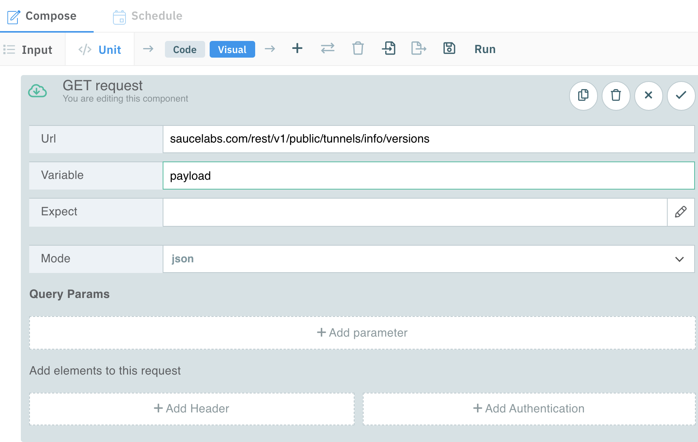
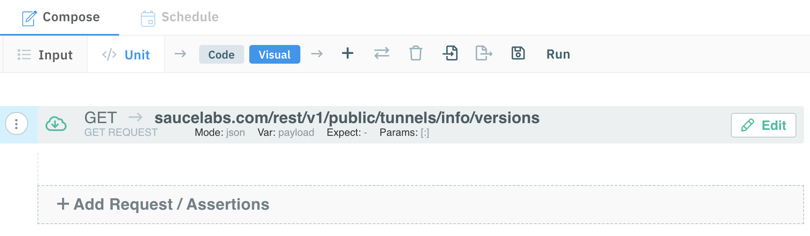

summary: Module 3 of the API Testing course. Now that you have learned the basics of API Testing and the API Fortress Interface, let's dive deeper into the test component library.
id: Module3-APITesting
categories: beginner
tags: zapi
environments: Web
status: One or more of (Draft, Published, Deprecated, Hidden)
feedback link: https://forms.gle/CGu4QchgBxxWnNJK8
analytics account: UA-86110990-1
author: James Tacker
<!-- ------------------------ -->
# Module 3 – Test Component Library

<!------------------------------>

## 3.01 What You'll Learn
Duration: 0:02:00

In this module, you will be learning to create your own test from scratch with test components, using requests (such as GET or POST), assertions that check if data exists, and use variables, input sets, and the Vault to store and reuse elements of your tests.

**Assertions and Request Components**
* Determine the different types of assertions and requests you can use with your API test
* Understand the different types of output when adding assertions to an a API test
* Understand when and why you want to use certain request components in an API test.

**Variables**
* Understand the difference between global variables and input sets
* Demonstrate how to store sensitive variable data and/or secrets in the Vault

<!------------------------------>
## 3.02 Component Library
Duration: 0:03:00

The test component library contains many useful test components that can enrich and add further validity to your API Tests.

### Experiment with Components

To access the component library:

* Open a new blank test
* Select the `+` symbol at the top of the Test Composer

All available test components, as well as a search bar, appears on the next screen.

#### Example

If you select the **Tag** component at the top, it will automatically add this component to the bottom of your test like in this image:

You can add any of the following components to your test, depending on your use case. For an example some examples in the screenshot below:

* **Comment**: When executed, adds a comment to the document, to better describe steps or leaves notes.
* **Flow**: Creates a flow component for your test.
* **K/V Store**: Store and retrieve ephemeral data from a `key:value` store.
* **Fake**: Generates fake data for your test, particularly for `POST` and `PUT` requests.

There are many components you can play around with, and hover over them to see what they do, but next you will focus on **Request**, the building block of every API test.

<!-- ------------------------ -->

## 3.03 Request Component
Duration: 0:04:00

A **Request** component is the foundation for creating a new test in API Fortress. Whether you wish to test a chain of multiple requests, or a single request, the request component is where your test should begin. The available request components are:

* GET
* POST
* PUT
* DELETE
* PATCH

Refer to the [API Testing Basics](https://training.saucelabs.com/codelabs/Module1-APITesting/#3) module for further details about API request methods.

### Note:
Negative
: In the previous module, [_Introduction to API Fortress_](https://training.saucelabs.com/codelabs/Module2-APITesting/index.html#0), we used the **Generate Test** button. This button automagically generates the HTTP request, assertions, and other test elements so that you can focus on the more intricate and tricky parts of your tests. In this module we will build a test from scratch in order to understand the importance of assertions, but refer back to that test for inspiration and ideas on how to design your assertions.

### Exercise: Add a GET Request Component

1. Open your project and create a new test:
   
1. Name it **AssertionTest** (we cover _assertions_ in the next module):
   
1. Select **+Add Request/Assertions** in the Tests page.
   
1. Select the **GET Request** component and add the following data:
   * url: `saucelabs.com/rest/v1/public/tunnels/info/versions`
   * var: `payload`

   

   

1. This is what the finished result should look like:
   

In the next section you will work with  **Assertion** components, learning how they are a vital part of your API tests.

<!-- ------------------------ -->

## 3.04 Assertion Component
Duration: 0:04:00

There's a common phrase in the automated testing space: "If there is **no assertion**, it **isn't a test**."

This sentence demonstrates a common [testing anti-pattern](http://www.everydayunittesting.com/2017/03/unit-testing-anti-pattern-not-asserting.html); even if your code doesn't throw errors or crash, it doesn't mean it's a valid test.

In order to validate an API endpoint works properly, you must _assert_ whether the API's expected output is correct or incorrect.

There are several assertions to choose from and below are a few examples, along with the accompanying documentation:

* **[Assert Exists](https://docs.saucelabs.com/api-testing/assertion-components/assert-exists)**: Checks whether an item exists or not
* **[Assert Contains](https://docs.saucelabs.com/api-testing/assertion-components/assert-contains)**: Checks an item has a specific substring (e.g. test the word _Uber_ for product names like: _UberX_, _UberBlack_, etc.)
* **[Assert Is](https://docs.saucelabs.com/api-testing/assertion-components/assert-is)**: Checks whether the value of an item is correctly defined (e.g. _url_, _boolean_, _integer_, etc.)

### Exercise: Add an Assertion

1. Open the previous test  you created, called **AssertionTest**.
1. Select **+Add Request/Assertions**, and select **Assert Exists** with the following data:
   * Expression: `payload['Sauce Connect']`
   * Mode: `one`
   * Click the check mark to save
     
1. Next, select **+Add Request/Assertions** again. This time select **Assert Is**, and add the following data:
   * Expression: `payload['Sauce Connect'].info_url`
   * Type: `url`
   * Click the check mark to save
     
1. Here's what the final result should look like:
   
1. Click **Save** to save your test, then select **Run**. The test results should show up in the UI:
   

### Recap
* We created a **GET** request in the previous module that returned a JSON object
* We created an **Assertion** to validate the "Sauce Connect" object existed
* We created another **Assertion** to verify that the object field "download_url" was indeed a `url`

In the next section we will cover how to store information as a **Global Variable**, or an **Input Set**.

<!-- ------------------------ -->

## 3.05 Global Variables vs. Input Sets
Duration: 0:04:00

As the complexity and number of tests in your test suite increase, it's a best practice to name and store test details such as common variables or data sets to allow more flexibility. There are generally two ways to store data within API Fortress:

* **Global Variables**
* **Input Set**

### Global Variables

The global variables (referred to as **parameters** in the API Fortress interface), are usually common variables designed to run with an entire test such as authentication API Key, or a domain name. Global variables can be used across different tests in a project.

To add a global variable/parameter select the **Input** tab in the top left, and select **Add Global Param**.

### Input Sets

An input set is an object (usually a group of input variables related to a specific scenario or use case). For example a list of relevant product ids returned from a product API endpoint. Input sets are used within a single test.

To add an input set select the **Input** tab in the top left, and select **Add Param to Default**.

### Create Global Parameters

Navigate and select the **Input** tab on the left side of the interface to begin the exercise.

   

1. Select **Add Global Param** in the _Global Parameters_ section
1. Add the following data to the global parameter:
   * Name: `domain`
   * Value: `saucelabs.com`

   

   The parameter now appears in the **Global Parameters** section
   

Next we need to substitute the `domain` value in the current GET request:
1. To get back to our test code, select **Unit** in the tab at the top
   
1. Select the ellipsis to the left of the **GET** request component, then select **Edit component**
   
1. Substitute `saucelabs.com` with the `${domain}` global parameter:
   
1. Run the test again to ensure the test still passes with the same result.
1. Repeat steps 1-3 above and create `protocol` and `endpoint` global parameters. The values for the respective params should be `https://` and `/versions.json` respectively
1. Below is what the finished result should look like:
   

### Note:
Negative
: Please refer to the documentation for further information on [using variables](https://docs.saucelabs.com/api-testing/quick-start/flexible-variables-for-flexible-environments).

In the next section we will discover how to store some of the information we created in the [Vault](https://docs.saucelabs.com/api-testing/quick-start/the-vault#vault-overview).

<!-- ------------------------ -->
## 3.06 The Vault
Duration: 0:07:00

The Vault is a unique feature of the API Fortress platform that allows you to store information for use across all projects or tests.

### The Vault vs. Inputs

While Input Sets are typically only used within a given test, the vault allows you to store inputs and parameters that can be used across multiple test in your project. This is known as your **Project Vault**

The **Project Vault** allows you to save more than just variables, with the vault you can save, edit, and reuse almost anything including:

* Variables
* Code snippets (think reused authentication flows)
* Any assertions and code elements

#### Note:
Negative
: A quick note on "Vault Scope." There is a key difference between the **Project Vault** vs. the **Company Vault**. In general, whatever you store in the Company Vault can be used across all project tests, but if there exists a similar value in your _Project Vault_, that value wins and overrides the value in the _Company Vault_. [More on this later](#company-vault).

### Exercise: Use the Vault to Store a Snippet

First, what is a **Code Snippet**? A snippet is a fragment of a test, stored in the Vault, that can be reused. For example if you want to re-use an authentication header, or perhaps there's a `POST` body vaule you wish to re-use in multiple requests. For this example, we will store and re-use our assertion test from earlier.

To add the snippet to your project Vault:
1. Open your test.
1. Select all the elements (hold **SHIFT** and click the _first and last elements_ to select a range).
1. Select the **Export to Snippet** icon from the toolbar.
   
1. Fill in the following details for the snippet:
   * Name: `QuickAssertionSnippet`
   * Description: `quick test to store snippet in the vault`
   
1. Select **Save Snippet**.
1. The snippet now appears in the Snippets section of the project vault. To get back to the vault, go to the **Tests Page** and select **Vault** in the toolbar, then the **Code Snippets** radial button:
   

#### Note
Negative
: There are two ways to delete a snippet:
   * **Option 1**: Select the checkbox next to the snippet, then select **Delete Selected** 
   * **Option 2**: Hover over the snippet, then select the trash icon to the right that states **Delete** 

### Using a Snippet
If you wish to re-use this snippet in a different project/test there are two options: **Invoke a Snippet** or **Insert a Snippet**. Invoking a snippet doesn't actually modify your test components, instead it makes an API call to the Vault, which inserts the snippet at test runtime. In contrast, inserting a snippet literally inserts the code into your existing test.

Let's try adding a snippet to an empty test:
1. Create an empty test (call it whatever you want)
1. Select the **Invoke Snippet** icon:
   
1. Hover over the snippet, and select **Open**:
   
1. Select either **Invoke Snippet** or **Insert Snippet**, below are examples screenshots of both:
   

#### Invoked Snippet

#### Inserted Snippet

### Company Vault
Now you just need to make sure variables are aligned. Now we reach the dilemma of having to re-create our variables that we used from earlier: `${domain}`, `${protocol}`, and `${endpoint}`. The better approach is to use the **Company Vault**, which allows us to re-use variables across all projects.

To access the **Company Vault**
1. Go to your Project page
1. Select the **Company Vault**
1. Select the **Variables** radial button
1. Add the following variables from your AssertionTest: `${domain}`, `${protocol}`, `${endpoint}`

The end result should look like the screenshot below:

Now if your run your new empty test (where you invoked or inserted the assertion snippet), all variables will default to the values in the Company Vault.

#### What about Snippets?
If you want to re-use a code snippet across different projects, it's a bit easier than re-creating variables from scratch. You can actually export it from the project vault, into the company vault.

To export a Snippet into the Company Vault:

1. Open your Project
1. Select **The Vault** from the toolbar
1. Select the **Code Snippet** radial button
1. Select the checkbox next to the desired snippet, then select the **Export*** button:
   
1. Choose your file type (`.csv` is recommended here)
   
1. Save the file to your computer
1. Go back to the **Company Vault** page and select **Import**
   
1. Choose your file to add it to the Company Vault
   

This is a screenshot of the end result:

This approach is much easier than recreating the entire test from scratch! Run your test to see the report.

To learn more about The Vault and Environments see below links:
* [Learn the Basics](https://docs.saucelabs.com/api-testing/mark3/quick-start/the-vault)
* [Environments Basics](https://docs.saucelabs.com/api-testing/mark3/quick-start/environments-vault-and-overrides-magic)
* [Using Variables](https://docs.saucelabs.com/api-testing/mark3/quick-start/flexible-variables-for-flexible-environments)

<!-- ------------------------ -->

## 3.07 Module 3 Quiz
Duration: 0:03:00

