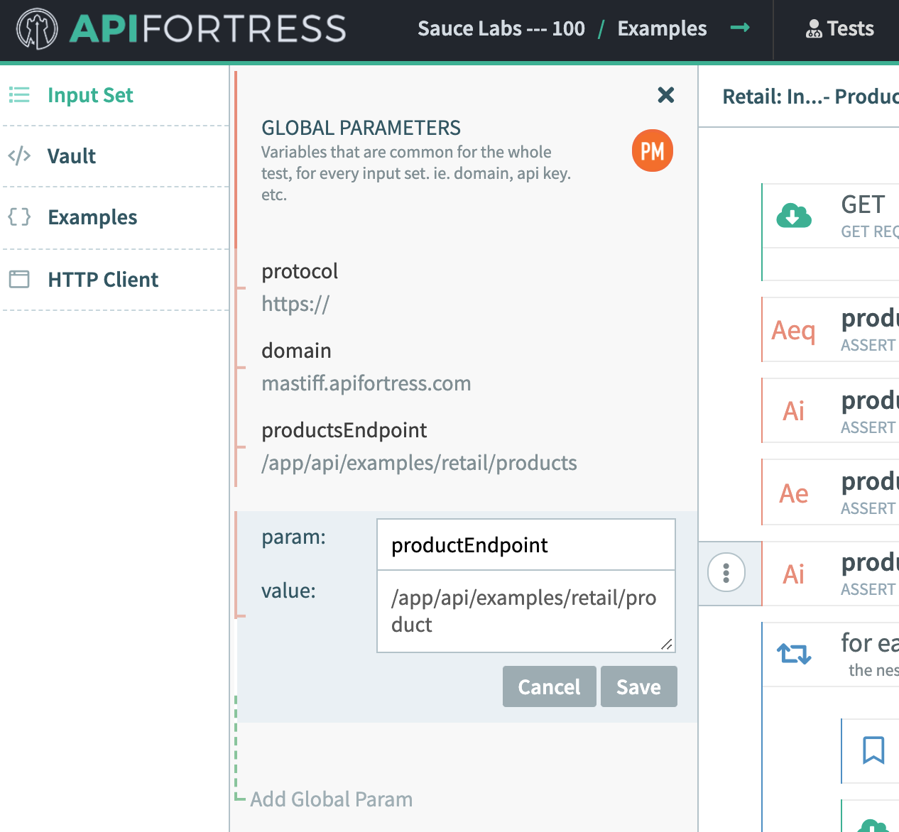

summary: Module 3 of the API Testing course. Now that you have learned the basics and some helpful tips on how to do API testing, check out module 3. In this course you will learn how to create your first test. You will learn the different ways to begin writing a test, as well as some more advanced techniques to help you simulate real life scenarios.
id: Module3-APITesting
categories: beginner
tags: api
environments: Web
status: One or more of (Draft, Published, Deprecated, Hidden)
feedback link: https://forms.gle/CGu4QchgBxxWnNJK8
author:Lindsay Walker
<!-- ------------------------ -->
# Module 3 – Writing Your First API Test

<!-- ------------------------ -->
## 3.01 What is an API?
Duration: 0:02:00

There are two ways to create a test with the API tool, from a payload (the response) when you make an api call, or from a spec file from a tool such as [swagger.io](https://swagger.io/).

### From a Payload

Before you dive into this, watch this quick video on how to login and generate a test in under a minute. Then read the below to get a better understanding of the nuances of the tests themselves.

#### An API response payload.
This is used to auto generate a functional test in API Fortress.


[Generate a Test Video](https://www.youtube.com/watch?v=qujShNWCDvM&feature=emb_logo)

<!--  --> <!-- This YouTube link doesn't work -->

[Generate a Test Guide](https://apifortress.com/doc/create-a-test-quickly/)

### From a Spec File

The above video shows you the method using Generate Test from a payload, and to generate a test from a spec file you can review [this page](https://apifortress.com/doc/build-from-spec/). This includes [Postman Collections](https://apifortress.com/doc/importing-postman-collections/).

```
{
    "swagger": "2.0",
    "info": {
        "title": "demoapif",
        "version": "",
        "description": "Call to the APIF demo API All Products Get."
    },
    "host": "demoapi.apifortress.com",
    "basePath": "/api/retail",
    "schemes": [
        "http"
    ],
    "paths": {
        "/product": {
            "get": {
                "responses": {
                    "200": {
                        "description": "OK",
                        "headers": {},
                        "examples": {
                            "application/json": [
                                {
                                    "id": 1,
                                    "name": "Baseball Cap",
                                    "price": 29.99,
                                    "category": "1",
                                    "description": "This is product 1!",
                                    "quantity": 5,
                                    "imageURL": "http://image.com",
                                    "color": [
                                        "blue",
                                        "yellow"
                                    ],
                                    "createdAt": "2018-03-20T15:38:39.542Z",
                                    "updatedAt": "2018-03-20T15:38:39.542Z"
                                },
                                {
                                    "id": 2,
                                    "name": "Long Sleeve Shirt",
                                    "price": 39.99,
                                    "category": "1",
                                    "description": "This is product 2!",
                                    "quantity": 7,
                                    "imageURL": "http://image.com",
                                    "color": [
                                        "blue",
                                        "yellow",
                                        "red"
                                    ],
                                    "createdAt": "2018-03-20T15:38:39.542Z",
                                    "updatedAt": "2018-03-20T15:38:39.542Z"
                                },
                                {
                                    "id": 3,
                                    "name": "Bluetooth Headphones",
                                    "price": 49.99,
                                    "category": "1",
                                    "description": "This is product 3!",
                                    "quantity": 50,
                                    "imageURL": "http://image.com",
                                    "color": [
                                        "green",
                                        "yellow"
                                    ],
                                    "createdAt": "2018-03-20T15:38:39.542Z",
                                    "updatedAt": "2018-03-20T15:38:39.542Z"
                                }
                            ]
                        }
                    }
                },
                "summary": "List All Products",
                "description": "",
                "tags": [],
                "parameters": [],
                "produces": [
                    "application/json"
                ]
            }
        }
    },
    "definitions": {
        "Questions Collection": {}
    }
}
```

<!-- ------------------------ -->
## 3.02 Building a Strong Functional Test
Duration: 0:04:00

#### Note
This example exists in your **Examples** project, and it is named **Retail: Integration - Products**.


Lets build your first functional test: Start by using this API call.  

**[https://mastiff.apifortress.com/app/api/examples/retail/products](https://mastiff.apifortress.com/app/api/examples/retail/products)**

#### Video
View [this video](https://drive.google.com/file/d/1xxTUnnG6OZzfoygWpOxlTO01PWCZslVC/view?usp=sharing) to see how to run your test:


By clicking that link, or using the HTTP composer in the **HTTP Client** section to make the call, you get this response.


As you can see there are 5 objects, so at minimum lets make sure they ‘exist.’ What API Fortress allows you to do is validate the objects exist _and_ the data is as expected. This is done using our XML markup language, or our GUI composer.

#### Our Platform
API Fortress was specifically built to bridge the gap between testers and engineers, allowing you to write detailed API tests in whatever format you are most comfortable with. Our composer has a drag-and-drop interface that writes the XML code for you, and it also makes it easier to visually understand the nature of the test.


Our GUI composer also has a **Code View** which exposes the underlying XML. This XML can be written or edited in the GUI, or using your own IDE. Meaning that how you want to write and/or edit a test is completely unlocked, so you can work how you are most comfortable.


Why you click on **Code**, or were looking at the test in your own IDE, this is what you see:

```
<unit xmlns:xsi="http://www.w3.org/2001/XMLSchema-instance" name="main" xsi:noNamespaceSchemaLocation="http://apifortress.com/app/unit.xsd">
   <requirements />
   <configs />
   <sequence name="main">
      <get url="${protocol}${domain}${productsEndpoint}" params="[:]" var="productsPayload" mode="json" />
      <assert-equals expression="productsPayload.status" value="200" comment="" />
      <assert-is expression="productsPayload.success" type="boolean" comment="" />
      <assert-exists expression="productsPayload.content.act" comment="" />
      <assert-is expression="productsPayload.content.products" type="array" comment="" />
   </sequence>
</unit>
```

Now look at the code itself carefully:

- The `unit `section is referencing our markup Namespace file (useful when using your own IDE).
- `Requirements` and` Sequence` are more advanced features discussed later.
- `get` is where the API call is made. Within this call it contains the necessary information to make the call (can include more if we’re dealing with oAuth for example).

Some important things to note is how the platform has crated variables for `protocol`, `domain`, and then the chosen endpoint.

If you click on the **Input Set** section on the left you can see those same variables and the data.

This is hugely important to allow the test to be easily run against any environment by replacing the vribles.


There is also `var="productsPayload"`. What this does is call an API, gets a response, and then stores that entire payload into a variable called `productsPayload`. This is then referenced in the next assertions.

#### Note
Negative
: Performance can be an assertion within the test itself. See [this page](https://apifortress.com/doc/assertions-for-metrics-performance/) for more information.

### Assertions
Now, the assertions. [There are over 70 assertions](https://assertible.com/docs/guide/assertions#:~:text=Assertions%20allow%20you%20to%20validate,time%20a%20test%20is%20run.) possible for an API test.  You can see the next four lines are `assert` statements for each object. Looking at the first you will see:  

```
<assert-equals expression="productsPayload.status" value="200" comment="" />
<assert-is expression="productsPayload.success" type="boolean" comment="" />
```

* This line calls the `assert-equals` assertion, which validates an object exists and is equal to a chosen amount.  The `productsPayload.status`  is referencing the `status` object within the `productsPayload` variable.
* The `assert-is expression` [checks that an object is a certain data type](https://apifortress.com/doc/assert-is/).

The GET call gets an API response and stores it in that variable. This is useful for when you are dealing with multiple payloads (variables) in an integration test.  


It’s important to note that with the **Generate Test** feature you can have this entire structure generated for you in seconds. This frees you to focus on the more important and tricky aspects of writing detailed tests.


<!-- ------------------------ -->
## 3.03 Create an Integration Test
Duration: 0:07:00

### Using an API as a Datasource
Now lets take the functional test, and use it as the first step in an integration test. Notice that the first API call actually contains an array of product IDs. What if you use it as a datasource, and then iterate on each of them individually?

First, you have the original test that was created (with assertions) when you clicked **Generate Test** after entering `https://mastiff.apifortress.com/app/api/examples/retail/products`:


Creating an integration test requires the use of two new components. The **[For Each](https://apifortress.com/doc/each-component/)** component helps you iterate through a series of data (product IDs in this case), and the **[Set](https://apifortress.com/doc/set-var/)** which creates a temporary variable to reference.

### Test Creation Basics
You can add components to any step in the test like so:


If you look at the above GUI view of this test, you see that we have our original test. It makes the first API call, and then tests each object in that response.


If you do not have all of the same variables, create them now in the **Input Set** window:



### Loop Through Each Element

After the first set of verifications in the first **GET** request, add in the component that makes this integration test, that is using an API to be data-driven, the **For Each** component.

You’ll notice that it is referencing the variable that we stored the entire response, then the array, and finally the object we want to use. Edit the **for each in** statement so that it says **productsPayload.content.products.pick(2).**


The **.pick(2)** you added at the end is entirely optional, and what it does is randomly select `X `number of items from the list we are iterating through. This is useful if the dataset is  large. Ours is small so we would remove that and allow every product ID to be tested. We will leave it for training purposes.

Next you want to add a **Set** component, creating a new variable called **id**.


The value of that variable depends on the location the **For Each** is at in the iteration. Here we set the value as `${\_1}`. This is saying “using the current location in the array”. Traversing an array is a bit of a larger topic, so we’ll get into that later.


Delete the component that was automatcially created after when you created the loop.


Now you need to move the  **GET** component within the **for each** loop. You’ll notice we are using the `id` that we stored from the first **GET** call at the beginning of the test to populate into the second **GET** call within the loop. Each iteration of the **For Each** will call the current `id` in the **GET** call.


Update each of the elements in your **for each** loop so that it appears like the sample test entitled _Retail: Integration - Products_ in the _Examples_ project. You may have to drag and drop elements into the for loop, or add or delete new components to make it look like the **Final Code** at the bottom of this page.


### Add an If Statement
Once you  have all the assertions added in the second **for each** loop, you need to add one if statement to check that a shipping zone exists if there is something populared in your shopping cart.


Finally, In the **If** statement, add a child component that asserts that the shipping zone does exist:


### Run Your Test
That’s it! Now you can run your test by clicking on the **Run** button in the interface, choosing the data center, and see a final report for your test


#### Final Code


<!-- ------------------------ -->
## 3.04 The Vault, Variables, and Environments
Duration: 0:03:00

### Using The Vault

 The Vault is a unique part of the API Fortress platform that allows you to store variables and code for use across a projects.

It is unique, Nnot in terms of the idea, but in the flexibility offered. It allows you to save, edit, and reuse almost anything, including:
* Variables
* Code snippets (think reused authentication flows)
* Other data


In the Vault, you can store level at two different levels of scope, project and global, and the project vault will allow you to reuse those values across any test within that scope.

 Similarly the global vault will allow use of stored values across any test within any project.


### Using Variables and Environments

If properly setup, any API Fortress test can be run against any environment. You’ll notice that is what we did in our functional test by turning the API URL into three separate parts - _protocol_, _domain_, and _endpoint_. This allows you to set the default location under **Input Sets** (in the left pane), and also override those values with the **Environments** tab:


The Environments panel lets you change anything, not just environments. You can run the test against a certain environment, using a different API key, and datasource. This effectively allows you to have pre-set runtime variable overrides.

### Adding Elements to the vault
Access the Vault and add variables and code snippets by...

To learn more about The Vault and Environments see below links: [Learn the Basics](https://apifortress.com/doc/the-vault/), [Advanced Use Cases](https://apifortress.com/doc/environments-vault-and-overrides-magic/), [Environments Basics](https://apifortress.com/doc/environments-and-presets/), [Environments Advanced](https://apifortress.com/doc/flexible-variables-for-flexible-environments/)
