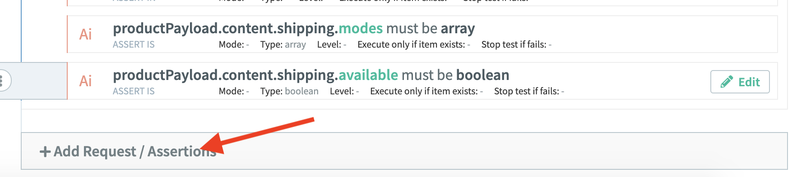
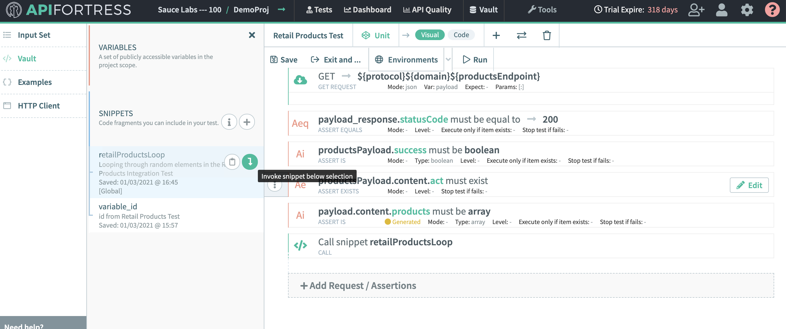

summary: Module 3 of the API Testing course. Now that you have learned the basics and some helpful tips on how to do API testing, check out module 3. In this course you will learn how to create your first test. You will learn the different ways to begin writing a test, as well as some more advanced techniques to help you simulate real life scenarios.
id: Module3-APITesting
categories: beginner
tags: api
environments: Web
status: One or more of (Draft, Published, Deprecated, Hidden)
feedback link: https://forms.gle/CGu4QchgBxxWnNJK8
analytics account: UA-86110990-1
author:Lindsay Walker
<!-- ------------------------ -->
# Module 3 – Writing Your First API Test

<!-- ------------------------ -->
## 3.01 How Can You Create an API Test?
Duration: 0:02:00

<!-- -->

There are two ways to create a test with the API tool, from a payload (the response) when you make an API call, or from a spec file from a tool such as [swagger.io](https://swagger.io/) or Postman. [Follow these steps to quickly create your first test](https://docs.saucelabs.com/api-testing/quick-start)

### From An API Response Payload.
Simply use the HTTP Client from your test editing dashboard to auto generate a functional API test.


[Generate a Test Video](https://www.youtube.com/watch?v=qujShNWCDvM&feature=emb_logo)

<!--  --> <!-- This YouTube link doesn't work -->

### From a Spec File

The above video shows you the method using Generate Test from a payload, and to generate a test from a spec file you can review [this page](https://docs.saucelabs.com/api-testing/quick-start/build-from-spec/index.html#generate-a-single-test-from-a-spec-file). This includes [Postman Collections](https://apifortress.com/doc/importing-postman-collections/).

```
{
    "swagger": "2.0",
    "info": {
        "title": "demoapif",
        "version": "",
        "description": "Call to the APIF demo API All Products Get."
    },
    "host": "demoapi.apifortress.com",
    "basePath": "/api/retail",
    "schemes": [
        "http"
    ],
    "paths": {
        "/product": {
            "get": {
                "responses": {
                    "200": {
                        "description": "OK",
                        "headers": {},
                        "examples": {
                            "application/json": [
                                {
                                    "id": 1,
                                    "name": "Baseball Cap",
                                    "price": 29.99,
                                    "category": "1",
                                    "description": "This is product 1!",
                                    "quantity": 5,
                                    "imageURL": "http://image.com",
                                    "color": [
                                        "blue",
                                        "yellow"
                                    ],
                                    "createdAt": "2018-03-20T15:38:39.542Z",
                                    "updatedAt": "2018-03-20T15:38:39.542Z"
                                },
                                {
                                    "id": 2,
                                    "name": "Long Sleeve Shirt",
                                    "price": 39.99,
                                    "category": "1",
                                    "description": "This is product 2!",
                                    "quantity": 7,
                                    "imageURL": "http://image.com",
                                    "color": [
                                        "blue",
                                        "yellow",
                                        "red"
                                    ],
                                    "createdAt": "2018-03-20T15:38:39.542Z",
                                    "updatedAt": "2018-03-20T15:38:39.542Z"
                                },
                                {
                                    "id": 3,
                                    "name": "Bluetooth Headphones",
                                    "price": 49.99,
                                    "category": "1",
                                    "description": "This is product 3!",
                                    "quantity": 50,
                                    "imageURL": "http://image.com",
                                    "color": [
                                        "green",
                                        "yellow"
                                    ],
                                    "createdAt": "2018-03-20T15:38:39.542Z",
                                    "updatedAt": "2018-03-20T15:38:39.542Z"
                                }
                            ]
                        }
                    }
                },
                "summary": "List All Products",
                "description": "",
                "tags": [],
                "parameters": [],
                "produces": [
                    "application/json"
                ]
            }
        }
    },
    "definitions": {
        "Questions Collection": {}
    }
}
```

<!-- ------------------------ -->
## 3.02 Building Your First Functional API Test
Duration: 0:04:00

#### Video
View [this video](https://youtu.be/BkQit-1N4dI) to see how to create your test:

<video id="BkQit-1N4dI"></video>

### Build the Base Test
Lets build your first functional test: Start by using this API call.  

**[https://mastiff.apifortress.com/app/api/examples/retail/products](https://mastiff.apifortress.com/app/api/examples/retail/products)**


#### Note
Negative
: This example exists in your **Examples** project, and it is named **Retail: Integration - Products**.


### Test Creation Basics

Here are the basic components used for creating an API test:


**A –** All of the available components can be seen by clicking on Add Request / Assertions.

**B –** This button allows you to easily transform an existing component into another component of the same type.

**C – Input Sets** are a group of input variables representing a scenario. The test will be executed once for each input set, overriding the variable values into your test.  Global Parameters are variables that are available to be used throughout a test. Reference these variables simply by calling it within the test using the convention:  “${VARIABLE}”.

**D – HTTP Client -** The API testing http client is very similar to many other http clients out there. You can make GET/POST/PUT/PATCH/DELETE calls and see their responses.   A key difference this HTTP client comes from your ability to generate a test by clicking the **Generate Test** button, and a test will be generated for you based on the API’s behavior and response.

See how to [quickly create a test on the API testing platform.](hhttps://docs.saucelabs.com/api-testing/quick-start)


You can add components to any step in the test like so:


### HTTP Client


By clicking that link, or using the HTTP composer in the **HTTP Client** section to make the call, you get this response.


As you can see there are 5 objects returned here, so for our tests, we will at minimum lets make sure they ‘exist.’ What the API testing platform allows you to do is validate the objects exist _and_ the data is as expected. This is done using our XML markup language, or our GUI composer.

<!-- ------------------------ -->
## 3.03 Using the API Testing Platform
Duration: 0:04:00

#### Our Platform
The API testing platform was specifically built to bridge the gap between testers and engineers, allowing you to write detailed API tests in whatever format you are most comfortable with. Our composer has a drag-and-drop interface that writes the XML code for you, and it also makes it easier to visually understand the nature of the test.


Our GUI composer also has a **Code View** which exposes the underlying XML. This XML can be written or edited in the GUI, or using your own IDE. This means that you can write an edit tests either with the GUI, or in the XML code view, save it, and the changes will take effect.


Why you click on **Code**, or were looking at the test in your own IDE, this is what you see:

```
<unit xmlns:xsi="http://www.w3.org/2001/XMLSchema-instance" name="main" xsi:noNamespaceSchemaLocation="http://apifortress.com/app/unit.xsd">
   <requirements />
   <configs />
   <sequence name="main">
      <get url="${protocol}${domain}${productsEndpoint}" params="[:]" var="productsPayload" mode="json" />
      <assert-equals expression="productsPayload.status" value="200" comment="" />
      <assert-is expression="productsPayload.success" type="boolean" comment="" />
      <assert-exists expression="productsPayload.content.act" comment="" />
      <assert-is expression="productsPayload.content.products" type="array" comment="" />
   </sequence>
</unit>
```

Now look at the code itself carefully:

- The `unit `section is referencing our markup Namespace file (useful when using your own IDE)
- `Sequence` contains all of the test elements that you can edit in the UI
- `config` are additional test settings that aren't usually surfaced in the UI
- `get` is where the API call is made. Within this call it contains the necessary information to make the call (can include more if we’re dealing with oAuth for example)

Some important things to note is how the platform has crated variables for `protocol`, `domain`, and then the chosen endpoint.

If you click on the **Input Set** section on the left you can see those same variables and the data.

This is hugely important to allow the test to be easily run against any environment by replacing the variables.


Each time you generate a test, notice the `Var: payload` in the **Get** component. This is generated when your test is generated. What happens is that when you call an API, and get response, that entire payload is automatically stored in a variable called `payload`.

<<<<<<< HEAD
=======
Each time you generate a test, notice the `Var: payload` in the **Get** component. This is generated when your test is generated. What happens is that when you call an API, and get response, that entire payload is automatically stored in a variable called `payload`.
>>>>>>> master


#### Note
Negative
: You can also access performance metrics such as latency, fetch, and overall response time, and these can be added as assertions within the test itself. See [this page](https://apifortress.com/doc/assertions-for-metrics-performance/) for more information.

### Assertions
Now, the assertions. [There are over 70 assertions](https://assertible.com/docs/guide/assertions#:~:text=Assertions%20allow%20you%20to%20validate,time%20a%20test%20is%20run.) possible for an API test.  You can see the next four lines are `assert` statements for each object. Looking at the first you will see:  

```
<assert-equals expression="productsPayload.status" value="200" comment="" />
<assert-is expression="productsPayload.success" type="boolean" comment="" />
```

* This line calls the `assert-equals` assertion, which validates an object exists and is equal to a chosen amount.  The `productsPayload.status`  is referencing the `status` object within the `productsPayload` variable.
* The `assert-is expression` [checks that an object is a certain data type](https://docs.saucelabs.com/api-testing/assertion-components/assert-is/index.html).

The GET call gets an API response and stores it in that variable. This is useful for when you are dealing with multiple payloads (variables) in an integration test.  


#### Note
Negative
: With the **Generate Test** feature you can have this entire structure generated for you in seconds. This frees you to focus on the more important and tricky aspects of writing detailed tests. 

<!-- ------------------------ -->
## 3.04 Update Your API Integration Test
Duration: 0:07:00


### Using an API as a Datasource
Now lets take the functional test, and use it as the first step in an integration test. Notice that the first API call actually contains an array of product IDs. What if you use it as a datasource, and then iterate on each of them individually?

First, you have the original test that was created (with assertions) when you clicked **Generate Test** after entering `https://mastiff.apifortress.com/app/api/examples/retail/products`:


#### The Payload Variable
Now you just need to make sure the value you are storing your payload in, and the one you are calling with your checks are. Note that in the example tests (which you created your snippet with) doesn't use the default `Var` for playload:


Click to edit the variable to say `productsPayload`, and make sure all your checks use that as well.


Creating an integration test requires the use of two new components. The **[For Each](https://docs.saucelabs.com/api-testing/logical-components/each/index.html)** component helps you iterate through a series of data (product IDs in this case), and the **[Set](https://docs.saucelabs.com/api-testing/learn-more/the-variables-system-in-api-fortress/index.html#set-component)** which creates a temporary variable to reference.


#### Note
Negative
: Save early and often! 


If you look at the above GUI view of this test, you see that we have our original test. It makes the first API call, and then tests each object in that response.


#### Input Variables
If you do not have all of the same parameters, create them now in the **Input Set** window:


Make sure your **GET** statement uses it as well:


### Loop Through Each Element

After the first set of verifications in the first **GET** request, add in the component that makes this integration test, that is using an API to be data-driven, the **For Each** component.

You’ll notice that it is referencing the variable that we stored the entire response, then the array, and finally the object we want to use. Edit the **for each** loop statement so that it says **productsPayload.content.products.pick(2).**


The **.pick(2)** you added at the end is entirely optional, and what it does is randomly select a set (in this case, `2`) number of items from the list we are iterating through. This is useful if the dataset is  large. Ours is small so we would remove that and allow every product ID to be tested. We will leave it for training purposes.

Next you want to add a **Set** component as the first element in the **for each in** loop, creating a new variable called **id**.


The value of that variable depends on the location the **For Each** is at in the iteration. Here we set the value as `${_1}`. This is saying “using the current location in the array”. Traversing an array is a bit of a larger topic, so we’ll get into that later.


Delete any components that were automatically created exist when you created the loop or generated the test that don't match with the final code at the bottom of this page.


Now you need to move (or create) a  **GET** component within the **for each** loop. You’ll notice we are using the `id` that we stored from the first **GET** call at the beginning of the test to populate into the second **GET** call within the loop. Each iteration of the **For Each** will call the current `id` in the **GET** call.


#### Note
Negative
: Notice that the payload variable for this **Get** element is **productPayload**

Update each of the elements in your **for each** loop so that it appears like the sample test entitled _Retail: Integration - Products_ in the _Examples_ project. You may have to drag and drop elements into the for loop, or add or delete new components to make it look like the **Final Code** at the bottom of this page.


### Add an If Statement
Once you  have all the assertions added in the second **for each** loop, you need to add one if statement to check that a shipping zone exists if there is something populared in your shopping cart.




Finally, In the **If** statement, add a child component that asserts that the shipping zone does exist:


### Run Your Test
That’s it! Now you can run your test by clicking on the **Run** button in the interface, choosing the data center, and see a final report for your test


#### Final Code


<!-- ------------------------ -->
## 3.05 The Vault, Variables, and Environments
Duration: 0:03:00

### Using The Vault

 The Vault is a unique part of the API testing platform that allows you to store variables and code for use across a projects.

It is unique, not in terms of the idea, but in the flexibility offered. It allows you to save, edit, and reuse almost anything, including:

* Variables
* Code snippets (think reused authentication flows)
* Any assertions and code elements


In the Vault, you can store level at two different levels of scope, project and global, and the project vault will allow you to reuse those values across any test within that scope.

 Similarly the global vault will allow use of stored values across any test within any project. You want to make sure that if you are using code snippets, variables are consistent across each test.


### Using Variables and Environments

If properly setup, any API test can be run against any environment. You’ll notice that is what we did in our functional test by turning the API URL into three separate parts - _protocol_, _domain_, and _endpoint_. This allows you to set the default location under **Input Sets** (in the left pane), and also override those values with the **Environments** tab:


The Environments panel lets you change anything, not just environments. You can run the test against a certain environment, using a different API key, and datasource. This effectively allows you to have pre-set runtime variable overrides.

### Adding Snippet to the Vault
To add a snippet to your account, simply select the elements (hold **SHIFT** and click first and last elements to select a range), open the Vault in the side menu, and slick the `+` icon.


In this example, you're going to use the code from the Example project called _Retail : Integration - Products_ test, and re-use it in your own test. Select the **for each** loop that selects 2 random elements, and name it **retailProductsLoop**, placing it in the global scope:


You should see the snippet show up in the panel.

### Using a Snippet
Now lets re-use this handy snippet in a different project. Leave the _Examples_ project and open up one you created. Keep the first five commands as is, but delete the **for each** loop.

Once you have deleted it, open up the **Vault** menu on the side, choose the bottom element in your test, and click the arrow to invoke the snippet in your code:



Now you just need to make sure variables are aligned. Note that in the example tests (which you created your snippet with) doesn't use the defaul `Var` for playload:


You will need to edit the `Var=` in the **Get** method at the top of your own test to match.

 

 Last, update the `payload` to `productsPayload` in each command before the snippet call:


Still much easier than recreating the entire for loop! Run your test to see the report.

### Adding and Editing Variables
<<<<<<< HEAD

Access the Vault and add variables and code snippets by first clicking on the **Vault** in the main menu.

=======
Access the Vault and add variables and code snippets by first clicking on the **Vault** in the main menu.
>>>>>>> master


From here you can access and edit code for snippets and variables for both global project-specific snippets and variables.


To learn more about The Vault and Environments see below links: [Learn the Basics](https://docs.saucelabs.com/api-testing/quick-start/the-vault/index.html), [Environments Basics](https://apifortress.com/doc/environments-vault-and-overrides-magic/), [Using Variables](https://docs.saucelabs.com/api-testing/quick-start/flexible-variables-for-flexible-environments)

<!-- ------------------------ -->
## 3.06 API Test Publishing and Reporting
Duration: 0:03:00

### Test Reports

The test report will give you accessible, saveable information about a specific test run. The report lists the data center the test was run on, the date and time, as well as the results of each assertion within a test.


First, navigate to your project dashboard:


Once you click into your dashboard, you can choose the **Logs** to see a historical list of reports for tests run in the project.


Here you can see the report, as well as generate a shareable URL.

### Publishing and Scheduling

The API testing plaform allows you to create **Published** copies of your tests so you can use a stable, existing version of a tests, (for example, in a scheduled test) and continue making updates to a working copy as well.

First, **Exit & Save** your test:


On the next dashboard, you can click the **Publish** button, then you can click on the **Schedule** button once you have published a version of you test.


Now you can set up and save a this version of your test to run as often as you would like. [Learn more about scheduling tests](https://docs.saucelabs.com/api-testing/quick-start/schedule-a-test)


### Test Runs
Tests run in 'manual' mode, or from the test edit screen, do not have the data stored in the project dashboard, or included for monitoring and reporting. In order to run tests that generate data, schedule your tests or run them from the Tests dashboard.


<!-- ------------------------ -->
## 3.07 Module 3 Quiz
Duration: 0:03:00


<!--
1. Which of the following are options for how you can generate an API test with Sauce Labs and API Fortress?
a. By creating your own JSON file, and from an API Response Payload
b. By creating your own JSON file and from a Spec file from another tool such as Swagger or Postman
c. From and API Response Payload and from a Spec file from another tool such as Swagger or Postman*

*In Module 3 we demonstrated generating a file from an API Response Payload, and you can also use a Spec file from tools like Swagger and Postman

2. Which of the following is a good reason for creating a published version of your test?
a. So you can share it with others, without allowing them to edit the code.
b. So you can schedule a stable version of the test, and still make changes to the working copy *
c. To make your test publicly viewable
d. So you can make several different copies of the same test to use in different environments (staging, production, etc)

*A good reason to publish tests is to create a stable version that you can schedule, and still make updates and changes that you can test on the working version. Best practices for writing tests for different environments is to use variables and parameters to set up your test

3. What types of information does the Vault allow you to store, and for what purpose?
a. You can share and store code snippets and variables, for re-use in tests across projects, and even globally
b. You can share and store code snippets and parameters, for re-use in tests across projects
c. You can share and store parameters and variables, for re-use in different tests across projects, and even globally
d. You can share and store variables and variables, for re-use in different tests globally

 * The Vault allows storage of code snippets and variables, and allows you to share those elements between tests both in the same project, and globally across all projects.
-->
