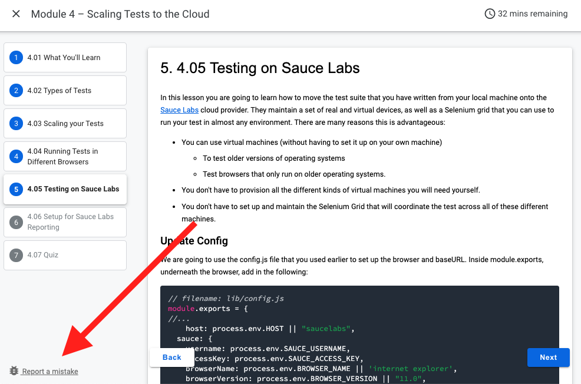

<!-- Copy this file into tools/site/coursenameFolder & start editing -->

summary: Sauce Labs Early Access
id: Module3-EE-_Issues
categories: ee-info
tags: ee  
environments: Web
status: Published
feedback link: https://forms.gle/CGu4QchgBxxWnNJK8
author:Lindsay Walker
<!-- ------------------------ -->
#  Early Access Issues

<!-- ------------------------ -->
## Early Access Issues
Duration: 0:01:00

Because this is an early access program, users should expect to encounter issues with the content or user experience.

### Reporting Issues

To report defects, use The **Report a Mistake** link at the bottom of the lessons screen.
Sauce Labs personnel will respond to issues from Sauce Labs customers as follows:

* High priority issues within 2 business days.
* Medium priority issues within 5 business days
* Low priority issues will be added to our development backlog

**!Important**– Because training is not mission-critical work, resolution of any issue will be based on availability of support resources.

Users might also experience challenges specific to their local environments. Sauce Labs ability to assist with these is limited. However, we encourage you to report these through The **Report a Mistake** link so that we can work to circumvent them  for future users

