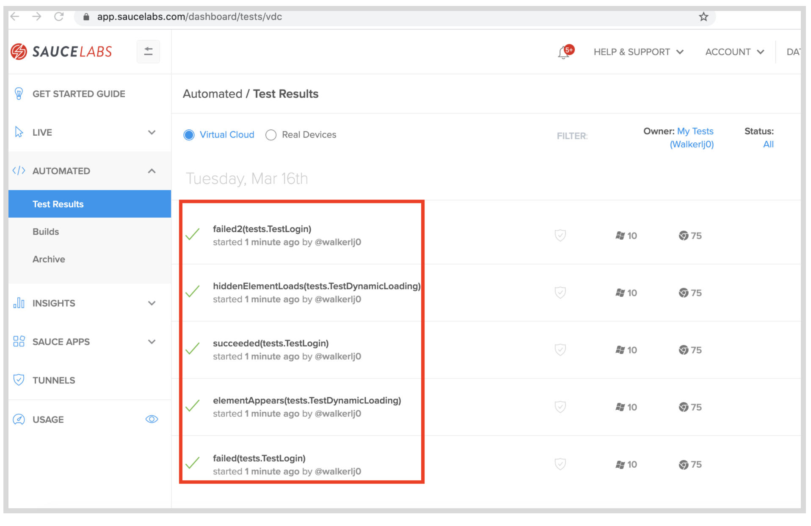

<!-- Copy this file into tools/site/coursenameFolder & start editing -->

summary: Module 3 of the Sauce Labs Quickstart course, shows users how to quickly take an automated test written in Java with the JUnit testing library, and update a few settings to run your automated tests on the Sauce Labs platform. Users will add a few things to their tests, including the URL for the Sauce Labs endpoint, a username and access key, and update capabilities
id: Module3-Quickstart
categories: intermediate
tags: quickstart
environments: Web
status: Draft
feedback link: https://forms.gle/CGu4QchgBxxWnNJK8
author:Lindsay Walker
<!-- ------------------------ -->
# Module 3 - Sauce Labs Web Applications Tests

<!-- ------------------------ -->
## 3.01 What You'll Learn
Duration: 0:02:00


There are many possibilities for testing on [Sauce Labs](http://app.saucelabs.com/?utm_source=referral&utm_medium=LMS&utm_campaign=link), and in this module we will cover the specific case of testing a desktop browser web applications using the Sauce Labs Cloud (the virtual machines on Sauce Labs)

**Users who have their local test environment and code set up can [start on module 3.03](https://training.saucelabs.com/codelabs/Module3-Quickstart/index.html?index=..%2F..quickstart#2)**

The examples here use Java code using Selenium version 3.14.15, the Maven build tool, as well as the JUnit4 test runner. The examples are on a MacOS machine, however we do provide examples of environment setup on a Windows machine.


### Skills & Knowledge

In this Module you will learn:

*   The automated


<!-- ------------------------ -->
## 3.02 Setup & Run Your Test Suite Locally
Duration: 0:05:00


### Test Code
If you have your own testing suite written in Java, using the JUnit 4 test runner, with capabilities set up similar to [the base test here](https://github.com/walkerlj0/Selenium_Course_Example_Code/blob/master/java/Mod4/4.05/src/test/java/tests/BaseTest.java)  or you understand the differences between the test runner you are using and how to structure capabilities, you jump to the next section. Otherwise, clone or fork the example code:


#### Use GitHub Repository (Optional)

If you are familiar with using GitHub to write your code, you can also fork/ branch this repository here and run the code in 4.04 as a boilerplate:

**[Example Project Folder](https://github.com/walkerlj0/Selenium_Course_Example_Code/tree/master/java/Mod4/4.04)**

### Required Dependencies
To run a local test as shown, you will need to set up and install the following:

*   A Java SDK ([Version 8 used in this example](https://www.oracle.com/java/technologies/javase/javase-jdk8-downloads.html))
*   An IDE ([IDEA Community Edition](https://www.jetbrains.com/idea/download/))
*  Apache [Maven build tool](https://maven.apache.org/)

If you would like step-by-step instructions to help installing the dependencies above you can use the instructions here:

#### Windows
Follow [these instructions](https://docs.google.com/document/d/1herzHbTJdQpa-hAIR5llTfbbw20PeM99-BAoVTeuC8U/edit?usp=sharing) to install and set up a JDK, Maven, and IntelliJ on Windows 10.

#### MacOS
 [See the lesson in the Selenium Java course](https://training.saucelabs.com/codelabs/Module1-SeleniumJava/index.html?index=..%2F..SeleniumJava#4) to see how to set up your local environment on MacOS


### Capabilities

Capabilities are sets of settings that you can pass along to the environment your test is being run, using the JSON wire protocol. W3C has a set of capabilities you can use, and you can create your own sets of capabilities using [Mutable Capabilities](https://www.selenium.dev/selenium/docs/api/java/org/openqa/selenium/MutableCapabilities.html) to create your own capabilities as well.

Other vendors, such as [Chrome](https://chromedriver.chromium.org/capabilities), [Firefox](https://developer.mozilla.org/en-US/docs/Web/WebDriver/Capabilities/firefoxOptions), and Sauce Labs have created other pre-defined subsets of capabilities that you can set, which are useful when you need to set specific capabilities such as extensions for Chrome, or the Sauce username.


### Why Sauce Labs?
In this module you are going to learn how to move the test suite that you have on your local machine onto the [Sauce Labs](https://accounts.saucelabs.com/am/XUI/#login/?utm_source=referral&utm_medium=LMS&utm_campaign=link) cloud platform.

Sauce Labs maintains a set of real and virtual devices, as well as a Selenium grid that you can use to run your test in almost any environment. There are many reasons this is advantageous:

* You don't have to worry about about downloading and matching browser drivers  
* You can use virtual machines (without having to set it up on your own machine)
    *   To test older versions of operating systems
    *   Test browsers that run on different operating systems that your own.
* You don’t have to provision all the different kinds of virtual machines you will need yourself
*   You don’t have to set up and maintain the Selenium Grid that will coordinate the test across all of these different machines

When you run tests on Sauce Labs, you are using the _Selenium Grid_ to test on multiple operating systems and the _RemoteWebdriver_.  The Sauce Labs Selenium Grid lets you distribute test execution across several machines and you connect to it with [Selenium RemoteWebDriver](https://www.selenium.dev/documentation/en/remote_webdriver/remote_webdriver_client/).

You tell the Grid which browser and OS you want your test to run on through the use of Selenium's class object, [MutableCapabilities](https://www.selenium.dev/selenium/docs/api/java/org/openqa/selenium/MutableCapabilities.html), and its various subclasses for specific browser options (ChromeOptions, FirefoxOptions, etc.) Sauce Labs has [specific language bindings](https://github.com/saucelabs/sauce_bindings) that act as wrappers for supported programming languages.


### Run the Test Code Locally

If you are cloning a project, follow these steps (after you have uploaded `pom.xml`) if your test isn't running with Maven when you use the command:

```
mvn clean test
```

* Right-click on the project name and choose **Add Framework Support**. 
* Choose **Maven** as a build tool.
* Go to **File > Project Structure**. Select a JDK that you have installed on your machine.
* Choose **File > Invalidate Caches and Restart** so the changes can take effect. 

### Update pom.xml
Add your configurations into `pom.xml` [like the project here](https://github.com/walkerlj0/Selenium_Course_Example_Code/blob/master/java/Mod4/4.05/pom.xml). You may need to invalidate caches and restart IntelliJ IDE again to activate the imports specified in `pom.xml`

### Update Drivers
This sample of test code is not using [WebDriver Manager](https://github.com/bonigarcia/webdrivermanager) or other similar tool (though it is recommended), and if you want to test out running this locally, make sure that you have downloaded the drivers compatible with the versions of the browsers on you machine, and update the test code to reference those drivers:


<!-- ------------------------ -->
## 3.03 Update Variables for Capabilities
Duration: 0:05:00

Once you understand how the test suite functions, you need to update settings such as the capabilities, endpoint to run against the Sauce Labs Cloud, and your Sauce username and access key. If you are using the examples test code, get familiar with the test function and structure:

#### Video
**[Web App Test Code Overview]()**


In the `Config.java` file, you are going to communicate the settings for our test environment with the W3C [Capabilities](https://wiki.saucelabs.com/display/DOCS/Desired+Capabilities+Required+for+Selenium+and+Appium+Tests/?utm_source=referral&utm_medium=LMS&utm_campaign=link), required for every Selenium test.

In addition, you need to define some variables for your tests to be able to communicate with Sauce Labs:


```
// filename: tests/Config.java
package tests;

public class Config {
    public static final String baseUrl = System.getProperty("baseUrl", "http://the-internet.herokuapp.com");
    public static final String host = System.getProperty("host", "saucelabs");
    public static final String browserName = System.getProperty("browserName", "chrome");
    public static final String browserVersion = System.getProperty("browserVersion", "75.0");
    public static final String platformName = System.getProperty("platformName", "Windows 10");
    public static final String sauceUser = System.getenv("SAUCE_USERNAME");
    public static final String sauceKey = System.getenv("SAUCE_ACCESS_KEY");
}
```


Notice the new variables you have added:


*   `host `enables you to specify whether our tests run locally or on Sauce Labs. Right now, the host is either` "saucelabs`” or `"localhost"`
*   The [Sauce Labs Test Configuration Options](https://wiki.saucelabs.com/display/DOCS/Test+Configuration+Options) contains information for each specific test. You assume you may pass in unique usernames and access keys
    *   `browserName` specifies the browser for a test.
    *   `browserVersion` specifies which version of the browser for a test
    *   `platformName` specifies the operating system for a test.
    *   `username` is the username you have created for Sauce Labs
    *   `accessKey` is generated (and can be regenerated) in your user settings in Sauce Labs


### Final Code
Notice how many of the variables for capabilities are grey in this example, since they aren’t yet used in the test code:

See the example to compare your code in `config.java`


### Setting up your Sauce Labs Account

You'll need an account to use Sauce Labs. Their [free trial](https://accounts.saucelabs.com/am/XUI/#login/?utm_source=referral&utm_medium=LMS&utm_campaign=link) offers enough to get you started. And if you're signing up because you want to test an open source project, then be sure to check out their [Open Sauce account](https://saucelabs.com/open-source).

Visit [http://app.saucelabs.com/](https://accounts.saucelabs.com/am/XUI/#login/?utm_source=referral&utm_medium=LMS&utm_campaign=link). You can create a free trial account if you haven’t been assigned one.


Go to **Account> User Settings** to find your username and access key.


You will need to set up your username and access key on your machine’s (or CI Tools') environment variables to use them in your test.

To learn more about setting up environment variables, you can see the article [here](https://wiki.saucelabs.com/display/DOCS/Best+Practice%3A+Use+Environment+Variables+for+Authentication+Credentials#BestPractice:UseEnvironmentVariablesforAuthenticationCredentials-SettingUpEnvironmentVariablesonMacOSX/LinuxSystems/?utm_source=referral&utm_medium=LMS&utm_campaign=link).


#### Video

Watch This Video to See how to set up your Sauce Credentials as environment variables on MacOS in the [Sauce Credentials](https://www.youtube.com/watch?v=3K1Eu0eTha8&t=12s).

<video id="3K1Eu0eTha8"></video>


<!-- ------------------------ -->
## 3.04 Add Capabilities in Your Test
Duration: 0:05:00

Now you need to update `BaseTest.java `to work with these new values and connect to Sauce Labs. Note that these are called [Capabilities](https://wiki.saucelabs.com/display/DOCS/Test+Configuration+Options), and the format they are in here is compatible with Selenium WebDriver 4.0, as well as all previous Selenium versions. They set the options for setting up the environment for your tests.


```
// filename: tests/BaseTest.java
// ...
  @Override
        protected void before() throws Exception {
            if (host.equals("saucelabs")) {
                MutableCapabilities sauceOptions = new MutableCapabilities();
                sauceOptions.setCapability("username", sauceUser);
                sauceOptions.setCapability("accessKey", sauceKey);
                MutableCapabilities capabilities = new MutableCapabilities();
                capabilities.setCapability("browserName", browserName);
                capabilities.setCapability("browserVersion", browserVersion);
                capabilities.setCapability("platformName", platformName);
                capabilities.setCapability("sauce:options", sauceOptions);
                String sauceUrl = String.format("https://ondemand.saucelabs.com/wd/hub");
                driver = new RemoteWebDriver(new URL(sauceUrl), capabilities);
            } else if (host.equals("localhost")) {
                if (browserName.equals("firefox")) {
                    System.setProperty("webdriver.gecko.driver",
                            System.getProperty("webdriver.gecko.driver", "src/test/java/drivers/geckodriver"));
                    driver = new FirefoxDriver();
                } else if (browserName.equals("chrome")) {
                    System.setProperty("webdriver.chrome.driver", "src/test/java/drivers/chromedriver");
                    ChromeOptions browserOptions = new ChromeOptions();
                    driver = new ChromeDriver();
                }
            }
        }


```


This has two if/ else statements:


*   The first one checks to see if you have set your test to run on the `"localhost"` or `"saucelabs".`
*   The second, nested in the `localhost` condition, sets your test up to use the Geckodriver or Chromedriver saved in your project folder, depending on which browser you have set your test to use.

Now you can import the `MutableCapabilities `and` RemoteWebDriver` Selenium classes, as well as the` URL` java class. Add these imports in `BaseTest.java`:


```
// filename: tests/BaseTest.java
// ...
import org.openqa.selenium.MutableCapabilities;
import org.openqa.selenium.remote.RemoteWebDriver;
import java.net.URL;
// ...
```


### Run Your Tests

Now you can use terminal commands to run your tests on Sauce Labs while specifying the `browserName`,` browserVersion`, and `platformName`. As an example, if you run this command the test will be run in Sauce Labs in on MacOS 10.10 in the Chrome 75 browser:


```
mvn clean test -Dhost=saucelabs -DbrowserName=chrome -DbrowserVersion=75 -Dplatform="OS X 10.10"
```


You should also visit [http://app.saucelabs.com/](http://app.saucelabs.com/). Go to the left hand menu and choose **Automated → Test Results**. There you will see your tests with icons indicating they were run on the operating system & browser that you chose:


#### NOTE

Negative
: What did you do? At this point to create an instance of a test, you are dependent on several different objects in your test suite. First, `Base` sets up methods used by your page objects and instantiates a Selenium Webdriver instance. The page objects like `Login` and `Dynamic Loading` use the Base class (and the methods) to interact with the pages.

Negative
: Once the interactions with the webpage are taken care of, the tests come into play.` BaseTest` imports the settings from `Config`, then the tests use the `Base` class and define the specific tests run on the page. 


#### Final Code

The complete code can be found [here](https://github.com/walkerlj0/Selenium_Course_Example_Code/tree/master/java/Mod4/4.05). Your final code will look like this:


<!-- ------------------------ -->
## 3.05 Add a Test Name for Sauce Labs Reporting
Duration: 0:06:00

In this lesson you will add in some elements for better reporting to understand the status of test run on the[ Sauce Labs automated web testing platform](https://accounts.saucelabs.com/am/XUI/#login/?utm_source=referral&utm_medium=LMS&utm_campaign=link).

Now that your tests are up and running on the Sauce Labs platform, you’ll notice it’s hard to tell one apart from the other. The tests you should have run will show up as **Unnamed job** with a hash identifier- not easy to use for testing and debugging.


To fix this issue, you can pull in the name and the status from the test and send it to the [Sauce Labs dashboard ](https://accounts.saucelabs.com/am/XUI/#login/?utm_source=referral&utm_medium=LMS&utm_campaign=link)so you can use our tests to effectively debug and improve our application.

In addition, right now regardless of the outcome of a test, the job in Sauce Labs will register as **Finished** or **Error**. Ideally you want to know if the job was a **Pass** or a **Fail**. That way we can tell at a glance if a test failed or not. With a couple of tweaks we can make this happen easily enough.


### Use TestWatcher to Add a Test Name

It's great that our tests are running on Sauce Labs. But we're not done yet because the test name in each Sauce job is getting set to an unnamed job. This makes it extremely challenging to know which tests were run in each job. This code will allow you to pass the test name to Sauce Labs.

In` BaseTest` you will use another [JUnit rule](https://github.com/junit-team/junit4/wiki/Rules#testwatchmantestwatcher-rules) called `TestWatcher().` First you will need to create a string variable in the` BaseTest `class underneath where you instantiate the driver.


```
// filename: lib/DriverFactory.java
// ...
private String testName;
// ...
```


Next, use the  `TestWatcher()`after the second` @Override `annotation, right before the final closing curly braces. It has a method called `starting` that gives us access to the description of each test as its starting. So yougrab the display name for the test and store it in the `testName `string variable.


```
// filename: lib/DriverFactory.java
// ...
    @Rule
    public TestRule watcher = new TestWatcher() {
        @Override
        protected void starting(Description description) {
            testName = description.getDisplayName();
        }
    };
}
```


At the top of `BaseTest`, make sure you import `TestRule` and `TestWatcher` and the `Description` in the list of imports at the top:


```
// filename: tests/BaseTest.java
// ...
import org.junit.rules.TestRule;
import org.junit.rules.TestWatcher;
import org.junit.runner.Description;

// ...

```

### Add a Sauce Capability for Test Name

Now you can add it to [Sauce Options](https://opensource.saucelabs.com/sauce_bindings/docs/basic-options) in between` platformName `after the `accessKey` and before the list of `Mutable Capabilities`:


```
// filename: tests/BaseTest.java
// ...
sauceOptions.setCapability("name", testName);
// ...

```


Run `mvn clean test -Dhost=saucelabs` in your project in terminal to see if it works. Now when you run our tests in Sauce Labs, the [account dashboard](https://accounts.saucelabs.com/am/XUI/#login/?utm_source=referral&utm_medium=LMS&utm_campaign=link) will show the tests running with the name of the test, test class, and package appearing on the dashboard:



#### Final Code
See an example of the [test with a name added.](https://github.com/walkerlj0/Selenium_Course_Example_Code/blob/master/java/Mod4/4.06/src/test/java/tests/BaseTest.java)

<!-- ------------------------ -->
## 3.06 Add a Test Status for Sauce Labs Reporting
Duration: 0:05:00

After adding a test name, you will add in an `id` and `status` for each unique test that you create. First, you will need to update our tests. If you noticed before, the only status was **Complete** or had an **Error**. You will now add in whether a test has passed or failed.


A  _failure_ is different from an _error_. An error means that you test code is erroneous, and you, as the test writer, need to make a change. You should see this error in your terminal output, and if the code is correct to communicate with Sauce Labs, it should be on your dashboard as well. A failure means a test successfully ran, but the conditions it was checking for were not present – in other words, the code for the app isn’t as expected or needs fixing.

### Use the Sauce REST API

You’ll first need install the `saucerest` library by adding it to our `pom.xml `file within the `<dependencies>` tags.


```
// filename: pom.xml
// ...
        <dependency>
            <groupId>com.saucelabs</groupId>
            <artifactId>saucerest</artifactId>
            <version>1.0.40</version>
            <scope>test</scope>
        </dependency>

// ...

```


### NOTE

Negative
: If you add a dependency and the text appears in red (Maven isn’t recognizing it) you can right click on the pom.xml file in the project directory in IntelliJ then choose **Maven > Reload project**: 


In the variable list of the` BaseTest` class (below `private string testName;`) add in the following:


```
// filename: tests/BaseTest.java
// ...
    private String sessionId;
    private SauceREST sauceClient;
// ...
```


Under the saucelabs` driver` instantiation in the` before()` rule instantiate a` sessionId` and `sauceClient` for when you are running tests on Sauce Labs:


```
// filename: tests/BaseTest.java
// ...
        sessionId = ((RemoteWebDriver) driver).getSessionId().toString();
        sauceClient = new SauceREST(sauceUser, sauceKey, DataCenter.US);

// ...
```


The `sessionId` is retrieved from the `RemoteWebDriver`. The `sauceClient` creates an instance using the Sauce Labs REST API, passing in the username, access key, and data center location. You can change the data center on the Sauce Labs dashboard. Once that is changed, if you would like, go into your code and [change](https://wiki.saucelabs.com/display/DOCS/Data+Center+Endpoints) the `DataCenter` option in your code to reflect this.


Now you can` import` the `sauceRest` package in the` imports` list of `BaseTest.java`:


```
// filename: tests/BaseTest.java
// ...
import com.saucelabs.saucerest.SauceREST;
// ...
```


Now, go down to the` TestWatcher` rule. Under the first` @Override` annotation, add in two more:


```
// filename: tests/BaseTest.java
// ...
@Override
        protected void failed(Throwable throwable, Description description) {
            if (host.equals("saucelabs")) {
                sauceClient.jobFailed(sessionId);
                System.out.println(String.format("https://saucelabs.com/tests/%s", sessionId));
            }
        }

        @Override
        protected void succeeded(Description description) {
            if (host.equals("saucelabs")) {
                sauceClient.jobPassed(sessionId);
            }
        }
// ...
```


Once a Sauce job is established we're able to get the session ID from `RemoteWebDriver` and store it's string value in` sessionId`. youthen create an instance of `SauceREST` (which connects to the Sauce API) and store the session in `sauceClient`.

With a conditional check in each you make sure the sauceClient commands only trigger when a Sauce session has been established.

When a test is successful the `succeeded()` method will fire, marking the Sauce job for the test as `passed`. When a test fails the failed method will trigger, and the job will be marked as `failed`. When there's a failure, we'll want to know the URL to view the job on [Sauce Labs](https://accounts.saucelabs.com/am/XUI/#login/?utm_source=referral&utm_medium=LMS&utm_campaign=link) so you concatenate the URL and output it to the console using the `System.out.println` command.

Now when you run `mvn clean test -Dhost=saucelabs` in terminal, then check your [Sauce Labs dashboard](https://accounts.saucelabs.com/am/XUI/#login/?utm_source=referral&utm_medium=LMS&utm_campaign=link). On the right you should be able to see a status of passed with each test.


See an example of the [completed code to compare.](https://github.com/walkerlj0/Selenium_Course_Example_Code/tree/master/java/Mod4/4.06)

#### Final Code


<!-- ------------------------ -->
## 3.07 Module 3 Quiz
Duration: 0:02:00

