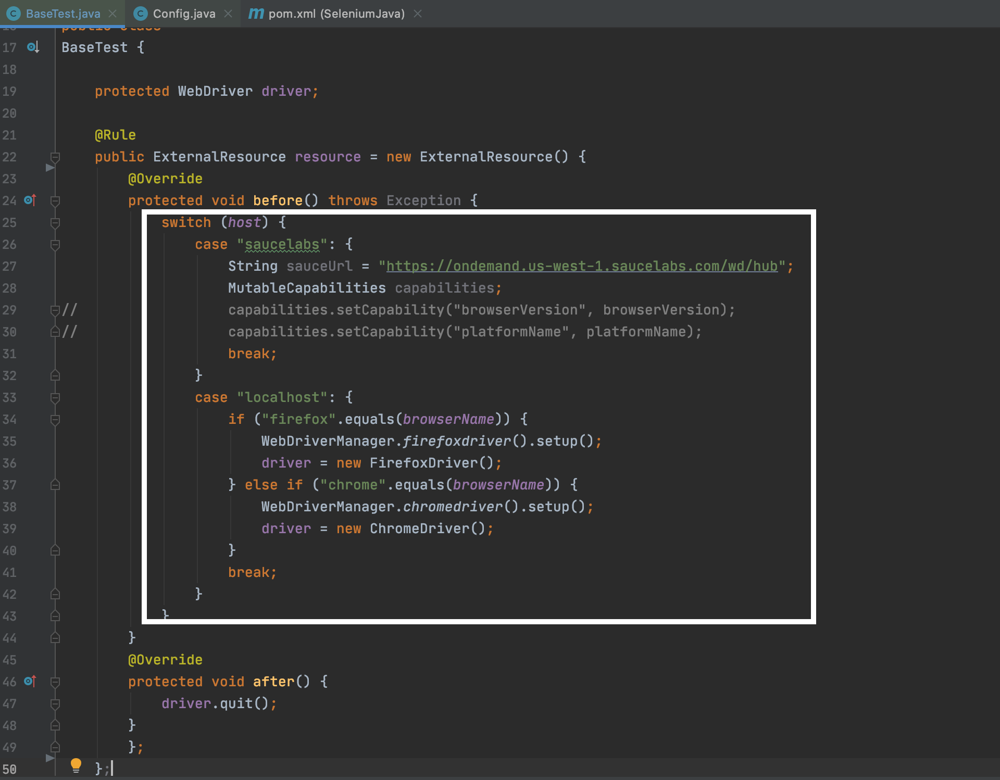
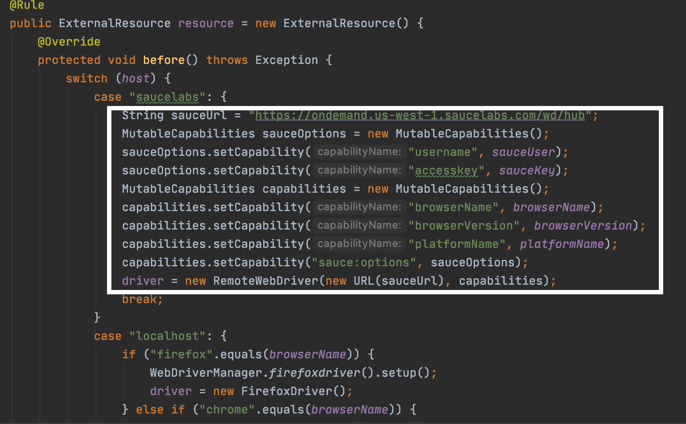
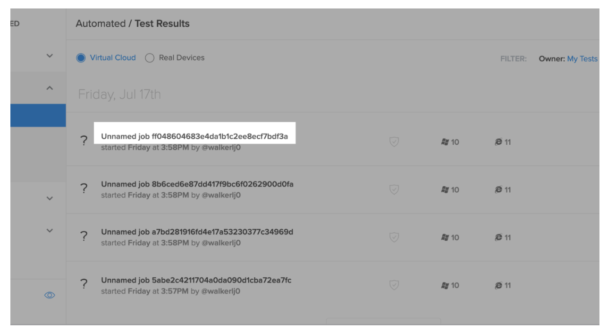
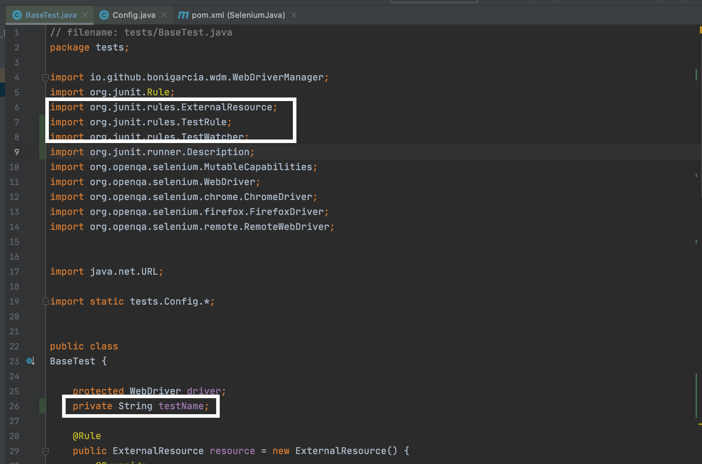
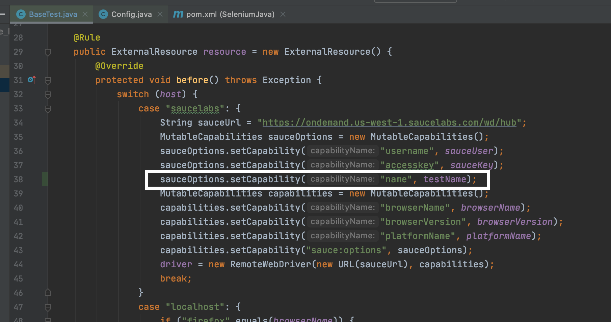
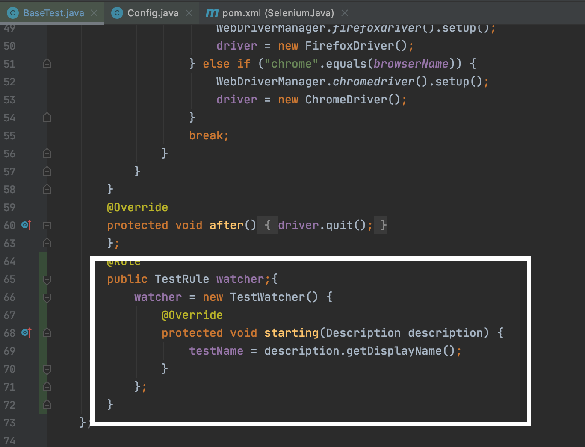
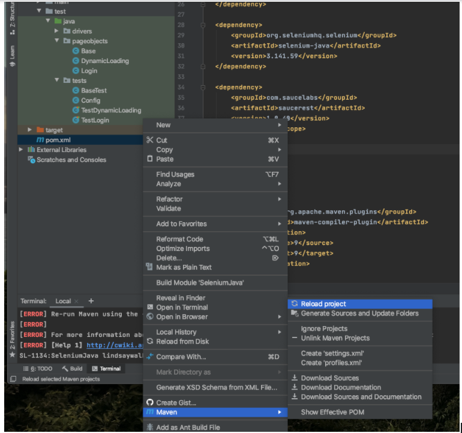
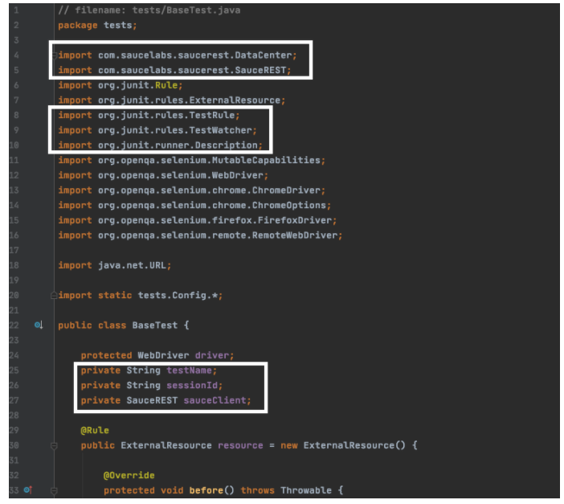

<!-- Copy this file into tools/site/coursenameFolder & start editing -->

summary: Module 3 of the Sauce Labs Quickstart course, shows users how to quickly take an automated test written in Java with the JUnit testing library, and update a few settings to run your automated tests on the Sauce Labs platform. Users will add a few things to their tests, including the URL for the Sauce Labs endpoint, a username and access key, and update capabilities
id: Module3-Quickstart
categories: advanced
tags: quickstart
environments: Web
status: Draft
feedback link: https://forms.gle/CGu4QchgBxxWnNJK8
author:Lindsay Walker
<!-- ------------------------ -->
# Module 3 - Sauce Labs Web Applications Tests

<!-- ------------------------ -->
## 3.01 What You'll Learn
Duration: 0:02:00


There are many possibilities for testing on [Sauce Labs](http://app.saucelabs.com/?utm_source=referral&utm_medium=LMS&utm_campaign=link), and in this module we will cover the specific case of testing a desktop browser web applications using the Sauce Labs Cloud of virtual machines.

**Users who have their own local test environment and code set up can [start on module 3.03](https://training.saucelabs.com/codelabs/Module3-Quickstart/index.html?index=..%2F..quickstart#2)**

You can also use the **[Example Test Suite](https://github.com/walkerlj0/Selenium_Course_Example_Code/tree/master/java/Quickstart/Mod3/3.02)** and follow the next module to get set up.

The examples here use Java code using Selenium version 3.14.15, the Maven build tool, as well as the JUnit4 test runner. The examples are on a MacOS machine, however we do provide examples of environment setup on a Windows machine.


### Skills & Knowledge

In this Module you will:

* Learn how to set up and run a local Java JUnit4 test using the IntelliJ IDE and Maven project management tool
* The services and advantages available when you use the Sauce Labs Cloud to run automated tests
* The structure and functionality of a Java Junit test suite that uses the _Page Object Model_ (POM)
* What capabilities are and how to update a test to connect to sauce labs and use capabilities to communicate test suite information


<!-- ------------------------ -->
## 3.02 Setup & Run Your Test Suite Locally
Duration: 0:05:00

This module contains a list of resources your will need to clone & use the [sample test code](https://github.com/walkerlj0/Selenium_Course_Example_Code/tree/master/java/Quickstart/Mod3) as well as get set up including:

* Access the correct directory to run this example test code
* Install dependencies to run tests locally
* Understand dependencies that help you set up & run your tests
* Troubleshoot issues with running the code.

#### Video
[Local Test Project Code – Java and JUnit4]()

### Test Code
If you have your own testing suite written in Java, using the JUnit 4 test runner, with capabilities set up similar to [the base test here](https://github.com/walkerlj0/Selenium_Course_Example_Code/blob/master/java/Mod4/4.05/src/test/java/tests/BaseTest.java)  or you understand the differences between the test runner you are using and how to structure capabilities, you jump to the next section. Otherwise, use the example code in the GitHub repo.


#### Use GitHub Repository (Optional)

If you are familiar with using GitHub to write your code, you can also fork/ branch this repository here and run the code in 3.02 as a boilerplate:

**[Example Starting Folder](https://github.com/walkerlj0/Selenium_Course_Example_Code/tree/master/java/Quickstart/Mod3/3.02)**


### Required Dependencies
To run a local test as shown, you will need to set up and install the following:

*   A Java SDK ([Version 8 used in this example](https://www.oracle.com/java/technologies/javase/javase-jdk8-downloads.html))
*   An IDE ([IDEA Community Edition](https://www.jetbrains.com/idea/download/))
*  Apache [Maven](https://maven.apache.org/) to build your project and manage dependencies.

If you would like step-by-step instructions to help installing the dependencies above you can use the instructions in the [Selenium Java course](https://training.saucelabs.com/codelabs/Module1-SeleniumJava/index.html?index=..%2F..SeleniumJava#4).

#### Windows
Follow [these instructions](https://docs.google.com/document/d/1herzHbTJdQpa-hAIR5llTfbbw20PeM99-BAoVTeuC8U/edit?usp=sharing) to install and set up a JDK, Maven, and IntelliJ on Windows 10.

#### MacOS
 [See the lesson in the Selenium Java course](https://training.saucelabs.com/codelabs/Module1-SeleniumJava/index.html?index=..%2F..SeleniumJava#4) to see how to set up your local environment on MacOS


### Run the Test Code Locally

If you are cloning a project, run the command in IntelliJ (after you have updated `pom.xml`):

```
mvn clean test
```

### WebDriver Manager
This sample of test code is  using [WebDriver Manager](https://github.com/bonigarcia/webdrivermanager), which handles the downloading of the browser drivers that works with the version of the browser you are working with on your machine, and pointing your tests to the correct driver.


### Update `pom.xml`
Add your configurations into `pom.xml` [like the project here](https://github.com/walkerlj0/Selenium_Course_Example_Code/blob/master/java/Quickstart/Mod3/Mod3_Final/pom.xml) to get all the dependencies you will need for this module.

You may need to invalidate caches and restart IntelliJ IDE again to activate the imports specified in `pom.xml`. You can also search for the [latest Maven package versions](https://mvnrepository.com/).

### Troubleshoot Project Setup

If your test isn't running, try the following to troubleshoot to get the tests running locally:

* Right-click on the project name and choose **Add Framework Support**. 
* Choose **Maven** as a build tool.
* Go to **File > Project Structure**. Select a JDK that you have installed on your machine.
* Choose **File > Invalidate Caches and Restart** so the changes can take effect. 


<!-- ------------------------ -->
## 3.03 Setup to Run Tests on Sauce Labs
Duration: 0:05:00

Once you understand how the test suite functions, you need to update settings such as the capabilities, endpoint to run against the Sauce Labs Cloud, and your Sauce username and access key. In this module you will gain understanding about:
* The features and functionality Sauce Labs offers for automated tests
* How to get your Sauce Username and Access Key to use in automated tests
* What settings you will need to run on Sauce Labs
* How to set up your test structure to easily switch between running a test locally and on Sauce Labs


#### Video
**[Setup to Run Tests On Sauce Labs]()**

### About Running Tests on Sauce Labs

#### Capabilities

Capabilities are sets of settings that you can pass along to the environment your test is being run, using the JSON wire protocol. W3C has a set of capabilities you can use, and you can create your own sets of capabilities using [Mutable Capabilities](https://www.selenium.dev/selenium/docs/api/java/org/openqa/selenium/MutableCapabilities.html) to create your own capabilities as well.

Other vendors, such as [Chrome](https://chromedriver.chromium.org/capabilities), [Firefox](https://developer.mozilla.org/en-US/docs/Web/WebDriver/Capabilities/firefoxOptions), and Sauce Labs have created other pre-defined subsets of capabilities that you can set, which are useful when you need to set specific capabilities such as extensions for Chrome, or the Sauce username.


#### Why Sauce Labs?
In this module you are going to learn how to move the test suite that you have on your local machine onto the [Sauce Labs](https://accounts.saucelabs.com/am/XUI/#login/?utm_source=referral&utm_medium=LMS&utm_campaign=link) cloud platform.

Sauce Labs maintains a set of real and virtual devices, as well as a Selenium grid that you can use to run your test in almost any environment. There are many reasons this is advantageous:

* You don't have to worry about about downloading and matching browser drivers  
* You can use virtual machines (without having to set it up on your own machine)
    *   To test older versions of operating systems
    *   Test browsers that run on different operating systems that your own.
* You don’t have to provision all the different kinds of virtual machines you will need yourself
*   You don’t have to set up and maintain the Selenium Grid that will coordinate the test across all of these different machines

When you run tests on Sauce Labs, you are using the _Selenium Grid_ to test on multiple operating systems and the _Remote Webdriver_.  The Sauce Labs Selenium Grid lets you distribute test execution across several machines and you connect to it with [Selenium RemoteWebDriver](https://www.selenium.dev/documentation/en/remote_webdriver/remote_webdriver_client/).

You tell the Grid which browser and OS you want your test to run on through the use of Selenium's class object, [MutableCapabilities](https://www.selenium.dev/selenium/docs/api/java/org/openqa/selenium/MutableCapabilities.html), and its various subclasses for specific browser options (ChromeOptions, FirefoxOptions, etc.) Sauce Labs has [specific language bindings](https://github.com/saucelabs/sauce_bindings) that act as wrappers for supported programming languages.

### Setup your Sauce Labs Account

You'll need an account to use Sauce Labs. Their [free trial](https://accounts.saucelabs.com/am/XUI/#login/?utm_source=referral&utm_medium=LMS&utm_campaign=link) offers enough to get you started.

Once you have your account set up, go to **Account> User Settings** to find your username and access key.


You will need to set up your username and access key on your machine’s (or CI Tools') environment variables to use them in your test.

To learn more about setting up environment variables, you can see the article [here](https://wiki.saucelabs.com/display/DOCS/Best+Practice%3A+Use+Environment+Variables+for+Authentication+Credentials#BestPractice:UseEnvironmentVariablesforAuthenticationCredentials-SettingUpEnvironmentVariablesonMacOSX/LinuxSystems/?utm_source=referral&utm_medium=LMS&utm_campaign=link).


#### Video

Watch This Video to See how to [set up your Sauce Credentials as environment variables on MacOS](https://www.youtube.com/watch?v=3K1Eu0eTha8&t=12s).

<video id="3K1Eu0eTha8"></video>


### Setup Tests for Sauce Labs

#### Update `Config.java`
In the `Config.java` file, you are going to communicate the settings for our test environment with the W3C [Capabilities](https://wiki.saucelabs.com/display/DOCS/Desired+Capabilities+Required+for+Selenium+and+Appium+Tests/?utm_source=referral&utm_medium=LMS&utm_campaign=link), required for every Selenium test.

Here, you will define some variables that you can use in your Base Test code, for your tests to be able to communicate with Sauce Labs:


```
// filename: tests/Config.java
package tests;

public class Config {
    public static final String baseUrl = System.getProperty("baseUrl", "http://the-internet.herokuapp.com");
    public static final String host = System.getProperty("host", "saucelabs");
    public static final String browserName = System.getProperty("browserName", "chrome");
    public static final String browserVersion = System.getProperty("browserVersion", "75.0");
    public static final String platformName = System.getProperty("platformName", "Windows 10");
    public static final String sauceUser = System.getenv("SAUCE_USERNAME");
    public static final String sauceKey = System.getenv("SAUCE_ACCESS_KEY");
}
```


Notice the new variables you have added:


*   `host `enables you to specify whether our tests run locally or on Sauce Labs. Right now, the host is either` "saucelabs`” or `"localhost"`
*   The [Sauce Labs Test Configuration Options](https://wiki.saucelabs.com/display/DOCS/Test+Configuration+Options) contains information for each specific test. You assume you may pass in unique usernames and access keys
    *   `browserName` specifies the browser for a test.
    *   `browserVersion` specifies which version of the browser for a test
    *   `platformName` specifies the operating system for a test.
    *   `username` is the username you have created for Sauce Labs
    *   `accessKey` is generated (and can be regenerated) in your user settings in Sauce Labs


### Switch the `host` in `BaseTest.java`
Now that you have the variables you will you for your capabilities, you want to create `switch` statement with two different cases that you can use: one for running tests on you local machine, and one for running tests on Sauce Labs.

In the `BaseTest.java` class, within the `before()` method, add a `switch()` method with two different host options:

```
// filename: tests/BaseTest.java
// ...
       switch (host) {
             case "saucelabs": {
                  //...
                  break;
              }
              case "localhost":
                  //...
                  break;
              }
```
Inside of the first case, `"saucelabs"`, type in the declaration of the `sauceUrl` variable, and create your `MutableCapabilities`. We will add more to these capabilities later.

```
// filename: tests/BaseTest.java
// ...
    switch (host) {
        case "saucelabs": {
            String sauceUrl = "https://ondemand.us-west-1.saucelabs.com/wd/hub";
            MutableCapabilities capabilities;
        break;
    }
```

Finally, move the `if, else if` statement that checks the `browserName` variable inside of the `"localhost"` case:

```
// filename: tests/BaseTest.java
// ...
    case "localhost": {
         if ("firefox".equals(browserName)) {
             WebDriverManager.firefoxdriver().setup();
             driver = new FirefoxDriver();
         } else if ("chrome".equals(browserName)) {
             WebDriverManager.chromedriver().setup();
             driver = new ChromeDriver();
         }
         break;
     }
```


#### Final Code
See and [example of both BaseTest.java and Config.yml in the 3.03 example](https://github.com/walkerlj0/Selenium_Course_Example_Code/tree/master/java/Quickstart/Mod3/3.03).



Notice how many of the variables for capabilities are grey in this example, since they aren’t yet used in the test code:


<!-- ------------------------ -->
## 3.04 Run Web App Tests on Sauce Labs
Duration: 0:05:00

Now that you have the pieces in place, such as your Sauce Labs credentials and variables to pass in as capabilities, you can run the example test suite on Sauce Labs in a few simple steps:
* Add the endpoint (URL) to run tests on Sauce Labs VMs
* Add in capabilities to set the browser and operating system for your tests
* Start a Remote WebDriver and run tests using different options on Sauce Labs

#### Video
**[Run a Web App Test on Sauce Labs]()**


### Update your URL and Capabilities

Now you need to update `BaseTest.java `to work with these new values and connect to Sauce Labs. Note that these are called [Capabilities](https://wiki.saucelabs.com/display/DOCS/Test+Configuration+Options), and the format they are in here is compatible with Selenium WebDriver 4.0, as well as all previous Selenium versions. They set the options for setting up the environment for your tests.


```
// filename: tests/BaseTest.java
// ...
  @Override
        protected void before() throws Exception {
            if (host.equals("saucelabs")) {
                MutableCapabilities sauceOptions = new MutableCapabilities();
                sauceOptions.setCapability("username", sauceUser);
                sauceOptions.setCapability("accessKey", sauceKey);
                MutableCapabilities capabilities = new MutableCapabilities();
                capabilities.setCapability("browserName", browserName);
                capabilities.setCapability("browserVersion", browserVersion);
                capabilities.setCapability("platformName", platformName);
                capabilities.setCapability("sauce:options", sauceOptions);
                String sauceUrl = String.format("https://ondemand.saucelabs.com/wd/hub");
                driver = new RemoteWebDriver(new URL(sauceUrl), capabilities);
            } else if (host.equals("localhost")) {
                if (browserName.equals("firefox")) {
                    System.setProperty("webdriver.gecko.driver",
                            System.getProperty("webdriver.gecko.driver", "src/test/java/drivers/geckodriver"));
                    driver = new FirefoxDriver();
                } else if (browserName.equals("chrome")) {
                    System.setProperty("webdriver.chrome.driver", "src/test/java/drivers/chromedriver");
                    ChromeOptions browserOptions = new ChromeOptions();
                    driver = new ChromeDriver();
                }
            }
        }


```


This has two if/ else statements:


*   The first one checks to see if you have set your test to run on the `"localhost"` or `"saucelabs".`
*   The second, nested in the `localhost` condition, sets your test up to use the Geckodriver or Chromedriver saved in your project folder, depending on which browser you have set your test to use.

Now you can import the `MutableCapabilities `and` RemoteWebDriver` Selenium classes, as well as the` URL` java class. Add these imports in `BaseTest.java`:


```
// filename: tests/BaseTest.java
// ...
import org.openqa.selenium.MutableCapabilities;
import org.openqa.selenium.remote.RemoteWebDriver;
import java.net.URL;
// ...
```


### Run Your Tests

Now you can use terminal commands to run your tests on Sauce Labs while specifying the `browserName`,` browserVersion`, and `platformName`. As an example, if you run this command the test will be run in Sauce Labs in on MacOS 10.10 in the Chrome 75 browser:


```
mvn clean test -Dhost=saucelabs -DbrowserName=chrome -DbrowserVersion=75 -Dplatform="OS X 10.10"
```


You should also visit [http://app.saucelabs.com/](http://app.saucelabs.com/). Go to the left hand menu and choose **Automated → Test Results**. There you will see your tests with icons indicating they were run on the operating system & browser that you chose:


#### Final Code

The complete code can be found [here](https://github.com/walkerlj0/Selenium_Course_Example_Code/tree/master/java/Quickstart/Mod3/3.04). Your final code will look like this:





<!-- ------------------------ -->
## 3.05 Add a Test Name on Sauce Labs
Duration: 0:06:00

In this lesson you will add in the test name to make it easier to understand which tests you are viewing results for on the [Sauce Labs automated web testing platform](https://accounts.saucelabs.com/am/XUI/#login/?utm_source=referral&utm_medium=LMS&utm_campaign=link).

#### Video
**[Adding a Test Name – Java JUnit4]()**


Now that your tests are up and running on the Sauce Labs platform, you’ll notice it’s hard to tell one apart from the other. The tests you should have run will show up as **Unnamed job** with a hash identifier- not easy to use for testing and debugging.




To fix this issue, you can pull information from the test and send it to the [Sauce Labs dashboard ](https://accounts.saucelabs.com/am/XUI/#login/?utm_source=referral&utm_medium=LMS&utm_campaign=link).

### Use TestWatcher to Add a Test Name

Not having test runs that are named makes it extremely challenging to know which tests were run in each job. The [TestWatcher rule](https://github.com/junit-team/junit4/wiki/Rules#testwatchmantestwatcher-rules) will allow you gather information at the right time, and pass the test name to Sauce Labs.

In` BaseTest` you will use another JUnit rule called `TestWatcher().` First you will need to create a string variable called `testName` in the `BaseTest` class underneath where you instantiate the driver.


```
// filename: tests/BaseTest.java
// ...
private String testName;
// ...
```
Next, before the final closing bracket of the `BaseTest` class, create a new `@Rule`, after the `@Override` that quits the driver. This will create a `TestRule` using [`TestWatcher`](https://junit.org/junit4/javadoc/latest/org/junit/rules/TestWatcher.html) that pulls the display name of the test when the test is starting, so you can pass it in as a Sauce Option.


### Add a Sauce Capability for Test Name

Now you can add it to [Sauce Options](https://opensource.saucelabs.com/sauce_bindings/docs/basic-options) in between` platformName `after the `accessKey` and before the list of `Mutable Capabilities`:


```
// filename: tests/BaseTest.java
// ...
sauceOptions.setCapability("name", testName);
// ...

```

### Run Your Test
Once you have all three elements added, make sure you have imported the JUnit dependencies:

```
// filename: tests/BaseTest.java
// ...
import org.junit.rules.TestRule;
import org.junit.rules.TestWatcher;
import org.junit.runner.Description;
// ...
```

Run `mvn clean test -Dhost=saucelabs` in your project in terminal to see if it works. Now when you run our tests in Sauce Labs, the [account dashboard](https://accounts.saucelabs.com/am/XUI/#login/?utm_source=referral&utm_medium=LMS&utm_campaign=link) will show the tests running with the name of the test, test class, and package appearing on the dashboard:


#### Final Code
See an example of the [test with a name added.](https://github.com/walkerlj0/Selenium_Course_Example_Code/tree/master/java/Quickstart/Mod3/3.05)







<!-- ------------------------ -->
## 3.06 Add a Test Status for Sauce Labs 
Duration: 0:05:00

Right now regardless of the outcome of a test, the job in Sauce Labs will register as **Complete** or **Error**. Ideally you want to know if the job was a **Pass** or a **Fail**. That way we can tell at a glance if a test failed or not. With a couple of tweaks we can make this happen easily enough.


After adding a test name, you will add in an `id` and `status` for each unique test that you create....


A  _failure_ is different from an _error_. An error means that you test code is erroneous, and you, as the test writer, need to make a change. You should see this error in your terminal output, and if the code is correct to communicate with Sauce Labs, it should be on your dashboard as well. A failure means a test successfully ran, but the conditions it was checking for were not present – in other words, the code for the app isn’t as expected or needs fixing.

### Use the Sauce REST API

You’ll first need install the `saucerest` library by adding it to our `pom.xml `file within the `<dependencies>` tags.


```
// filename: pom.xml
// ...
        <dependency>
            <groupId>com.saucelabs</groupId>
            <artifactId>saucerest</artifactId>
            <version>1.0.40</version>
            <scope>test</scope>
        </dependency>

// ...

```


### NOTE

Negative
: If you add a dependency and the text appears in red (Maven isn’t recognizing it) you can right click on the pom.xml file in the project directory in IntelliJ then choose **Maven > Reload project**: 


In the variable list of the` BaseTest` class (below `private string testName;`) add in the following:


```
// filename: tests/BaseTest.java
// ...
    private String sessionId;
    private SauceREST sauceClient;
// ...
```


Under the saucelabs` driver` instantiation in the` before()` rule instantiate a` sessionId` and `sauceClient` for when you are running tests on Sauce Labs:


```
// filename: tests/BaseTest.java
// ...
        sessionId = ((RemoteWebDriver) driver).getSessionId().toString();
        sauceClient = new SauceREST(sauceUser, sauceKey, DataCenter.US);

// ...
```


The `sessionId` is retrieved from the `RemoteWebDriver`. The `sauceClient` creates an instance using the Sauce Labs REST API, passing in the username, access key, and data center location. You can change the data center on the Sauce Labs dashboard. Once that is changed, if you would like, go into your code and [change](https://wiki.saucelabs.com/display/DOCS/Data+Center+Endpoints) the `DataCenter` option in your code to reflect this.


Now you can` import` the `sauceRest` package in the` imports` list of `BaseTest.java`:


```
// filename: tests/BaseTest.java
// ...
import com.saucelabs.saucerest.SauceREST;
// ...
```


Now, go down to the` TestWatcher` rule. Under the first` @Override` annotation, add in two more:


```
// filename: tests/BaseTest.java
// ...
@Override
        protected void failed(Throwable throwable, Description description) {
            if (host.equals("saucelabs")) {
                sauceClient.jobFailed(sessionId);
                System.out.println(String.format("https://saucelabs.com/tests/%s", sessionId));
            }
        }

        @Override
        protected void succeeded(Description description) {
            if (host.equals("saucelabs")) {
                sauceClient.jobPassed(sessionId);
            }
        }
// ...
```


Once a Sauce job is established we're able to get the session ID from `RemoteWebDriver` and store it's string value in` sessionId`. youthen create an instance of `SauceREST` (which connects to the Sauce API) and store the session in `sauceClient`.

With a conditional check in each you make sure the sauceClient commands only trigger when a Sauce session has been established.

When a test is successful the `succeeded()` method will fire, marking the Sauce job for the test as `passed`. When a test fails the failed method will trigger, and the job will be marked as `failed`. When there's a failure, we'll want to know the URL to view the job on [Sauce Labs](https://accounts.saucelabs.com/am/XUI/#login/?utm_source=referral&utm_medium=LMS&utm_campaign=link) so you concatenate the URL and output it to the console using the `System.out.println` command.

Now when you run `mvn clean test -Dhost=saucelabs` in terminal, then check your [Sauce Labs dashboard](https://accounts.saucelabs.com/am/XUI/#login/?utm_source=referral&utm_medium=LMS&utm_campaign=link). On the right you should be able to see a status of passed with each test.


See an example of the [completed code to compare.](https://github.com/walkerlj0/Selenium_Course_Example_Code/tree/master/java/Mod4/4.06)

#### Final Code




<!-- ------------------------ -->
## 3.07 Run Web App Tests in Different Browsers

<!-- ------------------------ -->
## 3.08 Run Web App Tests in Parallel Operating Systems

<!-- ------------------------ -->
## 3.09 Module 3 Quiz
Duration: 0:02:00

