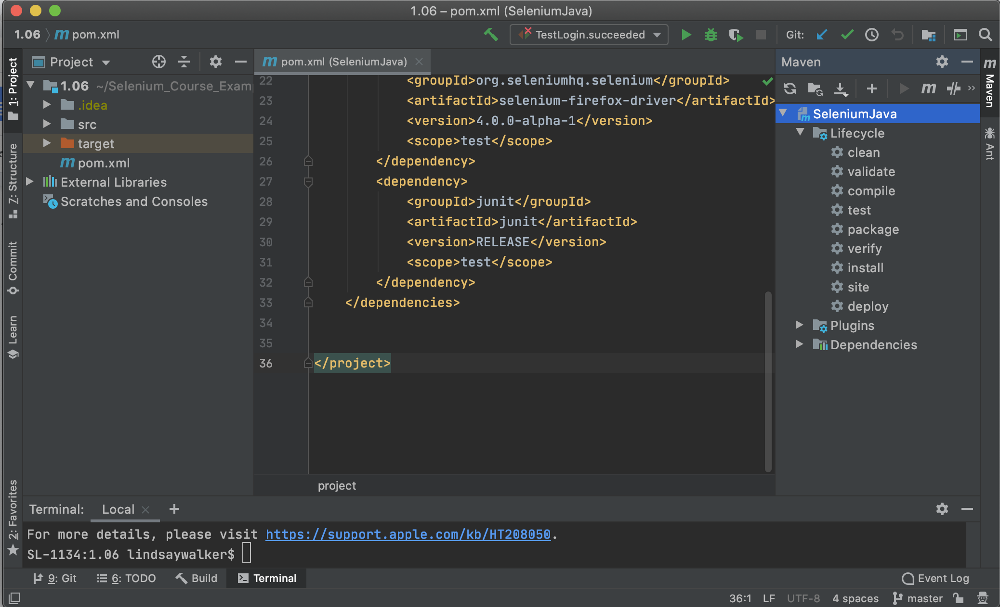
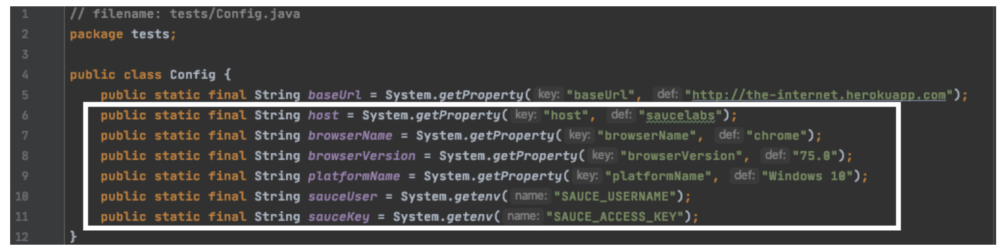
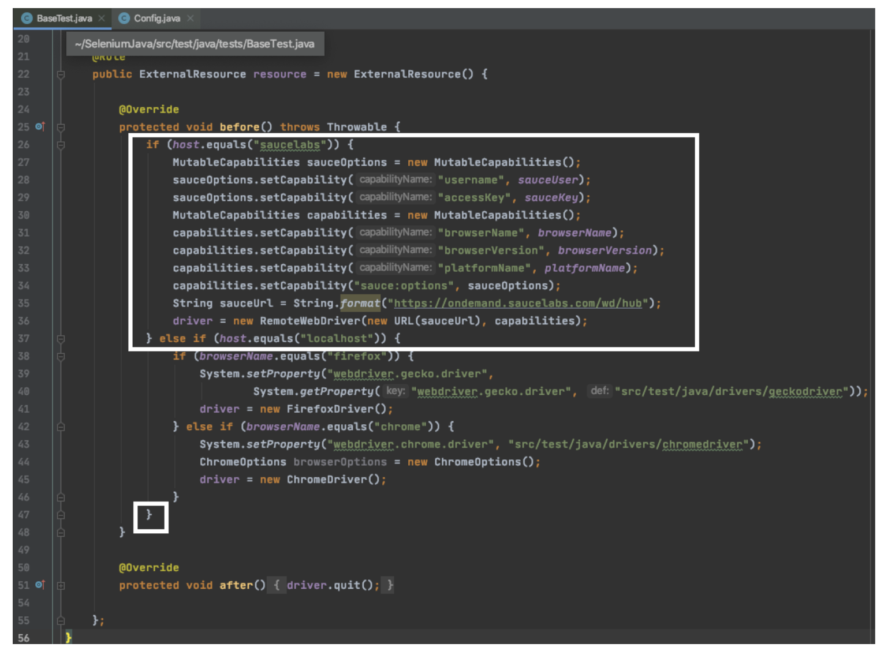

<!-- Copy this file into tools/site/coursenameFolder & start editing -->

summary: Module 3 of the Sauce Labs Quickstart course, shows users how to quickly take an automated test written in Java with the JUnit testing library, and update a few settings to run your automated tests on the Sauce Labs platform. Users will add a few things to their tests, including the URL for the Sauce Labs endpoint, a username and access key, and update capabilities
id: Module3-Quickstart
categories: intermediate
tags: quickstart
environments: Web
status: Draft
feedback link: https://forms.gle/CGu4QchgBxxWnNJK8
author:Lindsay Walker
<!-- ------------------------ -->
# Module 3 - Sauce Labs ...

<!-- ------------------------ -->
## 3.01 What You'll Learn
Duration: 0:02:00


There are many possibilities for testing on [Sauce Labs](http://app.saucelabs.com/?utm_source=referral&utm_medium=LMS&utm_campaign=link), and in this module we will cover the specific case of testing a desktop browser web applications using the Sauce Labs Cloud (the virtual machines on Sauce Labs)

**Users who have their local test environment and code set up can [start on module 3.03](https://training.saucelabs.com/codelabs/Module3-Quickstart/index.html?index=..%2F..quickstart#2)**

The examples here use Java code using Selenium version 3.14.15, the Maven build tool, as well as the JUnit4 test runner. The examples are on a MacOS machine, however we do provide examples of environment setup on a Windows machine.


### Skills & Knowledge

In this Module you will learn:

*   The automated


<!-- ------------------------ -->
## 3.02 Title
Duration: 0:05:00

To follow along with this tutorial, make sure you have a project folder set up and have created the following files, as well as have IntelliJ, Maven, and a `pom.xml` installed and included in your test code.


 ([See 1.05](https://training.saucelabs.com/codelabs/Module1-SeleniumJava/index.html?index=..%2F..SeleniumJava#4) for pom.xml content)


<!--  -->


### Use GitHub Repository (Optional)

If you are familiar with using GitHub to write your code, you can also fork/ branch this repository here for the first set of code:

**[Module 1 Project Folder](https://github.com/walkerlj0/Selenium_Course_Example_Code/blob/master/java/Mod1/1.06/src/test/java/companyname/TestLogin.java)**

In this lesson you are going to learn how to move the test suite that you have on your local machine onto the [Sauce Labs](https://accounts.saucelabs.com/am/XUI/#login/?utm_source=referral&utm_medium=LMS&utm_campaign=link) cloud platform.

Sauce Labs maintains a set of real and virtual devices, as well as a Selenium grid that you can use to run your test in almost any environment. There are many reasons this is advantageous:

* You don't have to worry about about downloading and matching browser drivers  
* You can use virtual machines (without having to set it up on your own machine)
    *   To test older versions of operating systems
    *   Test browsers that run on different operating systems that your own.
* You don’t have to provision all the different kinds of virtual machines you will need yourself
*   You don’t have to set up and maintain the Selenium Grid that will coordinate the test across all of these different machines

When you run tests on Sauce Labs, you are using the _Selenium Grid_ and the _RemoteWebdriver._  The Selenium Grid lets you distribute test execution across several machines and you connect to it with Selenium _RemoteWebDriver_.

You tell the Grid which browser and OS you want your test to run on through the use of Selenium's class object [MutableCapabilities](https://www.selenium.dev/selenium/docs/api/java/org/openqa/selenium/MutableCapabilities.html), and its various subclasses for specific browser options (ChromeOptions, FirefoxOptions, etc.) Sauce Labs has [specific language bindings](https://github.com/saucelabs/sauce_bindings) that act as wrappers for supported programming languages.


### Part 1: Update Desired Capabilities

In the `Config.java` file, you are going to communicate the settings for our test environment with the W3C [Capabilities](https://wiki.saucelabs.com/display/DOCS/Desired+Capabilities+Required+for+Selenium+and+Appium+Tests/?utm_source=referral&utm_medium=LMS&utm_campaign=link), required for every Selenium test.

In addition, you need to define some variables for your tests to be able to communicate with Sauce Labs:


```
// filename: tests/Config.java
package tests;

public class Config {
    public static final String baseUrl = System.getProperty("baseUrl", "http://the-internet.herokuapp.com");
    public static final String host = System.getProperty("host", "saucelabs");
    public static final String browserName = System.getProperty("browserName", "chrome");
    public static final String browserVersion = System.getProperty("browserVersion", "75.0");
    public static final String platformName = System.getProperty("platformName", "Windows 10");
    public static final String sauceUser = System.getenv("SAUCE_USERNAME");
    public static final String sauceKey = System.getenv("SAUCE_ACCESS_KEY");
}
```


Notice the new variables you have added:


*   `host `enables you to specify whether our tests run locally or on Sauce Labs. Right now, the host is either` "saucelabs`” or `"localhost"`
*   The [Sauce Labs Test Configuration Options](https://wiki.saucelabs.com/display/DOCS/Test+Configuration+Options) contains information for each specific test. You assume you may pass in unique usernames and access keys
    *   `browserName` specifies the browser for a test.
    *   `browserVersion` specifies which version of the browser for a test
    *   `platformName` specifies the operating system for a test.
    *   `username` is the username you have created for Sauce Labs
    *   `accessKey` is generated (and can be regenerated) in your user settings in Sauce Labs


### Final Code

Notice how many of the capabilities are grey in this example, since they aren’t yet used in the test code:


### Setting up your Sauce Labs Account

You'll need an account to use Sauce Labs. Their [free trial](https://accounts.saucelabs.com/am/XUI/#login/?utm_source=referral&utm_medium=LMS&utm_campaign=link) offers enough to get you started. And if you're signing up because you want to test an open source project, then be sure to check out their [Open Sauce account](https://saucelabs.com/open-source).

Visit [http://app.saucelabs.com/](https://accounts.saucelabs.com/am/XUI/#login/?utm_source=referral&utm_medium=LMS&utm_campaign=link). You can create a free trial account if you haven’t been assigned one.


Go to **Account> User Settings** to find your username and access key.


You will need to set up your username and access key on your machine’s environment variables either in your bash profile (Mac/Linux) or in the system properties (Windows).

To learn more about setting up environment variables, you can see the article [here](https://wiki.saucelabs.com/display/DOCS/Best+Practice%3A+Use+Environment+Variables+for+Authentication+Credentials#BestPractice:UseEnvironmentVariablesforAuthenticationCredentials-SettingUpEnvironmentVariablesonMacOSX/LinuxSystems/?utm_source=referral&utm_medium=LMS&utm_campaign=link).


#### Video

Watch This Video to See how to set up your Sauce Credentials as environment variables on MacOS [4.05 Sauce Credentials](https://drive.google.com/file/d/1qezKtvBpn94bBTJgbAd2MSx4ByNx7oaz/view?usp=sharing)


### Part 2: Use the Remote Web Driver

Now you need to update `BaseTest.java `to work with these new values and connect to Sauce Labs. Note that these are called [Capabilities](https://wiki.saucelabs.com/display/DOCS/Test+Configuration+Options), and the format they are in here is compatible with the Selenium 4.0 web driver, as well as all prevous Selenium versions. They set the options for setting up the environment for your tests.


```
// filename: tests/BaseTest.java
// ...
  @Override
        protected void before() throws Exception {
            if (host.equals("saucelabs")) {
                MutableCapabilities sauceOptions = new MutableCapabilities();
                sauceOptions.setCapability("username", sauceUser);
                sauceOptions.setCapability("accessKey", sauceKey);
                MutableCapabilities capabilities = new MutableCapabilities();
                capabilities.setCapability("browserName", browserName);
                capabilities.setCapability("browserVersion", browserVersion);
                capabilities.setCapability("platformName", platformName);
                capabilities.setCapability("sauce:options", sauceOptions);
                String sauceUrl = String.format("https://ondemand.saucelabs.com/wd/hub");
                driver = new RemoteWebDriver(new URL(sauceUrl), capabilities);
            } else if (host.equals("localhost")) {
                if (browserName.equals("firefox")) {
                    System.setProperty("webdriver.gecko.driver",
                            System.getProperty("webdriver.gecko.driver", "src/test/java/drivers/geckodriver"));
                    driver = new FirefoxDriver();
                } else if (browserName.equals("chrome")) {
                    System.setProperty("webdriver.chrome.driver", "src/test/java/drivers/chromedriver");
                    ChromeOptions browserOptions = new ChromeOptions();
                    driver = new ChromeDriver();
                }
            }
        }


```


This has two if/ else statements:


*   The first one checks to see if you have set your test to run on the `"localhost"` or `"saucelabs".`
*   The second, nested in the localhost condition, sets your test up to use the Geckodriver or Chromedriver saved in your project folder, depending on which browser you have set your test to use.

Now you can import the `MutableCapabilities `and` RemoteWebDriver` Selenium classes, as well as the` URL` java class. Add these imports in `BaseTest.java`:


```
// filename: tests/BaseTest.java
// ...
import org.openqa.selenium.MutableCapabilities;
import org.openqa.selenium.remote.RemoteWebDriver;
import java.net.URL;
// ...
```


### Run Your Tests

Now you can use terminal commands to run your tests on Sauce Labs while specifying the `browserName`,` browserVersion`, and `platformName`. As an example, if you run this command the test will be run in Sauce Labs in on MacOS 10.10 in the Chrome 75 browser:


```
mvn clean test -Dhost=saucelabs -DbrowserName=chrome -DbrowserVersion=75 -Dplatform="OS X 10.10"
```


You should also visit [http://app.saucelabs.com/](http://app.saucelabs.com/). Go to the left hand menu and choose **Automated → Test Results**. There you will see your tests with icons indicating they were run on the operating system & browser that you chose:


#### NOTE

Negative
: What did you do? At this point to create an instance of a test, you are dependent on several different objects in your test suite. First, `Base` sets up methods used by your page objects and instantiates a Selenium Webdriver instance. The page objects like `Login` and `Dynamic Loading` use the Base class (and the methods) to interact with the pages.

Negative
: Once the interactions with the webpage are taken care of, the tests come into play.` BaseTest` imports the settings from `Config`, then the tests use the `Base` class and define the specific tests run on the page. 

--


#### Final Code

The complete code can be found [here](https://github.com/walkerlj0/Selenium_Course_Example_Code/tree/master/java/Mod4/4.05). Your final code will look like this:





<!-- ------------------------ -->
## 3.0x Title
Duration: 0:05:00

<!-- ------------------------ -->
## 3.0x Title
Duration: 0:05:00

<!-- ------------------------ -->
## 3.0x Title
Duration: 0:05:00

<!-- ------------------------ -->
## 3.0x Title
Duration: 0:05:00


<!-- ------------------------ -->
## 3.07 Module 3 Quiz
Duration: 0:02:00

