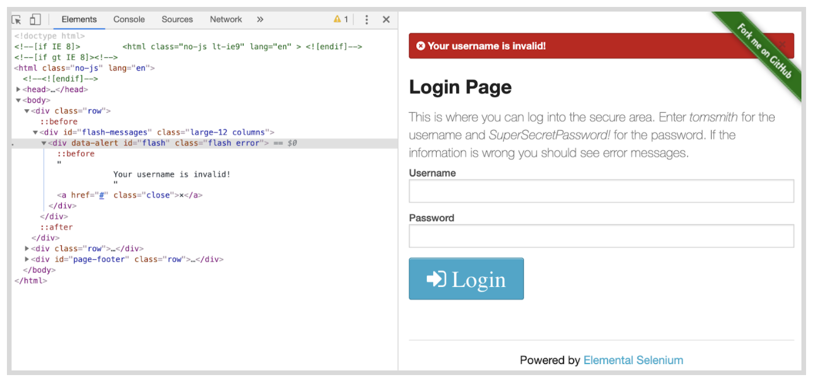
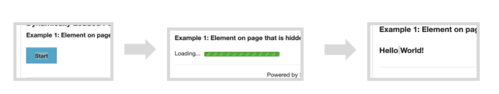
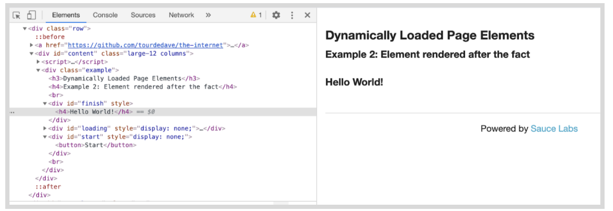

summary: Module 3 Writing Reusable Test Code
id: Module3-SeleniumJava
categories: advanced
tags: java
status: published
authors: Lindsay Walker
Feedback Link: https://forms.gle/CGu4QchgBxxWnNJK8
analytics account: UA-86110990-1
author:Lindsay Walker

# Module 3 — Write a Selenium Java Test Suite Using Page Object Model

<!--- ------------------------ -->

## 3.01 What You’ll Learn
Duration: 0:03:00

This module is derived from content in chapters 8-10 of _The Selenium Guidebook: Java Edition_ By Dave Haeffner. This module focuses on writing tests in Selenium that follow the Page Object Model (POM) for organizing test suites and abstracting imperative code into separate classes from the page and test classes. In this module, you will also add error handling to your test suite to detect and debug more easily, as well as learn about explicit and implicit waits and how they should be used.


### Objectives


*   Create a base page and use the simplified commands created in the base page within test code to write test that are easier to read and maintain
*   Create tests that have separate code for the page and test objects, with pages that draw on one or more tests to perform desired actions on that specific page
*   Add elements into your test suite for error handling, to alert test runner to common reasons for tests to fail, such as invalid credentials or failure of a page to load
*   Apply a `try...catch `statement in your code to allow all tests to run (without throwing an exceptions that stop your test suite)
*   Write code with explicit waits that are applied to individual actions, not entire functions or classes, and that doesn’t rely on implicit waits
*   Create a _facade layer_ that separates and defines simple commands that are used by all tests and page objects
*   Identify and fix problems in test suites such as poor locators, silent failures, and too much functionality in a single class
*   Abstract imperative language into separate classes, and use the simplified commands created in that class with other tests to write code that is easier to read, maintain, and declarative in nature
*   Analyze and plan test suites, learning how to balance the size and maintainability (ability to check failed tests) against the amount of features you want to test, as well as the level of abstraction you want to use to make modular objects to use in your test suite
*   Use the Page Object Model (POM) and create separate directories for page objects and test objects, and understand how they work together to make a full test suite
*   Understand how the latency that naturally occurs when you test in the cloud can impact the usability of test suites, and what you can do to ensure your tests can be run in any environment
*   Understand what implicit and explicit waits are, and the effects that occur along with latency when test suites are moved from a local machine to the public cloud.


### Base Code

If you skipped Modules 1 & 2, make sure you have a project folder set up and have created the following files, as well as have Java Development Kit 11, Maven, an updated `pom.xml`, and (ideally) the IntelliJ IDE for this project:

**[Final Module 2 Project Code](https://github.com/walkerlj0/Selenium_Course_Example_Code/tree/master/java/Mod2/2.07_solution)**


### Use GitHub Repository (Optional)

If you are familiar with using GitHub to write your code, you can also fork/ branch this repository for the first set of code.

<!--- ------------------------ -->
## 3.02 The POM and Imperative vs. Declarative Tests
Duration: 0:08:00
The Page Object Model (POM) is a design pattern that can be used with Selenium with any kind of framework. Using this pattern for tests means that you create two separate types of classes; **Pages** and **Test Cases**. The **Page** classes set up and navigate items on the page, using class members to represent web elements, an **Test** classes perform the actual assertions and tests.


Rather than integrate the calls to Selenium directly into your test methods, you can create separate classes. The POM allows you to write your tests using user-centric language, rather than Selenium-centric language.

Some general guidelines for creating page objects (or classes) include:


*   Public methods represent the services that the page offers
*   Try not to expose the internals of the page
*   Generally don't make assertions
*   Need not represent an entire page

(Source: [https://github.com/SeleniumHQ/selenium/wiki/PageObjects](https://github.com/SeleniumHQ/selenium/wiki/PageObjects))

Different results for the same action are modelled as different methods. Using strategies like this means that when your application changes and your tests break, you only have to update your page objects in one place in order to accommodate the changes. This gives us reusable functionality across our suite of tests, as well as more readable tests.


### Imperative vs. Declarative Test Language

_Imperative language_ is language that gives you the step-by-step directions for how to do something. As an example, instead of telling someone to make a peanut butter and jelly sandwich (which is a declarative statement), imperative language would tell you to lay down two pieces of bread, spread peanut butter on one, spread jelly on the other, then put the pieces together.

What is the problem with this? It doesn’t give a good sense of the purpose of the task. An alien from outer space may put the sandwich together with the jelly-side facing out, since they don’t know what the end result is supposed to be.


#### Video

Take a look at [this snippet](https://www.youtube.com/watch?v=a43YfYbdLvY) of a Sauce Labs meetup talk by Titus Fortner to see an example of imperative and declarative language.

<video id="a43YfYbdLvY"></video>
<!--- ------------------------ -->

## 3.03 Your First Page Object
Duration: 0:12:00

One of the biggest challenges with Selenium tests is that they can be brittle and challenging to maintain over time. This is largely due to the fact that things in the application you're testing change, like to elements that appear on the screen, or even the flow & layout of your website — causing your tests to break.

But the reality of a software project is that _change is a constant_. So you need to account for this reality somehow in our test code in order to be successful.

Enter Page Objects.


### Create Page Objects


### Part 1: Separate Tests and Page Objects

Let's take our login example from earlier, create a page object for it, and update our test suite structure.

First we'll need to make sure the main folder is named `tests`. If it is not, change it by right clicking on the **testdirectory** directory in IntelliJ and choosing **Refactor > Rename**. Type in `tests`, then click the **Refactor** button.


Create a new folder by right clicking on the **java** folder and choosing a new **package**. Name it  `pageobjects.`


In the new pageobjects folder, add in a new Java class called `Login` file by right clicking on the **pageobjects** folder.


When you're done, your directory structure should look like this:


Open` pageobjects`/`Login.java` in your text editor and add in the following code:


```
// filename: pageobjects/Login.java

package pageobjects;

import org.openqa.selenium.By;
import org.openqa.selenium.WebDriver;

public class Login {

    private WebDriver driver;
    By usernameLocator  = By.id("username");
    By passwordLocator  = By.id("password");
    By submitButton     = By.cssSelector("button");
    By successMessageLocator = By.cssSelector(".flash.success");

    public Login(WebDriver driver) {
        this.driver = driver;
        driver.get("http://the-internet.herokuapp.com/login");
    }

    public void with(String username, String password) {
        driver.findElement(usernameLocator).sendKeys(username);
        driver.findElement(passwordLocator).sendKeys(password);
        driver.findElement(submitButton).click();
    }

    public Boolean successMessagePresent() {
        return driver.findElement(successMessageLocator).isDisplayed();
    }

}
```


At the top of the file you specify the package where it lives and import the `By` and `WebDriver `classes from our libraries. you then declare the class `public class Login`, create variables for the four items you are using on the [login page](https://the-internet.herokuapp.com/login), and add three methods.

The first method, `public Login(WebDriver driver),` is a constructor that will run whenever a new instance of the class is created. This class accesses  the Selenium driver object, and stores it in the `driver` field (so other methods can access it). Then the login page is visited (with `driver.get`).

The second method, `public void with(String username, String password)`, is the core functionality of the login page. It fills in the login form and submits the data using the variables you just created. you will later put these variables in a separate class so they can be used by several page objects.

The last method, `public Boolean successMessagePresent(,)` checks to see that the final success message is present on the screen after you login.


Now let's update our test to use this page object.


### Part 2: Update TestLogin.java to use the Page Object

Now open the file `tests/TestLogin.java` You will be adding a few things into the test so that it can work with the `LoginPage.java` file you just created.

You can remove the import of the `By` class since it will now be done with the `Login` page object, you will import it from the Login page object.


```
//filename: tests/TestLogin.java
// ...
//import org.openqa.selenium.By;
// ...
```


Next, before the `import static org.junit.Assert.assertTrue;`, add in the import statement so you can use the Login page object.


```
//filename: tests/TestLogin.java
package tests;

import org.junit.After;
import org.junit.Before;
import org.junit.Test;
import org.openqa.selenium.WebDriver;
import org.openqa.selenium.chrome.ChromeDriver;
import org.openqa.selenium.chrome.ChromeOptions;
import pageobjects.Login;
import static org.junit.Assert.assertTrue;
// ...
```


Within the` TestLogin` class in `TestLogin.java` page, create a login variable using the `Login` page object:


```
//filename: tests/TestLogin.java
// ...
 private Login login;
// ...
```


Next, edit the `setUp()`method  in the` @Before `annotation to use the driver instance using the `Login `page object, right after the Webdriver instance:


```
//filename: tests/TestLogin.java
// ...
login = new Login(driver);
// ...
```


Now you will update your `succeed() `method. Since you did the work of retrieving [the-internet ](https://the-internet.herokuapp.com/login)app and locating items on the page in the` Login` page object, you can delete all of those, and use the` with()` method that was defined to enter a username and password, and also use the `successMessagePresent() `defined in the` Login` page object:


```
//filename: tests/TestLogin.java
// ...
@Test
    public void succeeded() {
//        driver.get("http://the-internet.herokuapp.com/login");
//        driver.findElement(By.id("username")).sendKeys("tomsmith");
//       driver.findElement(By.id("password")).sendKeys("SuperSecretPassword!");
//        driver.findElement(By.cssSelector("button")).click();
//        assertTrue("success message not present",
//                driver.findElement(By.cssSelector(".flash.success")).isDisplayed());
        login.with("tomsmith", "SuperSecretPassword!");
        assertTrue("success message not present",
                login.successMessagePresent());

    }

```


Source Code for this project can be found [here.](https://github.com/walkerlj0/Selenium_Course_Example_Code/tree/master/java/Mod3/3.03)


#### Final Code

Your new code in `TestLogin.java` should look like this:


Run your test code as was shown in Module 2.03, and look for a success message:


<!--- ------------------------ -->

## 3.04 Writing Code with Error Handling
Duration: 0:10:00

When you write tests, you are checking for one specific thing to occur. In the last example, you were checking for a specific situation where the user logs into the login page, enters their username and password, and then they get a message indicating their success.

There is more than one reason, however, that that test can fail. The test you wrote kind of assumes that the user and server for the website did everything right, and is testing to see if the app is responding with a success message as expected. Some other reasons that the success message might not display include:


*   The user enters the wrong username and/ or password
*   The page fails to load properly in the first place

The term **Error Handling** refers to creating cases that check for (predictable) unexpected outcomes or conditions so when the test is run, there are other possible errors or reasons for a failed test accounted for.


### Part 1: Test for Invalid Login Credentials

Creating a page object may feel like more work than what you started with initially, but it's well worth the effort; now that you have the entire process for things like the `with()` method which completes several actions with one method, you can use it over and over again in multiple tests, and only have to make changes in one place.

Let's add a test that checks for a failed login to demonstrate.

First, let's[ take a look ](https://the-internet.herokuapp.com/login)at the markup that gets rendered when you provide invalid credentials:



You will use the `flash error `classes in our assertion. Open` Login.java`. Underneath the other `By` methods, You will add in a new variable underneath `successMessageLocator`:


```
//filename: pageobjects/Login.java
// ...
By failureMessageLocator = By.cssSelector(".flash.error");
```


Underneath the method` successMessagePresent(){}` add in a new method:


```
//filename: tests/Test.java
// ...
public Boolean failureMessagePresent() {
        return driver.findElement(failureMessageLocator).isDisplayed();
    }
```


Next, go to` test/TestLogin.java.` Under the `@Test `annotation, after the `succeeded() `method,  add another annotation that says:


```
//filename: tests/TestLogin.java
// ...
@Test
  public void failed() {
      login.with("tomsmith", "bad password");
      assertTrue("failure message wasn't present after providing bogus credentials",
              login.failureMessagePresent());
  }

// ...
```

Notice how this test has `"bad password"` as a password, and should result in the `.flash.error` element appearing on the page.

Run **clean** and **test** with Maven and you should get two passing tests


#### NOTE

Negative
: **Why?**  Now you have a test added into your suite that will check to see that a failure message was present with a bad password. We can't check for a success message _not_ being there becauce it will throw and error and cause a timeout, ending test execution.

#### Final Code

The updated `Login.java` code should look like this:


The code in `test/TestLogin.java` should look like this:


### Part 2: Check the Page

Before you can call our page object complete, there's one more addition you should make. We'll want to add a check to make sure that Selenium is on the right page before proceeding, which will in turn, add some resiliency to our tests.

Before in your test suite, you’ve only used assertions in your test object, but this time you will add one in the page object.

In order for this to work, you need to add the elements in the following order to  `pages/Login.java`:


* At the end of the list of By methods, add in:

```
//filename: pageobjects/Login.java
// ...
     By loginFormLocator = By.id("login");
// ...
```


* Within the` Login()` method, add in an<code><em> </em>assertTrue()</code> method underneath the <code>driver.get </code>method:

```
//filename: pageobjects/Login.java
// ...
    assertTrue("The login form is not present",
                driver.findElement(loginFormLocator).isDisplayed());
//...
```


* At the top of the page, at then end of list of imports, add in:

```
//filename: pageobjects/Login.java
// ...
import static org.junit.Assert.assertTrue;
//...
```


Now, each time an instance of the Login page is accessed, the test suite will check that it is in fact on the login page. An example of why you might want to do this: it could easily be the case that the URL for that page is changed, and any test that depends on that page would fail, however this test will now tell you why.

If you run your code (`mvn clean test` in terminal or use the IntelliJ UI), you won’t see any new tests, however know that whenever the `Login()` method is being run, it will check to see that the login form is there before other tests in `TestLogin.java` are run.

See the complete [source code here](https://github.com/walkerlj0/Selenium_Course_Example_Code/tree/master/java/Mod3/3.04).


#### Final Code

The code for the the login page object should now look like this:


<!--- ------------------------ -->

## 3.05  Create a Base Page
Duration: 0:17:00

In the previous lesson, you stepped through creating a simple page object to capture the behavior of the page you were interacting with. While this is a good start, there's more you can do.

As our test suite grows, and you add more page objects, you will start to see common behavior that you will want to use over and over again throughout your suite. If you leave this unchecked you will end up with duplicative code which will slowly make our page objects harder to maintain.

Right now you are using Selenium actions directly in our page object. While on the face of it this may seem fine, it has some long term impacts, like:


*   It can slow page creation & rendering due to the way the JavaScript or other library loads things on the page
*   You may need to update your test code (added maintenance for each page) because of updates and changes to the [Selenium API](https://www.selenium.dev/documentation/en/webdriver/)
*   The inability to swap out the driver for your tests. You may in the future, for instance, want to swap out commands in Selenium for commands in Appium (for mobile testing)

What you will do now is set up a Base Page that will create descriptive variables and methods, then use those methods to interact with other pages. This way, if you need to swap out, say, a Selenium method for an Appium method, instead of having to do it in each and every page, you can change the BasePage.java methods to Appium-specific ones, and not have to change all of your other pages.


### Deleting Tests

Even though you may have grown attached to tests, it can often be a huge help to your testing suite to just delete tests that aren’t worth your time. Ask yourself the following questions:


*   How important is this test? (Do you really need to locate & return what that button says?)
*   How likely is this test to fail if the code changes? (High likelihood? Delete or refactor!)
*   How likely is this test due to fail if things run slowly?
*   How likely is this test to take up a lot of QA time figuring out why it failed?
*   How many individual pieces of functionality does this test actually check? (if it’s more than one it’s time to delete or refactor it into separate tests)

Too many tests can be an even bigger problem for a QA team than too few. Figuring out how and why a test fails takes up more time than it is worth, and impedes the feedback a dev team needs to push a feature into production. Take the time to consider the balance between testAllTheThings() © and testing efficiently and effectively, and don’t be afraid to delete tests and or useless objects and start fresh.


Source: [Giphy](https://giphy.com/gifs/baby-bye-slide-m9eG1qVjvN56H0MXt8)

Since you are not really using `TestLocator.java`, now would be a good time to delete that test before adding in the new classes in this module.

To delete` LocatorTest.java`, right click on it in the project window in IntelliJ and choose **Refactor > Safe Delete**, as you won’t be using it any longer.


### Part 1 Create a Base

A _facade layer_ can be created in the for of a base page object, which will help you simplify the language to carry out simple commands like `return driver.findElement(locator);` or  `find(locator).sendKeys(inputText);` as well as check an assertion after, and simplify this process into a single command like` type() `or `find()` so that these methods can be easily used by the rest of the test suite. In this lesson, you are going to create a simplified interface called `Base.java`, which you will then use within our `LoginPage.java `class.

First let's add a new Java class called `Base`in the` pageobjects `directory.  See Part one of module 3.03 if you need help.


Next let's open `Base.java `in your IDE and add in the following code:


```
// filename: pageobjects/Base.java

package pageobjects;

import org.openqa.selenium.By;
import org.openqa.selenium.WebDriver;
import org.openqa.selenium.WebElement;

public class Base {

    private WebDriver driver;

    public Base(WebDriver driver) {
        this.driver = driver;
    }

    public void visit(String url) {
        driver.get(url);
    }

    public WebElement find(By locator) {
        return driver.findElement(locator);
    }

    public void click(By locator) {
        find(locator).click();
    }

    public void type(String inputText, By locator) {
        find(locator).sendKeys(inputText);
    }

    public Boolean isDisplayed(By locator) {
        return find(locator).isDisplayed();
    }

}
```


What you have just done is declare a `Base` class along with methods for all of the common behavior you use with Selenium (`visit, find, click, type, `and` isDisplayed`). You also call an instance of the `Base` class that enables us to pass in and store an instance of the driver, so you don't have to explicitly pass it to the methods whenever you call them.

Now open` pageobjects/Login.java `from the same folder, and use the base page class you just created by putting `extends Base` to the `public class Login`.  


```
// filename: pageobjects/Login.java
// ...

public class Login extends Base {
// ...
```


Under the` public Login() `class, change `this.driver = driver;` to `super(driver); `so it references the parent Base class, and change` driver.get() `to` visit()` from the base page.


```
// filename: pageobjects/Login.java
// ...

  public Login(WebDriver driver) {
        super(driver);
        visit("http://the-internet.herokuapp.com/login");
// ...
```


Next, update the `with()` method to use the `type()` and `click()` methods you created in the Base class.


```
// filename: pageobjects/Login.java
// ...
  public void with(String username, String password) {
        type(username, usernameLocator);
        type(password, passwordLocator);
        click(submitButton);
    }
// ...
```


Lastly, update the `successMessagePresent()` and `failureMessagePresent()` methods to use the `isDisplayed` method.


```
// filename: pageobjects/Login.java
// ...
  public Boolean successMessagePresent() {
        return isDisplayed(successMessageLocator);
    }
    public Boolean failureMessagePresent() {
        return isDisplayed(failureMessageLocator);
    }

    }
// ...
```


Lastly, since the driver member is defined in the `Base.java` class, the driver member in `Login.java` can be safely deleted


```
// filename: pageobjects/Login.java
// public class Login extends Base {

       By usernameLocator = By.id("username");
       ...
    }
// ...
```


Now much of your code has been abstracted into the facade layer called Base.java, making it easier to read, reuse, and eventually maintain.


#### Note

Negative
: **Inheriting from the Base Page –** To establish inheritance, you use the` extends `keyword when declaring the class (example;` class Login extends Base, `and call` super `from the constructor, `super(driver)`. This passes the instance of the Selenium webdriver to the base page object, and makes all of the base page object's methods available to our login page object and any other page objects you eventually create).


If you save everything and run your tests they will run and pass just like before, but now our page objects are more readable, simpler to write, and easier to maintain and extend.

#### Final Code

Your final code should look like this:  


### Part 2: Fix No Such Element Exception

Before you add in any permanent code, lets try out an experiment. In `tests/TestLogin.java`, update `import static org.junit.Assert.assertTrue`, changing` True `to `*` so all assertions are imported.


```
//filename: tests/TestLogin.java
// ...
import static org.junit.Assert.*;
// ...
```


After the second `@test`, add in a third:


```
//filename: tests/TestLogin.java
// ...
@Test
    public void failed2() {
        login.with("tomsmith", "bad password");
        assertFalse("success message was present after providing bogus credentials",
                login.successMessagePresent());
    }

// ...
```


Run the test. You should get an error for the new test you created, in the `target/surefire-reports `folder in your project directory. `failed2()`. Click the link generated for the error report, then open the text file:


Notice the **NoSuchElementException.** Selenium can’t handle trying to find something that doesn’t exist on the page (even if it’s supposed to be false) and throws an exception, exiting the program.

Resolve this by modifying the `isDisplayed()` method in `Base.java` to handle the exception with a `try.. catch` statement  and instead of throwing an error, return `false`. Update it like so:


```
// filename: pageobjects/Base.java
// ...
    public Boolean isDisplayed(By locator) {
        try {
            return find(locator).isDisplayed();
        } catch (org.openqa.selenium.NoSuchElementException    
          exception) {
            return false;
        }
    }

// ...
```


#### Cheat Sheet

[3.05 Exception Handling Cheat Sheet](https://docs.google.com/document/d/14xudXyawbOmGiLi8K-v0fzxMBYPllygNyIPZbjthlN4/edit?usp=sharing)

Now you can go back to` test/TestLogin.java` and update, deleting the old failed() test, and renaming `failed2() `to `failed(`). When you run your tests, you should have two successful tests run.


#### Final Code


See the complete [source code here](https://github.com/walkerlj0/Selenium_Course_Example_Code/tree/master/java/Mod3/3.05).

### Quiz


<!--- ------------------------ -->

## 3.06  Resilient Test Code with Explicit Waits
Duration: 0:12:00

Ideally you should be able to write your tests once and run them across all supported browsers. More often than not, however, you will run into unexpected problems running a test in all environments.

Choosing high quality locators will help with this, but there are still some issues to deal with; most notably, timing. This is especially true when working with dynamic, JavaScript heavy pages, which is a majority of web applications you'll deal with.

There is a simple way to design the bedrock of reliable and resilient Selenium tests — and that's how you wait for elements you want to interact with. The best way to do this is through the use of explicit waits.


### Test Commands

One important thing to understand with the Selenium framework is that each method you write requires a round-trip communication between the tests and the devices. When you use these tests in the cloud, and to test remote devices, the round trips can start to take a very long time.


A function like the authenticate function here has a total of six “round trips” to do.

```
public void with(String username, String password) {
    find(usernameLocator).sendKeys(username);
    find(passwordLocator).sendKeys(password);
    find(submitButton).click();
  }
```


In this example, each method is a separate communication between the location the test is stored and the location where the devices you are testing are stored, with a total of six round trips executed in the `with() `function above.


### Implicit vs. Explicit Waits

Explicit waits help solve the problem of errors occurring because of lags in loading and communication with the webpage. An explicit wait instructs your test to halt the program execution until something specific happens. For example, you can ask your code to wait until something is clicked, until something loads on the page, and much more.

This is different from implicit waits, which are commands that cause your code to stop and wait for a given amount of time, no matter what, and take a timeout before continuing to the next function or class. There are also sleep commands, which tell the program to stop executing completely (including any asynchronous commands within the program).


Source: [Kristin Schmit, Flickr](https://www.flickr.com/photos/giraffecereal/5860286735)

Explicit waits are applied to individual test actions. Each time you want to use one you specify an amount of time (in seconds) and the Selenium action action you want to accomplish. Implicit waits are generally not recommended, and also mixing explicit waits with implicit waits cause negative consequences. Many classes or functions have default timeouts, or they may change or interfere with one another.

The only time you would want to use an implicit wait is to make sure your tests have enough time to run, especially when you move them to the cloud. When using waits, Selenium will repeatedly try an action until either it can be accomplished, or until the amount of time specified has been reached. If the latter occurs, a timeout exception is thrown.


#### Cheat Sheet

[3.05 Waits Cheat Sheet](https://docs.google.com/document/d/19__NsZX1kxbcW-vFWMpUYGqRKpXfUC6kdFh1S1BxGZg/edit?usp=sharing)


### Create a Page with Explicit Waits

You’re going to use this page as an example that demonstrates using waits against [a dynamic page on the-internet.](http://the-internet.herokuapp.com/dynamic_loading/1) The functionality is pretty simple — there is a button, and when you click it a loading bar appears for five seconds. After that, it disappears and is replaced with the text Hello World!


Create a new Java class named `DynamicLoading` in the pageobjects directory.


Paste in the following code:


```
// filename: pageobjects/DynamicLoading.java

package pageobjects;

import org.openqa.selenium.By;
import org.openqa.selenium.WebDriver;

public class DynamicLoading extends Base {

    By startButton = By.cssSelector("#start button");
    By finishText  = By.id("finish");

    public DynamicLoading(WebDriver driver) {
        super(driver);
    }

    public void loadExample(String exampleNumber) {
        visit("http://the-internet.herokuapp.com/dynamic_loading/" + exampleNumber);
        click(startButton);
    }

    public Boolean finishTextPresent() {
        return isDisplayed(finishText, 10);
    }
}
```


You will use the locator of the start `<button>` in the HTML page, as well as the `id = 'finish' ` for the “Hello World!” test that appears on the page for the` startButton` and `finishText` variables.

Since there are two dynamic loading page examples to choose from on the-internet, you created the method` loadExample()`. It accepts a number as an argument, so you can specify which of the examples you want to visit and start.

Similar to our Login page object, you have a function to check for the finish text, `isDisplayed(finishedText, 10)`. This check is slightly different though. Notice that it has a second argument (an integer value of 10). This bit of code is how we'll tell Selenium to wait (in seconds) for an element to be displayed before giving up.

First you will need to import the java` Duration `and Selenium` WebDriverWait` and `ExpectedConditions` classes at the top of `Base.java`:


```
// filename: pageobjects/Base.java
// ...
import org.openqa.selenium.support.ui.ExpectedConditions;
import org.openqa.selenium.support.ui.WebDriverWait;
import java.time.Duration;
// ...
```


Now you will add in a second version of the `isDisplayed() `method in `Base.java` to allow for explicit waits with a time parameter.


```
// filename: pageobjects/Base.java
// ...
public Boolean isDisplayed(By locator, Integer timeout) {
        try {
            WebDriverWait wait = new WebDriverWait(driver, Duration.ofSeconds(timeout).getSeconds());
            wait.until(ExpectedConditions.visibilityOfElementLocated(locator));
        } catch (org.openqa.selenium.TimeoutException exception) {
            return false;
        }
        return true;
// ...
```


In this new `isDisplayed()` function, you have a try, catch block so, again, if the method times out it won’t throw an exception. The <code>[WebDriverWait](https://www.selenium.dev/selenium/docs/api/java/org/openqa/selenium/support/ui/WebDriverWait.html) </code>class allows you to create a method with an explicit wait. The [Expected Conditions](https://www.selenium.dev/selenium/docs/api/java/org/openqa/selenium/support/ui/ExpectedConditions.html)class allows you to wait for an element to appear with an explicit wait (the other one doesn’t allow an explicit wait)

It’s important to do these in order so that first you locate the element (wait until that is completed), then you check and wait that the element is visible before you click a button, or read the text (in this case **Hello World!**)




#### NOTE

Negative
: The `timeout` parameter in both the `isDisplayed()` method using `WebDriverWait `is set to 10 seconds. This allows time for a slowly loading page and plenty of time to check to see that the element has been located and check if it is visible. In this case, if the `isDisplayed()` function is called without the` timeout` parameter, it will try the same test without the locator (the code in the first` isDisplayed() `in `Base.java`).

Negative
: 


### Don’t Combine Explicit and Implicit Waits

The major benefit of explicit waits is that if the behavior on the page takes longer than you expect (e.g., due to slow load times, or a feature change), you can simply adjust a single wait time to fix the test — rather than increase a blanket, implicit wait time (which impacts every method of the test). And since the wait is dynamic, it won't take the full amount of time to complete (like a hard-coded sleep would).

If you're thinking about mixing explicit waits with an implicit wait, reconsider.  If you use both together you could run into issues later on due to inconsistent implementations of the implicit wait functionality across local and remote browser drivers. Long story short, you could end up with randomly failing tests that will be hard to debug. You can read more about the specifics [here](https://stackoverflow.com/questions/15164742/combining-implicit-wait-and-explicit-wait-together-results-in-unexpected-wait-ti#answer-15174978).

In this lesson you created `DynamicLoading.java`, but have yet to create a test you can run against it, which you will do in the next lesson.

You can see the [code examples here](https://github.com/walkerlj0/Selenium_Course_Example_Code/tree/master/java/Mod3/3.06).


#### Final Code

The changes to Base.java should look like this:


<!--- ------------------------ -->

## 3.07  Testing with Explicit Waits
Duration: 0:08:00


Now that you have our new page object and an updated base page, it's time to write our test to use it. If you noticed in your `DynamicLoading.java` page object from the last lesson, the methods like `loadExample() `were grey in the IDE because they weren’t being used.


### Part 1: Dynamic Loading Test

Let's create a new file called `TestDynamicLoading.java` in the `tests` package.


The contents of this test file are similar to `TestLogin.java` with regards to its setup and structure. Open `TestDynamicLoading.java` in your IDE and paste in the following:


```
// filename: tests/TestDynamicLoading.java
package tests;

import org.junit.After;
import org.junit.Before;
import org.junit.Test;
import org.openqa.selenium.WebDriver;
import org.openqa.selenium.chrome.ChromeDriver;
import org.openqa.selenium.chrome.ChromeOptions;
import pageobjects.DynamicLoading;

import static org.junit.Assert.assertTrue;

public class TestDynamicLoading {

    private WebDriver driver;
    private DynamicLoading dynamicLoading;

    @Before
    public void setUp() {
      System.setProperty("webdriver.chrome.driver", "<insert path to chromedriver here>");
      ChromeOptions browserOptions = new ChromeOptions();
      browserOptions.setCapability("browserVersion", "86.0");
      driver = new ChromeDriver(browserOptions);
      login = new Login(driver)
    }

    @Test
    public void hiddenElementLoads() {
        dynamicLoading.loadExample("1");
        assertTrue("finish text didn't display after loading",
                dynamicLoading.finishTextPresent());
    }

    @After
    public void tearDown() {
        driver.quit();
    }
}
```


In our test, `hiddenElementLoads()`,  you are visiting the first dynamic loading example and clicking the start button (which is accomplished in `dynamicLoading.loadExample("1")` We're then checking that the finish text gets displayed and reporting an error if it doesn’t.


#### NOTE

Negative
: Remember that you have the Chrome driver installed in this case on your local machine. This code will break if you move this to another location like a docker container or virtual machine, and needs to be updated in any `setUp()` function in the `System.setProperty() `you have created in any test. You also need to remember to update the `System.setProperty() `to whatever you had created in `TestLogin.java`.

When you save this and run it with  `mvn clean test` from terminal (or from IntelliJ) it will:

*   Launch a browser
*   Visit the page
*   Click the start button
*   Wait for the loading bar to complete
*   Find the finish text
*   Assert that it is displayed.
*   Close the browser


The Login test will be run as well. Notice that this time the tests took over 14 seconds, so the 10 second wait for the `isDisplayed` methods was put to good use.


### Part 2: Use the Test with Another Page

Time to step through one more example to see if our explicit wait holds up.




Now that you have our new page object and an updated base page, it's time to write our test to use it. If you noticed in your `DynamicLoading.java` page object from the last lesson, the methods like `loadExample() `were grey in the IDE because they weren’t being used.

[The second dynamic loading example](http://the-internet.herokuapp.com/dynamic_loading/2) is laid out similarly to the last one. The difference is that it renders the final text after the progress bar completes (whereas the previous example had the element on the page but it was hidden until the progress bar finished). In other words, in the first test, the text was there but hidden, but in this test the text doesn’t even exist until after the loading image disappears.

Notice that it has the same start `<button>` and `id='finished'` at the beginning and end of the test. Will our same test work for the second page?

Let's add a nearly identical second test to` DynamicLoadingTest.java` called `elementAppeared` that will load this second example and perform the same check (on the other page) as you did in the previous test.


```

// filename: tests/TestDynamicLoading.java
// ...
  @Test
    public void elementAppears() {
        dynamicLoading.loadExample("2");
        assertTrue("finish text didn't render after loading",
                dynamicLoading.finishTextPresent());
    }
// ...
```


Run the test. You can run the tests by typing `mvn clean test` in your terminal. To run just the tests in` TestDynamicLoading.java`, run the command  `mvn test -Dtest=TestDynamicLoading`


#### NOTE

Negative
: The `-Dtests= `flag allows you to search for a certain set of characters when you run the JUnit test. In this case, you are searching for and running the name of the test class **TestDynamicLoading, **and only two tests should be run.

Negative
: 


See the complete [source code here.](https://github.com/walkerlj0/Selenium_Course_Example_Code/tree/master/java/Mod3/3.07)


### Browser Timing

Using explicit waits gets you pretty far. But there are a few things you'll want to think about when it comes to writing your tests to work on various browsers.

It's simple enough to write your tests locally against one browser and assume you’re all set. But once you start to run things against other browsers you may be in for a surprise. The first thing you're likely to run into is the speed of execution. A lot of your tests may start to fail when you point them at either Chrome or Internet Explorer, and likely for different reasons.

The best approach to solve this is an iterative one. Run your tests in a target browser and see which ones fail. Take each failed test, adjust your code as needed, and re-run it against the target browser until they all pass. Repeat for each browser you care about until everything is green.


### Closing Thoughts

By explicitly waiting to complete an action, our tests are in a much more resilient position because Selenium will keep trying for a reasonable amount of time rather than trying just once. And each action can be tuned to meet the needs of each circumstance. Couple that with the dynamic nature of explicit waits, and you have something that will work in a multitude of circumstances — helping you endure even the toughest of browsers to automate.

This is one of the most important concepts in testing with Selenium. _Use explicits waits often._


#### Final Code


## 3.08 Quiz


