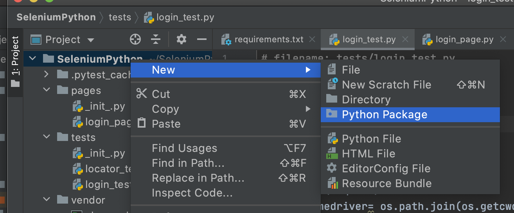
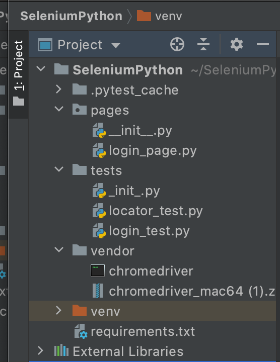

summary: Module 3 Writing Reusable Test Code
id: Module3-SeleniumJS
categories: advanced
tags: javascript
environments: Web
status: Published
authors: Lindsay Walker
Feedback Link: https://forms.gle/CGu4QchgBxxWnNJK8
author:Lindsay Walker

# Module 3 — Writing Reusable Test Code

<!--- ------------------------ -->

## 3.01 What You’ll Learn
Duration: 0:03:00

This module is derived from content in chapters 8-10 of _The Selenium Guidebook JavaScript Edition_ By Dave Haeffner. This module focuses on writing tests in Selenium that follow the Page Object Model (POM) for organizing test suites and abstracting imperative code into separate classes from the page and test classes. Add error handling to your test suit to detect and debug more easily, as well as learn about explicit and implicit waits and how they should be used.

### Objectives

*   Create a Base Page and use the simplified commands created with other pages to write code that is easier to read and maintain
*   Create tests that have separate code for the Page and Test Objects, with pages that draw on one or more tests to perform desired actions on that specific page
*   Add elements into your test suite for error handling, to alert test runner to common reasons for tests to fail, such as invalid credentials or failure of a page to load
*   Apply a `try...catch` statement in your code to allow all tests to run (without throwing an exceptions that stop your test suite)
*   Write code with explicit waits that are applied to individual actions, not entire functions or classes, and that doesn’t rely on implicit waits
*   Create a _facade layer_ that separates and defines simple commands that are used by all tests and page objects
*   Identify and fix problems in test suites such as poor locators, silent failures, and too much functionality in a single class
*   Choose and separate imperative language into separate objects and pages, and use the simplified commands created in that class with other tests to write code that is easier to read, maintain, and declarative in nature
*   Analyze and plan test suites, learning how to balance the size and maintainability (ability to check failed tests) against the amount of features you want to test, as well as the level of abstraction you want to use to make modular objects to use in your test suite
*   Use the _Page Object Model_ and create separate directories and files that are for Page objects and Test objects, and understand how they work together to make a full test suite
*   Understand how the latency that naturally occurs when you test in the cloud can impact the usability of test suites, and what you can do to ensure your tests can be run in any environment
*   Understand what implicit and explicit waits are, and the effects that occur along with latency when test suites are moved from a local machine to the public cloud


### Base Code

If you skipped Modules 1 & 2, make sure you have a project folder set up and have created the following files, as well as have NodeJS installed and init for this project:

**[Final Module 2 Project Code](https://github.com/walkerlj0/Selenium_Course_Example_Code/tree/master/python/Mod2/2.07_solutions)**


#### NOTE
Negative
: If you are cloning or downloading the GitHub repo, make sure you do the following:
  * Ensure there is no `.pytest_cache` file in the project (delete it!)
  * You have [Python 3](https://help.dreamhost.com/hc/en-us/articles/115000699011-Using-pip3-to-install-Python3-modules) (including Pip3) and Pytest installed
  * You run `pip3 install -r requirements.txt` to install all the other dependencies.


### Use GitHub Repository (Optional)

If you are familiar with using GitHub to write your code, you can also clone or download the repository above to use as the base to write your test from.


## 3.02 The POM and Imperative vs. Declarative Tests
Duration: 0:08:00

The Page Object Model (POM) is a design pattern that can be used with Selenium with any kind of framework. Using this pattern for tests means that you create two separate types of classes; **Pages** and **Test Cases**. The **Page** classes set up and navigate items on the page, using variables to represent web elements, and **Test** classes perform the actual assertions and tests. There is also a **base test** called `conftest.py`, which contains the fixture used to set up and tear down each test, and a **base page** which defines methods used in each test.


Rather than integrate the calls to Selenium directly (such as `driver.find_element()`) into your test or page methods, you can create them in a class, and call them later. Now you can use the methods with easier to understand language in your tests, making it easier for humans to read.

Using strategies like this means that when your application changes and your tests break, you only have to update your page objects in one place in order to make the changes. This makes our tests easier to reuse.

### Imperative vs. Declarative Test Language

_Imperative language_ is language that gives you the step-by-step directions for how to do something. As an example, instead of telling someone to make a peanut butter and jelly sandwich (which is a declarative statement), imperative language would tell you to lay down two pieces of bread, spread peanut butter on one, spread jelly on the other, then put the pieces together.

What is the problem with this? It doesn’t give a good sense of the purpose of the task. An alien from outer space may put the sandwich together with the jelly-side facing out, since they don’t know what the end result is supposed to be.

#### Video

Take a look at this snippet of a Sauce Labs meetup talk by Titus Fortner to see an example of imperative and declarative language.

[3.02_Imperative_Declarative](https://drive.google.com/file/d/1zq2JBVjFwupuq2NbsrkW5vHrIOFR3xer/view?usp=sharing)


## 3.03 Your First Page Object
Duration: 0:12:00

One of the biggest challenges with Selenium tests is that they can be brittle and challenging to maintain over time. This is largely due to the fact that things in the application you're testing change - like elements that appear on the screen or even the flow & layout of your website — causing your tests to break.

But the reality of a software project is that _change is a constant_. So you need to account for this reality somehow in our test code in order to be successful.

This is where page objects come in, to help reduce duplicate code, and make maintaining a test suite easier. Instead of writing the code to navigate the page and run a test in the same place, you can separate those two types of actions into page and test objects.

That way, if you have written several tests on the same page, you only have to change the code in one place.


#### Part 1: Create A Page Object

Let's take our login example from earlier, create a page object for it, and update our test suite structure.

First we'll need to create a new folder called `pages` in the root of our project directory.

In both the **tests** and **pages** directory, you will want to create a blank file called `_init_.py`. The purpose of this file is to let Python and Pycharm know that these directories should be treated as packages.
 * Right click on the top-level folder and choose **New > Python Package**. Name the directory **pages**.
 

 * Right click on the **pages** package and create a file names **login_page.py**.

 * Within both the **pages** and **tests** directories, there should be a file that will remain blank, called **\_init_\.py**.

 * Once you are done, your directory structure should look like the following:
 


Open `login_page.py` in your text editor and add in the following code:
```
# filename: pages/login_page.py
from selenium.webdriver.common.by import By

class LoginPage():
    _username_input = {"by": By.ID, "value": "username"}
    _password_input = {"by": By.ID, "value": "password"}
    _submit_button = {"by": By.CSS_SELECTOR, "value": "button"}
    _success_message = {"by": By.CSS_SELECTOR, "value": ".flash.success"}
    _failure_message = {"by": By.CSS_SELECTOR, "value": ".flash.error"}

    def _init_(self, driver):
        self.driver = driver
        self.driver.get("http://the-internet.herokuapp.com/login")

    def with_(self, username, password):
        self.driver.find_element(self._username_input["by"],
                                 self._username_input["value"]).send_keys(username)
        self.driver.find_element(self._password_input["by"],
                                 self._password_input["value"]).send_keys(password)
        self.driver.find_element(self._submit_button["by"],
                                 self._submit_button["value"]).click()

    def success_message_present(self):
        return self.driver.find_element(
            self._success_message["by"], self._success_message["value"]).is_displayed()

    def failure_message_present(self):
        return self.driver.find_element(
            self._failure_message["by"], self._failure_message["value"]).is_displayed()

    def test_invalid_credentials(self, login):
        login.with_("tomsmith", "bad password")
        assert login.failure_message_present()
```

Notice how this new page object creates variables for all the elements you will interact with on the page, from the username files to the success message. The `LoginPage` class is what will be used to contain all of this.

It also defines a constructor in `__init__` (_Note the double underscore before and after `init`_) that will run each time a new instance of the `LoginPage` class is created. The driver is stored in the driver variable so other methods can access it with `self.driver`  

#### NOTE
Negative
: The `self` parameters that you see in the functions are to let python know that it should use the attributes and methods defined in the method itself, as there is no way to define private methods & attributes with Python and you want to make sure your function is using the correct one.


The `with_` method contains the core functionality of entering the information and logging into the page. If the login flow changes, you would only have to change this method to be able to reflect that in all your tests.

Lastly, the different types of locator methods are created at the bottom of the page in able to perform any checks you may with to perform. `success_message_present`, takes parameters for the type of locator and value of the locator (such as CSS selector) to check to see that the final success message is present on the screen after you log in.


#### Part 2: Update the Login Test to use the Page Object

Now open the file in the test folder named `login_test.py`. Now we can simplify the code in `test_invalid_credentials` method since much of the work has already been done in `login_page.py`. You no longer have to use methods like `get()`, `findElement()`, or  `sendKeys()`, and you can take out the hardcoded username and password since those are all defined in the page object.   

Within the `test_valid_credentials`, logic, replace the `driver` parameter with `login` and add the new simplified logic:

```
# filename: tests/login_test.py
# ...
def test_valid_credentials(login):
    login.with_("tomsmith", "SuperSecretPassword!")
    assert login.success_message_present()
```
In the list of `imports` delete the method that imports the `By` class, and replace it with an import of the Login page where the `By` methods were moved to:

```
# filename: tests/login_test.py
import pytest
import os
from selenium import webdriver
from pages.login_page import LoginPage
```

Lastly, above the `quit()` method, instantiate a driver to the variable `loginPage` and return it after the `addfinalizer` teardown test fixture.

```
# filename: tests/login_test.py
# ...
loginPage = LoginPage(driver_)

    def quit():
        driver_.quit()

    request.addfinalizer(quit)
    return loginPage
```

Go to the terminal at the bottom of the PyCharm IDE and run the command `pytest`. Your login test should pass. If it doesn't pass, try running `python -m pytest` so that the [current directory is added to the filepath.](https://docs.pytest.org/en/stable/usage.html#calling-pytest-through-python-m-pytest)


#### Note
Negative
: If you have issues getting your test to run, check the following:

Negative
: * Make sure you have Python 3.7+ with pip 3 installed

Negative
: * You dependencies are correctly installed from requirements.txt `pip3 install -r requirements.txt`

Negative
: * There is no `.pytest_cache` file installed from a repo.

Negative
: * Both the **tests** and **page** Packages have an `\_\_init\_\_.py` file with double underscores before and after.


Negative
: * Go to the **PyCharm** menu then > **Preferences**. (On Windows it's **File > Settings**). Find the auto import settings, and make sure that your imports are set up to use the **from \<module\>** syntax: 

Negative
: When you run pytest in the terminal, you should get results like this. The locator-test may or may not fail. This is what we call a lfaky test since the output changes. Sometimes you get the right respons, `baz`, and sometimes you do not: 


#### Final Code


Your new code in `test_login.py` should look like this. See the complete [source code here](https://github.com/walkerlj0/Selenium_Course_Example_Code/tree/master/python/Mod3/3.03).


## 3.04 Writing Code with Error Handling
Duration: 0:10:00

When you write tests, you are checking for one specific thing to occur. In the last example, you were checking for a specific situation where the user logs onto the login page, enters their username and password, and then they get a message indicating their success.

There is more than one reason, however, why that test might fail. The test you wrote kind of assumes that the user and server for the website did everything right, and is testing to see if the app responds with a success message as expected. Some other reasons why the success message might not display include:

*   The user enters the wrong username and/or password
*   The page fails to load properly in the first place

The term _Error Handling_ refers to creating cases that check for predictable negative outcomes or conditions so when the test is run, it accounts for other possible errors or failure cases.

As you may have noticed in `login_test.py` there are methods for checking what happens when a user enters invalid credentials and a test to check that an error message is present. You can also check to ensure that element are present before running a test to avoid exception being thrown for unknown reasons.


### Deleting Tests

Even though you may have grown attached to test that you worked hard to create, it can often be a huge help to your testing suite to just delete tests that aren’t worth your time. Ask yourself the following questions:

*   How important is this test? (Do you really need to locate & return what that button says?)
*   How likely is this test to fail if the code changes? (High likelihood? Delete or refactor!)
*   How likely is this test due to fail if things run slowly?
*   How likely is this test to take up a lot of QA time figuring out why it failed?
*   How many individual pieces of functionality does this test actually check? (if it’s more than one it’s time to delete or refactor it into separate tests)

Too many tests can be an even bigger problem for a QA team than too few. Figuring out how and why a test fails takes up more time than it is worth, and impedes the feedback a dev team needs to push a feature into production. Take the time to consider the balance between `testAllTheThings()` and testing efficiently and effectively, and don’t be afraid to delete tests and or useless objects and start fresh.


Source: [Giphy](https://giphy.com/gifs/baby-bye-slide-m9eG1qVjvN56H0MXt8)

Since you are not really using `locator_test.py`, now would be a good time to delete that test before adding in the new classes in this module.

To delete `locator_test.py`, right click on it and choose **Delete**. Choose the **Safe Delete** option in the dialogue box that pops up.


### Part 1: Test for Invalid Login Credentials

Creating a page object may feel like more work than what you started with initially, but it's worth the effort once you start analyzing test results.

Let's add a test that checks for a failed login to demonstrate.

First, let's take a look at [the element that renders](https://the-internet.herokuapp.com/login)  when you provide invalid credentials:


you will use the `flash error` classes in our assertion.  Add a locator for this element to our page object along with a new method to perform a display check against it. Open `login_test.py.` and add instantiate the `test invalid_credentials` method to use it in the test.

```
# filename: tests/login_test.py
# ...
    def test_invalid_credentials(login):
        login.with_("tomsmith", "bad password")
        assert login.failure_message_present()
```
If we save these changes and run our tests (type `pytest` in terminal) you will see two browser windows open (one after the other) testing for successful and failure login scenarios. Notice how the `assert` statement checked to make sure that when you used invalid credentials there was a failure message.


### Part 2: Check for Login Page Elements

Time to add one last last thing to your page object. Generally you want to keep assertions out of page objects, but in this case you want to add an assertion to make sure that are on the right page before running your test. This will help add some resiliency to your test, since it will let you know that the issue is the login page elements aren't present before running other tests.

In the list of members (variables) on `login_page.py` where the `LoginPage` class is created, add a new member called _login_form:

```
# filename: pages/login_page.py
class LoginPage():
# ...
    _login_form = {"by": By.ID, "value": "login"}
# ...
```
In the `__init__` method, underneath the `self.driver.get` statement that points you to the URL for the application you are testing, add in the following:

```
# filename: pages/login_page.py
# ...
        assert self.driver.find_element(
            self._login_form["by"], self._login_form["value"]).is_displayed()
# ...
```

Run `pytest` in terminal, and you should see the tests run exactly as they did before, with an extra check in the beginning.

You can force a failure by modifying the URL in the `__init__` method:
```
# filename: pages/login_page.py
# ...
def __init__(self, driver):
    self.driver = driver
    self.driver.get("http://the-internet.herokua.com/login")
    assert self.driver.find_element(
        self._login_form["by"], self._login_form["value"]).is_displayed()
# ...
```


Change the URL back to `http://the-internet.herokuapp.com/login`. You can check the [source code here](https://github.com/walkerlj0/Selenium_Course_Example_Code/tree/master/python/Mod3/3.04) to make your test looks the same.


#### Final Code

The updated code should look like this:


## 3.05  Common Issues with Test Code Reuse
Duration: 0:17:00

In the previous lesson, you stepped through creating a simple page object to for all of the interactions your tests performs with the login page. While this is a good start, there's more you can do.

As our test suite grows, and you add more page objects, you will start to see common behavior that you will want to use over and over again throughout our suite. You will want to abstract out common actions into a base page.

Right now you are using Selenium actions directly in your page object. While on the face of it this may seem fine, it has some long term impacts, like:

*   It can slow page creation & rendering due to the way the JavaScript or other library loads things on the page
*   You may need to update your test code (added maintenance for each page) because of updates and changes to the [Selenium API](https://www.selenium.dev/documentation/en/webdriver/)
*   The inability to swap out the driver for your tests. You may in the future, for instance, want to swap out commands in Selenium for commands in Appium (for mobile testing)

What you will do now is set up a Base Page that will create descriptive variables and methods, then use those created methods to interact with other pages. This way, if you need to swap out, say, a Selenium method for an Appium method, instead of having to do it in each and every page, you can change the BasePage.js methods to Appium-specific ones, and not have to change all of your other pages.


### Part 1: Create a Facade Layer

Creating a _facade layer_ or a **Base Page**  involves creating a separate page or class from your test page, that helps you simplify the language to carry out simple commands like `self.driver.get(url)`, check an assertion after, and simplify this process into a single command like `find()` or `click()` so that these methods can be easily used by the rest of the test suite. In this lesson, you will create a simplified member called `base_page.py`, which you will then use to create your `login_page` class.

First let's add a new file in the **pages** directory called `base_page.py`.

```
#  filename: pages/base_page.py
class BasePage():
    def __init__(self, driver):
        self.driver = driver

    def _visit(self, url):
        self.driver.get(url)

    def _find(self, locator):
        return self.driver.find_element(locator["by"], locator["value"])

    def _click(self, locator):
        self._find(locator).click()

    def _type(self, locator, input_text):
        self._find(locator).send_keys(input_text)

    def _is_displayed(self, locator):
        return self._find(locator).is_displayed()
```

After declaring the class `BasePage()` you receive and store an instance of the Selenium `driver` just like in our Login page object does. Next, define methods to be used by other page objects; _visit, _find, _click, _type, and _is_displayed. We can reuse these methods as we need for certain behaviors.

Now that we have all of our Selenium actions in one place, let's update our login page object to leverage this facade.

At the top of the `base_page.py` object, you can now import the `BasePage` class:

```
#  filename: pages/login_page.py
from selenium.webdriver.common.by import By
from base_page import BasePage
# ...
```

You will also want to create the LoginPage class by inheriting the BasePage object:

```
#  filename: pages/login_page.py
# ...
class LoginPage(BasePage):
# ...
```

In the `__init__` method replace the  logic using the `_visit` and `_is_displayed` methods:

```
#  filename: pages/login_page.py
#...
def __init__(self, driver):
    self.driver = driver
    self._visit("http://the-internet.herokuapp.com/login")
    assert self._is_displayed(self._login_form)
#...
```
Update the `_with` method useing the `_type` and `_click` methods:

```
#  filename: pages/login_page.py
#...
def with_(self, username, password):
    self._type(self._username_input, username)
    self._type(self._password_input, password)
    self._click(self._submit_button)
#...
```

Lastly, use the `_is_displayed` method in both of the methods that check for failure of success messages:

```
#  filename: pages/login_page.py
#...
    def success_message_present(self):
        return self._is_displayed(self._success_message)

    def failure_message_present(self):
        return self._is_displayed(self._failure_message)
#...
```
Test out running your test code with the `pytest` command, and they should run just like before.


#### Final Code

Your final code at this stage should look like this:


### Part 2: Add Error Handling

You may be wondering why we didn't just check to see if the success message wasn't present by checking for a false condition in our assertion.

```
        assert login.success_message_present() == False
```
There are two problems with this approach. First, our test will fail and throw an exception, interrupting test execution. This is because Selenium errors when it looks for an element that's not present on the page -- which looks like this:

```
NoSuchElementException: Message: Unable to locate element: {"method":"css selector","selector":".flash.success"}
```

Second, the absence of a success message doesn't necessarily indicate a failed login. This is why checking for the presence of the failure message is more effective.


In the `_is_displayed` method declaration in `base_page.py` make a change that will check to see if will try and find a locator, then instead of throwing an exception if it fails, it will throw a `False` condition. You will also need to import the `NoSuchElementException` at the top.

```
#  filename: pages/base_page.py
from selenium.common.exceptions import NoSuchElementException
#  ...
    def _is_displayed(self, locator):
        try:
            return self._find(locator).is_displayed()
        except NoSuchElementException:
            return False
```


Now, to test out this new exception handling, revisit your `test_invalid_credentials)` test and alter it so it checks to see if the success message is not present (which would normally trigger a NoSuchElementException exception) to make sure things work as we expect.

```
#  filename: tests/login_test.py
#  ...
    def test_invalid_credentials(self, login):
        login.with_("tomsmith", "bad password")
        assert login.success_message_present() == False
```


Now when you run your test with the command `pytest` in terminal from your project folder, you should see two passing tests, and no exceptions.


#### Final Code
Review the [complete source code here](https://github.com/walkerlj0/Selenium_Course_Example_Code/tree/master/python/Mod3/3.05).


### Quiz


<!--
Quiz
What are the reasons you created base_page.py? Pick the most correct answer.
1. You are lazy and don’t want to have to write code as many times, and you know the code will never change, so you can just put it all in a base page and forget about it.
2. You want to give people writing tests only five options to create tests with, (visit, find, click, type, isDiplayed) so they don’t make overly complex tests, so you created these in BasePage.
3. You aren’t using the functionality of this.driver.get() or this.driver.FindElement(), so you put it in a separate document that won’t be used in our test suite.
4. You want to be able to make other pages you make, like LoginPage.java  more readable, as well as reuse basic code so it’s easier to update in one place, and take effect everywhere.*

*Creating a base page makes tests more readable and maintainable. It does also reduce the amount of code that you write, though this isn't the main reason for creating a base page.

Why does is the following code not usable in a test?

```
assert login.success_message_present() == False
-----------------------------------------------------
def success_message_present(self):
    return self._is_displayed(self._success_message)
----------------------------------------------------
def _is_displayed(self, locator):
        return self._find(locator).is_displayed()
```

1. When you need to have a try, except statement in the _is_displayed method otherwise an exception will be thrown and the test will stop running.*
2. It isn't possible to check for Boolean conditions in a test without an if, else statement.
3. If the login was successful with bad credentials, they wouldn’t be able to see it was occurring.
4. When you need to have a try, except statement in the _is_displayed method otherwise it won't detect a Boolean condition.

*The try, except statement  in required int he _is_displayed method so that,  instead of an error, a 'False' condition can be returned instead of throwing an exception, and interrupt the running of the test.
-->

## 3.06  Resilient Test Code and Timing
Duration: 0:12:00


Ideally you should be able to write your tests once and run them across all supported browsers. More often than not, however, you will run into unexpected problems running a test in all environments, and sometimes there may be a hack or two involved.

Choosing high quality locators will help with this, but there are still some issues to deal with; most notably, timing. This is especially true when working with dynamic, JavaScript-heavy pages, which is is something you will find with most web applications.

There is a simple way to design the bedrock of reliable and resilient Selenium tests — and that's how you wait for elements you want to interact with. The best way to do this is through the use of explicit waits.

### Explicit Waits

One important thing to understand with the Selenium framework is that each method you write requires a round-trip communication between the tests and the devices. When you use these tests on the cloud, and to test remote devices, the round trips can start to take a very long time.


A function like the `_with` function here has a total of six “round trips” to do.

```
def with_(self, username, password):
    self.driver.find_element(self._username_input["by"],
                             self._username_input["value"]).send_keys(username)
    self.driver.find_element(self._password_input["by"],
                             self._password_input["value"]).send_keys(password)
    self.driver.find_element(self._submit_button["by"],
                             self._submit_button["value"]).click()
```

In this example you locate the username filed, input a username, locate a password page, input a password, and locate the submit button, then click the submit button, which means there are six separate signals sent to the driver, which can add significate time when you are sending it to a remote browser.

### Implicit vs. Explicit Waits

Explicit waits pause your test execution until a specified event triggers, which prevents errors due to lag. For example, you can ask your code to wait until something is clicked, until something loads on the page, and much more.

Implicit waits pause your test execution for a specified amount of time for all functions or classes, before continuing to the next function or class. You can also pause your test execution indefinitely (including any asynchronous commands within the program) with a `sleep` command, which would then require an additional command to "wake up" and continue.


Source: Kristin Schmit, Flickr ([https://www.flickr.com/photos/giraffecereal/5860286735](https://www.flickr.com/photos/giraffecereal/5860286735))

Explicit waits are applied to individual test actions. Each time you want to use one you specify an amount of time (in seconds) and the Selenium action you want to accomplish.

Implicit waits are generally not recommended, and also mixing explicit waits with implicit waits cause negative consequences. Many classes or functions have default timeouts, or the different waits may change or interfere with one another.

The only time you would want to use an implicit wait is to make sure your tests have enough time to run, especially when you move them to the cloud. When using waits, Selenium will repeatedly try an action until either it can be accomplished, or until the amount of time specified has elapsed. If the latter occurs, a timeout exception is thrown.

#### Cheat Sheet

[3.06 Exception Handling Cheat Sheet](https://docs.google.com/document/d/1AZPbWbIITwAQ9hJxSUxT53sr2U7ofq1i3FIEiOU5OBk/edit?usp=sharing)


### Create a Page with Explicit Waits

We’re going to use this page as an example that demonstrates waits against [a dynamic page on the-internet.](http://the-internet.herokuapp.com/dynamic_loading/1) The functionality is pretty simple — there is a button, and when you click it, a loading bar appears for five seconds. After that, it disappears and is replaced with the text Hello World!


First we'll create a new python file in the **pages** directory named `dynamic_loading_page.py` .


Paste in the following code:

```
# filename: pages/dynamic_loading_page.py
from selenium.webdriver.common.by import By
from . base_page import BasePage


class DynamicLoadingPage(BasePage):
    _start_button = {"by": By.CSS_SELECTOR, "value": "#start button"}
    _finish_text = {"by": By.ID, "value": "finish"}

    def ___init___(self, driver):
        self.driver = driver

    def load_example(self, example_number):
        self._visit("http://the-internet.herokuapp.com/dynamic_loading/" + example_number)
        self._click(self._start_button)

    def finish_text_present(self):
        return self._is_displayed(self._finish_text, 10)
```

Again, you inherit from the `BasePage`, then create two variables to locate the start button, then locate the finish message.

There is the `__init__` method to instantiate a driver, then two methods. The `load_example` method loads the [Dynamic Loading page from the-internet app](https://the-internet.herokuapp.com/dynamic_loading) and clicks the **Start** button, then the `finish_text_present` checks for the text that appears after the **Loading...** finishes. Notice how it takes a number parameter, which expresses the number of seconds Selenium will wait (10) for that element to be displayed before timing out.

Since there are two different **Dynamimc Loading** pages, you will pass in either a `1` or `2` when you call `load_example`.

Next, we will modify the `BasePage`. First you need to import three packages, on extra from `seslnium.comon exceptions`, and two new ones::

```
# filename: pages/base_page.py
from selenium.common.exceptions import NoSuchElementException, TimeoutException
from selenium.webdriver.support import expected_conditions
from selenium.webdriver.support.wait import WebDriverWait
# ....
```

Next, update the `_is_displayed` method to add timeouts, a locator, and exception handling:

```
# filename: pages/base_page.py
# ....
def _is_displayed(self, locator, timeout=0):
    if timeout > 0:
        try:
            wait = WebDriverWait(self.driver, timeout)
            wait.until(
                expected_conditions.visibility_of_element_located(
                    (locator['by'], locator['value'])))
        except TimeoutException:
            return False
        return True
    else:
        try:
            return self._find(locator).is_displayed()
        except NoSuchElementException:
            return False
```

The `_is_displayed` method now takes a locator and a timeout. If a timeout is provided, we create an instance of WebDriverWait, pass in the timeout (which is assumed to be in seconds), and then call `wait.until`. With `wait.until` we specify the condition and locator we want to wait for. In this case the expected condition we want to wait for is `visibility_of_element_located`. You can see a full list of Selenium's [ExpectedConditions](https://www.selenium.dev/selenium/docs/api/py/webdriver_support/selenium.webdriver.support.expected_conditions.html) to learn more about the other explicit waits.

If all goes well then we return `True` for the method. If the condition is not met by Selenium in the amount of time provided it will throw a timeout exception. So we catch it and return  (with a try/except block) and return `False` instead.

### Don’t Combine Explicit and Implicit Waits

The major benefit of explicit waits is that if the behavior on the page takes longer than you expect (e.g., due to slow load times, or a feature change), you can simply adjust a single wait time to fix the test — rather than increase a blanket, implicit wait time (which impacts every method of the test). And since the wait is dynamic, it won't take the full amount of time to complete (like a hard-coded sleep would).

If you're thinking about mixing explicit waits with an implicit wait, reconsider.  If you use both together you could run into issues later on due to inconsistent implementations of the implicit wait functionality across local and remote browser drivers. Long story short, you could end up with randomly failing tests that will be hard to debug. You can read more about the specifics [here](https://stackoverflow.com/questions/15164742/combining-implicit-wait-and-explicit-wait-together-results-in-unexpected-wait-ti#answer-15174978).

In this lesson you created the `dynamic_loading` page, but have yet to create a test you can run against it, which you will do in the next lesson.


#### Final Code
You can see the [code examples here](https://github.com/walkerlj0/Selenium_Course_Example_Code/tree/master/python/Mod3/3.06)

The changes to the code at this point should look like this:


## 3.07 Testing with Explicit Waits
Duration: 0:08:00

Now that you have our new page object called `dynamic_loading_page` and an updated base page, it's time to write our test to use it.

### Part 1: Dynamic Loading Test

Let's create a new file called `dynamic_loading_test.py` in the test directory.


The contents of this test file are similar to `login_test.py` with regards to its setup and structure. Open `dynamic_loading_test.py` in your IDE and paste in the following:

```
## filename: tests/dynamic_loading_test.py
import pytest
import os
from selenium import webdriver
from pages.dynamic_loading_page import DynamicLoadingPage


@pytest.fixture
def dynamic_loading(request):
    _chromedriver = os.path.join(os.getcwd(), 'vendor', 'chromedriver')
    if os.path.isfile(_chromedriver):
        driver_ = webdriver.Chrome(_chromedriver)

    else:
        driver_ = webdriver.Chrome()

    dynamic_loading = DynamicLoadingPage(driver_)
    def quit():
        driver_.quit()

    request.addfinalizer(quit)
    return dynamic_loading

def test_hidden_element(dynamic_loading):
    dynamic_loading.load_example("1")
    assert dynamic_loading.finish_text_present()
```

In our test, `'hidden element'`,  you are visiting the first dynamic loading example and clicking the start button (which is accomplished in `dynamicLoading.loadExample('1');)`. We're then checking that the finish text gets displayed, and reporting an error if it doesn’t

#### Update Login Page
Now that the `_is_displayed` method is updated to take a timeout, you can update the `success_message_present` methods in `login_page.py`:

```
# filename: pages/base_page.py
# ....
def success_message_present(self):
    return self._is_displayed(self._success_message, 1)

def failure_message_present(self):
    return self._is_displayed(self._failure_message, 1)
# ...
```

When you save this and run it with `pytest` from the command-line it will run `login_test` tests, then it will run `dynamic_loading_test` which does the following:

*   Launch a browser
*   Visit the page
*   Click the start button
*   Wait for the loading bar to complete
*   Find the finish text
*   Assert that it is displayed.
*   Close the browser


### Part 2: Use the Test with Another Page

Let's step through one more example to see if our explicit wait holds up.


[The second dynamic loading example](http://the-internet.herokuapp.com/dynamic_loading/2) is laid out similarly to the last one. The difference is that it renders the final text after the progress bar completes (whereas the previous example had the element on the page but it was hidden until the progress bar finished). In other words, in the first test, the text was there but hidden, but in this test the text doesn’t even exist until after the loading image disappears.

Notice that it has the same start `<button>` element and `id='finished'` at the beginning and end of the test, therefore our `dynamic_loading_page` code will work with the second page as well.

Let's add a nearly identical second test called `test_rendered_element` after `test_hidden_element`:

```
# filename: tests/dynamic_loading_test.py
# ...
    def test_rendered_element(dynamic_loading):
        dynamic_loading.load_example("2")
        assert dynamic_loading.finish_text_present()
```
now when you run the `pytest` you should see 4 separate tests running. This new suite should also take a bit longer, as the new test dynamic loading will wait up to 10 seconds for the rendered output to appear.


### Browser Timing

Using explicit waits gets you pretty far. But there are a few things you'll want to think about when it comes to writing your tests to work on various browsers.

Don't assume that tests that work in one browser will also work in other browsers. Often, different browsers operate at different speeds of execution and tests that pass on Firefox might fail on Chrome or Internet Explorer.

Chrome execution can sometimes be faster than Firefox, so you could see some odd timeout failures. This is an indicator that you need to add explicit waits to parts of your page objects that don't already have them. And the inverse is true when running things against Internet Explorer. This is an indicator that your explicit wait times are not long enough since the browser is taking longer to respond — so your tests timeout.

The best approach to solve this is an iterative one. Run your tests in a target browser and see which ones fail. Take each failed test, adjust your code as needed, and re-run it against the target browser until they all pass. Repeat for each browser you care about until everything is green.

### Closing Thoughts

By explicitly waiting to complete an action, our tests are in a much more resilient position because Selenium will keep trying for a reasonable amount of time rather than trying just once. And each action can be tuned to meet the needs of each circumstance. Couple that with the dynamic nature of explicit waits, and you have something that will work in a multitude of circumstances — helping you endure even the toughest of browsers to automate.

This is one of the most important concepts in testing with Selenium: _use explicits waits often._


#### Final Code
See an example of [the final code here]()


## 3.08 Quiz


