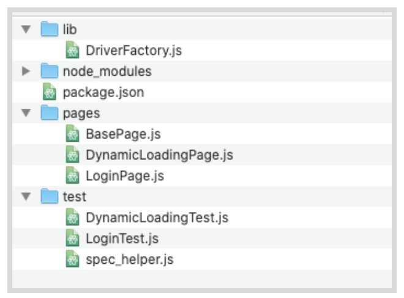
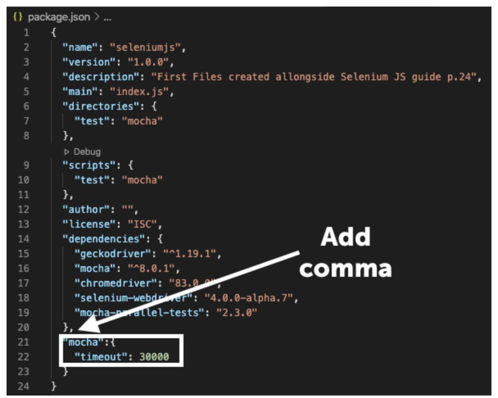
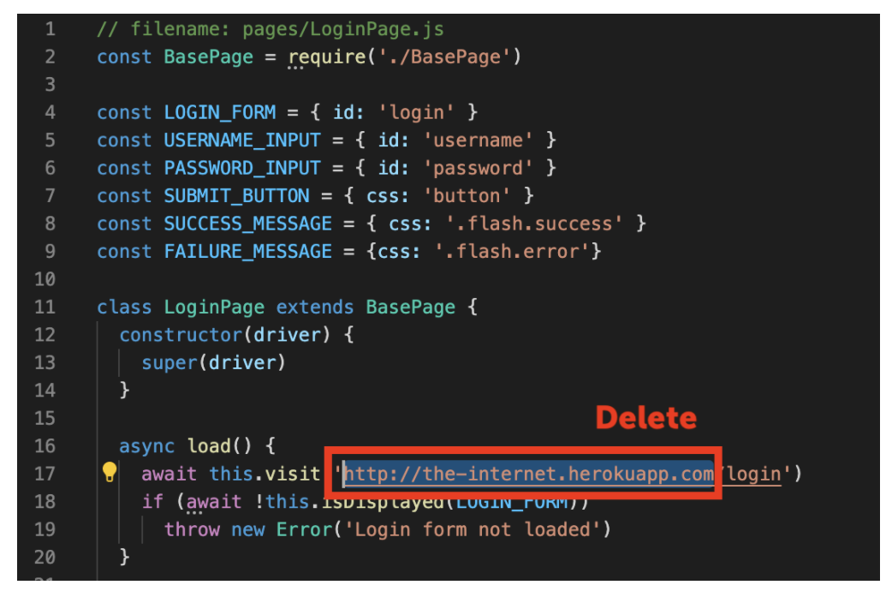
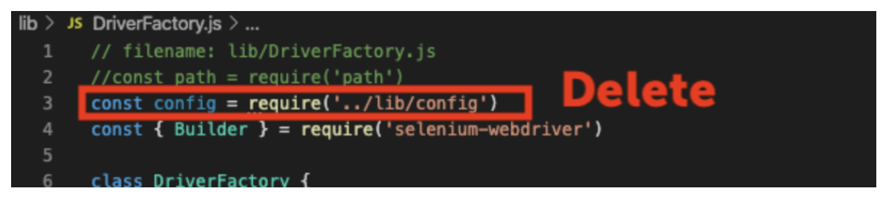
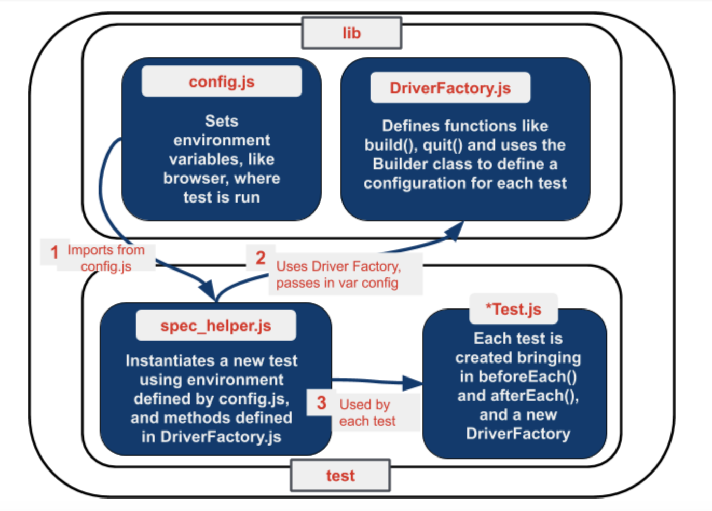
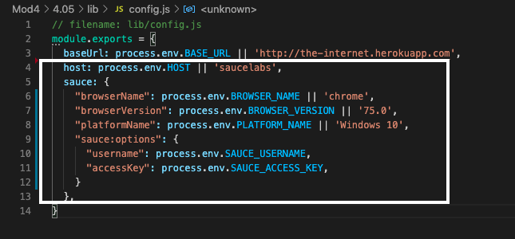
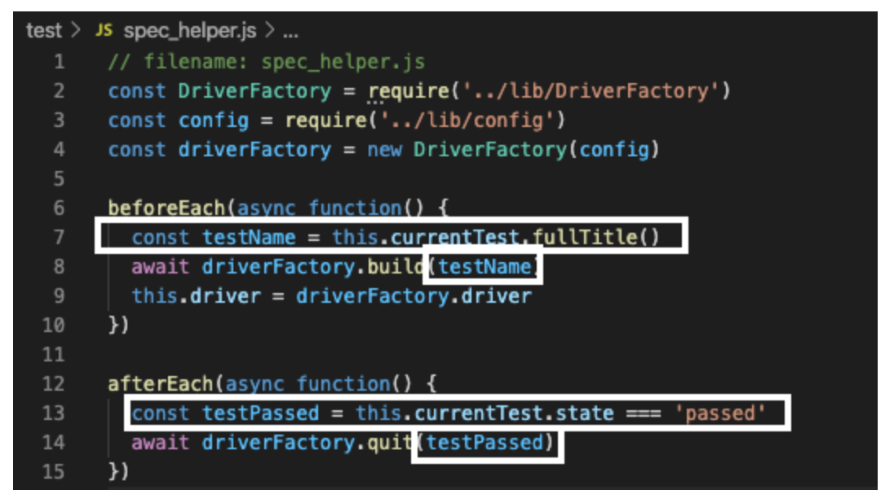

summary: Module 4 of the Selenium JavaScript course. Learn to write Selenium tests in the JavaScript programming language with Mocha.
id: Module4-SeleniumJS
categories: advanced
tags: javascript
environments: Web
status: Published
feedback link: https://forms.gle/CGu4QchgBxxWnNJK8
analytics account: UA-86110990-1
author:Lindsay Walker
<!-- ------------------------ -->
# Module 4 – Run Selenium JavaScript Tests on Sauce Labs
<!-- ------------------------ -->

## 4.01 What You’ll Learn
Duration: 0:02:00

This module is derived from content in chapters 11-13 of _The Selenium Guidebook_ _JavaScript Edition_ By Dave Haeffner._ _This module guides you through creating a separate `spec_helper` file where the root level `beforeEach() `and` afterEach()` hooks will live for each test, as well as a _Driver Factory _which creates the `build()` and `quit()` functions used for each instance of a test.  Users will work through creating a config file to store the environment variables for where (in which environment) your test is run on, and modify the DriverFactory to check & pull environment variables from config. Last but not least, add in some features to make your tests results easier to read and debug using the Sauce Labs platform


### Objectives


* Analyze and plan test suites, learning how to balance the size and maintainability (ability to check failed tests) against the amount of features you want to test, as well as the level of abstraction you want to use to make modular objects to use in your test suite
* Learn about the different categories and types of tests. Understand which types of functional tests one uses Selenium for and how the different types and categories of tests are related
*   Learn about Root Level Hooks that handle the universal methods `beforeEach() `and `afterEach() `that all tests use, and that you can separate the common functionality that all test use with these methods in a separate file (such as `spec_helper.js`) to be used with each test.
*   Understand how to create a file that configures a test environment, and how it is used with a _Driver Factory_ from a file such as `spec_helper.js` to create a template that each test is built off of.
*   Identify and fix problems in test suites such as poor locators, silent failures, and too much functionality in a single class
*   Choose and separate imperative language into separate objects and pages, and use the simplified commands created in that class with other tests to write code that is easier to read, maintain, and declarative in nature
*   Create a_ Driver Factory _that creates all of the `build()` and` quit() `functionality each test uses
*   Create a `spec_helper.js` file that uses the _Driver Factory_ and works to set up each test, allowing tests to use the _Driver Factory _and a config file that specifies where and on which environment tests are run   
*   Set up a `baseURL` variable in `config.js` that points to the app you are running tests on in the BasePage, and remove hard-coded URLs from other page objects, allowing you to specify just a sub-domain from page objects
*   Update your Sauce Labs credentials on your machine, then add functionality in your config file, using the sauce object in `config.js`, to run your tests on Sauce Labs with the _Driver Factory_.

<!-- ------------------------ -->

## 4.02 Types of Tests
Duration: 0:05:00

In testing, both automated and manual, there are several different types of tests. Not all types of tests are mutually exclusive. For example, when doing regression testing, you may use unit tests, and unit tests can be used as a piece for an integration test.


### Functional vs Non-Functional Tests

These two types of tests are ways to categorize tests by what they are testing. Functional tests check to see if a feature is or is not working, nothing more (e.g. did I log in or not log in?). Non-functional testing typically gives a value or amount that helps engineering and product teams do **performance testing** and understand and predict whether the software and features will work as expected, at scale. An example would be load testing, to see if the test runs as expected with many simultaneous users or volume testing.  [Sauce Labs](https://accounts.saucelabs.com/am/XUI/#login/?utm_source=referral&utm_medium=LMS&utm_campaign=link)   does front-end functional testing, as well as non-functional testing.


Source [imgur](https://imgur.com/Ksjm2D3)

Selenium is most used for functional testing  Types of functional tests include unit testing, UI testing, regression testing, integration testing, and more.


### Unit Tests

Unit tests are the smallest, simplest possible type of a test you can do. They test one single action on one single page/ application, and nothing more. Often these tests are written and executed on your local machine to validate that each ‘piece’ of a more complex test works.

The typical structure for a unit test is


1. Set up the test data. (Given “x” condition”.)
2. Call the class you are testing (When “y” behavior happens.)
3. Assert that the expected results are returned. (Then “z” expected change is returned.)


### Integration Tests (Service Tests)

Much of the time, when you write test code, it’s not just one application you are testing, but many. As an example, if you were to sign up for Netflix, you would have to sign up on their website, send and receive information from their user management software (store user information to a database), as well as send and receive information from the software that processes their payments. Integration tests if and how these different services function together as a whole.

Many times integration tests can be formed from groups of unit tests. You can think of an integration as combining API tests with unit and UI tests to test how the entire service works.


### UI Tests

A UI Test is a test of the visual interface a human user would interact with. Selenium is very well suited to these kinds of tasks.  You can test the layout and behavior of a test easily, as well as track the usability of user flows. Many times the UI test can give insight into how well a test is functioning. As an example, if you see an ‘error message’ in the UI when you log in, you can tell that something went wrong when trying to submit the username and password for authentication.


### Regression Tests

A specific set of tests that verify that the changes being made (features) don’t break your application. Integration is more of a methodology than a specific way to write a test. These tests can include unit and integration tests, but the difference here is this set of tests is created with the purpose of checking to make sure a change doesn’t break the application.


### End-to-End Tests

Similar to system testing,can include just follow a users’ workflow in a visual interface, or include everything that occurs in an application environment, doing a situation that mimics real-world use. This includes actions such as interacting with a database, using network communications, or interacting with other hardware, applications, or systems if appropriate along a specific user flow.


### Black Box vs. White Box Testing

White Box testing is a type of testing you do when you can see and understand all of the inner workings of an application and it’s source code. Black Box testing is testing that is done from the end-user perspective, without any knowledge of the internal structure of application code. A good example of this is testing a workflow on the user interface of a web application. It is reasonable to assume for a login test, that if you put the correct username and password, click submit, then get access to the platform that the code for making this happen on the back end is also working.


### [Headless Testing](https://saucelabs.com/blog/headless-browser-testing-101)

This type of testing refers to a code-based approach to testing web applications. When a human user is manually testing an application, they are looking at the visual browser interface with items you can see, click, and interact with. Headless testing is done by a robot that doesn’t use the visual component of a browser, and instead does all interactions through communication with the codebase and other services that make up an application. [Sauce Labs](https://accounts.saucelabs.com/am/XUI/#login/?utm_source=referral&utm_medium=LMS&utm_campaign=link) also provides headless user testing.


## 4.03 Scaling Your Tests
Duration: 0:16:00

Now that we have some tests and page objects, we'll want to start thinking about how to structure our test code to be more flexible. Ensuring that our code is reusable, and can scale to as many tests as we need requires some additional elements & abstractions.


### Part 1: Global Setup & Teardown

We'll start by using a separate class for Selenium setup and teardown out of our tests, placing the file in a central directory.

We'll create three things.


*   A class that will contain the creation and destruction of our Selenium instances (known as a _Driver Factory_)
*   A helper that all tests will pull from to do the basic things each test should do such as `build()` and `quit()`
*   Change a configuration in `package.json` to set the automatic timeout for a longer duration.

Create a new directory called `lib`. In the `lib `directory we'll create a new file called `DriverFactory.js`, and in the `test` directory we'll create a file called `spec_helper.js`.




### NOTE

If you want to use terminal to set this up, simply type (from your project directory):


```
mkdir lib
cd lib
touch DriverFactory.js
cd ..
cd test
Touch spec_helper.js
```


--

Open `DriverFactory.js` in your IDE and paste in the following:


```
// filename: lib/DriverFactory.js
// const path = require('path')
const { Builder } = require('selenium-webdriver')

class DriverFactory {
  async build() {
    //process.env.PATH += path.delimiter + path.join(__dirname, '..',   
    'vendor')
    this.driver = await new Builder().forBrowser('firefox').build()
  }

  async quit() {
    await this.driver.quit()
  }
}

module.exports = DriverFactory

```


After adding our requisite libraries, we declare a class along with two methods; `build()`, and `quit()`.` build()` is responsible for spinning up an instance of Selenium each time it is called by a test or page class, and quit is responsible for closing out that Selenium instance once the class has finished it’s interactions or tests.

The class ends with `module.exports`, so that other classes can call and use the methods defined here.

Next, open the `spec_helper.js` file in the test folder and paste in the following:


```
// filename: test/spec_helper.js
const DriverFactory = require('../lib/DriverFactory')
const driverFactory = new DriverFactory()

beforeEach(async function() {
  await driverFactory.build()
  this.driver = driverFactory.driver
})

afterEach(async function() {
  await driverFactory.quit()
})
```


Finally, update your `package.json` file. This allows you to change settings for mocha, in this case setting the default timeout to 30 seconds. This way a test will be given 30 seconds to run, then will quit (timeout).

After the last object, add a comma at the end of the curly braces, and put this inside of the final closing curly braces.


```
// filename: package.json
//...

    },
    "mocha":{
        "timeout": 30000
    }
}
```


#### NOTE

Including the `quit() `function is extremely important for the speed & passability of your tests. Without the quit method, the test will keep running even once all other methods have been executed until the default timeout has expired. This will not only slow down your ability to run many parallel tests at once, it will also send timeout error messages that could abort the test build.  Configuring timeouts appropriately in the package.json file is important to ensure that all tests run correctly the first time and are returning valuable feedback.

--


### Root Level Hooks

In Mocha, when you specify before and after hooks outside of a test class they are used globally for all tests. These are referred to as root-level hooks. Every test that you write will use the `BeforeEach()` and `AfterEach() `methods to perform the same set of actions to set up and tear down the test, so it makes sense to store these in one place so we can make changes in one place, instead of within each and every test.

At the top of `spec_helper.js` we require `DriverFactory` and create a new instance of it, storing it in a variable.

In `beforeEach()` we create a driver instance and store it in a variable on this. (which will make it accessible when we use it).

In `afterEach() `we call the quit method in the Driver Factory to destroy the Selenium instance.

Since we now have the `build()` method, and `driver` from `beforeEach()` in `spec_helper.js`, and everything we need from the `afterEach()` method also defined, we can pare down the code in our test classes.

First at the top of both `LoginTest.js `and` DynamicLoadingTest.js`, add at the very top:


```
// filename: test/LoginTest.js & filename test/DynamicLoadingTest.js
require('./spec_helper')
...
```


Then, from each test (`DynamicLoadingTest.js` and` LoginTest.js`)** delete or comment out** the following:

The `{Builder} `for Selenium Webdriver for both:


```
// filename: test/LoginTest.js & // filename: LoginTest.js
//...
//const { Builder } = require('selenium-webdriver')
```


The driver instantiation in `LoginPage.js `within the `beforeEach()` method:


```
//let driver
```


The driver creation `timeout `as part of the describe function:


```
//this.timeout(30000)
```


The` vendorDirectory` variable and the `driver` instantiation inside the `BeforeEach()` method in:


```
// filename: test/DynamicLoadingTest.js
...
//const vendorDirectory =
      // path.delimiter + path.join(__dirname, '..', 'vendor')
      // process.env.PATH += vendorDirectory
      //driver = await new Builder().forBrowser('firefox').build()

```


```
// filename: test/LoginTest.js
// ...
//driver = await new Builder().forBrowser('firefox').build()
```


The entire `afterEach()` method as everything you need was created in `DriverFactory.js.`


```
 // afterEach(async function() {
  //   await driver.quit()
// })
```


Finally, update the login and dynamicLoading variables on your test pages in the `beforeEach() `function using the `this. `method to inherit from the accompanying page object.


```
// filename: test/LoginTest.js
//...

  beforeEach(async function() {
    login = new LoginPage(this.driver)
    await login.load()
   })
// ...

```


```
// filename: test/DynamicLoadingTest.js
//...

  beforeEach(async function() {
    dynamicLoading = new DynamicLoadingPage(this.driver)
})
//...
```


See the complete [source code here](https://github.com/walkerlj0/Selenium_Course_Example_Code/tree/master/javascript/Mod4/4.03). Note that you have to run `npm install` in the root project folder before being able to use code pulled down from a repository.


#### Final Code

The two test classes should now look like this:





## 4.04 Running Tests in Different Browsers
Duration: 0:15:00


### Review- Abstraction and Non-Duplication

Thus far we have prepared our test suite well to be reusable. When you have things like the setup and teardown used for all tests in one place, making changes to this becomes a lot easier. Not duplicating (re-writing the same) code and abstracting into files like the driver factory, spec helper, and base page mean that you won’t have to re-write that code each time you write a new page or test object, or go make changes to all those files when you need to modify something.


#### Video

Watch the video [4.04 Non-Duplication](https://youtu.be/HY8-ikAviFo) an excerpt from [Sauce Labs’ Tech Talk](https://www.youtube.com/watch?v=ZLS9sU2A9QA&t=24s) by Nikolay Advolodkin

<video id="HY8-ikAviFo"></video>


### Creating a Config File

The config file is an important part of any test suite. This file will specify things for your tests like what web address you test uses to perform the test, what browser it uses, and later on, will store methods for logging into the Sauce Labs grid, as well as instructions as to which environment you should run your tests in.

The whole point of setting up a test suite is that you can run your tests against different environments (e.g., localhost, test, staging, production, etc.).

So let's make it so you can specify a different base URL for our tests at runtime.

First, create a file called `config.js` in the `lib` directory. You can use these commands from the project directory in your terminal:


```
cd lib
touch config.js
```

Your file directory should look like this:


### Create a baseURL

Next, what we will do is create a separate file for setting the url that your test will run against, so you can change it easily for say, testing in development and productiong, and store it in a variable called baseURL.

Open `config.js` with your IDE and paste in the following:


```
// filename: lib/config.js
module.exports = {
  baseUrl: process.env.BASE_URL || 'http://the-internet.herokuapp.com'
};
```


Next, find the` visit()` function in the `BasePage `class. You will delete what is in there (`await this.driver.get(url)`) and add in the following:


```
// filename: pages/BasePage.js
//...
async function visit(url) {
  if (url.startsWith('http')) {
    await this.driver.get(url)
  } else {
    await this.driver.get(config.baseUrl + url)
  }
}
```


This looks for the ‘http’ characters to detect if a valid URL for a website can be passed in (one can reasonably assume all web addresses start with that. Otherwise, the base URL will be the one we are writing these tests for, which you just entered in `config.js`, ‘[http://the-internet.herokuapp.com](http://the-internet.herokuapp.com)'.


### Remove URLs from Page Objects

In order to use our new `config` file, add in the following at the top of your base page, it will apply to all other page objects:


```
// filename: pages/BasePage.js
const config = require('../lib/config.js')
//...
```


Now you need to go into the page objects (`BasePage.js` and `DynamicLoadingPage.js`) and take out the hard-coded URL inside the `visit() `method. Instead we will only have the sub-pages that will append on to the baseURL from the-internet [heroku app](https://the-internet.herokuapp.com/).


```
// filename: pages/LoginPage.js
// ...
  async load() {
    await this.visit('/login')
// ...

```


```
// filename: pages/DynamicLoadingPage.js
// ...
    await this.visit('/dynamic_loading/' + exampleNumber)

// ...
```


Now when running our tests, we can specify a different base URL in `config.js` by providing some extra information at run-time, setting the variable `BASE_URL=url mocha`. Now we’re in a better position now with our setup and teardown abstracted into a central location.

Now we can easily extend our test framework to run our tests on other browsers.


#### Final Code

Your new code should look like this:





### Running Different Browsers Locally

WebDriver works with each of the major browsers through a browser driver which is (ideally but not always) maintained by the browser creator such as Chrome or Firefox. It is an executable file (consider it a thin layer) that acts as a bridge between Selenium and the browser.

By using `npm` with the `package.json` file, the updated version will be fetched for you without manual install and setting of the PATH variable. If you don’t use `npm`, you need to manually install each driver and update the path


### Running Tests in Different Browsers

The first thing we will do is set the browser with the `BROWSER `variable inside `module.exports` in  `lib/Config.js` for the browser, that will be passed into `DriverFactory.js` (which is in turn used in `spec_helper` and your test objects such as `Logintest.js`). Make sure there is a comma after the` BASE_URL `variable declaration.


```
// filename: lib/config.js
module.exports = {
  baseUrl: process.env.BASE_URL || 'http://the-internet.herokuapp.com',
  browser: process.env.BROWSER || 'firefox',
}
```


Go into `spec_helper.js` and require the `config` file, then pass it into `DriverFactory.js` each time a new `driverFactory `instance is created.


```
// filename: test/spec_helper.js
const DriverFactory = require('../lib/DriverFactory')
const config = require('../lib/config.js')
const driverFactory = new DriverFactory(config)

```


Now, go into `DriverFactory.js.` We are going to use the `config` variable passed into DriverFactory each time a new instance is created. We will create a` constructor` to construct a new config instance for the test. Next, update the `build()` method so that the browser isn’t hard coded in, and can take the variable from config.js.


```
// filename: lib/DriverFactory.js
//...
class DriverFactory {
  constructor(config) {
    this.config = config
  }

  async build() {
    //process.env.PATH += path.delimiter + path.join(__dirname, '..', 'vendor')
    this.driver = await new Builder().forBrowser(this.config.browser).build()
  }

//...
```


Run your code with `npm test`, and you should see your tests working when you enter either ‘chrome’ or ‘firefox in config.js. Complete course code can be found [here](https://github.com/walkerlj0/Selenium_Course_Example_Code/tree/master/javascript/Mod4/4.04).


#### Final Code

The new code should look like this:





#### Quiz


## 4.05  Testing on Sauce Labs
Duration: 0:15:00

In this lesson you are going to learn how to move the test suite that you have written from your local machine onto the [Sauce Labs](https://accounts.saucelabs.com/am/XUI/#login/?utm_source=referral&utm_medium=LMS&utm_campaign=link) cloud provider. They maintain a set of real and virtual devices, as well as a Selenium grid that you can use to run your test in almost any environment. There are many reasons this is advantageous:


*   You can use virtual machines (without having to set it up on your own machine)
    *   To test older versions of operating systems
    *   Test browsers that only run on older operating systems.
*   You don’t have to provision all the different kinds of virtual machines you will need yourself.
*   You don’t have to set up and maintain the Selenium Grid that will coordinate the test across all of these different machines.


### Update Config

We are going to use the `config.js` file that you used earlier to set up the the capabilities. [Capabilities](https://wiki.saucelabs.com/display/DOCS/W3C+Capabilities+Support) are a way of communicating information to other services, such as Sauce Labs, that you need to covey in order to run your Tests.

Open `config.js` and update it to look like the following:


```
// filename: lib/config.js
module.exports = {
  baseUrl: process.env.BASE_URL || 'http://the-internet.herokuapp.com',
  host: process.env.HOST || 'saucelabs',
  sauce: {
    "browserName": process.env.BROWSER_NAME || 'chrome',
    "browserVersion": process.env.BROWSER_VERSION || '75.0',
    "platformName": process.env.PLATFORM_NAME || 'Windows 10',
    "sauce:options": {
      "username": process.env.SAUCE_USERNAME,
      "accessKey": process.env.SAUCE_ACCESS_KEY,
    }
  },
}
```


Notice the new variables you have added:


*   `host `enables us to specify whether our tests run locally or on Sauce Labs. The others are stored under a key sauce key to make their use explicit.
*   The `sauce` object contains the information for each specific test. We assume you may pass in unique usernames and access keys
    *   `username` is the username you have created for Sauce Labs
    *   `accessKey` is generated (and can be regenerated) in your user settings
    * `platformName` specifies the operating system for a test.  
 * `sauce:options` contain capabilities with options for information you can pass to Sauce Labs
      * `browserName` specifies the browser for a test.
      * `browserVersion` specifies which version of the browser for a test


### Setting up your Sauce Labs Account

You'll need an account to use Sauce Labs. Their [free trial](https://accounts.saucelabs.com/am/XUI/#login/?utm_source=referral&utm_medium=LMS&utm_campaign=link) offers enough to get you started. And if you're signing up because you want to test an open source project, then be sure to check out their [Open Sauce account](https://saucelabs.com/open-source).

Visit [http://app.saucelabs.com/](https://accounts.saucelabs.com/am/XUI/#login/?utm_source=referral&utm_medium=LMS&utm_campaign=link). You can create a free trial account if you haven’t been assigned one.


Go to **Account > User Settings** to find your username and access key.


You will need to set up your username and access key on your machine’s environment variables either in your bash profile (Mac/Linux) or in the system properties (Windows).

To learn more about setting up environment variables, you can see the article [here](https://wiki.saucelabs.com/display/DOCS/Best+Practice%3A+Use+Environment+Variables+for+Authentication+Credentials#BestPractice:UseEnvironmentVariablesforAuthenticationCredentials-SettingUpEnvironmentVariablesonMacOSX/LinuxSystems).


#### Video

Watch This Video to See how to set up your [Sauce Credentials](https://www.youtube.com/watch?v=3K1Eu0eTha8) as environment variables on MacOS

<video id="3K1Eu0eTha8"></video>


### Set a Source for Sauce Credentials

If you get a failing test such as this, Sauce Labs doesn’t know to look at the updated SAUCE_USERNAME and SAUCE_ACCESS_KEY that you put in your .bash_profile. (First make sure `npm` is correctly installed as well)


You can tell your machine (Mac only)  to look for the correct credentials and type in your terminal:


```
source ~/.bash_profile
```


Now, when you run a program it will have the updated username and access key. !IMPORTANT you need to do this with any new project file you create, and also any time you update your bash profile.


### Update DriverFactory

Now we can update DriverFactory.js to work with these new values and connect to [Sauce Labs](https://accounts.saucelabs.com/am/XUI/#login/?utm_source=referral&utm_medium=LMS&utm_campaign=link).


```
// filename: lib/DriverFactory.js
// ...
class DriverFactory {
  constructor(config) {
    this.config = config
  }

  _configure() {
    let builder = new Builder()
    switch (this.config.host) {
      case 'saucelabs':
        const url = 'https://ondemand.saucelabs.com/wd/hub'
        builder.usingServer(url)
        builder.withCapabilities(this.config.sauce)
        break
      case 'localhost':
        // process.env.PATH +=
          // path.delimiter + path.join(__dirname, '..', 'vendor')
        builder.forBrowser(this.config.browser)
        break
    }
    return builder
  }
// ...
```


Inside of DriverFactory we will also change the build method to use the new private method _configure.


```
// filename: lib/DriverFactory.js
//...
     async build() {
       this.driver = await this._configure().build()
}
// ...
```


We create a method to configure the builder object for Selenium, `_configure()`, wrapping everything in a conditional check against `config.host`. If it's set to `'saucelabs'` then we specify the `url` for their on-demand end-point and pass in the capabilities that we want (e.g., everything specified under `sauce` in config.js). If `config.host` is set to `'localhost'` then we handle browser execution just like before (adding the path to the vendor directory to the execution path and launching a browser locally).


#### NOTE

In JavaScript, functions or methods prefixed with a _ are intended to be private. This means that the` _config(`) function can only be used inside of the `DriverFactory {}` class. In this case it is only used by `build()`, and can’t be used once the `DriverFactory {} `instance has finished running.

--


### Update Timeout

Now that you are running tests on the Sauce Labs platform, you may notice that they are taking longer. We will go in and update the timeout in the package.json file to 60000 (60 seconds) from 30000 so each of your tests has a minute to run before they are timed out.


```
// filename: package.json

"mocha": {
    "timeout": 60000
  }
// ...
```


Now when you run `npm test`, you should see a confirmation that your test ran. It should have taken longer than it did on your local machine. Remember to set the `source ~/.bash_profile` for your project folder if you have made any changes.


You should also visit [http://app.saucelabs.com/](http://app.saucelabs.com/). Go to the left hand menu and choose **Automated → Test Results**. There you will see your tests with icons indicating they were run on the operating system & browser that you chose:


### NOTE

What did we do? At this point to create an instance of a test, you are dependent on several different objects in your test suite. The `config.js` file and `DriverFactory.js` are pulled in each time by spec_helper.js. When one of your tests is run (`LoginTest` or `DynamicLoadingTest)` they use spec_helper to help build that test, which in turn instantiates DriverFactory for each test.



--

Complete course code can be found [here](https://github.com/walkerlj0/Selenium_Course_Example_Code/tree/master/javascript/Mod4/4.05).


#### Final Code

Your final code will look like this:




## 4.06  Setup for Sauce Labs Reporting
Duration: 0:12:00

In this lesson you will add in some elements for better reporting to understand the status of test run on the[ Sauce Labs automated web testing platform](https://accounts.saucelabs.com/am/XUI/#login/?utm_source=referral&utm_medium=LMS&utm_campaign=link).

Now that your tests are up and running on the Sauce Labs platform, you’ll notice it’s hard to tell one apart from the other. The tests you should have run will show up as **Unnamed job** with a hash identifier- not easy to use for testing and debugging.


To fix this issue, you can pull in the name and the status from the test and send it to the [Sauce Labs dashboard ](https://accounts.saucelabs.com/am/XUI/#login/?utm_source=referral&utm_medium=LMS&utm_campaign=link)so we can use our tests to effectively debug and improve our application.

In addition, right now regardless of the outcome of a test, the job in Sauce Labs will register as **Finished.** Ideally we want to know if the job was a **Pass** or a **Fail**. That way we can tell at a glance if a test failed or not. With a couple of tweaks we can make this happen easily enough.


### Add a Test Name

It's great that our tests are running on Sauce Labs. But we're not done yet because the test name in each Sauce job is getting set to an unnamed job. This makes it extremely challenging to know what tests were run in each job. To remedy this we'll need to pass the test name to Sauce Labs.

Given the order of operations of our test code, we only have access to the test name after the test has completed. So we'll account for this in both the quit method of our driver factory and the global `afterEach() `in our Base Test. Let's start with the driver factory first.


```
// filename: lib/DriverFactory.js
  async build(testName) {
		this.testName = testName
    this.driver = await this._configure().build()
  }
// ...
  async quit() {
    if (this.config.host === 'saucelabs') {
      this.driver.executeScript('sauce:job-name=' + this.testName)
    }
    await this.driver.quit()
  }
}
module.exports = DriverFactory
```


We need to add the parameter `testName `to the `build()` method so it will receive a testName and store it for later use.

With Selenium we have access to execute JavaScript directly in the browser session. When executing tests in Sauce Labs we have access to pass information to them about the current job through JavaScript calls. We take advantage of this fact by specifying the name of the job for the session. We only want this to happen when our tests are executing in Sauce Labs, so we wrap this in a conditional check.

Now to update our `spec_helper.js` to pass the testName.


```
// filename: test/spec_helper.js
// ...
beforeEach(async function() {
	const testName = this.currentTest.fullTitle()
  await driverFactory.build(testName)
  this.driver = driverFactory.driver
})
// ...

```


Run `npm test` to see if it works. (If you have a new project file, don’t forget to run s`ource ~/.bash_profile`).  Now when we run our tests in Sauce Labs, the [account dashboard](https://accounts.saucelabs.com/am/XUI/#login/?utm_source=referral&utm_medium=LMS&utm_campaign=link) will show the tests running with a name in the dashboard


### Add a Test Status

After adding a test name, we will add in an id and status for each unique test that you create. First, you will need to update our `build` method in the `DriverFactory.js `to grab the session ID from Selenium.


```
//filename lib/DriverFactory.js
//...
async build(testName) {
    this.testName = testName
    this.driver = await this._configure().build()
    const { id_ } = await this.driver.getSession()
    this.sessionId = id_
  }
//...
```


In `DriverFactory.js, `in the `quit() `function,  we are also going to add a parameter which will be passed to `spec_helper.js` when you call `DriverFactory`. Inside the {} brackets for the first ` if `statement in the `quit() `function that reports the name, add an `if `statement to see if the test has passed. This will send the job result as `testPased` if it does pass, and if it does not pass, it will direct you to the app to check to see where it failed.


```
// filename: lib/DriverFactory.js
// ...
  async quit(testPassed) {
    if (this.config.host === 'saucelabs') {
      this.driver.executeScript('sauce:job-name=' + this.testName)
      this.driver.executeScript('sauce:job-result=' + testPassed)
      if (!testPassed)
        console.log(
          'See a video of the run at https://saucelabs.com/tests/' +
            this.sessionId
        )
    }
    await this.driver.quit()
  }
}

module.exports = DriverFactory

```


Add in to `spec_helper.js `code that will check if the test has passed and pass the parameter so that we can tell Sauce labs that it has in fact passed.


```
afterEach(async function() {
  const testPassed = this.currentTest.state === 'passed'
  await driverFactory.quit(testPassed)
})
```


Now when you run `npm test` in terminal (if your test fails try `source ~/.bash_profile`), then check your [Sauce Labs dashboard](https://accounts.saucelabs.com/am/XUI/#login/?utm_source=referral&utm_medium=LMS&utm_campaign=link). On the left you should be able to see a status of passed with each test.


You can see an example of the completed code[ here.](https://github.com/walkerlj0/Selenium_Course_Example_Code/tree/master/javascript/Mod4/4.06)

#### Final Code




## 4.07 Quiz  
Duration: 0:05:00

**Quiz**


