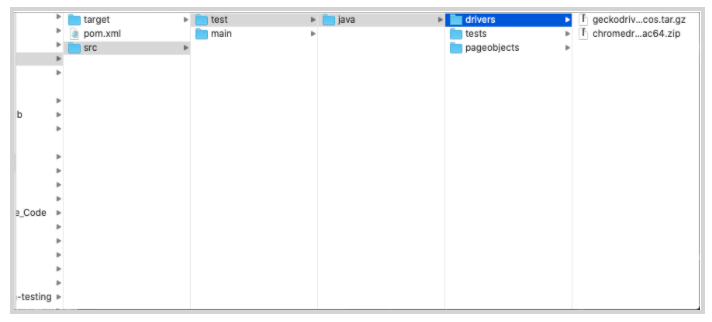
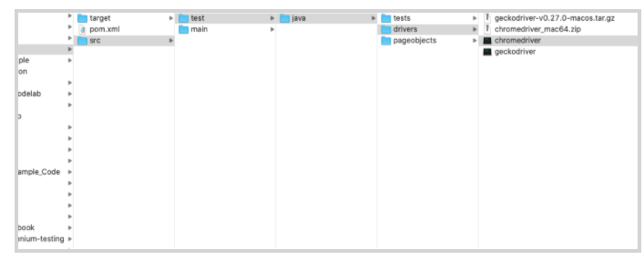
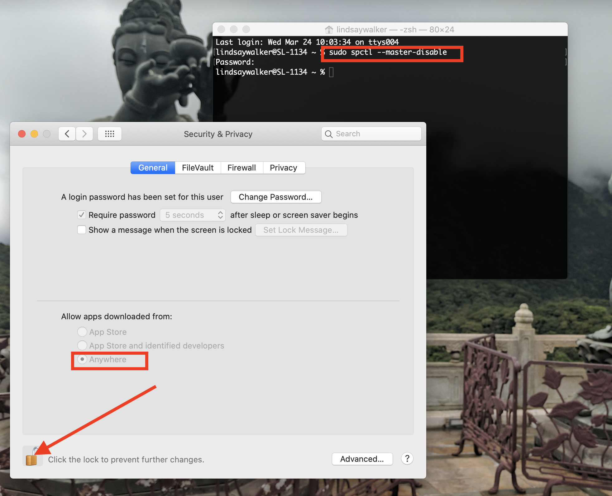
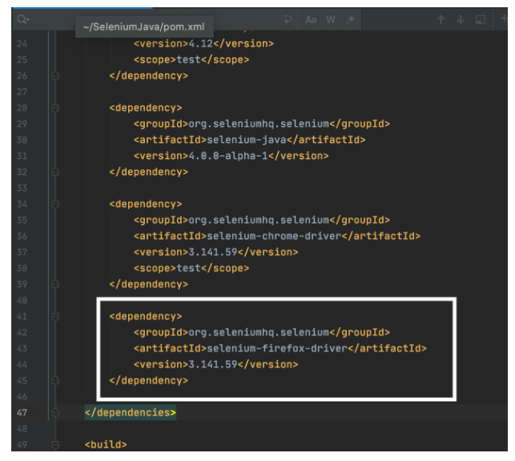
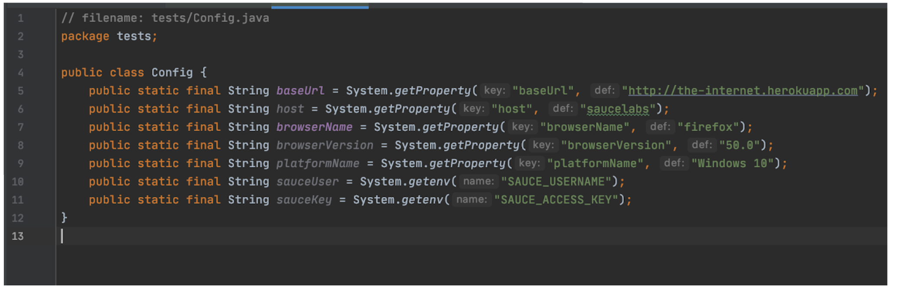
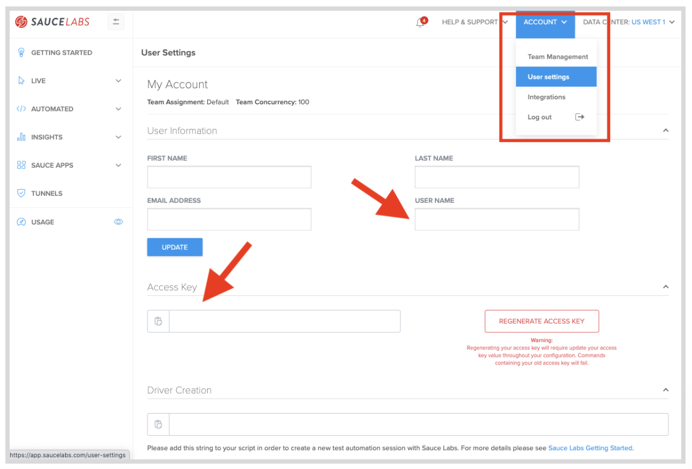
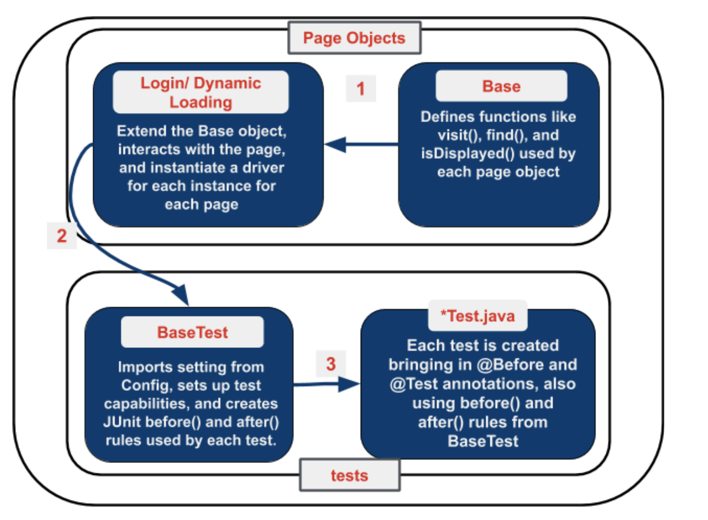
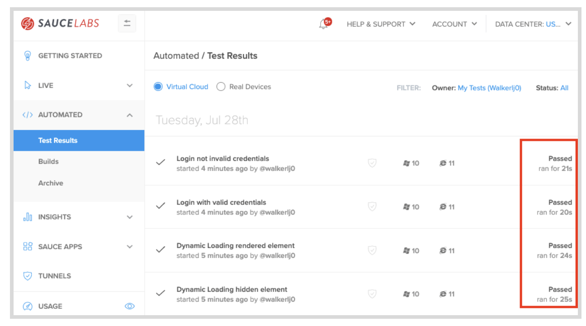

<!-- Copy this file into tools/site/coursenameFolder & start editing -->

summary: Module 4 of the Selenium Java Course. Learn to write Selenium tests in Java with Maven and JUnit.
id: Module4_SeleniumJava
categories: advanced
tags: java
environments: Web
status: Published
feedback link: https://forms.gle/CGu4QchgBxxWnNJK8
analytics account: UA-6735579-1
author: Lindsay Walker
<!-- ------------------------ -->
# Module 4 – Scaling Tests to the Cloud
<!-- ------------------------ -->
## 4.01 What You'll Learn
Duration: 0:03:00

This module is derived from content in chapters 11-13 of _The Selenium Guidebook_ _Java Edition_ By Dave Haeffner._ _This module guides you through creating a separate `BaseTest` file where the root level `before() `and` after()` hooks will live for each test, as well as a _Driver Factory _which creates the `build()` and `quit()` functions used for each instance of a test.  Users will work through creating a config file to store the environment variables specifying in which environment your test is run, and modify the base page to check & pull environment variables from config. Last but not least, add in some features to make your tests’ results easier to read and debug using the Sauce Labs platform.


### Objectives


*   ** **Analyze and plan test suites, learning how to balance the size and maintainability (ability to check failed tests) against the amount of features you want to test, as well as the level of abstraction you want to use to make modular objects to use in your test suite
*   Learn about the different categories and types of tests. Understand which types of functional tests one uses Selenium for and how the different types and categories of tests are related
*   Learn about _Root Level Hooks_ that handle the universal rules  `before() `and `after() `that all tests use, and that you can separate the common functionality that all tests use with these methods in a separate file (such as `BaseTest.java`) to be used with each test
*   Understand how to create a file that configures a test environment, and how it is used with `BaseTest` and` BasePage` objects to create a template from which each test is built
*   Identify and fix problems in test suites such as poor locators, silent failures, and too much functionality in a single class
*   Choose and separate imperative language into separate objects and pages, and use the simplified commands created in that class with other tests to write code that is easier to read, maintain, and declarative in nature
*   Create a <code><em>BaseTest </em></code>that creates all of the <code>before()</code> and<code> after() </code>functionality each test uses to spin up and tear down a test
*   Create a <code>Config</code> file that sets the W3C<em> capabilities </em>for <code>BaseTest</code> to set up the environment for each, which set up variables for the environment, that dictate what your test is run in.
*   Set up a <code>baseURL</code> variable in <code>Config</code> that points to the app you are running tests on in the <code>BasePage</code>, and remove hard-coded URLs from other page objects, allowing you to specify just a sub-domain from page objects
*   Update your Sauce Labs credentials on your machine, then add functionality in your config file, using the sauceOption capabilities to run your tests on Sauce Labs
*   Add variables and logic to your <code>BaseTest</code> to pass information such as the test name, and pass or failure status to the Sauce Labs dashboard

<!-- ------------------------ -->
## 4.02 Types of Tests
Duration: 0:05:00

In testing, both automated and manual, there are several different types of tests. Not all types of tests are mutually exclusive. For example, when doing regression testing, you may use unit tests, and unit tests can be used as a piece for an integration test.


### Functional vs Non-Functional Tests

These two types of tests are ways to categorize tests by what they are testing. Functional tests check to see if a feature is or is not working, nothing more (e.g. did I log in or not log in?). Non-functional testing typically helps measure how much and how well an application is performing, enabling **performance testing** that helps teams understand and predict whether the software and features will work as expected, at scale. An example would be load testing, to see if the test runs as expected with many simultaneous users or volume testing.  [Sauce Labs ](https://accounts.saucelabs.com/am/XUI/#login/?utm_source=referral&utm_medium=LMS&utm_campaign=link)  does front-end functional testing, as well as non-functional testing.


Source [imgur](https://imgur.com/Ksjm2D3)

Selenium is most used for functional testing using a browser. Types of functional tests include unit testing, UI testing, regression testing, integration testing, and more.


### Unit Tests

Unit tests are the smallest, simplest possible type of test you can do. They test one single action on one single page/ application, and nothing more. Often these tests are written and executed on your local machine to validate that each ‘piece’ of a more complex test works.

The typical structure for a unit test is:


1. Set up the test data. (Given “x” condition”.)
2. Call the class you are testing. (When “y” behavior happens.)
3. Assert that the expected results are returned. (Then “z” expected change is returned.)


### Integration Tests (Service Tests)

Much of the time, when you write test code, it’s not just one application you are testing, but many. As an example, if you were to sign up for Netflix, you would have to sign up on their website, send and receive information from their user management software (store user information to a database), as well as send and receive information from the software that processes their payments. Integration tests if and how these different services function together as a whole.

Many times integration tests can be formed from groups of unit tests. You can think of an integration as combining API tests with unit and UI tests to test how the entire service works.


### UI Tests

A UI Test is a test of the visual interface a human user would interact with. Selenium is very well suited to these kinds of tasks.  You can test the layout and behavior of a test easily, as well as track the usability of user flows. Many times the UI test can give insight into if an app is functioning on other layers. As an example, if you see an ‘error message’ in the UI when you log in, you can tell that something went wrong when trying to submit the username and password for authentication.


### Regression Tests

A specific set of tests that verify that the changes being made (new features) don’t break your application. Regression testing is more of a methodology than a specific way to write a test. These tests can include unit and integration tests, but the difference here is this set of tests is created with the purpose of checking to make sure a change doesn’t break the application.


### End-to-End Tests

Similar to system testing, E2E tests can include just following a user’s workflow in a visual interface, or include everything that occurs in an application environment, creating a situation that mimics real-world use. This includes actions such as interacting with a database, using network communications, or interacting with other hardware, applications, or systems if appropriate along a specific user flow.


### Black Box vs. White Box Testing

White Box testing is a type of testing you do when you can see and understand all of the inner workings of an application and it’s source code. Black Box testing is testing that is done from the end-user perspective, without any knowledge of the internal structure of application code. A good example of this is testing a workflow on the user interface of a web application. It is reasonable to assume for a login test, that if you enter the correct username and password, click submit, then get access to the platform, that the code for making this happen on the back end is also working.


### [Headless Testing](https://saucelabs.com/blog/headless-browser-testing-101)

This type of testing refers to a code-based approach to testing web applications. When a human user is manually testing an application, they are looking at the visual browser interface with items you can see, click, and interact with. Headless testing is done by a robot that doesn’t use the visual component of a browser, and instead does all interactions through communication with the codebase and other services that make up an application. [Sauce Labs ](https://accounts.saucelabs.com/am/XUI/#login/?utm_source=referral&utm_medium=LMS&utm_campaign=link) also provides headless user testing.

<!-- ------------------------ -->
## 4.03 Scaling Your Tests
Duration: 0:20:00

Now that you have some tests and page objects, we'll want to start thinking about how to structure our test code to be more flexible and maintainable. Ensuring that our code is reusable, and can scale to as many tests as you need, requires some additional elements & abstractions.

In a test suite, when you specify before and after hooks outside of a test class they are used globally for all tests. These are referred to as_ root-level hooks_. Every test that you write will use the `before()` and` after() `methods to perform the same set of actions to set up and tear down the test, so it makes sense to store these in one place so you can make changes in one place, instead of within each and every test.


### Part 1: Root Level Hooks

We'll start by using a separate class for Selenium setup and teardown out of our tests, placing the file in a central directory.

We'll create three things.


*   A class that will contain the creation and destruction of our Selenium instances (known as a _Base Test_)
*   A helper that all tests will pull from to do the basic things each test should do such as `before()` and `after() `from the Junit `ExternalResource` rul`e`
    *   These will be annotated with` @Override `which will execute prior to the` @Before` and` @After `annotations in individual tests
*   Update your login and dynamic loading tests to inherit from the base class and utilize the setup and teardown from within the base class

Create a new class in the tests project names BaseTest.java.


Open` BaseTest.java `in your IDE and paste in the following:


```
// filename: tests/BaseTest.java
package tests;

import org.junit.Rule;
import org.junit.rules.ExternalResource;
import org.openqa.selenium.WebDriver;
import org.openqa.selenium.chrome.ChromeDriver;
import org.openqa.selenium.chrome.ChromeOptions;


public class BaseTest {

    protected WebDriver driver;

    @Rule
    public ExternalResource resource = new ExternalResource() {

        @Override
        protected void before() throws Exception {
            System.setProperty("webdriver.chrome.driver", "/Users/lindsaywalker/Documents/chromedriver");
        ChromeOptions browserOptions = new ChromeOptions();
        driver = new ChromeDriver();
        }

        @Override
        protected void after() {
            driver.quit();
        }

    };

}
```


Notice the new JUnit annotation called `@Rule` which contains the JUnit` ExternalResources` rule. This rule has `before()` and` after()` methods that are used inside the `@Override` annotations.

These methods are implemented instead of the `@Before `and `@After` annotations, which you need to save for use (they can only be used once per test) within our test objects. Learn more about JUnit [Rules here](https://github.com/junit-team/junit4/wiki/Rules).

Now you need to modify your test objects to inherit what you created in the `BaseTest `class. Inside `TestLogin.java`, you’ll get delete the following:


*   The `@After` annotation and the use of it, since the `quit()` method was all that was in there, and is now used taken care of `BaseTest.java`
*   Creation of the `Webdriver` instance
*   The instantiation of the` ChromeDriver` and the options

The new` TestLogin.java` file should only contain the following:


```
//filename: tests/TestLogin.java
package tests;

import org.junit.Before;
import org.junit.Test;
import org.openqa.selenium.WebDriver;
import pageobjects.Login;

import static org.junit.Assert.assertFalse;
import static org.junit.Assert.assertTrue;

public class TestLogin extends BaseTest {
    private WebDriver driver;
    private Login login;

    @Before
    public void setUp() {
        login = new Login(driver);
    }

    @Test
    public void succeeded() {
        login.with("tomsmith", "SuperSecretPassword!");
        assertTrue("success message not present",
                login.successMessagePresent());
    }
    @Test
    public void failed() {
        login.with("tomsmith", "bad password");
        assertTrue("failure message wasn't present after providing bogus credentials",
                login.failureMessagePresent());
    }

    @Test
    public void failed2() {
        login.with("tomsmith", "bad password");
        assertFalse("success message was present after providing bogus credentials",
                login.successMessagePresent());
    }
}

```


Next, you will make similar changes to `TestDynamicLoading.java`. First,  delete the following:


*   The `@After` annotation and the use of it, since the `quit()` method is now taken care of in `BaseTest.java`
*   Creation of the Webdriver instance
*   The instantiation of the` ChromeDriver` and the options

The new `TestDynamicLoading.java `file should only contain the following:


```
// filename: tests/TestDynamicLoading.java
package tests;

import org.junit.Before;
import org.junit.Test;
import pageobjects.DynamicLoading;

import static org.junit.Assert.assertTrue;

public class TestDynamicLoading extends BaseTest {

    private DynamicLoading dynamicLoading;

    @Before
    public void setUp() {
        dynamicLoading = new DynamicLoading(driver);
    }

    @Test
    public void hiddenElementLoads() {
        dynamicLoading.loadExample("1");
        assertTrue("finish text didn't display after loading",
                dynamicLoading.finishTextPresent());
    }

    @Test
    public void elementAppears() {
        dynamicLoading.loadExample("2");
        assertTrue("finish text didn't render after loading",
                dynamicLoading.finishTextPresent());
    }
}

```


#### NOTE

Negative
: Including the `quit()` function is extremely important for the speed & passability of your tests. Without the quit method, the test will keep running even once all other methods have been executed until the default timeout has expired. This will not only slow down your ability to run many parallel tests at once, it will also send timeout error messages that could abort the test build.  This is now contained in `Base.java` and should never be excluded from any test.

--


#### Final Code


### Part 2: The Config File

Typically, tests are run against different environments such as a local, test, staging, or production. We’ll specify which environment you are using with a base URL in a separate config file (since the sub-domains such as /Login will stay the same, it will be easier to change testing environments in just the config file).

Create a new class in the tests directory called `Config.java`:


Inside of the class, you specify our` baseUrl` variable and have it fetch a runtime property of the same name. If there isn't one specified, the default will be used: `"http://the-internet.herokuapp.com`".

Notice that the variable is `final` which makes it immutable, since you don't want configuration values to change after our tests start running.


```
// filename: tests/Config.java

package tests;

public class Config {
    public static final String baseUrl = System.getProperty("baseUrl", "http://the-internet.herokuapp.com");
}

```


Now you need to update the `Base` page object to use the URL you specified in `Config.java`. FIrst, update the `visit` method tin `Base.java`:


```
// filename: pageobjects/Base.java
// ...
public class Base {

    private WebDriver driver;
    public Base(WebDriver driver) {
        this.driver = driver;
    }
    public void visit(String url) {
        if (url.contains("http"))  {
            driver.get(url);
        } else {
            driver.get(baseUrl + url);
        }
    }
// ...
```


Next, you can import `Config` so you can use the `baseUrl` method:


```
// filename: pageobjects/Base.java
// ...
import static tests.Config.*;
```


#### Final Code

You can see the final code [here](https://github.com/walkerlj0/Selenium_Course_Example_Code/tree/master/java/Mod4/4.03). The Changes to `Base.java` should look like this:


<!-- ------------------------ -->
## 4.04 Running Tests in Different Browsers
Duration: 0:15:00

### Abstraction and Non-Duplication

Thus far you have prepared our test suite well to be maintainable. When you have things like the setup and teardown used for all tests in one place, making changes to this becomes a lot easier. Not duplicating (re-writing the same) code and abstracting into files like the driver factory, spec helper, and base page mean that you won’t have to re-write that code each time you write a new page or test object, or go make changes to all those files when you need to modify something.


#### Video

Watch the video [4.04 Non-Duplication](https://drive.google.com/file/d/1LkSIpQ7QBT0Uq5NyTgf0aUnALPy0e3jb/view?usp=sharing) an excerpt from [Sauce Labs’ Tech Talk](https://www.youtube.com/watch?v=ZLS9sU2A9QA&t=24s) by Nikolay Advolodkin


### Part 1: Running Tests in Different Local Browsers


#### Adding Drivers to Your Project

WebDriver works with each of the major browsers through a browser driver which is (ideally but not always) maintained by the browser manufacturer. It is an executable file (consider it a thin layer) that acts as a bridge between Selenium and the browser.

Since you have been running tests locally, it works just fine to have the drivers on our machine, however, we’ll be moving this to the cloud soon, so you should send the driver files with it. Under the driver directory in your project, right click and choose **New > Package**, then name it drivers.


Find the directory in your finder, and download both the most recent [Chromedriver](https://chromedriver.chromium.org/downloads) and the [Geckodoriver](https://github.com/mozilla/geckodriver/releases) for Firefox. First open each browser and check which version you are using for [Chrome](https://support.google.com/chrome/answer/95414?co=GENIE.Platform%3DDesktop&hl=en). For Firefox, download the latest version of the driver and the browser version will be added. _It is important to take note of the version you have of each. Write it down right now! _In this example, I have Chrome 85.0 on my machine, so I will download that driver version.



Download the latest version of each and save them in the drivers directory under where you have your test suite saved. Next, double click on the compressed files to unzip them. You should see **chromedriver** and **geckodriver** in your file directory.




### Set Browser in Config File

The first thing you will do is set the `browserName `in `Config.java`. Under the baseUrl variable, add a new one called `browserName`. This will give a default of Chrome, however when you run the test with Maven, you can still specify which one you will use.


```
// filename: lib/config.java
// ...
public static final String browserName = System.getProperty("browserName", "chrome");
}
```


Now you will create a new path to the files you installed as a part of your test suite. In `BaseTest.java` , update the file path in the `System.setProperty() `method and driver inside of the `before()` method, inside the first `@Override `annotation:


```
// filename: lib/config.java
// ...
@Override
    protected void before() throws Exception {           
    System.setProperty("yourdriver.chrome.driver", "src/test/java/drivers/chromedriver");
        ChromeOptions browserOptions = new ChromeOptions();
        driver = new ChromeDriver();
        }
    }

```


Try running your tests in IntelliJ just to make sure this new filepath works.


#### NOTE

Negative
: Often, web drivers are what is known as an ‘unsigned’ executable. This means that your operating system doesn’t recognize it as a trusted piece of software. In this situation, you need to manually set your operating system. To do this on a Mac, go to **System Preferences** on your Mac **> Security & Privacy**, then under the **General** tab after unlocking the settings, choose the radio button to Allow apps downloaded from App Store and identified developers.

Negative
: 

Negative
: On Windows, you can allow unidentified apps using [these instructions](https://support.microsoft.com/en-gb/help/4046851/windows-10-allow-blocked-app-windows-security). Another option you have is to find the driver you downloaded in the file directory and double-click to open the **chromedriver** or **geckodriver** manually.

Negative
: Another option is to simply look through your file directories on your computer and double click on the files to manually open them with terminal or command line. After you have allowed them to be opened once, your computer should allow the drivers to be run by your tests.

--


### Part 2: Run your Tests with Geckodriver

First, at the bottom of the list of dependencies in the `pom.xml` file (right above the closing `&lt;/dependencies>` tag):


```
// filename: pom.xml
// ...
        <dependency>
            <groupId>org.seleniumhq.selenium</groupId>
            <artifactId>selenium-firefox-driver</artifactId>
            <version>3.141.59</version>
        </dependency>
// ...
```


You need to import the` browserName` variable from `Config.java. `At the bottom of your import list in `BaseTest.java,` add in:


```
// filename: tests/BaseTest.java
// ...
import static tests.Config.*;
```


Update the `System.setProperty() `method in `BaseTest.java` and driver inside of the `before()` method, inside the first `@Override `annotation:


```
// filename: tests/BaseTest.java
// ...
    @Override
        protected void before() throws Exception {
            if (browserName.equals("chrome")) {
                System.setProperty("webdriver.chrome.driver", "src/test/java/drivers/chromedriver");
                ChromeOptions browserOptions = new ChromeOptions();
                driver = new ChromeDriver();
            } else if (browserName.equals("firefox")) {
                System.setProperty("webdriver.gecko.driver",
                        System.getProperty("webdriver.gecko.driver", "src/test/java/drivers/geckodriver"));
                driver = new FirefoxDriver();
            }
        }


```


In `BaseTest.java` you will also need to make sure you have imported the Firefox driver:


```
// filename: tests/BaseTest.java
// ...
import org.openqa.selenium.firefox.FirefoxDriver;
// ...
```


Run your test with intelliJ. Because of the way the config file is set up currently, you should see your tests run and pass in Chrome. Next, make a change to `config.java `so that it will run firefox by changing the second parameter in the `browserName` variable from `'chrome`’ to `'firefox'`.


```
// filename: lib/config.java
// ...
public static final String browserName = System.getProperty("browserName", "firefox");
}
```


#### Final Code

You can see the final code [here](https://github.com/walkerlj0/Selenium_Course_Example_Code/tree/master/java/Mod4/4.04). The new code should look like this:





### Quiz


<!--
1. Fill in the blanks with the best choice for the type of test. The tests that you create for Sauce Labs are typically ______________ tests, in how they test if a feature can or cannot do something (and not values for how much). Many of these tests are considered __________ tests because they have many pieces or services that are combined to do a certain thing.
    1. Headless, Unit
    2. Non-Functional, Headless
    3. UI, End-to-End
    4. Functional, Integration
2. Which object is responsible for the set-up and teardown of all your Selenium instances and tests?
    5. -----------
    6. -------------
    7. ------------
    8. -------
3. In this code sample from 4.03, why are we able to delete the After() method from `--------------`?
    9. Because
    10. Because we added all of the ‘teardown’ functionality to .---------------
    11. Because we set up our root-level hooks in--------------
    12. Because we deleted the timeout and added it in --------------

-->

<!-- ------------------------ -->
## 4.05 Testing on Sauce Labs
Duration: 0:15:00

In this lesson you are going to learn how to move the test suite that you have written from your local machine onto the [Sauce Labs](https://accounts.saucelabs.com/am/XUI/#login/?utm_source=referral&utm_medium=LMS&utm_campaign=link) cloud provider. They maintain a set of real and virtual devices, as well as a Selenium grid that you can use to run your test in almost any environment. There are many reasons this is advantageous:


*   You can use virtual machines (without having to set it up on your own machine)
    *   To test older versions of operating systems
    *   Test browsers that only run on older operating systems.
*   You don’t have to provision all the different kinds of virtual machines you will need yourself
*   You don’t have to set up and maintain the Selenium Grid that will coordinate the test across all of these different machines

To do this you are going to need something called the _Selenium Grid_ and the _RemoteWebdriver._  The Selenium Grid lets you distribute test execution across several machines and you connect to it with Selenium _RemoteWebDrive_r.

You tell the Grid which browser and OS you want your test to run on through the use of Selenium's class object [MutableCapabilities](https://www.selenium.dev/selenium/docs/api/java/org/openqa/selenium/MutableCapabilities.html), and its various subclasses for specific browser options (ChromeOptions, FirefoxOptions, etc.) Sauce Labs has [specific language bindings](https://github.com/saucelabs/sauce_bindings) that act as wrappers for supported programming languages.


### Part 1: Update Desired Capabilities

In the` Config.java` file, you are going to communicate the settings for our test environment with the W3C _[Capabilities](https://wiki.saucelabs.com/display/DOCS/Desired+Capabilities+Required+for+Selenium+and+Appium+Tests/?utm_source=referral&utm_medium=LMS&utm_campaign=link)_, required for every Selenium test.

In addition, you need to define some variables for your tests to be able to communicate with Sauce Labs:


```
// filename: tests/Config.java
package tests;

public class Config {
    public static final String baseUrl = System.getProperty("baseUrl", "http://the-internet.herokuapp.com");
    public static final String host = System.getProperty("host", "saucelabs");
    public static final String browserName = System.getProperty("browserName", "chrome");
    public static final String browserVersion = System.getProperty("browserVersion", "75.0");
    public static final String platformName = System.getProperty("platformName", "Windows 10");
    public static final String sauceUser = System.getenv("SAUCE_USERNAME");
    public static final String sauceKey = System.getenv("SAUCE_ACCESS_KEY");
}


```


Notice the new variables you have added:


*   `host `enables us to specify whether our tests run locally or on Sauce Labs. Right now, the host is either` "saucelabs`” or `"localhost"`
*   The [Sauce Labs Test Configuration Options](https://wiki.saucelabs.com/display/DOCS/Test+Configuration+Options) contains information for each specific test. You assume you may pass in unique usernames and access keys
    *   `browserName` specifies the browser for a test.
    *   `browserVersion` specifies which version of the browser for a test
    *   `platformName` specifies the operating system for a test.
    *   `username` is the username you have created for Sauce Labs
    *   `accessKey` is generated (and can be regenerated) in your user settings in Sauce Labs


### Final Code

Notice how many of the capabilities are grey in this example, since they aren’t yet use in the code:



### Setting up your Sauce Labs Account

You'll need an account to use Sauce Labs. Their [free trial](https://accounts.saucelabs.com/am/XUI/#login/?utm_source=referral&utm_medium=LMS&utm_campaign=link) offers enough to get you started. And if you're signing up because you want to test an open source project, then be sure to check out their [Open Sauce account](https://saucelabs.com/open-source).

Visit [http://app.saucelabs.com/](https://accounts.saucelabs.com/am/XUI/#login/?utm_source=referral&utm_medium=LMS&utm_campaign=link). You can create a free trial account if you haven’t been assigned one.


Go to **Account> User Settings** to find your username and access key.




You will need to set up your username and access key on your machine’s environment variables either in your bash profile (Mac/Linux) or in the system properties (Windows).

To learn more about setting up environment variables, you can see the article [here](https://wiki.saucelabs.com/display/DOCS/Best+Practice%3A+Use+Environment+Variables+for+Authentication+Credentials#BestPractice:UseEnvironmentVariablesforAuthenticationCredentials-SettingUpEnvironmentVariablesonMacOSX/LinuxSystems).


#### Video

Watch This Video to See how to set up your Sauce Credentials as environment variables on MacOS [4.05 Sauce Credentials](https://drive.google.com/file/d/1qezKtvBpn94bBTJgbAd2MSx4ByNx7oaz/view?usp=sharing)


### Part 2: Use the Remote Web Driver

Now you need to update `BaseTest.java `to work with these new values and connect to Sauce Labs. Note that these are called _[Capabilities](https://wiki.saucelabs.com/display/DOCS/Test+Configuration+Options), _and the format they are in here is compatible with the Selenium 4.0 web driver and backwards compatible. They set the options for setting up the environment for your tests.


```
// filename: tests/BaseTest.java
// ...
  @Override
        protected void before() throws Exception {
            if (host.equals("saucelabs")) {
                MutableCapabilities sauceOptions = new MutableCapabilities();
                sauceOptions.setCapability("username", sauceUser);
                sauceOptions.setCapability("accessKey", sauceKey);
                MutableCapabilities capabilities = new MutableCapabilities();
                capabilities.setCapability("browserName", browserName);
                capabilities.setCapability("browserVersion", browserVersion);
                capabilities.setCapability("platformName", platformName);
                capabilities.setCapability("sauce:options", sauceOptions);
                String sauceUrl = String.format("https://ondemand.saucelabs.com/wd/hub");
                driver = new RemoteWebDriver(new URL(sauceUrl), capabilities);
            } else if (host.equals("localhost")) {
                if (browserName.equals("firefox")) {
                    System.setProperty("webdriver.gecko.driver",
                            System.getProperty("webdriver.gecko.driver", "src/test/java/drivers/geckodriver"));
                    driver = new FirefoxDriver();
                } else if (browserName.equals("chrome")) {
                    System.setProperty("webdriver.chrome.driver", "src/test/java/drivers/chromedriver");
                    ChromeOptions browserOptions = new ChromeOptions();
                    driver = new ChromeDriver();
                }
            }
        }


```


This has two if/ else statements:


*   The first one checks to see if you have set your test to run on the `"localhost"` or` "saucelabs".`
*   The second, nested in the localhost condition, sets your test up to use the Geckodriver or Chromedriver saved in your project folder, depending on which browser you have set your test to use.

Now you can import the `MutableCapabilities `and` RemoteWebDriver` Selenium classes, as well as the` URL` java class. Add these imports in `BaseTest.java`:


```
// filename: tests/BaseTest.java
// ...
import org.openqa.selenium.MutableCapabilities;
import org.openqa.selenium.remote.RemoteWebDriver;
import java.net.URL;
// ...
```


### Run Your Tests

Now you can use terminal commands to run your tests on Sauce Labs while specifying the `browserName`,` browserVersion`, and `platformName`. As an example, if you run this command the test will be run in Sauce Labs in on MacOS 10.10 in the Chrome 75 browser:


```
mvn clean test -Dhost=saucelabs -DbrowserName=chrome -DbrowserVersion=75 -Dplatform="OS X 10.10"
```


You should also visit [http://app.saucelabs.com/](http://app.saucelabs.com/). Go to the left hand menu and choose **Automated → Test Results**. There you will see your tests with icons indicating they were run on the operating system & browser that you chose:


#### NOTE

Negative
: What did you do? At this point to create an instance of a test, you are dependent on several different objects in your test suite. First, `Base` sets up methods used by your page objects and instantiates a Selenium Webdriver instance. The page objects like `Login` and `Dynamic Loading` use the Base class (and the methods) to interact with the pages.

Negative
: Once the interactions with the webpage are taken care of, the tests come into play.` BaseTest` imports the settings from `Config`, then the tests use the `Base` class and define the specific tests run on the page.


Negative
: 

--


#### Final Code

The complete code can be found [here](https://github.com/walkerlj0/Selenium_Course_Example_Code/tree/master/java/Mod4/4.05). Your final code will look like this:


<!-- ------------------------ -->
## 4.06  Setup for Sauce Labs Reporting
Duration: 0:12:00

In this lesson you will add in some elements for better reporting to understand the status of test run on the[ Sauce Labs automated web testing platform](https://accounts.saucelabs.com/am/XUI/#login/?utm_source=referral&utm_medium=LMS&utm_campaign=link).

Now that your tests are up and running on the Sauce Labs platform, you’ll notice it’s hard to tell one apart from the other. The tests you should have run will show up as **Unnamed job** with a hash identifier- not easy to use for testing and debugging.


To fix this issue, you can pull in the name and the status from the test and send it to the [Sauce Labs dashboard ](https://accounts.saucelabs.com/am/XUI/#login/?utm_source=referral&utm_medium=LMS&utm_campaign=link)so you can use our tests to effectively debug and improve our application.

In addition, right now regardless of the outcome of a test, the job in Sauce Labs will register as **Finished.** Ideally you want to know if the job was a **Pass** or a **Fail**. That way we can tell at a glance if a test failed or not. With a couple of tweaks we can make this happen easily enough.


### Part 1 Add a Test Name

It's great that our tests are running on Sauce Labs. But we're not done yet because the test name in each Sauce job is getting set to an unnamed job. This makes it extremely challenging to know which tests were run in each job. This code will allow you to pass the test name to Sauce Labs.

In` BaseTest` you will use another [JUnit rule](https://github.com/junit-team/junit4/wiki/Rules#testwatchmantestwatcher-rules) called `TestWatcher().` First you will need to create a string variable in the` BaseTest `class underneath where you instantiate the driver.


```
// filename: lib/DriverFactory.js
// ...
private String testName;
// ...
```


Next, use the  `TestWatcher()`after the second` @Override `annotation, right before the final closing curly braces. It has a method called `starting` that gives us access to the description of each test as its starting. So yougrab the display name for the test and store it in the `testName `string variable.


```
// filename: lib/DriverFactory.js
// ...
    @Rule
    public TestRule watcher = new TestWatcher() {
        @Override
        protected void starting(Description description) {
            testName = description.getDisplayName();
        }
    };
}
```


At the top of `BaseTest`, make sure you import `TestRule` and `TestWatcher` and the `Description` in the list of imports at the top:


```
// filename: tests/BaseTest.java
// ...
import org.junit.rules.TestRule;
import org.junit.rules.TestWatcher;
import org.junit.runner.Description;

// ...

```


Now you can add it to [Sauce Options](https://opensource.saucelabs.com/sauce_bindings/docs/basic-options) in between` platformName `after the `accessKey` and before the list of `Mutable Capabilities`:


```
// filename: tests/BaseTest.java
// ...
sauceOptions.setCapability("name", testName);
// ...

```


Run `mvn clean test -Dhost=saucelabs` to see if it works. Now when you run our tests in Sauce Labs, the [account dashboard](https://accounts.saucelabs.com/am/XUI/#login/?utm_source=referral&utm_medium=LMS&utm_campaign=link) will show the tests running with the name of the test outside of the parentheses, and the class inside of the parentheses:

### Add a Test Status

After adding a test name, youwill add in an id and status for each unique test that you create. First, you will need to update our tests. If you noticed before, the only status was **Complete** or had an **Error**. You will now add in whether a test has passed or failed.


A _failure _is different from an _error_. An error means that you test code is erroneous, and you, as the test writer, need to make a change. You should see this error in your terminal output, and if the code is correct to communicate with Sauce Labs, it should be on your dashboard as well. A failure means a test successfully ran, but the conditions it was checking for were not present – in other words, the code for the app isn’t as expected or needs fixing.

You’ll first need install the `saucerest` library by adding it to our `pom.xml `file within the `&lt;dependencies>` tags.


```
// filename: pom.xml
// ...
        <dependency>
            <groupId>com.saucelabs</groupId>
            <artifactId>saucerest</artifactId>
            <version>1.0.40</version>
            <scope>test</scope>
        </dependency>

// ...

```


### NOTE

Negative
: If you add a dependency and the text appears in red (Maven isn’t recognizing it) you can right click on the pom.xml file in the project directory in IntelliJ then choose **Maven > Reload project**:

Negative
: 

--

In the variable list of the` BaseTest` class (below `private string testName;`) add in the following:


```
// filename: tests/BaseTest.java
// ...
    private String sessionId;
    private SauceREST sauceClient;
// ...
```


Under the saucelabs` driver` instantiation in the` before()` rule instantiate a` sessionId` and `sauceClient` for when you are running tests on Sauce Labs:


```
// filename: tests/BaseTest.java
// ...
        sessionId = ((RemoteWebDriver) driver).getSessionId().toString();
        sauceClient = new SauceREST(sauceUser, sauceKey, DataCenter.US);

// ...
```


The `sessionId` is retrieved from the `RemoteWebDriver`. The `sauceClient` creates an instance using the Sauce Labs REST API, passing in the username, access key, and data center location. You can change the data center on the Sauce Labs dashboard. Once that is changed, if you would like, go into your code and [change](https://wiki.saucelabs.com/display/DOCS/Data+Center+Endpoints) the `DataCenter` option in your code to reflect this.


Now you can` import` the `sauceRest` package in the` imports` list of `BaseTest.java`:


```
// filename: tests/BaseTest.java
// ...
import com.saucelabs.saucerest.SauceREST;
// ...
```


Now, go down to the` TestWatcher` rule. Under the first` @Override` annotation, add in two more:


```
// filename: tests/BaseTest.java
// ...
@Override
        protected void failed(Throwable throwable, Description description) {
            if (host.equals("saucelabs")) {
                sauceClient.jobFailed(sessionId);
                System.out.println(String.format("https://saucelabs.com/tests/%s", sessionId));
            }
        }

        @Override
        protected void succeeded(Description description) {
            if (host.equals("saucelabs")) {
                sauceClient.jobPassed(sessionId);
            }
        }
// ...
```


Once a Sauce job is established we're able to get the session ID from `RemoteWebDriver` and store it's string value in` sessionId`. youthen create an instance of `SauceREST` (which connects to the Sauce API) and store the session in `sauceClient`.

With a conditional check in each you make sure the sauceClient commands only trigger when a Sauce session has been established.

When a test is successful the `succeeded()` method will fire, marking the Sauce job for the test as `passed`. When a test fails the failed method will trigger, and the job will be marked as `failed`. When there's a failure, we'll want to know the URL to view the job on [SauceLabs ](https://accounts.saucelabs.com/am/XUI/#login/?utm_source=referral&utm_medium=LMS&utm_campaign=link)so you concatenate the URL and output it to the console using the `System.out.println` command.

Now when you run `mvn clean test -Dhost=saucelabs `in terminal, then check your [Sauce Labs dashboard](https://accounts.saucelabs.com/am/XUI/#login/?utm_source=referral&utm_medium=LMS&utm_campaign=link). On the right you should be able to see a status of passed with each test.



You can see an example of the completed code[ here.](https://github.com/walkerlj0/Selenium_Course_Example_Code/tree/master/java/Mod4/4.06)

#### Final Code


<!-- ------------------------ -->
## 4.07 Quiz
Duration: 0:05:00


<!--
Fill in the blanks with the best choice for the type of test. A ______ test is measuring something with a value, that can give you an idea of how well something is performing. _______ testing is a type of test without a visual browser, tests are done with a robot who interacts with the codebase of a application.

Headless, Unit
Non-Functional, Headless
UI, End-to-End
Functional, Integration

Which Page Object is responsible for the set-up of all where & what your suite is testing?


Which of the following best describes how a test in the test folder uses the files -----


Each test

Each test creates a new -------------, and that uses ---------- and ------------ to set up a ------------ and ---------- to create a before----() and after----() in each test.

Each test

Each test

What is the difference between ---------------- and ---------- ?
------------ defines the methods for the root-level hooks, and D------------- instantiates them.
------------- configures where the tests are hosted, and on what environment they are run, and ------------instantiates the test suite.
---------------- defines the methods for the root-level hooks, and ------------ instantiates them.
------------ configures where the tests are hosted, and on what environment they are run, and -------------- instantiates the test suite.


Which of the following is the most accurate description of what actions the quit() function in ------------- is performing?


It defines (creates) the variable ----------- in the-------------) method, which doesn’t exist unless all other test code has successfully completed.
It uses the variable ------------- defined (created) in ------------ that is only created in the afterEach function, which will only run once all other test code has successfully completed.
It uses the variable -----------which allows the creation of ------------ that can also only be created if all other test code has successfully completed.
It defines (creates) the variable --------after the ---------- method, which can’t be defined unless all other test code has successfully completed.
-->
