<!-- Copy this file into tools/site/coursenameFolder & start editing -->

summary: Module 4 Scaling Tests to the Cloud
id: Module4-SeleniumPython
categories: advanced
tags: python
environments: Web
status: Draft
feedback link: https://forms.gle/CGu4QchgBxxWnNJK8
analytics account: UA-86110990-1
author:Lindsay Walker
<!-- ------------------------ -->
# Module 4 – Run Selenium Python Tests on Sauce Labs
<!-- ------------------------ -->
## 4.01 What You'll Learn
Duration: 0:03:00

This module is derived from content in chapters 11-13 of _The Selenium Guidebook Python Edition_ by Dave Haeffner. This module guides you through creating a separate test object called `conftest` to handle the setup and tear down for each test, as well as a base page, that defines methods used with Selenium command, so the other page objects can use easier-to-read imperative language. Users will work through creating a `-config` file to  instantiate variables that set where (in which environment) your test is run on, and learn how to set default and modify that environment when a test suite is run using pytest flags. Last but not least, add in some features to make your tests results easier to read and debug using the Sauce Labs platform, such as test names and pass/ fail status.


### Objectives

*  Analyze and plan test suites, learning how to balance the size and maintainability (ability to check failed tests) against the amount of features you want to test, as well as the level of abstraction you want to use to make modular objects to use in your test suite

* Learn about different types of tests, as well as the appropriate use case and strategy for planning test types

* Learn about the different categories and types of tests. Understand which types of functional tests one uses Selenium for and how the different types and categories of tests are related

*   Learn about `@pytest.fixtures` that handle the universal methods `driver()` to set up tests and `quit()` to tear down tests, that all tests use, and that you can separate the common functionality that all test use with these methods in a separate file (such as`conftest.py`) the can be imported for each test class

*   Understand how to create a file that configures a test environment, and how it is used with `parser.addoption` methods to either set a default test environment, or set the variables created in config at runtime

*   Identify and fix problems in test suites such as poor locators, silent failures, and too much functionality in a single class

*   Choose and separate imperative language into separate objects and pages, and use the simplified commands created in that class with other tests to write code that is easier to read, maintain, and declarative in nature

*   Set up a `baseurl` variable in `config.py` that points to the app you are running tests on in the BasePage, and remove hard-coded URLs from other page objects, allowing you to specify just a sub-domain from page objects

*   Create a Sauce Labs account, and environment variables for your Sauce Labs Credentials

* Update the `conftest.py` object to allow you to switch between running tests on your local machine, or on Sauce Labs virtual machines

<!-- ------------------------ -->
## 4.02 Types of Tests
Duration: 0:05:00

In testing, both automated and manual, there are several different types of tests. Not all types of tests are mutually exclusive. For example, when doing regression testing, you may use unit tests, and unit tests can be used as a piece for an integration test.


### Functional vs Non-Functional Tests

These two types of tests are ways to categorize tests by what they are testing. Functional tests check to see if a feature is or is not working, nothing more (e.g. did I log in or not log in?). Non-functional testing typically gives a value or amount that helps engineering and product teams do **performance testing** and understand and predict whether the software and features will work as expected, at scale. An example would be load testing, to see if the test runs as expected with many simultaneous users or volume testing. Sauce Labs does front-end


(DDOS attack GIF on imgur) [https://imgur.com/Ksjm2D3](https://imgur.com/Ksjm2D3)

Selenium is most used for functional testing  Types of functional tests include unit testing, UI testing, regression testing, integration testing, and more.


### Unit Tests

Unit tests are the smallest, simplest possible type of a test you can do. They test one single action on one single page/ application, and nothing more. Often these tests are written and executed on your local machine to validate that each ‘piece’ of a more complex test works.

The typical structure for a unit test is


1. Set up the test data. (Given “x” condition”.)
2. Call the class you are testing (When “y” behavior happens.)
3. Assert that the expected results are returned. (Then “z” expected change is returned.)


### Integration Tests (Service Tests)

Much of the time, when you write test code, it’s not just one application you are testing, but many. As an example, if you were to sign up for Netflix, you would have to sign up on their website, send and receive information from their user management software (store user information to a database), as well as send and receive information from the software that processes their payments. Integration tests if and how these different services function together as a whole.

Many times integration tests can be formed from groups of unit tests. You can think of an integration as combining API tests with unit and UI tests to test how the entire service works.


### UI Tests

A UI Test is a test of the visual interface a human user would interact with. Selenium is very well suited to these kinds of tasks.  You can test the layout and behavior of a test easily, as well as track the usability of user flows. Many times the UI test can give insight into how well a test is functioning. As an example, if you see an ‘error message’ in the UI when you log in, you can tell that something went wrong when trying to submit the username and password for authentication.


### Regression Tests

A specific set of tests that verify that the changes being made (features) don’t break your application. Integration is more of a methodology than a specific way to write a test. These tests can include unit and integration tests, but the difference here is this set of tests is created with the purpose of checking to make sure a change doesn’t break the application.


### End-to-End Tests

Similar to system testing, can include just following a users’ workflow in a visual interface, or include everything that occurs in an application environment, doing a situation that mimics real-world use. This includes actions such as interacting with a database, using network communications, or interacting with other hardware, applications, or systems if appropriate along a specific user flow.


### Black Box vs. White Box Testing

White Box testing is a type of testing you do when you can see and understand all of the inner workings of an application and it’s source code. Black Box testing is testing that is done from the end-user perspective, without any knowledge of the internal structure of application code. A good example of this is testing a workflow on the user interface of a web application. It is reasonable to assume for a login test, that if you put the correct username and password, click submit, then get access to the platform that the code for making this happen on the back end is also working.


### [Headless Testing](https://saucelabs.com/blog/headless-browser-testing-101)

This type of testing refers to a code-based approach to testing web applications. When a human user is manually testing an application, they are looking at the visual browser interface with items you can see, click, and interact with. Headless testing is done by a robot that doesn’t use the visual component of a browser, and instead does all interactions through communication with the codebase and other services that make up an application. [Sauce Labs ](https://accounts.saucelabs.com/am/XUI/#login/?utm_source=referral&utm_medium=LMS&utm_campaign=link) also provides headless user testing .


## 4.03 Scaling Your Tests

Now that we have some tests and page objects, we'll want to start thinking about how to structure our test code to be more flexible. Ensuring that our code is reusable, and can scale to as many tests as we need requires some additional elements & abstractions.


### Part 1: Global Setup & Teardown

We'll start by using a separate class for Selenium setup and teardown out of our tests, placing the file in a central directory.

We'll change a couple things:


*   Create a class called `conftest.py` that will contain the `@pytest.fixture` that can be used by every test object
*   Remove the fixture from the test objects (as well as unnecessary imports)
*   Change a configuration in `conftest.py` to allow you to pass in the base URL that you run your tests against to all the different test objects with a command line flag

First, create a new file called `conftest.py`. If you want to use terminal to set this up, simply type (from your project directory): `cd ../SeleniumPython/tests` then `touch conftest.py`.


Open `conftest.py` in your IDE and paste in the following:


```
# filename: tests/conftest.py
import pytest
import os
from selenium import webdriver


@pytest.fixture
def driver(request):
    _chromedriver = os.path.join(os.getcwd(), 'vendor', 'chromedriver')
    if os.path.isfile(_chromedriver):
        driver_ = webdriver.Chrome(_chromedriver)
    else:
        driver_ = webdriver.Chrome()

    def quit():
        driver_.quit()

    request.addfinalizer(quit)
    return driver_

```

After requiring the `pytest`, `os`, and `webdriver` libraries, and importing from `config` you created the same thing in the `driver()` method that you have at the beginning of both of your tests (login and dynamic loading) which means you can now abstract it out.

A [Pytest fixture](https://docs.pytest.org/en/stable/fixture.html) is something that allows you to abstract out the logic that will set up and tear down tests, in a reusable way, without using a class, which can cause issue down the road. [Read more about why you use fixtures.](https://simplythetest.tumblr.com/post/640676369255268352/fixtures-over-classes-why-using-pytest-fixtures)

After requiring the `pytest`, `os`, and `webdriver` libraries, and importing from `config` you created the same thing you have at the beginning of both of your tests (login and dynamic loading) which means you can now abstract it out.


In `login_test.py` remove the unnecessary imports so you only have these two:


```
# filename: tests/login_test.py
import pytest
from pages import login_page
# ...
```

Next, update the login method definition. Replace the `login(request)` parameter with `login(driver)`, then delete all the logic and replace with the following:

```
# filename: tests/login_test.py
# ...
@pytest.fixture
def login(driver):
    return login_page.LoginPage(driver)
# ...
```

In `dynamic_loading_test.py` You will also need to remove imports so only the following appear:

```
# filename: tests/dynamic_loading_test.py
import pytest
from pages import dynamic_loading_page
# ...
```

Next, replace the parameter for the `dynamic_loading_test()` with `driver`, and replace all the logic:

```
# filename: tests/dynamic_loading_test.py
# ...
@pytest.fixture
def dynamic_loading(driver):
    return dynamic_loading_page.DynamicLoadingPage(driver)
# ...
```

#### Final Code

The two test classes should now look like this:

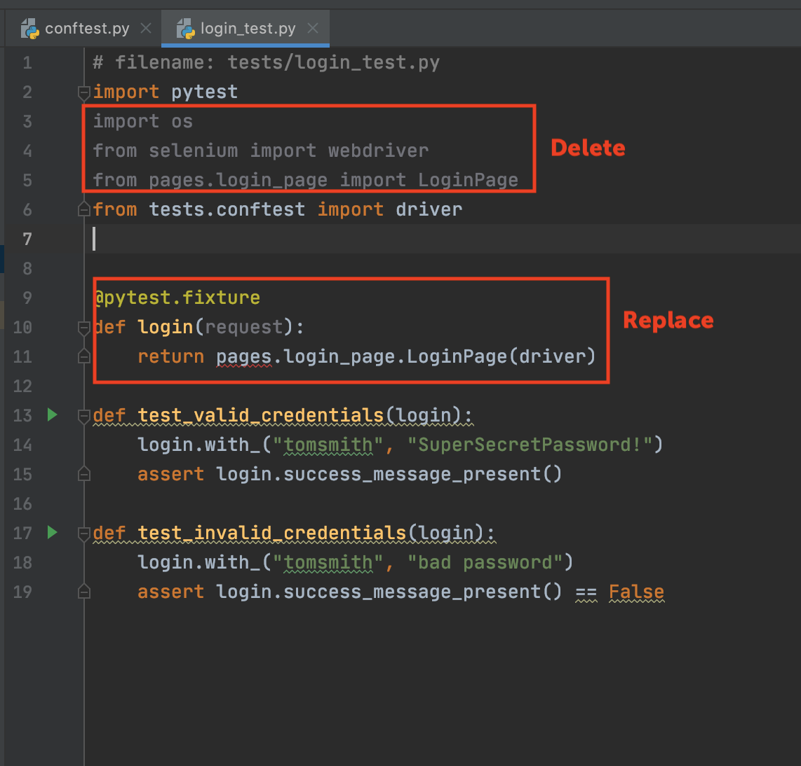
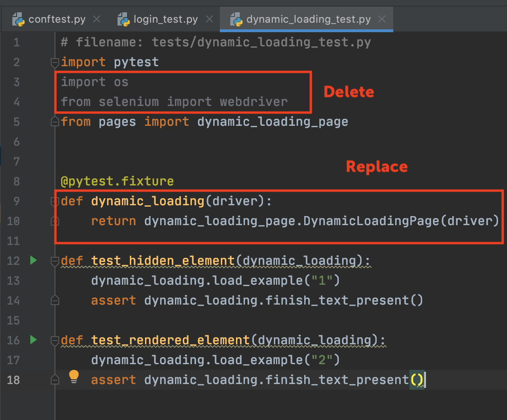

### Part 2: Adding a Base URL Variable

Now it would be nice if every time you tested on a different version of your app (such as a staging or production version) you wouldn't have to update the code in every sigle test. you can do this by including a BaseURL variable in a new file called `config.py`

The first thing you will add is a pytest helper method called `pytest_addoption(parser)` which allows you to specify the url of the app you are testing against with a command line flag.

First, create a new file in your **tests** directory named `config.py` and inside of it create the `baseurl` variable:

```
# filename: tests/config.py
baseurl = ""
```
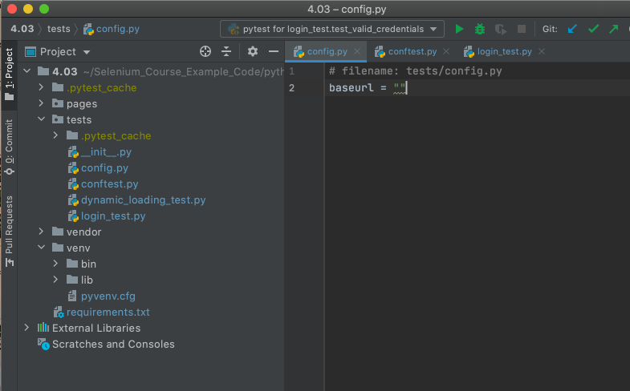


At the top of your test, before the `@pytest.fixture`, import `config.py` so you can use your new variable and add in the following:

```
# filename: tests/conftest.py
# ...
from . import config

def pytest_addoption(parser):
    parser.addoption("--baseurl",
                     action="store",
                     default="http://the-internet.herokuapp.com",
                     help="base URL for the application under test")


@pytest.fixture
# ...
```

This will store the URL in a variable called `--baseurl` that can be changed when you run your test by using the command `pytest --baseurl=url`. At the top of the `driver()` method, before you declare your browser, add in:

```
filename: tests/conftest.py
# ...
@pytest.fixture
def driver(request):
   config.baseurl = request.config.getoption("--baseurl")
# ...
```

#### Update Base Page

The last thing you need to do is update the code to use this new variable. In basepage, you will import `config.py` to grab the `baseurl` variable:

The last thing you need to do is update the code to use this new variable. In basepage, you will import `config.py` to grab the `baseurl` variable:

```
#  filename: pages/base_page.py
# ...
from tests import config
# ...
```

Next change the `_visit method` to use the `baseurl`, as long as a full url was not passed in as a parameter of visit (which may be something you want to do for certain tests)

```
#  filename: pages/base_page.py
# ...
def _visit(self, url):
        if url.startswith("http"):
            self.driver.get(url)
        else:
            self.driver.get(config.baseurl + url)
# ...
```

#### Update Page Objects

Lastly, you will need to remove the url (`"http://the-internet.herokuapp.com/login"`) hardcoded into your `login_page.py` and `dynamic_loading_page.py`, and instead, append the subdomain to the base url.

Update `__init__` in the login page like so, simply adding `/login` to the end:

```
# filename: pages/login_page.py
# ...
    def __init__(self, driver):
        self.driver = driver
        self._visit("/login")
        assert self._is_displayed(self._login_form)
# ...
```

Update  the dynamic loading page, inside the `load_example` method take out the full url and instead append `/dynamic_loading` to the end of the url.

```
# filename: pages/dynamic_loading_page.py
#...
def load_example(self, example_number):
    self._visit("/dynamic_loading/" + example_number)
    self._click(self._start_button)
#...

```
Now try running your test. If you would like, delete the url listed in `conftest.py` in the `parser.adoption` method, and run the command `pytest --baseurl=http://the-internet.herokuapp.com`. The tests should all run!

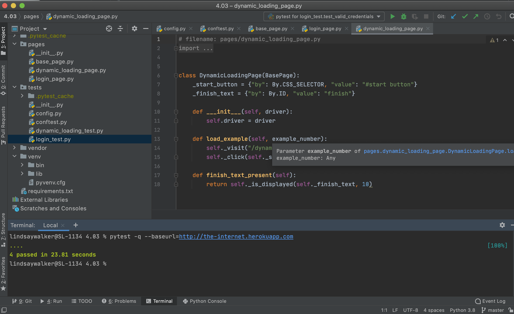

#### Final Code
See an example of all the changes made to the code in [this repo](https://github.com/walkerlj0/Selenium_Course_Example_Code/tree/master/python/Mod4/4.03).


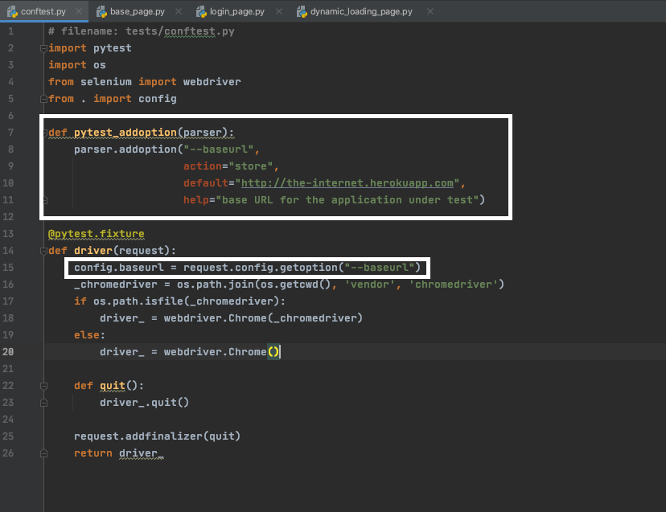

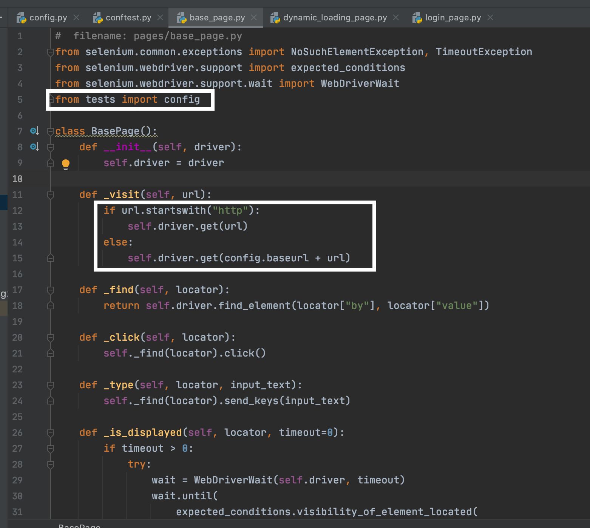

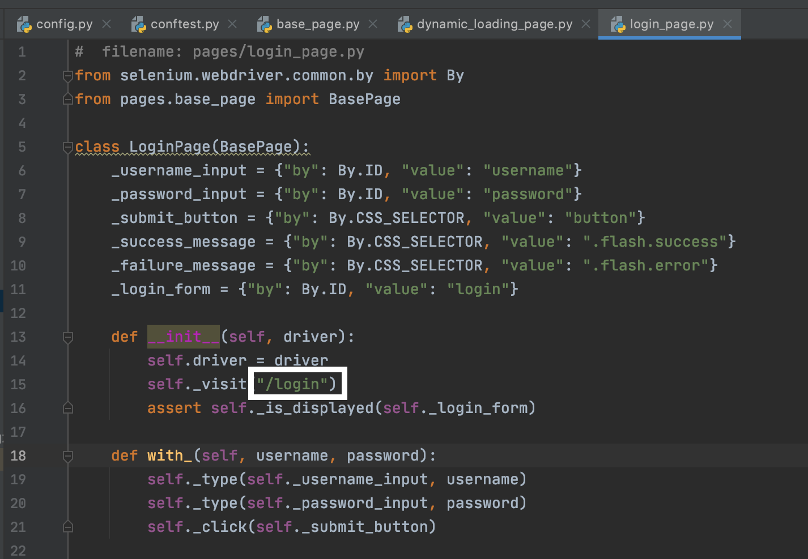

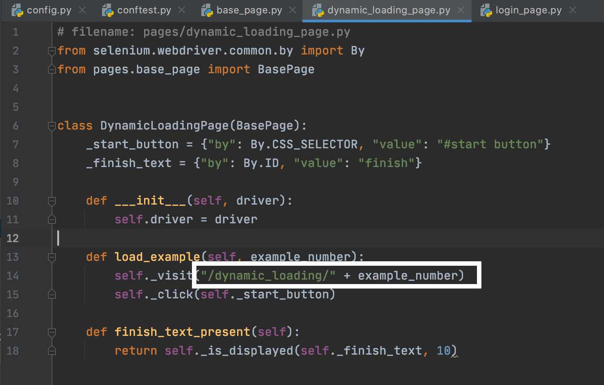

<!-- ------------------------ -->
## 4.04 Running Tests in Different Browsers
Duration: 0:10:00

### Abstraction and Non-Duplication

Thus far we have prepared our test suite well to be reusable. When you have things like the setup and teardown used for all tests in one place, making changes to this becomes a lot easier. Not duplicating (re-writing the same) code and abstracting into files like `base_page.py` and `conftest.py` mean that you won’t have to re-write that code each time you write a new page or test object, or go make changes to all those files when you need to modify something like the URL.

In this lesson you will update the `config.py` file where you can store information that may change with different test runs. You already stored the URL, and now we will store a browser name as a variable.

#### Video

Watch the video [4.04 Non-Duplication](https://youtu.be/HY8-ikAviFo) an excerpt from [Sauce Labs’ Tech Talk](https://www.youtube.com/watch?v=ZLS9sU2A9QA&t=24s) by Nikolay Advolodkin

<video id="HY8-ikAviFo"></video>

### Download GeckoDriver
You may recall tin the beginning, you had to check which version of Chrome you were running on your local machine, then download the appropriate driver. You should do the same with

If necessary, [download an install Firefox] (https://github.com/mozilla/geckodriver/releases) web browser on your machine. Once you have it installed, you can check the version by clicking on the menu at the top **> Help > Troubleshooting Information** and check the version of your browser.

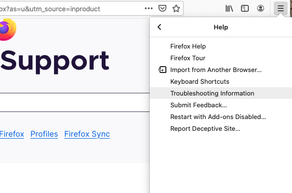

You can download the same version of [Geckodriver](https://github.com/mozilla/geckodriver/releases) that supports the version you have. Navigate to the vendor directory in your project, and place the geckodriver that you downloaded.

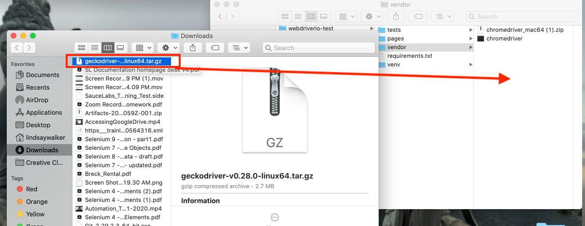

Once the file is in the vendor directory, simply double-click to extract it

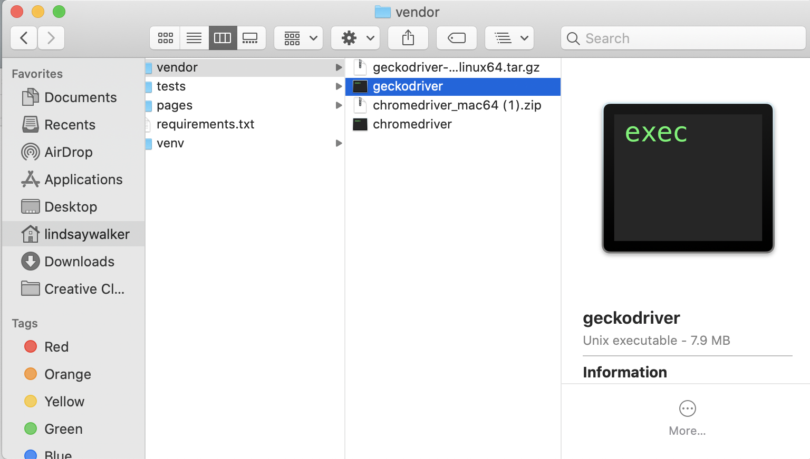


### Update the Config File

The config file is an important part of any test suite. This file will specify things for your tests like what web address you test uses to perform the test, what browser it uses, and later on, will store methods for logging into the Sauce Labs grid, as well as instructions as to which environment you should run your tests in.

Next, you will want to add a variable for the browser in the `config.py` file to make it easy to specify which browser you would like.

```
# filename: config.py
baseurl = ""
browser = ""
```

#### Note
Negative
: You can set the variables in here at any time for the URL and browser and not have to run a flag when you run `pytest`:      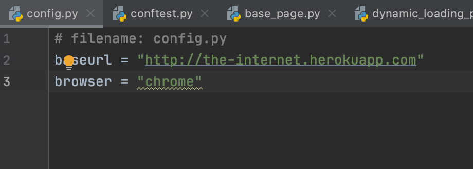

Next, update `conftest.py` using the same `parser.addoption()` method you used earlier for the `--browser` flag:

```
# filename: config.py
# ...
def pytest_addoption(parser):
    parser.addoption("--baseurl",
                     action="store",
                     default="http://the-internet.herokuapp.com",
                     help="base URL for the application under test")
    parser.addoption("--browser",
                     action="store",
                     default="chrome",
                     help="the name of the browser you want to test with")

```

After that, you will need to update the code to take the browser variable, make it possible to change the `--browser` action when you use the flage, and set the correct driver. Add in an `if, elif `statement to switch between Chromedriver and Geckodriver:


```
# filename: conftest.py
# ...
@pytest.fixture
def driver(request):
    config.baseurl = request.config.getoption("--baseurl")
    config.browser = request.config.getoption("--browser").lower()

    if config.browser == "chrome":
        _chromedriver = os.path.join(os.getcwd(), 'vendor', 'chromedriver')
        if os.path.isfile(_chromedriver):
            driver_ = webdriver.Chrome(_chromedriver)
        else:
            driver_ = webdriver.Chrome()
    elif config.browser == "firefox":
        _geckodriver = os.path.join(os.getcwd(), 'vendor', 'geckodriver')
        if os.path.isfile(_geckodriver):
             driver_ = webdriver.Firefox(executable_path=_geckodriver)
        else:
            driver_ = webdriver.Firefox()

    def quit():
        driver_.quit()

    request.addfinalizer(quit)
    return driver_

```

Note that in the `_driver` variable created in the option for the Firefox browser, you added `executable_path=_geckodriver` as a parameter. This is because by default, the webdriver may look for a  [Firefox profile](https://www.toolsqa.com/selenium-webdriver/custom-firefox-profile/) instead of the path to the chromedriver.

Now we can specify Chrome as our browser when launching our tests with the command `pytest --browser=chrome`.

#### Final Code
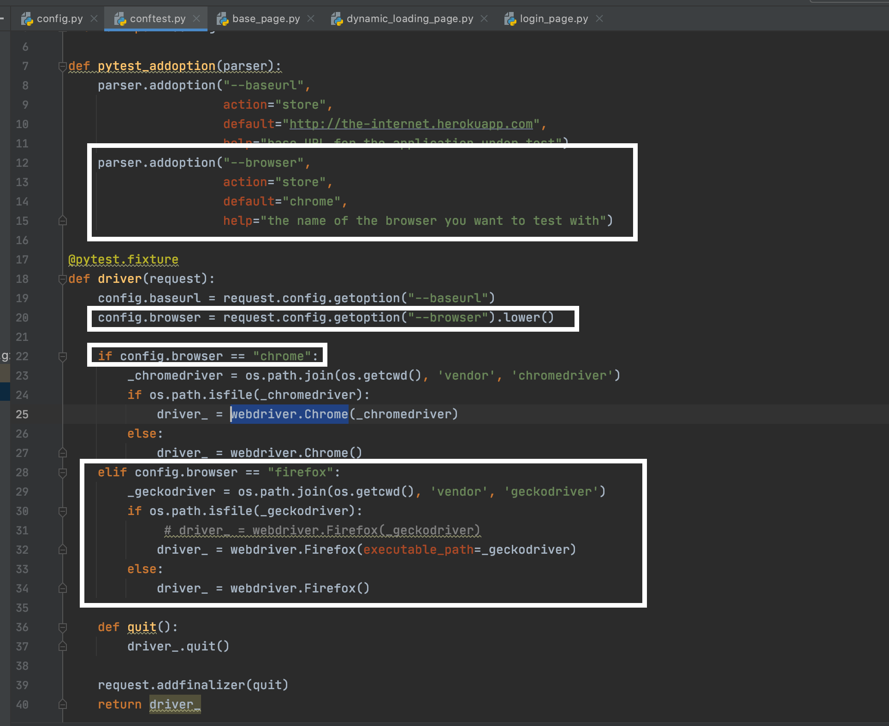

#### Quiz


<!--

Fill in the blanks with the best choice for the type of test. A ______ test is measuring something with a value, that can give you an idea of how well something is performing. _______ testing is a type of test without a visual browser, tests are done with a robot who interacts with the codebase of a application.

Headless, Unit
Non-Functional, Headless
UI, End-to-End
Functional, Integration *

*Functional test test whether or not funtionality exists on a page, and integration tests test how different elements work together

Which object is responsible for the set-up and teardown of all your Selenium driver_ instances and tests?

login_page.py
conftest.py
login_test.py
config.py*

*The conftest.py class contains the driver() and quit() methods that will build and tear down each test.

3. In this code sample from 4.03, why are we able to simplify the code in the @pytest.fixture?
    9. Because we no longer need to check the browser, since that is done in base_page.py
    10. Because we added all of the ‘teardown’ functionality to conftest.py where you set up the browser and quit at the end of the test*
    11. Because we set up our teardown and set up in the page objects (e.g. dynamic_loading_page.py)
    12. Because you are no longer using fixtures and have declared @hook methods in conftest.py

*You defined a fixture in conftest.py that takes care of setting the browser and environment for all tests, as well as quitting the tests.
-
-->

<!-- ------------------------ -->
## 4.05 Testing on Sauce Labs
Duration: 0:15:00

In this lesson you are going to learn how to move the test suite that you have written from your local machine onto the [Sauce Labs](https://accounts.saucelabs.com/am/XUI/#login/?utm_source=referral&utm_medium=LMS&utm_campaign=link) cloud provider. They maintain a set of real and virtual devices, as well as a Selenium grid that you can use to run your test in almost any environment. There are many reasons this is advantageous:


*   You can use virtual machines (without having to set it up on your own machine)
    *   To test older versions of operating systems
    *   Test browsers that only run on older operating systems.
*   You don’t have to provision all the different kinds of virtual machines you will need yourself.
*   You don’t have to set up and maintain the Selenium Grid that will coordinate the test across all of these different machines.


### Part 1: Update Config

We are going to use the`config.py` file that you used earlier to set up the browser and baseURL. Inside `unfig.py`, underneath the browser, add in variables for `host`, `browserversion`, and `platform`. These variables will be used to set the the[ capabilities](https://wiki.saucelabs.com/display/DOCS/Desired+Capabilities+Required+for+Selenium+and+Appium+Tests/?utm_source=referral&utm_medium=LMS&utm_campaign=link) required to run a Selenium test on Sauce Labs:


Open `config.py` and update it to look like the following:

```
# filename: config.py
baseurl = ""
host = ""
browser = ""
browserversion = ""
platform = ""
```

Next, go in and update `conftest.py` with new `parser.adoption()` methods so you can set these elements in your test using a flag or the config file. After the  `--baseurl`, add in `host`, then add in the other two values for  `browserversion` and `platform`:

```
# filename: tests/conftest.py
# ...
def pytest_addoption(parser):
    parser.addoption("--baseurl",
                     action="store",
                     default="http://the-internet.herokuapp.com",
                     help="base URL for the application under test")
    parser.addoption("--host",
                     action="store",
                     default="saucelabs",
                     help="where to run your tests: localhost or saucelabs")
    parser.addoption("--browser",
                     action="store",
                     default="internet explorer",
                     help="the name of the browser you want to test with")
    parser.addoption("--browserversion",
                     action="store",
                     default="87.0",
                     help="the browser version you want to test with")
    parser.addoption("--platform",
                     action="store",
                     default="Windows 7",
                     help="the operating system to run your tests on (saucelabs only)")
# ...
```

At the top of the driver method, add in the new configuration methods:
```
# filename: tests/conftest.py
# ...
@pytest.fixture
def driver(request):
    config.baseurl = request.config.getoption("--baseurl")
    config.host = request.config.getoption("--host").lower()
    config.browser = request.config.getoption("--browser").lower()
    config.browserversion = request.config.getoption("--browserversion").lower()
    config.platform = request.config.getoption("--platform").lower()
# ...
```

This part gets a little tricky- It's now time to wrap the logic that adds a browser driver in another `if, else` statement. You want to perform a check first to see whether your test is run locally, and then only use the drivers when it's a local test, then add the capabilities to connect to Sauce Labs:

```
# filename: tests/conftest.py
# ...
@pytest.fixture
# ...

    if config.host == "saucelabs":


    else:
        if config.browser == "chrome":
            _chromedriver = os.path.join(os.getcwd(), 'vendor', 'chromedriver')
            if os.path.isfile(_chromedriver):
                driver_ = webdriver.Chrome(_chromedriver)
            else:
                driver_ = webdriver.Chrome()
        elif config.browser == "firefox":
            _geckodriver = os.path.join(os.getcwd(), 'vendor', 'geckodriver')
            if os.path.isfile(_geckodriver):
                # driver_ = webdriver.Firefox(_geckodriver)
                driver_ = webdriver.Firefox(executable_path=_geckodriver)
            else:
                driver_ = webdriver.Firefox()

    def quit():
        driver_.quit()
```
Next, inside the new `if` statement, add in the capabilities for Sauce Labs, and create the url to conncet to Sauce Labs using the `SAUCE_USERNAME` and `SAUCE_ACCESS_KEY`, and initialize a driver with that url and the capabilities.

```
# filename: tests/conftest.py
# ...
if config.host == "saucelabs":
    capabilities = {
        'browserName': config.browser,
        'browserVersion': config.browserversion,
        'platformName': config.platform,
        'sauce:options': {

        }
    }
    _credentials = os.environ["SAUCE_USERNAME"] + ":" + os.environ["SAUCE_ACCESS_KEY"]
    _url = "https://" + _credentials + "@ondemand.saucelabs.com/wd/hub"
    driver_ = webdriver.Remote(_url, capabilities)

else:
# ...
```


Notice the new variables you have added:

*   `host `enables us to specify whether our tests run locally or on Sauce Labs. The others are stored under a key sauce key to make their use explicit.
*   `_credentials` are created with the username and access key you set in your system environment bariables
* `platformName` specifies the operating system for a test.  
* `browserName` specifies the browser for a test.
* `browserVersion` specifies which version of the browser for a test
You aren't quite ready yet, however to run on Sauce Labs. You will need to create a driver instance using your Sauce Labs creadentials
 * `sauce:options` contain capabilities with options for information you can pass to Sauce Labs. Currently this is empty, but you can set any of the [Sauce Options here](https://wiki.saucelabs.com/display/DOCS/Test+Configuration+Options).


### Part 2: Setting up your Sauce Labs Account

You'll need an account to use Sauce Labs. Their [free trial](https://accounts.saucelabs.com/am/XUI/#login/?utm_source=referral&utm_medium=LMS&utm_campaign=link) offers enough to get you started. And if you're signing up because you want to test an open source project, then be sure to check out their [Open Sauce account](https://saucelabs.com/open-source).

Visit [http://app.saucelabs.com/](https://accounts.saucelabs.com/am/XUI/#login/?utm_source=referral&utm_medium=LMS&utm_campaign=link). You can create a free trial account if you haven’t been assigned one.


Go to **Account> User Settings** to find your username and access key.


You will need to set up your username and access key on your machine’s environment variables either in your bash profile (Mac/Linux) or in the system properties (Windows).

To learn more about setting up environment variables, you can see the article [here](https://wiki.saucelabs.com/display/DOCS/Best+Practice%3A+Use+Environment+Variables+for+Authentication+Credentials#BestPractice:UseEnvironmentVariablesforAuthenticationCredentials-SettingUpEnvironmentVariablesonMacOSX/LinuxSystems).


#### Video

Watch This Video to See how to set up your [Sauce Credentials](https://www.youtube.com/watch?v=3K1Eu0eTha8) as environment variables on MacOS

<video id="3K1Eu0eTha8"></video>


### Set a Source for Sauce Credentials

IIf you get a failing test such as this, Sauce Labs doesn’t know to look at the updated SAUCE_USERNAME and SAUCE_ACCESS_KEY that you put in your .bash_profile (.zshrc for MacOS Catalina 10+) or configure your [environment variables for Windows](https://docs.google.com/document/d/1Cb27j6hgau5JHmAxGHPihd3V4Og3autPCei82_m1Ae8/edit?usp=sharing)

#### Note
Negative
: You can tell your machine (Mac only)  to look for the correct credentials and type in your terminal:  `source ~/.bash_profile`


Now, when you run a program it will have the updated username and access key. **IMPORTANT** you need to do this with any new project file you create, and also any time you update your bash profile.

Now you can update the config file and try out different combinations of platforms. You can use the [Platform Configurator](https://wiki.saucelabs.com/display/DOCS/Platform+Configurator#/) to try out different settings.  

Run your test using the command `pytest`. You can still also use flags such as `pytest --browser="internet explorer" --platform="Windows 10" --browserversion="11.285"`

Visit [http://app.saucelabs.com/](http://app.saucelabs.com/). Go to the left hand menu and choose **Automated → Test Results**. There you will see your tests with icons indicating they were run on the operating system & browser that you chose:


Complete course code can be found [here](https://github.com/walkerlj0/Selenium_Course_Example_Code/tree/master/python/Mod4/4.05).


#### NOTE

Negative
: What did you do? At this point to create an instance of a test, you are dependent on several different objects in your test suite. First, `base_test` sets up methods used by your page objects and instantiates a Selenium Webdriver instance. The page objects like `login_page` and `dynamic_loading_page` use the base class (and the methods) to interact with the pages.

Negative
: Once the interactions with the webpage are taken care of, the tests come into play.` base_test` imports the settings' variables from `config`, then the tests use the `conftest` class and define the specific tests run on the page, using the corresponding page objects (e.g `login_test` works with `login_page`) 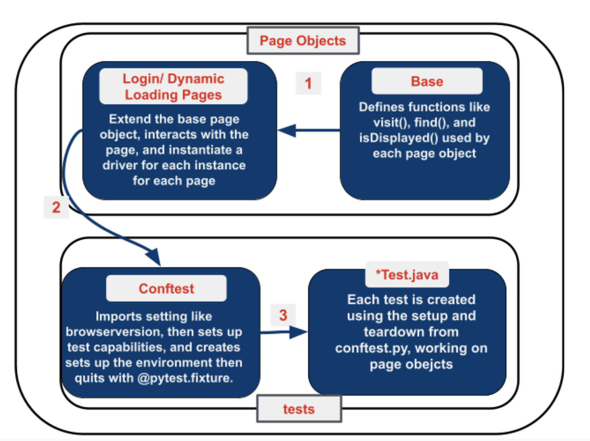

#### Final Code

Your final code will look like this:

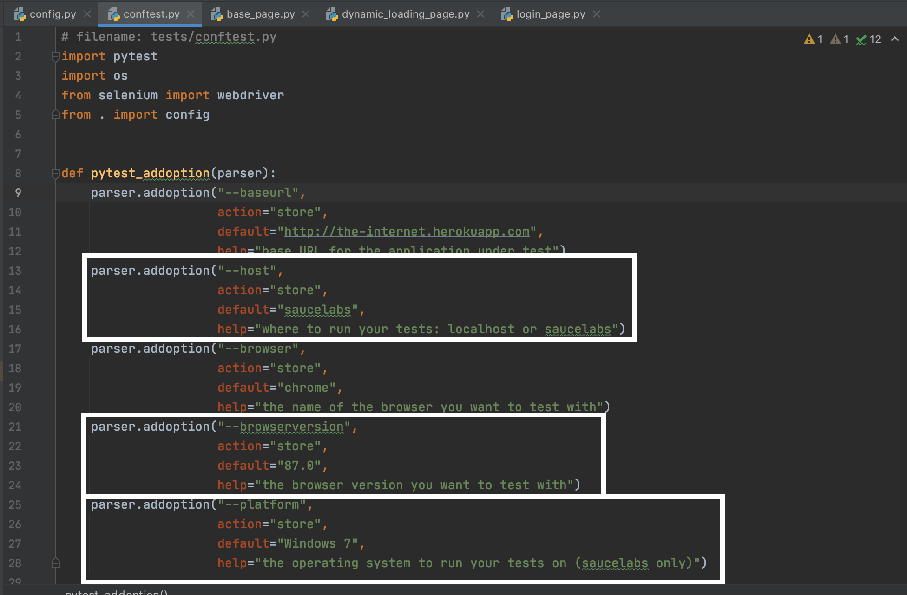

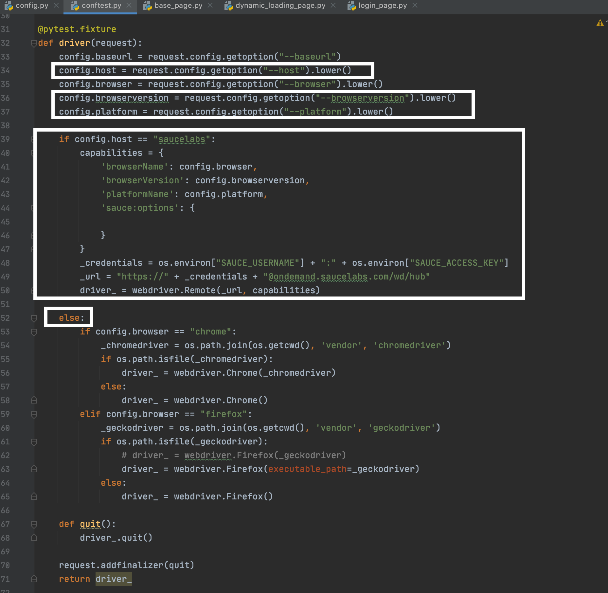


<!-- ------------------------ -->
## 4.06  Setup for Sauce Labs Reporting
Duration: 0:12:00

In this lesson you will add in some elements for better reporting to understand the status of test run on the[ Sauce Labs automated web testing platform](https://accounts.saucelabs.com/am/XUI/#login/?utm_source=referral&utm_medium=LMS&utm_campaign=link).

Now that your tests are up and running on the Sauce Labs platform, you’ll notice it’s hard to tell one apart from the other. The tests you should have run will show up as **Unnamed job** with a hash identifier- not easy to use for testing and debugging.


To fix this issue, you can pull in the name and the status from the test and send it to the [Sauce Labs dashboard ](https://accounts.saucelabs.com/am/XUI/#login/?utm_source=referral&utm_medium=LMS&utm_campaign=link)so we can use our tests to effectively debug and improve our application.

In addition, right now regardless of the outcome of a test, the job in Sauce Labs will register as **Finished.** Ideally we want to know if the job was a **Pass** or a **Fail**. That way we can tell at a glance if a test failed or not. With a couple of tweaks we can make this happen easily enough.


### Add a Test Name

It's great that our tests are running on Sauce Labs. But we're not done yet because the test name in each Sauce job is getting set to an unnamed job. This makes it extremely challenging to know what tests were run in each job. To remedy this we'll need to pass the test name to Sauce Labs as a capability using `sauce:options`:

First, create a variable to store the `test_name` right about the capabilities you declare when you run on sauce labs in `conftest.py`:

```
# filename: tests/conftest.py
# ...
     if config.host == "saucelabs":
          test_name = request.node.name #added
          capabilities = {
          # ...
```
Next, inside the `sauce:options` add in the name capability:


```
# filename: tests/conftest.py
# ...
    capabilities = {
       'browserName': config.browser,
       'browserVersion': config.browserversion,
       'platformName': config.platform,
       'sauce:options': {
           "name":test_name, #added
       }
#....
```

Now when you run your tests, you should see the names of you test methods from `login_test.py` and  `dynamic_loading_test `

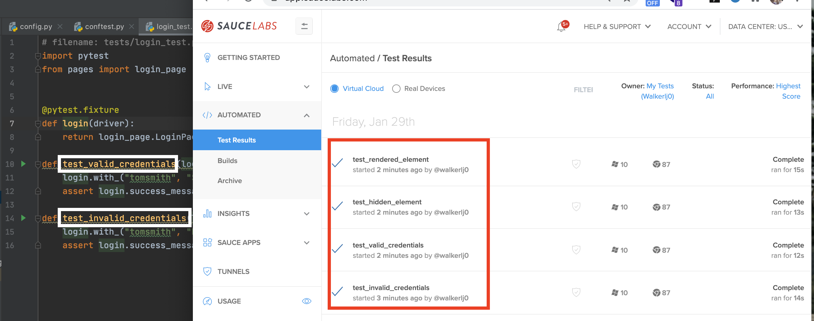


### Add a Test Status

After adding a test name, you will add in an id and status for each unique test that you create. First, you will need to update our tests. If you noticed before, the only status was **Complete** or had an **Error**. You will now add in a way to see whether a test has **Passed** or **Failed**.


A  _failure_ is different from an _error_. An error means that you test code is erroneous, and you, as the test writer, need to make a change. You should see this error in your terminal output, and if the code is correct to communicate with Sauce Labs, it should be on your dashboard as well. A _failure_ means a test successfully ran, but the conditions it was checking for were not present – in other words, the code for the app isn’t as expected or needs fixing.

The test status will be gathered at the end of your test run, in the quit function. First, however, you need to write a hook to be included into the test execution, since a pass or fail status isn't a part of the pytest library.

At the bottom of the `cpnftest.py` test code, you are going to add a hook. Copy and paste the following into your code:

```
# filename: tests/conftest.py
# ...
@pytest.hookimpl(hookwrapper=True, tryfirst=True) #added all below
def pytest_runtest_makereport(item, call):
    # this sets the result as a test attribute for Sauce Labs reporting.
    outcome = yield
    rep = outcome.get_result()

    # set an report attribute for each phase of a call
    setattr(item, "rep_" + rep.when, rep)
```

Next, we are going to use this hook as a part of the `quit()` method and create a variable callde `sauce_result` that will say either passed or failed, depending on what the hook detects:

```
# filename: tests/conftest.py
# ...
    def quit():
        sauce_result = "failed" if request.node.rep_call.failed else "passed" #added
# ...
```

Last, we will add in  `JavaScriptExecutor` [to pass in the sauce:job-result](https://wiki.saucelabs.com/display/DOCS/Annotating+Tests+with+Selenium%27s+JavaScript+Executor/?utm_source=referral&utm_medium=LMS&utm_campaign=link) to the Sauce Rest API:

```
# filename: tests/conftest.py
# ...
    def quit():
        sauce_result = "failed" if request.node.rep_call.failed else "passed" #added
        driver_.execute_script("sauce:job-result={}".format(sauce_result)) #added
        driver_.quit()
# ...
```

Now when you run your tests, you can see either a **Pass** or **Fail** status, and not just a **Completed** status. Try changing the `test_invalid_credentials` method to `true`,  then run your tests to see bth a **Passed** and **Failed** status:


You can see an example of the completed code[ here.](https://github.com/walkerlj0/Selenium_Course_Example_Code/tree/master/python/Mod4/4.06)

#### Final Code

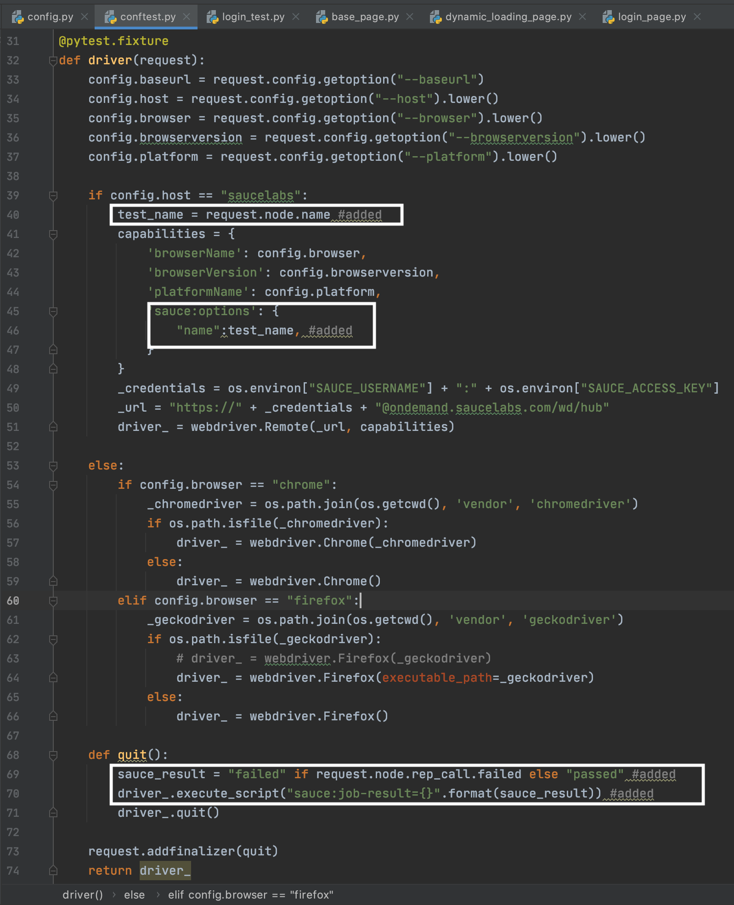

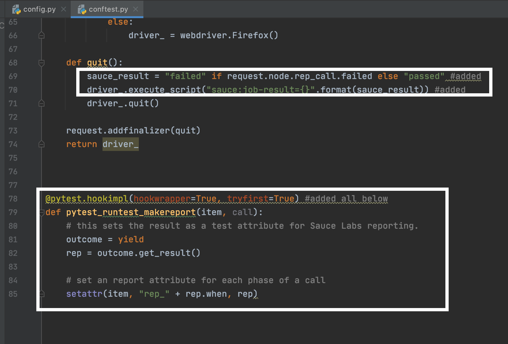

<!-- ------------------------ -->
## 4.07 Module 4 Quiz
Duration: 0:05:00


<!--------
Fill in the blanks with the best choice for the type of test. A ______ test is measuring something with a value, that can give you an idea of how well something is performing. _______ testing is a type of test without a visual browser, tests are done with a robot who interacts with the codebase of a application.

Headless, Unit
Non-Functional, Headless*
UI, End-to-End
Functional, Integration

* See "Types of Tests" in 4.02 for information. Remember, non-functional tests test how well and how much an app is performing, whereas functional tests simply whether or not a feature is working.

Which Page Object is responsible for the set-up of the varibles of where (what browser & environment) & what(application) your suite is testing?

login_page.py
conftest.py
config.py*
base_page.py

* See 4.04 for information. Config sets variables like the browser, operating system, username, the url for the application under test.

-----------

Which of the following best describes how a test in the tests folder uses the page object files, the test files, and the base page and base test?

First, page objects are created, to go along with a test, that handle the interactions on a page. Each test uses base_page.py for the setup and breakdown in @pytest.fixture, as well as pulls in the desired capabilities, then each test  then executes the logic in the test methods.

Each test creates a new base_page.py, and that uses the page object (e.g. login_page.py) to set up a driver() and quit() to create the rules in each test.

Each test creates a new conftest.py file, and that uses base_page.py . Within each *_test.py a driver() and quit() fixture is defined, and run with the corresponding page object.

Each test uses config.py for the driver() and quit() methods to create a new driver_factory.py which contain all @pytest.fixtures, while pulling in the environment setup from base_page.py.

*See the section before the final code in lesson in 4.05 for information on how these different files in your test suite work together.


What is the difference between base_page.py and conftest.py?


conftest.py defines the methods for the setup and tear down of tests, and base_page.py instantiates them.

base_page.py configures where the tests are hosted, and on what environment they are run, and conftest.py instantiates the test suite setup.

base_page.py defines the methods used by each test, and conftest.py configure where the tests are hosted, and on what environment they are run.*

base_page.py configures where the tests are hosted, and on what environment they are run, and conftest.py instantiates the methods and variables for the test suite.


Which of the following is the most accurate description of the purpose of the pytest hook implementation?


It defines (creates) the variable job-result in the execute-script method, which doesn’t exist unless all other test code has successfully completed, and makes it possible to send test results, which isn't a built in function of pytest.

It uses the variable rep_ defined (created) in pytest_runtest_makereport which is used with JavaScript to send a pass or fail status to Sauce Labs Dashboard, and makes it possible to send test results, which isn't a built in function of pytest.*

It defines (creates) setattr which allows the creation of the rep_ variable, that can also only be created if all other test code has successfully completed. It makes it possible to send test results, which isn't a built in function of pytest.

It makes it possible to use JavaScript to send information to the SauceRest API after the sauce_result method, which can’t be defined unless all other test code has successfully completed.


---------------->
