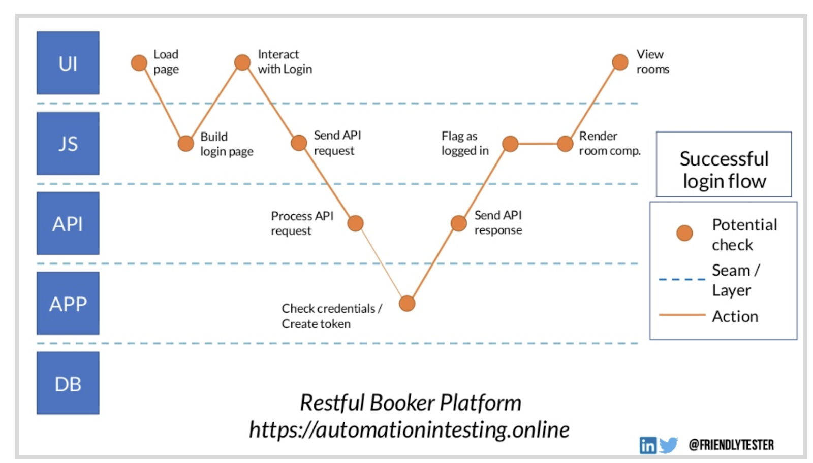
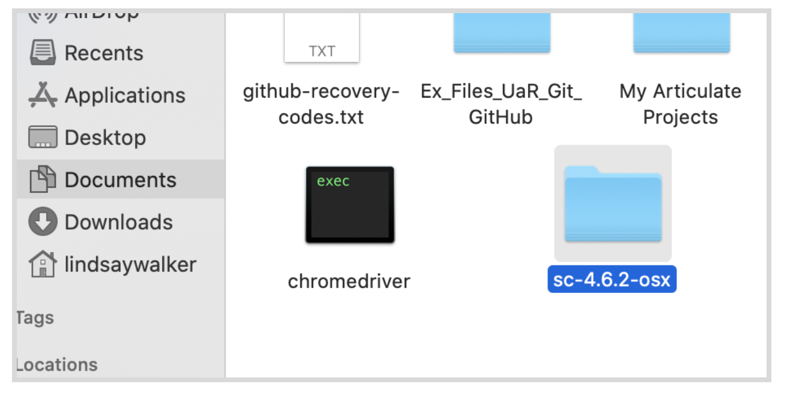
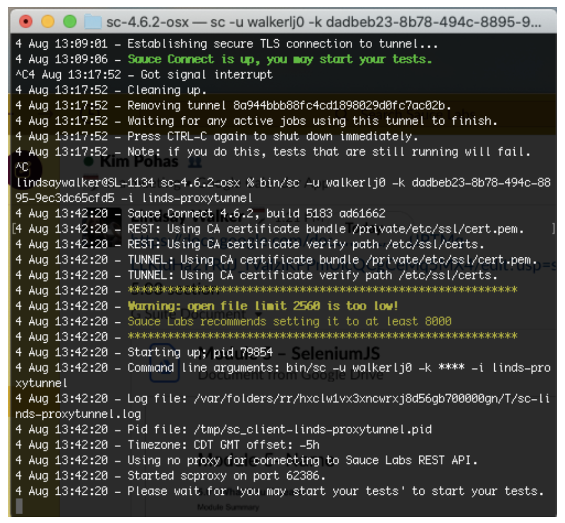
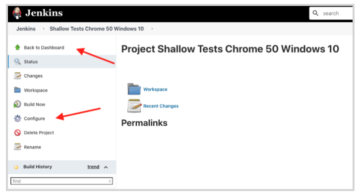
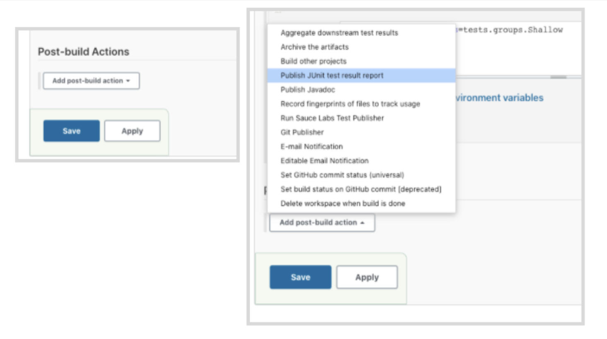
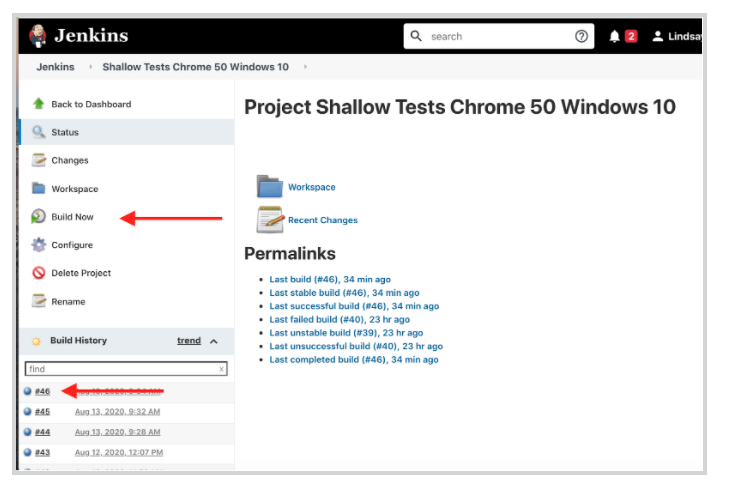
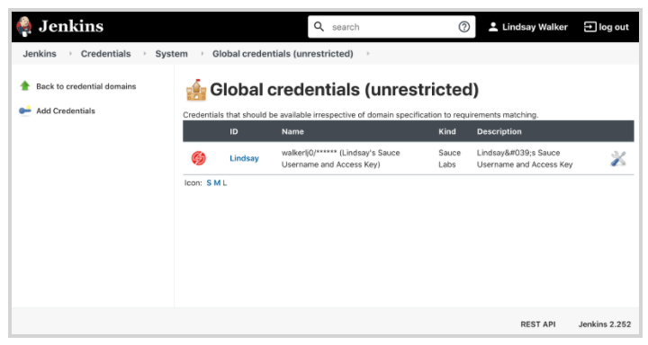

<!-- Copy this file into tools/site/coursenameFolder & start editing -->

author:Lindsay Walker
summary: Module 5 of Selenium with Python and Pytest – Sauce Connect, OnDemand, and Continuous Integration
id: Module5-SeleniumPython
categories: advanced
tags: python
environments: Web
status: Hidden
feedback link: https://forms.gle/CGu4QchgBxxWnNJK8
analytics account: UA-86110990-1

<!-- ------------------------ -->
# Module 5 – Sauce Connect, OnDemand, and Continuous Integration

<!-- ------------------------ -->
## 5.01 What You’ll Learn
Duration: 0:02:00

This module, based off chapters 13-18 of _The Selenium Guidebook:_ _Python Edition_ by Dave Haeffner, brings you to the next level with learning how to plan a test strategy, run tests in parallel, use the Sauce Connect Proxy, and add your tests to a pipeline with the Jenkins Continuous Integration (CI) server. Learn about best practices to avoid creating a test suite that is brittle when used in parallel or with tools that make for more automation (but more latency) such as the Sauce Labs platform or CI servers. Use tags to categorize tests for use in different situations and gain the tools and skills to truly automate your testing practices.


### Skills & Knowledge


*   Set up and run tests using the Sauce Connect Proxy tunnel with terminal commands and the Sauce Labs application interface. Set up environment variables and access them with the Sauce Connect software to run tests using the tunnel.

*   Use Pytest plugins `xdist` and `randomly` to run tests on the Sauce Platform in parallel and in random order

*   Create a `pytest.ini` file to name categories for different kinds of tests, and use the `@pytest.mark` decorators in your tests  as well as the `pytest -m mark_name` command in the terminal and in Jenkins to run different groups of tests for different purposes

*   Set up the the Jenkins CI server on your local machine and learn how to use the user interface to set up projects that run your tests, as well as configure the Jenkins CI server

*   Add your credentials to your instance of a Jenkins CI server using Sauce OnDemand and run a test that you can view in both the Jenkins console and the Sauce Labs application

*   Run tests using Sauce Connect Proxy through your Jenkins server, passing information back and forth from Sauce Labs to Jenkins using Sauce Connect

*   Understand how the tests that you have written for the user interface of an application using Selenium can be integrated into a comprehensive testing strategy that tests on multiple layers

*   Establish autonomous test suites that are set up to run without relying on the execution of any other tests

*   Describe a use case for the Sauce Connect Proxy and how it can allow access to secure applications while maintaining data privacy

*   Understand how a CI server like Jenkins can be used to automate the software development pipeline and automate the testing to run specific tests with certain triggers

<!-- ------------------------ -->
## 5.02 Testing Strategy
Duration: 0:12:00


Testing pyramids are a way of framing the strategy for what kind of tests you are going to create as a part of your testing suite(s) and expressing the amount of types of tests your team or company is going to create. At the bottom of the pyramid is the easiest, most plentiful, and typically cheapest type of tests to create. At the top of the pyramid are the types of tests that are more labor- and cost-intensive tests that make up a smaller portion of your suite(s). Learn more about the [details of a test pyramid here](https://medium.com/@Colin_But/define-testing-strategy-using-the-testing-pyramid-1dabee37e823).


`

There are many versions of the pyramid created by experts in the testing field, and your own team or company can decide on which strategy for developing tests works for you. It is, however, important to understand how the plan is set up and the considerations for types of tests, the best layer to test on, and how to plan so your test suite is accurately fulfilling the purposes that stakeholders expect.


#### Video

Watch [5.02 Testing Strategy](https://www.youtube.com/watch?v=dPe9hxsbfLg), Excerpts from “Pyramids Are Ancient” By Richard Bradshaw to learn about how to develop a testing strategy for your business, as well as tip on how to plan and identify the layers of your application you should run your tests on.

<video id="dPe9hxsbfLg)"></video>


### Testing Layers

An important thing to understand is that there is so much more to test than just the UI layer that you have been testing with Selenium. In this model, the different places the app interacts with layers of the platform is demonstrated.

`


Here you can see the following interactions occur:


1. User loads the login page.
2. React (A JS framework) builds the elements on the login page.
3. User performs login on interface.
4. A “login” API request is sent by the JavaScript layer.
5. The API processes and directs the login request.
6. The credentials of the login request are checked by the application.
7. A response is sent to the API from the app (e.g., “allow login” or “failed login”).
8. The login is sent to the JavaScript layer to process the page after login.
9. The post-login page is rendered.
10. The user sees the post-login page on the interface.

When choosing a testing strategy, you need to consider two important things.


1. What do I actually want to test? Do you want to test that the page after the login loads, or do you want to check that the login credentials are sent correctly?
2. Which is the best layer to test this on?

Selenium is intended to be mainly a UI testing tool, however, as you are developing your overall strategy, and building a repertoire of new tools and frameworks, you can use Selenium alongside other tools that you may know. Depending on which tools and frameworks you know, and which you know you will have time to learn, you should let your skill set guide your choices for a good testing strategy that allows you to automate on the best layer of an application.


### TRIMS

Learning the tools to test things like API calls means that you can write shorter, more concise tests where you don’t have to do a ton of clicks on a screen to get the place or feature you want to test. Using TRIMS means you can make your tests more **T**argeted, **R**eliable, **I**nformative, **M**aintainable, and **S**peedy.

As an example, a bad test would tell you had a failed login. Why did that test fail? Did the developer change something in the UI like a “success” message for login? Did it take too long to load the post-login page? Were incorrect credentials sent to the API?

A good test would tell you exactly what failed and how it failed. Some examples include tests such as “login success message not present” or “failed to return a 200 code from API.” Understanding the tools that you have at your disposal and what skills you can develop next will help you work towards creating a well-planned, efficient testing strategy.

<!-- ------------------------ -->
## 5.03 Using Sauce Connect Proxy
Duration: 0:15:00


[Sauce Connect Proxy](https://docs.saucelabs.com/secure-connections/sauce-connect) is software that enables you to establish a secure connection between applications hosted on an internal server and the Sauce Labs virtual machines (such as Jenkins) or real devices that are used for testing. It also allows you to create a secure connection for uploading tests, application, and source code.

#### Video
[Set Up Sauce Connect Proxy](https://youtu.be/cpBcGeZ_wQU)

<video id="cpBcGeZ_wQU"></video>


In many cases, testers need to run their tests on internal sites. These can be dev/staging versions of their production site or actual internal sites only employees use. In either case, these sites are not available out in the open internet for sauce to access. The best, most secure option is to create a connection with Sauce Connect Proxy. Sauce Connect Proxy uses a proprietary [TLS protocol](https://www.cloudflare.com/learning/ssl/transport-layer-security-tls/) to encrypt traffic between Sauce Labs and your network and servers.


### Download Sauce Connect Proxy

The first step is to download The Sauce Connect Proxy software -- available on the **[Sauce Connect Proxy](https://docs.saucelabs.com/secure-connections/sauce-connect)** page in the Sauce Labs Cookbook -- and extract the contents of the **.zip** or **.gz** download package. You can also get the software on the [Sauce Labs](https://accounts.saucelabs.com/am/XUI/#login/?utm_source=referral&utm_medium=LMS&utm_campaign=link) platform under **Tunnels.**


Once you’ve extracted the contents, take the Sauce Connect Proxy folder and move it into another directory. In this example, I moved mine into the **Documents** folder.



### Set Up Your Tunnel

Go to the **Tunnels** tab in the Sauce Labs app.


Navigate to the folder using the terminal where you saved the Sauce Connect download (this one is in **Documents/sc-4.6.2-osx**). Next, type and run the command below. Make sure to fill in your credentials (username after the `-u` command and access key after` -k`) and add your tunnel name (aka tunnel identifier) after the `-i `command.


```
bin/ sc -u <SAUCE_USERNAME> -k <SAUCE_ACCESS_KEY> -i <SAUCE_TUNNEL>

```
###Note
Negative
: **Create Environment Variables for Sauce Labs –** The first thing you should do when creating a test is set up environment variables on your local machine in the (.zshrc or .bash profile) for your `SAUCE_USERNAME` and `SAUCE_ACCESS_KEY`. It is important to save your Sauce username and access key as environment variables, instead of coding them into your test, so that when you share your tests or upload them to Github, your private access keys aren’t shared.   It will also make transitioning to a continuous integration pipeline easier, since they will use the same environment variables.  Watch [this video](https://youtu.be/3K1Eu0eTha8) to learn how to set up environment variables with your Sauce Labs credentials on a Mac, or view the [instructions for Windows](https://docs.google.com/document/d/1Cb27j6hgau5JHmAxGHPihd3V4Og3autPCei82_m1Ae8/edit?usp=sharing).

You can copy the command that you will find at the bottom of the **Tunnels** page, and paste this into your terminal as well, instead of typing what is above. take note of what is after the `i` flag as you will need to add this in your code `-i <Sauce tunnel name>`:. In this example, I’ve called mine `linds-proxy-tunnel.`


Your command should look like this:


Learn more about the other commands you can use to configure your tunnel at [Sauce Connect Proxy CLI Reference](https://docs.saucelabs.com/dev/cli/sauce-connect-proxy). Hit enter and you should see your tunnel up and running.




### Set Sauce Connect Tunnel Capability
Since you are using environment variables in our `conftest.py` file, for your `SAUCE_USERNAME `and` SAUCE_ACCESS_KEY,` we will set up an environment variable for your` SAUCE_TUNNEL` as well.` `This variable will store the tunnel identifier, so after you start up a Sauce Connect tunnel, you can run your tests using it.

In `conftest.py` in the driver method, add a new `elif` statement below the `if config.host == "saucelabs"`. You can copy-paste the same information from the "saucelabs case.

```
# filname: conftest.py
# ...
@pytest.fixture
# ...
    if config.host == "saucelabs":
    # ...
    elif config.host == "saucelabs-tunnel":
        test_name = request.node.name #added
        capabilities = {
            'browserName': config.browser,
            'browserVersion': config.browserversion,
            'platformName': config.platform,
            'sauce:options': {
                "name":test_name,
            }
        }
        _credentials = os.environ["SAUCE_USERNAME"] + ":" + os.environ["SAUCE_ACCESS_KEY"]
        _url = "https://" + _credentials + "@ondemand.saucelabs.com/wd/hub"
        driver_ = webdriver.Remote(_url, capabilities)


```

Above the `test_name`, add a new variable to pull in the tunnel name from the environment variable you created for your tunnel:

```
# filname: conftest.py
# ...
@pytest.fixture
# ...
    elif config.host == "saucelabs-tunnel":
          test_name = request.node.name
          tunnel_name = os.environ["SAUCE_TUNNEL"]  # added
          #  ...
```
Last, go into the `sauce:options` part of your capabilities for the `saucelabs-tunnel` case, and add in the capability for the tunnel name:

```
# filname: conftest.py
# ...
@pytest.fixture
# ...
    if config.host == "saucelabs":
    # ...
    elif config.host == "saucelabs-tunnel":
        test_name = request.node.name #added
        tunnel_name = os.environ["SAUCE_USERNAME"] #added
        capabilities = {
            'browserName': config.browser,
            'browserVersion': config.browserversion,
            'platformName': config.platform,
            'sauce:options': {
                "name":test_name,
                "tunnel-identifier": tunnel_name, #added
            }
        }
        _credentials = os.environ["SAUCE_USERNAME"] + ":" + os.environ["SAUCE_ACCESS_KEY"]
        _url = "https://" + _credentials + "@ondemand.saucelabs.com/wd/hub"
        driver_ = webdriver.Remote(_url, capabilities)


```


### Run Tests Using Sauce Connect Proxy

Once your tunnel is up and running, (you should see the message Sauce Connect is up in terminal)  and you have updated your `conftest.py` file, you can run your tests in Sauce Labs using Sauce Connect Proxy.

First, update your` .bash_profile` (or `.zshrc`) with an environment variable (it must match the` tunnel id `your use to start the tunnel with).


#### NOTE
Negative
: Don't forget to have a proxy tunnel running with `bin/sc -u username -k access-key -i your-tunnel-id` that match the `.bash` or `.zshrc` profile

Now you can run ` pytest --host=saucelabs-tunnel` in terminal and see your tests run both in Jenkins and on Sauce Labs with a tunnel. Note that because it is running through a proxy, you will no longer be able to see the name and status of the tests. You can see the completed code [here](https://github.com/walkerlj0/Selenium_Course_Example_Code/tree/master/javascript/Mod5/5.03).


#### Final Code
You can see an example of the [final code for running with Sauce Connect and Python here.](https://github.com/walkerlj0/Selenium_Course_Example_Code/tree/master/python/Mod5/5.03)


## 5.04  Running Parallel Tests
Duration: 0:12:00

Your tests still take a good deal of time to run since they're executing in series (i.e., one after another). As our suite grows, test latency will grow with it, if you continue to run tests in series the time it takes to run your test suite can grow exponentially.

In this lesson you will be learning how to set up Sauce Labs to run tests in parallel. This means that you can run two or more tests, using two or more instances of DriverFactory at the same time.  

Parallelization is one of the main advantages to using a platform like Sauce Labs, however you also must be careful when designing a test suite to make sure the tests can be run in parallel, and in any order, or else account for and create code that does run certain tests in order. Luckily, our test suite has been well set up to run in parallel.


### Autonomous Tests

Autonomous tests are the type of tests that are not dependent on other tests to be run. Consider the following set of tests:


1. **LoginTest–** This test is performed first to allow you to login to the platform.
2. **ShoppingTest–** This test is performed second, where the user chooses and adds an item to the test.
3. **CheckoutTest–** This test is performed third, where the user accesses the checkout screen where they can pay and order the item from their shopping cart.

Clearly these tests aren’t autonomous when you are doing User Interface (UI) tests; you cannot perform CheckoutTest until you have logged into the platform and chosen an item for the shopping cart. There are ways, however, to set up your test so you can “jump right in” with a filled shopping cart without having to wait for other tests to run by using API calls and other tricks that can help you write a suite of autonomous tests.

### Install dependencies
In order to run tests in parallel and in random order, we will use two plugins:

* **The [pytest-xdist](https://github.com/pytest-dev/pytest-xdist) plugin** – Extends pytest to run on multiple CPUs, or multiples hosts in Sauce Labs
* **The [pytest-randomly](https://pypi.org/project/pytest-randomly/) plugin** – Randomly shuffles the modules, test classes, and functions. This helps you detect whether or not there are any interdependencies between tests that could cuase them to fail.

Open a new terminal window on your machine, and install the following globally

```
pip3 install pytest-xdist
```
```
pip3 install pytest-randomly
```

You should get messages that they were successfull installed, or are a part of your environment already.


### Run Random Parallel Tests

Before you get started, head to the [Sauce Labs Dashboard](https://accounts.saucelabs.com/am/XUI/#login/?utm_source=referral&utm_medium=LMS&utm_campaign=link) and look under **Account > User settings** and check out how many tests you (and your team) can run at once.


Once you are sure that you are able to run tests in parallel (you should have less tests than your concurrency limit), you can run your tests. If you send more jobs than your concurrency limit, Sauce Labs will queue the excess and run them as the initial batch of jobs finish.

Run `pytest -n 5` to run 5 tests at the same time in parallel. If you run your tests more than once, they should run in a different order


Next, visit the [Sauce Labs Dashboard ](https://accounts.saucelabs.com/am/XUI/#login/?utm_source=referral&utm_medium=LMS&utm_campaign=link)while your tests are running. You should see more than one test running at the same time, and notice that your test suite as a whole runs more quickly! You can see the completed code [here]().


#### Quiz


<!-- ------------------------ -->
## 5.05 Grouping Tests
Duration: 0:08:00

In order to get the most out of your tests, you'll want a way to break them up into relevant, targeted chunks. Running tests in smaller groupings (along with parallel execution) will help keep test run times to a minimum and help you quickly sift through test results and target your tests. It also allows you to run different groups of tests for different purposes.

In order to do this with Python, you will create a `pytest.ini` file, then create `deep` and `shallow` markers that you will use the `@pyest.mark` decorator to your tests.

### Create pytest.ini File
In the top level of your project file (at the same level as your **pages** and **tests** directories), create a new file called `pytest.ini`.


### Add Markers to Your Tests
Now that you have two different typrs of markers created for your tests (`shallow` and `deep`) you can add `@pytest.markers` to your tests functions.

Update `login_test.py` with markers above both classes:

```
# filename: tests/login_test.py
# ...

@pytest.mark.shallow
def test_valid_credentials(login):
    login.with_("tomsmith", "SuperSecretPassword!")
    assert login.success_message_present()

@pytest.mark.deep
def test_invalid_credentials(login):
    login.with_("tomsmith", "bad password")
    assert login.success_message_present() == False
```
Then add a marker to your tests in `dynamic_loading_test.py`:

```
# filename: tests/dynamic_loading_test.py
# ...

@pytest.mark.deep
def test_hidden_element(dynamic_loading):
    dynamic_loading.load_example("1")
    assert dynamic_loading.finish_text_present()

@pytest.mark.deep
def test_rendered_element(dynamic_loading):
    dynamic_loading.load_example("2")
    assert dynamic_loading.finish_text_present()
```

Now you can use different flags when you run your tests. If you run the command `pytest -m shallow`, only the `test_valid_credentials` function will be run, whereas if you run `pytest -m deep` the other tests will be the ones which are run.

#### Run Tests By File Name
You also have the option to specify which test file you would like to run. If you want to run all the functions in `dynamic_loading_test.py` simple run the command

```
pytest tests/dynamic_loading_test.py
```

#### Final Code


<!-- ------------------------ -->
## 5.06 Setting Up Jenkins
Duration: 0:15:00


You'll probably get a lot of mileage out of your test suite in its current form if you just run things from your computer, look at the results, and tell people when there are issues. But that only helps you solve part of the problem.

The real goal in test automation is to find issues reliably, quickly, and automatically. We've built things to be reliable and quick. Now you need to make them run on their own, and ideally, in sync with the development workflow you are a part of.

To do that you need to use a _Continuous Integration server_.


### CI Servers

A _Continuous Integration_ server (CI server) makes it possible for several developers to merge their code into a central repository, then automate the process of building, testing, and deploying the set of code with the entire team’s contributions. As an example, In GitHub, this would be a certain branch of a shared repository. A CI server can be set up so that it takes updated code through the process several times a month, week, or even a day.

The great thing about doing this is that code from several teams or developers can be brought together into the same working project quickly and tested, instead of developers trying to test their code in isolation (and not know what could break when all contributors’ code is built together).  


The best thing about using Jenkins is that it has a lot of features that make your tests easier. You can set it up to automatically pull in your code from a GitHub repository, as well as trigger projects that contain your test code to run a given suite of tests automatically when certain things occur, such as when a pull request is made, or set up test suites to run on a schedule.


In the next couple lessons, you will dip your toes into adding and running your tests with the Jenkins server so you are ready to work with the DevOps team on the key _test phase_ of the CI pipeline. Typically, most tests that are run on a CI Server are unit (and potentially integration) tests, and you can very easily add in our Selenium tests as well. Learn more about Continuous Integration servers [ here.](https://www.thoughtworks.com/continuous-integration)


### Set Up Jenkins CI Server

[Jenkins](https://jenkins.io/) is a fully functional, widely adopted, free, and open-source CI server. It’s a great candidate for us to try. You will use [Homebrew](https://brew.sh/) to install it on your computer.


Let's start by setting up Jenkins on your local machine and using the test code from your computer as well. Keep in mind that this isn’t the proper way to go about this — it's merely beneficial for this example. To do it right, the Jenkins server (i.e., master node) would live on a machine of its own, or in a Virtual Machine (VM).

These instructions give you the step-by-step for how to set up on MacOS, however there are instructions for other operating systems, as well as the option for setup using a Docker container with other operating systems [here](https://www.jenkins.io/doc/book/installing/).


### Install Jenkins

A simple way to get started is to use [Homebrew ](https://brew.sh/)to install Jenkins on MacOS. Once Homebrew is installed on your computer, use the instructions on the [Jenkins download page](https://jenkins.io/download/). If you are using Homebrew on MacOS, all you need to do is run this command in the terminal:


```
sudo brew install jenkins
```


#### NOTE

Negative
: In order to install Jenkins on the Mac, Jenkins has opted to enlist the help of another tool called [Homebrew](https://brew.sh/). Homebrew makes it easier to install and keep other files and software up to date on your machine. To install brew, [go to the website](https://brew.sh/) to view instructions. Copy and paste the command on there into your terminal:
```
/bin/bash -c "$(curl -fsSL https://raw.githubusercontent.com/Homebrew/install/master/install.sh)"
```


Negative
: If you type in `brew info` in your terminal, and you have homebrew installed correctly, you should see something like this:  

You will have to enter your password, and Jenkins should install on your machine.

Jenkins was built on Java, and in order for your program to work, you will also need to install either [Java version 8](https://www.oracle.com/java/technologies/javase/javase-jdk8-downloads.html) or Java version 11. If you try to install Jenkins and get this error, install Java 8 or 11 and retry installing Jenkins.


#### NOTE

Negative
: To Install JDK 8, visit the [Java 8 download page](https://www.oracle.com/java/technologies/javase/javase-jdk8-downloads.html) from Oracle. You may have to create an account.    Download the file, then open and follow the instructions to install Java.  


Negative
: If you haven’t installed Java before, you’ll need to update your `.bash_profle `(or your `.zshrc` file on MacOS Catalina) with the system variables and PATH:  

### Run Jenkins

Once you have all dependencies (Java 8 or 11 and Homebrew) with Jenkins downloaded, launch it from the terminal with the command:


```
brew services start jenkins
```


You should see the following message:


Next, set up Jenkins by visiting `localhost:8080` by typing it into your chrome browser:


Now use your terminal to navigate to the folder above, written in red. Once you are in the folder `/Users/username/.jenkins/secrets, `you can run the command in the terminal:


```
 less initialAdminPassword
```


You will see the contents of the file with the password in the terminal. Copy and paste the password into the Jenkins dashboard in your browser. You will be directed to create a username and password (write these down!) and enter your information. Make sure to include your email address for account recovery information. You should now have a dashboard that looks like this:


### Stopping Jenkins

To stop the Jenkins process running on your machine with Homebrew, simply type:


```
brew services stop jenkins
```

<!-- ------------------------ -->
## 5.07 Create a Jenkins Project
Duration: 0:05:00

Typically when you set up tests, you would add your test code as a part of the pipeline to put code into production, typically on a staging server. Three typical jobs that are in almost every pipeline are build, test, and deploy.

Jenkins is one of many tools you can use to automate your builds, however it also means that one has to log in to the Jenkins dashboard to debug tests. Using Sauce Labs makes it a lot easier to see, share, and debug tests results that are a part of a release pipeline.

#### Video
Watch [Run Jenkins with Homebrew and Python](https://youtu.be/WGvZ_kq5h2o)
for a walk through of how to run and check the configuration of your test job with Jenkins.

<video id="WGvZ_kq5h2o"></video>

### Create a Test Project

Now that Jenkins is loaded in the browser, let's create a **Project** and configure it to run our shallow tests against Chrome on Windows 10.


* Click **New Item** from the Dashboard menu.


* Give it a name based on what it’s testing (example: `Shallow Test Chrome 75`)
* Select the **Freestyle** project option.


* Click **OK**.

This will load a configuration screen for the Jenkins project.


### Jenkins Project Configuration

Once you have clicked on a project and chosen **Configure** from the menu, go to the Advanced Project Options section, select the **Advanced** button:


* Choose the checkbox for **Use custom workspace.** This is where your test files are stored on your computer. When setting up a real CI pipeline, you would direct this to the local copy of your GitHub repo.
* Provide the full path to your test code.

Negative
: In this example, it's a local machine, however you should set your code to run from version control software like Github.

* Leave the **Display Name** field blank.


* Scroll down to the **Build** section and select **Add build step.**
* Select **Execute shell.**.
* Add the commands below to run locally on Jenkins, testing only the tests marked with `@pytest.mark.shallow`, using Chrome 80 on Windows 10, running 5 tests concurrently:
*  Note the `--junitxml `flag. We want to have our test run output into a standard format our CI server can consume. JUnit XML is the defacto standard format and with pytest it's available as an output when you specify a runtime flag and a filename (e.g., result.xml).

```
pytest -n 5 -m shallow --browser=chrome --browserversion=80 --platform="Windows 10" --junitxml=result.xml
```

* Click the **Apply** button to add these new changes to the test

### Configure for Test Results
Now you need to configure the job to consume the test results.

* Under **Post-build Actions** select **Add post build action**
* Select Publish JUnit test result report
* Add the name of the result file specified in the flag, `result.xml`


* Click **Save** to add the changes and return to the test main page

To return to the dashboard and see the list of projects, you can click **Back to Dashboard** in the menu. You can also click **Configure** to change or update the changes you just made:



#### Add JUnit Jenkins Plugin
If this post build action isn't available to you, you will need to install the JUnit Jenkins plugin.  

First, return to the dashboard (You can do this by clicking the **Jenkins** icon in the menu at any time). Next, click on **Manage Jenkins** > **Manage Plugins**.


### NOTE

Negative
: If you see a warning at the top of your Global Tool Configuration dashboard, you can **go to plugin manager**, choose the **Updates** tab, and install necessary updates.  For those updates to take effect, you need to type in terminal: `brew services restart jenkins`


Under either the **Updates** or **Available** tab, you can search for JUnit, then check the box next to the **Build Reports** plugin, and click the button to **Download now and install after restart**.

 

For the updates to take effect, you should wait until the download is finished.

 

To restart (quickly), type in terminal:


```
brew services restart jenkins
```


Now that you have the JUnit Reporter plugin installed, you can go back to your test, then choose configure in the menu. Scroll down to the bottom of the configuration options to find **Post-build Actions**, and from the dropdown menu, choose **Publish JUnit test result report**.

 

Now you should be able to specify the results.xml file in the post-build action under advanced settings for your test.

### Run Your Tests Using Jenkins

To run your test, simply click **Build Now** in the menu, then click on the sphere next to the test number on the list to jump to the console output.

 


#### NOTE

Negative
: Ideally, your test code would live in a version control system such as Git. The first thing you will need to do is get the plugin under **Manage Jenkins > Manage Plugins.** You can configure this under **Manage Jenkins > Global Tools Configuration**. To use a Git project, create a new project from the Jenkins homepage, then under the configuration of that project, choose Git for Source Code Management.   Learn more about setting up Git source control in [this tutorial.](http://www.mastertheboss.com/cool-stuff/jenkins/jenkins-source-code-management-with-git)


<!-- ------------------------ -->
## 5.08 Jenkins and Sauce OnDemand
Duration: 0:08:00

You haven’t run a test yet that has successfully passed in Sauce Labs. In this lesson, you’ll learn to connect your Jenkins server to your Sauce Labs account using the Sauce OnDemand Jenkins plugin, as well as run a test with Jenkins using Sauce Connect Proxy.

### Set Up Sauce Labs OnDemand

The full reference for configuring Sauce OnDemand and support can be found [here.](https://docs.saucelabs.com/ci/jenkins)
The first thing you will need to do is install the Git Jenkins plugin, then go to **Manage Jenkins >  Manage Plugins**. Search for **Sauce** under the **Available** tab.


Install and restart Jenkins in the terminal with Homebrew (which is quicker) by typing:


```
brew services restart jenkins
```


Once the plugin is installed, you can check under the **Installed** tab on the same page.


### Configure Credentials with Sauce OnDemand

You can set up your Sauce Labs credentials to be passed into tests as variables running on Jenkins in the same way that you set up your tests to get the credentials stored on your personal machine as variables. The nice thing about this is that you can control which Jenkins users have access to these credentials, and allow or disallow certain people that use the same Jenkins instance to use these credentials.

Go to **Security > Manage Jenkins > Manage Credentials**.

Depending on how Jenkins is set up, other instances of Jenkins may have different domains. In this example, you can set things up in the **global** domain:


Click on the link for **adding some credentials**:


You can look on [Sauce Labs](https://accounts.saucelabs.com/am/XUI/#login/?utm_source=referral&utm_medium=LMS&utm_campaign=link) under **Account > User Settings** to find your username and profile or look at the variables you set up in your .bash_profile. From the **Kind** dropdown, choose **Sauce Labs**, then enter your username and Sauce Access Key. Give it a logical tag and name as well.


Once you click **Save**, you should see your new access key listed under **Global credentials**.



Now you can go to your project and set up your credentials. Go back to your Jenkins dashboard, choose the project you created, and then **Configure** in the menu. Scroll down, and under **Build Environment**, click the **Sauce Labs Options** checkbox. Make sure the credentials you just set up are listed here.

You can configure a failed build to trigger things like e-mail messages or send information directly to Jira tickets. You can find out more[ here](https://plugins.jenkins.io/email-ext/). All you need to do to get started is go to **Manage Jenkins > Manage Plugins** and search for an email plugin in available plugins


### Running a Test with Sauce OnDemand and Sauce Connect

This part is simple: to get a Sauce Connect Proxy tunnel up and running, all you’ll need to do is change one Jenkins configuration in your job. All of your tests will be routed through that tunnel.

Click on your project name from your Jenkins dashboard (example: **Shallow Test Chrome 84 Windows 10) > Configure**. Under **Build Environment**, check the box that says **Sauce Labs Support**,then check the **Enable Sauce Connect** checkbox, and choose the global credentials you set up (or add new ones).


You don’t have to do anything to set the variable, or install any software or run commands to get the tunnel running—Sauce OnDemand creates a tunnel and runs the tests in it for you.

Run your tests in Jenkins using **Build Now** (You can change the build configuration and delete `-m deep` command back to run all tests.)

If you look on the Sauce Labs dashboard, you should see tests being run, an active tunnel, and even past builds listed:


Congratulations!  You now have the skills to create a basic test suite, plan your test strategy using testing best practices, and even work with your team to add testing to your software development pipeline. There is a lot more to explore both with tests and with Jenkins, so after the quiz, take a look at Module 5.09 for more resources, and visit the [Sauce Labs Documentation](https://docs.saucelabs.com/) for more information.

<!-- ------------------------ -->
## 5.09 Quiz
Duration: 0:03:00


<!-- ------------------------ -->
## 5.10 Resources and Community
Duration: 0:03:00


Here is a list breaking down a majority of the Selenium resources available, along with information about what these resources provide.


### Documentation & Tips


#### [Sauce Labs Documentation](https://docs.saucelabs.com/)

This is the official Sauce Labs documentation. You can find updated and maintained tips and tricks regarding web/mobile automated testing.

#### [Sauce Labs Whitepapers](https://saucelabs.com/resources/white-papers)

A collection on advanced topics and testing best practices.

#### [Selenium HQ](http://bit.ly/se-info-1)

This is the official Selenium project documentation site. It doesn’t always have the most up-to-date version, but there is loads of helpful information here.


#### [The Selenium Wiki](http://bit.ly/se-info-29)

This is where all the good stuff is — mainly, documentation about the various language bindings and browser drivers. If you're not already familiar with it, take a look.


#### [Elemental Selenium Archives](http://bit.ly/se-info-3)

These are tips that will help you expand your Selenium skills to write tests for nearly anything you can imagine using Selenium for. There are over 70 different Selenium problems and solutions covered. They're in Ruby, but the code has been open-sourced with a fair number of them being ported into other programming languages. You can find the code for them [here](https://github.com/tourdedave/elemental-selenium-tips).

### Videos

#### [Sauce Labs YouTube Channel](https://www.youtube.com/user/saucelabs)

A wealth of information about Sauce Labs tools, products, and related technologies

#### [Sauce Labs Video Archive](https://saucelabs.com/resources/videos)

A curated collection of the best, featuring tech talks, feature Selenium meetups, and industry talks.

#### [Selenium Conference Talks](http://bit.ly/se-info-15)

All of the talks from The Selenium Conference are recorded and made freely available online.


#### [Selenium Meetup Talks](http://bit.ly/se-info-16)

Some of the Selenium Meetup Groups record their talks and publish them afterwards.


### Blogs


#### [The Official Selenium blog](http://bit.ly/se-info-4)

This is where Selenium announces project updates and the occasional round-ups of testing news in the testing automation space. Definitely worth a look.


#### [Other Selenium WebDriver blogs](http://bit.ly/se-info-5)

At some point, someone rounded up a large list of blogs from Selenium practitioners and committers. It's a pretty good list.


#### [The Sauce Labs blog](https://saucelabs.com/blog/?utm_source=referral&utm_medium=LMS&utm_campaign=link )

This is where you can find product announcements and great articles regarding Sauce Labs and the automated testing space.


### Meetups


#### [Selenium Meetups on Meetup.com](http://bit.ly/se-info-13)

A list of in-person Selenium Meetups is available on Meetup.com. If you're near a major city, odds are there's one waiting for you.


### Conferences


#### [Selenium Conference](http://seleniumconf.com/)

This is the official conference of the Selenium project, where practitioners and committers gather and share their latest testing knowledge and experience. . Selenium holds two conferences each year, convening in cities all over the world.


#### [Selenium Camp](http://seleniumcamp.com/)

This is an annual Selenium conference in Eastern Europe (in Kiev, Ukraine) organized by [XP Injection](http://xpinjection.com/).


#### [Other Testing Conferences](http://testingconferences.org/)

A helpful website that lists all of the testing conferences out there.


#### [SauceCon](https://saucecon.com/)

This is the Sauce Labs annual conference, where they invite speakers from the industry to impart their knowledge and techniques on the testing community. This conference also offers the opportunity to talk to Sauce Labs employees and other platform users.


### Mailing Lists


#### [Selenium Developers List](https://groups.google.com/forum/#!forum/selenium-developers)

This is where developers discuss changes to the Selenium project, both technically and administratively.


*   [Selenium Users Google Group](https://groups.google.com/forum/?fromgroups#!forum/selenium-users)
*   [Selenium LinkedIn Users Group](https://www.linkedin.com/groups/961927/)

There can be a lot of content in these groups, But you can easily search and find answers to many questions.


### Forums


*   [Stack Overflow](http://stackoverflow.com/questions/tagged/selenium)
*   [Quora](http://www.quora.com/Selenium-testing-framework)
*   [Reddit](http://reddit.com/r/selenium)

These are the usual developer-centric forums where you can search for answers to questions you're facing, that can help you find answers that a traditional search engine may not.


### Issues


*   [Selenium Issue Tracker](https://github.com/seleniumhq/selenium/issues)

If you're running into a specific and repeatable issue that just doesn't make sense, you may have found a bug in Selenium. You'll want to check the Selenium Issue Tracker to see if it has already been reported. If not, then create a new issue -- assuming you're able to provide a short and self-contained example that reproduces the problem.

This is known as [SSCCE](http://sscce.org/) (a Short, Self Contained, Correct (Compilable), Example). For a tongue-in-cheek take on the topic, see [this post](http://jimevansmusic.blogspot.com/2012/12/not-providing-html-page-is-bogus.html).


### Chatting With the Selenium Community

The Selenium Chat Channel is arguably the best way to connect with the Selenium community and get questions answered. This is where committers and practitioners hang out day in and day out.

You can connect either through Slack or IRC. Details on how to connect are available [here](http://elementalselenium.com/tips/20-irc-chat).

Once connected, feel free to say hello and introduce yourself. But more importantly, ask your question. If it looks like no one is chatting, ask it anyway. Someone will see it and eventually respond. The benefit of being a fly on the wall is that you gain insight into other problems people face, possible solutions, and the current state of the Selenium project and its various pieces.
