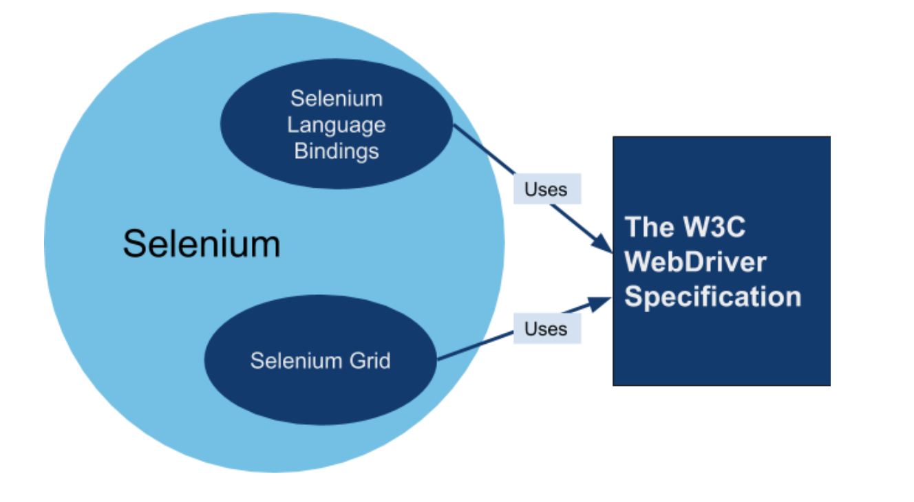
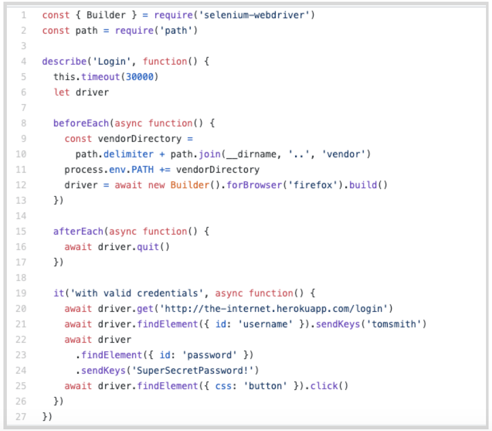

summary: Module 1 Introduction to Selenium with JavaScript
id: Module1-SeleniumJS
categories: First draft
tags: Beginner
status: work in progress
authors: Lindsay Walker
Feedback Link: https://forms.gle/CGu4QchgBxxWnNJK8

# Module 1 — Introduction to Selenium with JavaScript

<!-- ------------------------ -->

## 1.01 What You’ll Learn

This module will focus on topics from _The Selenium Guidebook_ _JavaScript Edition_ By Dave Haeffner, chapters 1-4, with instructions on how to set up an environment on your local machine with libraries, dependencies, browsers, and IDEs. This module touches on an introduction and the Selenium WebDriver, explaining and installing dependencies, and setting up and getting started with a JS test on your local machine. This module also has a brief overview of JavaScript and the different code elements in an examples test class.

### Objectives

*   Be able to install and learn how to use Selenium
*   Use NodeJS along with npm to run local tests and manage dependencies on your machineWebDriver in conjunction with a JavaScript framework (Mocha) to write tests
*   Understand what the Selenium WebDriver is and the basics of how it is used to automate testing
*   Understand the role a test runner such as Mocha plays in creating tests
*   Differentiate between the Selenium language bindings and the web drivers for different browsers
*   Know how npm manages and updates packages and tools used for Selenium Testing in JavaScript
*   Explain how Selenium bindings, web drivers, and mocha work together to create tests and test suites
*   Understand that good tests are atomic, with test grouped by functionality, named descriptively, use test runners, and are maintained in version control systems
*   Create and maintain a project folder with your test suite & dependencies, with separate folders for page and test classes

<!-- ------------------------ -->
## 1.02 What is Selenium?

Selenium is an open source tool used for automating testing of web applications. Without  automated testing, each time a web application was updated, a human would have to go on to the website and try out every possible combination of clicks, interactions, and submissions. If you are able to automate your testing, when an update is made, you simply run your test with the ‘robot’ that is Selenium, which performs programmed sets of interactions for you to test new features and functionality before an updated version of a web app is released into the wild.

Selenium is a robotic testing tool (not a framework) it expresses no judgement, nor does it help you test. In order to orchestrate the how tests are run, and report on the things that Selenium does, you need a framework, which we will go over later.

### The Seven Basic Steps of Selenium Tests

There are seven basic elements of a Selenium test script, which apply to any test case and any application under test (AUT):

1. Create a WebDriver instance.
2. Navigate to a Web page.
3. Locate an HTML element on the Web page.
4. Perform an action on an HTML element.
5. Anticipate the browser response to the action.
6. Run tests and record test results using a test framework.
7. Conclude the test.

The Selenium Grid allows you to run parallel tests on multiple combinations of machines (e.g., Mac, Windows, or Unix-based systems) using multiple web browsers (versions of Chrome, Edge, Firefox, Safari). These different machines can exist virtually on a server in a cloud environment, or as a network of real devices. JSON is used to communicate test requirements and route it to different nodes which have different environments to test on.

The Sauce Labs platform enables you to use a Selenium Grid at scale to run thousands of tests at once, on our suite of different test environments in the cloud. Sauce also has a robust dashboard for easy viewing of test outcomes and increased velocity of debugging tests. This dashboard includes tracking of errors and even a visual record of what occurred in different environments.

As your test suite grows, your test runs will take longer to complete. To speed them up you will want to run them in parallel, which is where the benefit of having your own servers or using a cloud provider comes in -- that, and the ability to have numerous browser and operating system combinations to run your tests on.

This course focuses on the fourth version of Selenium that supports communication via the W3C WebDriver. All modern web browsers are also built in compliance with this protocol (a set of rules on how to communicate), which means Selenium 4 can be used with any programming language and any browser/ OS environment. With W3C you can discover and manipulate elements on a page in order to test their functionality.

Selenium is really good at a specific set of things. If you know what those are and stick to them then you can easily write reliable, scalable, and maintainable tests that you and your team can trust.

### What Selenium Is and Is Not Good At

Selenium is built to automate browsers, specifically human interaction with them. Things like navigating to pages, clicking on elements, typing text into input fields, etc.

It's less ideal for checking lower-level functionality like HTTP status codes or HTTP headers. While you can use Selenium this way, it requires additional setup of a third-party tool.

<!-- ------------------------ -->
## 1.03 What is the W3C WebDriver?

The WebDriver protocol consists of rules for communication between the client on the local end, which use languages and libraries like Java, Ruby, JavaScript, etc. and a web browser. The local end (your computer) communicates with the remote end node on the server side. The web driver defines how the remote end can behave, and the method for how the remote end receives information. As an example, the Selenium WebDriver provides instructions to the browser on how to click or type into elements on a page. This is then communicated to specific browser drivers, such as Chromedriver (for the Chrome browser) or Geckodriver (for the Firefox browser) and the commands are carried out.

The code that Selenium provides to you as a developer (the libraries) is called a Selenium language binding. It ‘binds’ together the JavaScript code you write for actions and tests with things that WebDriver can understand. You also need to use You also need to use webdrivers such as Chromedriver and Geckodriver.

 

Mocha is a JavaScript library/ package that allows you to communicate with Selenium and run unit tests. It also helps orchestrate test execution. This JavaScript language binding (Selenium WebDriver methods written in JavaScript) allows you to leverage the features specified by the W3C WebDriver protocol.

### Quiz

<!-- blank line
<iframe src="https://docs.google.com/forms/d/e/1FAIpQLSfF6_0V7jEE9JYF4vWDUsHTuYYHnQbaEsMGtfeTcr8arxZgzg/viewform?embedded=true" width="640" height="1240" frameborder="0" marginheight="0" marginwidth="0">Loading…</iframe>
-->

<!--
1. Which is the latest version of Selenium, which is compatible with the W3C Web Driver Protocol?
    1. 1
    2. 2
    3. 4
    4. 10
2. Which of the following is the main dependency that allows your JS code to communicate with the Firefox browser?
    5. Chromedriver
    6. Maven
    7. Mocha
    8. Geckodriver
3. Selenium is a…
    9. Framework
    10. A reporting tool for tests
    11. Robot
    12. Comprehensive tool with everything you need for running tests
    -->

<!-- ------------------------ -->
## 1.04 Test Frameworks and Dependencies

A test framework includes code libraries as well as rules and conventions for setting up tests. When it comes to testing frameworks, there are three basic pieces that go into creating a framework

*   **Test Runner** - A library or tool that takes the tests you write, along with settings you have configured in your tests, and executes them. It orchestrates the execution of the tests, controlling what is run when and in what order. This is where Mocha comes in for this course.
*   **Robot** - Performs the actual actions on the browser. In this case, Selenium is the robot used to perform the interactions.  It is a protocol that tells the browser to locate elements and perform actions on a page.
*   **Reporting** - This is the mechanism for providing information to the humans who have run the automated tests. It provides a summary of test activities and results.

A good framework combines best practices for structuring and writing code, along with structure how data is handled and stored, enabling you to write test code that is reusable and will have less need for maintenance.

Frameworks provide both tools and guidelines for creating and designing test suites. They can include coding standards, test-data handling methods, object repositories, processes for storing test results, or information on how to access external resources.

So far, you’ve learned a bit about how the code on your end communicates with the W3C WebDriver using Selenium, however, this isn’t the whole picture. There are other tools that are used in order for you to write test code and implement it. Usually there are runners frameworks used alongside the “vanilla” (plain) programming language that help give structure, create commands, manage & organize files, store data, and more. In this course, we’ll use the Mocha as a test runner and build up our own framework.

Above is an example of how you might connect a framework with the selenium grid that then executes tests with the Selenium WebDriver. tools you use when you write code, the more these frameworks will make sense.

As you learn more about the different tools you use when you write code, they will make more sense.

<!-- ------------------------ -->
## 1.05  Installing Dependencies

We need five dependencies in order for our test to run as planned, which we will install later on, and for now we will get set up to do that. In this module, we’re going to install and set up the NodeJS server, create a project folder and install npm so that later on we can install all the dependencies. The dependencies include WebDrivers that communicate with different browsers, as well as Mocha, a Javascript framework/ library that allows you to write actual tests.

Go to [https://nodejs.org/en](https://nodejs.org/en/), download and install the NodeJS software.

Download and install the correct version of NodeJS for your machine. NodeJS is a server that will run on your machine so that you can send and receive files and data with other endpoints.

Now, create a project folder in your user directory. I named mine SeleniumJS.

In Terminal:

_** If you already have experience with the NodeJS server, and know how to install npm in a project folder, you can skip the rest of this (on to 1.05). You can also skip to the end to pull the code from the GitHub repository._

Now we are going to install npm. When we run the command npm install, it will download dependencies defined in a package.json file and generate a node_modules folder with the installed modules.

1. Navigate to the folder you just made from the terminal. 
2. Run npm install from the terminal. 
3. If you open your file folder, you should see the folder ‘node_modules’ as well as package.json and package-lock.json.

Later on when you set up your first test, you will go back to the ‘SeleniumJS’ folder you just set up and create your first project files there.

#### NOTE

_if you are using Github, it is recommended that you [delete the package-lock.json](https://www.codementor.io/@johnkennedy/get-rid-of-that-npm-package-lock-json-e0bj7ai42) file._

### Use GitHub Repository (Optional)

If you are familiar with using GitHub to write your code, you can also fork/ branch this repository here for the first set of code:

**[Module 1 Project Folder](https://github.com/walkerlj0/Selenium_Course_Example_Code/tree/master/code-examples/javascript/Mod1)**

#### NOTE

If you download this project, you should open the directory (1.05) in your terminal and run npm install before trying to write any tests.

#### Cheat Sheet

If you would like to configure each driver without npm, use the **[Cheat Sheet](https://docs.google.com/document/d/1tQn9JSZ2I6wlNM13LtQ5hh5GN-aSMrvgInBk5LxiELI/edit?usp=sharing)**.
<!--  -->
<!-- ------------------------ -->

## 1.06 Editing Code & JavaScript Summary

Let’s take a look at the first test we will set up in the next module:

 

Different functionality in the code is available because of the different libraries, frameworks, and drivers that are pulled together to set up your test suite. Some commands and functions are part of the ‘vanilla’ JavaScript language, while others are provided as a part of the Mocha dependency we will install. Last but not least, Selenium provides functionality that allows your test code to communicate with different web browsers.

### JavaScript Methods

**Async/ [Await ](https://developer.mozilla.org/en-US/docs/Web/JavaScript/Reference/Statements/async_function)-** Used inside of simple JS functions, this function is used to ‘pause’ the work of a function. Each time an ‘await’ method is called, the code will pause and wait for a promise to be returned before running through the next commands in the function.

#### Mocha Library Elements

**[BeforeEach() & AfterEach() ](https://mochajs.org/#qunit)** These are hooks provided by the Mocha framework to set up conditions before and clean up after each individual test.

**[describe() ](https://mochajs.org/#run-cycle-overview)**- Used for grouping test cases and setting up the test. It takes two arguments, the first is the name of the test group, and the second is a callback function. Used with BDD Style testing.

**[ it()-](https://mochajs.org/#run-cycle-overview)** Used to create / group individual tests

#### Selenium Elements

**driver** variable with **[driver.get(), driver.findElement](https://www.selenium.dev/selenium/docs/api/javascript/module/selenium-webdriver/)**

The driver variable instantiates a WebDriver session/ object, then you can use JS commands for that driver.

**[{ Builder }](https://www.selenium.dev/selenium/docs/api/javascript/module/selenium-webdriver/index_exports_Builder.html)**

Builds the WebDriver instance & specified target browser, remote URLs, and more.

### Asynchronous Programming

An important element of test code is the use of promises and waits. Much of what occurs in a test is a sequence of actions, with many of the actions needing to wait to be executed until a previous command  has been carried out. This is called Asynchronous programming. Often, it is important to define in your code the need to ‘await’ the occurrence of another action. For example, you would not want to click the login button until you have made sure that the username and password has been entered.

In many languages, without the await command, the code will try and run through as many processes or commands as possible, which can be a good thing when you’re trying to load a webpage or get something done quickly. In the case of test code, however, it is important to make sure that commands are carried out in a certain order.

<!-- ------------------------ -->

## 1.07 Module 1 Quiz

<!-- blank line
<iframe src="https://docs.google.com/forms/d/e/1FAIpQLScxdog5n8yTVeEd-FIbk4aMslA87ZCWB5rogfpwSMlavb_alg/viewform?embedded=true" width="640" height="1962" frameborder="0" marginheight="0" marginwidth="0">Loading…</iframe>
 -->

<!--
1. Which of the following provide both tools and guidelines for creating and designing test suites?
    1. JavaScript
    2. Selenium WebDriver
    3. NodeJS
    4. Frameworks
2. What does using the npm install command do, and why is it helpful? (Choose the most correct answer)
    5. `npm install `installs Selenium, JavaScript, and Mocha without you having to do anything, making it easy for you to set up.
    6. `npm install` creates the package.json file which makes it so you don’t have to install any dependencies.
    7. `npm install` helps you install and keep the different dependencies like selenium and mocha up to date, according to what you specify in package.json.
    8. `npm install` makes sure that the Selenium web driver you have installed is up-to-date and compliant with W3C standards so it works with all browsers.
3. What is Asynchronous programming?
    9. Asynchronous programs allow you to write code that communicates with any web browser.
    10. Asynchronous programs allow you to write code step-by-step that wait for the execution of one command before executing the next command.
    11. Asynchronous programs allow you to run many commands at once, optimising for speed and performance.
    12. Asynchronous commands all many people to write commands in the same test suite.
4. Which of the following are code elements from the Mocha library?
    13. The await command.
    14. The const command to declare a variable.
    15. The driver variable.
    16. The it() function.
5. Which of the following best describes what the Selenium WebDriver is?
    17. A Protocol
    18. A JavaScript Function
    19. A JavaScript Framework
    20. A Server in the Cloud
    -->
