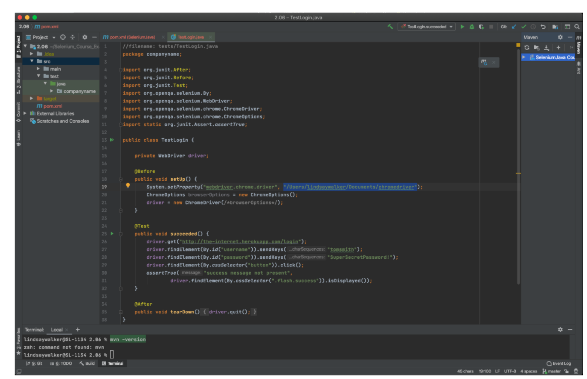

author:Lindsay Walker
summary: Module 1 of the Selenium Java Test Automation. Learn to write Selenium tests in Java language using the JUnit framework, IntelliJ, and Jenkins.
id: Module1-SeleniumJava
categories: beginner
tags: java  
environments: Web
status: Published
feedback link: https://forms.gle/CGu4QchgBxxWnNJK8
analytics account: UA-6735579-1

<!-- ------------------------ -->
# Module 1- Introduction to Selenium with Java

<!-- ------------------------ -->
## 1.01 What You'll Learn
Duration: 0:03:00

*   Learn to install and use Selenium WebDriver in conjunction with Java tools (IntelliJ and Maven) to write tests.  
*   Use----- and ---to compile and run tests and manage dependencies on your machine
*   Use the Selenium WebDriver in conjunction with a --------- test runner to write tests
*   Understand what the Selenium WebDriver is and the basics of how it is used to automate testing
*   Understand the role a test runner, such as ------, plays in creating tests
*   Differentiate between the Selenium language bindings and the web drivers for different browsers
*   Know how ------ manages and updates packages and tools used for Selenium testing in --------
*   Explain how Selenium bindings, web drivers, and ---------- work together to create tests and test suites
*   Understand that good tests are atomic: They have tests grouped by functionality and are named descriptively. Good tests also use test runners, and are maintained in version control systems.

<!-- ------------------------ -->
## 1.02 What is Selenium?
Duration: 0:05:00

Selenium is an open source tool used for automating testing of web applications. Without  automated testing, each time a web application was updated, a human would have to go onto the website and try various combinations of clicks, interactions, and submissions. If you  automate your testing with a tool like Selenium, when an update is made, you can write and run tests with the “robot” that is Selenium, which performs programmed sets of interactions for you to
test new features and functionality before an updated version of a web app is released into the wild.


Selenium is a robotic testing tool, not a framework. It expresses no judgement, nor does it help you test. In order to orchestrate how tests are run, and report on the things that Selenium does, you need a framework, which will be covered later on.


### The Seven Basic Steps of Selenium Tests

There are seven basic elements of a Selenium test script, which apply to any test case and any application under test (AUT):


1. Create a WebDriver instance.
2. Navigate to a Web page.
3. Locate an HTML element on the Web page.
4. Perform an action on the HTML element.
5. Anticipate the browser response to the action.
6. Run tests and record test results using a test framework.
7. Conclude the test.

The Selenium Grid allows you to run parallel tests on multiple combinations of machines (Mac, Windows, or Unix-based systems) using multiple web browsers (versions of Chrome, Edge, Firefox, or Safari). These different machines can exist virtually on a server in a cloud environment, or as a network of real devices. JSON is used to communicate test requirements and route those requirements to different nodes, which have different environments to test on.


The [Sauce Labs](https://saucelabs.com/?utm_source=referral&utm_medium=LMS&utm_campaign=link) platform enables you to use a Selenium Grid at scale to run thousands of tests at once, on our suite of different test environments in the cloud. Sauce also has a robust dashboard for easy viewing of test outcomes and increased velocity of debugging tests. This dashboard includes tracking of errors and even a visual record of what occurred in different environments.

As your test suite grows, your test runs will take longer to complete. To speed them up, you will want to run them in parallel, which is where the benefit of having your own servers or using a cloud provider comes in -- that, and the ability to have numerous browser and operating system combinations to run your tests on.

This course focuses on the fourth version of Selenium, which supports communication via the W3C WebDriver protocol. All modern web browsers are also built in compliance with this protocol (a set of rules on how to communicate), which means Selenium 4 can be used with any programming language and any browser and OS combination in your environment. With the W3C protocol, you can discover and manipulate elements on a page in order to test their functionality.

Selenium is really good at a specific set of things. If you know what those are and stick to them, then you can easily write reliable, scalable, and maintainable tests that you and your team can trust.


### What Selenium Is and Is Not Good At

Selenium is built to automate browsers and human interaction with them. This can include things like navigating to pages, clicking on elements, typing text into input fields, etc.

It is less ideal for checking lower-level functionality, like HTTP status codes or HTTP headers. While you can use Selenium this way, it requires third-party tools.

<!-- ------------------------ -->
## 1.03 What is the W3C WebDriver Protocol?
Duration: 0:05:00

The WebDriver protocol consists of rules for communication between the client on the local end, -- which uses languages and libraries like Java, Ruby, Python, or JavaScript -- and a web browser. The local end (your computer) communicates with the remote end node on the server side. The web driver defines how the remote end can behave, and the method for how the remote end receives information. As an example, the Selenium WebDriver provides instructions to the browser on how to click or type into elements on a page. This is then communicated to specific browser drivers, such as Chromedriver (for the Chrome browser) or Geckodriver (for the Firefox browser) and the commands are carried out.

The code that Selenium provides to you as a developer (the libraries) is called a Selenium language binding. It binds together the Python code you write for actions and tests with things that WebDriver can understand.


`

Python uses the driver method to interact with Selenium. When you use it, you instantiate a web driver, and then you have access to methods allowed by the web driver. Selenium uses the driver to automate and manipulate elements in the browser. Some examples of drivers include Chromedriver for the Chrome browser or Geckodriver for the Firefox browser.

------- is a -------- library/package that allows you to communicate with Selenium and run unit tests. It also helps orchestrate test execution. This -------- language binding (Selenium WebDriver methods written in --------) allows you to leverage the features specified by the W3C WebDriver protocol.


#### Quiz


<!-- ------------------------ -->
## 1.04 Test Frameworks and Dependencies
Duration: 0:05:00

A test framework includes code libraries as well as rules and conventions for setting up tests. When it comes to testing frameworks, there are three basic pieces that go into creating a framework.

**Test Runner –** A library or tool that takes the tests you write, along with settings you have configured in your tests, and executes them. It orchestrates the execution of the tests, controlling what is run when and in what order. For this course, we will be using the ------ test runner.

**Robot –** Performs the actual actions on the browser. In this case, Selenium is the robot used to perform the interactions. It is a protocol that tells the browser to locate elements and perform actions on a page.

**Reporting –** This is the mechanism for providing information to the humans who have run the automated tests. It provides a summary of test activities and results.

A good framework combines best practices for structuring and writing code, along with structure for how data is handled and stored, enabling you to write test code that is reusable and will have less need for maintenance.

Frameworks provide both tools and guidelines for creating and designing test suites. They can include coding standards, test-data handling methods, Page Object Models, processes for storing test results, and information on how to access external resources.

So far, you’ve learned a bit about how the code on your end communicates with the W3C WebDriver using Selenium. This isn’t the whole picture, however. There are other tools that enable you to write and implement test code. Usually, runners and frameworks are used alongside the base programming language that help give structure, create commands, manage and organize files, store data, and more. In this course, we will use ------- and methods with -------- and Selenium to write our tests.


Above is an example of how you might connect a framework with the Selenium grid that then executes tests with the Selenium WebDriver.

In the exercises that follow, you will learn more about the different tools you use when you write code, and the roles that the different elements play in your test suites and the execution of tests will become more clear.


<!-- ------------------------ -->
## 1.05  Installing Dependencies
Duration: 0:15:00


You will need several dependencies dependencies in order for our test to run as planned, and now we will get set up to do that. In this module, you’re going to install a program called Homebrew, which will help install Python version 3 and manage it's dependencies.

If you are installing Python on a Widows of Linux machine, you can follow the instructions found on [_The Hitchikers Guide to Python_](https://docs.python-guide.org/starting/installation/)

#### NOTE

In order to install Jenkins on the Mac, Jenkins has opted to enlist the help of another tool called [Homebrew](https://brew.sh/). Homebrew makes it easier to install and keep other files and software up to date on your machine. To install brew, [go to the website](https://brew.sh/) to view instructions. Copy and paste the command on there into your terminal:


```
/bin/bash -c "$(curl -fsSL https://raw.githubusercontent.com/Homebrew/install/master/install.sh)"
```


If you type in `brew info` in your terminal, and you have homebrew installed correctly, you should see something like this:


The Homebrew installation should also update the PATH veriable when you install it, so other programs on your computer know how to access it.

--

###Installing Python

Once you have brew installed, it's easy to install python by typing this command into your terminal:

```
$ brew install python
```

The nice thing about Homebrew is that it will automatically download the laterst version of Python. Once it's installed, you should see a message letting you know where it installed your version of Python:


Homebrew may have installed several versions of Python. YOu can check which version you are useing by typing `python --version` If it is not version 3, you can switch versions with the command

``

Next, create a project folder and install pip so that later on we can install other dependencies. The dependencies include WebDrivers that communicate with different browsers, as well as----, a --- framework/ library that ----

Go to [](), download and install the Python software.

Download and install

// ...

**Python–** A -----, ------ typed language // ... before you are able to run Selenium tests locally or in the cloud. .

**Package Manager –** Manages other required dependencies, as well as builds any application code you create. // ...

**Test Runner –** An open-source, J// ...

** IDE & Debugger –** This tool helps with the writing, debugging, and organization of your code. This includes features that make your code easier to read and organize. // ..


### Install ...

// ...

Note: These instructions are for a MacOS operating system. If you are using another system, use the [documents here for setup instructions](https://github.com/saucelabs-training EDIT THIS ROOT DIR).


#### Cheat Sheet


### Use GitHub Repository (Optional)

If you are familiar with using GitHub to write your code, you can also fork/ branch this repository here for the first set of code:

**[Module 1 Project Folder](EDIT)**

<!-- ------------------------ -->
## 1.06 Editing Code and XXX Summary
Duration: 0:10:00

Take a look at the first test code we will be creating in the next module. There are several things at play:

**[Module 1 Project Folder](https://github.com/walkerlj0/Selenium_Course_Example_Code/blob/master/java/Mod1/1.06/src/test/java/companyname/TestLogin.java)**


### Language Methods


**Example method** – Description


### Testrunner Methods

**[example method ](link) –** Description


### Selenium Elements

**driver variable with** driver.get(), driver.findElement, driver.* **– The driver variable instantiates a WebDriver session/ object, and then you can use Java commands for that driver.

**[Driver.quit](https://artoftesting.com/difference-between-driver-close-and-driver-quit-command-in-selenium-webdriver) –** An important Selenium command to use within **@After**s annotations, this closes any browser windows that may be open and terminates the WebDriver session.

You can see an example of the project we will begin to be setting up in the next module [here.](https://github.com/walkerlj0/Selenium_Course_Example_Code/tree/master/java/Mod1/SeleniumJava%20copy/src/test/java/companyname)

<!-- ------------------------ -->

## 1.07 Module 1 Quiz
Duration: 0:03:00


