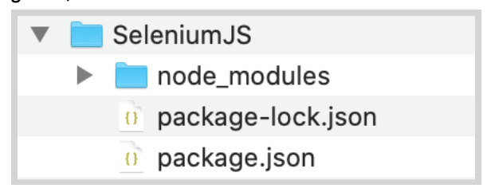
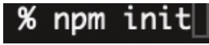
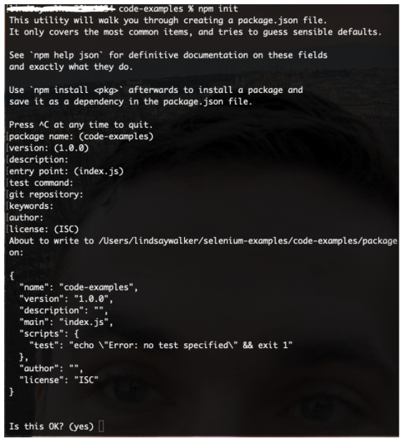
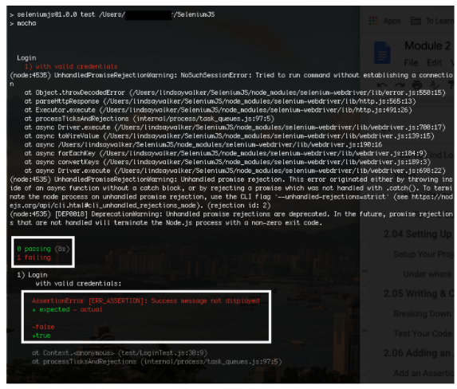

author:Lindsay
summary: Module 2 of the Selenium JavaScript course. Learn to write Selenium tests in JavaScript using npm and Mocha.
id: Module2-SeleniumJS
categories: intermediate
tags: javascript
environments: Web
status: Published
feedback link: https://forms.gle/CGu4QchgBxxWnNJK8
analytics account: UA-6735579-1

<!-- ------------------------ -->


# Module 2 — Locators and JavaScript Tests
<!-- ------------------------ -->

## 2.01 What You’ll Learn
Duration: 0:05:00

This module is derived from content in chapters 6-7 of _The Selenium Guidebook_ _JavaScript Edition_ By Dave Haeffner. This module will touch lightly on how to write a basic test, and teach users about how to set up a project, as well as learn about how Selenium locates and interacts with elements on a “page”, which can be any view or even object within a webpage.


### Objectives


*   Use NodeJS along with npm to run local tests and manage dependencies on your machine
*   Understand that good tests are atomic: They have test grouped by functionality, and are named descriptively. Good tests also use test runners, and are maintained in version control systems
*   Create and maintain a project folder with your test suite & dependencies, with separate folders for page and test classes
*   Be able to define a test strategy and use a testing strategy like BDD and TDD to create test cases
*   Use the browser dev tools console to test locators on the page using elements such as class, id, XPath, and more
*   Demonstrate the ability to choose and verify locators for a test class and write code that successfully uses the locators
*   Write a test case with `BeforeEach()` and `AfterEach()` functions and an assertion, then run it successfully on your local machine
*   Write and validate tests that can both succeed and fail, while planning for different failure scenarios (and methods that generate error messages) for those different scenarios
*   Analyze and plan test suites, learning how to balance the size and maintainability (ability to check failed tests) against the amount of features you want to test, as well as the level of abstraction you want to use to make modular objects to use in your test suite


### Base Code

If you skipped Module 1, make sure you have a project folder set up and have created the following files, as well as have NodeJS installed and init for this project:


<!--  -->


#### NOTE

_if you are using Github, it is recommended that you [delete the package-lock.json](https://www.codementor.io/@johnkennedy/get-rid-of-that-npm-package-lock-json-e0bj7ai42) file._

--

### Use GitHub Repository (Optional)

If you are familiar with using GitHub to write your code, you can also fork/ branch this repository here for the first set of code:

**[Module 1 Project Folder](https://github.com/walkerlj0/Selenium_Course_Example_Code/tree/master/javascript/Mod1/1.05)**

<!-- ------------------------ -->
## 2.02 Writing Good Acceptance Tests
Duration: 0:10:00

Acceptance tests are an important final step to take when releasing anything you may have designed, to make sure that the software you have created meets the requirements and specifications laid out when you designed and planned your application or platform. Automated testing is an integral tool to use to efficiently and accurately test your product for release.

 In order to write automated web tests that are easy to maintain, perform well, and are ultimately resilient, there are some simple guidelines to follow:

 *   Write atomic and autonomous tests
 *   Group like tests together in small batches
 *   Be descriptive
 *   Use a Test Runner
 *   Store tests in a Version Control System

### Atomic & Autonomous Tests

 Each test needs to be concise (e.g., testing a single feature rather than multiple features) and be capable of being run independently (e.g., sets up its own data rather than relying on a previous test to do it). [Learn more in the Sauce Cookbook](https://wiki.saucelabs.com/display/DOCS/Best+Practices%3A+Use+Small%2C+Atomic%2C+Autonomous+Tests?utm_source=referral&utm_medium=LMS&utm_campaign=link).

Doing this may require a mental shift, discipline, and more upfront effort, but it will make a dramatic impact on the quality, effectiveness, and maintainability of your tests, especially when you get into parallel test execution.


Image Source: [Medium Article](https://medium.com/swlh/creating-fast-reliable-focused-ui-automation-with-atomic-tests-582e4318c0bb)

### Grouping Tests
As your test suite grows, you will have numerous test files. Each file contains a group of tests that have similar functions. For example, you would have one directory for the files that are designed to locate and interact with the page, and another directory for files that perform tests (test to check if something does or does not happen when you interact).

### Being Descriptive
<!--  -->
A test file should have a high level name that describes what the group of tests within it are doing. Each individual test with the test files should also have an informative name to describe the action each test is taking. In this case, descriptive names are better than concise names. Also, each test or grouping of tests should include some helpful tags or categories, which can provide additional information about the test as well as enable flexible test execution. This way, you can run all or part of your test suite, and the results will inform the tester what is being tested, as well as accurately identify what goes wrong.


<!--  -->

This also enables developers to run a subset of tests to exercise functionality they just modified and enable you to use  a Continuous Integration (CI) server to run the right groups of tests at the right time for fast and dynamic feedback. It is helpful to be able to identify which tests you run when you only make changes to certain parts of an application. You may also want to have a subset of tests that is run regularly, on a nightly or weekly basis, to verify performance regularly, so using a certain category of tests for a regular test deployment can be helpful.

### Test Runners
At the heart of every test suite is some kind of a test runner like Mocha that does a lot of the heavy lifting such as test execution, centralized configuration, and test output. In this course, we will be using the Mocha test runner. Rather than reinvent the wheel, you can use one of the many test runners that exist today. With it you can bolt on third party libraries to extend its functionality if there's something missing.

### Version Control
In order to effectively collaborate with other testers and developers on your team, your test code must live in a version control system. Look to see what your development team uses and add your code to it. In the examples in this course, we will be providing code samples from GitHub.

### [BDD and TDD](https://saucelabs.com/blog/a-two-minute-bdd-overview)
<!--  -->
Behavior Driven Development and Test Driven Development are two important strategies to help you understand how to write effective tests. [BDD](https://cucumber.io/blog/bdd/bdd-is-not-test-automation/) is a collaborative process that focuses on starting with a business value or need. It’s a feature and epic-centric approach to create a requirements analysis. With both BDD and TDD, you plan to write the code for the test first (application code comes later).


<!--  -->

[TDD](https://saucelabs.com/blog/the-state-of-test-driven-development) is a more granular step that should be taken after a BDD plan is created. The general process involves writing a failing test for particular features (determined previously with the BDD process), then the developer writes the code to lead to a successful run of this test. The goal is to be able to write failing tests that can be turned into a passing test with minimal code modification, and no change to dependencies, base pages, or configuration files.


<!-- ------------------------ -->

## 2.03 Defining a Test Strategy and Picking a Framework.
Duration: 0:05:00

A great way to increase your chances of success with automated web testing is to first map out a testing strategy. The best way to do it is to answer these four questions:


*   _How does your business make money?_
*   _What features in your application are being used?_
*   _What browsers are your users using?_
*   _What things have broken in the application before?_


### What to Do with the Answers

After answering these questions, you should end up with a prioritized punch list or backlog of test automation tasks that you can choose tasks from, and track progress against.


#### Question 1: What is the Value?

Every company's application makes money (or generates value) through core functionality that is defined by a series of increasingly-valuable user interactions known as a "funnel". Your answers to this question will help you determine what your funnel is.

These items will be your highest priority for automation. Start an automation backlog to keep track of them.


#### Question 2: What Does Usage Data Say?

Odds are your application offers a robust set of functionality well beyond your funnel. Your answers to this question will help highlight what it is. And if you're basing these answers on usage data like those obtained from Google Analytics, then you can see which features and functionality are more frequently used than others.

When you data shows certain functions, features, and flows are frequently used, consider adding them as a priority for your automated testing suite.


#### Question 3: Which Browsers?

Now that you know what functionality is business critical and widely adopted by your users, you need to determine what browsers to focus your automated web testing efforts on. Your usage data will tell you this as well. It will help you determine which browsers you can reasonably avoid testing in (based on non-existent or low usage numbers).

Note the top 2 (or 3 depending on your numbers), but focus on the top 1 for now. This is the browser you will start using for automation.


#### Question 4: What are the Risky Bits?

To round out the strategy, it is also best to think about what things have broken in the application before. To answer this question, it's best to check your defect/bug tracker (if you have one) and to ask your team. What you end up with may read like a laundry list of browser specific issues or functionality that has been flaky or forgotten about in the past. But it's all useful information.

Be sure to check this list against your automation backlog. If something's not there, add it to the bottom of the backlog. If it is there, make a note in the backlog item that it has been an issue in the past.

If the issue has happened numerous times and has the potential to occur again, move the item up in the backlog. And if issues keep cropping up that are related to a specific browser, compare this browser to your short list of browsers from question \#3. If it's a browser that's not in your list but it's still important (e.g., a small pocket of influential users), track it on the backlog, but put it at the bottom.


### Now You are Ready

Having answered these questions, you should now have a prioritized backlog of critical business functionality, a short list of browsers to focus on, and an understanding of the risky parts of your application to watch out for. With it, you're on the right track — focusing on things that matter for your business and its users.

<!-- ------------------------ -->

## 2.04 Finding & Testing Locators in the Browser
Duration: 0:15:00


### How to Find Locators

The simplest way to find locators is to inspect the elements on a page. The best way to do this is from within your web browser. Fortunately, popular browsers come pre-loaded with development tools that make this simple to accomplish.

When viewing the page, right-click on the element you want to interact with and click **Inspect Element**. This will bring up a small window with all of the markup for the page but zoomed into your highlighted selection. From here, you can see if there are unique or descriptive attributes you can work with.


If you're fortunate enough to be working with unique IDs and classes, then you're usually all set. But when you have to handle more complex actions like traversing a page, or you need to run down odd test behavior, it can be a real challenge to verify that you have the right locators to accomplish what you want.


#### Video

Watch [Finding Locators with Dev tools](https://www.youtube.com/watch?v=l_oOa7LeHqI&feature=youtu.be) on using locators and follow along in your browser.

 

Use the following notes to help you use the inspector to test elements. Later you will test elements with your code. You can use the webpage here to follow along:

**[https://www.saucedemo.com/](https://www.saucedemo.com/)**


#### Locator Strategies


Find more on [XPath here](https://yizeng.me/2014/03/23/evaluate-and-validate-xpath-css-selectors-in-chrome-developer-tools/)

### How to Find Quality Elements

You want to find an element that is unique, descriptive, and unlikely to change.

Ripe candidates for this are `id` and `class `attributes. Whereas text (e.g., the text of a link) is less ideal since it is more apt to change. If the elements you are attempting to work with don't have unique `id` or `class` attributes directly on them, look at the element that houses them (a.k.a. the parent element). Oftentimes the parent element has a unique element that you can use to start with and walk down to the child element you want to use.

When you can't find any unique elements have a conversation with your development team letting them know what you are trying to accomplish. It's typically a trivial thing for them to add helpful semantic markup to a page to make it more testable. This is especially true when they know the use case you're trying to automate. The alternative can be a lengthy and painful process which might yield working test code but it will be brittle and hard to maintain.

Once you've identified the target elements and attributes you'd like to use for your test, you’ll need to craft locators using one of Selenium's strategies.

Selenium is able to find and interact with elements on a page by way of various locator strategies. The list includes (sorted alphabetically):


*   Class  in the HTML
*   CSS Selector
*   ID
*   Link Text
*   Name
*   Partial Link Text
*   Tag Name
*   XPath


### Quiz


<!--

A.  Selenium, Mocha

B. BDD, TDD

C. TDD, BDD

D.  Mocha, Selenium

2. Which of the following questions about your test strategy is the most important and involves tracking real user interactions through your app?

A. What is the Value?

B. What Does Usage Data Say?

C.  Which Browsers?

D.  What are the Risky Bits?

3. Which of the following commands, typed into the console of the inspector, would return this element?


A.  `$x("//*[@id="content"]/div[1]/")`

B.  `$x("//*[@id=\"content\"]/div[1]/div[1]")`

C.  `$x(“//*[@id=\"large-2 columns\"]/div[1]/div[1]”)`

D. `$x(//*[@id="large-2 columns"]/div[1]/div[1])`

-->

<!-- ------------------------ -->

## 2.05 Setting Up Your First Test
Duration: 0:10:00

Here's the markup for a standard login form (pulled from the login example app on [the-internet](http://the-internet.herokuapp.com/login).


```
<form name="login" id="login" action="/authenticate" method="post">
     <div class="row">
          <div class="large-6 small-12 columns">
              <label for="username">Username</label>
              <input type="text" name="username" id="username">
          </div>
     </div>

    <div class="row">
        <div class="large-6 small-12 columns">
            <label for="password">Password</label>
            <input type="password" name="password" id="password"> </div>
        </div>
            <button class="radius" type="submit"><i class="icon-2x    
             icon-signin"> Login</i>
            </button>
</form>


```


Notice the element attributes on the form. The username input field has a unique` id `, as does the password input field. The submit button doesn't, but it's the only button on the page so we can easily find it and click it.

Let's put these elements to use in our first test.


### Setup Your Project File


First we will need to create a new project directory called `SeleniumJS` (your main project directory), and inside create a folder named `test` inside that project directory. This is a default folder that Mocha will know to look for.


You can see all of the files here.

**_[Selenium_Course_Example_Code ](https://github.com/walkerlj0/Selenium_Course_Example_Code)_**


Go into the SeleniumJS (your main project) directory using your terminal. Type the command npm init.


<!--  -->

This will set up a new node package in the folder. Hit enter (and enter any information you wish to add) to run the init. If you are creating this in the repo, make sure you put it in the ‘code-examples’ file.




In your file we'll create a new test file called `LoginTest.js`. Next, we will install dependencies using npm. You should already have a folder name node_modules in your `SeleniumJS` folder, as well as a file called` package.json`. Open `package.json`.  in your IDE, and under` licences`, add in `dependencies `and the following:


```
"dependencies": {
    "geckodriver": "^1.19.1",
    "mocha": "^8.0.1",
    "chromedriver": "83.0.0",
    "selenium-webdriver": "4.0.0-alpha.7",
    "mocha-parallel-tests": "2.3.0"
}
```


#### NOTE

 the versions of the dependencies may have changed to a more updated version, or need a different version for your tests. If you have nom installed, it should auto-complete the most recent versions.

 --

Under where it says directories and scripts, change the value of `"test" `to `"mocha"`


```
"directories": {
    "test": "mocha"
  },
  "scripts": {
    "test": "mocha"
  },

```


and edit to look as follows:


#### NOTE

The versions of each of the dependencies will change over time. If you have an IDE, it will give you options for each one & auto-fill the most recent version for you if you use npm. Otherwise, research what the most recent or best version of each dependency is.

--

After you have adjusted the package.json file, go to the terminal (make sure you are in your ‘SeleniumJS’ project folder that you made, or the ‘javascript’ folder from the repo and enter


<!--  -->


This will pull the dependencies you listed in package.json to your project so you can use those libraries and frameworks to write your test code and interact with the browser.

When we're done our directory, structure should look like this:


<!--  -->


Now you are ready for the next lessons where you will write your first test!

<!-- ------------------------ -->

## 2.06 Writing & Configuring Your First Test
Duration: 0:10:00

Start by opening the blank `LoginTest.js` file you created in the `test` directory.

Copy and paste the following code into your program file


```
// filename: test/LoginTest.js
const { Builder } = require('selenium-webdriver')
// const path = require('path')
const assert = require('assert')

//describe is a method from Mocha
describe('Login', function() {
    this.timeout(30000)
    let driver

    beforeEach(async function() {
        /* const vendorDirectory =
        path.delimiter + path.join(__dirname, '..', 'vendor')
        process.env.PATH += vendorDirectory */
    driver = await new Builder().forBrowser('firefox').build()
    })
    afterEach(async function() {
        await driver.quit()
    })
    it('with valid credentials', async function() {
        await driver.get('http://the-internet.herokuapp.com/login')
        await driver
            .findElement({ id: 'username' })
            .sendKeys('tomsmith')
        await driver
            .findElement({ id: 'password' })
            .sendKeys('SuperSecretPassword!')
        await driver.findElement({ css: 'button' }).click()
        assert(
            await driver.findElement({ css: '.flash.success' }).isDisplayed(), 'Success message not displayed'
        )
    })
})
```


Notice how the `const path` and first few lines in the `BeforeEach()` method that create the `vendorDirectory` object are commented out. This is because we used npm install to get the drivers. If you installed the gecko driver manually into the vendor file, set up the same way as (or pulled from)  [this repo](https://github.com/saucelabs/selenium-guidebook/tree/master/code-examples/javascript/06/01), you can leave it as is.


### Breaking Down the Elements

At the top of the file, we import some dependencies. One is to create and control an instance of Selenium, the other is for working with file paths. The variable `assert` will be used later on when we create some actual assertions for the test.


```
const { Builder } = require('selenium-webdriver')
const path = require('path')
const assert = require('assert');
```


We declare a test class with `describe('Login', function() {` and specify a timeout for Mocha in milliseconds (e.g., `this.timeout(30000))` . The default timeout for Mocha is `2000` milliseconds (or 2 seconds). If we don't change it then our test will fail before the browser finishes loading.


```
//...
describe('Login', function() {
 this.timeout(30000)
//...
}

```


Next we declare a `driver` variable where we'll store our instance of Selenium. We handle the setup and teardown of Selenium in `beforeEach` and `afterEach` methods. This ensures that there is a clean instance of Selenium for each test (e.g., a new instance is created before a test, and destroyed after the test completes). To create an instance of Selenium we call `new Builder().forBrowser('firefox').build();` and store it in the `driver `variable.

In order for Selenium to load an instance of Firefox, we’ll need to specify the path to the directory where the `geckodriver` file is. We do this by finding the path to the current working directory (e.g., `_dirname`, appending `/vendor` to it, and adding this to the execution path.)  


#### **NOTE**

If you used npm to install your drivers, you will comment the `vendorDirectory` variable declaration out, as you don’t need to specify the path, since npm was used to install the dependencies, it takes care of mapping the code in your project to the correct path. The only code you will need inside the vendorDirectory for now is the `driver = await new Builder()`.


```

beforeEach(async function() {
   / * const vendorDirectory =
     path.delimiter + path.join(__dirname, '..', 'vendor')
   process.env.PATH += vendorDirectory */
   driver = await new Builder().forBrowser('firefox').build()
 })

 afterEach(async function() {
   await driver.quit()
 })


```
--

Our test method starts with `it` and a helpful name, `'with valid credentials`. In this test we're visiting the login page by its URL (with `driver.get()`), finding the input fields by their ID (with `driver.findElement({id: 'username'});`), inputting text into them (with `sendKeys`), and submitting the form by clicking the submit button (e.g., `driver.findElement({css: 'button'}).click()`).


```

…
it('with valid credentials', async function() {
       	await driver.get('http://the-internet.herokuapp.com/login')
      	 	await driver.findElement({ id: 'username' }).sendKeys('tomsmith')
       	await driver
       		.findElement({ id: 'password' })
       	.sendKeys('SuperSecretPassword!')
       	await driver.findElement({ css: 'button' }).click()
      })
})


```


### Test Your Code with Mocha

If we save this and run it (by running `npm test` from the command-line), it will run and pass. But there's one thing missing — an assertion. In order to find an element to write an assertion against we need to see what the markup of the page is after submitting the login form.

See the complete [source code here](https://github.com/walkerlj0/Selenium_Course_Example_Code/tree/master/javascript/Mod2/2.06). Note that you have to run npm install in the root project folder before being able to use code pulled from a repository

<!-- ------------------------ -->

## 2.07 Adding an Assertion
Duration: 0:08:00

Assertions are statements that are used at a certain point in the test code (usually following a certain sequence of events) that check to see if some condition is true or false. The test code you created thus far simply tells your test what elements to look for on the page, and what to do with those elements.


### Add an Assertion

Now it’s time to add in an assertion to see if your actions had the desired effect. We want to check that the div that pops up when you have successfully logged in with the `class = "flash_success"` does in fact appear after you enter the login credentials.


At the top under where the `const path `is defined, add in the variable `const assert = require('assert').`

Inside the describe function, within the `it` command, add the following underneath the await function that sent the password to the password field;


```
        assert(
            await driver.findElement({ css: '.flash.success'          
            }).isDisplayed(), 'Success message not displayed'
        )
```


The code should look like this:


This code will detect if a success message is displayed when the username and password are entered, then the login button is clicked.

Open your terminal and navigate to your project folder. Save the code and run it (by running `npm test` from the command-line).

You should see the Firefox browser open briefly, enter the username, password, and login, then get the following output in your terminal.


<!--  -->


### Double Check

If your test passed, we want to double check and make sure it is in fact checking what it is supposed to be checking (the `flash.success` class), and see if we get a failed test if we do locate the `flash.success` class on the page.

Find the assertion below and add in the` ! `character before the `driver.findelement() `method.


Run npm test for your project folder with the terminal.

This time you should get an error from your terminal, as well as the message when for the ‘falsy’ condition.




If it fails, then we can feel reasonably confident that the test is doing what we expect and we can change the assertion back to normal before committing our code.

This trick will save you more trouble that you know. Practice it often.

See the complete [source code here](https://github.com/walkerlj0/Selenium_Course_Example_Code/tree/master/javascript/Mod2/2.07). Note that you have to run `npm install` then `npm i mocha` in terminal from within the root project folder before being able to use code pulled from a GitHub repository.

<!-- ------------------------ -->

## 2.08 Verifying Locators with Selenium
Duration: 0:15:00

Selenium uses locators to find elements on the page and interact with them.  

Instead of the painful and tedious process of trying out various locators in your tests until you get what you're looking for, try verifying them in the browser instead.

Once you have identified a class, id, name, link text, Xpath, etc. for an element, you can use the Selenium findElement() method along with the driver object in your JavaScript test code.

In this exercise we can create a similar test using another page from the _the-internet _app called

**[Challenging DOM](https://the-internet.herokuapp.com/challenging_dom)**

Next, we will create a new test file, named LocatorTest.js place it in the same ‘test’ folder as the other test we created:


<!--  -->


Next, enter the following starter code into LocatorTest.js:


```
// filename: test/LocatorTest.js
// ...
const { Builder, By } = require('selenium-webdriver')
const path = require('path')

//The Test
describe('Locate', function() {
   this.timeout(30000)
   let driver

   beforeEach(async function() {
   driver = await new Builder().forBrowser('firefox').build()
   })
   afterEach(async function() {
       await driver.quit()
   })
   it('check red button text' , async function() {
    await driver.get('https://the-internet.herokuapp.com/challenging_dom')
    await driver
        .findElement(  )
        .click()
    await driver
        .findElement(  )
        .click()
        // Return the text of the red button id=button alert contains 'foo', 'bar', 'baz', or 'qux'
    var redButtonMessage = await driver
        .findElement(By.className('button alert'))
        .getText()
    console.log(redButtonMessage)
    })
})
```


Navigate to [https://the-internet.herokuapp.com/challenging_dom](https://the-internet.herokuapp.com/challenging_dom) and right click on a button to open the inspector.

Use the inspector to locate and test finding elements. In this test we are going to click the green button, then the blue button, and then check to make sure that both buttons have been clicked.


#### Video

Watch [2.08 Locator Test](https://drive.google.com/file/d/12p_3_UZkZHNdPHhiVBB4AdX73WFW1mfQ/view?usp=sharing) to help you understand how this test works.


#### Cheat Sheet

[2.08 Selenium Locators Cheat Sheet](https://docs.google.com/document/d/14zLvAljiJd8vFsM42-e-GJH_2UjSFU_3oIm6_0AK4LY/edit?usp=sharing)

Our test should test clicking first the green button, then the blue button, the see check to make sure both have been clicked (Check CSS/ id) Using the code above, complete and run the test.  This is not your typical test, as there is no assertion but we do return a value.


Use the documentation here on using the[ By Selenium class ](https://www.selenium.dev/selenium/docs/api/javascript/module/selenium-webdriver/index_exports_By.html)to figure out how to complete the code. You can also use the **[Cheat Sheet](https://docs.google.com/document/d/14zLvAljiJd8vFsM42-e-GJH_2UjSFU_3oIm6_0AK4LY/edit?usp=sharing)** to help.

If you were successful, you should see both the locator and login tests (both are in the test folder) run, and below your locator, you should see the text that appeared on the red button when it was run:


<!--  -->


See the complete [source code here](https://github.com/walkerlj0/Selenium_Course_Example_Code/tree/master/code-examples/javascript/Mod2/2.07). Note that you have to run npm install in the root project folder before being able to use code pulled from a repository.

<!-- ------------------------ -->

## 2.09 Module 2 Quiz
Duration: 0:05:00


<!--

1. When you run npm install on your machine, what is being installed?

    A. A library of dependencies, a configuration file (package.json) which directs npm which dependencies to install, and a file that locks the dependencies installed into the versions that were installed originally (package-lock.json)

    B. A library of dependencies based on what you specified in the configuration file (package.json).

    C. A library of dependencies and a lock file to ensure the same version of the dependencies are installed when you share your code with others (package-lock.json).

    D. Node package manager is being installed.

2. For the red button at [https://the-internet.herokuapp.com/challenging_dom](https://the-internet.herokuapp.com/challenging_dom), which of the following is the best way to use JavaScript to locate the red button and why?


  A. We should use  <code>By.[xpath](https://www.codota.com/code/javascript/functions/selenium-webdriver/By/xpath)() </code>because we know the location of the buttons would always be located under the div, even as the application has updates made to it.

  B. We should use  <code>By.id() </code>because we know it doesn’t change when you interact with the interface.

  C. We should use  <code>By.className() </code>because we know it doesn’t change when you interact with the interface.

  D. We should use  <code>By.className() </code>because it’s the shortest identifier and easy to use.

3. What did adding an exclamation point in the code here do, and why was this done?


A.  It made the test fail because the code deleted flash.success from the page, and we did it to check if the test would work without it.

B. It caused a failing test because the code now looked for the opposite condition (flash.success not being a class on the page) to be true, and we did it to ensure we could delete that class and still have a passing test.

C. It caused a failing test because the code now looked for the opposite condition (flash.success not being a class on the page) to be true, and we did it to ensure the assertion was working the way we intended, looking for that class.

D. It made the test fail because the code deleted flash.success from the page, and we did it to ensure the assertion was working the way we intended, looking for that class.


4. Why were we able to comment out this piece of the code in the vendorDirectory?


A. We didn’t use a firefox driver and don’t need to map that dependency.

B.  We didn’t use the vendor directory and npm took care of mapping the dependency path.

C. We didn’t use npm and don’t need to map a path to the dependencies.

D. We aren’t running tests on the Selenium grid yet and don’t need to map a path to dependencies.

-->

<!-- ------------------------ -->
