summary: Module 3 Writing Reusable Test Code
id: Module3-SeleniumJS
categories: Intermediate
tags: JavaScript
status: Work in Progress
authors: Lindsay Walker
Feedback Link: https://forms.gle/CGu4QchgBxxWnNJK8

# Module 3 — Writing Reusable Test Code

<!--- ------------------------ -->

## 3.01 What You’ll Learn

This module is derived from content in chapters 8-10 of _The Selenium Guidebook JavaScript Edition_ By Dave Haeffner. This module focuses on writing tests in Selenium that follow the Page Object Model (POM) for organizing test suites and abstracting imperative code into separate classes from the page and test classes. Add error handling to your test suit to detect and debug more easily, as well as learn about explicit and implicit waits and how they should be used.

### Objectives

*   Create a Base Page and use the simplified commands created with other pages to write code that is easier to read and maintain
*   Create tests that have separate code for the Page and Test Objects, with pages that draw on one or more tests to perform desired actions on that specific page
*   Add elements into your test suite for error handling, to alert test runner to common reasons for tests to fail, such as invalid credentials or failure of a page to load
*   Apply a `try...catch` statement in your code to allow all tests to run (without throwing an exceptions that stop your test suite)
*   Write code with explicit waits that are applied to individual actions, not entire functions or classes, and that doesn’t rely on implicit waits
*   Create a _facade layer_ that separates and defines simple commands that are used by all tests and page objects
*   Identify and fix problems in test suites such as poor locators, silent failures, and too much functionality in a single class
*   Choose and separate imperative language into separate objects and pages, and use the simplified commands created in that class with other tests to write code that is easier to read, maintain, and declarative in nature
*   Analyze and plan test suites, learning how to balance the size and maintainability (ability to check failed tests) against the amount of features you want to test, as well as the level of abstraction you want to use to make modular objects to use in your test suite
*   Use the Page Object Model and create separate directories and files that are for Page objects and Test objects, and understand how they work together to make a full test suite
*   Understand how the latency that naturally occurs when you test in the cloud can impact the usability of test suites, and what you can do to ensure your tests can be run in any environment
*   Understand what implicit and explicit waits are, and the effects that occur along with latency when test suites are moved from a local machine to the public cloud


### Base Code

If you skipped Modules 1 & 2, make sure you have a project folder set up and have created the following files, as well as have NodeJS installed and init for this project:

**[Final Module 2 Project Code](https://github.com/walkerlj0/Selenium_Course_Example_Code/tree/master/javascript/Mod2/2.07)**


### Use GitHub Repository (Optional)

If you are familiar with using GitHub to write your code, you can also fork/branch the aforementioned repository for the first set of code.

> **NOTE:** If you are using Github, we recommend you [delete the package-lock.json](https://www.codementor.io/@johnkennedy/get-rid-of-that-npm-package-lock-json-e0bj7ai42) file.


## 3.02 The POM and Imperative vs. Declarative Tests

The Page Object Model (POM) is a design pattern that can be used with Selenium with any kind of framework. Using this pattern for tests means that you create two separate types of classes; **Pages** and **Test Cases**. The **Page** classes set up and navigate items on the page, using variables to represent web elements, and **Test** classes perform the actual assertions and tests.

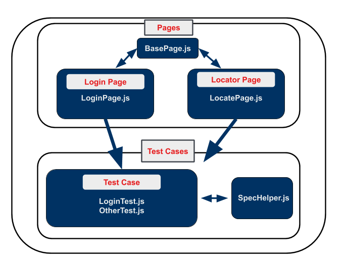

Rather than integrate the calls to Selenium directly into your test methods, you can create separate classes. The POM allows you to write your tests using user-centric language, rather than Selenium-centric language.

Some general guidelines for creating page objects ( classes) include:

*   The public methods represent the services that the page offers
*   Try not to expose the internals of the page
*   Generally don't make assertions
*   Methods return other PageObjects
*   Need not represent an entire page

(Source: [https://github.com/SeleniumHQ/selenium/wiki/PageObjects](https://github.com/SeleniumHQ/selenium/wiki/PageObjects))

Different results for the same action are modeled as different methods. Using strategies like this means that when your application changes and your tests break, you only have to update your page objects in one place in order to accommodate the changes. This gives us reusable functionality across our suite of tests, as well as more readable tests.

### Imperative vs. Declarative Test Language

_Imperative language_ is language that gives you the step-by-step directions for how to do something. As an example, instead of telling someone to make a peanut butter and jelly sandwich (which is a declarative statement), imperative language would tell you to lay down two pieces of bread, spread peanut butter on one, spread jelly on the other, then put the pieces together.

What is the problem with this? It doesn’t give a good sense of the purpose of the task. An alien from outer space may put the sandwich together with the jelly-side facing out, since they don’t know what the end result is supposed to be.

#### Video

Take a look at this snippet of a Sauce Labs meetup talk by Titus Fortner to see an example of imperative and declarative language.

[3.02_Imperative_Declarative](https://drive.google.com/file/d/1zq2JBVjFwupuq2NbsrkW5vHrIOFR3xer/view?usp=sharing)


## 3.03 Your First Page Object

One of the biggest challenges with Selenium tests is that they can be brittle and challenging to maintain over time. This is largely due to the fact that things in the application you're testing change - like elements that appear on the screen or even the flow & layout of your website — causing your tests to break.

But the reality of a software project is that _change is a constant_. So you need to account for this reality somehow in our test code in order to be successful.

Enter Page Objects.


### Create Page Objects


#### Part 1: Create A Page Object And Update Test

Let's take our login example from earlier, create a page object for it, and update our test suite structure.

First we'll need to create a new folder called `pages` in the root of our project directory. In it we'll add a `LoginPage.js` file. When we're done, our directory structure should look like this:


Open `LoginPage.js` in your text editor and add in the following code:

```
// filename: pages/LoginPage.js
const USERNAME_INPUT = { id: 'username' }
const PASSWORD_INPUT = { id: 'password' }
const SUBMIT_BUTTON = { css: 'button' }
const SUCCESS_MESSAGE = { css: '.flash.success' }

class LoginPage {
  constructor(driver) {
    this.driver = driver
  }

  async load() {
    await this.driver.get('http://the-internet.herokuapp.com/login')
  }

  async authenticate(username, password) {
    await this.driver.findElement(USERNAME_INPUT).sendKeys(username)
    await this.driver.findElement(PASSWORD_INPUT).sendKeys(password)
    await this.driver.findElement(SUBMIT_BUTTON).click()
  }

  async successMessagePresent() {
    return await this.driver.findElement(SUCCESS_MESSAGE).isDisplayed()
  }
}

module.exports = LoginPage
```

At the top of the file, create some variables for the four items you are using on the [login page](https://the-internet.herokuapp.com/login) These are for the locators you want to use on the page.

Then, declare the class by specifying its constructor, `constructor(driver) {}`. This block will run whenever a new instance of the class is created. This class accesses the Selenium driver object, and stores it in the `this.driver` field, which enables the rest of the class to use it.

The second method, `load()`, is responsible for navigating to the page. This has to be in a separate function so it occurs after you load the driver.

The third method, `authenticate(username, password)` is the core functionality of the login page. It fills in the login form and submits the data using the variables you just created. Later, you'll put these variables in a separate class so they can be used by multiple page objects.

The last method, `successMessagePresent()`, checks to see that the final success message is present on the screen after you log in.

**The intended image below is missing from the assets directory -NS**


The class ends with `module.exports = LoginPage;`, which makes it available for other classes to call and use the methods within the `LoginPage.js`.


#### Part 2: Update LoginTest.js to use the Page Object

Now open the file in the test folder named `LoginTest.js`. You will add a few things into the test so that it can work with the `LoginPage.js` file you just created.

Under the `const assert`, add

```
// filename: pages/LoginTest.js
//...
const LoginPage = require('../pages/LoginPage')
```

Inside the `Describe()` function, after `let driver` variable instantiation, instantiate another variable called `login`:

```
// filename: pages/LoginTest.js
//...
    let login
```

Inside the `beforeEach()` function, after `driver = await new Builder().forBrowser('firefox').build()`, add:

```
// filename: pages/LoginTest.js
//...
  login = new LoginPage(driver)
  await login.load()
```

Lastly, you are going to completely change the test inside of the `it()` function. Now you will write the test as one action and an assertion.

```
// filename: pages/LoginTest.js
//...
 it('with valid credentials', async function() {
    await login.authenticate('tomsmith', 'SuperSecretPassword!')
    assert(await login.successMessagePresent(), 'Success message not
    displayed')
  })
```

Notice how you have switched from _imperative_ to _declarative_ language. Instead of giving step by step instructions to the driver to find the elements individually and send the login information step by step, the new code just tells you to `authenticate`, then asserts that the success message is present.

Review the [example project code](https://github.com/walkerlj0/Selenium_Course_Example_Code/tree/master/javascript/Mod3/3.03) for reference.

#### Final Code

Your new code in `LoginTest.js` should look like this:


Run npm test and you should get this success message:

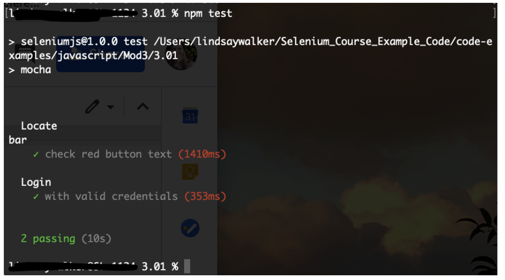

See the complete [source code here](https://github.com/walkerlj0/Selenium_Course_Example_Code/tree/master/code-examples/javascript/Mod3/3.02). Note that you have to run `npm install` in the root project folder before being able to use code pulled down from a repository.

## 3.04 Writing Code with Error Handling

When you write tests, you are checking for one specific thing to occur. In the last example, you were checking for a specific situation where the user logs onto the login page, enters their username and password, and then they get a message indicating their success.

There is more than one reason, however, why that test might fail. The test you wrote kind of assumes that the user and server for the website did everything right, and is testing to see if the app responds with a success message as expected. Some other reasons why the success message might not display include:

*   The user enters the wrong username and/or password
*   The page fails to load properly in the first place

The term _Error Handling_ refers to creating cases that check for predictable negative outcomes or conditions so when the test is run, it accounts for other possible errors or failure cases.

### Part 1: Test for Invalid Login Credentials

Creating a page object may feel like more work than what you started with initially, but it's well worth the effort. Now that you have the entire process for things like the `authenticate()` method which completes several actions with one method, you can use it over and over again in multiple tests, and only have to make changes in one place.

Let's add a test that checks for a failed login to demonstrate.

First, let's take a look at [the markup](https://the-internet.herokuapp.com/login) that renders when you provide invalid credentials:

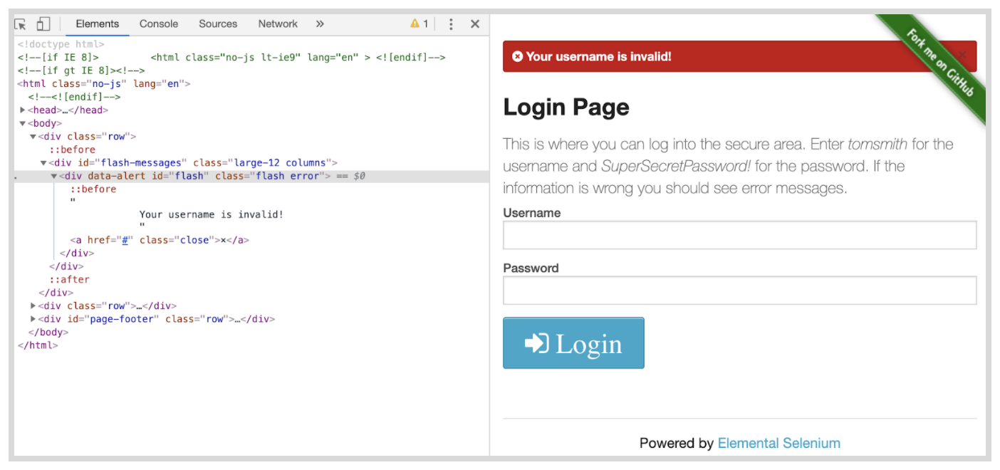


We will use the `flash error` classes in our assertion. Open `LoginPage.js`. Insert a new variable below ‘SUCCESS_MESSAGE’

```
//filename pages/LoginPage.js.
// ...
const FAILURE_MESSAGE = {css: '.flash.error'}
```

Below the function `successMessagePresent(){}` insert:

```
//filename pages/LoginPage.js.
// ...
    async failureMessagePresent() {
        return await
     this.driver.findElement(FAILURE_MESSAGE).isDisplayed()
  }
```

Next, go to `test/loginTest.js`. Under the first `it()` statement, insert another `it()` that says:

```
//filename test/LoginTest.js.
// ...
    it('with invalid credentials', async function() {
        await login.authenticate('tomsmith', 'bad password')
    assert(await login.failureMessagePresent(), 'Failure message not
    displayed')
  })
```

Run `npm test` and you should get this error message:


> **NOTE:** Why does this work? Think about the page interaction. After you click the login, if it was successful, then the error message (with the class `.flash.error`) will not show up, only the success message is displayed, and that element will not exist to interact with, therefore the test will fail.


#### Final Code

The updated `LoginPage.js` code should look like this:

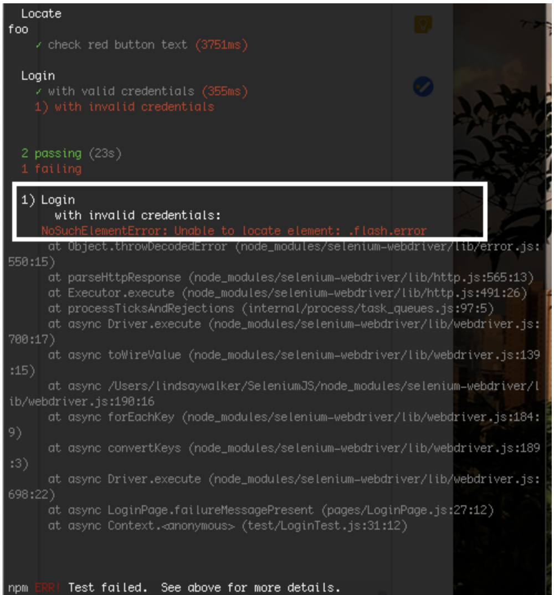


### Part 2: Check the Page

Before you can call our page object complete, there's one more addition you should make. We'll want to add a check to make sure that Selenium is on the right page before proceeding, which will in turn, add some resiliency to our tests.

At the top of the page In the file `LoginPage.js`, at the top of the variable list, add in a new variable that checks the id of the login page to make sure it shows up.

```
//filename pages/LoginPage.js.
// ...
const LOGIN_FORM = { id: 'login' }
...
```

In the same file, within the `load()` function, right after `await this.driver.get('herokuapp.com...')`, insert the following code:

```
//filename pages/LoginPage.js.
// ...
    if (!(await this.driver.findElement(LOGIN_FORM).isDisplayed()))
      throw new Error('Login form not loaded')
  })
```

When you navigate to and load our login page, you need to check to see that the login form is displayed after navigating there. This code will provide the message ‘Login form not loaded’ so the tester can see that the issue is with loading the page.

If you run your code (`npm test` in your project folder), you should get the same message (the locate and ‘with valid credentials' tests should pass, 'with invalid credentials' will not), however now, if the issue with the test is with that page loading, you have an alert that checks for it. When the page doesn’t load correctly, the error ‘Login form not loaded’ will appear.

See the complete [source code](https://github.com/walkerlj0/Selenium_Course_Example_Code/tree/master/javascript/Mod3/3.04). Note that you have to run `npm install` in the root project folder before being able to use code pulled down from a repository.

#### Final Code

The code for the the LoginPage should now look like this:

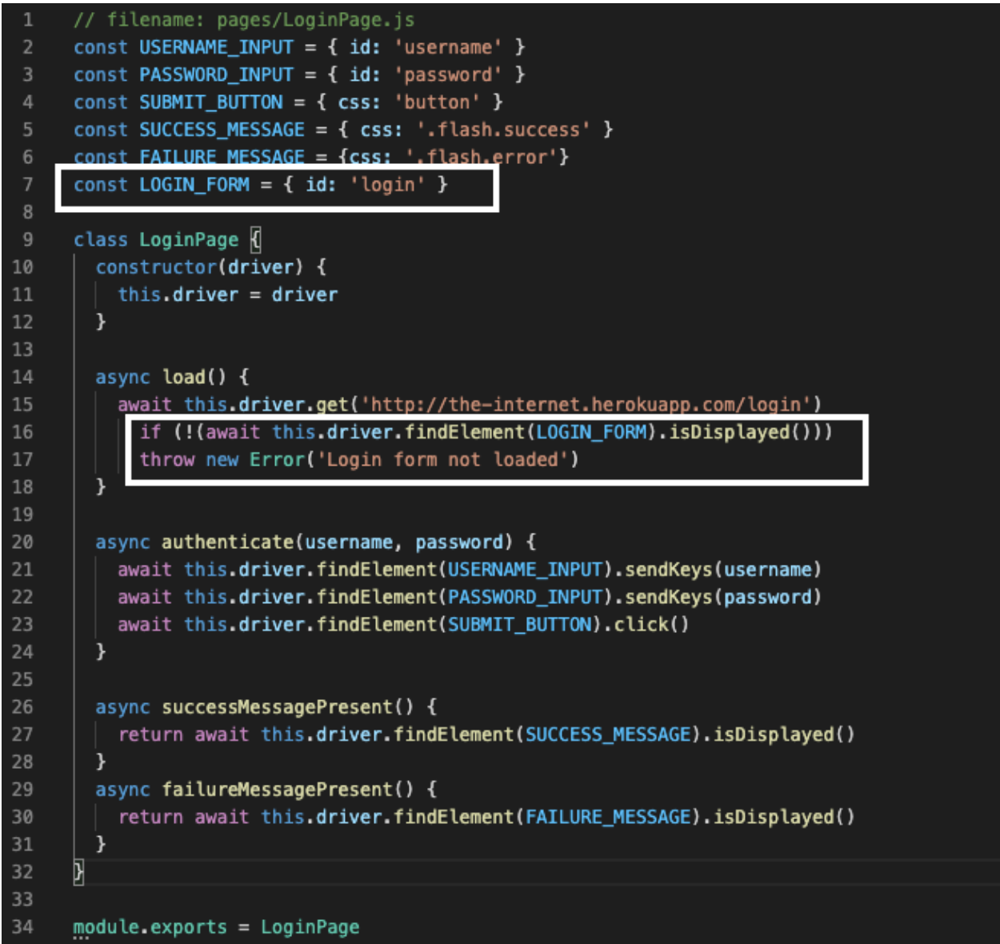

## 3.05  Common Issues with Test Code Reuse

In the previous lesson, you stepped through creating a simple page object to capture the behavior of the page you were interacting with. While this is a good start, there's more you can do.

As our test suite grows, and you add more page objects, you will start to see common behavior that you will want to use over and over again throughout our suite. If you leave this unchecked you will end up with duplicative code which will slowly make our page objects harder to maintain.

Right now you are using Selenium actions directly in your page object. While on the face of it this may seem fine, it has some long term impacts, like:

*   It can slow page creation & rendering due to the way the JavaScript or other library loads things on the page
*   You may need to update your test code (added maintenance for each page) because of updates and changes to the [Selenium API](https://www.selenium.dev/selenium/docs/api/javascript/index.html)
*   The inability to swap out the driver for your tests. You may in the future, for instance, want to swap out commands in Selenium for commands in Appium (for mobile testing)

What you will do now is set up a Base Page that will create descriptive variables and methods, then use those created methods to interact with other pages. This way, if you need to swap out, say, a Selenium method for an Appium method, instead of having to do it in each and every page, you can change the BasePage.js methods to Appium-specific ones, and not have to change all of your other pages.


### Part 1: Create a Facade Layer

A _facade layer_ is when an fpage is created that helps you simplify the language to carry out simple commands like `await this.find(locator).sendKeys(inputText)` or  `await this.find(locator).isDisplayed`, as well as check an assertion after, and simplify this process into a single command like `type()` or `find()` so that these methods can be easily used by the rest of the test suite. In this lesson, you will create a simplified interface called `BasePage.js`, which you will then use within our `LoginPage.js` class.

First let's add a new file called `BasePage.js` in the `pages` directory. At this point, you can also delete `LocatorTest.js` as you won’t be using any longer.

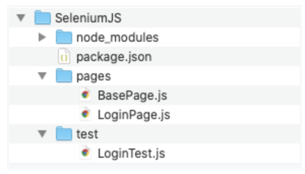

### Deleting Tests

Even though you may have grown attached to tests, it can often be a huge help to your testing suite to just delete tests that aren’t worth your time. Ask yourself the following questions:

*   How important is this test? (Do you really need to locate & return what that button says?)
*   How likely is this test to fail if the code changes? (High likelihood? Delete or refactor!)
*   How likely is this test due to fail if things run slowly?
*   How likely is this test to take up a lot of QA time figuring out why it failed?
*   How many individual pieces of functionality does this test actually check? (if it’s more than one it’s time to delete or refactor it into separate tests)

Too many tests can be an even bigger problem for a QA team than too few. Figuring out how and why a test fails takes up more time than it is worth, and impedes the feedback a dev team needs to push a feature into production. Take the time to consider the balance between `testAllTheThings()` and testing efficiently and effectively, and don’t be afraid to delete tests and or useless objects and start fresh.

**GIPHY BYE PLACEHOLDER**

Next let's open `BasePage.js `in your IDE and insert the following code:

```
// filename: pages/BasePage.js
class BasePage {
  constructor(driver) {
    this.driver = driver
  }

  async visit(url) {
    await this.driver.get(url)
  }

  find(locator) {
    return this.driver.findElement(locator)
  }

  async click(locator) {
    await this.find(locator).click()
  }

  async type(locator, inputText) {
    await this.find(locator).sendKeys(inputText)
  }

  async isDisplayed(locator) {
    return await this.find(locator).isDisplayed()
  }
}

module.exports = BasePage
```

In this module, you declare a BasePage class along with methods for all of the common behavior you use with Selenium  (`visit`, `find`, `click`, `type`, and `isDisplayed`). You also have a constructor that enables you to pass in and store an instance of the driver, so you don't have to explicitly pass it to the methods whenever you call them.

Now open `LoginPage.js` from the same folder, and import the base page class you just created by putting `const BasePage = require('./BasePage')` right at the top above all the variables, and the code to make LoginPage an extension of BasePage (this part goes after the variables and before `async load()`).

```
// filename: pages/LoginPage.js
const BasePage = require('./BasePage')

const ...
/Users/lindsaywalker/selenium-guidebook/book/javascript/content/chapters/09.md

class LoginPage extends BasePage {
  constructor(driver) {
    super(driver)
  }
```

First, modify the class `LoginPage.js` to inherit from BasePage and the command in the class. Inside of the functions `async load(), async authenticate(), successMessagePresent(), and failureMessagePresent()` you are going to replace the methods that interact with the page.

```
// filename: LoginPage.js
class LoginPage extends BasePage {
  constructor(driver) {
    super(driver)
  }

  async load() {
    await this.visit('http://the-internet.herokuapp.com/login')
    if (await !this.isDisplayed(LOGIN_FORM))
      throw new Error('Login form not loaded')
  }

  async authenticate(username, password) {
    await this.type(USERNAME_INPUT, username)
    await this.type(PASSWORD_INPUT, password)
    await this.click(SUBMIT_BUTTON)
  }

  successMessagePresent() {
    return this.isDisplayed(SUCCESS_MESSAGE)
  }

  failureMessagePresent() {
    return this.isDisplayed(FAILURE_MESSAGE)
  }
}
```

A few things have changed in our Login page object. We've imported the base page class you want to use, established inheritance between the two classes, and we've swapped out all of our Selenium commands with calls to the methods in the base page object (e.g., `this.visit, this.type, this.click`).

#### WHY?

In other words, instead of having to type out all this, using Selenium-specific commands, to find an id on the page and input a username:

```
await this.driver.findElement(USERNAME_INPUT).sendKeys(username)
```

You can simply type:

```
await this.type(USERNAME_INPUT, username)
```

It’s easier to read and understand that `this.type` wants you to type this in there, without having to specify the `driver`, `findElement` and `sendKeys` methods, etc.

#### NOTE – Inheriting from the Base Page

To establish inheritance, you used the `extends` keyword when declaring the class (example; class `LoginPage extends BasePage {})`, and call `super` from the constructor `super(driver)`. This passes the instance of Selenium to the base page object, and makes all of the base page object's methods available to our login page object (through `this`.).

If you save everything and run your tests, they will run and pass just like before. But now your page objects are more readable, simpler to write, and easier to maintain and extend.

#### Final Code

Your final code at this stage should look like this:

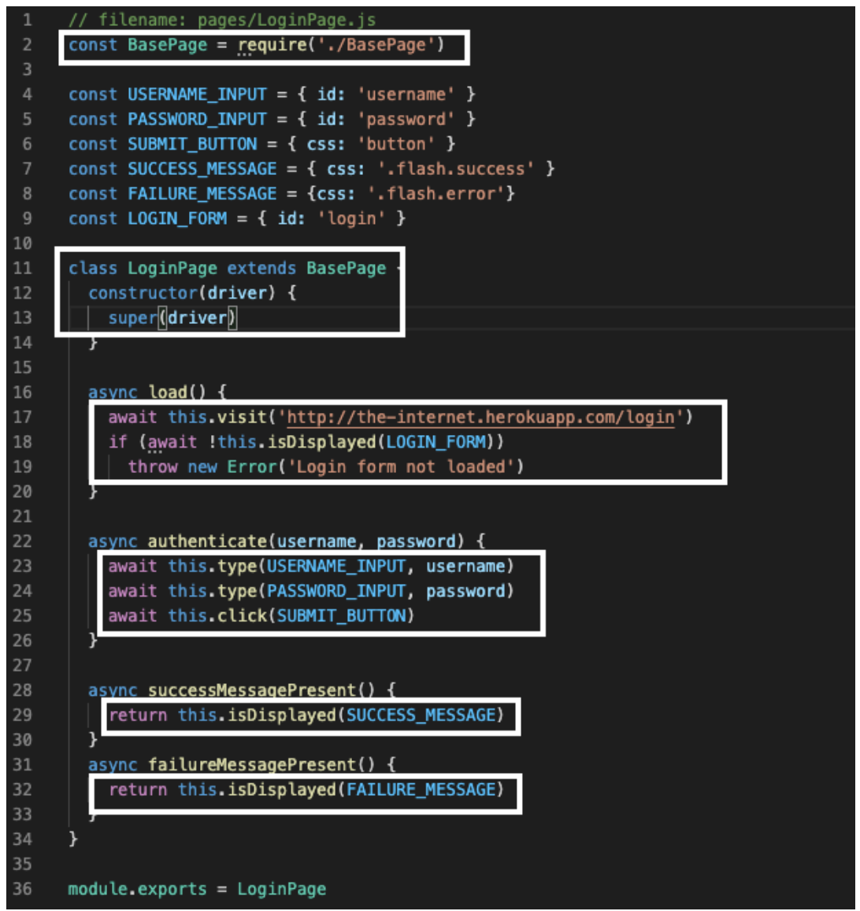

### Part 2: Fix NoSuchElement Error

Notice how you have been getting errors saying ‘no such element’ since either the `.flash.success` or` flash.error` will appear (but never both!).


It’s time to fix that. First go to` BasePage.js` and update the `async isDisplayed()` function to the following:

```
// filename: pages/BasePage.js

async isDisplayed(locator) {
  try {
    return await this.find(locator).isDisplayed()
  } catch (error) {
    return false
  }
}
```

When an error occurs, JavaScript will normally stop and generate an error message. This is called throwing an exception.

In this next example, you use a [try… catch](w3schools.com/js/js_errors.asp) statement to tell the program what to do when it encounters an error (in this case, it didn’t find an element) so you can continue running the next tests without exiting the test (throwing an exception).

##### Cheat Sheet

[3.04 Exception Handling Cheat Sheet](https://docs.google.com/document/d/1XNjmsOWqCvdcsnmAgIKgRNJPsKxRxDFv_XKnsw8IYzs/edit?usp=sharing)

Next, in  `LoginTest.js` make a change to check that and validate that it is true that the success message is not present. Comment out the current code in the `it()` function ‘with invalid credentials', and enter the following:

```
// filename: pages/LoginTest.js
//...
it('with invalid credentials', async function() {
    await login.authenticate('tomsmith', 'BadPassword!')
    assert(!(await login.failureMessagePresent()), 'Failure message displayed')
  })
```

Now when you run your test (`npm test` in terminal from your project folder), you should see one passing and one failing test. Notice that in the above example the password is `BadPassword!`. This test should fail, because there is an incorrect password, and now you will get the error message without an exception being thrown. This was thrown because the test detected that the ‘failure message’ did in fact show up.

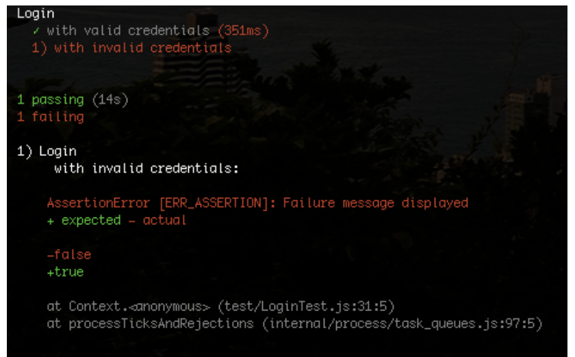

Let's change the password back to `SuperSecretPassword!` and rename the test ‘not invalid credentials’. This way, from here on out, you will get a passing test as long as the credentials are valid, otherwise you will be alerted that the test failed because of login credentials.

```
  it('not invalid credentials', async function() {
    await login.authenticate('tomsmith', 'SuperSecretPassword!')
    assert(!(await login.failureMessagePresent()), 'Failure message displayed')
  })
```

When you run your test, you should get two success messages:

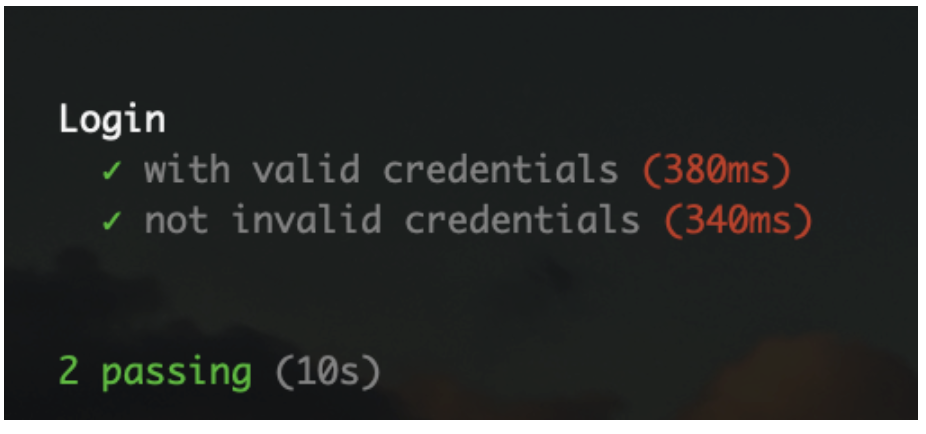

Review the [final code](https://github.com/walkerlj0/Selenium_Course_Example_Code/tree/master/javascript/Mod3/3.05) for the project in this lesson.

#### Final Code

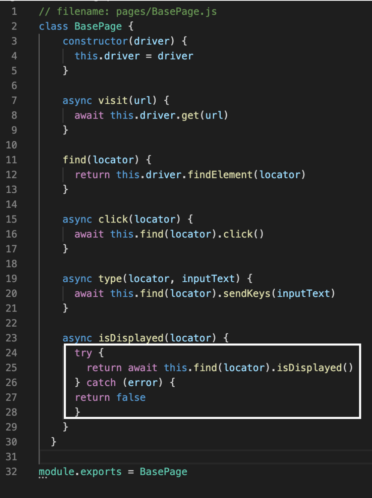


Review the [complete source code](https://github.com/walkerlj0/Selenium_Course_Example_Code/tree/master/code-examples/javascript/Mod3/3.04). Note that you have to run `npm install` in the root project folder before being able to use code pulled down from a repository.

### Quiz

1. What are the reasons you created `BasePage.js`? Pick the most correct answer.
  <ol type="a">
    <li>You are lazy and don’t want to have to write code as many times, and you know the code will never change, so you can just put it all in BasePage and forget about it.</li>
    <li>You want to give people writing tests only five options to create tests with, (`visit, find, click, type, isDiplayed`) so they don’t make overly complex tests, so you created these in BasePage.</li>
    <li>You aren’t using the functionality of `this.driver.get(`) or` this.driver.FindElement()`, so you put it in a separate document that won’t be used in our test suite.</li>
    <li>You want to be able to make other pages you make, like` LoginPage.js ` more readable, as well as reuse basic code so it’s easier to update in one place, and take effect everywhere.</li>
  </ol>
1. Without the following code, what problem might the person running your tests encounter?
  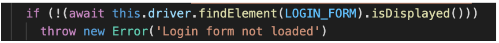
  <ol type="a">
    <li>They wouldn’t correctly detect an unsuccessful login</li>
    <li>They would get an error that the failure message was present, but not the success message</li>
    <li>They would get an error that the success message was present, but not the error message</li>
    <li>They would get an error telling them that they hadn’t successfully loaded the login page</li>
  </ol>


## 3.06  Resilient Test Code and Timing — Page with Explicit Waits

Ideally you should be able to write your tests once and run them across all supported browsers. More often than not, however, you will run into unexpected problems running a test in all environments, and sometimes there may be a hack or two involved.

Choosing high quality locators will help with this, but there are still some issues to deal with; most notably, timing. This is especially true when working with dynamic, JavaScript heavy pages, which is more the rule than the exception in a majority of web applications you'll deal with.

But there is a simple way to design the bedrock of reliable and resilient Selenium tests — and that's how you wait for elements you want to interact with. The best way to do this is through the use of explicit waits.

### Explicit Waits

One important thing to understand with the Selenium framework is that each method you write requires a round-trip communication between the tests and the devices. When you use these tests on the cloud, and to test remote devices, the round trips can start to take a very long time.


A function like the `authenticate()` function here has a total of six “round trips” to do.

```
async authenticate(username, password) {
    await this.driver.findElement(USERNAME_INPUT).sendKeys(username)
    await this.driver.findElement(PASSWORD_INPUT).sendKeys(password)
    await this.driver.findElement(SUBMIT_BUTTON).click()
  }
```

In this example, there are six separate communications between the location the test is stored and the location where the devices you are testing are stored just to execute the `authenticate()` function above.

### Implicit vs. Explicit Waits

Explicit waits pause your test execution until a specified event triggers, which prevents errors due to lag. For example, you can ask your code to wait until something is clicked, until something loads on the page, and much more.

Implicit waits pause your test execution for a specified amount of time before continuing to the next function or class. You can also pause your test execution indefinitely (including any asynchronous commands within the program) with a `sleep` command, which would then require an additional command to "wake up" and continue.


Source: Kristin Schmit, Flickr ([https://www.flickr.com/photos/giraffecereal/5860286735](https://www.flickr.com/photos/giraffecereal/5860286735))

Explicit waits are applied to individual test actions. Each time you want to use one you specify an amount of time (in seconds) and the Selenium action you want to accomplish.

Implicit waits are generally not recommended, and also mixing explicit waits with implicit waits cause negative consequences. Many classes or functions have default timeouts, or the different waits may change or interfere with one another.

The only time you would want to use an implicit wait is to make sure your tests have enough time to run, especially when you move them to the cloud. When using waits, Selenium will repeatedly try an action until either it can be accomplished, or until the amount of time specified has elapsed. If the latter occurs, a timeout exception is thrown.

##### Cheat Sheet

[3.06 Waits Cheat Sheet](https://docs.google.com/document/d/18nZvzgw7ukpBMYw9iJJzNFBIfRr2-m8ZHnOi3tE9KXE/edit?usp=sharing)


### Create a Page with Explicit Waits

We’re going to use this page as an example that demonstrates waits against [a dynamic page on the-internet.](http://the-internet.herokuapp.com/dynamic_loading/1) The functionality is pretty simple — there is a button, and when you click it, a loading bar appears for five seconds. After that, it disappears and is replaced with the text Hello World!

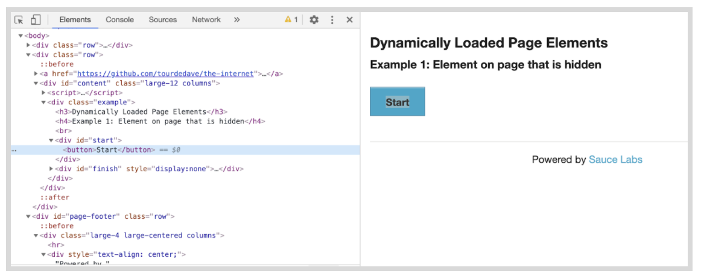


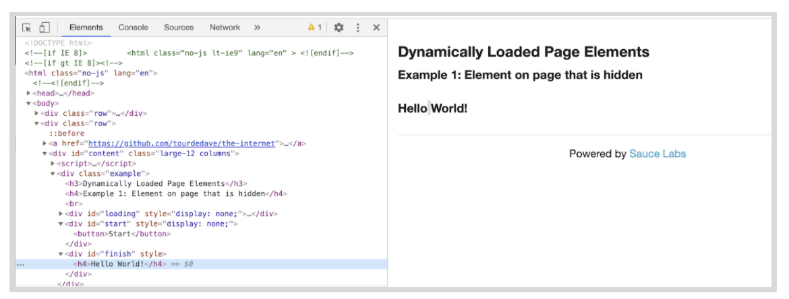

First we'll create a page object named `DynamicLoadingPage.js` in the pages directory.


Paste in the following code:

```
// filename: pages/DynamicLoadingPage.js

const BasePage = require('./BasePage')

const START_BUTTON = { css: '#start button' }
const FINISH_TEXT = { id: 'finish' }

class DynamicLoadingPage extends BasePage {
  constructor(driver) {
    super(driver)
  }

  async loadExample(exampleNumber) {
    await this.visit(
      'http://the-internet.herokuapp.com/dynamic_loading/' + exampleNumber
    )
    await this.click(START_BUTTON)
  }

  async isFinishTextPresent() {
    return this.isDisplayed(FINISH_TEXT, 10000)
  }
}

module.exports = DynamicLoadingPage
```

Next we'll use the locator of the start `&lt;button>` in the HTML page, as well as the `id = 'finish' ` for the “Hello World!” test that appears on the page for the` START_BUTTON` and `FINISH_TEXT` variables.

Since there are two dynamic loading page examples to choose from on the-internet, you created the method` loadExample()`. It accepts a number as an argument, so you can specify which of the examples you want to visit and start.

Similar to our Login page object, you have a function to check for the finish text, `isFinishTextPresent()`. This check is slightly different though. Notice that it has a second argument (an integer value of 10000). This bit of code is how we'll tell Selenium to wait (in milliseconds) for an element to be displayed before giving up.

Let's update the `isDisplayed `method in `BasePage.js`. First add in the `Until `variable at the top:

```
// filename: pages/BasePage.js
const Until = require('selenium-webdriver').until
// ...
```

Next, update the `isDisplayed()` function with the two explicit waits, `Until.elementLocated()` and `Until.elementIsVisible()`. Note that you are adding a parameter in the `isDisplayed()` function, an `if, else` statement, and placing the new explicit wait functionality within the `if` statement, and moving the `try...catch` block inside the `else` statement.

```
// ...
  async isDisplayed(locator, timeout) {
    if (timeout) {
      await this.driver.wait(Until.elementLocated(locator), timeout)
      await this.driver.wait(
        Until.elementIsVisible(this.find(locator)),
        timeout
      )
      return true
    } else {
      try {
        return await this.find(locator).isDisplayed()
      } catch (error) {
        return false
      }
    }
  }
}
// ...
```

Note the new `Until` module, which is a [collection of functions](https://www.selenium.dev/selenium/docs/api/javascript/module/selenium-webdriver/lib/until.html) that can be used with Selenium's wait function. You require and store it in a variable. You then update the `isDisplayed()` function to take an additional argument and use the `Until` variable you just created.

We call `driver.wait`, provide an initial condition that you want to wait for (wait until the element is located), the locator to wait for, and the timeout. `(Until.elementLocated(locator), timeout)`.

It’s important to do these in order so that first you locate the element (wait until that is completed), then you check (and wait) that the element is visible using `(Until.elementIsVisible(find(locator)`).


In the `else` block of `isDisplayed()` you account for the case where no timeout is provided when calling this function. When that happens the original behavior will be used (i.e., see if an element is displayed without waiting and return false if it's not present).

#### NOTE

The `timeout` parameter in both the `isDisplayed()` and `elementLocated` methods is set to 10 seconds. This allows time for a slowly loading page and plenty of time to check to see that the element has been located and check if it is visible. In this case, if the `isDisplayed()` function is called without the `timeout` parameter, it will try the same test without the locator (the code in the `else` block).

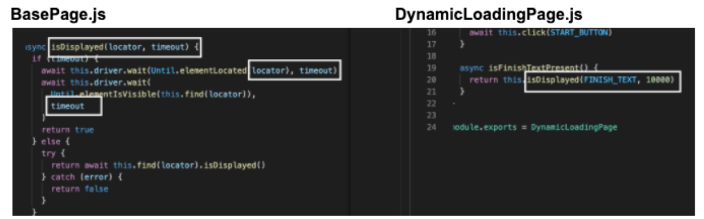

There are other conditions you can wait for besides `elementLocated()` or `elementIsVisible()`. You can find a full list [in the API documentation](http://seleniumhq.github.io/selenium/docs/api/javascript/module/selenium-webdriver/lib/until.html).

### Don’t Combine Explicit and Implicit Waits

The major benefit of explicit waits is that if the behavior on the page takes longer than you expect (e.g., due to slow load times, or a feature change), you can simply adjust a single wait time to fix the test — rather than increase a blanket, implicit wait time (which impacts every method of the test). And since the wait is dynamic, it won't take the full amount of time to complete (like a hard-coded sleep would).

If you're thinking about mixing explicit waits with an implicit wait, reconsider.  If you use both together you could run into issues later on due to inconsistent implementations of the implicit wait functionality across local and remote browser drivers. Long story short, you could end up with randomly failing tests that will be hard to debug. You can read more about the specifics [here](https://stackoverflow.com/questions/15164742/combining-implicit-wait-and-explicit-wait-together-results-in-unexpected-wait-ti#answer-15174978).

In this lesson you created `DynamicLoadingPage.js`, but have yet to create a test you can run against it, which you will do in the next lesson.

You can see the [code examples here](https://github.com/walkerlj0/Selenium_Course_Example_Code/tree/master/javascript/Mod3/3.06).

#### Final Code

The changes to the code at this point should look like this:

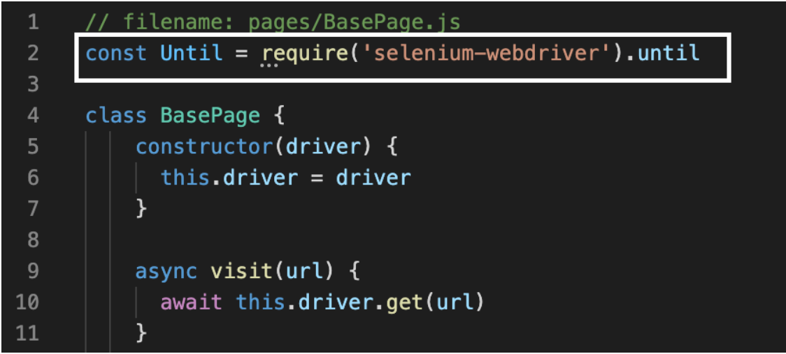

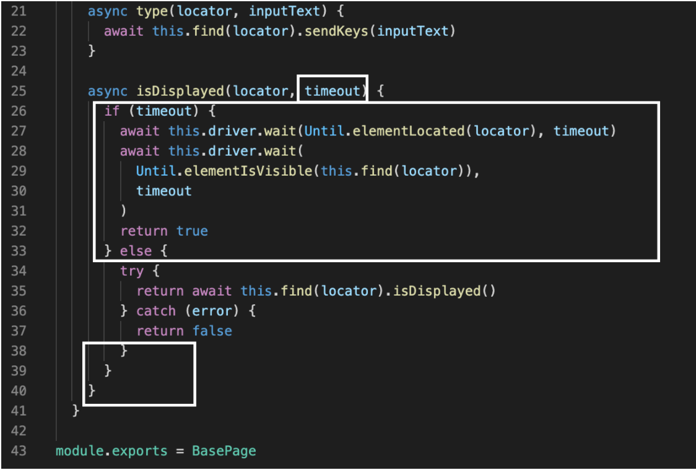


## 3.07  Testing with Explicit Waits

Now that you have our new page object and an updated base page, it's time to write our test to use it.

### Part 1: Dynamic Loading Test

Let's create a new file called `DynamicLoadingTest.js` in the test directory.


The contents of this test file are similar to `LoginTest.js` with regards to its setup and structure. Open `DynamicLoadingTest.js` in your IDE and paste in the following:

```
// filename: test/DynamicLoadingTest.js
const { Builder } = require('selenium-webdriver')
//const path = require('path')
const assert = require('assert')
const DynamicLoadingPage = require('../pages/DynamicLoadingPage')

describe('Dynamic Loading', function() {
  this.timeout(30000)
  let dynamicLoading

  beforeEach(async function() {
    const vendorDirectory =
      // path.delimiter + path.join(__dirname, '..', 'vendor')
      // process.env.PATH += vendorDirectory
      driver = await new Builder().forBrowser('firefox').build()
      dynamicLoading = new DynamicLoadingPage(driver)
  })

  afterEach(async function() {
    await driver.quit()
  })

  it('hidden element', async function() {
    await dynamicLoading.loadExample('1')
    assert(
      await dynamicLoading.isFinishTextPresent(),true, 'Finish text not displayed'
    )
  })
})
```

In our test, `'hidden element'`,  you are visiting the first dynamic loading example and clicking the start button (which is accomplished in `dynamicLoading.loadExample('1');)`. We're then checking that the finish text gets displayed, and reporting an error if it doesn’t

#### NOTE

You have included the path variable in the test code, and commented out the code for the path because if you are using npm, you don’t need it, but you will need it if you are managing dependencies yourself.

When you save this and run it with `npm test` from the command-line it will:

*   Launch a browser
*   Visit the page
*   Click the start button
*   Wait for the loading bar to complete
*   Find the finish text
*   Assert that it is displayed.
*   Close the browser

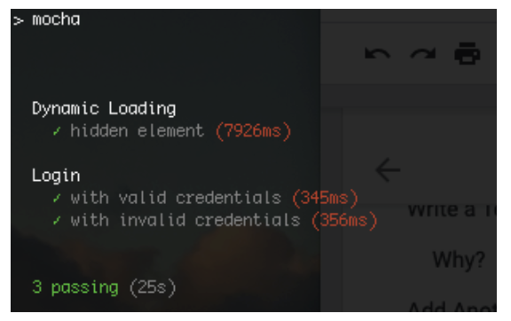

The `Login` test will be run as well.


### Part 2: Use the Test with Another Page

Let's step through one more example to see if our explicit wait holds up.


[The second dynamic loading example](http://the-internet.herokuapp.com/dynamic_loading/2) is laid out similarly to the last one. The difference is that it renders the final text after the progress bar completes (whereas the previous example had the element on the page but it was hidden until the progress bar finished). In other words, in the first test, the text was there but hidden, but in this test the text doesn’t even exist until after the loading image disappears.

Notice that it has the same start `&lt;button>` and `id='finished'` at the beginning and end of the test. Will our same test work for the second page?

Let's add a nearly identical second test to `DynamicLoadingTest.js` called `'rendered element'` that will load this second example and perform the same check (on the other page) as you did for the previous test.

```
// filename: test/DynamicLoadingTest.js
//...
  it('rendered element', async function() {
    await dynamicLoading.loadExample('2')
    assert(
      await dynamicLoading.isFinishTextPresent(), true, 'Finish text not displayed'
    )
  })
//...
```

Run the test. This time you are going to use a different command that allows us to run specific test objects, instead of all the tests in our test class. Open the terminal in your project folder and run the command `npm test -- --grep "Dynamic Loading"`

#### NOTE

The [grep](https://www.geeksforgeeks.org/grep-command-in-unixlinux/)command allows you to search for a certain set of characters when you run the mocha test. In this case, you are searching for and running the name of the test `Dynamic Loading`.


See the complete [source code here](https://github.com/walkerlj0/Selenium_Course_Example_Code/tree/master/javascript/Mod3/3.07). Note that you have to run `npm install` in the root project folder before being able to use code pulled down from a repository. You will be running just your Dynamic Loading test with the grep command at the end.

### Browser Timing

Using explicit waits gets you pretty far. But there are a few things you'll want to think about when it comes to writing your tests to work on various browsers.

Don't assume that tests that work in one browser will also work in other browsers. Often, different browsers operate at different speeds of execution and tests that pass on Firefox might fail on Chrome or Internet Explorer.

Chrome execution can sometimes be faster than Firefox, so you could see some odd timeout failures. This is an indicator that you need to add explicit waits to parts of your page objects that don't already have them. And the inverse is true when running things against Internet Explorer. This is an indicator that your explicit wait times are not long enough since the browser is taking longer to respond — so your tests timeout.

The best approach to solve this is an iterative one. Run your tests in a target browser and see which ones fail. Take each failed test, adjust your code as needed, and re-run it against the target browser until they all pass. Repeat for each browser you care about until everything is green.

### Closing Thoughts

By explicitly waiting to complete an action, our tests are in a much more resilient position because Selenium will keep trying for a reasonable amount of time rather than trying just once. And each action can be tuned to meet the needs of each circumstance. Couple that with the dynamic nature of explicit waits, and you have something that will work in a multitude of circumstances — helping you endure even the toughest of browsers to automate.

This is one of the most important concepts in testing with Selenium: _use explicits waits often._


#### Final Code


Run the test. This time you are going to use a different command that allows us to run specific test objects, instead of all the tests in our test class. Open the terminal in your project folder and run `npm test -- --grep "Dynamic Loading"`


## 3.08 Quiz

1. Why did you include a try… catch block in` BasePage.js`?
    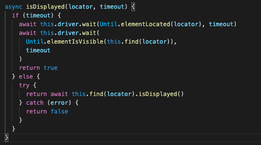
    <ol type="a">
      <li>We wanted to be able to use both the `elementIsVisible()` and the `isDisplayed() `methods to check if an element is on a page.</li>
      <li>We wanted to be able handle checking to see if an element is on the page with and without a `timeout` set.</li>
      <li>We wanted to be able to be able to use the newer is`Displayed()` method is the `elementIsVisible()` didn’t work.</li>
      <li>We wanted to check and see if an elements was on the page before and after a set timeout.</li>
    </ol>
1. Where is the method `isDisplayed()`declared (created)?
    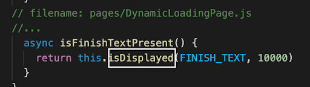
    <ol type="a">
      <li>BasePage.js</li>
      <li>DynamicLoadingTest.js</li>
      <li>DynamicLoadingPage.js</li>
      <li>LoginTest.js</li>
    </ol>
1. What is the difference between these two tests (on the two different dynamic loading pages on the-internet)?
  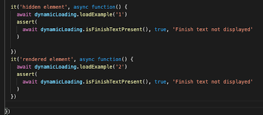
  <ol type="a">
    <li>The two different pages load and display elements differently, and you also need to have unique error codes so you can tell which has failed.</li>
    <li>There are two different pages, and you must always have different tests for different pages.</li>
    <li>There are different ids for the elements on the page you are trying to locate, so you had to write different tests & assertions for each one.</li>
    <li>We need to use a different Selenium method for each test, `elementIsVisible() `and `elementLocated(),` so you write two different tests.</li>
  </ol>
1. Where is the method `isFinishTextPresent() `declared (created)?
  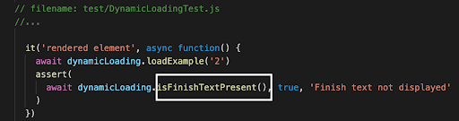
  <ol type="a">
    <li>BasePage.js</li>
    <li>DynamicLoadingTest.js</li>
    <li>DynamicLoadingPage.js</li>
    <li>LoginTest.js</li>
  </ol>
1. Which of the following best describes a facade layer like `BasePage.js`?
  <ol type="a">
    <li>A class that is created to separate code for implicit and explicit waits, so that one can avoid problems created by having both of these types of wait.</li>
    <li>A class that is created to write the more imperative language, specific to a testing language like Selenium, that can be swapped out.</li>
    <li>A class that is created for use with a specific programming language such as JavaScript or Python, so that the same test code can be used with different programming languages.</li>
    <li>A class that is created to be easy to read, with very declarative testing language.</li>
  </ol>
1. Which of the following is the biggest reason to use explicit waits instead of implicit waits?
  <ol type ="a">
    <li>Explicit waits will run no matter what, so you can be sure that all the waits in all the tests will be used.</li>
    <li>Explicit waits help you run tests on all elements in a codebase, even if they are not visible, and are not as dynamic, so you do not have to worry about them not running.</li>
    <li>Explicit waits are run in parallel and will run all waits at the same time, an are also dynamic, meaning they will never run out of order.</li>
    <li>Explicit waits are dynamic, and will run when they need to be run, and can prevent a test from continuing before an element is available, which could cause a `ElementNotVisibleException`.</li>
  </ol>

## 3.09 Challenge — Fix the Test Code

In this test suite you will have a simple set of tests. They include a base page, two page classes, and two test classes.  You will indicate where some problem code exists, and give you documentation that gives you examples on how to do it differently. I will point out where ‘problem code’ is located. It is up to you to make (____) number of changes. You will need to decide:

*   Do you have code written into a test object/class that should be in a page object/class?
*   Do you have code that needs to be written using better locators?
*   Do you have code written that needs an explicit wait?
*   Should you add a try… catch block so that test can be executed afterwards?
*   Do you need to add in an if, else statement so that a test can be run without a timeout?

    ```
...
    Code snippet
...
```

Download the test suite from this repo:

Suggested Solution


##### Cheat Sheet

[Common Selenium Commands Cheat Sheet 3.08](https://docs.google.com/document/d/1Oick2l5E1oHMr6KGXRgbfhQJePzw3tH4mxfjtDSGcqs/edit?usp=sharing)
